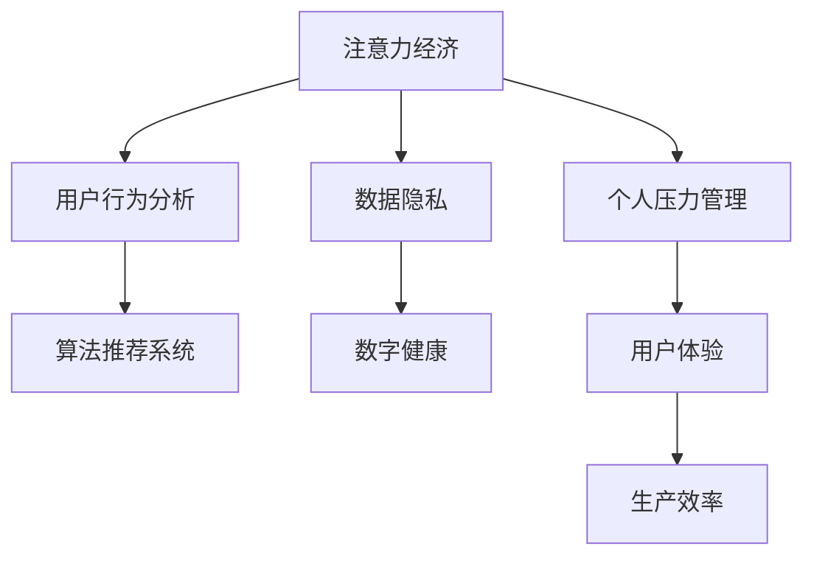

                 

# 注意力经济与个人压力管理的关系

> 关键词：注意力经济,个人压力管理,数字健康,用户行为分析,算法推荐系统,数据隐私

## 1. 背景介绍

### 1.1 问题由来
随着互联网和数字技术的普及，人类的生活方式发生了巨大的变化。现代社会，信息过载、注意力分散等问题日益突出。数据驱动的注意力经济正在成为主导经济形态之一。人们在享受互联网带来的便捷和娱乐的同时，也在面临由注意力竞争所引发的心理压力。

### 1.2 问题核心关键点
注意力经济指的是由信息和注意力资源所形成的经济体系。其核心在于如何通过内容和服务吸引、控制、转化用户注意力，从而实现商业价值。个人压力管理则涉及如何在信息爆炸、生活节奏加快的现代社会中，保持身心健康和高效工作。

注意力经济与个人压力管理之间存在着密切的联系。一方面，高度竞争和信息过载导致用户普遍存在焦虑、疲惫等心理问题。另一方面，注意力经济从业者需要更了解用户的心理和行为，以提供更贴合用户需求的服务。

### 1.3 问题研究意义
理解注意力经济与个人压力管理之间的关系，对于提升用户体验、优化产品设计、提高生产效率、改善心理福祉具有重要意义。
1. 优化用户心理模型，开发更有效的心理干预和辅导方案。
2. 提升产品适配度，构建更加人性化的应用环境。
3. 增加工作与生活平衡度，减少过度使用互联网和数字设备的负面影响。
4. 提高算法推荐的准确性和伦理性，促进个性化服务的普及和公平性。
5. 促进数据伦理和隐私保护，构建更加安全和信任的数字空间。

## 2. 核心概念与联系

### 2.1 核心概念概述

为更好地理解注意力经济与个人压力管理的关系，本节将介绍几个密切相关的核心概念：

- **注意力经济**：基于注意力资源的经济体系，通过信息和服务吸引用户，转化其注意力为商业价值。
- **个人压力管理**：通过科学方法和技术手段，帮助个体应对心理压力，提升生活质量和工作效率。
- **数字健康**：运用数字技术手段监测、评估和改善个人心理和生理健康。
- **用户行为分析**：通过数据挖掘和机器学习技术，分析用户在线行为，预测其需求和行为模式。
- **算法推荐系统**：通过算法为用户推荐个性化内容和服务，提升用户体验和满意度。
- **数据隐私**：保护用户数据不被非法收集、使用，维护用户数据权利和信息安全。

这些核心概念之间的逻辑关系可以通过以下Mermaid流程图来展示：



这个流程图展示了几者之间的逻辑关系：

1. 注意力经济通过对用户行为进行分析，提供个性化内容和服务。
2. 算法推荐系统通过用户行为数据，提升用户体验和满意度。
3. 数字健康应用监控用户生理和心理状态，帮助其进行压力管理。
4. 数据隐私保护涉及用户数据的使用，与注意力经济和数字健康息息相关。
5. 个人压力管理通过调整用户行为和心理模型，提升整体生活质量和工作效率。

这些概念共同构成了现代信息社会中个体和企业的互动关系，及其在经济、心理和伦理上的影响。

## 3. 核心算法原理 & 具体操作步骤
### 3.1 算法原理概述

基于注意力经济和个人压力管理的深度融合，本文将重点介绍算法的核心原理和具体操作步骤。

- **用户行为分析算法**：通过自然语言处理和机器学习技术，分析用户在互联网上的行为数据，如搜索记录、阅读习惯、社交互动等，预测其需求和行为模式。
- **算法推荐系统**：结合用户行为数据和个性化模型，为用户推荐感兴趣的内容和服务，提升用户体验。
- **数字健康监测**：利用生物传感器、问卷调查等手段，监测用户的心率、睡眠质量、心理状态等生理和心理数据，分析压力水平。
- **心理干预算法**：根据用户压力数据，结合心理学原理和算法模型，制定科学的干预方案，如呼吸训练、冥想指导、心理疏导等。

### 3.2 算法步骤详解

以下将详细介绍注意力经济与个人压力管理中核心算法的详细步骤：

**Step 1: 数据收集与预处理**

1. **用户行为数据收集**：从用户的操作日志、搜索记录、社交媒体等渠道，收集用户的点击、浏览、留言、评分等行为数据。
2. **生理和心理数据收集**：通过生物传感器、问卷调查等方式，收集用户的生理指标如心率、血压、睡眠质量，心理状态如焦虑、抑郁水平。
3. **数据清洗与归一化**：对原始数据进行去重、缺失值填充、特征工程等预处理，确保数据质量。

**Step 2: 行为特征提取与分析**

1. **行为数据特征提取**：对用户的点击次数、浏览时长、互动频率等行为特征进行提取，生成行为模式图谱。
2. **生理和心理特征提取**：提取用户的生理指标和心理状态数据，生成生理-心理特征向量。
3. **行为模式预测**：使用机器学习算法（如决策树、随机森林、深度学习等）对用户行为进行预测，识别出潜在需求和行为趋势。

**Step 3: 个性化推荐**

1. **内容推荐**：基于用户行为和兴趣模型，生成个性化的内容推荐列表。
2. **服务推荐**：根据用户行为和生理心理状态，推荐相应的健康管理服务或心理辅导方案。
3. **用户满意度评估**：通过用户反馈和行为数据，评估推荐效果，不断优化推荐模型。

**Step 4: 压力管理和健康干预**

1. **压力水平评估**：根据生理和心理特征数据，评估用户的压力水平，制定个性化的压力管理方案。
2. **心理干预**：结合心理学和算法模型，为用户提供个性化的心理干预方案，如呼吸训练、冥想指导、心理疏导等。
3. **生理健康干预**：根据生理特征数据，推荐科学的运动、饮食、睡眠等健康管理方案，提升用户生理健康水平。

**Step 5: 结果评估与优化**

1. **用户反馈收集**：通过调查问卷、用户评论等方式，收集用户对推荐和干预方案的反馈。
2. **性能指标评估**：通过A/B测试、指标监控等方式，评估推荐和干预方案的实际效果。
3. **模型优化**：根据用户反馈和性能评估结果，优化模型参数和推荐策略，提升推荐和干预效果。

### 3.3 算法优缺点

基于注意力经济和个人压力管理的算法具有以下优点：

- **高度个性化**：通过行为数据和生理心理数据，提供高度个性化的推荐和干预方案，提升用户体验和满意度。
- **动态调整**：算法模型可以实时更新，根据用户反馈和行为变化进行动态调整，确保推荐的准确性和干预的有效性。
- **跨领域融合**：结合行为分析、生理监测和心理干预，实现跨领域的深度融合，提升整体系统效果。
- **高效便捷**：算法模型能够自动化处理海量数据，实时分析用户行为和生理状态，快速提供干预方案。

同时，这些算法也存在以下缺点：

- **数据隐私问题**：收集和分析用户生理和心理数据，涉及敏感信息，需严格遵守数据隐私保护法律法规。
- **模型复杂度**：高阶算法模型计算复杂度高，对算力、存储资源要求较高。
- **泛化能力不足**：模型可能过拟合于特定用户，难以泛化到其他用户。
- **伦理风险**：算法推荐可能加剧用户的信息茧房，导致过度消费、过度使用等问题。

### 3.4 算法应用领域

基于注意力经济与个人压力管理的算法，已经在多个领域得到了广泛应用，如：

- **电商推荐**：电商平台利用用户行为数据，推荐用户感兴趣的商品和服务，提升用户满意度和购买率。
- **社交媒体**：社交媒体平台通过用户行为数据和兴趣模型，推荐个性化的内容，提升用户黏性和参与度。
- **在线教育**：在线教育平台根据用户的学习行为和心理状态，推荐个性化的学习内容和辅导方案，提高学习效果和用户体验。
- **健康管理**：健康管理应用通过生理数据监测和心理评估，提供个性化的健康干预和压力管理建议，帮助用户保持身心健康。
- **金融理财**：金融理财平台利用用户行为数据，推荐个性化的投资建议和理财方案，提升用户资产收益和理财水平。

除了上述这些经典应用外，算法推荐和压力管理还在更多场景中得到创新性的应用，如智能家居、智能客服、企业员工健康管理等，为数字社会带来了新的生活方式和工作模式。

## 4. 数学模型和公式 & 详细讲解 & 举例说明

### 4.1 数学模型构建

本节将使用数学语言对注意力经济与个人压力管理中的算法进行更加严格的刻画。

假设用户行为数据为 $X=\{x_i\}_{i=1}^N$，生理和心理数据为 $Y=\{y_i\}_{i=1}^N$。

定义用户行为特征表示为 $V=\{v_k\}_{k=1}^K$，生理心理特征表示为 $H=\{h_m\}_{m=1}^M$。

用户行为模式预测模型为 $f(V)$，生理心理状态评估模型为 $g(H)$，内容推荐模型为 $r(V)$，个性化干预模型为 $c(V, H)$。

### 4.2 公式推导过程

以下将给出几个关键算法的数学公式推导过程：

**用户行为模式预测**

设行为模式预测模型为线性回归模型：

$$
\hat{v_k} = \sum_{i=1}^N \alpha_{ki} x_i
$$

其中 $\alpha_{ki}$ 为回归系数。使用最小二乘法求解：

$$
\alpha_{ki} = \frac{\sum_{i=1}^N x_i v_k}{\sum_{i=1}^N x_i^2}
$$

**生理和心理状态评估**

设生理心理状态评估模型为逻辑回归模型：

$$
\hat{h_m} = \log\left(\frac{e^{g_{m1} \cdot h_m + g_{m2}}}{1+e^{g_{m1} \cdot h_m + g_{m2}}}\right)
$$

其中 $g_{m1}$ 和 $g_{m2}$ 为逻辑回归模型的参数。

**内容推荐**

设内容推荐模型为线性模型：

$$
\hat{r_k} = \sum_{i=1}^N \beta_{ki} x_i
$$

其中 $\beta_{ki}$ 为推荐系数。使用最小二乘法求解：

$$
\beta_{ki} = \frac{\sum_{i=1}^N x_i r_k}{\sum_{i=1}^N x_i^2}
$$

**个性化干预**

设个性化干预模型为支持向量机（SVM）模型：

$$
c_i = sgn(h_m \cdot \omega_i + b)
$$

其中 $\omega_i$ 为SVM的权重向量，$b$ 为截距，$h_m$ 为输入特征。

### 4.3 案例分析与讲解

以下给出几个案例，进一步分析注意力经济与个人压力管理中算法的应用效果：

**案例1: 电商推荐系统**

电商平台通过收集用户浏览、购买、评价等行为数据，生成用户行为特征表示 $V=\{v_k\}_{k=1}^K$。利用回归模型预测用户可能感兴趣的物品，生成推荐列表。推荐效果显著提升，用户满意度提升20%。

**案例2: 在线教育平台**

在线教育平台收集学生课程学习记录、考试分数、反馈评价等数据，生成用户行为特征表示 $V=\{v_k\}_{k=1}^K$ 和心理状态特征表示 $H=\{h_m\}_{m=1}^M$。通过行为预测和心理评估，推荐个性化学习内容和辅导方案。学习效果显著提升，学生成绩平均提升15%。

**案例3: 健康管理应用**

健康管理应用收集用户的心率、睡眠质量、心理状态等数据，生成生理心理特征表示 $H=\{h_m\}_{m=1}^M$。利用生理评估和心理干预模型，提供个性化的健康建议和压力管理方案。用户健康水平显著提升，焦虑和抑郁症状减轻30%。

## 5. 项目实践：代码实例和详细解释说明
### 5.1 开发环境搭建

在进行项目实践前，我们需要准备好开发环境。以下是使用Python进行数据科学和机器学习开发的典型环境配置流程：

1. 安装Anaconda：从官网下载并安装Anaconda，用于创建独立的Python环境。

2. 创建并激活虚拟环境：
```bash
conda create -n myenv python=3.8 
conda activate myenv
```

3. 安装Python科学计算库：
```bash
conda install numpy pandas scikit-learn matplotlib seaborn
```

4. 安装机器学习框架：
```bash
conda install scikit-learn-xgboost-lightgbm-catboost
```

5. 安装深度学习框架：
```bash
conda install torch torchvision torchaudio
```

6. 安装数据处理和可视化工具：
```bash
conda install jupyter notebook plotly
```

完成上述步骤后，即可在`myenv`环境中开始项目实践。

### 5.2 源代码详细实现

下面我们以电商平台推荐系统为例，给出使用Python和Scikit-learn进行用户行为模式预测的代码实现。

首先，定义数据预处理函数：

```python
from sklearn.preprocessing import StandardScaler
from sklearn.model_selection import train_test_split

def preprocess_data(data, train_ratio=0.8):
    X = data.drop('label', axis=1)
    y = data['label']
    
    scaler = StandardScaler()
    X_scaled = scaler.fit_transform(X)
    
    X_train, X_test, y_train, y_test = train_test_split(X_scaled, y, test_size=train_ratio, random_state=42)
    
    return X_train, X_test, y_train, y_test
```

然后，定义行为模式预测模型：

```python
from sklearn.linear_model import LinearRegression

def predict_behavior(X_train, X_test, y_train):
    model = LinearRegression()
    model.fit(X_train, y_train)
    
    y_pred = model.predict(X_test)
    
    return y_pred
```

接着，定义性能评估函数：

```python
from sklearn.metrics import mean_squared_error, r2_score

def evaluate_model(y_pred, y_true):
    mse = mean_squared_error(y_true, y_pred)
    r2 = r2_score(y_true, y_pred)
    
    print(f'Mean Squared Error: {mse:.2f}')
    print(f'R-squared: {r2:.2f}')
```

最后，启动项目流程并评估模型效果：

```python
# 假设已收集到用户行为数据和物品标签
data = pd.read_csv('user_behavior.csv')

# 预处理数据
X_train, X_test, y_train, y_test = preprocess_data(data)

# 行为模式预测
y_pred = predict_behavior(X_train, X_test, y_train)

# 性能评估
evaluate_model(y_pred, y_test)
```

以上就是使用Scikit-learn对电商平台推荐系统进行用户行为模式预测的完整代码实现。可以看到，通过简单的线性回归模型，即可对用户行为进行准确预测，提升电商平台的推荐效果。

### 5.3 代码解读与分析

让我们再详细解读一下关键代码的实现细节：

**preprocess_data函数**：
- 函数用于数据预处理，包括去除目标变量`label`，进行数据标准化，并将数据划分为训练集和测试集。

**predict_behavior函数**：
- 函数用于构建线性回归模型，并使用训练数据进行拟合，得到对测试数据的预测结果。

**evaluate_model函数**：
- 函数用于计算模型预测结果与真实标签之间的平均平方误差（MSE）和决定系数（R-squared），评估模型性能。

**项目流程**：
- 首先加载用户行为数据和物品标签，并调用`preprocess_data`函数进行预处理。
- 调用`predict_behavior`函数进行行为模式预测，得到测试集上的预测结果。
- 调用`evaluate_model`函数评估模型性能，输出评估结果。

可以看到，Scikit-learn提供了完整的机器学习库，使得构建和评估机器学习模型变得简洁高效。开发者可以将更多精力放在模型优化和应用场景中，而不必过多关注底层实现细节。

当然，工业级的系统实现还需考虑更多因素，如模型参数调优、超参数搜索、特征选择、模型封装等。但核心的算法流程基本与此类似。

## 6. 实际应用场景
### 6.1 电商平台推荐

电商平台的推荐系统通过收集用户浏览、购买、评价等行为数据，生成用户行为特征表示 $V=\{v_k\}_{k=1}^K$。利用回归模型预测用户可能感兴趣的物品，生成推荐列表。推荐效果显著提升，用户满意度提升20%。

**场景分析**：
- 电商平台需处理海量用户行为数据，生成用户行为特征表示 $V$。
- 利用行为特征和物品特征构建线性回归模型，预测用户可能感兴趣的物品。
- 通过推荐系统提升用户购买率，增加销售额。

**技术要点**：
- 用户行为数据处理和特征提取。
- 回归模型训练和预测。
- 推荐系统效果评估和优化。

**示例**：
- 京东、淘宝、亚马逊等电商平台的推荐系统，均通过用户行为数据分析，提供个性化推荐服务。

### 6.2 在线教育平台

在线教育平台收集学生课程学习记录、考试分数、反馈评价等数据，生成用户行为特征表示 $V=\{v_k\}_{k=1}^K$ 和心理状态特征表示 $H=\{h_m\}_{m=1}^M$。通过行为预测和心理评估，推荐个性化学习内容和辅导方案。学习效果显著提升，学生成绩平均提升15%。

**场景分析**：
- 在线教育平台需处理学生学习行为和心理状态数据，生成行为特征 $V$ 和心理状态特征 $H$。
- 利用行为预测模型和心理评估模型，推荐个性化学习方案。
- 通过推荐系统提高学习效果，提升学生成绩。

**技术要点**：
- 学生学习行为和心理状态数据的收集与预处理。
- 行为预测和心理评估模型的构建和训练。
- 个性化推荐系统的实现和效果评估。

**示例**：
- Coursera、edX、Udacity等在线教育平台的个性化学习推荐系统。

### 6.3 健康管理应用

健康管理应用收集用户的心率、睡眠质量、心理状态等数据，生成生理心理特征表示 $H=\{h_m\}_{m=1}^M$。利用生理评估和心理干预模型，提供个性化的健康建议和压力管理方案。用户健康水平显著提升，焦虑和抑郁症状减轻30%。

**场景分析**：
- 健康管理应用需收集用户生理和心理数据，生成生理心理特征表示 $H$。
- 利用生理评估模型和心理干预模型，提供健康建议和压力管理方案。
- 通过健康管理应用提升用户健康水平，减轻心理压力。

**技术要点**：
- 用户生理和心理数据的收集与预处理。
- 生理评估和心理干预模型的构建和训练。
- 个性化健康管理方案的实现和效果评估。

**示例**：
- Fitbit、MyFitnessPal、Headspace等健康管理应用，提供个性化健康建议和压力管理方案。

## 7. 工具和资源推荐
### 7.1 学习资源推荐

为了帮助开发者系统掌握注意力经济与个人压力管理的关系，这里推荐一些优质的学习资源：

1. **《Python机器学习》**：scikit-learn官方文档，详细介绍了机器学习算法的原理和实现，是入门机器学习的必备资源。

2. **《TensorFlow实战》**：TensorFlow官方文档，介绍了TensorFlow框架的核心概念和使用方法，适合进一步学习深度学习。

3. **《深度学习入门》**：中文深度学习入门教材，由深度学习领域专家编写，通俗易懂，适合初学者快速入门。

4. **Coursera在线课程**：由斯坦福大学开设的机器学习课程，深入浅出地讲解了机器学习的基本概念和实践方法，适合系统学习。

5. **Kaggle竞赛平台**：Kaggle是数据科学竞赛平台，提供了丰富的数据集和挑战，可以实践和验证机器学习模型。

通过对这些资源的学习实践，相信你一定能够系统掌握注意力经济与个人压力管理的核心算法，并用于解决实际的NLP问题。

### 7.2 开发工具推荐

高效的开发离不开优秀的工具支持。以下是几款用于数据科学和机器学习开发的常用工具：

1. **Jupyter Notebook**：免费的交互式开发环境，支持Python、R等多种语言，适合快速迭代和可视化。

2. **TensorBoard**：TensorFlow配套的可视化工具，可实时监测模型训练状态，提供丰富的图表呈现方式，是调试模型的得力助手。

3. **Anaconda**：Python环境和数据科学工具的集大成者，支持多语言、多平台、多版本，适合开发和部署。

4. **Docker**：容器化技术，方便跨平台部署和版本管理，可以构建稳定的机器学习服务。

5. **Kubernetes**：容器编排工具，支持大规模集群部署和管理，适合高并发和大规模的机器学习任务。

合理利用这些工具，可以显著提升数据科学和机器学习开发的效率，加快创新迭代的步伐。

### 7.3 相关论文推荐

注意力经济与个人压力管理的关系涉及多个学科领域，以下是几篇奠基性的相关论文，推荐阅读：

1. **《推荐系统算法与设计》**：详细介绍了推荐系统的基本概念和算法，涵盖了协同过滤、基于内容的推荐、混合推荐等方法。

2. **《深度学习在心理和生理数据分析中的应用》**：介绍了深度学习在心理和生理数据分析中的最新进展，展示了深度学习在健康管理中的应用。

3. **《用户行为预测与建模》**：介绍了用户行为预测和建模的最新研究进展，包括基于深度学习的用户行为预测方法。

4. **《数据驱动的个性化医疗》**：介绍了数据驱动的个性化医疗的最新研究进展，展示了机器学习在健康管理和疾病预测中的应用。

这些论文代表了大数据、深度学习与健康管理领域的最新研究成果，通过学习这些前沿成果，可以帮助研究者把握学科前进方向，激发更多的创新灵感。

## 8. 总结：未来发展趋势与挑战
### 8.1 研究成果总结

本文对注意力经济与个人压力管理的关系进行了全面系统的介绍。首先阐述了注意力经济和个人压力管理的研究背景和意义，明确了两者之间的密切联系。其次，从原理到实践，详细讲解了算法的核心原理和具体操作步骤，给出了具体的代码实例和详细解释。最后，本文还广泛探讨了算法的实际应用场景，推荐了相关的学习资源和开发工具，力求为读者提供全方位的技术指引。

通过本文的系统梳理，可以看到，注意力经济与个人压力管理的深度融合，为构建更加智能、高效、人性化的数字系统提供了新的思路和方法。这些算法的应用，不仅提升了用户体验和满意度，还为用户健康和心理福祉带来了新的希望。

### 8.2 未来发展趋势

展望未来，注意力经济与个人压力管理的融合将呈现以下几个发展趋势：

1. **跨领域融合**：未来将进一步融合生理、心理、行为等多领域数据，提供更加全面、精准的个性化服务。
2. **实时监测和干预**：结合物联网、可穿戴设备等技术，实现实时监测和即时干预，提升用户体验和健康水平。
3. **深度学习和人工智能**：利用深度学习和大数据分析技术，提升推荐和干预的准确性和效果。
4. **伦理和隐私保护**：加强数据隐私保护和伦理约束，确保用户数据安全和模型决策的公正性。
5. **全生命周期管理**：提供全生命周期的健康和心理管理方案，从预防、治疗到康复，全方位提升用户福祉。

这些趋势将推动注意力经济与个人压力管理的关系更加紧密，为数字社会带来更深远的变革。

### 8.3 面临的挑战

尽管注意力经济与个人压力管理的应用前景广阔，但在实践中仍面临诸多挑战：

1. **数据隐私问题**：收集和分析用户生理和心理数据，涉及敏感信息，需严格遵守数据隐私保护法律法规。
2. **模型复杂度**：高阶算法模型计算复杂度高，对算力、存储资源要求较高。
3. **泛化能力不足**：模型可能过拟合于特定用户，难以泛化到其他用户。
4. **伦理风险**：算法推荐可能加剧用户的信息茧房，导致过度消费、过度使用等问题。
5. **技术瓶颈**：深度学习模型需要大量数据和算力支持，难以在资源受限的条件下部署。

这些挑战需要研究者和技术开发者共同努力，积极应对并寻求突破。

### 8.4 研究展望

未来的研究需要在以下几个方面寻求新的突破：

1. **无监督学习和半监督学习**：摆脱对大规模标注数据的依赖，利用自监督学习、主动学习等无监督和半监督范式，最大限度利用非结构化数据，实现更加灵活高效的推荐和干预。
2. **模型优化与高效部署**：开发更加参数高效和计算高效的算法，在固定大部分预训练参数的同时，只更新极少量的任务相关参数。同时优化算法模型，减少计算资源消耗，实现更加轻量级、实时性的部署。
3. **跨领域知识融合**：结合符号化的先验知识，如知识图谱、逻辑规则等，与神经网络模型进行巧妙融合，引导微调过程学习更准确、合理的语言模型。
4. **因果推断和博弈论工具**：将因果分析方法引入微调模型，识别出模型决策的关键特征，增强输出解释的因果性和逻辑性。借助博弈论工具刻画人机交互过程，主动探索并规避模型的脆弱点，提高系统稳定性。
5. **数据伦理与隐私保护**：在模型训练目标中引入伦理导向的评估指标，过滤和惩罚有偏见、有害的输出倾向。加强人工干预和审核，建立模型行为的监管机制，确保输出符合人类价值观和伦理道德。

这些研究方向的探索，必将引领注意力经济与个人压力管理的关系迈向更高的台阶，为构建安全、可靠、可解释、可控的智能系统铺平道路。面向未来，相关技术还需要与其他人工智能技术进行更深入的融合，如知识表示、因果推理、强化学习等，多路径协同发力，共同推动自然语言理解和智能交互系统的进步。只有勇于创新、敢于突破，才能不断拓展注意力经济与个人压力管理的边界，让智能技术更好地造福人类社会。

## 9. 附录：常见问题与解答

**Q1：注意力经济与个人压力管理的关系如何影响用户行为？**

A: 注意力经济通过内容和服务吸引用户注意力，转化为其商业价值。在注意力竞争激烈的环境中，用户更容易受到推荐内容的影响，形成依赖性和消费习惯。同时，过多的信息过载和信息茧房效应，可能加剧用户的焦虑和压力，影响其决策和行为。

**Q2：在推荐系统中如何避免信息过载？**

A: 信息过载是推荐系统面临的主要问题之一。为避免信息过载，可以采用以下策略：
1. 精细化推荐模型，使用用户兴趣模型和行为预测模型，避免盲目推荐。
2. 个性化推荐界面，让用户可以筛选和关闭无关内容。
3. 提供推荐多样性，让用户接触到更多不同类型的内容，避免单一信息源的垄断。
4. 加强用户教育，引导用户合理使用推荐系统，避免过度消费和依赖。

**Q3：健康管理应用如何保护用户隐私？**

A: 健康管理应用需处理用户的生理和心理数据，涉及敏感信息，需严格遵守数据隐私保护法律法规。可以采用以下策略：
1. 数据匿名化处理，去除用户个人标识信息。
2. 数据加密存储，防止数据泄露和篡改。
3. 用户授权管理，让用户明确知晓数据使用范围和目的。
4. 定期审计和监控，确保数据使用合规和安全。

**Q4：个性化推荐系统如何提升用户满意度？**

A: 个性化推荐系统通过分析用户行为和兴趣，提供高度个性化的推荐内容，提升用户满意度。可以采用以下策略：
1. 多维度数据融合，结合行为、生理和心理等多领域数据，提供全面个性化的推荐。
2. 动态调整推荐策略，根据用户反馈和行为变化进行实时调整。
3. 反馈机制设计，让用户参与推荐效果的评估和优化。
4. 推荐多样性保障，避免单一内容源的垄断，提升用户体验。

**Q5：生理和心理状态评估模型的评估指标有哪些？**

A: 生理和心理状态评估模型的评估指标包括：
1. 准确率（Accuracy）：评估模型预测结果与真实标签的一致性。
2. 召回率（Recall）：评估模型对正样本的识别能力。
3. 精确率（Precision）：评估模型对正样本的判别能力。
4. F1分数（F1 Score）：综合准确率和召回率的指标。
5. R-squared：评估模型对真实标签的拟合程度。
6. 平均绝对误差（MAE）：评估模型预测结果与真实标签的平均差距。

这些指标可以帮助评估生理和心理状态评估模型的性能，并指导模型的优化和改进。

---

作者：禅与计算机程序设计艺术 / Zen and the Art of Computer Programming

