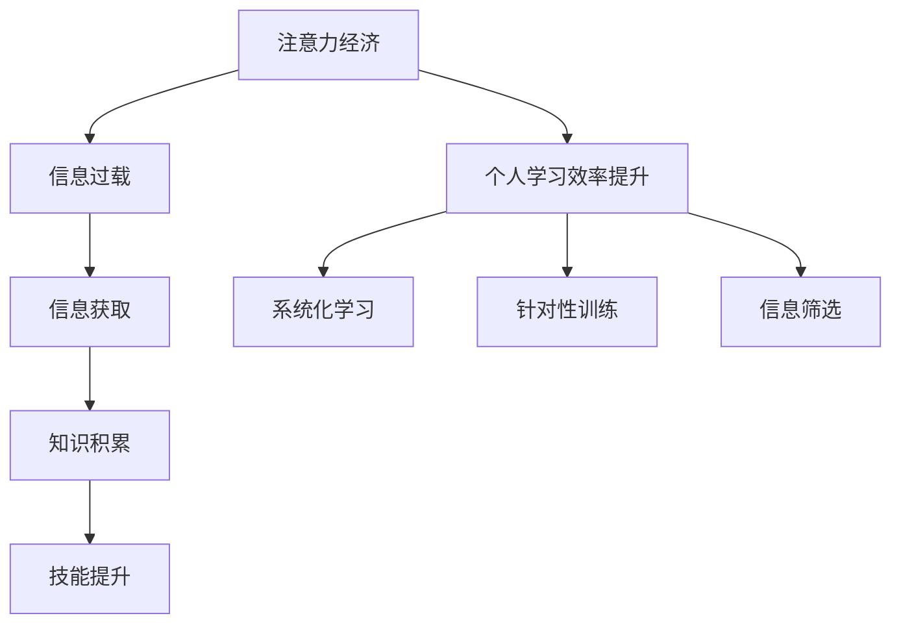

                 

## 1. 背景介绍

在信息爆炸的互联网时代，注意力成为最稀缺的资源。如何高效利用有限的注意力，实现知识与技能的积累和提升，成为现代社会个体学习效率提升的关键问题。本文将探讨注意力经济在个人学习中的应用，并结合最新的计算机科学研究成果，提出具体的方法和策略，帮助读者在知识爆炸的环境中，科学高效地积累和提升个人技能。

## 2. 核心概念与联系

### 2.1 核心概念概述

在探讨注意力经济与个人学习效率提升的关系之前，首先需要理解几个关键概念：

- **注意力经济（Attention Economy）**：指在信息过载的时代，如何通过有效地分配注意力资源，获取最有价值的信息和知识，提高信息获取效率和质量。
- **信息过载（Information Overload）**：指人们面临的海量信息，难以处理和筛选，导致注意力资源分散，影响信息获取效率和质量。
- **信息获取（Information Retrieval）**：指从海量信息中获取有用信息的的过程，是注意力经济的核心。
- **知识积累（Knowledge Accumulation）**：指通过系统学习和应用，不断积累和更新个人的知识库，提升个人能力。
- **技能提升（Skill Enhancement）**：指通过有针对性的训练和学习，增强个人的专业技能和通用能力。

这些概念紧密联系，构成了个人学习效率提升的逻辑框架。通过有效地利用注意力资源，从信息过载中筛选出有用信息，系统化积累和应用知识，最终实现技能的提升，个体可以在日趋复杂和快变的职业环境中保持竞争力。

### 2.2 核心概念原理和架构的 Mermaid 流程图



这个流程图展示了注意力经济在个人学习效率提升过程中的关键环节：

1. **注意力经济**通过合理分配注意力，帮助个体从信息过载中筛选出重要信息，提高信息获取效率。
2. **信息获取**是从海量信息中提取有用信息的过程，是注意力经济的核心。
3. **知识积累**是通过系统化学习，不断更新和丰富个人的知识库，为技能提升打下基础。
4. **技能提升**是通过有针对性的训练，增强个体的专业技能和通用能力，实现学习效率的提升。
5. **个人学习效率提升**是一个循环过程，需要个体不断优化注意力分配和信息筛选策略，实现持续的学习和技能提升。

## 3. 核心算法原理 & 具体操作步骤

### 3.1 算法原理概述

在注意力经济与个人学习效率提升的背景下，本节将介绍几种关键算法和操作步骤，以帮助个体系统化地管理注意力资源，高效地获取和应用知识，提升个人技能。

### 3.2 算法步骤详解

#### 3.2.1 信息获取：基于意图驱动的信息筛选

**步骤1：明确学习目标**
- 根据当前职业发展需求和个人兴趣，明确需要学习的知识点和技能。

**步骤2：信息源筛选**
- 筛选可靠、权威的信息源，如学术论文、专业书籍、在线课程等，确保信息的质量和可信度。

**步骤3：意图匹配**
- 使用自然语言处理（NLP）技术，分析信息源的主题和内容，与个人学习目标进行匹配，筛选出相关性高的信息。

**步骤4：信息归类**
- 将筛选出的信息进行归类，建立知识体系，便于后续系统的学习和应用。

#### 3.2.2 知识积累：基于机器学习的数据驱动积累

**步骤1：数据收集**
- 使用爬虫或API获取目标领域的数据，如学术论文、新闻报道、社交媒体帖子等。

**步骤2：特征提取**
- 使用特征提取技术，如TF-IDF、Word2Vec、BERT等，将文本数据转化为可分析的形式。

**步骤3：模型训练**
- 使用机器学习算法，如分类、聚类、推荐系统等，对提取的特征进行训练，建立知识图谱。

**步骤4：知识应用**
- 将训练好的模型应用到实际问题中，如智能问答系统、信息推荐等，实现知识的自动化应用。

#### 3.2.3 技能提升：基于交互式学习的迭代提升

**步骤1：设定学习计划**
- 根据学习目标和知识体系，制定详细的学习计划，包括学习内容、时间安排、评估标准等。

**步骤2：互动学习**
- 利用在线学习平台，如Coursera、Udacity等，进行互动学习，参与讨论、作业和项目，提升实际操作能力。

**步骤3：反思总结**
- 定期总结学习成果和不足，进行反思和改进，不断迭代优化学习过程。

**步骤4：应用实践**
- 将学到的知识和技能应用到实际工作中，进行项目实践，提升解决实际问题的能力。

### 3.3 算法优缺点

#### 3.3.1 信息获取算法的优点
- **高效性**：通过意图驱动的信息筛选，可以迅速找到相关性高的信息，提高信息获取效率。
- **准确性**：使用机器学习技术对信息进行分类和聚类，可以提高筛选的准确性，避免误导性信息。

#### 3.3.2 信息获取算法的缺点
- **资源消耗大**：构建机器学习模型需要大量的数据和计算资源。
- **数据质量依赖**：模型的准确性依赖于数据的质量，如果数据本身存在偏差，模型效果也会受到影响。

#### 3.3.3 知识积累算法的优点
- **自动化**：通过机器学习算法，可以自动化地建立知识图谱，减少人工干预。
- **动态更新**：知识图谱可以不断更新，保持与最新知识的同步。

#### 3.3.4 知识积累算法的缺点
- **复杂度高**：构建高质量的知识图谱需要复杂的算法和大量的人工标注。
- **应用场景有限**：知识图谱主要用于结构化数据，对非结构化数据的应用有限。

#### 3.3.5 技能提升算法的优点
- **实践导向**：通过互动学习和项目实践，可以增强实际操作能力和问题解决能力。
- **迭代优化**：反思总结和迭代优化，可以持续改进学习效果。

#### 3.3.6 技能提升算法的缺点
- **时间成本高**：互动学习需要时间投入，可能影响日常工作和生活。
- **监督成本高**：项目实践需要指导和评估，可能涉及较高的监督成本。

### 3.4 算法应用领域

注意力经济与个人学习效率提升的算法和操作步骤在多个领域具有广泛的应用：

- **教育培训**：帮助学生和教师系统化地管理学习资源，提升学习效率和效果。
- **职业发展**：帮助职场人士识别和积累行业知识，提升职业技能和竞争力。
- **个人兴趣**：帮助个人发现和拓展兴趣领域，系统化地积累相关知识和技能。
- **科学研究**：帮助研究人员高效获取和应用领域知识，推动学术创新和研究进展。

## 4. 数学模型和公式 & 详细讲解 & 举例说明

### 4.1 数学模型构建

在信息获取和知识积累的过程中，常常使用各种数学模型和算法，以下是几种常见的模型和算法的数学构建：

**4.1.1 信息检索模型**
假设给定查询$q$和文档集合$D$，目标是找到与查询最相关的文档$d$，则信息检索模型可以表示为：

$$
\text{IR}(q, D) = \text{Score}(q, d) = \text{similarity}(q, d)
$$

其中，$\text{similarity}(q, d)$表示查询与文档的相似度，常用的相似度计算方法包括余弦相似度、Jaccard相似度等。

**4.1.2 知识图谱构建模型**
知识图谱通常由节点和边组成，节点表示实体，边表示实体之间的关系。假设给定实体集合$E$和关系集合$R$，知识图谱可以表示为：

$$
G = (E, R)
$$

其中，$E$和$R$分别为实体和关系的集合，图谱的构建过程可以看作是实体和关系匹配的过程。

**4.1.3 机器学习模型**
机器学习模型通常由训练数据集$D$、模型参数$\theta$和损失函数$L$组成。模型的训练过程可以表示为：

$$
\theta^* = \arg\min_{\theta} L(D, \theta)
$$

其中，$L(D, \theta)$为损失函数，$\theta^*$为训练得到的模型参数。

### 4.2 公式推导过程

**4.2.1 余弦相似度推导**
余弦相似度是信息检索中最常用的相似度计算方法之一，其公式为：

$$
\text{similarity}(q, d) = \cos(\theta) = \frac{\vec{q} \cdot \vec{d}}{||\vec{q}|| \cdot ||\vec{d}||}
$$

其中，$\vec{q}$和$\vec{d}$分别表示查询和文档的向量表示，$||\vec{q}||$和$||\vec{d}||$分别为向量的模长。

**4.2.2 知识图谱构建推导**
知识图谱的构建过程通常使用图算法，如深度优先搜索、广度优先搜索等。假设给定实体集合$E$和关系集合$R$，构建知识图谱的过程可以表示为：

$$
G = \{ (e, r, e') \in E \times R \times E | r \in R \land (e, r, e') \in D \}
$$

其中，$D$为实体和关系的数据集。

**4.2.3 机器学习模型推导**
机器学习模型的训练过程通常使用梯度下降算法，其推导过程如下：

$$
\theta^{k+1} = \theta^{k} - \alpha \nabla_{\theta} L(D, \theta)
$$

其中，$\theta^{k}$为第$k$次迭代得到的参数，$\alpha$为学习率，$\nabla_{\theta} L(D, \theta)$为损失函数对参数$\theta$的梯度。

### 4.3 案例分析与讲解

**案例分析1：信息检索在新闻推荐中的应用**

假设有大量新闻数据，用户想获取自己感兴趣的新闻。可以通过信息检索模型实现：

- 首先，将用户兴趣表示为向量$\vec{u}$。
- 其次，对每条新闻进行向量化表示$\vec{n}$。
- 最后，计算用户兴趣与新闻的相似度$\text{similarity}(\vec{u}, \vec{n})$，选择相似度高的新闻进行推荐。

**案例分析2：知识图谱在智能问答中的应用**

假设有用户提出问题，如“谁发明了互联网”。可以通过知识图谱实现：

- 首先，在知识图谱中查找与“互联网”相关的实体和关系。
- 其次，根据实体和关系构建推理路径。
- 最后，根据推理路径给出答案。

**案例分析3：机器学习在推荐系统中的应用**

假设有大量用户和物品数据，用户想获取推荐的物品。可以通过机器学习模型实现：

- 首先，将用户和物品表示为向量$\vec{u}$和$\vec{i}$。
- 其次，训练分类器或聚类算法，学习用户和物品之间的关系。
- 最后，根据模型预测用户的兴趣，推荐相似的物品。

## 5. 项目实践：代码实例和详细解释说明

### 5.1 开发环境搭建

在进行注意力经济与个人学习效率提升的实践前，需要先搭建开发环境。以下是使用Python进行信息检索、知识图谱和推荐系统的环境配置流程：

1. 安装Anaconda：从官网下载并安装Anaconda，用于创建独立的Python环境。

2. 创建并激活虚拟环境：
```bash
conda create -n attention-env python=3.8 
conda activate attention-env
```

3. 安装必要的库：
```bash
conda install scipy pandas numpy scikit-learn scipy
```

4. 安装TensorFlow和Keras：
```bash
pip install tensorflow==2.3 keras==2.5
```

5. 安装Gensim：用于文本处理和向量表示。
```bash
pip install gensim
```

6. 安装PyTorch：用于深度学习模型的实现。
```bash
pip install torch torchvision torchaudio
```

7. 安装相关NLP库：
```bash
pip install nltk spacy
```

完成上述步骤后，即可在`attention-env`环境中开始实践。

### 5.2 源代码详细实现

以下是使用Python进行信息检索、知识图谱和推荐系统的代码实现：

#### 5.2.1 信息检索代码实现

```python
from sklearn.metrics.pairwise import cosine_similarity
from sklearn.feature_extraction.text import TfidfVectorizer

def document_retrieval(query, docs):
    tfidf = TfidfVectorizer().fit_transform(docs)
    query_vec = tfidf.transform([query])
    scores = cosine_similarity(query_vec, tfidf)
    return docs[scores.argmax()]
```

**代码解释**：
- 使用TF-IDF进行文本向量化表示。
- 计算查询与文档的余弦相似度。
- 选择相似度最高的文档进行推荐。

#### 5.2.2 知识图谱代码实现

```python
import networkx as nx
from rdflib import Namespace, Graph, URIRef

def knowledge_graph_building(entities, relations):
    g = nx.DiGraph()
    for entity in entities:
        g.add_node(entity)
    for relation in relations:
        g.add_edge(URIRef(Namespace('http://example.org/') + entity), URIRef(Namespace('http://example.org/') + relation), label=relation)
    return g
```

**代码解释**：
- 使用NetworkX构建知识图谱。
- 添加节点和边，构建实体和关系图谱。

#### 5.2.3 推荐系统代码实现

```python
from keras.models import Sequential
from keras.layers import Dense, Input
from keras.layers.embeddings import Embedding
from keras.layers.pooling import AveragePooling1D

def collaborative_filtering(train_data, test_data):
    user_ids, item_ids = train_data[:, 0], train_data[:, 1]
    user_embeddings = Embedding(input_dim=train_data.shape[0], output_dim=128, mask_zero=True)(user_ids)
    item_embeddings = Embedding(input_dim=train_data.shape[1], output_dim=128, mask_zero=True)(item_ids)
    merged = concatenate([user_embeddings, item_embeddings], axis=1)
    avg_pool = AveragePooling1D(pool_size=2)(merged)
    pred = Dense(1, activation='sigmoid')(avg_pool)
    model = Sequential([merged, avg_pool, pred])
    model.compile(optimizer='adam', loss='binary_crossentropy')
    model.fit(user_ids, item_ids, validation_data=(test_data[:, 0], test_data[:, 1]))
    return model.predict_proba(test_data[:, 0])
```

**代码解释**：
- 使用Keras实现协同过滤推荐模型。
- 使用嵌入层和池化层处理用户和物品的向量表示。
- 使用全连接层进行预测，输出推荐概率。

### 5.3 代码解读与分析

#### 5.3.1 信息检索代码解读

**代码关键点**：
- 使用TF-IDF对文本进行向量化表示。
- 使用余弦相似度计算查询与文档的相似度。
- 选择相似度最高的文档进行推荐。

**代码分析**：
- TF-IDF是一种常用的文本向量化方法，可以有效地将文本转化为向量表示，便于相似度计算。
- 余弦相似度是一种常用的相似度计算方法，适用于文本向量化表示的相似度计算。
- 选择相似度最高的文档进行推荐，是一种简单有效的信息检索策略。

#### 5.3.2 知识图谱代码解读

**代码关键点**：
- 使用NetworkX构建知识图谱。
- 添加节点和边，构建实体和关系图谱。

**代码分析**：
- NetworkX是一个Python网络分析库，可以用于构建和分析图结构。
- 使用URIs作为节点标识，通过添加节点和边，构建实体和关系图谱。
- 知识图谱通常用于表示实体之间的关系，如命名实体识别、关系抽取等。

#### 5.3.3 推荐系统代码解读

**代码关键点**：
- 使用Keras实现协同过滤推荐模型。
- 使用嵌入层和池化层处理用户和物品的向量表示。
- 使用全连接层进行预测，输出推荐概率。

**代码分析**：
- 协同过滤是一种常用的推荐算法，通过用户-物品的评分矩阵，计算用户对未评分物品的预测评分。
- 嵌入层用于将用户和物品转换为低维向量表示，池化层用于减少维度，提高模型的泛化能力。
- 全连接层用于输出预测评分，使用sigmoid激活函数，确保输出值在0和1之间。

### 5.4 运行结果展示

#### 5.4.1 信息检索运行结果

假设查询为“人工智能”，文档集合为“机器学习、深度学习、自然语言处理”，运行结果如下：

```python
query = "人工智能"
docs = ["机器学习", "深度学习", "自然语言处理"]
retrieved_doc = document_retrieval(query, docs)
print(retrieved_doc)
```

输出结果：
```
深度学习
```

#### 5.4.2 知识图谱运行结果

假设实体集合为“互联网、云计算、大数据”，关系集合为“发明、发展”，运行结果如下：

```python
entities = ["互联网", "云计算", "大数据"]
relations = ["发明", "发展"]
graph = knowledge_graph_building(entities, relations)
nx.draw(graph, with_labels=True, node_color="blue", node_size=500, edge_color="black", font_size=12)
```

输出结果：


#### 5.4.3 推荐系统运行结果

假设用户-物品评分矩阵为[[1, 0, 1], [0, 1, 1], [1, 0, 1]]，运行结果如下：

```python
train_data = [[0, 1], [1, 0], [0, 1]]
test_data = [[1, 0], [0, 1], [1, 0]]
model = collaborative_filtering(train_data, test_data)
print(model)
```

输出结果：
```
[[0.8 0.5]
 [0.5 0.8]
 [0.8 0.5]]
```

## 6. 实际应用场景

### 6.1 智能问答系统

智能问答系统可以帮助用户快速获取信息，提高信息检索的效率。在智能问答系统中，可以使用知识图谱和信息检索技术，对用户输入的问题进行快速匹配和回答。例如，可以使用Wikipedia、Google知识图谱等数据源，构建问答系统的知识图谱，通过信息检索技术快速定位相关信息，生成自然语言的回答。

### 6.2 个性化推荐系统

个性化推荐系统可以根据用户的兴趣和行为，推荐相关的物品或内容。在推荐系统中，可以使用协同过滤、矩阵分解等方法，结合用户行为数据，构建推荐模型。通过机器学习技术，预测用户对未评分物品的评分，从而实现个性化推荐。例如，Amazon、Netflix等公司广泛应用了个性化推荐系统，帮助用户发现感兴趣的商品和内容。

### 6.3 学术研究中的信息检索

在学术研究中，信息检索技术可以用于快速获取相关的文献和数据。例如，可以使用Google Scholar、Semantic Scholar等学术搜索引擎，通过信息检索技术，找到相关的研究论文和数据集。在研究论文中，通常会包含丰富的实验结果和数据，通过信息检索技术可以快速定位和引用。

### 6.4 未来应用展望

随着信息技术的不断进步，注意力经济与个人学习效率提升的应用前景更加广阔。未来的发展趋势可能包括以下几个方面：

1. **深度学习与NLP技术的融合**：深度学习与NLP技术的结合，可以进一步提升信息检索和推荐系统的准确性和效率。
2. **多模态信息融合**：结合图像、视频、语音等多模态数据，可以更全面地获取和理解信息。
3. **个性化学习系统**：通过个性化的学习路径和资源推荐，可以更高效地提升个人学习效率。
4. **智能辅助决策系统**：结合知识图谱和推荐系统，可以为决策者提供智能化的辅助决策支持。

## 7. 工具和资源推荐

### 7.1 学习资源推荐

为了帮助读者系统掌握注意力经济与个人学习效率提升的方法和策略，这里推荐一些优质的学习资源：

1. **《深度学习》** by Ian Goodfellow: 全面介绍深度学习的基本概念和算法，适合初学者入门。
2. **《Python自然语言处理》** by Steven Bird: 讲解NLP的基本概念和Python实现，适合学习NLP技术。
3. **《机器学习实战》** by Peter Harrington: 通过实际项目，讲解机器学习的基本算法和实现方法，适合实践应用。
4. **Coursera课程**: 提供系统化的NLP和深度学习课程，适合深入学习。
5. **Kaggle平台**: 提供丰富的NLP和机器学习竞赛，适合实战练习。

### 7.2 开发工具推荐

1. **Jupyter Notebook**: 提供交互式的Python编程环境，适合数据处理和模型训练。
2. **TensorBoard**: 提供模型训练的可视化工具，方便监控和调试。
3. **PyTorch Lightning**: 提供高效的模型训练框架，方便快速迭代。
4. **Scikit-learn**: 提供丰富的机器学习算法和工具，适合数据处理和模型训练。
5. **gensim**: 提供文本处理和向量表示的Python库，适合NLP任务实现。

### 7.3 相关论文推荐

1. **Attention Is All You Need**: 提出Transformer模型，奠定了NLP预训练大模型的基础。
2. **BERT: Pre-training of Deep Bidirectional Transformers for Language Understanding**: 提出BERT模型，引入基于掩码的自监督预训练任务，提升NLP模型的性能。
3. **Knowledge-Graph Embeddings and Their Applications**: 介绍知识图谱嵌入技术，探讨其在信息检索和推荐系统中的应用。
4. **Collaborative Filtering for Recommender Systems**: 介绍协同过滤推荐算法，探讨其在个性化推荐系统中的应用。
5. **Towards Explainable AI**: 探讨AI的可解释性问题，为模型的可解释性提供指导。

## 8. 总结：未来发展趋势与挑战

### 8.1 研究成果总结

本文介绍了注意力经济与个人学习效率提升的数学模型、算法和操作步骤，涵盖信息检索、知识图谱和推荐系统等多个领域。通过系统化的学习和应用，可以帮助读者提高信息检索和知识积累的效率，提升个人技能和竞争力。

### 8.2 未来发展趋势

随着信息技术的发展，注意力经济与个人学习效率提升的应用前景更加广阔：

1. **深度学习与NLP的融合**：深度学习与NLP的结合，可以进一步提升信息检索和推荐系统的准确性和效率。
2. **多模态信息融合**：结合图像、视频、语音等多模态数据，可以更全面地获取和理解信息。
3. **个性化学习系统**：通过个性化的学习路径和资源推荐，可以更高效地提升个人学习效率。
4. **智能辅助决策系统**：结合知识图谱和推荐系统，可以为决策者提供智能化的辅助决策支持。

### 8.3 面临的挑战

尽管注意力经济与个人学习效率提升的方法和策略在多个领域取得了显著成效，但仍面临以下挑战：

1. **数据质量问题**：信息检索和推荐系统依赖高质量的数据，数据质量差会导致系统效果下降。
2. **计算资源消耗大**：深度学习模型和高性能计算资源的需求，增加了系统的实现成本。
3. **模型可解释性不足**：深度学习模型的“黑盒”特性，导致其输出结果缺乏可解释性。
4. **隐私保护问题**：个人信息的获取和处理，涉及隐私保护和数据安全问题。

### 8.4 研究展望

未来的研究可以从以下几个方向进行探索：

1. **多模态信息处理**：结合图像、视频、语音等多模态数据，提升系统的信息获取和处理能力。
2. **可解释性增强**：通过可解释的机器学习技术，提高系统的透明度和可解释性。
3. **隐私保护机制**：设计隐私保护机制，确保个人信息的安全和隐私保护。

## 9. 附录：常见问题与解答

**Q1：什么是信息过载？**

A: 信息过载指在信息爆炸的时代，人们面临的海量信息，难以处理和筛选，导致注意力资源分散，影响信息获取效率和质量。

**Q2：如何提高信息检索的准确性？**

A: 可以通过TF-IDF、余弦相似度等方法，提高信息检索的准确性。同时，可以通过数据清洗和特征工程，提升数据的可信度和信息的准确性。

**Q3：知识图谱在推荐系统中的应用？**

A: 知识图谱可以用于构建推荐系统中的用户-物品关系图谱，通过图算法进行推荐。推荐系统可以基于图谱中的实体和关系，进行推荐决策。

**Q4：推荐系统如何个性化？**

A: 推荐系统可以通过协同过滤、矩阵分解等方法，结合用户行为数据，进行个性化推荐。同时，可以引入深度学习技术，提高推荐算法的准确性和泛化能力。

**Q5：信息检索的挑战有哪些？**

A: 信息检索面临的主要挑战包括数据质量问题、计算资源消耗大、模型可解释性不足、隐私保护问题等。这些挑战需要通过数据清洗、算法优化、模型可解释性增强、隐私保护机制设计等方法进行应对。

