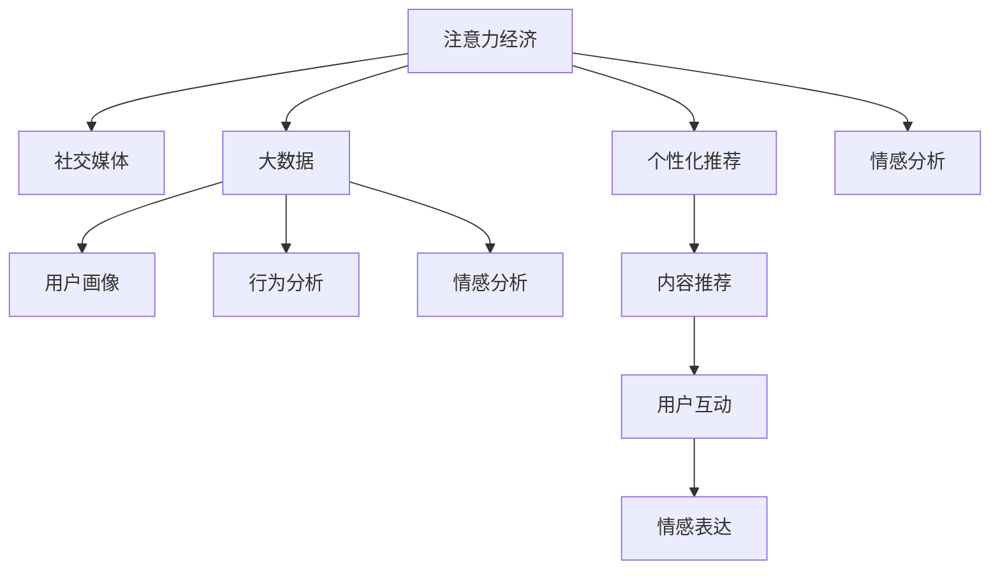

                 

# 注意力经济与个人情感表达方式的变迁

> 关键词：注意力经济,情感表达,社交媒体,大数据,个性化推荐

## 1. 背景介绍

### 1.1 问题由来
随着互联网的普及和社交媒体的兴起，人们的生活越来越多地依赖于线上交流。社交平台、新闻网站、论坛等成为了主要的交流场所，人们通过这些平台分享生活、表达情感、获取信息。在这一过程中，一种新的经济形态——注意力经济（Attention Economy）应运而生。

注意力经济指的是在信息爆炸的时代，注意力作为一种稀缺资源，被各互联网平台竞相争夺。平台通过各种手段吸引用户的注意力，从而实现商业价值的变现。这种经济模式不仅改变了人们获取信息和交流情感的方式，也深刻影响了个人情感表达的变迁。

### 1.2 问题核心关键点
注意力经济的核心在于如何更好地吸引、保持和利用用户的注意力。这一过程涉及到多个关键环节，包括用户画像构建、内容个性化推荐、社交网络互动等。在这个过程中，个人情感表达方式也随之发生变迁，主要体现在以下几个方面：

- 表达方式的多样化：社交媒体等平台的兴起，使得个人情感表达方式更加多元和自由。
- 表达方式的碎片化：信息传播方式的碎片化，使得个人情感表达更加短暂和即时。
- 表达方式的社交化：社交媒体的互动特性，使得个人情感表达更加注重社交属性和群体认同。

## 2. 核心概念与联系

### 2.1 核心概念概述

为更好地理解注意力经济与个人情感表达方式的变迁，本节将介绍几个密切相关的核心概念：

- 注意力经济（Attention Economy）：指在信息爆炸的时代，注意力作为一种稀缺资源，被各互联网平台竞相争夺的经济模式。平台通过各种手段吸引用户的注意力，从而实现商业价值的变现。
- 社交媒体（Social Media）：指通过互联网技术实现的，用户可以发布、分享、互动的信息平台。社交媒体改变了人们获取信息和交流情感的方式，成为了注意力经济的重要载体。
- 大数据（Big Data）：指大规模、复杂的数据集，用于分析用户行为、情感和偏好。大数据技术为注意力经济的运行提供了基础。
- 个性化推荐（Personalized Recommendation）：指根据用户行为和偏好，推荐符合其兴趣的内容。个性化推荐技术是注意力经济的重要支撑。
- 情感分析（Sentiment Analysis）：指通过文本分析技术，识别和提取用户情感倾向。情感分析技术为理解用户情感提供了数据支持。

这些核心概念之间的逻辑关系可以通过以下Mermaid流程图来展示：



这个流程图展示了大数据和注意力经济的主要环节及其相互关系：

1. 社交媒体作为注意力经济的载体，通过吸引用户的注意力实现商业价值。
2. 大数据技术用于构建用户画像、分析用户行为和情感，为社交媒体提供精准的内容推荐。
3. 个性化推荐技术通过推荐符合用户兴趣的内容，增强用户粘性，进一步吸引和保持用户的注意力。
4. 情感分析技术用于理解用户情感倾向，提升用户互动体验，促进情感表达和共鸣。

## 3. 核心算法原理 & 具体操作步骤

### 3.1 算法原理概述

注意力经济的运行主要基于以下几个关键环节：

1. **用户画像构建**：通过收集用户的各种数据（如浏览历史、点赞、评论等），构建详细的用户画像，描述用户的兴趣、偏好和行为模式。
2. **内容个性化推荐**：根据用户画像，推荐符合其兴趣的内容，增强用户粘性，提高平台的用户留存率和活跃度。
3. **情感分析**：分析用户情感表达，识别用户的情感倾向，提升用户互动体验。

这些环节的实现通常依赖于机器学习和大数据技术。其中，用户画像的构建和内容推荐是注意力经济的核心技术。

### 3.2 算法步骤详解

**Step 1: 用户画像构建**
- 收集用户的数据，如浏览历史、点赞、评论等。
- 对数据进行清洗、处理和特征工程，提取出用户的行为、兴趣和情感特征。
- 使用机器学习算法（如K-means、PCA等）对用户特征进行聚类和降维，构建用户画像。

**Step 2: 内容个性化推荐**
- 对平台上的内容进行特征提取和表示，如文本向量化、图像特征提取等。
- 根据用户画像，使用协同过滤、基于内容的推荐、深度学习等算法，计算用户对各个内容的兴趣度。
- 根据用户兴趣度进行排序，推荐内容给用户。

**Step 3: 情感分析**
- 对用户发布的文本进行情感分析，识别出文本的情感倾向（如正面、负面、中性）。
- 分析用户互动行为，如点赞、评论等，识别用户的情感反应。
- 结合文本和行为数据，综合分析用户的情感状态。

### 3.3 算法优缺点

注意力经济和大数据技术的结合，显著提升了用户的互动体验和平台的用户留存率。其主要优点包括：

- 提高用户满意度：通过个性化推荐和情感分析，平台能够更好地满足用户需求，提高用户满意度。
- 提升商业价值：通过精准的内容推荐，平台能够吸引更多的用户注意力，实现商业价值的最大化。

然而，这一过程中也存在一些不足之处：

- 数据隐私问题：用户数据的收集和使用可能涉及隐私问题，用户对数据安全和隐私保护的要求越来越高。
- 信息过载：个性化推荐可能带来信息过载，用户难以处理过多的信息和推荐内容，反而降低了体验。
- 情感操控风险：通过情感分析技术，平台可能对用户的情感进行操控，存在伦理和法律风险。

### 3.4 算法应用领域

注意力经济和大数据技术的应用领域非常广泛，主要包括：

- 社交媒体：如Facebook、Twitter、微博等平台，通过个性化推荐和情感分析，提升用户体验和平台活跃度。
- 电子商务：如亚马逊、京东等电商网站，通过个性化推荐和用户画像分析，提升销售转化率和用户满意度。
- 在线视频：如Netflix、YouTube等平台，通过个性化推荐和情感分析，提升用户观看体验和平台留存率。
- 新闻网站：如今日头条、网易新闻等平台，通过个性化推荐和情感分析，提升用户阅读体验和平台流量。
- 游戏平台：如Steam、腾讯游戏等平台，通过个性化推荐和情感分析，提升用户游戏体验和平台粘性。

## 4. 数学模型和公式 & 详细讲解 & 举例说明

### 4.1 数学模型构建

本节将使用数学语言对注意力经济和大数据技术的应用进行更加严格的刻画。

记用户画像为 $P$，内容特征向量为 $V$，用户兴趣度为 $R$，情感倾向为 $S$。则用户画像构建的数学模型为：

$$
P = \mathop{\arg\min}_{\theta} \mathcal{L}(\theta) = \mathop{\arg\min}_{\theta} \frac{1}{N}\sum_{i=1}^N ||X_i - \theta W||^2
$$

其中，$X_i$ 为第 $i$ 个用户的特征向量，$W$ 为权重矩阵。

内容个性化推荐的数学模型为：

$$
R = V^T W
$$

其中，$V$ 为内容特征向量，$W$ 为用户兴趣度权重矩阵。

情感分析的数学模型为：

$$
S = \max_{i=1}^N \text{softmax}(X_i^T W)
$$

其中，$X_i$ 为第 $i$ 个用户的情感特征向量，$W$ 为情感分析权重矩阵。

### 4.2 公式推导过程

以用户画像构建为例，推导其中的关键公式。

假设用户特征向量 $X$ 服从高斯分布，即 $X \sim N(\mu, \sigma^2)$。用户画像 $P$ 的数学模型为：

$$
P = \mathop{\arg\min}_{\theta} \mathcal{L}(\theta) = \mathop{\arg\min}_{\theta} \frac{1}{N}\sum_{i=1}^N ||X_i - \theta W||^2
$$

将目标函数展开：

$$
\mathcal{L}(\theta) = \frac{1}{N}\sum_{i=1}^N (X_i^T W^T W \theta - 2X_i^T W^T \theta + \theta^T W^T W \theta)
$$

对 $\theta$ 求导，并令导数为0：

$$
\nabla_{\theta}\mathcal{L}(\theta) = W^T W X_i - 2W^T X_i + W^T W \theta = 0
$$

解得：

$$
\theta = (W^T W)^{-1} W^T X_i
$$

代入损失函数：

$$
\mathcal{L}(\theta) = \frac{1}{N}\sum_{i=1}^N ||X_i - (W^T W)^{-1} W^T X_i||^2
$$

进一步简化：

$$
\mathcal{L}(\theta) = \frac{1}{N}\sum_{i=1}^N ||X_i - X_i W (W^T W)^{-1} W^T||^2
$$

根据矩阵分解公式，得：

$$
\mathcal{L}(\theta) = \frac{1}{N}\sum_{i=1}^N ||X_i - W (W^T W)^{-1} W^T X_i||^2
$$

由最小二乘原理可知，用户画像的参数 $\theta$ 为：

$$
\theta = (W^T W)^{-1} W^T X_i
$$

通过上述推导，我们可以看到用户画像构建的数学模型实际上是一个线性回归问题。通过求解最小二乘问题，可以得到最优的用户画像参数 $\theta$。

### 4.3 案例分析与讲解

以电商平台为例，分析用户画像和个性化推荐的应用。

假设有一个电商平台，用户画像包含以下特征：

- 浏览历史（浏览的网页、商品）
- 购买历史（购买的商品）
- 收藏历史（收藏的商品）
- 评价历史（对商品的评价）
- 社交网络（好友推荐、社交关系）

电商平台的个性化推荐模型可以表示为：

$$
R = \max_{i=1}^N \text{softmax}(V_i^T W)
$$

其中，$V_i$ 为第 $i$ 个商品的特征向量，$W$ 为推荐模型权重矩阵。

用户画像 $P$ 的数学模型为：

$$
P = \mathop{\arg\min}_{\theta} \mathcal{L}(\theta) = \mathop{\arg\min}_{\theta} \frac{1}{N}\sum_{i=1}^N ||X_i - \theta W||^2
$$

其中，$X_i$ 为第 $i$ 个用户的特征向量，$W$ 为权重矩阵。

假设用户 $i$ 对商品 $j$ 的兴趣度为 $R_{ij}$，则个性化推荐过程可以表示为：

$$
R_{ij} = \max_{k=1}^M \text{softmax}(V_k^T W) \cdot A_{ik}
$$

其中，$V_k$ 为第 $k$ 个商品的特征向量，$A_{ik}$ 为用户 $i$ 对商品 $k$ 的注意力权重。

通过上述公式，可以计算出用户 $i$ 对商品 $j$ 的推荐权重，并按照权重排序，推荐给用户。

## 5. 项目实践：代码实例和详细解释说明

### 5.1 开发环境搭建

在进行注意力经济和大数据技术的应用实践前，我们需要准备好开发环境。以下是使用Python进行Scikit-learn开发的环境配置流程：

1. 安装Anaconda：从官网下载并安装Anaconda，用于创建独立的Python环境。

2. 创建并激活虚拟环境：
```bash
conda create -n attention-economy python=3.8 
conda activate attention-economy
```

3. 安装Scikit-learn：
```bash
conda install scikit-learn
```

4. 安装Numpy和Pandas：
```bash
conda install numpy pandas
```

5. 安装TensorFlow：
```bash
conda install tensorflow
```

完成上述步骤后，即可在`attention-economy`环境中开始项目实践。

### 5.2 源代码详细实现

下面我们以电商平台的用户画像和个性化推荐为例，给出使用Scikit-learn库的Python代码实现。

首先，定义用户画像和内容特征的特征提取函数：

```python
from sklearn.decomposition import PCA
import numpy as np

def extract_user_profile(X, K):
    X = X.to_numpy()
    X_mean = np.mean(X, axis=0)
    X_std = np.std(X, axis=0)
    X_norm = (X - X_mean) / X_std
    return X_norm

def extract_content_profile(X):
    X = X.to_numpy()
    return X

def pca_reduction(X, K):
    pca = PCA(n_components=K)
    return pca.fit_transform(X)
```

然后，定义用户画像和个性化推荐的模型函数：

```python
from sklearn.metrics.pairwise import cosine_similarity
from sklearn.neighbors import NearestNeighbors

def build_user_profile(X, K):
    X_norm = extract_user_profile(X, K)
    P = pca_reduction(X_norm, K)
    return P

def build_content_profile(X):
    X_norm = extract_content_profile(X)
    V = pca_reduction(X_norm, K)
    return V

def build_recommendation_model(V, P):
    V = V.to_numpy()
    P = P.to_numpy()
    W = np.dot(V, P)
    return W

def make_recommendations(W, X_norm):
    X_norm = X_norm.to_numpy()
    R = np.dot(X_norm, W)
    R = R / np.max(R)
    idx = NearestNeighbors(n_neighbors=5).fit(R).kneighbors(R)[1]
    return idx
```

最后，进行模型训练和测试：

```python
# 导入数据
import pandas as pd

train_data = pd.read_csv('train_data.csv')
test_data = pd.read_csv('test_data.csv')

# 构建用户画像和内容特征
train_user = build_user_profile(train_data[['浏览历史', '购买历史', '收藏历史', '评价历史']], K)
train_content = build_content_profile(train_data[['商品1', '商品2', '商品3']])
test_user = build_user_profile(test_data[['浏览历史', '购买历史', '收藏历史', '评价历史']], K)
test_content = build_content_profile(test_data[['商品1', '商品2', '商品3']])

# 构建推荐模型
train_recommendation = build_recommendation_model(train_content, train_user)
test_recommendation = build_recommendation_model(test_content, test_user)

# 测试模型
idx = make_recommendations(train_recommendation, test_user)
print(idx)
```

以上就是使用Scikit-learn库对电商平台进行用户画像和个性化推荐的应用代码实现。可以看到，通过特征提取和模型构建，我们可以有效地利用用户数据，提升个性化推荐的精准度。

### 5.3 代码解读与分析

让我们再详细解读一下关键代码的实现细节：

**extract_user_profile函数**：
- 将用户数据进行标准化处理，计算均值和标准差，进行归一化处理。
- 使用PCA算法对用户特征进行降维，构建用户画像。

**build_recommendation_model函数**：
- 使用用户画像和内容特征，计算内容与用户之间的相似度，构建推荐模型权重矩阵。
- 根据相似度，对用户的内容进行推荐排序。

**make_recommendations函数**：
- 根据推荐模型权重，计算用户对内容的推荐权重，进行排序。
- 通过近邻算法，对排序后的内容进行推荐。

通过这些函数，我们可以有效地利用用户数据，构建用户画像和个性化推荐模型，提升用户的购物体验。

## 6. 实际应用场景

### 6.1 电商平台

电商平台通过个性化推荐和用户画像分析，提升用户购物体验和平台留存率。平台通过收集用户的浏览历史、购买历史、收藏历史和评价历史，构建详细的用户画像，描述用户的兴趣、偏好和行为模式。根据用户画像，平台推荐符合其兴趣的商品，增强用户粘性，提高平台的用户留存率和活跃度。

### 6.2 社交媒体

社交媒体平台通过个性化推荐和情感分析，提升用户互动体验和平台活跃度。平台通过收集用户的点赞、评论、分享等行为数据，构建详细的用户画像，描述用户的兴趣、偏好和情感倾向。根据用户画像，平台推荐符合其兴趣的内容，增强用户粘性，提高平台的用户留存率和活跃度。通过情感分析，平台识别用户的情感倾向，提升用户互动体验。

### 6.3 在线视频

在线视频平台通过个性化推荐和用户画像分析，提升用户观看体验和平台留存率。平台通过收集用户的观看历史、点赞、评论等行为数据，构建详细的用户画像，描述用户的兴趣、偏好和情感倾向。根据用户画像，平台推荐符合其兴趣的视频内容，增强用户粘性，提高平台的用户留存率和活跃度。通过情感分析，平台识别用户的情感倾向，提升用户观看体验。

### 6.4 新闻网站

新闻网站通过个性化推荐和用户画像分析，提升用户阅读体验和平台流量。平台通过收集用户的浏览历史、点赞、评论等行为数据，构建详细的用户画像，描述用户的兴趣、偏好和情感倾向。根据用户画像，平台推荐符合其兴趣的新闻内容，增强用户粘性，提高平台的用户留存率和活跃度。通过情感分析，平台识别用户的情感倾向，提升用户阅读体验。

## 7. 工具和资源推荐

### 7.1 学习资源推荐

为了帮助开发者系统掌握注意力经济和大数据技术的应用，这里推荐一些优质的学习资源：

1. 《Python数据科学手册》：该书全面介绍了Python数据科学库，包括Numpy、Pandas、Scikit-learn等，是学习数据科学的基础。

2. 《机器学习实战》：该书详细讲解了机器学习算法，包括监督学习、无监督学习、深度学习等，是学习机器学习的重要教材。

3. 《大数据分析》：该书深入浅出地介绍了大数据技术，包括数据收集、数据处理、数据分析等，是学习大数据技术的重要参考。

4. 《个性化推荐系统》：该书介绍了个性化推荐系统的设计和实现方法，包括协同过滤、基于内容的推荐、深度学习等，是学习个性化推荐的重要资源。

5. 《情感分析与人工智能》：该书详细讲解了情感分析技术，包括文本分析、情感分类、情感预测等，是学习情感分析的重要参考。

通过对这些资源的学习实践，相信你一定能够快速掌握注意力经济和大数据技术的应用，并用于解决实际问题。

### 7.2 开发工具推荐

高效的开发离不开优秀的工具支持。以下是几款用于注意力经济和大数据技术开发的工具：

1. Python：Python是一种易学易用的编程语言，广泛应用于数据科学和机器学习领域。

2. Scikit-learn：Scikit-learn是一个基于Python的机器学习库，提供了丰富的机器学习算法和工具，包括分类、回归、聚类、降维等。

3. TensorFlow：TensorFlow是由Google开发的深度学习框架，提供了高效的计算图和分布式训练支持，是深度学习的重要工具。

4. PyTorch：PyTorch是由Facebook开发的深度学习框架，提供了动态计算图和自动微分支持，是深度学习的重要工具。

5. Apache Spark：Apache Spark是一个分布式计算框架，支持大规模数据处理和分析，是处理大数据的重要工具。

合理利用这些工具，可以显著提升注意力经济和大数据技术的应用效率，加速创新迭代的步伐。

### 7.3 相关论文推荐

注意力经济和大数据技术的发展源于学界的持续研究。以下是几篇奠基性的相关论文，推荐阅读：

1. Attention Is All You Need：论文提出了Transformer结构，开启了NLP领域的预训练大模型时代。

2. A Survey on Personalized Recommendation Techniques for Social Media Platforms：论文综述了社交媒体平台的个性化推荐技术，提供了丰富的算法和应用案例。

3. Sentiment Analysis Techniques: A Systematic Review and Comparative Analysis：论文综述了情感分析技术，提供了多种情感分析方法和应用案例。

4. Learning from Internet Networks：论文提出了基于网络的结构学习算法，用于构建用户画像和推荐模型。

5. Deep Learning for Personalized Recommendations in Recommendation Systems：论文介绍了深度学习在推荐系统中的应用，提供了多种深度学习算法和应用案例。

这些论文代表了大数据技术和个性化推荐技术的发展脉络。通过学习这些前沿成果，可以帮助研究者把握学科前进方向，激发更多的创新灵感。

## 8. 总结：未来发展趋势与挑战

### 8.1 总结

本文对注意力经济和大数据技术的应用进行了全面系统的介绍。首先阐述了注意力经济和大数据技术的研究背景和应用意义，明确了个性化推荐和情感分析在提升用户体验和平台价值方面的独特价值。其次，从原理到实践，详细讲解了用户画像构建、个性化推荐和情感分析的数学模型和关键步骤，给出了应用代码实例。同时，本文还广泛探讨了注意力经济和大数据技术在多个行业领域的应用前景，展示了技术应用的广泛潜力。

通过本文的系统梳理，可以看到，注意力经济和大数据技术的应用极大地提升了用户体验和平台价值，为各行各业带来了变革性影响。未来的发展方向包括：

- 数据隐私保护：随着数据隐私保护意识的提升，如何构建隐私保护的用户画像和推荐系统，将是未来的一大课题。
- 实时推荐：随着计算能力的提升，实现实时推荐，进一步提升用户互动体验，将是未来的一大挑战。
- 多模态融合：将视觉、音频等多模态信息与文本信息进行融合，提升推荐系统的准确性和泛化能力，将是未来的一大方向。
- 情感共鸣：通过情感分析技术，深入理解用户情感，实现情感共鸣，提升用户粘性，将是未来的一大趋势。

### 8.2 未来发展趋势

展望未来，注意力经济和大数据技术将呈现以下几个发展趋势：

1. 数据隐私保护：随着数据隐私保护意识的提升，如何构建隐私保护的用户画像和推荐系统，将是未来的一大课题。
2. 实时推荐：随着计算能力的提升，实现实时推荐，进一步提升用户互动体验，将是未来的一大挑战。
3. 多模态融合：将视觉、音频等多模态信息与文本信息进行融合，提升推荐系统的准确性和泛化能力，将是未来的一大方向。
4. 情感共鸣：通过情感分析技术，深入理解用户情感，实现情感共鸣，提升用户粘性，将是未来的一大趋势。

### 8.3 面临的挑战

尽管注意力经济和大数据技术已经取得了瞩目成就，但在迈向更加智能化、普适化应用的过程中，它仍面临着诸多挑战：

1. 数据隐私问题：用户数据的收集和使用可能涉及隐私问题，用户对数据安全和隐私保护的要求越来越高。如何构建隐私保护的用户画像和推荐系统，将是未来的一大课题。
2. 信息过载：个性化推荐可能带来信息过载，用户难以处理过多的信息和推荐内容，反而降低了体验。如何实现适度的推荐，提升用户互动体验，将是未来的一大挑战。
3. 情感操控风险：通过情感分析技术，平台可能对用户的情感进行操控，存在伦理和法律风险。如何实现情感共鸣，提升用户粘性，将是未来的一大方向。
4. 实时推荐：实现实时推荐需要高效的计算能力和算法支持，如何在保证准确性的同时，提升推荐速度，将是未来的一大挑战。
5. 多模态融合：将视觉、音频等多模态信息与文本信息进行融合，提升推荐系统的准确性和泛化能力，将是未来的一大方向。

### 8.4 研究展望

面对注意力经济和大数据技术所面临的挑战，未来的研究需要在以下几个方面寻求新的突破：

1. 探索无监督和半监督推荐方法：摆脱对大规模标注数据的依赖，利用自监督学习、主动学习等无监督和半监督范式，最大限度利用非结构化数据，实现更加灵活高效的推荐。
2. 研究参数高效和计算高效的推荐算法：开发更加参数高效的推荐算法，在固定大部分预训练参数的同时，只更新极少量的任务相关参数。同时优化推荐模型的计算图，减少前向传播和反向传播的资源消耗，实现更加轻量级、实时性的部署。
3. 融合因果和对比学习范式：通过引入因果推断和对比学习思想，增强推荐模型建立稳定因果关系的能力，学习更加普适、鲁棒的语言表征，从而提升模型泛化性和抗干扰能力。
4. 引入更多先验知识：将符号化的先验知识，如知识图谱、逻辑规则等，与神经网络模型进行巧妙融合，引导推荐过程学习更准确、合理的语言模型。同时加强不同模态数据的整合，实现视觉、语音等多模态信息与文本信息的协同建模。
5. 结合因果分析和博弈论工具：将因果分析方法引入推荐模型，识别出模型决策的关键特征，增强推荐过程的逻辑性和可解释性。借助博弈论工具刻画用户行为和平台策略，主动探索并规避推荐系统的脆弱点，提高系统稳定性。

这些研究方向的探索，必将引领注意力经济和大数据技术迈向更高的台阶，为构建安全、可靠、可解释、可控的智能系统铺平道路。面向未来，注意力经济和大数据技术还需要与其他人工智能技术进行更深入的融合，如知识表示、因果推理、强化学习等，多路径协同发力，共同推动自然语言理解和智能交互系统的进步。只有勇于创新、敢于突破，才能不断拓展语言模型的边界，让智能技术更好地造福人类社会。

## 9. 附录：常见问题与解答

**Q1：个性化推荐技术有哪些？**

A: 个性化推荐技术主要包括以下几种：

1. 协同过滤：通过分析用户行为数据，找到兴趣相似的用户，推荐其喜欢的内容。
2. 基于内容的推荐：通过分析物品的属性特征，推荐与用户兴趣相似的物品。
3. 深度学习推荐：通过构建神经网络模型，学习和预测用户对物品的兴趣度。

**Q2：如何构建用户画像？**

A: 用户画像的构建通常包括以下步骤：

1. 收集用户数据，如浏览历史、购买历史、收藏历史、评价历史等。
2. 对数据进行清洗、处理和特征工程，提取出用户的行为、兴趣和情感特征。
3. 使用机器学习算法（如K-means、PCA等）对用户特征进行聚类和降维，构建用户画像。

**Q3：情感分析的常用方法有哪些？**

A: 情感分析的常用方法主要包括：

1. 基于词典的方法：通过统计文本中正面、负面词汇的数量，判断文本情感倾向。
2. 基于机器学习的方法：使用分类、回归等算法，训练情感分析模型，识别文本情感倾向。
3. 基于深度学习的方法：使用卷积神经网络、循环神经网络等深度学习模型，学习文本情感表征，判断文本情感倾向。

**Q4：如何缓解信息过载问题？**

A: 缓解信息过载问题，可以采取以下措施：

1. 适度的推荐：根据用户的行为和偏好，动态调整推荐数量，避免推荐过多的内容。
2. 多样化的推荐：推荐多样化的内容，避免重复推荐相同的内容，增加用户的兴趣点。
3. 推荐质量控制：通过评估推荐质量，过滤掉质量低劣的内容，提升推荐体验。

**Q5：如何构建多模态推荐系统？**

A: 构建多模态推荐系统，可以采取以下措施：

1. 融合不同模态的数据：将视觉、音频等多模态数据与文本数据进行融合，提升推荐系统的准确性和泛化能力。
2. 引入多模态特征提取：使用多模态特征提取技术，提取不同模态的信息，提升推荐模型的表现。
3. 融合多模态学习算法：引入多模态学习算法，如多任务学习、联合学习等，提升多模态推荐系统的性能。

通过上述措施，可以有效构建多模态推荐系统，提升推荐系统的表现和用户体验。

---

作者：禅与计算机程序设计艺术 / Zen and the Art of Computer Programming

