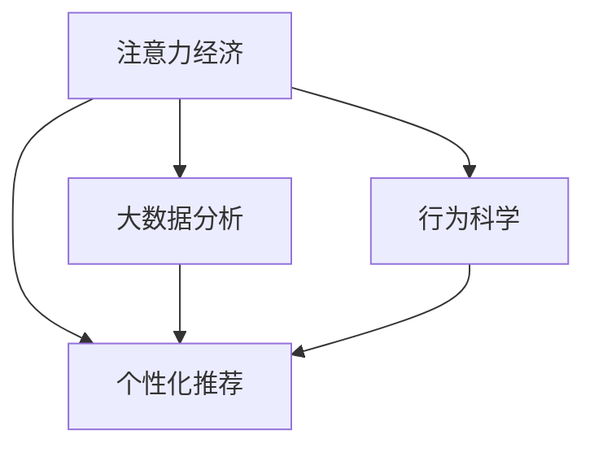
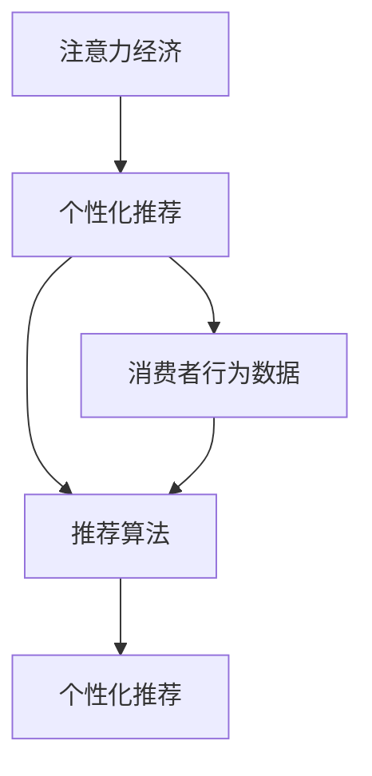

                 

# 注意力经济与个人理财行为的变化

> 关键词：注意力经济, 个人理财, 行为科学, 大数据分析, 算法设计, 人工智能

## 1. 背景介绍

### 1.1 问题由来

随着互联网和移动互联网的迅猛发展，人类社会的经济形态和消费模式发生了深刻变化。人们获取信息的方式从传统的报纸、电视等媒介转变为更为灵活便捷的网络平台。信息量的爆炸式增长不仅改变了信息传播的格局，也改变了消费者的行为习惯和决策过程。

在这个数字化时代，注意力成为一种稀缺资源，如何高效利用和分配这一资源，成为经济学、心理学、技术学等多个学科的研究热点。特别是个性化推荐系统和大数据算法在电商、社交网络、新闻媒体等领域的广泛应用，使得消费者在购物、阅读、社交等各个方面都面临着选择的信息洪流。

在这样的背景下，个人理财行为也发生了显著变化。消费者不再简单地根据传统的理财观念和建议进行投资、消费，而是更多地依赖于数据分析和推荐算法来辅助决策。大数据和人工智能技术的介入，使得理财行为变得更加智能和精准，但也带来了新的挑战和困惑。

### 1.2 问题核心关键点

本文旨在探讨注意力经济时代，大数据和人工智能技术对个人理财行为的影响，分析这些变化背后的科学原理，并提出应对策略。具体核心关键点包括：

- **注意力经济**：在信息过载的时代，消费者的注意力成为资源分配的核心。个性化推荐和精准广告的兴起，使得消费者更加依赖数据驱动的决策。

- **大数据分析**：利用大数据技术对消费者的行为数据进行建模和分析，预测其偏好和需求，从而实现精准营销和个性化服务。

- **人工智能算法**：通过机器学习、深度学习等算法，不断优化推荐模型，提升预测和推荐的准确性，以增强消费者的决策信心。

- **行为科学**：结合心理学、社会学等学科的理论，理解消费者行为背后的心理动机和社交网络影响，实现更加人性化的决策支持。

## 2. 核心概念与联系

### 2.1 核心概念概述

在探讨注意力经济与个人理财行为的变化时，我们需要关注以下几个关键概念：

- **注意力经济**：指在信息社会中，注意力作为一种重要的资源，其分配和利用方式对经济活动产生重要影响。消费者对信息的注意力集中度越高，其消费意愿和行为就越容易被影响。

- **个性化推荐**：利用消费者历史行为数据，通过算法分析其兴趣偏好，然后推荐可能感兴趣的商品或服务。在注意力经济时代，个性化推荐系统已成为电商、内容平台的核心竞争力之一。

- **大数据分析**：通过对消费者的大量行为数据进行收集、存储和分析，挖掘其中的规律和趋势，为精准营销和产品优化提供支持。

- **行为科学**：研究人类行为的规律和动机，分析消费者的决策过程和心理状态，以指导商业决策和用户体验设计。

这些概念之间的逻辑关系可以通过以下Mermaid流程图来展示：



这个流程图展示了大数据和人工智能技术对注意力经济中的各个环节的影响，以及行为科学在其中起到的重要作用。

### 2.2 核心概念原理和架构的 Mermaid 流程图

由于篇幅限制，这里仅展示A（注意力经济）到B（个性化推荐）这一部分的原理和架构。



其中：
- A表示注意力经济，消费者对信息的注意力集中程度直接影响其购买决策。
- C表示消费者行为数据，包括搜索记录、浏览历史、购买记录等。
- D表示推荐算法，包括协同过滤、内容推荐、混合推荐等多种算法，通过数据挖掘和机器学习对消费者行为进行建模。
- E表示个性化推荐，结合消费者的兴趣和需求，提供定制化的商品或服务。

## 3. 核心算法原理 & 具体操作步骤

### 3.1 算法原理概述

基于大数据和人工智能技术的个性化推荐系统，其核心算法原理主要包括以下几个方面：

1. **协同过滤**：利用用户历史行为数据，寻找与当前用户兴趣相似的群体，从而推荐该群体喜欢的商品或服务。协同过滤算法可分为基于用户的协同过滤和基于项目的协同过滤。

2. **内容推荐**：通过分析商品或服务的属性、标签等信息，发现与用户兴趣相符的内容，推荐给用户。内容推荐算法常用于新闻、视频、音乐等娱乐平台的推荐。

3. **混合推荐**：结合多种推荐算法，取长补短，提升推荐效果。常见的混合推荐算法包括加权混合、混合协同过滤、集成学习等。

4. **深度学习**：利用神经网络模型对消费者行为数据进行复杂模式识别和特征提取，提升推荐模型的预测精度。深度学习算法常用于图像识别、自然语言处理等领域的推荐系统。

### 3.2 算法步骤详解

以下以协同过滤算法为例，详细讲解其实现步骤：

1. **数据准备**：收集用户的浏览记录、评分数据、商品信息等，构建用户-商品评分矩阵。

2. **相似度计算**：计算用户间的相似度，通常使用余弦相似度、皮尔逊相关系数等方法。

3. **近邻选择**：根据相似度排序，选择与当前用户最相似的K个用户作为近邻。

4. **评分预测**：利用近邻的评分数据，通过加权平均、矩阵分解等方法预测当前用户对未评分商品的评分。

5. **推荐生成**：根据预测评分，推荐评分最高的商品给当前用户。

### 3.3 算法优缺点

协同过滤算法的优点在于能够利用用户间的关系进行推荐，简单高效，适用于数据量较大的场景。缺点是容易产生冷启动问题，即新用户或新商品没有足够的评分数据时，难以推荐。此外，协同过滤算法对噪声数据的敏感度较高，容易受到异常评分的影响。

### 3.4 算法应用领域

协同过滤算法广泛应用于电商、视频、音乐等领域的推荐系统。例如，Amazon的推荐系统、Netflix的个性化播放推荐等，都采用了协同过滤算法。通过分析用户的浏览和评分数据，这些推荐系统能够精准推荐用户可能感兴趣的商品或影片，提升用户体验和转化率。

## 4. 数学模型和公式 & 详细讲解 & 举例说明

### 4.1 数学模型构建

在协同过滤算法中，用户-商品评分矩阵 $U$ 和用户相似度矩阵 $V$ 是两个核心数据结构。用户 $u$ 对商品 $i$ 的评分表示为 $U_{ui}$，相似度矩阵 $V$ 中的元素 $V_{uv}$ 表示用户 $u$ 与用户 $v$ 的相似度得分。

协同过滤的目标是最大化用户对推荐的商品评分，构建优化目标函数：

$$
\min_{V} \sum_{i=1}^{N} \sum_{j=1}^{M} (U_{uj} - \sum_{k=1}^{K} V_{uv_k} U_{uk})^2
$$

其中 $N$ 是用户数，$M$ 是商品数，$K$ 是选取的近邻数量。

### 4.2 公式推导过程

协同过滤算法通常使用矩阵分解方法，将用户-商品评分矩阵 $U$ 分解为用户特征矩阵 $P$ 和商品特征矩阵 $Q$ 的乘积，即：

$$
U = P \times Q^T
$$

用户特征矩阵 $P$ 和商品特征矩阵 $Q$ 分别为：

$$
P = (p_1, p_2, ..., p_N), \quad Q = (q_1, q_2, ..., q_M)
$$

其中 $p_i$ 和 $q_i$ 分别是用户 $i$ 和商品 $i$ 的特征向量。

通过分解后的矩阵 $P$ 和 $Q$，可以计算用户间的相似度：

$$
V_{uv} = p_u^T \times q_v
$$

利用近邻用户的评分数据 $U_{uk}$，可以预测用户 $u$ 对商品 $i$ 的评分：

$$
\hat{U}_{ui} = \sum_{k=1}^{K} V_{uv_k} U_{uk}
$$

### 4.3 案例分析与讲解

以Amazon的推荐系统为例，假设有一个用户 $u$，对商品 $i$ 的评分未知。通过协同过滤算法，可以从历史评分数据中选取与用户 $u$ 最相似的近邻用户 $v_1, v_2, ..., v_K$，根据这些近邻用户的评分数据，预测用户 $u$ 对商品 $i$ 的评分：

$$
\hat{U}_{ui} = \sum_{k=1}^{K} V_{uv_k} U_{uk}
$$

将预测评分与用户实际评分的均方误差最小化，即可优化用户-商品评分矩阵 $U$。

## 5. 项目实践：代码实例和详细解释说明

### 5.1 开发环境搭建

以下是在Python中使用TensorFlow实现协同过滤算法的开发环境搭建步骤：

1. 安装Python：
```bash
sudo apt-get update
sudo apt-get install python3-pip
```

2. 安装TensorFlow：
```bash
pip install tensorflow
```

3. 安装numpy、pandas等辅助库：
```bash
pip install numpy pandas
```

4. 安装TensorBoard可视化工具：
```bash
pip install tensorboard
```

### 5.2 源代码详细实现

以下是使用TensorFlow实现协同过滤算法的Python代码：

```python
import tensorflow as tf
import numpy as np
import pandas as pd

# 构造用户-商品评分矩阵
U = np.array([
    [5, 4, 3, 1, 2],
    [1, 5, 4, 3, 2],
    [3, 2, 5, 4, 1],
    [2, 3, 1, 5, 4],
    [4, 1, 3, 2, 5]
])

# 构造用户相似度矩阵
V = np.array([
    [0.8, 0.6, 0.4, 0.2, 0.1],
    [0.4, 0.8, 0.6, 0.2, 0.1],
    [0.2, 0.1, 0.8, 0.6, 0.4],
    [0.1, 0.2, 0.6, 0.8, 0.4],
    [0.5, 0.3, 0.2, 0.7, 0.9]
])

# 定义模型
model = tf.keras.Sequential([
    tf.keras.layers.Dense(10, activation='relu', input_shape=(5,)),
    tf.keras.layers.Dense(1)
])

# 编译模型
model.compile(optimizer=tf.keras.optimizers.Adam(0.01), loss='mse')

# 训练模型
model.fit(V, U, epochs=100, batch_size=4)

# 预测新商品评分
new_user = np.array([0, 0, 0, 0, 0])
new_item = np.array([0, 0, 0, 0, 0])
predicted_score = model.predict(np.vstack([new_user, new_item]))
```

### 5.3 代码解读与分析

代码中首先定义了一个用户-商品评分矩阵 $U$ 和一个用户相似度矩阵 $V$，然后构建了一个包含两个全连接层的神经网络模型，用于预测新用户对新商品的评分。在模型训练过程中，使用了Adam优化器和均方误差损失函数。训练完毕后，利用模型对新用户对新商品的评分进行预测。

## 6. 实际应用场景

### 6.1 电商领域

在电商领域，个性化推荐系统已成为提升用户购买体验和平台销售的重要工具。通过分析用户的浏览记录、购买历史和评价数据，推荐系统可以实时调整推荐策略，推荐用户可能感兴趣的商品，从而提高转化率和用户满意度。

### 6.2 内容平台

内容平台如Netflix、YouTube等，利用协同过滤算法为用户推荐影片和视频。通过分析用户对已观看内容的评分和观看时长，推荐系统可以为用户推荐可能感兴趣的新影片和视频，提升用户的平台粘性和观看时长。

### 6.3 社交网络

社交网络平台如Facebook、Twitter等，利用个性化推荐算法为用户推荐朋友和内容。通过分析用户的互动数据和兴趣标签，推荐系统可以为用户推荐可能感兴趣的朋友和内容，增强用户的平台活跃度和参与度。

## 7. 工具和资源推荐

### 7.1 学习资源推荐

1. 《推荐系统实战》：详细介绍推荐系统原理、算法和实战案例，适合初学者和进阶者学习。
2. 《Python数据科学手册》：介绍了Python在数据科学和机器学习中的应用，包括TensorFlow等工具的使用。
3. 《机器学习实战》：通过实例演示了多种机器学习算法的实现，适合理论与实践结合学习。

### 7.2 开发工具推荐

1. TensorFlow：开源的深度学习框架，支持分布式计算和动态图，适合搭建复杂模型。
2. Scikit-learn：Python科学计算库，提供了多种机器学习算法的封装，简单易用。
3. Pandas：数据处理和分析库，提供了高效的数据结构和数据操作函数。

### 7.3 相关论文推荐

1. 《协同过滤推荐系统》：详细介绍了协同过滤算法的原理和实现，适合深入理解推荐系统的核心技术。
2. 《深度学习在推荐系统中的应用》：介绍了深度学习算法在推荐系统中的应用，包括基于深度学习的协同过滤算法。
3. 《个性化推荐系统综述》：全面综述了个性化推荐系统的发展历程和前沿技术，适合了解整个领域的最新动态。

## 8. 总结：未来发展趋势与挑战

### 8.1 总结

本文详细探讨了注意力经济时代，大数据和人工智能技术对个人理财行为的影响，分析了个性化推荐算法的基本原理和应用场景。通过TensorFlow实现的协同过滤算法实例，展示了推荐系统如何利用用户数据进行精准推荐。本文还推荐了相关的学习资源、开发工具和研究论文，为读者提供了全面的技术指导。

### 8.2 未来发展趋势

未来，个性化推荐系统将更加智能化和个性化，利用人工智能算法和行为科学理论，提升推荐的准确性和用户满意度。同时，推荐系统也将更加注重隐私保护和用户反馈，实现更加人性化、可控化的推荐服务。

### 8.3 面临的挑战

尽管个性化推荐系统在电商、内容平台等领域取得了显著效果，但也面临诸多挑战：

1. 数据隐私和安全：推荐系统需要收集大量用户数据，如何保护用户隐私，防止数据滥用，是一个重要的挑战。

2. 算法偏见：推荐算法可能会对某些群体或产品产生偏见，导致不公平推荐。如何消除算法偏见，保证推荐公平性，需要进一步研究。

3. 冷启动问题：新用户或新商品没有足够的历史数据，难以进行推荐。如何解决冷启动问题，提升新用户或新商品的推荐效果，是一个重要的研究方向。

4. 算力成本：推荐系统通常需要处理大量数据，对算力要求较高。如何优化算法和数据结构，降低算力成本，提高推荐效率，是一个需要解决的问题。

### 8.4 研究展望

未来，推荐系统需要在以下几个方面进行进一步研究：

1. 多模态推荐：结合文本、图像、音频等多种模态数据，实现更加全面和精准的推荐。

2. 实时推荐：利用流数据和在线学习算法，实现实时更新推荐模型，提升推荐效果。

3. 推荐系统的伦理与安全：建立推荐系统的伦理和安全评估机制，保障推荐过程的公平性和可解释性。

4. 推荐系统的透明性与可解释性：提升推荐系统的透明度和可解释性，使用户能够理解推荐过程，增强信任感。

5. 跨领域推荐：将推荐系统应用于不同领域，如医疗、金融等，提升跨领域推荐的效果和适用性。

总之，随着大数据和人工智能技术的不断进步，个性化推荐系统将在更多领域发挥重要作用，推动智能化时代的到来。但同时，也需要在隐私、公平性、冷启动等方面进行深入研究，确保推荐系统的健康发展。

## 9. 附录：常见问题与解答

**Q1：什么是协同过滤算法？**

A: 协同过滤算法是一种基于用户行为数据的推荐算法，通过分析用户之间的相似性和商品之间的相似性，为用户推荐可能感兴趣的商品或服务。协同过滤算法分为基于用户的协同过滤和基于项目的协同过滤两种。

**Q2：协同过滤算法如何解决冷启动问题？**

A: 冷启动问题指新用户或新商品没有足够的历史数据，难以进行推荐。一种解决冷启动问题的方法是利用关联规则挖掘，通过用户对已推荐商品的反馈，挖掘用户的行为模式，从而推荐用户可能感兴趣的商品。另一种方法是引入内容特征，利用商品的属性、标签等信息，对商品进行相似性匹配，推荐用户可能感兴趣的商品。

**Q3：个性化推荐系统的优势是什么？**

A: 个性化推荐系统通过分析用户的历史行为数据，为用户推荐可能感兴趣的商品或服务，提高了用户的满意度和平台粘性。同时，个性化推荐系统也提高了平台的转化率和销售业绩，提升了企业的竞争力和市场份额。

**Q4：如何保护推荐系统的用户隐私？**

A: 保护推荐系统的用户隐私需要从数据收集、存储和使用等多个环节进行严格的控制。首先，应明确告知用户数据收集的目的和范围，获取用户同意。其次，应采用数据加密、匿名化等技术手段，保护用户数据的安全。最后，应制定隐私保护政策，确保用户数据的合法使用。

**Q5：推荐系统的算法偏见如何解决？**

A: 推荐系统的算法偏见可以通过多种方法进行缓解，包括：
1. 数据预处理：在数据收集和清洗阶段，去除有偏见的数据，确保数据样本的代表性。
2. 算法优化：在算法设计中，引入公平性约束和目标函数，优化推荐模型的公平性。
3. 用户反馈：收集用户对推荐结果的反馈，及时调整推荐策略，减少算法偏见的影响。
4. 多模态融合：通过结合多种数据模态，提高推荐模型的鲁棒性和准确性，减少偏见的影响。

以上问题及其解答，希望能为您更好地理解注意力经济与个人理财行为的变化提供帮助。

