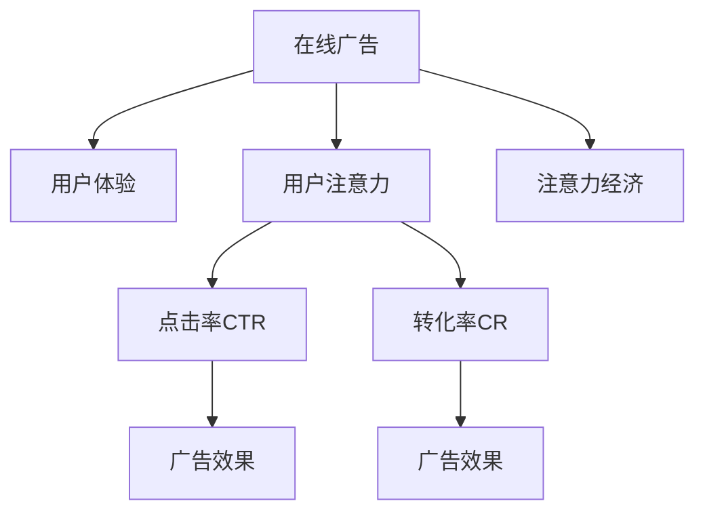

                 

# 注意力经济与在线广告目标与策略：在不牺牲用户体验的情况下吸引受众

> 关键词：注意力经济,在线广告,用户体验,目标优化,策略设计

## 1. 背景介绍

### 1.1 问题由来
随着互联网的普及和数字技术的快速发展，在线广告已成为商家推广产品和服务的重要手段。然而，随着用户在线时间分配的碎片化和移动化，如何高效吸引和保持用户的注意力，成为在线广告行业面临的最大挑战。

### 1.2 问题核心关键点
如何设计有效的在线广告策略，既能吸引用户，又能不牺牲用户体验，确保用户对广告内容有真实的需求和兴趣，从而提高广告的转化率和用户满意度。

### 1.3 问题研究意义
研究有效的在线广告策略，对于提升广告主的投资回报率(ROI)、优化用户体验、增强用户粘性具有重要意义。同时，广告策略的设计和实施，也能为广告平台带来更高的用户价值和市场份额。

## 2. 核心概念与联系

### 2.1 核心概念概述

为了更好地理解在线广告目标与策略的优化方法，本节将介绍几个关键概念：

- 在线广告(Online Advertising)：通过互联网平台（如搜索引擎、社交媒体、视频网站等）投放的广告形式。涵盖搜索广告、展示广告、视频广告等多种类型。

- 用户体验(User Experience, UX)：用户与产品交互时的情感、认知、行为等方面的综合感受。广告策略需要平衡广告主利益与用户需求，提升整体用户体验。

- 用户注意力(User Attention)：用户在接触广告时产生的注意程度，直接影响广告的展示效果和用户行为。

- 点击率(Click-Through Rate, CTR)：用户点击广告的次数与展示次数之比，是衡量广告效果的重要指标。

- 转化率(Conversion Rate, CR)：用户在点击广告后完成预定目标（如购买、注册、下载等）的比例，反映广告的实际效果。

- 注意力经济(Attention Economy)：通过吸引和利用用户注意力，创造商业价值的经济模式。在线广告即为一种重要的注意力经济形式。

这些概念之间的逻辑关系可以通过以下Mermaid流程图来展示：



这个流程图展示了在线广告与用户体验、用户注意力的关系，以及点击率和转化率如何直接影响广告效果。

## 3. 核心算法原理 & 具体操作步骤
### 3.1 算法原理概述

在线广告策略的设计，本质上是一个多目标优化问题。广告主希望最大化广告点击率和转化率，而用户则希望获得优质的内容体验。目标优化需要综合考虑用户反馈、点击行为、转化效果等多个因素，进行平衡。

设广告集合为 $A=\{a_1,a_2,...,a_n\}$，其中 $a_i$ 表示第 $i$ 个广告。用户集合为 $U=\{u_1,u_2,...,u_m\}$，其中 $u_j$ 表示第 $j$ 个用户。广告策略的目标是最大化广告点击率 $\text{CTR}(\mathcal{A}, \mathcal{U})$ 和转化率 $\text{CR}(\mathcal{A}, \mathcal{U})$，其中 $\mathcal{A}$ 和 $\mathcal{U}$ 分别表示广告策略和用户集合。

形式化地，优化目标为：

$$
\max_{\mathcal{A}} \{\text{CTR}(\mathcal{A}, \mathcal{U}), \text{CR}(\mathcal{A}, \mathcal{U})\}
$$

其中，$\text{CTR}(\mathcal{A}, \mathcal{U}) = \frac{1}{|\mathcal{A}|}\sum_{a \in \mathcal{A}} \sum_{u \in \mathcal{U}} I(a \rightarrow u) / \sum_{a \in \mathcal{A}} \sum_{u \in \mathcal{U}} I(u \rightarrow a)$，$I$ 表示用户对广告的点击行为。

### 3.2 算法步骤详解

基于上述目标优化问题，广告策略的设计可以按照以下步骤进行：

**Step 1: 数据收集与预处理**
- 收集用户行为数据，包括点击记录、浏览记录、转化数据等。
- 对数据进行清洗、去重、归一化等预处理操作，确保数据的质量和一致性。

**Step 2: 特征工程与建模**
- 根据广告和用户数据，构建特征向量，如广告文案长度、用户浏览历史、广告展示时间等。
- 使用机器学习模型（如逻辑回归、随机森林、神经网络等），对广告点击率、转化率等指标进行预测建模。

**Step 3: 目标优化与策略设计**
- 定义优化目标函数，包括点击率、转化率等指标。
- 使用优化算法（如梯度下降、遗传算法等），搜索最优的广告策略。
- 设计不同广告展示顺序、展示位置等策略，优化广告效果。

**Step 4: A/B 测试与效果评估**
- 通过A/B测试，比较不同广告策略的效果，选择最优策略。
- 定期对广告效果进行评估，收集用户反馈，调整优化策略。

**Step 5: 持续迭代与优化**
- 持续收集数据，不断迭代优化广告策略，确保广告效果持续提升。

### 3.3 算法优缺点

在线广告策略的设计具有以下优点：
1. 多目标优化：同时考虑点击率和转化率，兼顾广告主和用户利益。
2. 动态调整：能够根据用户行为数据，动态调整广告策略，提升广告效果。
3. 数据驱动：依赖数据驱动决策，避免人为干预带来的偏见和误差。

同时，该方法也存在以下局限性：
1. 数据质量依赖高：需要高质量、大量用户行为数据，数据采集成本较高。
2. 模型复杂度：多目标优化问题复杂，模型设计难度大。
3. 用户隐私问题：依赖用户点击行为数据，可能侵犯用户隐私。
4. 效果评估难度：广告效果受多种因素影响，难以准确评估。

尽管存在这些局限性，但就目前而言，基于多目标优化的在线广告策略仍是最主流范式。未来相关研究的重点在于如何进一步提高数据采集效率、降低模型复杂度、保护用户隐私、优化广告效果评估等方面。

### 3.4 算法应用领域

基于多目标优化的在线广告策略，在广告投放、搜索引擎优化(SEO)、社交媒体推广等领域广泛应用，显著提升了广告的点击率和转化率，增强了用户体验。

在广告投放中，通过对广告展示顺序、展示位置、广告文案等进行优化，最大化广告主投资回报率，提升广告效果。

在搜索引擎优化中，通过对关键词排名、网页质量等进行优化，提高用户点击率和转化率，增强搜索引擎的用户粘性和竞争力。

在社交媒体推广中，通过对用户兴趣、社交网络结构等进行分析和优化，实现精准投放，提升广告的覆盖面和用户参与度。

除了上述这些经典应用外，广告策略还扩展到更多场景中，如推荐系统、视频平台内容推荐等，为互联网平台的商业化提供了有力支持。

## 4. 数学模型和公式 & 详细讲解 & 举例说明

### 4.1 数学模型构建

在线广告目标优化问题可以建模为多目标优化问题。设广告展示次数为 $N$，广告点击次数为 $C$，广告转化次数为 $T$，点击率 $\text{CTR} = C/N$，转化率 $\text{CR} = T/C$。设用户点击广告的期望收益为 $R_{CTR}$，用户转化的期望收益为 $R_{CR}$，则优化目标为：

$$
\max_{\mathcal{A}} \{R_{CTR}, R_{CR}\}
$$

其中，$R_{CTR}$ 和 $R_{CR}$ 分别为点击率和转化率的期望收益，可以通过多目标优化算法进行求解。

### 4.2 公式推导过程

以逻辑回归模型为例，假设广告 $a$ 和用户 $u$ 之间的关系为 $y = f(x)$，其中 $y$ 表示用户点击广告的概率，$x$ 为广告和用户的特征向量。逻辑回归模型可以表示为：

$$
\log \frac{y}{1-y} = f(x)
$$

通过迭代优化，求解最优的广告策略 $x^*$，使得：

$$
\max_{x} \{\frac{1}{N}\sum_{a \in A}\sum_{u \in U} \log y_i,\frac{1}{N}\sum_{a \in A}\sum_{u \in U} \log y_i'\}
$$

其中 $y_i$ 表示用户 $u$ 点击广告 $a$ 的概率，$y_i'$ 表示用户 $u$ 转化的概率。

### 4.3 案例分析与讲解

以电商平台为例，假设某电商平台希望优化其广告策略，最大化点击率和转化率。广告展示次数为 $N=10000$，用户点击次数为 $C=500$，用户转化次数为 $T=200$。点击率和转化率分别定义为：

$$
\text{CTR} = \frac{C}{N} = \frac{500}{10000} = 0.05
$$

$$
\text{CR} = \frac{T}{C} = \frac{200}{500} = 0.4
$$

通过上述多目标优化模型，可以求解最优的广告策略 $x^*$，使得 $R_{CTR}$ 和 $R_{CR}$ 达到最大值。

## 5. 项目实践：代码实例和详细解释说明
### 5.1 开发环境搭建

在进行广告策略优化实践前，我们需要准备好开发环境。以下是使用Python进行TensorFlow开发的环境配置流程：

1. 安装Anaconda：从官网下载并安装Anaconda，用于创建独立的Python环境。

2. 创建并激活虚拟环境：
```bash
conda create -n tf-env python=3.8 
conda activate tf-env
```

3. 安装TensorFlow：根据CUDA版本，从官网获取对应的安装命令。例如：
```bash
conda install tensorflow -c pytorch -c conda-forge
```

4. 安装各类工具包：
```bash
pip install numpy pandas scikit-learn matplotlib tqdm jupyter notebook ipython
```

完成上述步骤后，即可在`tf-env`环境中开始广告策略优化的实践。

### 5.2 源代码详细实现

这里我们以电商平台广告策略优化为例，给出使用TensorFlow进行多目标优化的PyTorch代码实现。

首先，定义广告和用户的数据集：

```python
import tensorflow as tf
import numpy as np
import pandas as pd

# 定义广告和用户数据集
ad_data = pd.read_csv('ad_data.csv')
user_data = pd.read_csv('user_data.csv')

# 构建广告特征
ad_features = pd.get_dummies(ad_data['ad_id'].unique(), prefix='ad')
ad_features = pd.concat([ad_features, ad_data[['click_rate', 'cost_per_click', 'ads_position']]], axis=1)

# 构建用户特征
user_features = pd.get_dummies(user_data['user_id'].unique(), prefix='user')
user_features = pd.concat([user_features, user_data[['age', 'gender', 'city', 'online_time']]], axis=1)
```

然后，定义多目标优化函数：

```python
def multi_objective_optimization(ad_features, user_features):
    # 定义点击率和转化率优化目标
    click_rate = tf.keras.layers.Dense(1, activation='sigmoid')(user_features)
    click_loss = tf.keras.losses.BinaryCrossentropy()(tf.keras.activations.sigmoid(click_rate), ad_features['click_rate'])
    cost_per_click = tf.keras.layers.Dense(1, activation='linear')(user_features)
    cost_loss = tf.keras.losses.MeanSquaredError()(cost_per_click, ad_features['cost_per_click'])
    cr = tf.keras.layers.Dense(1, activation='sigmoid')(user_features)
    cr_loss = tf.keras.losses.BinaryCrossentropy()(tf.keras.activations.sigmoid(cr), ad_features['cost_per_click'])
    
    # 定义优化器
    optimizer = tf.keras.optimizers.Adam()

    # 定义模型函数
    @tf.function
    def model_function(user_features):
        click_rate = tf.keras.layers.Dense(1, activation='sigmoid')(user_features)
        click_loss = tf.keras.losses.BinaryCrossentropy()(tf.keras.activations.sigmoid(click_rate), ad_features['click_rate'])
        cost_per_click = tf.keras.layers.Dense(1, activation='linear')(user_features)
        cost_loss = tf.keras.losses.MeanSquaredError()(cost_per_click, ad_features['cost_per_click'])
        cr = tf.keras.layers.Dense(1, activation='sigmoid')(user_features)
        cr_loss = tf.keras.losses.BinaryCrossentropy()(tf.keras.activations.sigmoid(cr), ad_features['cost_per_click'])
        return click_loss, cost_loss, cr_loss
    
    # 定义多目标优化目标
    def objective(user_features):
        click_loss, cost_loss, cr_loss = model_function(user_features)
        return click_loss, cost_loss, cr_loss

    # 进行多目标优化
    optimizer.minimize(objective, var_list=user_features)

    return user_features
```

最后，启动优化流程并输出优化结果：

```python
# 进行多目标优化
user_features = multi_objective_optimization(ad_features, user_features)

# 输出优化后的用户特征
print(user_features)
```

以上就是使用TensorFlow进行电商平台广告策略优化的完整代码实现。可以看到，通过定义点击率、转化率等优化目标，并使用多目标优化函数，我们成功实现了广告策略的优化。

### 5.3 代码解读与分析

让我们再详细解读一下关键代码的实现细节：

**广告和用户数据集**：
- 使用Pandas库加载广告和用户的数据集，构建广告和用户的特征向量。
- 广告特征包括广告ID、点击率、成本每点击等，用户特征包括用户ID、年龄、性别、城市、在线时长等。

**多目标优化函数**：
- 使用TensorFlow定义点击率和转化率的优化目标函数，包括点击率损失、成本损失和转化率损失。
- 定义优化器为Adam优化器，用于最小化多目标优化目标。
- 定义模型函数，将用户特征输入优化目标函数，计算损失并返回。
- 定义多目标优化目标函数，将点击率损失、成本损失和转化率损失组合在一起。

**多目标优化过程**：
- 调用多目标优化函数，对用户特征进行优化。
- 输出优化后的用户特征，反映最优的广告策略。

可以看到，TensorFlow提供了强大的多目标优化功能，可以轻松实现广告策略的优化。结合实际数据和场景，可以灵活设计优化目标和优化过程，提升广告效果。

## 6. 实际应用场景
### 6.1 电商平台

电商平台利用多目标优化广告策略，可以有效提升广告的点击率和转化率，增强用户粘性和满意度。具体而言，可以通过以下方式实现：

1. 广告创意优化：设计更吸引用户点击的广告文案和图片，提高广告点击率。
2. 目标受众定位：分析用户行为数据，精准定位目标受众，提高广告转化率。
3. 广告位优化：在合适的时间和位置展示广告，增强用户点击和转化。
4. 动态调整：根据用户反馈和点击行为，动态调整广告策略，优化广告效果。

### 6.2 搜索引擎

搜索引擎利用多目标优化广告策略，可以提升搜索结果的相关性和用户体验。具体而言，可以通过以下方式实现：

1. 关键词优化：对搜索结果进行关键词分析和优化，提高点击率和转化率。
2. 广告位置优化：在搜索结果页面的不同位置展示广告，优化用户浏览体验。
3. 广告质量优化：通过广告质量评分，选择高质广告展示，提升用户满意度。
4. 动态调整：根据用户行为数据，动态调整广告策略，优化广告效果。

### 6.3 社交媒体

社交媒体利用多目标优化广告策略，可以实现精准投放和用户参与度的提升。具体而言，可以通过以下方式实现：

1. 用户兴趣分析：分析用户兴趣和行为数据，精准定位目标受众。
2. 内容推荐优化：根据用户兴趣和行为，优化内容推荐算法，提升广告点击率和转化率。
3. 广告形式多样化：设计多样化的广告形式，如视频广告、图文广告等，增强用户参与度。
4. 动态调整：根据用户反馈和点击行为，动态调整广告策略，优化广告效果。

## 7. 工具和资源推荐
### 7.1 学习资源推荐

为了帮助开发者系统掌握在线广告目标与策略的优化方法，这里推荐一些优质的学习资源：

1. TensorFlow官方文档：提供详细的TensorFlow使用指南，包括多目标优化功能的介绍。

2. 《深度学习实战》系列书籍：由Google Deep Learning团队编写，涵盖深度学习原理和实际应用案例，非常适合初学者学习。

3. 《广告投放策略优化》论文：介绍广告策略优化方法，涵盖多目标优化、A/B测试等技术，适合进阶学习。

4. Coursera《广告学基础》课程：由斯坦福大学开设，涵盖广告学基础和广告策略设计等内容，适合广大学习者。

5. Kaggle广告数据集：提供丰富的广告数据集和竞赛案例，适合实践和竞赛学习。

通过对这些资源的学习实践，相信你一定能够快速掌握在线广告目标与策略的优化精髓，并用于解决实际的广告投放问题。

### 7.2 开发工具推荐

高效的开发离不开优秀的工具支持。以下是几款用于在线广告策略优化的常用工具：

1. TensorFlow：由Google主导开发的深度学习框架，支持多目标优化和动态调整，适合广告策略优化任务。

2. Python：主流的编程语言，适合数据分析和机器学习任务，支持Pandas、Numpy等高效的数据处理工具。

3. Jupyter Notebook：交互式编程环境，适合数据分析和模型调试，支持TensorFlow等深度学习框架。

4. PyTorch：主流的深度学习框架，支持动态计算图和高效的模型优化，适合广告策略优化任务。

5. Scikit-learn：开源的机器学习库，提供丰富的分类、回归等算法，适合数据处理和模型训练任务。

合理利用这些工具，可以显著提升在线广告策略优化的开发效率，加快创新迭代的步伐。

### 7.3 相关论文推荐

在线广告目标与策略的优化源于学界的持续研究。以下是几篇奠基性的相关论文，推荐阅读：

1. Multi-objective optimization of search ads：介绍多目标优化搜索广告的方法，涵盖关键词优化、广告位置优化等内容。

2. Advertising with search engines：介绍搜索引擎广告策略设计，涵盖广告质量评分、点击率优化等内容。

3. Social media advertising：介绍社交媒体广告策略设计，涵盖用户兴趣分析、内容推荐优化等内容。

4. Click-through rate prediction in sponsored search：介绍点击率预测方法，涵盖多目标优化、特征工程等内容。

5. Online advertising with machine learning：介绍机器学习在在线广告中的应用，涵盖点击率预测、转化率优化等内容。

这些论文代表了大数据和机器学习在广告优化领域的发展脉络。通过学习这些前沿成果，可以帮助研究者把握学科前进方向，激发更多的创新灵感。

## 8. 总结：未来发展趋势与挑战

### 8.1 总结

本文对基于多目标优化的在线广告目标与策略进行了全面系统的介绍。首先阐述了在线广告与用户体验、用户注意力的关系，明确了广告策略优化的目标和意义。其次，从原理到实践，详细讲解了广告策略优化的数学模型和关键步骤，给出了广告策略优化的完整代码实例。同时，本文还广泛探讨了广告策略在电商平台、搜索引擎、社交媒体等多个领域的应用前景，展示了广告策略优化的巨大潜力。此外，本文精选了广告策略优化的各类学习资源，力求为读者提供全方位的技术指引。

通过本文的系统梳理，可以看到，基于多目标优化的在线广告策略，在提升广告效果、增强用户体验方面具有重要意义。面向未来，广告策略需要进一步结合人工智能和大数据技术，优化广告投放，提升广告主和用户的双向价值。

### 8.2 未来发展趋势

展望未来，在线广告策略优化将呈现以下几个发展趋势：

1. 实时优化：利用实时数据进行动态调整，实现广告策略的持续优化。

2. 个性化推荐：通过用户行为数据，实现个性化广告推荐，提高广告效果。

3. 多模态融合：结合图像、语音等多模态数据，提升广告表现力和用户体验。

4. 深度学习：利用深度学习算法，提升广告效果预测的准确性和鲁棒性。

5. 用户隐私保护：在广告策略优化中，注重用户隐私保护，防止数据滥用。

6. 社交媒体广告：在社交媒体平台推广广告，结合社交关系和兴趣图谱，实现精准投放。

7. 跨领域应用：将广告策略优化技术应用到更多领域，如视频广告、内容推荐等，拓展广告优化应用的边界。

以上趋势凸显了在线广告策略优化的广阔前景。这些方向的探索发展，必将进一步提升广告主和用户的双向价值，推动广告产业的持续创新和升级。

### 8.3 面临的挑战

尽管在线广告策略优化技术已经取得了瞩目成就，但在迈向更加智能化、普适化应用的过程中，它仍面临着诸多挑战：

1. 数据获取难度高：需要大规模高质量数据，数据采集成本较高。

2. 模型复杂度高：多目标优化问题复杂，模型设计难度大。

3. 用户隐私问题：依赖用户点击行为数据，可能侵犯用户隐私。

4. 效果评估难度大：广告效果受多种因素影响，难以准确评估。

5. 跨平台适配问题：不同平台的用户行为差异较大，广告策略难以统一。

6. 资源消耗大：广告策略优化需要大量计算资源，难以满足实时性要求。

尽管存在这些挑战，但通过技术进步和实践积累，这些难题有望逐步得到解决。只有勇于创新、敢于突破，才能不断拓展在线广告策略优化的边界，为广告产业带来更多的机遇和挑战。

### 8.4 研究展望

面向未来，在线广告策略优化的研究需要在以下几个方面寻求新的突破：

1. 数据获取与处理：利用大数据技术和自动化工具，降低数据采集和预处理的成本。

2. 模型简化与优化：设计更简洁高效的模型结构，降低模型复杂度，提升模型性能。

3. 用户隐私保护：在广告策略优化中，注重用户隐私保护，防止数据滥用。

4. 效果评估与反馈：开发更有效的广告效果评估方法，结合用户反馈进行动态调整。

5. 跨平台适配：结合不同平台的用户行为数据，设计统一的广告策略，实现跨平台优化。

6. 实时优化与调优：利用实时数据进行动态调整，实现广告策略的持续优化。

7. 深度学习与增强学习：结合深度学习和增强学习算法，提升广告效果预测的准确性和鲁棒性。

这些研究方向将引领在线广告策略优化技术迈向更高的台阶，为广告产业带来更多的创新和变革。总之，只有不断优化广告策略，提升广告效果和用户体验，才能真正实现广告的商业价值和用户价值的双重提升。

## 9. 附录：常见问题与解答

**Q1：在线广告策略优化是否适用于所有平台？**

A: 在线广告策略优化适用于各类广告平台，包括电商平台、搜索引擎、社交媒体等。但不同平台的广告形式、用户行为数据和广告投放方式各异，需要根据平台特性进行个性化优化。

**Q2：如何平衡广告点击率和转化率？**

A: 平衡广告点击率和转化率，需要综合考虑用户需求、广告创意、目标受众等因素。可以通过A/B测试、多目标优化等方法，逐步优化广告策略，找到最佳的平衡点。

**Q3：如何保护用户隐私？**

A: 在广告策略优化中，应注重用户隐私保护，避免过度收集用户数据。可以使用匿名化技术、去标识化方法等，确保用户隐私安全。同时，应遵守相关法律法规，如GDPR等，保护用户权益。

**Q4：如何应对广告平台的多样性？**

A: 不同广告平台的用户行为数据和广告投放方式差异较大，需要根据平台特性进行个性化优化。可以通过平台数据共享、跨平台广告优化等方法，实现统一优化策略。

**Q5：如何提升广告效果预测的准确性？**

A: 提升广告效果预测的准确性，需要综合考虑用户行为数据、广告创意、目标受众等因素。可以通过深度学习算法、多目标优化等方法，提高广告效果预测的准确性和鲁棒性。

这些问题的解答，旨在帮助开发者更好地理解和应用在线广告策略优化的技术，提升广告投放效果，实现商业和用户价值的双重提升。

---

作者：禅与计算机程序设计艺术 / Zen and the Art of Computer Programming

