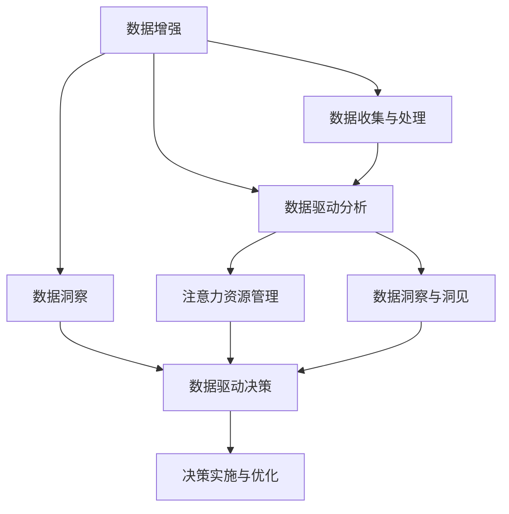

                 

# 注意力经济与数据驱动决策：利用数据增强业务和市场洞察力

## 1. 背景介绍

### 1.1 问题由来
在当今信息爆炸的时代，数据的收集、存储、处理和分析成为了企业决策和业务优化的关键。数据不仅仅是一个资产，更是企业竞争力的重要源泉。企业如何有效利用数据，成为了制约其发展的关键瓶颈。

随着大数据、云计算和人工智能技术的快速发展，数据驱动决策的概念应运而生。数据驱动决策是指通过数据收集、分析和应用，指导企业运营、管理和创新，实现智能化、精准化、动态化决策的过程。

数据驱动决策的核心是数据增强，即通过数据处理和分析，生成可指导决策的高质量信息。这些高质量信息不仅来源于已有的数据，还包含了从各类场景中提取的洞见和洞察。注意力经济（Attention Economy）则是指在数据驱动决策中，企业利用有限的注意力资源，精准聚焦于有价值的洞察，优化决策过程，提升业务效率。

在实际应用中，企业面临的核心问题是如何从海量数据中挖掘出具有商业价值和实际应用意义的信息，并将其转化为可行的商业策略和决策建议。同时，如何提升数据处理的效率和质量，减少决策过程中的不确定性和风险，也是当前企业关注的重点。

### 1.2 问题核心关键点
注意力经济与数据驱动决策的关键点在于以下几点：
1. **数据收集与处理**：如何高效、准确地收集、处理和清洗数据，是数据驱动决策的基础。
2. **数据洞察与洞见**：从数据中提取有价值的信息，生成商业洞察，指导决策。
3. **注意力资源管理**：精准聚焦于有价值的信息，避免资源浪费。
4. **决策实施与优化**：将数据洞察转化为具体的商业策略和决策建议，并持续优化。
5. **数据驱动与人为决策结合**：合理利用数据驱动和人为经验，确保决策的科学性和可行性。

### 1.3 问题研究意义
研究注意力经济与数据驱动决策方法，对于提升企业数据利用率、优化业务流程、增强市场竞争力和决策准确性具有重要意义。具体而言，可以：

1. **提升决策效率**：利用数据增强和注意力经济，企业可以快速响应市场变化，灵活调整策略。
2. **降低决策风险**：通过高质量的数据洞察，降低决策过程中的不确定性和风险。
3. **优化资源配置**：精准聚焦于有价值的洞察，优化资源分配，提高资源利用率。
4. **增强市场洞察力**：利用数据洞察，深入了解市场动态，制定更有效的市场策略。
5. **推动智能化转型**：将数据驱动决策融入业务流程，推动企业智能化转型。

## 2. 核心概念与联系

### 2.1 核心概念概述

为更好地理解注意力经济与数据驱动决策方法，本节将介绍几个密切相关的核心概念：

- **注意力经济（Attention Economy）**：指在信息过载的时代，企业通过有效聚焦于有价值的信息，提高决策效率和质量，最大化信息价值的经济模式。
- **数据增强（Data Augmentation）**：通过数据处理和增强技术，提升数据质量，丰富数据样本，增强数据洞察。
- **数据洞察（Data Insights）**：从数据中提取有价值的信息和洞见，指导决策。
- **数据驱动决策（Data-Driven Decision Making）**：利用数据进行分析和应用，指导企业运营、管理和创新，实现智能化、精准化、动态化决策。
- **数据驱动分析（Data-Driven Analytics）**：利用数据分析技术，提取数据中的有价值信息，支持数据驱动决策。

这些核心概念之间的逻辑关系可以通过以下Mermaid流程图来展示：



这个流程图展示了大数据驱动决策的全过程：
1. 通过数据收集和处理，获得初步数据集。
2. 利用数据增强和驱动分析，从数据中提取有价值的洞察。
3. 利用注意力资源管理，精准聚焦于有价值的洞察。
4. 将数据洞察转化为具体的决策建议和策略，并实施和优化。

这些核心概念共同构成了数据驱动决策的框架，使得企业在利用数据的过程中，可以更高效、精准地进行决策，提升业务价值。

## 3. 核心算法原理 & 具体操作步骤
### 3.1 算法原理概述

基于数据增强和注意力经济的注意力经济与数据驱动决策方法，本质上是一个多步骤的信息提取、处理和应用过程。其核心思想是：通过高效的数据增强和分析，从海量数据中提取有价值的洞察，精准聚焦于有价值的信息，指导企业决策。

形式化地，假设企业的数据集为 $D=\{x_i\}_{i=1}^N$，其中 $x_i$ 为数据点。企业的数据驱动决策过程可以表示为：

1. **数据收集与处理**：收集和预处理数据，获得干净、结构化的数据集 $D$。
2. **数据增强**：通过数据增强技术，扩充和丰富数据集 $D$，增强数据洞察。
3. **数据洞察与洞见**：从增强后的数据集 $D$ 中提取有价值的信息和洞见 $I$。
4. **注意力资源管理**：精准聚焦于有价值的信息 $I$，优先处理和应用 $I$。
5. **数据驱动决策**：利用 $I$ 指导企业的运营、管理和创新，生成决策建议 $S$。
6. **决策实施与优化**：将决策建议 $S$ 应用于企业运营中，并持续优化决策过程。

### 3.2 算法步骤详解

基于数据增强和注意力经济的注意力经济与数据驱动决策方法，具体步骤如下：

**Step 1: 数据收集与处理**
- 收集企业内部的业务数据、市场数据、社交媒体数据等，构建数据集 $D$。
- 对数据进行预处理，包括清洗、归一化、特征提取等操作。
- 使用分布式存储和计算技术，如Hadoop、Spark等，提高数据处理的效率和质量。

**Step 2: 数据增强**
- 应用数据增强技术，如数据补全、数据合成、数据扩增等，扩充和丰富数据集 $D$。
- 使用合成数据生成技术，如GAN、VAE等，生成更多的训练样本。
- 利用数据增强，提高模型在数据集 $D$ 上的泛化能力，增强数据洞察。

**Step 3: 数据洞察与洞见**
- 利用数据分析技术，如回归分析、分类分析、聚类分析等，从数据集 $D$ 中提取有价值的信息和洞见 $I$。
- 使用高级分析工具，如Python的Pandas、Scikit-Learn、TensorFlow等，进行数据分析和建模。
- 通过数据可视化技术，如Matplotlib、Seaborn等，展示数据洞察和洞见，辅助决策。

**Step 4: 注意力资源管理**
- 定义决策指标和评估标准，量化决策效果。
- 利用注意力模型，如注意力机制、兴趣图等，识别有价值的信息 $I$。
- 优先处理和应用有价值的信息 $I$，避免资源浪费。

**Step 5: 数据驱动决策**
- 将有价值的信息 $I$ 转化为具体的决策建议 $S$。
- 利用决策支持系统（DSS），结合企业经验和业务知识，生成决策方案。
- 通过模拟和仿真技术，评估决策方案的效果，优化决策过程。

**Step 6: 决策实施与优化**
- 将决策建议 $S$ 应用于企业运营中，验证决策效果。
- 持续收集和处理新的数据，定期重新进行数据增强和分析，提升决策质量。
- 通过反馈机制，持续优化决策过程，提升决策效率和效果。

### 3.3 算法优缺点

基于数据增强和注意力经济的注意力经济与数据驱动决策方法具有以下优点：
1. **提升决策效率**：通过数据增强和注意力经济，企业可以快速响应市场变化，灵活调整策略。
2. **降低决策风险**：通过高质量的数据洞察，降低决策过程中的不确定性和风险。
3. **优化资源配置**：精准聚焦于有价值的洞察，优化资源分配，提高资源利用率。
4. **增强市场洞察力**：利用数据洞察，深入了解市场动态，制定更有效的市场策略。
5. **推动智能化转型**：将数据驱动决策融入业务流程，推动企业智能化转型。

同时，该方法也存在一定的局限性：
1. **依赖高质量数据**：数据增强和洞察提取依赖高质量的数据，数据收集和处理过程复杂。
2. **计算资源消耗大**：数据增强和分析过程计算量大，需要高性能计算资源。
3. **模型复杂度高**：数据增强和注意力模型的构建复杂，需要较强的技术背景。
4. **数据隐私问题**：数据收集和处理可能涉及隐私问题，需要严格遵守数据保护法规。

尽管存在这些局限性，但就目前而言，基于数据增强和注意力经济的注意力经济与数据驱动决策方法仍是大数据时代企业决策的重要范式。未来相关研究的重点在于如何进一步降低数据增强和分析的计算成本，提高模型的泛化能力和可解释性，同时兼顾数据隐私和安全性等因素。

### 3.4 算法应用领域

基于数据增强和注意力经济的注意力经济与数据驱动决策方法，在多个领域得到了广泛的应用，例如：

- **市场营销**：通过分析客户行为数据，生成精准的客户画像，制定个性化营销策略。
- **供应链管理**：利用历史销售数据和市场动态，优化供应链流程，提升供应链效率。
- **金融风险管理**：从金融数据中提取风险信号，识别潜在的风险点，制定风险管理策略。
- **客户服务**：利用客户反馈和行为数据，生成客户满意度评估，优化客户服务流程。
- **人力资源管理**：分析员工绩效数据和行为数据，生成人力资源优化建议，提升组织效率。

除了上述这些经典应用外，基于数据增强和注意力经济的注意力经济与数据驱动决策方法还被创新性地应用到更多场景中，如智能制造、智慧城市、智能家居等，为企业带来了新的业务机会和增长点。随着数据增强和分析技术的持续演进，相信该方法将在更多领域得到应用，推动企业数字化转型，提升竞争力。

## 4. 数学模型和公式 & 详细讲解  
### 4.1 数学模型构建

本节将使用数学语言对注意力经济与数据驱动决策方法进行更加严格的刻画。

假设企业的数据集为 $D=\{x_i\}_{i=1}^N$，其中 $x_i$ 为数据点。设企业的数据洞察为 $I$，决策建议为 $S$。

定义企业的数据驱动决策过程为：
$$
S = f(I)
$$

其中 $f$ 为决策映射函数，将有价值的信息 $I$ 转化为决策建议 $S$。

### 4.2 公式推导过程

以下我们以市场营销领域为例，推导数据洞察与决策映射的过程。

假设企业通过数据增强和分析，从客户行为数据中提取了有价值的信息 $I$，包括客户画像、购买偏好、转化率等。定义客户画像为 $P_i = (x_{i1}, x_{i2}, ..., x_{in})$，其中 $x_{ij}$ 为第 $j$ 个客户行为特征。

设客户画像与购买行为的关系为 $y = \alpha P + \beta$，其中 $\alpha$ 为特征系数，$\beta$ 为常数项。利用最小二乘法，可以得到客户画像与购买行为的关系模型：

$$
\alpha = (P^TP)^{-1}P^Ty
$$

利用训练好的模型，可以得到每个客户的行为预测 $y_i = \alpha P_i + \beta$。

根据决策映射函数 $f$，生成针对每个客户的个性化营销策略 $S_i = (x_{i1}, x_{i2}, ..., x_{in}, y_i)$，其中 $x_{ij}$ 为原始客户行为特征，$y_i$ 为行为预测。

通过数据洞察与决策映射，企业可以生成个性化的营销策略，提升市场营销效果。

## 5. 项目实践：代码实例和详细解释说明
### 5.1 开发环境搭建

在进行数据增强和注意力经济与数据驱动决策方法实践前，我们需要准备好开发环境。以下是使用Python进行PyTorch开发的环境配置流程：

1. 安装Anaconda：从官网下载并安装Anaconda，用于创建独立的Python环境。

2. 创建并激活虚拟环境：
```bash
conda create -n pytorch-env python=3.8 
conda activate pytorch-env
```

3. 安装PyTorch：根据CUDA版本，从官网获取对应的安装命令。例如：
```bash
conda install pytorch torchvision torchaudio cudatoolkit=11.1 -c pytorch -c conda-forge
```

4. 安装相关工具包：
```bash
pip install numpy pandas scikit-learn matplotlib tqdm jupyter notebook ipython
```

完成上述步骤后，即可在`pytorch-env`环境中开始数据增强和注意力经济与数据驱动决策方法的实践。

### 5.2 源代码详细实现

这里我们以市场营销领域为例，给出使用PyTorch进行数据增强和注意力经济与数据驱动决策方法的完整代码实现。

首先，定义客户行为数据集：

```python
import pandas as pd
import numpy as np

# 加载客户行为数据
customer_data = pd.read_csv('customer_data.csv')
customer_data.head()
```

然后，进行数据预处理：

```python
# 数据清洗
customer_data = customer_data.dropna(subset=['age', 'income', 'purchases'])
customer_data = customer_data.drop_duplicates()

# 特征工程
customer_data['income_binary'] = customer_data['income'].apply(lambda x: 1 if x >= 5000 else 0)
customer_data = pd.get_dummies(customer_data, columns=['gender', 'region'], prefix='category_')
customer_data.head()
```

接着，进行数据增强和分析：

```python
# 数据增强
customer_data['age_range'] = customer_data['age'].apply(lambda x: 'young' if x < 30 else 'middle' if 30 <= x < 50 else 'old')
customer_data = customer_data.drop('age', axis=1)
customer_data.head()

# 数据洞察
from sklearn.linear_model import LinearRegression
from sklearn.metrics import mean_squared_error

# 特征选择
features = ['age_range', 'income_binary', 'category_gender_male', 'category_region_north']
X = customer_data[features]
y = customer_data['purchases']

# 训练模型
model = LinearRegression()
model.fit(X, y)

# 预测客户行为
y_pred = model.predict(X)
rmse = np.sqrt(mean_squared_error(y, y_pred))
print(f'RMSE: {rmse:.2f}')
```

最后，进行决策映射和结果展示：

```python
# 决策映射
S = customer_data[['age_range', 'income_binary', 'purchases', 'y_pred']]
S.head()

# 结果展示
import matplotlib.pyplot as plt

plt.scatter(customer_data['age_range'], customer_data['purchases'], color='blue')
plt.plot(customer_data['age_range'], y_pred, color='red', label='Prediction')
plt.legend()
plt.show()
```

以上就是使用PyTorch进行市场营销领域数据增强和注意力经济与数据驱动决策方法的完整代码实现。可以看到，利用Python和PyTorch，可以方便地进行数据增强、分析、洞察提取和决策映射，助力企业制定更加精准的市场营销策略。

### 5.3 代码解读与分析

让我们再详细解读一下关键代码的实现细节：

**数据预处理**：
- 使用pandas库加载客户行为数据，并进行数据清洗，包括去除缺失值和重复样本。
- 进行特征工程，将收入、性别、地区等原始特征转换为二进制特征，并添加新的年龄分组特征，便于后续分析。

**数据增强**：
- 添加新的年龄分组特征，将年龄分为年轻、中年和老年三组，便于分析不同年龄段的行为特征。
- 去除年龄原始特征，以减少模型复杂度。

**数据洞察**：
- 使用sklearn库的线性回归模型，训练客户行为预测模型。
- 通过均方误差评估模型的预测效果，RMSE越小，模型的预测效果越好。

**决策映射**：
- 将原始数据和预测结果组合为决策建议，便于展示和分析。
- 使用matplotlib库绘制散点图和预测曲线，展示客户行为与预测结果的对比。

通过上述代码实现，可以清晰地看到数据增强和注意力经济与数据驱动决策方法在市场营销领域的应用过程。Python和PyTorch的强大功能，使得数据处理和分析变得简单高效，有助于企业快速迭代和优化决策策略。

## 6. 实际应用场景
### 6.1 智能制造

在智能制造领域，基于数据增强和注意力经济的注意力经济与数据驱动决策方法可以优化生产流程，提升生产效率。通过收集生产数据，分析设备状态和生产效率，生成优化建议和预测报告，可以提前识别潜在的生产问题，进行预防性维护，减少停机时间，提升生产效率。

具体而言，可以收集生产过程中的设备状态、生产效率、原材料消耗等数据，构建数据集 $D$。利用数据增强和分析，提取设备状态与生产效率之间的关系，生成优化建议。通过注意力模型，精准聚焦于有价值的洞察，指导设备维护和生产调整。

### 6.2 智慧城市

在智慧城市治理中，基于数据增强和注意力经济的注意力经济与数据驱动决策方法可以优化城市管理，提升服务质量。通过分析交通数据、环境数据、公共安全数据等，生成城市管理决策建议，可以及时响应城市突发事件，优化城市资源配置，提升城市运行效率。

具体而言，可以收集交通流量、空气质量、公共安全事件等数据，构建数据集 $D$。利用数据增强和分析，提取交通流量与空气质量之间的关系，生成交通管理建议。通过注意力模型，精准聚焦于有价值的洞察，优化交通信号灯控制、空气质量监测、公共安全预警等城市管理流程。

### 6.3 智能家居

在智能家居领域，基于数据增强和注意力经济的注意力经济与数据驱动决策方法可以提升用户体验，优化家居控制。通过分析用户行为数据、环境数据、设备状态等，生成家居控制建议，可以实时调整家居设备，提升用户舒适度和生活质量。

具体而言，可以收集用户行为数据、环境数据、设备状态等数据，构建数据集 $D$。利用数据增强和分析，提取用户行为与家居环境之间的关系，生成家居控制建议。通过注意力模型，精准聚焦于有价值的洞察，优化家居温度控制、照明调节、音乐播放等家居控制流程。

### 6.4 未来应用展望

随着数据增强和分析技术的持续演进，基于数据增强和注意力经济的注意力经济与数据驱动决策方法将在更多领域得到应用，为各行各业带来新的业务机会和增长点。

在智慧医疗领域，基于数据增强和注意力经济的注意力经济与数据驱动决策方法可以优化医疗资源配置，提升医疗服务质量。通过分析患者数据、医疗设备数据、医院运营数据等，生成医疗决策建议，可以精准匹配患者需求，优化医疗资源配置，提升患者满意度。

在智能教育领域，基于数据增强和注意力经济的注意力经济与数据驱动决策方法可以优化教学资源配置，提升教学效果。通过分析学生数据、教师数据、课程数据等，生成教学决策建议，可以精准匹配学生需求，优化教学资源配置，提升教学效果。

在智慧农业领域，基于数据增强和注意力经济的注意力经济与数据驱动决策方法可以优化农业生产管理，提升农业生产效率。通过分析气象数据、土壤数据、作物生长数据等，生成农业生产决策建议，可以精准匹配作物需求，优化农业资源配置，提升农业生产效率。

以上应用场景展示了基于数据增强和注意力经济的注意力经济与数据驱动决策方法在不同领域的应用潜力，相信未来将有更多创新应用出现，推动各行各业智能化转型。

## 7. 工具和资源推荐
### 7.1 学习资源推荐

为了帮助开发者系统掌握数据增强和注意力经济与数据驱动决策的理论基础和实践技巧，这里推荐一些优质的学习资源：

1. 《数据增强与数据驱动决策》系列博文：由数据科学家撰写，深入浅出地介绍了数据增强和数据驱动决策的基本概念和前沿技术。

2. CS229《机器学习》课程：斯坦福大学开设的机器学习明星课程，涵盖数据分析、模型训练、决策评估等核心内容，是理解数据驱动决策的重要基础。

3. 《深度学习与决策分析》书籍：专注于深度学习在决策分析中的应用，介绍了多种深度学习算法和决策模型，助力企业决策优化。

4. Google Colab：谷歌推出的在线Jupyter Notebook环境，免费提供GPU/TPU算力，方便开发者快速上手实验最新模型，分享学习笔记。

5. TensorFlow Hub：谷歌提供的预训练模型库，集成了大量SOTA模型，支持数据增强和注意力经济与数据驱动决策的实现。

通过对这些资源的学习实践，相信你一定能够快速掌握数据增强和注意力经济与数据驱动决策的精髓，并用于解决实际的业务问题。
###  7.2 开发工具推荐

高效的开发离不开优秀的工具支持。以下是几款用于数据增强和注意力经济与数据驱动决策开发的常用工具：

1. PyTorch：基于Python的开源深度学习框架，灵活动态的计算图，适合快速迭代研究。支持分布式计算，适用于大规模数据处理。

2. TensorFlow：由Google主导开发的开源深度学习框架，生产部署方便，适合大规模工程应用。支持分布式计算，适用于大规模数据处理。

3. Hadoop/Spark：分布式存储和计算框架，支持大规模数据处理和分析，适用于海量数据增强和分析。

4. Pandas：Python数据分析库，支持高效的数据清洗、特征工程和统计分析。

5. Matplotlib/Seaborn：数据可视化库，支持绘制散点图、折线图、柱状图等图表，辅助数据洞察和决策。

6. Weights & Biases：模型训练的实验跟踪工具，可以记录和可视化模型训练过程中的各项指标，方便对比和调优。

合理利用这些工具，可以显著提升数据增强和注意力经济与数据驱动决策的开发效率，加快创新迭代的步伐。

### 7.3 相关论文推荐

数据增强和注意力经济与数据驱动决策技术的发展源于学界的持续研究。以下是几篇奠基性的相关论文，推荐阅读：

1. Attention is All You Need（即Transformer原论文）：提出了Transformer结构，开启了深度学习在NLP和数据驱动决策中的应用。

2. Deep Learning for Marketing Analytics: Learning Customer Insights from Business Data: A Review：综述了深度学习在市场营销分析中的应用，介绍了数据增强和注意力经济与数据驱动决策的核心技术。

3. Data Augmentation Methods: An Empirical Survey：综述了数据增强方法的研究现状，介绍了各种数据增强技术，为数据增强实践提供了参考。

4. Data-Driven Decision Making in Action: Strategies for Business Analytics and Forecasting：介绍了数据驱动决策的核心策略，包括数据增强和注意力经济与数据驱动决策的实现方法。

5. Data-Driven Analytics for Business Intelligence：介绍了数据驱动决策在商业智能中的应用，包括数据增强和注意力经济与数据驱动决策的实践案例。

这些论文代表了大数据驱动决策技术的发展脉络。通过学习这些前沿成果，可以帮助研究者把握学科前进方向，激发更多的创新灵感。

## 8. 总结：未来发展趋势与挑战
### 8.1 总结

本文对基于数据增强和注意力经济的注意力经济与数据驱动决策方法进行了全面系统的介绍。首先阐述了数据增强和注意力经济与数据驱动决策的核心概念，明确了数据增强、数据洞察、注意力资源管理和数据驱动决策的全过程。其次，从原理到实践，详细讲解了数据增强和注意力经济与数据驱动决策的数学模型和操作步骤，给出了市场营销领域的完整代码实现。同时，本文还探讨了数据增强和注意力经济与数据驱动决策方法在智能制造、智慧城市、智能家居等多个领域的应用前景，展示了其广泛的适用性和巨大潜力。

通过本文的系统梳理，可以看到，基于数据增强和注意力经济的注意力经济与数据驱动决策方法正在成为数据驱动决策的重要范式，极大地拓展了企业数据利用率，提升了业务效率和决策质量。未来，随着数据增强和分析技术的持续演进，该方法将带来更多的创新应用，推动企业智能化转型，带来新的商业机会和增长点。

### 8.2 未来发展趋势

展望未来，数据增强和注意力经济与数据驱动决策技术将呈现以下几个发展趋势：

1. **数据收集与处理自动化**：利用自动化工具和技术，提升数据收集和处理的效率和质量，减少人工干预。
2. **数据增强技术的创新**：引入更多先进的增强技术，如GAN、VAE等，丰富数据样本，提升数据洞察。
3. **注意力模型的优化**：开发更加高效和可解释的注意力模型，提升数据洞察的精度和泛化能力。
4. **跨领域知识整合**：将符号化的先验知识，如知识图谱、逻辑规则等，与神经网络模型进行融合，提升数据洞察的全面性和准确性。
5. **多模态数据融合**：将视觉、语音、文本等多种模态数据进行整合，提升数据洞察的多样性和丰富性。

以上趋势凸显了数据增强和注意力经济与数据驱动决策技术的广阔前景。这些方向的探索发展，必将进一步提升数据驱动决策的效果和应用范围，为企业的智能化转型提供强有力的技术支持。

### 8.3 面临的挑战

尽管数据增强和注意力经济与数据驱动决策技术已经取得了显著成果，但在其发展过程中，仍面临诸多挑战：

1. **数据隐私和安全问题**：数据收集和处理过程中，如何保护数据隐私和安全，防止数据泄露和滥用，仍需加强。
2. **计算资源消耗大**：数据增强和分析过程计算量大，需要高性能计算资源，增加企业运营成本。
3. **模型复杂度高**：数据增强和注意力模型的构建复杂，需要较强的技术背景，增加了企业技术门槛。
4. **数据质量和一致性问题**：数据增强和分析依赖高质量的数据，如何保证数据的完整性和一致性，仍需进一步研究。

尽管存在这些挑战，但就目前而言，基于数据增强和注意力经济的注意力经济与数据驱动决策方法仍是大数据时代企业决策的重要范式。未来相关研究的重点在于如何进一步降低数据增强和分析的计算成本，提高模型的泛化能力和可解释性，同时兼顾数据隐私和安全性等因素。

### 8.4 研究展望

面向未来，数据增强和注意力经济与数据驱动决策技术的研究需要在以下几个方面寻求新的突破：

1. **自动化数据增强**：开发自动化数据增强工具，提升数据增强的效率和质量，降低企业运营成本。
2. **轻量级注意力模型**：开发轻量级、高效、可解释的注意力模型，提升数据洞察的泛化能力和应用范围。
3. **多模态数据融合**：将视觉、语音、文本等多种模态数据进行整合，提升数据洞察的多样性和丰富性。
4. **跨领域知识融合**：将符号化的先验知识，如知识图谱、逻辑规则等，与神经网络模型进行融合，提升数据洞察的全面性和准确性。
5. **智能化决策支持**：结合人工智能技术，如自然语言处理、强化学习等，提升决策支持的智能化水平。

这些研究方向的探索，必将引领数据增强和注意力经济与数据驱动决策技术迈向更高的台阶，为构建安全、可靠、可解释、可控的智能决策系统铺平道路。面向未来，数据增强和注意力经济与数据驱动决策技术需要与其他人工智能技术进行更深入的融合，协同发力，共同推动企业智能化转型，提升决策效果和业务价值。

## 9. 附录：常见问题与解答

**Q1：数据增强和注意力经济与数据驱动决策方法是否适用于所有企业？**

A: 数据增强和注意力经济与数据驱动决策方法在各行各业都有广泛的应用，但不同企业的数据特性、业务场景和决策需求各不相同。企业需要根据自身的特点，选择合适的数据增强和洞察提取方法，并结合业务知识进行决策优化。对于数据量较小、数据质量较差或数据分布不均匀的企业，可能需要先进行数据预处理和清洗，才能获得高质量的数据洞察。

**Q2：如何选择合适的数据增强方法？**

A: 数据增强方法的选择应根据具体的业务场景和数据特性进行。常用的数据增强方法包括数据补全、数据合成、数据扩增等。例如，在图像识别任务中，可以使用数据扩增技术，如旋转、翻转、裁剪等，生成更多的训练样本。在自然语言处理任务中，可以使用数据补全、回译等技术，丰富训练数据。

**Q3：如何进行数据洞察提取？**

A: 数据洞察提取应根据具体的业务场景和决策需求进行。常用的数据洞察提取方法包括回归分析、分类分析、聚类分析等。例如，在市场营销任务中，可以利用回归分析方法，分析客户行为数据与购买行为之间的关系，生成客户画像。在金融风险管理任务中，可以利用聚类分析方法，识别潜在的风险群体，制定风险管理策略。

**Q4：数据增强和注意力经济与数据驱动决策方法的计算成本如何？**

A: 数据增强和注意力经济与数据驱动决策方法的计算成本较高，需要高性能计算资源。可以通过分布式计算和并行计算技术，优化数据增强和分析过程，降低计算成本。例如，使用Hadoop/Spark等分布式计算框架，可以提升数据处理和分析的效率和质量。

**Q5：数据增强和注意力经济与数据驱动决策方法的精度如何？**

A: 数据增强和注意力经济与数据驱动决策方法的精度取决于数据的质量和模型的构建。数据增强技术可以提高模型的泛化能力和鲁棒性，但数据的质量对模型的影响更为关键。对于高质量的数据集，数据增强和注意力经济与数据驱动决策方法可以显著提升模型的精度和泛化能力。但面对数据质量较差、噪声较多的情况，可能需要先进行数据预处理和清洗，才能获得理想的效果。

通过回答这些问题，可以帮助企业更好地理解数据增强和注意力经济与数据驱动决策方法的实际应用和潜在的挑战，从而在实际业务场景中进行更科学、高效的决策优化。

---

作者：禅与计算机程序设计艺术 / Zen and the Art of Computer Programming

