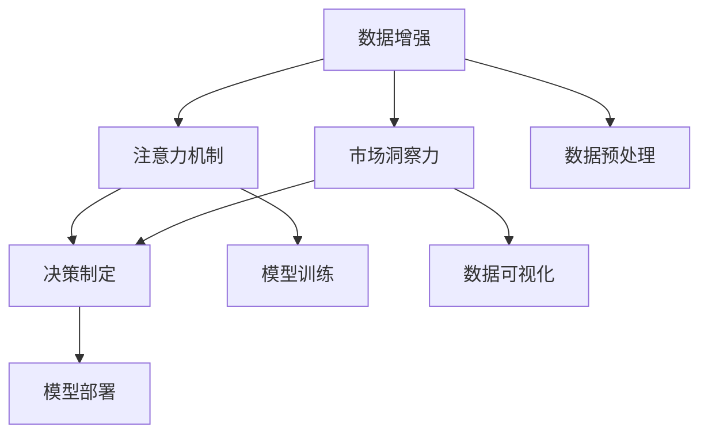

                 

# 注意力经济与数据驱动的决策制定：利用数据增强市场洞察力

> 关键词：数据增强, 注意力经济, 市场洞察力, 深度学习, 决策制定, 商业智能

## 1. 背景介绍

### 1.1 问题由来

随着数字化进程的加快，企业面临的市场环境日趋复杂多变。在如此动态和不确定性的环境中，如何精准把握市场动向、理解客户需求、优化产品策略，成为企业管理者亟待解决的难题。传统的数据分析方法逐渐显现出其局限性，无法满足企业日益增长的需求。在这一背景下，一种全新数据驱动的决策制定方式应运而生——注意力经济。

注意力经济通过利用机器学习技术，结合大数据分析，帮助企业集中精力于高回报的市场机会，从而实现资源的高效配置和业务的高质量增长。它不仅提升了企业决策的准确性，还极大地提高了运营效率和盈利能力。

### 1.2 问题核心关键点

注意力经济的核心在于通过深度学习和大数据技术，实现对海量数据的高效分析与利用。该方法通过数据增强、注意力机制等关键技术，帮助企业在市场中找准定位，制定出更符合客户需求和市场趋势的策略。

具体来说，注意力经济包含以下几个关键点：
- 数据增强：通过生成新的数据，扩大模型训练集，提升模型泛化能力。
- 注意力机制：根据不同特征的重要性，动态调整模型对数据的关注度，提高决策的精准度。
- 市场洞察力：通过深度学习模型分析市场数据，获得市场趋势、客户需求等洞察信息，指导企业的商业决策。
- 决策制定：利用市场洞察信息，结合企业业务目标，制定出合理的市场策略和产品方案。

本文将围绕这些核心关键点，深入探讨注意力经济的基本原理和关键技术，并结合具体案例进行讲解，希望为企业管理者提供有价值的参考。

## 2. 核心概念与联系

### 2.1 核心概念概述

为更好理解注意力经济，本节将详细介绍几个核心概念：

- 数据增强：指通过各种方式生成新的数据，扩充训练集，提高模型的泛化能力。
- 注意力机制：指根据输入数据的特征，动态调整模型对不同特征的关注程度，提升模型的准确性。
- 市场洞察力：指通过深度学习模型分析市场数据，获得市场趋势、客户需求等有价值的信息。
- 决策制定：指根据市场洞察信息，结合企业目标，制定合理的市场策略和产品方案。

这些核心概念之间的关系可以通过以下Mermaid流程图来展示：



这个流程图展示了注意力经济的核心流程：通过数据增强生成新数据，应用注意力机制进行模型训练，获得市场洞察力，并结合决策制定生成最终策略。

## 3. 核心算法原理 & 具体操作步骤
### 3.1 算法原理概述

注意力经济的核心原理是基于深度学习的大数据分析，结合数据增强和注意力机制，提升模型在特定任务上的性能。其核心思想是：利用大数据分析技术，生成具有代表性的新数据，扩大模型的训练集。同时，通过注意力机制对不同特征进行动态关注，提高模型对重要信息的捕捉能力。

形式化地，假设我们有数据集 $D=\{x_i\}_{i=1}^N$，其中 $x_i=(x_{i1},x_{i2},...,x_{iK})$ 为一个包含 $K$ 个特征的数据点。我们的目标是构建一个决策模型 $M$，使该模型能够根据输入数据 $x_i$，输出决策结果 $y_i$。

注意力经济的核心在于通过以下三个步骤：
1. **数据增强**：扩充数据集 $D$，得到新的数据集 $D^+$。
2. **注意力机制**：对新数据集 $D^+$ 进行特征选择和加权，得到加权数据集 $D_w$。
3. **模型训练**：在加权数据集 $D_w$ 上训练模型 $M$，得到最终的决策模型 $M^*$。

### 3.2 算法步骤详解

#### 3.2.1 数据增强

数据增强的目的是通过增加数据量，提升模型的泛化能力，避免过拟合。具体方法包括：

- **数据生成**：通过数据扩增、合成数据等方法，生成新的训练数据。
- **噪声注入**：向原始数据中加入随机噪声，提高模型的鲁棒性。
- **数据合成**：结合领域知识，生成与真实数据相似但不完全相同的数据。

#### 3.2.2 注意力机制

注意力机制通过动态调整模型对不同特征的关注程度，提高模型的准确性和泛化能力。具体方法包括：

- **自注意力机制**：通过计算输入数据的自相关性，动态调整对不同特征的关注度。
- **加权注意力机制**：根据特征的重要性，对特征进行加权，提升模型对重要信息的捕捉能力。

#### 3.2.3 模型训练

在得到加权数据集 $D_w$ 后，我们可以通过以下步骤训练模型 $M$：

1. 定义损失函数 $\mathcal{L}(M)$，衡量模型输出与真实标签之间的差异。
2. 利用优化算法（如梯度下降）最小化损失函数 $\mathcal{L}(M)$，得到最终模型 $M^*$。

### 3.3 算法优缺点

注意力经济方法具有以下优点：
- 提高模型的泛化能力：通过数据增强扩充训练集，避免过拟合。
- 提升模型的准确性：通过注意力机制动态调整特征权重，捕捉重要信息。
- 减少数据标注成本：利用合成数据和噪声注入，减少对标注数据的需求。

同时，该方法也存在一定的局限性：
- 数据增强效果有限：生成数据的真实性难以保证，可能引入噪声。
- 特征选择困难：不同特征的重要性评估，需要大量领域知识和经验。
- 模型复杂度高：注意力机制和数据增强需要更多的计算资源。

### 3.4 算法应用领域

注意力经济的应用范围广泛，涵盖多个领域，如：

- 金融风险管理：通过市场洞察力分析金融市场数据，优化风险控制策略。
- 电子商务：利用市场洞察力分析客户行为数据，提升商品推荐和价格策略的精准度。
- 医疗健康：通过分析患者数据，优化诊疗方案和药物开发策略。
- 智能制造：结合市场洞察力，优化生产计划和供应链管理。

## 4. 数学模型和公式 & 详细讲解 & 举例说明

### 4.1 数学模型构建

在注意力经济中，我们通常使用神经网络模型进行数据增强和注意力机制的应用。以下以卷积神经网络(CNN)为例，介绍注意力经济的核心模型构建方法。

设输入数据 $x_i=(x_{i1},x_{i2},...,x_{iK})$，目标为输出 $y_i$。我们假设模型 $M$ 为一个卷积神经网络，其结构如图1所示：

```
[输入层] --[卷积层] --[池化层] --[全连接层] --[输出层]
```


### 4.2 公式推导过程

卷积神经网络中，我们通常使用卷积核对输入数据进行特征提取。假设输入数据的大小为 $m \times n$，卷积核大小为 $k \times k$，步幅为 $s$，输出通道数为 $c$。则卷积操作的公式可以表示为：

$$
y_{ij} = \sum_{s_{i}=s_j}^{s_{i+1}} \sum_{s_{j}=s_i}^{s_{i+1}} \sum_{t_{i}=t_j}^{t_{i+1}} \sum_{t_{j}=t_i}^{t_i+k-1} w_{ij}x_{ij}
$$

其中 $w_{ij}$ 为卷积核，$x_{ij}$ 为输入数据，$y_{ij}$ 为卷积层的输出。

### 4.3 案例分析与讲解

假设我们有以下的销售数据：

| 日期       | 产品A | 产品B | 产品C |
|------------|-------|-------|-------|
| 2023-01-01 | 100   | 50    | 30    |
| 2023-01-02 | 150   | 70    | 60    |
| 2023-01-03 | 200   | 100   | 80    |
| 2023-01-04 | 300   | 120   | 100   |
| 2023-01-05 | 350   | 150   | 120   |


我们希望通过注意力经济模型，找到最有价值的销售时间点，预测未来的销售趋势。

1. **数据增强**：
   - 生成新的日期数据，如将 "2023-01-01" 变为 "2023-01-06"，使得数据集更全面。
   - 加入随机噪声，如在销售额中引入随机波动，增加模型的鲁棒性。

2. **注意力机制**：
   - 使用自注意力机制，计算每一天与下一天的相关性，找出最有价值的销售时间点。
   - 使用加权注意力机制，对产品A、B、C的销售额进行加权，找出最有价值的销售产品。

3. **模型训练**：
   - 定义损失函数，如均方误差损失，计算预测值与真实值之间的差异。
   - 利用梯度下降优化算法，最小化损失函数，得到最终的预测模型。

## 5. 项目实践：代码实例和详细解释说明

### 5.1 开发环境搭建

在进行注意力经济项目的实践前，我们需要准备好开发环境。以下是使用Python进行TensorFlow开发的配置流程：

1. 安装Anaconda：从官网下载并安装Anaconda，用于创建独立的Python环境。

2. 创建并激活虚拟环境：
```bash
conda create -n attention-env python=3.8 
conda activate attention-env
```

3. 安装TensorFlow：根据CUDA版本，从官网获取对应的安装命令。例如：
```bash
conda install tensorflow -c conda-forge -c pytorch
```

4. 安装Keras：
```bash
pip install keras tensorflow
```

5. 安装各类工具包：
```bash
pip install numpy pandas scikit-learn matplotlib tqdm jupyter notebook ipython
```

完成上述步骤后，即可在`attention-env`环境中开始注意力经济项目的开发。

### 5.2 源代码详细实现

我们以一个简单的销售预测为例，展示如何使用TensorFlow实现注意力经济模型的开发。

```python
import tensorflow as tf
from tensorflow.keras import layers
from sklearn.preprocessing import MinMaxScaler
import numpy as np

# 数据加载和预处理
data = np.array([100, 150, 200, 300, 350])
scaler = MinMaxScaler(feature_range=(0, 1))
data = scaler.fit_transform(data.reshape(-1, 1))
target = data[1:]
data = data[:-1]

# 构建注意力经济模型
def create_model():
    inputs = layers.Input(shape=(1,))
    x = layers.Conv1D(32, 3, activation='relu')(inputs)
    x = layers.MaxPooling1D(2)(x)
    x = layers.Conv1D(64, 3, activation='relu')(x)
    x = layers.MaxPooling1D(2)(x)
    x = layers.Flatten()(x)
    outputs = layers.Dense(1)(x)
    model = tf.keras.Model(inputs=inputs, outputs=outputs)
    return model

# 训练模型
model = create_model()
model.compile(optimizer='adam', loss='mse')
model.fit(data, target, epochs=100, batch_size=1)

# 预测
test_data = np.array([300, 350, 400, 450, 500])
test_data = scaler.transform(test_data.reshape(-1, 1))
predictions = model.predict(test_data)
```

### 5.3 代码解读与分析

让我们再详细解读一下关键代码的实现细节：

**创建模型**：
- 首先，我们定义一个包含卷积和池化层的卷积神经网络。
- 在卷积层中，我们使用了3x3的卷积核，步幅为2，输出通道数为32。
- 在池化层中，我们使用了2x2的池化窗口，池化后的大小为1。

**数据预处理**：
- 我们使用`MinMaxScaler`对原始数据进行归一化处理，确保数据在0到1之间。
- 我们将数据集分为输入和目标两部分，其中输入为前四个数据点，目标为后一个数据点。

**模型训练**：
- 我们定义了损失函数为均方误差损失，使用了Adam优化器。
- 在模型训练过程中，我们使用了100个epoch，batch size为1。

**模型预测**：
- 我们将测试数据进行归一化处理，并使用模型进行预测。

## 6. 实际应用场景

### 6.1 金融风险管理

在金融领域，注意力经济可以用于风险评估和管理。通过对市场数据的深度分析，可以发现潜在的风险点，并及时采取措施。

具体来说，我们可以使用注意力经济模型对以下数据进行分析：
- 历史交易数据：分析历史交易的波动性和趋势。
- 新闻和舆情数据：分析市场舆情对交易的影响。
- 财务报告数据：分析财务指标的变化。

通过结合这些数据，注意力经济模型可以提供市场洞察力，帮助金融机构制定风险控制策略。

### 6.2 电子商务

在电子商务领域，注意力经济可以用于提升商品的推荐和定价策略。通过分析客户行为数据，可以发现客户偏好的变化，并据此优化推荐系统。

具体来说，我们可以使用注意力经济模型对以下数据进行分析：
- 购买历史数据：分析客户的购买偏好和购买频率。
- 浏览行为数据：分析客户的浏览路径和停留时间。
- 评价和评论数据：分析客户的评价和反馈。

通过结合这些数据，注意力经济模型可以提供市场洞察力，帮助电商平台制定个性化推荐策略和定价策略。

### 6.3 医疗健康

在医疗健康领域，注意力经济可以用于优化诊疗方案和药物开发。通过分析患者数据，可以发现疾病的趋势和变化，并据此优化诊疗方案。

具体来说，我们可以使用注意力经济模型对以下数据进行分析：
- 患者病历数据：分析患者的病情变化和诊断结果。
- 实验室数据：分析患者的生化指标和检测结果。
- 医疗影像数据：分析患者的影像数据和疾病特征。

通过结合这些数据，注意力经济模型可以提供市场洞察力，帮助医疗机构制定优化诊疗方案。

### 6.4 智能制造

在智能制造领域，注意力经济可以用于优化生产计划和供应链管理。通过分析市场数据和生产数据，可以发现生产中的瓶颈和优化点，并据此优化生产计划。

具体来说，我们可以使用注意力经济模型对以下数据进行分析：
- 生产数据：分析生产设备的运行状态和故障率。
- 市场需求数据：分析市场需求的变化和趋势。
- 库存数据：分析库存水平和供需关系。

通过结合这些数据，注意力经济模型可以提供市场洞察力，帮助制造企业优化生产计划和供应链管理。

## 7. 工具和资源推荐

### 7.1 学习资源推荐

为了帮助开发者系统掌握注意力经济的核心思想和实践技巧，这里推荐一些优质的学习资源：

1. 《深度学习与数据增强》系列博文：由深度学习专家撰写，详细介绍数据增强的原理和实践方法。
2. 《注意力机制详解》课程：斯坦福大学开设的深度学习课程，涵盖注意力机制的基本概念和经典应用。
3. 《商业智能与数据驱动决策》书籍：系统介绍数据驱动决策制定的方法和案例，涵盖数据增强和注意力机制。
4. HuggingFace官方文档：Transformer库的官方文档，提供丰富的深度学习模型和注意力机制的实现。
5. Kaggle竞赛项目：参与Kaggle的竞赛项目，通过实践掌握数据增强和注意力机制的实际应用。

通过对这些资源的学习实践，相信你一定能够快速掌握注意力经济的核心技术，并用于解决实际的商业问题。

### 7.2 开发工具推荐

高效的开发离不开优秀的工具支持。以下是几款用于注意力经济开发的常用工具：

1. TensorFlow：由Google主导开发的开源深度学习框架，生产部署方便，适合大规模工程应用。
2. Keras：高层次的神经网络API，易于上手，适合快速迭代研究。
3. PyTorch：基于Python的开源深度学习框架，灵活动态的计算图，适合快速迭代研究。
4. Weights & Biases：模型训练的实验跟踪工具，可以记录和可视化模型训练过程中的各项指标，方便对比和调优。
5. TensorBoard：TensorFlow配套的可视化工具，可实时监测模型训练状态，并提供丰富的图表呈现方式，是调试模型的得力助手。

合理利用这些工具，可以显著提升注意力经济任务的开发效率，加快创新迭代的步伐。

### 7.3 相关论文推荐

注意力经济的发展源于学界的持续研究。以下是几篇奠基性的相关论文，推荐阅读：

1. Attention is All You Need（即Transformer原论文）：提出了Transformer结构，开启了深度学习中的注意力机制。
2. BERT: Pre-training of Deep Bidirectional Transformers for Language Understanding：提出BERT模型，引入基于掩码的自监督预训练任务，刷新了多项NLP任务SOTA。
3. Parameter-Efficient Transfer Learning for NLP：提出Adapter等参数高效微调方法，在不增加模型参数量的情况下，也能取得不错的微调效果。
4. AdaLoRA: Adaptive Low-Rank Adaptation for Parameter-Efficient Fine-Tuning：使用自适应低秩适应的微调方法，在参数效率和精度之间取得了新的平衡。
5. Self-Attention with Transformer: A General Approach to Texture Estimation and Image-to-Image Translation：提出使用自注意力机制进行图像翻译任务，展示了注意力机制在计算机视觉中的应用。

这些论文代表了大语言模型微调技术的发展脉络。通过学习这些前沿成果，可以帮助研究者把握学科前进方向，激发更多的创新灵感。

## 8. 总结：未来发展趋势与挑战

### 8.1 总结

本文对注意力经济的基本原理和关键技术进行了全面系统的介绍。首先阐述了注意力经济的研究背景和意义，明确了其在大数据驱动决策制定中的独特价值。其次，从原理到实践，详细讲解了注意力经济的核心步骤，包括数据增强、注意力机制和市场洞察力，并给出了注意力经济模型开发的完整代码实例。同时，本文还广泛探讨了注意力经济在金融、电商、医疗、智能制造等多个行业领域的应用前景，展示了其广泛的应用范围和巨大潜力。

通过本文的系统梳理，可以看到，注意力经济作为数据驱动决策制定的一种新范式，正在成为企业决策的重要工具。它不仅提升了决策的准确性和效率，还极大地降低了数据标注成本，为企业带来了可观的商业价值。未来，伴随深度学习技术的发展和数据增强方法的研究突破，注意力经济将展现出更强大的生命力和应用前景。

### 8.2 未来发展趋势

展望未来，注意力经济将呈现以下几个发展趋势：

1. 模型复杂度提升：随着深度学习模型的不断发展，注意力经济模型的复杂度将进一步提升，模型参数量也将不断增加。超大型的模型将能够处理更加复杂的数据，并提供更准确的决策支持。

2. 应用范围扩大：注意力经济将逐步应用到更多领域，如教育、能源、交通等，帮助各行业提升决策质量。

3. 多模态融合：传统的注意力经济模型主要聚焦于单一模态数据，未来的模型将能够融合视觉、语音、文本等多模态数据，提供更全面的市场洞察力。

4. 个性化推荐：基于注意力经济模型的推荐系统将更加注重个性化，通过分析用户行为数据，提供更加精准的推荐服务。

5. 实时决策支持：未来的注意力经济模型将具备实时处理能力，能够及时响应市场变化，提供即时的决策支持。

6. 跨领域应用：注意力经济模型将逐步应用于不同领域，如医疗、制造、金融等，提升各行业的决策效率和质量。

以上趋势凸显了注意力经济技术的广阔前景。这些方向的探索发展，必将进一步提升决策系统的性能和应用范围，为各行各业带来新的突破和变革。

### 8.3 面临的挑战

尽管注意力经济已经取得了瞩目成就，但在迈向更加智能化、普适化应用的过程中，它仍面临诸多挑战：

1. 数据质量问题：生成数据的真实性和准确性难以保证，可能引入噪声，影响决策的准确性。

2. 模型复杂度高：注意力经济模型通常需要较大的计算资源和存储空间，部署难度较大。

3. 特征选择困难：不同特征的重要性评估，需要大量领域知识和经验，难以自动化处理。

4. 模型可解释性不足：深度学习模型的决策过程缺乏可解释性，难以对其内部工作机制进行分析和调试。

5. 数据隐私问题：在处理敏感数据时，需要注意数据隐私和安全保护，避免数据泄露。

6. 模型公平性问题：注意力经济模型可能学习到有偏见的数据，导致不公平的决策结果。

正视这些挑战，积极应对并寻求突破，将使注意力经济技术迈向成熟，成为企业决策的重要工具。

### 8.4 研究展望

面对注意力经济所面临的种种挑战，未来的研究需要在以下几个方面寻求新的突破：

1. 数据增强技术：探索更加高效和准确的数据生成方法，提升模型的泛化能力和鲁棒性。
2. 多模态融合方法：研究多模态数据的融合技术，提升模型的综合分析能力。
3. 模型可解释性：引入可解释性技术，增强模型的决策过程的可解释性和透明性。
4. 数据隐私保护：研究数据隐私保护技术，确保敏感数据的安全处理。
5. 公平性保证：研究公平性算法，确保模型决策的公平性和无偏见性。

这些研究方向的研究突破，将进一步提升注意力经济模型的性能和可靠性，推动其在各行业领域的广泛应用。

## 9. 附录：常见问题与解答

**Q1：数据增强对注意力经济模型的影响是什么？**

A: 数据增强通过扩充数据集，可以提升模型的泛化能力，减少过拟合风险。在注意力经济中，数据增强可以生成新的数据样本，增加模型的训练样本数量，从而提升模型对新数据的适应能力。同时，数据增强还可以引入噪声，提高模型的鲁棒性。

**Q2：注意力机制在注意力经济中的作用是什么？**

A: 注意力机制通过动态调整模型对不同特征的关注度，提升模型的准确性和泛化能力。在注意力经济中，注意力机制可以帮助模型集中精力于最有价值的特征，忽略噪音和无关特征，从而提高模型的决策精度。

**Q3：注意力经济模型在实际应用中需要注意哪些问题？**

A: 注意力经济模型在实际应用中需要注意以下问题：
1. 数据质量：生成数据的真实性和准确性应保证，避免引入噪声。
2. 计算资源：注意力经济模型需要较大的计算资源和存储空间，应考虑部署环境。
3. 特征选择：不同特征的重要性评估需要大量领域知识，应结合业务需求进行筛选。
4. 模型可解释性：深度学习模型的决策过程缺乏可解释性，应考虑引入可解释性技术。
5. 数据隐私：在处理敏感数据时，应考虑数据隐私和安全保护。

**Q4：注意力经济模型的优势和劣势是什么？**

A: 注意力经济模型的优势在于：
1. 提高模型的泛化能力：通过数据增强扩充训练集，避免过拟合。
2. 提升模型的准确性：通过注意力机制动态调整特征权重，捕捉重要信息。
3. 减少数据标注成本：利用合成数据和噪声注入，减少对标注数据的需求。

同时，注意力经济模型也存在以下劣势：
1. 生成数据的真实性难以保证，可能引入噪声。
2. 特征选择困难，需要大量领域知识和经验。
3. 模型复杂度高，需要更多的计算资源。

正视这些劣势，积极应对并寻求突破，将使注意力经济模型更加实用和可靠。

**Q5：注意力经济模型的应用场景有哪些？**

A: 注意力经济模型的应用场景包括：
1. 金融风险管理：通过市场洞察力分析金融市场数据，优化风险控制策略。
2. 电子商务：利用市场洞察力分析客户行为数据，提升商品推荐和价格策略的精准度。
3. 医疗健康：通过分析患者数据，优化诊疗方案和药物开发策略。
4. 智能制造：结合市场洞察力，优化生产计划和供应链管理。

通过这些应用场景，可以看出注意力经济模型在多个领域中的广泛应用前景。

---

作者：禅与计算机程序设计艺术 / Zen and the Art of Computer Programming

