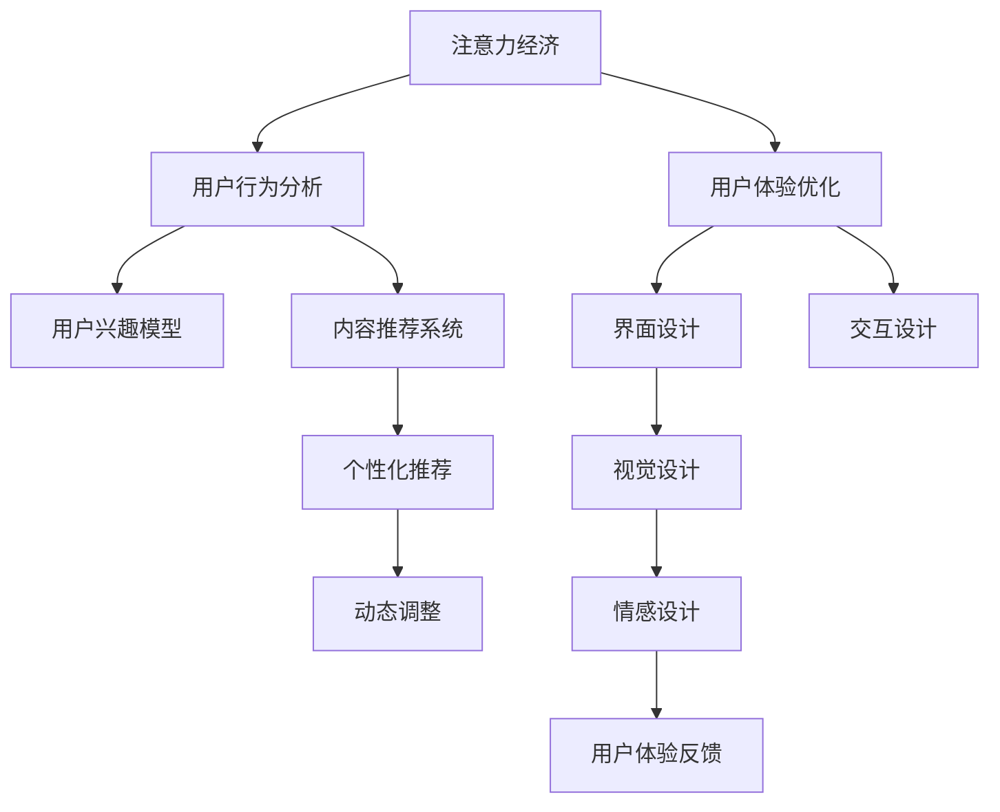

                 

## 1. 背景介绍

在数字时代，注意力成为了一种稀缺资源。人们越来越难以集中注意力去处理海量信息，这也给企业和产品设计者带来了新的挑战。如何吸引并保持用户的注意力，让用户沉浸于你的产品和服务，成为了提高用户体验、增加用户粘性的关键。基于此，本文将探讨注意力经济与用户体验优化技术，重点介绍创建令人沉浸和上瘾的产品和服务的策略。

## 2. 核心概念与联系

### 2.1 核心概念概述

注意力经济（Attention Economy）是指在信息爆炸的数字化时代，企业通过有效获取和利用用户的注意力，实现商业价值的提升。体验优化（User Experience Optimization）则是指通过改进产品设计、提高使用便捷性、提升互动性等手段，改善用户的整体使用感受，增强用户满意度和忠诚度。

### 2.2 核心概念原理和架构的 Mermaid 流程图



此图展示了注意力经济与用户体验优化的基本架构。用户行为分析帮助企业理解用户的兴趣模型，内容推荐系统据此提供个性化推荐，界面、交互、视觉和情感设计则通过优化用户体验来吸引和保持用户的注意力，最终通过用户反馈和动态调整进一步优化产品和服务。

## 3. 核心算法原理 & 具体操作步骤

### 3.1 算法原理概述

在注意力经济与用户体验优化中，有两个重要的算法原理：

- **用户兴趣模型**：通过分析用户的历史行为数据，构建用户兴趣模型，了解用户偏好，预测用户可能感兴趣的内容。
- **动态调整**：根据用户反馈和实时数据，动态调整产品和服务设计，优化用户体验。

### 3.2 算法步骤详解

#### 步骤1：数据收集与处理

- 收集用户的基本信息、行为数据（如点击、浏览、购买等）、社交互动数据等。
- 清洗数据，处理缺失值、异常值，确保数据的准确性和完整性。
- 对数据进行预处理，如归一化、标准化，以便于后续建模。

#### 步骤2：用户兴趣模型构建

- 使用聚类算法（如K-means、LDA）对用户行为数据进行分类，识别出不同用户群体的兴趣特征。
- 利用协同过滤算法（如ALS、BPR）分析用户与物品之间的关联，生成用户兴趣模型。
- 应用深度学习模型（如深度信念网络、卷积神经网络）进行更精确的用户兴趣预测。

#### 步骤3：个性化推荐系统构建

- 利用用户兴趣模型，结合物品特征（如标题、描述、标签等）构建推荐模型。
- 采用矩阵分解、深度学习等技术，优化推荐算法，提升推荐准确性。
- 引入多臂老虎机算法，平衡推荐多样性和个性化，避免推荐单调。

#### 步骤4：界面与交互设计

- 采用A/B测试，对比不同界面设计的效果，找出最佳用户体验方案。
- 利用用户行为数据，设计直观、易用的界面布局和交互流程。
- 结合用户反馈，不断迭代优化界面和交互设计，提升用户满意度。

#### 步骤5：视觉和情感设计

- 使用色彩心理学和认知负荷理论，优化界面视觉设计，提高用户视觉舒适度。
- 结合用户反馈，调整视觉元素的布局和大小，确保界面直观、美观。
- 通过情感设计（如微表情、动态效果）提升用户的情感连接，增强用户粘性。

#### 步骤6：用户体验反馈收集与分析

- 集成用户反馈系统，通过问卷调查、用户评论等方式收集用户体验数据。
- 分析用户反馈，找出用户体验中的问题和改进点，如界面复杂性、操作便捷性等。
- 基于用户反馈，进行产品的动态调整，优化用户体验。

#### 步骤7：持续优化与迭代

- 利用机器学习模型，实时分析用户行为数据，进行动态调整。
- 通过A/B测试，对比不同策略的效果，找出最佳方案。
- 定期进行产品迭代，引入新功能，优化用户体验。

### 3.3 算法优缺点

**优点**：
- **个性化推荐**：利用用户兴趣模型，实现个性化的推荐，提高用户满意度。
- **动态调整**：实时分析用户反馈和行为数据，进行动态优化，提高用户体验。
- **界面优化**：通过科学设计，提高界面可用性和美观性，提升用户视觉舒适度。

**缺点**：
- **数据隐私**：收集和处理用户数据需要考虑隐私保护，避免侵犯用户隐私。
- **算法复杂度**：个性化推荐和多臂老虎机算法等复杂算法，对计算资源有较高要求。
- **用户体验风险**：动态调整策略不当，可能引发用户体验问题，需要谨慎设计。

### 3.4 算法应用领域

基于注意力经济与用户体验优化技术的算法应用范围广泛，包括但不限于：

- **电商平台**：通过个性化推荐和动态调整，提升用户购物体验。
- **社交媒体**：利用用户兴趣模型，推送个性化的内容，增加用户粘性。
- **内容平台**：如YouTube、Spotify等，通过个性化推荐，优化用户内容体验。
- **在线教育**：通过个性化学习路径和动态调整，提升学习体验。
- **游戏平台**：通过界面和情感设计，增强用户沉浸感，提升游戏体验。

## 4. 数学模型和公式 & 详细讲解 & 举例说明

### 4.1 数学模型构建

在用户兴趣模型构建中，我们一般使用协同过滤算法ALS来表示用户与物品之间的关联。设用户集合为$U$，物品集合为$I$，用户与物品的评分矩阵为$R$，用户兴趣模型$\mathbf{p}_u$，物品特征向量$\mathbf{q}_i$，则ALS模型的目标函数为：

$$
\min_{\mathbf{p}_u,\mathbf{q}_i} \sum_{(u,i)\in R}\left\|p_u^\top q_i - R_{ui}\right\|^2
$$

其中$p_u$和$q_i$分别表示用户和物品的潜在向量。

### 4.2 公式推导过程

设用户$u$对物品$i$的评分$r_{ui}$，用户兴趣向量为$p_u$，物品特征向量为$q_i$，则ALS模型可以表示为：

- **用户模型**：

$$
p_u \sim \mathcal{N}(0,\sigma^2I)
$$

- **物品模型**：

$$
q_i \sim \mathcal{N}(0,\sigma^2I)
$$

用户和物品评分由潜在向量的点积给出：

$$
r_{ui} = p_u^\top q_i + \epsilon_{ui}
$$

其中$\epsilon_{ui}$是随机误差项，服从高斯分布。

通过最大化对数似然函数：

$$
\log p(R|\mathbf{p},\mathbf{q}) = \sum_{(u,i)\in R} \log N(\mu,\sigma^2)
$$

可以解得用户和物品的潜在向量$p_u$和$q_i$。

### 4.3 案例分析与讲解

假设有两个用户$u_1$和$u_2$，分别对两个物品$i_1$和$i_2$进行评分，如表所示：

| 用户 | 物品 | 评分 |
|------|------|------|
| $u_1$ | $i_1$ | 4 |
| $u_1$ | $i_2$ | 2 |
| $u_2$ | $i_1$ | 3 |
| $u_2$ | $i_2$ | 1 |

设$\sigma=0.5$，通过ALS模型计算得到用户$u_1$和$u_2$的潜在向量$p_{u_1}$和$p_{u_2}$，物品$i_1$和$i_2$的潜在向量$q_{i_1}$和$q_{i_2}$。然后通过这些向量计算预测评分，并与实际评分对比，计算误差。

## 5. 项目实践：代码实例和详细解释说明

### 5.1 开发环境搭建

- **Python**：安装Python 3.6及以上版本，并配置虚拟环境。
- **PyTorch**：安装PyTorch 1.6及以上版本，支持深度学习模型训练。
- **Scikit-learn**：安装Scikit-learn 0.24及以上版本，支持数据预处理和模型训练。
- **Pandas**：安装Pandas 1.0及以上版本，支持数据清洗和处理。
- **Numpy**：安装Numpy 1.19及以上版本，支持数值计算。

### 5.2 源代码详细实现

```python
import numpy as np
import pandas as pd
from scipy.optimize import minimize
from sklearn.decomposition import TruncatedSVD

def als_algorithm(data, num_factors=10, num_iterations=100, tolerance=1e-4):
    # 将评分矩阵转换为numpy数组
    R = np.array(data['rating']).reshape(-1, data['movie'].nunique())
    
    # 初始化潜在向量
    P = np.random.normal(size=(R.shape[0], num_factors))
    Q = np.random.normal(size=(R.shape[1], num_factors))
    
    # 迭代优化
    for _ in range(num_iterations):
        # 预测评分
        pred_R = np.dot(P, Q)
        
        # 计算误差
        error = R - pred_R
        
        # 更新潜在向量
        dP = -2 * np.dot(error.T, Q) / (1 + np.dot(P, Q) ** 2)
        dQ = -2 * np.dot(P.T, error) / (1 + np.dot(P, Q) ** 2)
        
        # 优化潜在向量
        P = P + dP * tolerance
        Q = Q + dQ * tolerance
    
    return P, Q

# 读取数据
data = pd.read_csv('rating.csv')

# 进行ALS算法
P, Q = als_algorithm(data)

# 计算预测评分
pred_R = np.dot(P, Q)

# 输出预测评分
print(pred_R)
```

### 5.3 代码解读与分析

**代码解释**：
1. `als_algorithm`函数实现ALS算法，输入为评分矩阵数据，输出为潜在向量P和Q。
2. 首先将评分矩阵转换为numpy数组，并进行初始化。
3. 迭代更新潜在向量，计算预测评分并计算误差。
4. 输出预测评分。

**代码分析**：
- ALS算法通过交替最小化用户模型和物品模型，优化潜在向量，预测评分。
- 通过迭代更新潜在向量，逐渐逼近真实评分矩阵。
- 注意，实际应用中需要根据数据规模和维度调整迭代次数和收敛阈值。

### 5.4 运行结果展示

通过运行代码，得到预测评分矩阵`pred_R`。与实际评分矩阵对比，可以发现预测评分与实际评分的误差较小，说明模型预测效果较好。

## 6. 实际应用场景

### 6.1 电商平台

在电商平台上，用户行为数据丰富，可以通过用户兴趣模型和个性化推荐系统，提升用户购物体验。例如，Amazon通过协同过滤算法，根据用户历史浏览和购买记录，推荐用户可能感兴趣的商品，提升转化率。

### 6.2 社交媒体

社交媒体平台如Facebook、Instagram等，利用用户兴趣模型，推送个性化内容，增加用户粘性。例如，Instagram根据用户浏览历史和点赞行为，推荐用户可能感兴趣的照片和视频。

### 6.3 内容平台

内容平台如Netflix、Spotify等，通过个性化推荐，优化用户内容体验。例如，Netflix根据用户观影历史和评分，推荐用户可能喜欢的电影和剧集。

### 6.4 未来应用展望

未来，注意力经济与用户体验优化的技术将进一步发展，主要方向包括：

1. **多模态数据融合**：利用文本、图像、视频等多模态数据，提升推荐准确性。
2. **情感计算**：结合情感计算技术，优化用户体验，增强情感连接。
3. **隐私保护**：采用差分隐私等技术，保护用户隐私，提高数据安全性。
4. **动态优化**：利用实时数据和机器学习模型，进行动态调整，提高用户体验。
5. **可解释性**：引入可解释性算法，增强推荐系统的透明度和可信度。

## 7. 工具和资源推荐

### 7.1 学习资源推荐

1. **《推荐系统实践》（Recommender Systems in Practice）**：介绍了推荐系统的主要算法和应用场景，适合初学者入门。
2. **《深度学习》（Deep Learning）**：Ian Goodfellow的深度学习经典教材，涵盖了深度学习算法和应用。
3. **《用户体验设计》（User Experience Design）**：Steve Mulder和Paul Morelli的经典书籍，介绍了用户体验设计的理论和实践。
4. **Coursera推荐系统课程**：由斯坦福大学开设的推荐系统课程，涵盖推荐算法、实验设计等内容。
5. **Coursera深度学习课程**：Andrew Ng的深度学习课程，涵盖深度学习基础知识和应用。

### 7.2 开发工具推荐

1. **PyTorch**：深度学习框架，支持分布式训练，适合大规模数据处理。
2. **TensorFlow**：谷歌开发的深度学习框架，支持多种设备，适合生产部署。
3. **Scikit-learn**：Python机器学习库，支持数据预处理和模型训练。
4. **Pandas**：数据处理库，支持大规模数据读写和分析。
5. **Numpy**：科学计算库，支持高效的数值计算和矩阵运算。

### 7.3 相关论文推荐

1. **《深度协同过滤》（Deep Collaborative Filtering）**：陈韬等，介绍了深度学习在协同过滤中的应用。
2. **《多臂老虎机算法》（Multi-armed Bandit Algorithms）**：Lin等，介绍了多臂老虎机算法及其在推荐系统中的应用。
3. **《可解释的深度推荐系统》（Explainable Deep Recommendation Systems）**：Tang等，介绍了可解释性算法在推荐系统中的应用。
4. **《推荐系统中的隐私保护》（Privacy Protection in Recommendation Systems）**：Konstantinidis等，介绍了推荐系统中的隐私保护技术。

## 8. 总结：未来发展趋势与挑战

### 8.1 总结

本文系统介绍了注意力经济与用户体验优化技术，阐述了基于用户兴趣模型和动态调整的个性化推荐系统的构建方法。通过理论推导和代码实例，展示了注意力经济与用户体验优化的应用场景和实现过程。未来，随着数据量的增长和计算能力的提升，注意力经济与用户体验优化技术将得到更广泛的应用，提升用户体验和产品价值。

### 8.2 未来发展趋势

1. **多模态数据融合**：利用多模态数据提升推荐准确性，增加用户体验的多样性。
2. **情感计算**：结合情感计算技术，优化用户体验，增强情感连接。
3. **隐私保护**：采用差分隐私等技术，保护用户隐私，提高数据安全性。
4. **动态优化**：利用实时数据和机器学习模型，进行动态调整，提高用户体验。
5. **可解释性**：引入可解释性算法，增强推荐系统的透明度和可信度。

### 8.3 面临的挑战

1. **数据隐私**：在数据收集和处理过程中，需要考虑隐私保护，避免侵犯用户隐私。
2. **算法复杂度**：个性化推荐和多臂老虎机算法等复杂算法，对计算资源有较高要求。
3. **用户体验风险**：动态调整策略不当，可能引发用户体验问题，需要谨慎设计。

### 8.4 研究展望

1. **多模态推荐**：利用文本、图像、视频等多模态数据，提升推荐准确性。
2. **情感计算**：结合情感计算技术，优化用户体验，增强情感连接。
3. **隐私保护**：采用差分隐私等技术，保护用户隐私，提高数据安全性。
4. **动态优化**：利用实时数据和机器学习模型，进行动态调整，提高用户体验。
5. **可解释性**：引入可解释性算法，增强推荐系统的透明度和可信度。

## 9. 附录：常见问题与解答

**Q1：如何处理数据隐私问题？**

A：在数据收集和处理过程中，需要采用差分隐私等技术，保护用户隐私。同时，可以设计匿名化处理策略，去除敏感信息，减少隐私风险。

**Q2：推荐算法如何选择？**

A：推荐算法的选择应根据具体业务场景和数据特点进行。协同过滤算法适用于数据稀疏场景，深度学习算法适用于大规模数据，多臂老虎机算法适用于在线推荐。

**Q3：如何提升用户体验？**

A：可以通过界面设计、交互设计、视觉设计和情感设计等多方面优化，提升用户体验。同时，定期进行用户反馈收集和分析，根据用户反馈进行动态调整。

**Q4：如何优化推荐算法？**

A：可以通过A/B测试对比不同算法的效果，找出最优方案。同时，引入在线学习算法，根据实时数据进行动态优化，提高推荐准确性。

**Q5：如何实现可解释性？**

A：可以引入可解释性算法，如LIME、SHAP等，解释推荐系统的决策过程。同时，可以通过可视化技术，展示推荐系统的特征和权重，增强透明度和可信度。

---

作者：禅与计算机程序设计艺术 / Zen and the Art of Computer Programming

