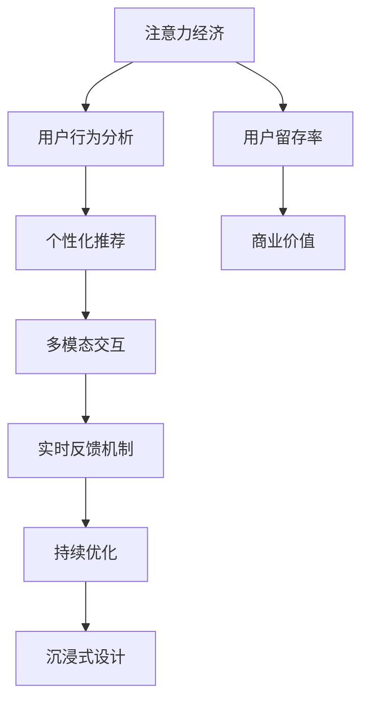

                 

# 注意力经济与用户体验优化策略与实践：创建令人沉浸和上瘾的产品

> 关键词：注意力经济,用户体验,沉浸式设计,上瘾产品,用户行为分析,数据驱动,个性化推荐,多模态交互,实时反馈机制,持续优化

## 1. 背景介绍

### 1.1 问题由来
在数字化时代，数字产品无处不在，用户的注意力成为最宝贵的资源。如何吸引和保持用户的注意力，提升用户留存率，是所有数字产品设计和运营的关键。产品设计师、开发工程师、产品经理需要深度理解注意力经济原理，并科学地进行用户行为分析和个性化推荐，打造出令人沉浸和上瘾的产品。

### 1.2 问题核心关键点
注意力经济的核心在于如何有效地引导用户的注意力，最大化其参与度和转化率。其关键点包括：

- 设计引人入胜的界面和交互，激发用户好奇心和探索欲。
- 应用行为分析和推荐算法，实现个性化内容和体验。
- 构建实时反馈机制，持续优化产品功能和用户体验。

### 1.3 问题研究意义
研究注意力经济和用户体验优化策略，对于提升数字产品的用户留存率、提高用户满意度和增加商业价值具有重要意义。具体而言：

1. **提高用户参与度**：通过科学的用户行为分析，设计出更加贴合用户需求的产品，提升用户在使用过程中的参与度和满意度。
2. **提升转化率**：通过个性化的推荐和内容展示，提高用户完成目标操作（如购买、订阅、分享等）的转化率。
3. **增强用户粘性**：通过不断迭代和优化，使产品成为用户生活的一部分，增强用户的粘性和忠诚度。
4. **优化产品设计**：通过数据分析和用户反馈，持续优化产品界面和交互设计，提升产品整体的用户体验。
5. **增强市场竞争力**：在激烈的市场竞争中，通过更精准的用户洞察和更优质的产品体验，获得更多的用户和市场份额。

## 2. 核心概念与联系

### 2.1 核心概念概述

注意力经济（Attention Economy）是指在信息爆炸的时代，如何通过设计和运营策略，吸引和保持用户的注意力，最大化商业价值。用户体验（User Experience，UX）是指用户在使用数字产品时，所感受到的情感和认知体验，是产品成功的关键因素。沉浸式设计（Immersion Design）是一种通过视觉、听觉、触觉等多感官体验，营造身临其境的感觉，增强用户体验的策略。上瘾产品（Addictive Products）是指能够吸引用户重复使用，并在短期内获得高价值反馈的数字产品。

### 2.2 核心概念原理和架构的 Mermaid 流程图



这个流程图展示了注意力经济和用户体验优化的核心概念及其相互关系：

1. **注意力经济**：关注如何吸引和保持用户注意力，最大化商业价值。
2. **用户行为分析**：通过数据分析，理解用户行为和需求。
3. **个性化推荐**：根据用户行为数据，实现个性化内容和体验。
4. **多模态交互**：通过视觉、听觉、触觉等多感官体验，增强用户体验。
5. **实时反馈机制**：通过实时数据分析和反馈，持续优化产品功能。
6. **持续优化**：基于实时反馈和行为分析，不断迭代和优化产品。
7. **沉浸式设计**：营造身临其境的体验，增强用户粘性。
8. **用户留存率**：通过以上策略，提高用户留存率和忠诚度。
9. **商业价值**：最终目标是提升产品的商业价值和市场竞争力。

## 3. 核心算法原理 & 具体操作步骤
### 3.1 算法原理概述

基于注意力经济和用户体验优化策略的产品设计和运营，主要依赖于数据驱动的个性化推荐和行为分析算法。其核心算法包括协同过滤、内容推荐、用户画像、行为分析等。通过这些算法，可以实现对用户行为和需求的深入理解，并设计出符合用户期望的产品。

### 3.2 算法步骤详解

以下是实现注意力经济和用户体验优化的主要算法步骤：

**Step 1: 数据收集与预处理**
- 收集用户行为数据，包括点击、浏览、停留时间、购买等。
- 清洗和预处理数据，去除噪声和异常值，确保数据质量。

**Step 2: 用户行为建模**
- 使用协同过滤算法，构建用户行为模型，分析用户兴趣和偏好。
- 使用内容推荐算法，预测用户可能感兴趣的内容和行为。

**Step 3: 个性化推荐**
- 根据用户行为数据和兴趣模型，推荐个性化的内容、商品或服务。
- 实时更新推荐模型，确保推荐内容的时效性和相关性。

**Step 4: 行为分析与优化**
- 通过行为数据分析，识别用户流失点和优化点。
- 应用A/B测试等方法，验证和优化产品功能。

**Step 5: 实时反馈机制**
- 构建实时监控和反馈系统，实时采集用户行为数据。
- 定期评估产品性能和用户满意度，及时调整和优化。

**Step 6: 沉浸式设计**
- 设计引人入胜的界面和交互，增加用户参与度。
- 通过多感官体验，营造沉浸式氛围，增强用户粘性。

**Step 7: 持续优化**
- 基于实时反馈和用户行为分析，不断迭代和优化产品。
- 通过数据分析和用户反馈，持续提升用户体验。

### 3.3 算法优缺点

**优点**：

- **数据驱动**：通过用户行为数据，实现精准推荐和优化。
- **个性化体验**：实现个性化的内容和交互，提升用户满意度和留存率。
- **实时优化**：基于实时反馈，持续提升产品性能和用户体验。
- **多感官体验**：通过多感官设计，增强用户沉浸感和粘性。

**缺点**：

- **数据隐私**：收集和处理用户行为数据可能涉及隐私问题，需合规处理。
- **算法复杂性**：个性化推荐和行为分析算法复杂，需精细调参。
- **技术门槛高**：需要具备数据分析和机器学习等专业技能，技术门槛较高。
- **过度优化风险**：过度优化可能导致用户疲劳，降低用户满意度和留存率。

### 3.4 算法应用领域

基于注意力经济和用户体验优化策略的产品设计和运营，已广泛应用于以下领域：

1. **电商**：通过个性化推荐和行为分析，提升用户购买转化率和购物体验。
2. **社交媒体**：通过用户行为分析，优化内容推荐，增强用户粘性和活跃度。
3. **在线教育**：通过个性化推荐和行为分析，提升用户学习效果和满意度。
4. **新闻和娱乐**：通过内容推荐和用户行为分析，提升用户粘性和互动性。
5. **健康和医疗**：通过用户行为分析，优化健康监测和个性化建议。
6. **金融科技**：通过行为分析，提升用户金融产品购买和投资体验。

## 4. 数学模型和公式 & 详细讲解 & 举例说明

### 4.1 数学模型构建

本节将使用数学语言对个性化推荐和行为分析算法进行详细讲解。

假设用户集合为 $U$，物品集合为 $I$，行为数据集为 $D$。用户对物品的行为表示为 $(u,i,t)$，其中 $u$ 为用户，$i$ 为物品，$t$ 为时间。行为数据包含用户的点击、浏览、停留时间、购买等行为。

### 4.2 公式推导过程

以下是基于协同过滤和内容推荐的推荐算法公式推导：

**协同过滤推荐算法**：
- **基于用户的协同过滤**：
  $$
  \hat{r}_{ui} = \frac{\sum_{v \in N(u)} r_{vi} \times \theta_{uv}}{\sqrt{\sum_{v \in N(u)} \theta_{uv}^2} \times \sqrt{\sum_{v \in N(u)} r_{vi}^2}}
  $$
  其中 $N(u)$ 为与用户 $u$ 相似的其他用户，$r_{vi}$ 为用户 $v$ 对物品 $i$ 的评分，$\theta_{uv}$ 为相似度权重。

- **基于物品的协同过滤**：
  $$
  \hat{r}_{ui} = \frac{\sum_{v \in U} r_{vi} \times \theta_{iv}}{\sqrt{\sum_{v \in U} \theta_{iv}^2} \times \sqrt{\sum_{v \in U} r_{vi}^2}}
  $$
  其中 $r_{vi}$ 为物品 $i$ 的评分，$\theta_{iv}$ 为相似度权重。

**基于内容的推荐算法**：
- **基于内容的相似度计算**：
  $$
  similarity(i,j) = \cos(\overrightarrow{c_i} \cdot \overrightarrow{c_j})
  $$
  其中 $\overrightarrow{c_i}$ 和 $\overrightarrow{c_j}$ 为物品 $i$ 和 $j$ 的特征向量，$\cos$ 为余弦相似度。

- **基于内容的推荐公式**：
  $$
  \hat{r}_{ui} = \sum_{j \in I} r_{uj} \times similarity(i,j)
  $$

### 4.3 案例分析与讲解

以亚马逊的个性化推荐为例，介绍如何基于协同过滤和内容推荐实现个性化推荐。

**协同过滤推荐**：
- 通过用户历史点击、购买行为，找到相似用户，计算物品评分。
- 通过计算用户对物品的评分，推荐物品。

**内容推荐**：
- 对物品进行特征提取，计算相似度。
- 根据相似度，推荐相关物品。

**结合使用**：
- 通过协同过滤和内容推荐的结合，实现更精准的个性化推荐。
- 通过实时更新，确保推荐内容的时效性和相关性。

## 5. 项目实践：代码实例和详细解释说明
### 5.1 开发环境搭建

在进行个性化推荐和行为分析项目实践前，需要准备好开发环境。以下是使用Python进行PyTorch开发的环境配置流程：

1. 安装Anaconda：从官网下载并安装Anaconda，用于创建独立的Python环境。
2. 创建并激活虚拟环境：
```bash
conda create -n pytorch-env python=3.8 
conda activate pytorch-env
```
3. 安装PyTorch：根据CUDA版本，从官网获取对应的安装命令。例如：
```bash
conda install pytorch torchvision torchaudio cudatoolkit=11.1 -c pytorch -c conda-forge
```
4. 安装相关库：
```bash
pip install numpy pandas scikit-learn sklearn-lda gensim tqdm
```
5. 安装PyTorch推荐库：
```bash
pip install torchrec
```
6. 安装PyTorch RNN库：
```bash
pip install pytorch-rnn
```

完成上述步骤后，即可在`pytorch-env`环境中开始个性化推荐和行为分析项目实践。

### 5.2 源代码详细实现

这里我们以一个基于协同过滤和内容推荐的电商推荐系统为例，给出使用PyTorch推荐库实现个性化推荐的PyTorch代码实现。

首先，定义数据预处理函数：

```python
import pandas as pd
from torchrec.datasets import ItemDataset, UserItemPairDataset
from torchrec.recommenders import UserBiasFactorizer, ItemEmbeddingFactorizer, BPR

def preprocess_data(path):
    df = pd.read_csv(path)
    # 数据清洗和预处理
    df = df.dropna()
    # 用户-物品评分矩阵
    user_item = df.pivot_table(index='user_id', columns='item_id', values='rating')
    # 用户特征和物品特征
    user_features = df.groupby('user_id').agg({'age': 'mean', 'gender': 'mode'}).reset_index()
    item_features = df.groupby('item_id').agg({'category': 'mode'}).reset_index()
    # 返回数据集
    return user_item, user_features, item_features
```

然后，定义协同过滤推荐模型：

```python
from torch import nn
from torchrec.layers import ItemEmbedding, UserEmbedding, BiasFactorizer

class CollaborativeFiltering(nn.Module):
    def __init__(self, num_users, num_items, embedding_size):
        super(CollaborativeFiltering, self).__init__()
        self.item_embedding = ItemEmbedding(num_items, embedding_size)
        self.user_embedding = UserEmbedding(num_users, embedding_size)
        self.bias_factorizer = BiasFactorizer()

    def forward(self, user_ids, item_ids):
        user_embeddings = self.user_embedding(user_ids)
        item_embeddings = self.item_embedding(item_ids)
        rating = user_embeddings @ item_embeddings.t() + self.bias_factorizer.bias(user_ids)
        return rating
```

接着，定义内容推荐模型：

```python
from torchrec.layers import Embedding

class ContentBasedRecommender(nn.Module):
    def __init__(self, num_items, embedding_size):
        super(ContentBasedRecommender, self).__init__()
        self.item_embedding = Embedding(num_items, embedding_size)
        self.user_embedding = Embedding(num_users, embedding_size)

    def forward(self, user_ids, item_ids):
        user_embeddings = self.user_embedding(user_ids)
        item_embeddings = self.item_embedding(item_ids)
        rating = (user_embeddings @ item_embeddings.t()).sum(dim=1)
        return rating
```

最后，定义模型训练函数：

```python
from torch import Tensor
from torchrec.layers import BPR
from torchrec.utils import train_one_epoch
from torchrec.dataset import MLPRecommenderDataset

def train_model(model, train_dataset, valid_dataset, device, optimizer, loss_fn, num_epochs):
    model.train()
    train_loader, valid_loader = train_dataset, valid_dataset
    for epoch in range(num_epochs):
        train_one_epoch(model, optimizer, loss_fn, train_loader, device, epoch)
        model.eval()
        with torch.no_grad():
            valid_results = evaluate_model(model, valid_loader, device, loss_fn)
    return model
```

完成上述步骤后，即可在`pytorch-env`环境中开始电商推荐系统的实践。

### 5.3 代码解读与分析

这里我们详细解读一下关键代码的实现细节：

**preprocess_data函数**：
- 加载数据集，并进行数据清洗和预处理。
- 构造用户-物品评分矩阵。
- 提取用户特征和物品特征。

**CollaborativeFiltering模型**：
- 定义用户和物品嵌入层。
- 定义用户和物品的偏置因子。
- 计算评分。

**ContentBasedRecommender模型**：
- 定义用户和物品嵌入层。
- 计算评分。

**train_model函数**：
- 定义训练过程，包括模型前向传播、损失计算和优化。
- 定义评估过程，评估模型在验证集上的表现。

## 6. 实际应用场景

### 6.1 社交媒体内容推荐

社交媒体平台通过用户的行为数据，如点赞、评论、分享等，结合协同过滤和内容推荐算法，实现个性化内容推荐。通过分析用户的兴趣和行为，推荐符合用户期望的帖子和话题，增加用户粘性和活跃度。例如，Instagram、Twitter等社交媒体平台广泛应用了个性化推荐算法，提升用户使用体验。

### 6.2 在线教育个性化学习

在线教育平台通过个性化推荐和行为分析算法，提升学生的学习效果和满意度。通过分析学生的学习行为，如浏览、点击、测试成绩等，推荐符合学生兴趣和学习进度的课程和内容。例如，Coursera、Udacity等在线教育平台应用了个性化推荐算法，提升学生的学习效果和满意度。

### 6.3 健康和医疗个性化建议

健康和医疗平台通过个性化推荐和行为分析算法，提供个性化的健康建议和医疗服务。通过分析用户的行为数据，如健康记录、用药历史、生活方式等，推荐个性化的健康建议和医疗服务。例如，Apple Health、Google Fit等健康平台应用了个性化推荐算法，提升用户的健康管理效果。

### 6.4 未来应用展望

随着个性化推荐和行为分析技术的不断进步，基于注意力经济和用户体验优化的产品设计和运营，将在更多领域得到应用，为传统行业带来变革性影响。

在智慧城市治理中，通过用户行为分析，优化城市服务流程，提升城市管理水平。例如，通过分析市民的出行、购物、娱乐等行为，优化城市交通、商业和娱乐设施的布局，提高城市生活质量。

在智慧农业中，通过用户行为分析，优化农资配置和农业生产，提高农业生产效率和效益。例如，通过分析农民的农资购买、种植管理、收获销售等行为，推荐适合的农资和农业技术，提升农业生产效率。

在智慧教育中，通过个性化推荐和行为分析算法，优化教学内容和学习方式，提升教学效果和学生体验。例如，通过分析学生的学习行为，推荐适合的教材和教学方法，提升学生的学习效果和满意度。

在智慧医疗中，通过个性化推荐和行为分析算法，优化医疗服务流程，提升医疗服务水平。例如，通过分析患者的诊疗记录、用药历史等行为数据，推荐个性化的诊疗方案和健康建议，提高患者的医疗体验和健康管理效果。

## 7. 工具和资源推荐

### 7.1 学习资源推荐

为了帮助开发者系统掌握个性化推荐和行为分析的理论基础和实践技巧，这里推荐一些优质的学习资源：

1. 《推荐系统实战》：全面介绍推荐系统原理和算法，包含协同过滤、内容推荐、深度学习推荐等核心技术。
2. 《用户行为分析》：介绍用户行为分析的原理和实践方法，包含行为建模、行为预测、用户分群等技术。
3. 《深度学习与自然语言处理》：介绍深度学习在自然语言处理中的应用，包含文本分类、情感分析、文本生成等技术。
4. 《数据科学导论》：介绍数据科学的基本概念和实践方法，包含数据收集、数据清洗、数据分析等技术。
5. 《机器学习实战》：介绍机器学习的基本概念和实践方法，包含监督学习、无监督学习、强化学习等技术。

通过对这些资源的学习实践，相信你一定能够快速掌握个性化推荐和行为分析的精髓，并用于解决实际的NLP问题。

### 7.2 开发工具推荐

高效的开发离不开优秀的工具支持。以下是几款用于个性化推荐和行为分析开发的常用工具：

1. PyTorch：基于Python的开源深度学习框架，灵活动态的计算图，适合快速迭代研究。大部分预训练语言模型都有PyTorch版本的实现。
2. TensorFlow：由Google主导开发的开源深度学习框架，生产部署方便，适合大规模工程应用。同样有丰富的预训练语言模型资源。
3. Torchrec：由Facebook开源的推荐系统框架，支持多种推荐算法和模型，适合推荐系统的开发和部署。
4. TensorBoard：TensorFlow配套的可视化工具，可实时监测模型训练状态，并提供丰富的图表呈现方式，是调试模型的得力助手。
5. Weights & Biases：模型训练的实验跟踪工具，可以记录和可视化模型训练过程中的各项指标，方便对比和调优。

合理利用这些工具，可以显著提升个性化推荐和行为分析的开发效率，加快创新迭代的步伐。

### 7.3 相关论文推荐

个性化推荐和行为分析的研究源于学界的持续研究。以下是几篇奠基性的相关论文，推荐阅读：

1. KDD Cup 2011 Recommendation Challenge：介绍推荐系统的竞赛和研究进展，包含协同过滤、内容推荐、深度学习推荐等技术。
2. Trust-Aware Matrix Factorization for Recommender Systems：介绍基于信任度矩阵因式分解的推荐算法，提升推荐系统的信任度和鲁棒性。
3. Sparsified Multi-View Matrix Factorization for Collaborative Filtering：介绍多视图矩阵分解的推荐算法，提升推荐系统的效果和效率。
4. BPR: Bayesian Personalized Ranking from Historical Preference：介绍基于贝叶斯排序的推荐算法，提升推荐系统的准确性和多样性。
5. Matrix Factorization Techniques for Recommender Systems：介绍矩阵分解的推荐算法，包含奇异值分解、交替最小二乘等技术。

这些论文代表了大规模推荐系统和行为分析的发展脉络。通过学习这些前沿成果，可以帮助研究者把握学科前进方向，激发更多的创新灵感。

## 8. 总结：未来发展趋势与挑战

### 8.1 研究成果总结

本文对基于注意力经济和用户体验优化策略的产品设计和运营进行了全面系统的介绍。首先阐述了个性化推荐和行为分析的理论基础，明确了其对于提升用户参与度、转化率和粘性的关键作用。其次，从原理到实践，详细讲解了个性化推荐和行为分析的算法步骤，给出了推荐系统开发的完整代码实例。同时，本文还广泛探讨了个性化推荐和行为分析在电商、社交媒体、在线教育、健康医疗等多个行业领域的应用前景，展示了其广泛的应用价值。此外，本文精选了个性化推荐和行为分析的各类学习资源，力求为开发者提供全方位的技术指引。

通过本文的系统梳理，可以看到，基于注意力经济和用户体验优化策略的产品设计和运营，已经广泛应用于数字化产品的各个领域，成为推动NLP技术发展的关键动力。其凭借数据驱动的个性化推荐和行为分析算法，能够深入理解用户需求，设计出贴合用户期望的产品，提升用户满意度和留存率，增强商业价值和市场竞争力。未来，伴随个性化推荐和行为分析技术的不断进步，基于注意力经济和用户体验优化的产品设计和运营，必将在更多领域得到应用，为数字经济带来更多的创新和突破。

### 8.2 未来发展趋势

展望未来，个性化推荐和行为分析技术将呈现以下几个发展趋势：

1. **多模态融合**：通过融合视觉、听觉、触觉等多感官体验，增强推荐系统的多样性和鲁棒性。例如，结合图像、视频等多媒体数据，提升推荐系统的效果和体验。
2. **深度学习优化**：通过深度学习技术，提升推荐系统的效果和效率。例如，使用深度神经网络模型，提升推荐系统的准确性和多样性。
3. **实时计算优化**：通过实时计算技术，提升推荐系统的响应速度和用户体验。例如，使用GPU、TPU等高性能计算设备，提升推荐系统的计算效率。
4. **强化学习优化**：通过强化学习技术，提升推荐系统的动态优化能力。例如，结合用户行为数据，不断优化推荐策略，提升用户满意度和留存率。
5. **隐私保护优化**：通过隐私保护技术，提升推荐系统的用户信任度和安全性。例如，使用差分隐私等技术，保护用户隐私数据。
6. **社交网络优化**：通过社交网络数据，提升推荐系统的社交属性和用户粘性。例如，结合社交网络数据，推荐符合用户社交圈内的内容和关系。

以上趋势凸显了个性化推荐和行为分析技术的广阔前景。这些方向的探索发展，必将进一步提升推荐系统的性能和用户体验，为数字经济带来更多的创新和突破。

### 8.3 面临的挑战

尽管个性化推荐和行为分析技术已经取得了瞩目成就，但在迈向更加智能化、普适化应用的过程中，仍面临诸多挑战：

1. **数据隐私**：收集和处理用户行为数据可能涉及隐私问题，需合规处理。如何保护用户隐私，同时获取高质量的用户行为数据，是一大难题。
2. **算法复杂性**：个性化推荐和行为分析算法复杂，需精细调参。如何在算法复杂性和模型效果之间找到平衡，是一个重要问题。
3. **技术门槛高**：需要具备数据分析和机器学习等专业技能，技术门槛较高。如何降低技术门槛，使更多开发者能够快速上手，是一大挑战。
4. **过度优化风险**：过度优化可能导致用户疲劳，降低用户满意度和留存率。如何实现适度的优化，提升用户体验，是一大挑战。
5. **实时计算资源**：个性化推荐和行为分析系统需要实时计算和存储大量数据，资源消耗较大。如何优化资源使用，提高系统效率，是一大挑战。

正视个性化推荐和行为分析面临的这些挑战，积极应对并寻求突破，将是个性化推荐和行为分析技术走向成熟的必由之路。相信随着学界和产业界的共同努力，这些挑战终将一一被克服，个性化推荐和行为分析必将在构建人机协同的智能系统，提升用户体验方面发挥越来越重要的作用。

### 8.4 研究展望

面对个性化推荐和行为分析所面临的挑战，未来的研究需要在以下几个方面寻求新的突破：

1. **多模态数据融合**：融合视觉、听觉、触觉等多感官数据，提升推荐系统的多样性和鲁棒性。
2. **深度学习优化**：结合深度学习技术，提升推荐系统的效果和效率。
3. **隐私保护优化**：使用隐私保护技术，保护用户隐私数据，同时获取高质量的用户行为数据。
4. **实时计算优化**：优化推荐系统的实时计算和存储，提高系统的效率和用户体验。
5. **社交网络优化**：结合社交网络数据，提升推荐系统的社交属性和用户粘性。
6. **强化学习优化**：通过强化学习技术，提升推荐系统的动态优化能力，提高用户满意度和留存率。

这些研究方向的探索，必将引领个性化推荐和行为分析技术迈向更高的台阶，为构建安全、可靠、可解释、可控的智能系统铺平道路。面向未来，个性化推荐和行为分析技术还需要与其他人工智能技术进行更深入的融合，如知识表示、因果推理、强化学习等，多路径协同发力，共同推动人工智能技术的发展。

## 9. 附录：常见问题与解答

**Q1：个性化推荐算法是否适用于所有产品？**

A: 个性化推荐算法适用于大多数产品，特别是需要提升用户参与度和转化率的产品。对于少数特定领域的产品，如艺术、奢侈品等，个性化推荐的效果可能有限。此时需要结合领域知识和专家意见，进行人工推荐和引导。

**Q2：如何平衡推荐效果和用户隐私？**

A: 个性化推荐需要收集用户行为数据，但同时也需要保护用户隐私。通过以下措施可以实现平衡：
1. 最小化数据收集：只收集必要的数据，减少对用户隐私的影响。
2. 匿名化处理：对用户数据进行匿名化处理，保护用户隐私。
3. 合规处理：遵守相关法律法规，如GDPR、CCPA等，确保数据隐私和安全。
4. 用户自主权：提供用户自主控制权，让用户选择是否分享行为数据。

**Q3：如何评估个性化推荐系统的效果？**

A: 个性化推荐系统的效果可以通过以下指标进行评估：
1. 准确率：推荐系统推荐的物品与用户实际选择的物品相符程度。
2. 召回率：推荐系统推荐的所有物品中，用户实际选择的物品所占比例。
3. 多样性：推荐系统推荐的物品多样性程度，避免推荐过于相似的商品。
4. 新鲜度：推荐系统推荐的物品更新程度，避免推荐过时的商品。
5. 满意度：用户对推荐系统的满意度，可以通过用户反馈和行为数据进行评估。

通过综合评估这些指标，可以全面了解推荐系统的性能和效果。

**Q4：如何优化推荐系统的实时计算和存储？**

A: 推荐系统的实时计算和存储可以采用以下优化措施：
1. 数据压缩：使用数据压缩技术，减少数据存储和传输的体积。
2. 分布式计算：使用分布式计算技术，提高推荐系统的计算效率。
3. 缓存技术：使用缓存技术，减少频繁的数据读取和计算。
4. 数据库优化：使用优化数据库，提高数据查询和存储的效率。
5. 硬件优化：使用高性能计算设备，如GPU、TPU等，提升推荐系统的计算效率。

通过这些优化措施，可以显著提升推荐系统的实时计算和存储效率，提高用户满意度和系统性能。

**Q5：个性化推荐算法是否存在算法瓶颈？**

A: 个性化推荐算法存在算法瓶颈，主要包括：
1. 算法复杂性：个性化推荐算法复杂，需要精细调参，影响模型效果和计算效率。
2. 数据稀疏性：用户行为数据往往存在稀疏性，影响推荐系统的准确性和多样性。
3. 计算资源：推荐系统需要大量的计算资源，特别是在实时计算和存储方面。

通过以下措施可以缓解算法瓶颈：
1. 算法优化：优化算法，提高模型效果和计算效率。
2. 数据增强：通过数据增强技术，增加数据量和数据多样性，缓解数据稀疏性问题。
3. 硬件优化：使用高性能计算设备，如GPU、TPU等，提升推荐系统的计算效率。

通过这些优化措施，可以缓解个性化推荐算法的算法瓶颈，提升推荐系统的性能和用户体验。

---

作者：禅与计算机程序设计艺术 / Zen and the Art of Computer Programming

