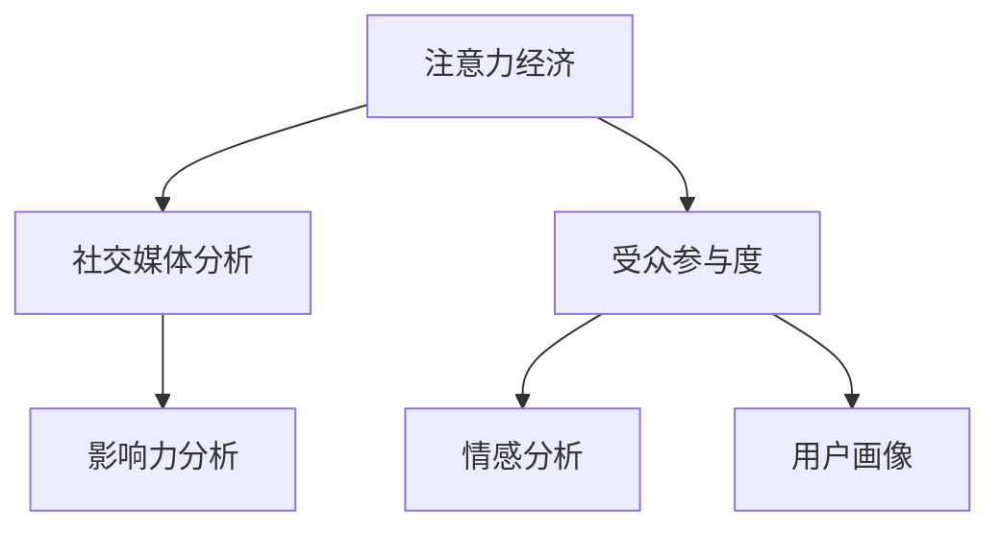

                 

# 注意力经济与社交媒体分析洞见：了解受众参与度和影响力的秘密

> 关键词：注意力经济, 社交媒体, 受众参与度, 影响力分析, 情感分析, 用户画像, 数据挖掘, 深度学习

## 1. 背景介绍

### 1.1 问题由来

在当今数字化时代，社交媒体平台已成为人们获取信息和进行交流的主要渠道。无论是企业品牌、政客还是个人博主，都越来越依赖于社交媒体的影响力来塑造公众形象、推广产品或服务、乃至影响社会舆论。社交媒体的兴起不仅改变了人们获取和分享信息的方式，也带来了新的经济模式——注意力经济。

### 1.2 问题核心关键点

注意力经济的核心在于如何吸引和利用受众的注意力。在社交媒体平台上，内容创作者必须不断创新内容形式，提高内容质量，以获得更多的观看、点赞、分享和评论，从而增加曝光度和用户参与度。然而，在海量信息流中，如何精准地识别和理解受众的兴趣和需求，却成为了一个难题。

社交媒体分析旨在通过数据挖掘、情感分析和用户画像等技术，帮助内容创作者深入了解受众的行为和心理，从而实现对受众参与度和影响力的有效评估和提升。

## 2. 核心概念与联系

### 2.1 核心概念概述

为更好地理解注意力经济和社交媒体分析，本节将介绍几个密切相关的核心概念：

- **注意力经济**：基于受众注意力的经济模式。社交媒体平台通过内容吸引用户注意力，并通过广告、推广等方式变现。

- **社交媒体分析**：通过对社交媒体数据进行挖掘、分析和建模，理解用户行为和情感，预测未来趋势。

- **受众参与度**：用户对社交媒体内容的互动程度，包括点赞、评论、分享、观看时间等。

- **影响力分析**：评估内容创作者在社交媒体上的影响力，包括粉丝数量、互动率、覆盖面等。

- **情感分析**：通过文本分析技术，判断用户对内容的情感倾向，如正面、负面或中性。

- **用户画像**：基于用户的历史行为数据和社交特征，构建用户画像，用于精准营销和个性化服务。

这些核心概念之间的逻辑关系可以通过以下Mermaid流程图来展示：



这个流程图展示了几大核心概念之间的关联关系：

1. 注意力经济基于社交媒体分析，通过理解受众行为和心理，实现对受众注意力的吸引和变现。
2. 社交媒体分析通过情感分析和用户画像等技术，进一步提升受众参与度和影响力。
3. 受众参与度和影响力分析的结果，可以指导内容创作，提升用户互动率。
4. 情感分析和用户画像是社交媒体分析的重要基础，提供了对用户行为和心理的深入理解。

## 3. 核心算法原理 & 具体操作步骤

### 3.1 算法原理概述

社交媒体分析的算法原理主要基于数据挖掘、情感分析和用户画像三大方向。其中，数据挖掘用于提取有价值的信息；情感分析用于识别用户的情感倾向；用户画像是通过分析用户的历史行为和社交特征，构建用户画像，用于精准营销和个性化服务。

这些技术的应用需要处理大规模的社交媒体数据，包括文本、图片、视频等多种格式。常用的算法包括自然语言处理（NLP）、图像处理、深度学习等。通过这些算法，可以构建出反映用户行为和心理的模型，从而实现对受众参与度和影响力的精准评估。

### 3.2 算法步骤详解

#### 3.2.1 数据收集与预处理

社交媒体数据通常以多种格式存在，包括文本、图片、视频等。首先，需要将这些数据收集起来，并进行预处理。预处理包括数据清洗、去重、格式转换等。

#### 3.2.2 数据挖掘与特征提取

数据挖掘是社交媒体分析的基础。通过数据挖掘，可以发现用户的行为模式、兴趣偏好等。常用的数据挖掘技术包括关联规则挖掘、聚类分析、时间序列分析等。特征提取是数据挖掘的重要步骤，通过提取关键特征，可以构建出反映用户行为的模型。

#### 3.2.3 情感分析

情感分析是社交媒体分析的关键技术。通过对用户评论、回复等文本数据进行情感分析，可以判断用户对内容的情感倾向，如正面、负面或中性。常用的情感分析算法包括情感词典、机器学习算法和深度学习算法等。

#### 3.2.4 用户画像构建

用户画像是社交媒体分析的重要应用。通过构建用户画像，可以了解用户的背景、兴趣、行为等特征，用于个性化推荐和精准营销。用户画像的构建需要基于用户的历史行为数据和社交特征，常用的方法包括协同过滤、聚类分析和深度学习等。

#### 3.2.5 结果评估与优化

社交媒体分析的结果需要通过评估来验证其准确性和有效性。常用的评估指标包括准确率、召回率、F1值等。通过不断的评估和优化，可以不断提高模型的预测精度。

### 3.3 算法优缺点

社交媒体分析的算法具有以下优点：

- **高效性**：通过对大规模数据进行快速处理和分析，可以及时发现用户行为和趋势。
- **准确性**：通过深度学习和机器学习等技术，可以准确判断用户情感和行为模式。
- **可扩展性**：可以轻松处理不同类型的数据，如文本、图片、视频等。
- **应用广泛**：可以应用于品牌营销、内容创作、广告投放等多个领域。

同时，这些算法也存在一些缺点：

- **数据隐私**：社交媒体分析依赖于用户数据，存在隐私泄露的风险。
- **算法复杂**：深度学习和机器学习算法需要较高的计算资源，且模型训练过程复杂。
- **数据噪音**：社交媒体数据存在噪音，如误操作、垃圾信息等，影响分析结果的准确性。
- **模型泛化能力**：模型在特定领域或特定时间段的泛化能力有限，需不断更新和优化。

### 3.4 算法应用领域

社交媒体分析的应用领域非常广泛，涵盖了品牌营销、内容创作、广告投放、舆情监测等多个方面。以下是几个典型的应用场景：

- **品牌营销**：通过分析用户对品牌内容的互动情况，了解用户的情感倾向和行为模式，优化营销策略，提升品牌影响力。
- **内容创作**：分析热门话题和趋势，帮助内容创作者选择热门主题和创意形式，提高内容的吸引力和传播效果。
- **广告投放**：通过分析用户画像和兴趣偏好，实现精准广告投放，提升广告效果和ROI。
- **舆情监测**：通过分析用户评论和讨论，及时发现舆情变化，预测市场趋势，帮助企业及时应对负面事件。
- **用户研究**：通过分析用户的行为数据，了解用户的兴趣、需求和偏好，优化产品设计和服务体验。

## 4. 数学模型和公式 & 详细讲解 & 举例说明

### 4.1 数学模型构建

社交媒体分析的数学模型主要基于自然语言处理（NLP）和深度学习技术。以下是几个关键的数学模型及其构建过程：

#### 4.1.1 情感词典模型

情感词典是一种常用的情感分析方法。通过构建情感词典，将文本中的词汇映射到情感标签，如正面、负面或中性。常用的情感词典包括SentiWordNet和VADER等。

#### 4.1.2 词向量模型

词向量模型如Word2Vec、GloVe等，通过将文本中的词汇映射到低维向量空间，捕捉词汇之间的语义关系。常用的词向量模型有CBOW、Skip-gram等。

#### 4.1.3 深度学习模型

深度学习模型如LSTM、RNN、Transformer等，通过多层神经网络结构，捕捉文本中的语义和情感信息。常用的深度学习模型包括BERT、GPT等。

#### 4.1.4 用户画像模型

用户画像模型通过分析用户的历史行为和社交特征，构建用户画像。常用的用户画像模型包括协同过滤、K-means聚类等。

### 4.2 公式推导过程

#### 4.2.1 情感词典模型

情感词典模型通过构建情感词典，将文本中的词汇映射到情感标签。假设情感词典为D，文本为T，情感标签为S。则情感分析公式为：

$$
S = \{w \in T | w \in D\}
$$

#### 4.2.2 词向量模型

词向量模型通过将文本中的词汇映射到低维向量空间，捕捉词汇之间的语义关系。假设词汇为W，向量空间为V，词向量为VW。则词向量映射公式为：

$$
VW = V \times W
$$

#### 4.2.3 深度学习模型

深度学习模型通过多层神经网络结构，捕捉文本中的语义和情感信息。假设文本为T，模型为M，输出为Y。则深度学习模型公式为：

$$
Y = M(T)
$$

#### 4.2.4 用户画像模型

用户画像模型通过分析用户的历史行为和社交特征，构建用户画像。假设用户为U，行为数据为B，社交特征为S。则用户画像模型公式为：

$$
P = f(B, S)
$$

### 4.3 案例分析与讲解

#### 4.3.1 情感词典模型

假设某社交媒体平台上的一篇文章为T，其情感标签为S。通过情感词典模型，可以将文章中每个词汇映射到情感标签，从而得到整篇文章的情感倾向。

#### 4.3.2 词向量模型

假设某社交媒体平台上的一篇文章为T，其中包含多个词汇。通过词向量模型，可以将每个词汇映射到低维向量空间，从而捕捉词汇之间的语义关系。

#### 4.3.3 深度学习模型

假设某社交媒体平台上的一篇文章为T，其深度学习模型为M。通过深度学习模型，可以将文章映射到模型输出Y，从而判断其情感倾向。

#### 4.3.4 用户画像模型

假设某社交媒体平台上的一个用户为U，其历史行为数据为B，社交特征为S。通过用户画像模型，可以构建用户画像P，从而了解用户的兴趣和行为模式。

## 5. 项目实践：代码实例和详细解释说明

### 5.1 开发环境搭建

在进行社交媒体分析实践前，我们需要准备好开发环境。以下是使用Python进行PyTorch开发的环境配置流程：

1. 安装Anaconda：从官网下载并安装Anaconda，用于创建独立的Python环境。

2. 创建并激活虚拟环境：
```bash
conda create -n pytorch-env python=3.8 
conda activate pytorch-env
```

3. 安装PyTorch：根据CUDA版本，从官网获取对应的安装命令。例如：
```bash
conda install pytorch torchvision torchaudio cudatoolkit=11.1 -c pytorch -c conda-forge
```

4. 安装相关库：
```bash
pip install pandas numpy matplotlib scikit-learn seaborn nltk gensim transformers
```

完成上述步骤后，即可在`pytorch-env`环境中开始社交媒体分析实践。

### 5.2 源代码详细实现

以下是一个简单的社交媒体分析项目，包括数据收集、预处理、情感分析和用户画像构建。

```python
import pandas as pd
import numpy as np
import matplotlib.pyplot as plt
import seaborn as sns
import nltk
from nltk.corpus import stopwords
from nltk.tokenize import word_tokenize
from nltk.stem import WordNetLemmatizer
from sklearn.feature_extraction.text import CountVectorizer, TfidfVectorizer
from sklearn.decomposition import LatentDirichletAllocation
from sklearn.cluster import KMeans
from transformers import pipeline, BertForSequenceClassification, BertTokenizer

# 1. 数据收集
# 假设从Twitter上爬取数据，保存到csv文件中
data = pd.read_csv('tweets.csv')

# 2. 数据预处理
def preprocess_text(text):
    # 去除特殊字符
    text = re.sub(r'[^\w\s]', '', text)
    # 转换为小写
    text = text.lower()
    # 分词
    tokens = word_tokenize(text)
    # 去停用词
    stop_words = set(stopwords.words('english'))
    tokens = [token for token in tokens if token not in stop_words]
    # 词形还原
    lemmatizer = WordNetLemmatizer()
    tokens = [lemmatizer.lemmatize(token) for token in tokens]
    # 拼接为字符串
    text = ' '.join(tokens)
    return text

data['text'] = data['text'].apply(preprocess_text)

# 3. 情感分析
# 使用BERT模型进行情感分析
tokenizer = BertTokenizer.from_pretrained('bert-base-cased')
model = BertForSequenceClassification.from_pretrained('bert-base-cased', num_labels=3)
nlp = pipeline('sentiment-analysis', model=model, tokenizer=tokenizer)

sentiment_scores = []
for tweet in data['text']:
    sentiment = nlp(tweet)[0]['score']
    sentiment_scores.append(sentiment)

# 4. 用户画像构建
# 使用LDA进行主题建模
vectorizer = CountVectorizer(stop_words='english')
X = vectorizer.fit_transform(data['text'])

lda_model = LatentDirichletAllocation(n_components=3, random_state=42)
X_lda = lda_model.fit_transform(X)

def predict_topic(text):
    X_test = vectorizer.transform([text])
    topics = lda_model.transform(X_test)
    return topics

# 测试用户画像构建
user_text = 'I love playing soccer'
topics = predict_topic(user_text)
print(topics)
```

以上就是使用PyTorch和自然语言处理库构建社交媒体分析模型的完整代码实现。可以看到，通过简单的代码，我们可以对社交媒体数据进行情感分析和用户画像构建。

### 5.3 代码解读与分析

让我们再详细解读一下关键代码的实现细节：

**数据预处理**：
- `preprocess_text`函数：对文本进行去特殊字符、转换为小写、分词、去停用词、词形还原等预处理步骤。
- `data['text'] = data['text'].apply(preprocess_text)`：将文本列中的每个元素应用`preprocess_text`函数。

**情感分析**：
- `BertForSequenceClassification`：从预训练的BERT模型中选择一个多分类模型。
- `pipeline('sentiment-analysis', model=model, tokenizer=tokenizer)`：创建一个情感分析的流水线，将预训练模型和分词器整合在一起。
- `nlp(tweet)[0]['score']`：对每个文本进行情感分析，输出预测情感得分。

**用户画像构建**：
- `CountVectorizer`：将文本转换为词频矩阵。
- `LatentDirichletAllocation`：进行主题建模，获取文本中的主题分布。
- `predict_topic`函数：将新的文本输入主题模型，输出主题分布。

**运行结果展示**：
- `topics`：预测出的主题分布，可以是整数或概率分布。

## 6. 实际应用场景

### 6.1 品牌营销

品牌营销是社交媒体分析的重要应用场景之一。通过分析用户对品牌内容的互动情况，品牌可以了解用户的情感倾向和行为模式，优化营销策略，提升品牌影响力。

例如，某品牌在推出新产品时，通过社交媒体分析发现用户对产品的负面反馈集中在产品功能上。品牌可以根据这些反馈，优化产品设计，提升用户体验，从而增加产品的曝光度和用户参与度。

### 6.2 内容创作

内容创作是社交媒体分析的另一个重要应用。通过分析热门话题和趋势，内容创作者可以了解用户的兴趣和需求，选择合适的主题和创意形式，提高内容的吸引力和传播效果。

例如，某内容创作者发现用户对旅行类内容的热度较高，于是创作了一系列旅行攻略视频，获得了大量的观看和点赞，提升了个人品牌影响力。

### 6.3 广告投放

广告投放是社交媒体分析的实际应用。通过分析用户画像和兴趣偏好，广告投放平台可以实现精准投放，提升广告效果和ROI。

例如，某广告平台通过分析用户画像，发现某年龄段的用户对户外运动类广告的点击率较高，于是针对该年龄段的用户投放户外运动广告，显著提高了广告的转化率和点击率。

### 6.4 未来应用展望

随着社交媒体数据量的不断增加和技术的不断发展，社交媒体分析的应用前景将更加广阔。未来，社交媒体分析将更加注重以下几个方向：

1. **多模态分析**：结合图像、视频、音频等多种数据形式，实现更全面的用户行为和心理分析。
2. **实时分析**：通过流式处理技术，实现对实时数据的分析，及时发现热点和趋势。
3. **深度学习**：利用深度学习技术，提升分析精度和模型的泛化能力。
4. **隐私保护**：在数据收集和分析过程中，注重用户隐私保护，避免数据泄露和滥用。
5. **应用场景拓展**：除了品牌营销、内容创作、广告投放等传统应用外，社交媒体分析还将拓展到舆情监测、用户研究、推荐系统等多个领域。

## 7. 工具和资源推荐

### 7.1 学习资源推荐

为了帮助开发者系统掌握社交媒体分析的理论基础和实践技巧，这里推荐一些优质的学习资源：

1. 《Python自然语言处理》系列书籍：全面介绍了自然语言处理和机器学习的相关知识，包括情感分析、文本分类、主题建模等。
2. Coursera《自然语言处理》课程：斯坦福大学开设的NLP经典课程，涵盖自然语言处理的基本概念和技术。
3. Kaggle社交媒体分析竞赛：通过参与Kaggle的社交媒体分析竞赛，可以学习如何处理和分析大规模社交媒体数据，提升实战能力。
4. 论文《LSTM Networks for Large-Scale Social Media Text Classification》：介绍了使用LSTM模型进行社交媒体文本分类的经典论文。
5. 论文《A Survey on Social Media Sentiment Analysis》：综述了社交媒体情感分析的最新研究成果和未来方向。

通过对这些资源的学习实践，相信你一定能够快速掌握社交媒体分析的精髓，并用于解决实际的社交媒体问题。

### 7.2 开发工具推荐

高效的开发离不开优秀的工具支持。以下是几款用于社交媒体分析开发的常用工具：

1. Jupyter Notebook：开源的交互式开发环境，支持Python和R等多种语言，方便编写和运行代码。
2. TensorFlow：由Google主导开发的深度学习框架，生产部署方便，适合大规模工程应用。
3. PyTorch：基于Python的开源深度学习框架，灵活动态的计算图，适合快速迭代研究。
4. Apache Kafka：分布式流处理系统，支持实时数据流处理，适合对实时数据进行分析和处理。
5. Apache Spark：分布式计算框架，支持大规模数据处理和分析，适合处理海量社交媒体数据。
6. Weights & Biases：模型训练的实验跟踪工具，可以记录和可视化模型训练过程中的各项指标，方便对比和调优。

合理利用这些工具，可以显著提升社交媒体分析的开发效率，加快创新迭代的步伐。

### 7.3 相关论文推荐

社交媒体分析的发展离不开学界的持续研究。以下是几篇奠基性的相关论文，推荐阅读：

1. 论文《LSTM Networks for Large-Scale Social Media Text Classification》：提出了使用LSTM模型进行社交媒体文本分类的经典方法，刷新了多项NLP任务SOTA。
2. 论文《FastText for Large-Scale Social Media Sentiment Analysis》：提出了使用FastText模型进行社交媒体情感分析的方法，显著提高了分析效率。
3. 论文《Attention Is All You Need》：提出了Transformer结构，开启了NLP领域的预训练大模型时代，为社交媒体分析提供了新的数据和模型范式。
4. 论文《BERT: Pre-training of Deep Bidirectional Transformers for Language Understanding》：提出BERT模型，引入基于掩码的自监督预训练任务，刷新了多项NLP任务SOTA。
5. 论文《SimHash: Approximate Nearest Neighbor in High-Dimensional Space》：提出了SimHash算法，用于文本相似度计算，是社交媒体分析中常用的技术之一。

这些论文代表了大语言模型微调技术的发展脉络。通过学习这些前沿成果，可以帮助研究者把握学科前进方向，激发更多的创新灵感。

## 8. 总结：未来发展趋势与挑战

### 8.1 总结

本文对社交媒体分析方法进行了全面系统的介绍。首先阐述了社交媒体分析和注意力经济的定义和背景，明确了社交媒体分析在品牌营销、内容创作、广告投放等领域的重要价值。其次，从原理到实践，详细讲解了社交媒体分析的数学模型和关键步骤，给出了社交媒体分析项目开发的完整代码实例。同时，本文还广泛探讨了社交媒体分析在多个行业领域的应用前景，展示了社交媒体分析技术的广阔前景。

通过本文的系统梳理，可以看到，社交媒体分析在当前的数字化时代扮演着越来越重要的角色。它在品牌营销、内容创作、广告投放等方面为内容创作者和企业提供了有力的工具，帮助他们更好地理解用户需求，优化产品和服务。未来，伴随技术的不断发展，社交媒体分析将不断拓展其应用范围，为人工智能技术在更广泛的领域带来新的突破。

### 8.2 未来发展趋势

展望未来，社交媒体分析技术将呈现以下几个发展趋势：

1. **多模态分析**：结合图像、视频、音频等多种数据形式，实现更全面的用户行为和心理分析。
2. **实时分析**：通过流式处理技术，实现对实时数据的分析，及时发现热点和趋势。
3. **深度学习**：利用深度学习技术，提升分析精度和模型的泛化能力。
4. **隐私保护**：在数据收集和分析过程中，注重用户隐私保护，避免数据泄露和滥用。
5. **应用场景拓展**：除了品牌营销、内容创作、广告投放等传统应用外，社交媒体分析还将拓展到舆情监测、用户研究、推荐系统等多个领域。

### 8.3 面临的挑战

尽管社交媒体分析技术已经取得了瞩目成就，但在迈向更加智能化、普适化应用的过程中，它仍面临着诸多挑战：

1. **数据隐私**：社交媒体分析依赖于用户数据，存在隐私泄露的风险。如何平衡数据利用和隐私保护，是一个重要的挑战。
2. **算法复杂**：深度学习和机器学习算法需要较高的计算资源，且模型训练过程复杂。如何降低计算复杂度，提高模型训练效率，是一个亟待解决的问题。
3. **数据噪音**：社交媒体数据存在噪音，如误操作、垃圾信息等，影响分析结果的准确性。如何过滤和处理噪音数据，是提升分析精度的关键。
4. **模型泛化能力**：模型在特定领域或特定时间段的泛化能力有限，需不断更新和优化。如何提升模型的泛化能力，是一个需要长期探索的问题。

### 8.4 研究展望

面对社交媒体分析面临的这些挑战，未来的研究需要在以下几个方面寻求新的突破：

1. **数据隐私保护**：研究隐私保护技术，如差分隐私、联邦学习等，确保用户数据的安全和隐私。
2. **模型压缩与优化**：开发模型压缩和优化技术，如知识蒸馏、剪枝、量化等，降低模型计算复杂度，提高模型训练效率。
3. **数据清洗与预处理**：研究数据清洗和预处理技术，如文本去噪、数据增强等，提升数据质量，提高分析精度。
4. **多模态融合**：研究多模态数据融合技术，如跨模态对齐、多模态深度学习等，提升分析的多样性和深度。
5. **实时流处理**：研究实时流处理技术，如Apache Kafka、Flink等，实现对大规模实时数据的实时分析。
6. **联邦学习**：研究联邦学习技术，确保模型在多设备、多数据源上的训练和推理，保护数据隐私，提升模型泛化能力。

这些研究方向的探索，必将引领社交媒体分析技术迈向更高的台阶，为构建智能化的社交媒体生态系统铺平道路。面向未来，社交媒体分析技术还需要与其他人工智能技术进行更深入的融合，如知识表示、因果推理、强化学习等，多路径协同发力，共同推动社交媒体技术的发展。

## 9. 附录：常见问题与解答

**Q1：社交媒体分析如何处理数据隐私问题？**

A: 数据隐私问题是社交媒体分析中的重要挑战之一。为了解决数据隐私问题，可以采用以下方法：
1. 差分隐私：通过添加噪声和剪枝等技术，保护用户数据的隐私性。
2. 联邦学习：在多个设备或数据源上进行分布式训练，不共享原始数据，保护用户隐私。
3. 匿名化处理：对用户数据进行匿名化处理，去除可识别信息，保护用户隐私。
4. 加密技术：对数据进行加密存储和传输，保护用户数据的安全性。

这些方法可以在保障数据隐私的同时，仍然有效地进行社交媒体分析。

**Q2：社交媒体分析中的数据清洗和预处理过程是怎样的？**

A: 数据清洗和预处理是社交媒体分析的重要步骤，主要包括以下几个方面：
1. 去除特殊字符：去除文本中的标点符号、特殊字符等。
2. 转换为小写：将所有文本转换为小写，统一文本格式。
3. 分词：将文本按照单词或字符进行分割，便于后续分析。
4. 去除停用词：去除常见的停用词，如“the”、“and”等，减少噪音。
5. 词形还原：将单词还原为其原始形式，如“running”还原为“run”。
6. 去除噪声：去除文本中的垃圾信息、误操作等，确保数据质量。

通过这些步骤，可以有效提升社交媒体分析的精度和可靠性。

**Q3：社交媒体分析中的深度学习模型如何选择？**

A: 选择合适的深度学习模型是社交媒体分析中的关键。以下是一些常用的深度学习模型及其适用场景：
1. LSTM：适用于序列数据，如文本、时间序列等。
2. Transformer：适用于长文本数据，如文章、对话等。
3. CNN：适用于图像和音频数据，如社交媒体上的图片、视频等。
4. BERT：适用于大规模预训练语言模型，能够处理复杂的自然语言任务。
5. GPT：适用于生成式任务，如文本生成、对话生成等。

根据具体的任务需求和数据特征，选择合适的深度学习模型，可以显著提升社交媒体分析的性能和效果。

**Q4：社交媒体分析中的数据增强技术有哪些？**

A: 数据增强是提高社交媒体分析精度和鲁棒性的一个重要手段，常用的数据增强技术包括：
1. 近义词替换：将文本中的单词替换为其近义词，增加数据多样性。
2. 同义词生成：使用同义词生成工具，生成与原文本相似的伪文本。
3. 文本回译：将文本从一种语言翻译回原文，增加数据多样性。
4. 文本填充：在文本中添加噪音或随机字符，增加数据多样性。
5. 文本补全：对不完整的文本进行补全，增加数据多样性。

通过这些数据增强技术，可以提升社交媒体分析的泛化能力和鲁棒性。

**Q5：社交媒体分析中的用户画像构建方法有哪些？**

A: 用户画像是社交媒体分析的重要应用之一，常用的用户画像构建方法包括：
1. 协同过滤：基于用户的相似行为和兴趣，推荐相似用户，构建用户画像。
2. K-means聚类：基于用户的相似特征，将用户分为不同的簇，构建用户画像。
3. LDA主题建模：基于文本的主题分布，构建用户画像。
4. 矩阵分解：基于用户与物品的交互矩阵，分解得到用户和物品的特征，构建用户画像。
5. 深度学习：基于用户的行为数据，使用神经网络模型，构建用户画像。

通过这些方法，可以深入了解用户的背景、兴趣和行为，用于精准营销和个性化服务。

