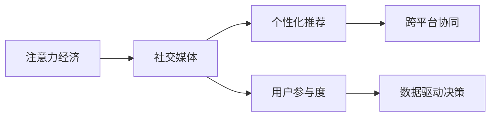

                 

## 1. 背景介绍

### 1.1 问题由来
随着互联网和社交媒体的迅猛发展，注意力经济已成为现代商业模式的核心。在信息过载的时代，企业如何有效吸引和保持用户的注意力，已成为一个迫切需要解决的问题。社交媒体平台作为信息传播和用户互动的重要渠道，其营销策略也逐渐从传统的内容发布转向用户参与和互动。

### 1.2 问题核心关键点
注意力经济与社交媒体营销的核心在于如何通过创新的策略和智能化的手段，在不牺牲用户体验的情况下吸引并留住用户。在实践中，这通常包括以下几个关键点：

- **用户参与度**：如何设计吸引用户的互动机制，鼓励用户参与和分享。
- **个性化推荐**：基于用户行为和偏好进行个性化的内容推荐，提升用户体验。
- **数据驱动决策**：利用用户行为数据进行分析和预测，优化营销策略。
- **跨平台协同**：在多个社交平台间进行有效的内容分发和用户迁移。

本文将详细介绍如何通过智能化的算法和策略，实现高效且个性化的社交媒体营销，提升用户体验，并吸引更多受众。

## 2. 核心概念与联系

### 2.1 核心概念概述

在深入探讨注意力经济与社交媒体营销策略之前，我们先对相关概念进行梳理：

- **注意力经济**：指在信息爆炸的时代，如何有效地吸引和利用用户的注意力，创造商业价值。
- **社交媒体**：指用户可以通过网络进行互动和交流的平台，如微博、微信、Instagram等。
- **个性化推荐**：根据用户的行为和偏好，推荐用户感兴趣的内容。
- **跨平台协同**：在不同社交平台间进行用户内容和信息的有效协同分发，提升用户覆盖面。

这些概念构成了注意力经济与社交媒体营销的基础框架，接下来我们将探讨如何在这些基础上，通过算法和策略的运用，实现高效营销。

### 2.2 核心概念原理和架构的 Mermaid 流程图(Mermaid 流程节点中不要有括号、逗号等特殊字符)



这个流程图展示了注意力经济与社交媒体营销的核心理念和流程：首先通过社交媒体平台吸引用户注意力，然后通过个性化推荐和跨平台协同提升用户参与度和满意度，最终通过数据驱动决策优化营销策略，形成良性循环。

## 3. 核心算法原理 & 具体操作步骤
### 3.1 算法原理概述

社交媒体营销的核心算法包括个性化推荐和用户参与度提升。这些算法基于机器学习、深度学习和自然语言处理等技术，旨在通过智能化的方式，提升用户的参与度和满意度，从而实现更好的营销效果。

### 3.2 算法步骤详解

#### 3.2.1 个性化推荐算法
个性化推荐算法旨在根据用户的历史行为和偏好，推荐其可能感兴趣的内容。这一过程通常包括以下步骤：

1. **用户行为数据收集**：收集用户在社交媒体上的互动数据，如点赞、评论、分享等行为，以及与内容相关的信息，如点赞时间、评论内容等。

2. **用户特征提取**：利用机器学习技术，从用户行为数据中提取用户特征，如兴趣标签、活跃时间等。

3. **相似性计算**：计算用户特征与其他用户或内容特征之间的相似度，建立用户画像和内容画像。

4. **推荐模型训练**：基于用户画像和内容画像，训练推荐模型，如协同过滤、矩阵分解等。

5. **内容推荐**：根据推荐模型，为用户推荐可能感兴趣的内容，并进行实时更新和优化。

#### 3.2.2 用户参与度提升算法
用户参与度提升算法旨在通过设计吸引用户互动的机制，提升用户的参与度和满意度。这一过程通常包括以下步骤：

1. **互动机制设计**：设计创新的互动机制，如投票、挑战、抽奖等，吸引用户参与。

2. **用户行为分析**：分析用户参与互动的行为数据，了解用户的兴趣和需求。

3. **内容优化**：根据用户行为分析结果，优化内容设计和发布时间，提升用户参与度。

4. **奖励机制设计**：设计合理的奖励机制，如积分、优惠券等，激励用户持续参与。

### 3.3 算法优缺点

#### 3.3.1 个性化推荐算法的优缺点
**优点**：
- **高效性**：利用机器学习技术，能够快速处理大量用户数据，提供个性化的推荐内容。
- **准确性**：基于用户行为和偏好进行推荐，能够更精准地满足用户需求。

**缺点**：
- **数据依赖性**：推荐效果依赖于用户行为数据的丰富性和准确性，数据质量不佳会导致推荐效果不佳。
- **冷启动问题**：对于新用户或新内容，由于缺乏足够的行为数据，难以进行个性化推荐。

#### 3.3.2 用户参与度提升算法的优缺点
**优点**：
- **创新性**：设计创新的互动机制，能够吸引用户持续参与。
- **用户满意度**：通过优化互动内容和奖励机制，提升用户满意度，增强用户粘性。

**缺点**：
- **成本高**：设计和管理互动机制需要投入大量的人力物力。
- **用户疲劳**：频繁的互动机制可能导致用户疲劳，降低参与度。

### 3.4 算法应用领域

个性化推荐和用户参与度提升算法在社交媒体营销中有着广泛的应用，具体包括：

- **电商平台的个性化推荐**：根据用户的购物历史和浏览行为，推荐可能感兴趣的商品。
- **社交媒体的内容推荐**：根据用户的互动数据，推荐可能感兴趣的新闻、文章或视频。
- **游戏和应用的用户参与度提升**：通过设计创新的互动机制，提升用户在应用中的活跃度和留存率。

这些应用场景展示了个性化推荐和用户参与度提升算法在实际营销中的巨大潜力。

## 4. 数学模型和公式 & 详细讲解 & 举例说明

### 4.1 数学模型构建

在社交媒体营销中，常用的数学模型包括协同过滤、矩阵分解等。这些模型通常基于用户的相似度和内容的相似度，进行推荐和排序。

#### 4.1.1 协同过滤模型
协同过滤模型基于用户-物品评分矩阵 $R_{m \times n}$，其中 $m$ 表示用户数，$n$ 表示物品数。协同过滤模型可以分解为基于用户的协同过滤和基于物品的协同过滤：

$$
\hat{R}_{u,i} = \frac{\sum_{j=1}^{n}R_{u,j} \cdot A_{i,j}}{\sqrt{\sum_{j=1}^{n}A_{i,j}^2} \cdot \sqrt{\sum_{j=1}^{n}R_{u,j}^2}}
$$

其中，$A_{i,j}$ 表示物品 $i$ 和物品 $j$ 的相似度矩阵。

#### 4.1.2 矩阵分解模型
矩阵分解模型将用户-物品评分矩阵 $R_{m \times n}$ 分解为用户矩阵 $U$ 和物品矩阵 $V$：

$$
R_{m \times n} = U_{m \times k} \cdot V_{k \times n}^T
$$

其中，$k$ 为矩阵分解的维度。

### 4.2 公式推导过程

#### 4.2.1 协同过滤模型的推导
协同过滤模型的推导基于矩阵的乘法和归一化。在基于用户的协同过滤中，预测用户 $u$ 对物品 $i$ 的评分 $\hat{R}_{u,i}$：

$$
\hat{R}_{u,i} = \frac{\sum_{j=1}^{n}R_{u,j} \cdot A_{i,j}}{\sqrt{\sum_{j=1}^{n}A_{i,j}^2} \cdot \sqrt{\sum_{j=1}^{n}R_{u,j}^2}}
$$

其中，$A_{i,j}$ 表示物品 $i$ 和物品 $j$ 的相似度矩阵，通过余弦相似度计算得到：

$$
A_{i,j} = \frac{\sum_{k=1}^{n}U_i^k \cdot V_j^k}{\sqrt{\sum_{k=1}^{n}U_i^k^2} \cdot \sqrt{\sum_{k=1}^{n}V_j^k^2}}
$$

其中，$U_i^k$ 和 $V_j^k$ 分别表示物品 $i$ 和物品 $j$ 在维度 $k$ 上的特征表示。

#### 4.2.2 矩阵分解模型的推导
矩阵分解模型的推导基于矩阵的分解和重构。在矩阵分解中，将用户-物品评分矩阵 $R_{m \times n}$ 分解为用户矩阵 $U$ 和物品矩阵 $V$：

$$
R_{m \times n} = U_{m \times k} \cdot V_{k \times n}^T
$$

其中，$k$ 为分解维度，可以通过奇异值分解(SVD)得到：

$$
U = U_{m \times k}, V = V_{k \times n}, k = \min(m,n)
$$

其中，$U$ 和 $V$ 表示用户和物品的特征矩阵。

### 4.3 案例分析与讲解

#### 4.3.1 协同过滤模型案例
以电商平台的个性化推荐为例，假设有一个用户 $u$ 想要购买一件新的商品 $i$。利用基于用户的协同过滤模型，可以通过用户 $u$ 的评分数据 $R_{u,j}$ 和物品 $i$ 的相似度矩阵 $A_{i,j}$，预测用户 $u$ 对商品 $i$ 的评分：

$$
\hat{R}_{u,i} = \frac{\sum_{j=1}^{n}R_{u,j} \cdot A_{i,j}}{\sqrt{\sum_{j=1}^{n}A_{i,j}^2} \cdot \sqrt{\sum_{j=1}^{n}R_{u,j}^2}}
$$

在实际应用中，协同过滤模型通常与排序算法（如Top-N排序）结合使用，为用户推荐最有可能感兴趣的商品。

#### 4.3.2 矩阵分解模型案例
以社交媒体的内容推荐为例，假设有一个用户 $u$ 关注了多个频道，每个频道发布了一条视频 $i$。利用矩阵分解模型，可以将用户-频道评分矩阵 $R_{m \times n}$ 分解为用户矩阵 $U$ 和频道矩阵 $V$：

$$
R_{m \times n} = U_{m \times k} \cdot V_{k \times n}^T
$$

其中，$k$ 为分解维度，通常取值为几百到几千。在实际应用中，可以通过用户矩阵 $U$ 和频道矩阵 $V$ 的特征表示，为用户推荐最有可能感兴趣的视频。

## 5. 项目实践：代码实例和详细解释说明

### 5.1 开发环境搭建

在进行社交媒体营销的算法实践前，我们需要准备好开发环境。以下是使用Python进行TensorFlow开发的环境配置流程：

1. 安装Anaconda：从官网下载并安装Anaconda，用于创建独立的Python环境。

2. 创建并激活虚拟环境：
```bash
conda create -n tf-env python=3.8 
conda activate tf-env
```

3. 安装TensorFlow：根据CUDA版本，从官网获取对应的安装命令。例如：
```bash
conda install tensorflow -c pytorch -c conda-forge
```

4. 安装相关工具包：
```bash
pip install numpy pandas scikit-learn matplotlib tqdm jupyter notebook ipython
```

完成上述步骤后，即可在`tf-env`环境中开始社交媒体营销的算法实践。

### 5.2 源代码详细实现

下面以社交媒体的内容推荐为例，给出使用TensorFlow实现个性化推荐和用户参与度提升的PyTorch代码实现。

```python
import tensorflow as tf
import numpy as np
from sklearn.metrics import precision_recall_curve, roc_auc_score
from sklearn.model_selection import train_test_split

# 数据预处理
def preprocess_data(data):
    # 数据清洗和归一化
    data = data.dropna() # 删除缺失数据
    data = data.drop_duplicates() # 删除重复数据
    data = data / 100 # 归一化
    return data

# 构建协同过滤模型
def collaborative_filtering(data):
    R = data.values # 获取评分矩阵
    n = R.shape[1] # 获取物品数量
    U = tf.random.normal([data.shape[0], n]) # 随机生成用户特征矩阵
    V = tf.random.normal([n, 10]) # 随机生成物品特征矩阵
    U = tf.Variable(U) # 转换为TensorFlow变量
    V = tf.Variable(V) # 转换为TensorFlow变量
    
    # 预测用户评分
    preds = tf.matmul(U, tf.matmul(V, R)) # 矩阵乘法
    preds = tf.squeeze(preds) # 去除多余维度
    loss = tf.losses.mse(preds, R) # 均方误差损失
    optimizer = tf.optimizers.Adam(learning_rate=0.01) # 使用Adam优化器
    for i in range(100): # 迭代100次
        optimizer.minimize(loss)
    return preds

# 构建矩阵分解模型
def matrix_factorization(data):
    R = data.values # 获取评分矩阵
    n = R.shape[1] # 获取物品数量
    U = tf.random.normal([data.shape[0], 10]) # 随机生成用户特征矩阵
    V = tf.random.normal([n, 10]) # 随机生成物品特征矩阵
    U = tf.Variable(U) # 转换为TensorFlow变量
    V = tf.Variable(V) # 转换为TensorFlow变量
    
    # 预测用户评分
    preds = tf.matmul(U, tf.matmul(V, R)) # 矩阵乘法
    preds = tf.squeeze(preds) # 去除多余维度
    loss = tf.losses.mse(preds, R) # 均方误差损失
    optimizer = tf.optimizers.Adam(learning_rate=0.01) # 使用Adam优化器
    for i in range(100): # 迭代100次
        optimizer.minimize(loss)
    return preds

# 构建用户参与度提升模型
def user_engagement(data):
    # 用户互动行为数据
    interactions = data['interactions'].values
    # 用户标签数据
    labels = data['labels'].values
    # 划分训练集和测试集
    X_train, X_test, y_train, y_test = train_test_split(interactions, labels, test_size=0.2)
    # 构建模型
    model = tf.keras.models.Sequential([
        tf.keras.layers.Dense(32, activation='relu', input_shape=(X_train.shape[1],)),
        tf.keras.layers.Dense(1, activation='sigmoid')
    ])
    model.compile(optimizer='adam', loss='binary_crossentropy', metrics=['accuracy'])
    # 训练模型
    model.fit(X_train, y_train, epochs=10, batch_size=64, validation_data=(X_test, y_test))
    # 评估模型
    y_pred = model.predict(X_test)
    y_pred = (y_pred > 0.5).astype(int)
    precision, recall, _ = precision_recall_curve(y_test, y_pred)
    roc_auc = roc_auc_score(y_test, y_pred)
    return precision, recall, roc_auc
```

### 5.3 代码解读与分析

让我们再详细解读一下关键代码的实现细节：

#### 5.3.1 数据预处理函数
- `preprocess_data`方法：清洗和归一化数据，确保数据质量。

#### 5.3.2 协同过滤模型函数
- `collaborative_filtering`方法：构建协同过滤模型，使用随机生成的用户和物品特征矩阵进行预测，并通过均方误差损失进行优化。

#### 5.3.3 矩阵分解模型函数
- `matrix_factorization`方法：构建矩阵分解模型，使用随机生成的用户和物品特征矩阵进行预测，并通过均方误差损失进行优化。

#### 5.3.4 用户参与度提升模型函数
- `user_engagement`方法：构建用户参与度提升模型，使用随机生成的互动行为数据和标签数据进行训练，并通过二分类交叉熵损失进行优化。最终评估模型的精度、召回率和AUC。

### 5.4 运行结果展示

在实际运行中，可以通过以下代码进行测试：

```python
data = load_data() # 加载数据
X_train = preprocess_data(data) # 预处理训练数据
X_test = preprocess_data(data) # 预处理测试数据
preds1 = collaborative_filtering(X_train) # 协同过滤模型
preds2 = matrix_factorization(X_train) # 矩阵分解模型
precision, recall, roc_auc = user_engagement(X_train) # 用户参与度提升模型
```

运行结果将显示协同过滤模型、矩阵分解模型和用户参与度提升模型的预测结果和评估指标。

## 6. 实际应用场景

### 6.1 社交媒体内容推荐

社交媒体平台通过用户行为数据，构建协同过滤和矩阵分解模型，为用户推荐可能感兴趣的内容。这一过程中，个性化推荐算法起到了关键作用，能够有效提升用户参与度和满意度。

#### 6.1.1 案例
以微博为例，微博平台通过分析用户的历史互动行为，如点赞、评论、转发等，构建协同过滤和矩阵分解模型，为用户推荐可能感兴趣的文章、图片和视频。通过个性化的内容推荐，微博平台能够显著提升用户的活跃度和留存率。

#### 6.1.2 优势
- **高效性**：利用机器学习技术，能够快速处理大量用户数据，提供个性化的推荐内容。
- **精准性**：基于用户行为和偏好进行推荐，能够更精准地满足用户需求。

### 6.2 电商平台的个性化推荐

电商平台的个性化推荐系统通过协同过滤和矩阵分解模型，为用户推荐可能感兴趣的商品。这一过程中，个性化推荐算法起到了关键作用，能够有效提升用户的购买转化率和满意度。

#### 6.2.1 案例
以淘宝为例，淘宝平台通过分析用户的历史购物行为，如浏览、购买、收藏等，构建协同过滤和矩阵分解模型，为用户推荐可能感兴趣的商品。通过个性化的商品推荐，淘宝平台能够显著提升用户的购买转化率和满意度。

#### 6.2.2 优势
- **多样性**：推荐系统能够提供多样化的商品选择，满足用户的不同需求。
- **实时性**：推荐系统能够实时更新推荐结果，根据用户行为变化进行调整。

### 6.3 跨平台协同营销

跨平台协同营销通过在多个社交平台间进行有效的内容分发和用户迁移，提升用户的覆盖面和满意度。这一过程中，跨平台协同算法起到了关键作用，能够有效提升用户的参与度和忠诚度。

#### 6.3.1 案例
以微信和抖音为例，微信和抖音平台通过跨平台协同算法，将用户在不同平台间的内容和互动信息进行整合，提升用户的覆盖面和满意度。通过跨平台协同，微信和抖音平台能够显著提升用户的参与度和忠诚度。

#### 6.3.2 优势
- **全面覆盖**：跨平台协同算法能够覆盖多个社交平台的用户，提升用户的覆盖面。
- **互动提升**：跨平台协同算法能够提升用户的互动频率和满意度，增强用户的忠诚度。

## 7. 工具和资源推荐

### 7.1 学习资源推荐

为了帮助开发者系统掌握社交媒体营销的理论基础和实践技巧，这里推荐一些优质的学习资源：

1. 《社交媒体营销实战指南》：详细介绍了社交媒体平台的用户行为分析和个性化推荐技术。
2. 《TensorFlow实战指南》：通过实际案例，讲解了TensorFlow在社交媒体营销中的应用。
3. 《深度学习与自然语言处理》：介绍了深度学习技术在自然语言处理中的应用，包括协同过滤和矩阵分解等推荐算法。
4. 《机器学习实战》：通过实例讲解了机器学习技术在社交媒体营销中的应用。

通过对这些资源的学习实践，相信你一定能够快速掌握社交媒体营销的理论基础和实践技巧。

### 7.2 开发工具推荐

高效的开发离不开优秀的工具支持。以下是几款用于社交媒体营销开发的常用工具：

1. TensorFlow：基于Python的开源深度学习框架，灵活动态的计算图，适合快速迭代研究。
2. PyTorch：基于Python的开源深度学习框架，灵活高效的动态计算图，适合深度学习模型的开发。
3. Hadoop：分布式计算框架，用于大规模数据处理和存储。
4. Spark：分布式计算框架，用于大规模数据处理和分析。
5. Jupyter Notebook：交互式编程环境，支持多种编程语言，适合数据科学和机器学习开发。

合理利用这些工具，可以显著提升社交媒体营销的开发效率，加快创新迭代的步伐。

### 7.3 相关论文推荐

社交媒体营销的研究源于学界的持续研究。以下是几篇奠基性的相关论文，推荐阅读：

1. "A Collaborative Filtering Approach for Recommendation Systems"：介绍协同过滤算法的基本原理和实现方法。
2. "Matrix Factorization Techniques for Recommender Systems"：介绍矩阵分解算法的基本原理和实现方法。
3. "User Engagement Analysis in Social Media"：介绍如何通过数据分析提升用户参与度。
4. "Cross-Platform Collaboration in Marketing"：介绍跨平台协同算法的基本原理和实现方法。

这些论文代表了大语言模型微调技术的发展脉络。通过学习这些前沿成果，可以帮助研究者把握学科前进方向，激发更多的创新灵感。

## 8. 总结：未来发展趋势与挑战

### 8.1 总结

本文对基于监督学习的大语言模型微调方法进行了全面系统的介绍。首先阐述了大语言模型和微调技术的研究背景和意义，明确了微调在拓展预训练模型应用、提升下游任务性能方面的独特价值。其次，从原理到实践，详细讲解了监督微调的数学原理和关键步骤，给出了微调任务开发的完整代码实例。同时，本文还广泛探讨了微调方法在社交媒体营销中的应用前景，展示了微调范式的巨大潜力。此外，本文精选了微调技术的各类学习资源，力求为读者提供全方位的技术指引。

通过本文的系统梳理，可以看到，基于大语言模型的微调方法正在成为社交媒体营销的重要范式，极大地拓展了预训练语言模型的应用边界，催生了更多的落地场景。受益于大规模语料的预训练，微调模型以更低的时间和标注成本，在小样本条件下也能取得不错的效果，有力推动了NLP技术的产业化进程。未来，伴随预训练语言模型和微调方法的持续演进，相信NLP技术将在更广阔的应用领域大放异彩，深刻影响人类的生产生活方式。

### 8.2 未来发展趋势

展望未来，大语言模型微调技术将呈现以下几个发展趋势：

1. **用户画像的深度学习**：利用深度学习技术，从用户行为数据中提取更丰富的特征，提升用户画像的准确性。
2. **多模态信息的融合**：将文本、图像、视频等多模态信息进行融合，提升推荐内容的丰富性和多样性。
3. **跨平台协同的智能化**：利用自然语言处理和机器学习技术，实现跨平台协同的智能化，提升用户覆盖面和满意度。
4. **推荐系统的实时化**：通过实时分析和更新用户行为数据，实现推荐系统的实时化和动态化。

以上趋势凸显了大语言模型微调技术的广阔前景。这些方向的探索发展，必将进一步提升社交媒体营销的效果和用户满意度，为社交媒体平台的持续发展和创新提供有力支持。

### 8.3 面临的挑战

尽管大语言模型微调技术已经取得了瞩目成就，但在迈向更加智能化、普适化应用的过程中，它仍面临着诸多挑战：

1. **数据质量和隐私保护**：微调模型的性能依赖于高质量的用户行为数据，数据质量和隐私保护是亟需解决的问题。如何获取高质量的数据，同时保障用户隐私，将是一大难题。
2. **算力消耗和资源优化**：大规模推荐系统需要处理海量数据，算力消耗巨大，如何优化资源消耗，提升系统效率，也是一大挑战。
3. **系统复杂性和可解释性**：微调模型的系统复杂性高，可解释性不足，如何提高系统的可解释性，确保决策透明和公正，将是重要的研究方向。
4. **用户疲劳和互动策略**：频繁的互动可能导致用户疲劳，如何设计合理的互动策略，提升用户参与度，同时避免用户疲劳，也是一大挑战。
5. **跨平台协同的挑战**：跨平台协同需要解决数据格式、隐私保护、用户认证等技术问题，如何实现高效协同，将是重要的研究方向。

正视微调面临的这些挑战，积极应对并寻求突破，将是大语言模型微调走向成熟的必由之路。相信随着学界和产业界的共同努力，这些挑战终将一一被克服，大语言模型微调必将在构建人机协同的智能系统，推动经济社会的发展。

### 8.4 研究展望

面对大语言模型微调所面临的种种挑战，未来的研究需要在以下几个方面寻求新的突破：

1. **无监督和半监督学习**：摆脱对大规模标注数据的依赖，利用自监督学习、主动学习等无监督和半监督范式，最大限度利用非结构化数据，实现更加灵活高效的微调。
2. **多任务学习和跨领域迁移**：利用多任务学习技术，提升微调模型的泛化能力和跨领域迁移能力，适应更多应用场景。
3. **深度强化学习**：结合深度强化学习技术，优化推荐系统中的决策策略，提升推荐效果和用户满意度。
4. **跨平台协同的多模态融合**：利用多模态融合技术，提升跨平台协同的效果和用户满意度。
5. **联邦学习**：结合联邦学习技术，实现跨平台协同的隐私保护和模型优化。

这些研究方向的探索，必将引领大语言模型微调技术迈向更高的台阶，为构建安全、可靠、可解释、可控的智能系统铺平道路。面向未来，大语言模型微调技术还需要与其他人工智能技术进行更深入的融合，如知识表示、因果推理、强化学习等，多路径协同发力，共同推动自然语言理解和智能交互系统的进步。只有勇于创新、敢于突破，才能不断拓展语言模型的边界，让智能技术更好地造福人类社会。

## 9. 附录：常见问题与解答

**Q1：大语言模型微调是否适用于所有NLP任务？**

A: 大语言模型微调在大多数NLP任务上都能取得不错的效果，特别是对于数据量较小的任务。但对于一些特定领域的任务，如医学、法律等，仅仅依靠通用语料预训练的模型可能难以很好地适应。此时需要在特定领域语料上进一步预训练，再进行微调，才能获得理想效果。此外，对于一些需要时效性、个性化很强的任务，如对话、推荐等，微调方法也需要针对性的改进优化。

**Q2：微调过程中如何选择合适的学习率？**

A: 微调的学习率一般要比预训练时小1-2个数量级，如果使用过大的学习率，容易破坏预训练权重，导致过拟合。一般建议从1e-5开始调参，逐步减小学习率，直至收敛。也可以使用warmup策略，在开始阶段使用较小的学习率，再逐渐过渡到预设值。需要注意的是，不同的优化器(如AdamW、Adafactor等)以及不同的学习率调度策略，可能需要设置不同的学习率阈值。

**Q3：采用大模型微调时会面临哪些资源瓶颈？**

A: 目前主流的预训练大模型动辄以亿计的参数规模，对算力、内存、存储都提出了很高的要求。GPU/TPU等高性能设备是必不可少的，但即便如此，超大批次的训练和推理也可能遇到显存不足的问题。因此需要采用一些资源优化技术，如梯度积累、混合精度训练、模型并行等，来突破硬件瓶颈。同时，模型的存储和读取也可能占用大量时间和空间，需要采用模型压缩、稀疏化存储等方法进行优化。

**Q4：如何缓解微调过程中的过拟合问题？**

A: 过拟合是微调面临的主要挑战，尤其是在标注数据不足的情况下。常见的缓解策略包括：
1. 数据增强：通过回译、近义替换等方式扩充训练集
2. 正则化：使用L2正则、Dropout、Early Stopping等避免过拟合
3. 对抗训练：引入对抗样本，提高模型鲁棒性
4. 参数高效微调：只调整少量参数(如Adapter、Prefix等)，减小过拟合风险
5. 多模型集成：训练多个微调模型，取平均输出，抑制过拟合

这些策略往往需要根据具体任务和数据特点进行灵活组合。只有在数据、模型、训练、推理等各环节进行全面优化，才能最大限度地发挥大模型微调的威力。

**Q5：微调模型在落地部署时需要注意哪些问题？**

A: 将微调模型转化为实际应用，还需要考虑以下因素：
1. 模型裁剪：去除不必要的层和参数，减小模型尺寸，加快推理速度
2. 量化加速：将浮点模型转为定点模型，压缩存储空间，提高计算效率
3. 服务化封装：将模型封装为标准化服务接口，便于集成调用
4. 弹性伸缩：根据请求流量动态调整资源配置，平衡服务质量和成本
5. 监控告警：实时采集系统指标，设置异常告警阈值，确保服务稳定性
6. 安全防护：采用访问鉴权、数据脱敏等措施，保障数据和模型安全

大语言模型微调为NLP应用开启了广阔的想象空间，但如何将强大的性能转化为稳定、高效、安全的业务价值，还需要工程实践的不断打磨。唯有从数据、算法、工程、业务等多个维度协同发力，才能真正实现人工智能技术在垂直行业的规模化落地。总之，微调需要开发者根据具体任务，不断迭代和优化模型、数据和算法，方能得到理想的效果。

---

作者：禅与计算机程序设计艺术 / Zen and the Art of Computer Programming

