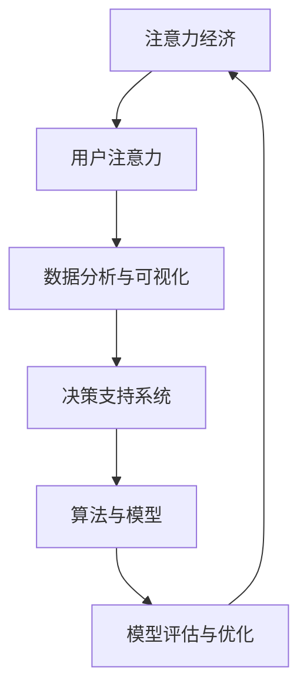

                 

## 1. 背景介绍

在数字化转型浪潮的推动下，企业决策过程逐步数字化、智能化，形成了基于数据驱动的注意力经济。注意力经济（Attention Economy），即通过分析和利用用户注意力，为企业决策提供数据支持，优化资源配置，提升决策效率和效果。这一概念最早由经济学家托德·施瓦茨（Todd S. Schartz）在1997年提出，主要关注数字媒体时代信息爆炸、注意力稀缺现象对消费决策的影响。如今，注意力经济已广泛渗透到企业运营和决策的方方面面。

### 1.1 问题由来

随着互联网的普及和社交媒体的兴起，信息的过载问题日益严重。在信息爆炸的时代，用户注意力成为稀缺资源。企业决策者面临大量数据和信息，如何高效利用这些数据，提升决策质量，成为亟待解决的问题。

### 1.2 问题核心关键点

- **注意力集中与分心**：用户注意力集中度的提升和分散，影响着产品和服务的表现。
- **数据与用户行为**：如何从海量数据中提取有价值的信息，用于指导决策。
- **决策效率与效果**：如何在有限的时间里做出高质量的决策，提升企业竞争力。
- **用户心理与需求**：理解用户心理和需求，引导用户做出更有利于企业的决策。
- **技术工具与方法**：选择和运用合适的技术工具，辅助决策过程。

### 1.3 问题研究意义

研究注意力经济对企业决策过程的影响，对于提升企业决策效率和效果，优化资源配置，具有重要意义：

1. **数据驱动决策**：通过分析用户注意力数据，更好地理解市场动态和用户需求，制定更加精准的决策方案。
2. **提升决策效率**：利用注意力数据分析，减少决策时间和试错成本，提升企业运营效率。
3. **优化用户体验**：通过关注用户注意力，改进产品和服务，提升用户体验，增强用户粘性。
4. **竞争优势提升**：精准利用用户注意力，引导用户行为，增强企业在市场中的竞争优势。
5. **数据治理与隐私保护**：合理运用注意力数据，遵守法律法规，保护用户隐私。

## 2. 核心概念与联系

### 2.1 核心概念概述

为更好地理解注意力经济对企业决策的影响，本节将介绍几个关键概念及其之间的联系：

- **注意力经济**：通过分析和利用用户注意力，为企业决策提供数据支持，优化资源配置。
- **用户注意力**：用户在接触信息时所投入的心理能量，反映其对内容的兴趣和参与程度。
- **数据分析与可视化**：对用户注意力数据进行收集、清洗和分析，形成直观的图表和报告，辅助决策。
- **决策支持系统**：通过数据分析和注意力分析，支持企业进行更科学的决策。
- **算法与模型**：利用数据挖掘、机器学习等算法，从用户注意力数据中提取有价值的信息，指导决策。
- **模型评估与优化**：通过实验验证和结果评估，不断优化决策模型，提升决策效果。

这些概念之间的逻辑关系可以通过以下Mermaid流程图来展示：



### 2.2 核心概念原理和架构的 Mermaid 流程图

在关注用户注意力的过程中，核心步骤如下：

1. **注意力收集**：使用网站流量分析工具、社交媒体跟踪工具等，收集用户行为数据。
2. **数据清洗**：对收集到的数据进行清洗和预处理，去除噪声和异常值。
3. **数据分析**：运用统计分析、时间序列分析等方法，分析用户注意力数据，发现潜在规律和趋势。
4. **数据可视化**：利用图表、仪表盘等工具，直观展示数据分析结果，辅助决策。
5. **决策支持**：结合业务知识，分析决策支持系统提供的数据和分析结果，制定决策方案。
6. **模型优化**：利用机器学习算法，不断优化模型，提升决策效果。

### 2.3 核心概念联系

用户注意力、数据分析与可视化、决策支持系统、算法与模型、模型评估与优化等概念之间存在密切联系：

- **用户注意力与数据分析**：用户注意力数据是数据分析的基础，通过数据清洗和分析，发现用户行为规律。
- **数据分析与决策支持**：数据分析结果为决策提供科学依据，决策支持系统将数据转化为可执行方案。
- **算法与模型**：通过算法处理数据，提取用户注意力中的关键信息，辅助决策。
- **模型评估与优化**：模型评估验证决策效果，优化算法和参数，提升决策质量。

这些概念共同构成了注意力经济对企业决策的影响框架，帮助企业在数据驱动的环境中做出科学、高效的决策。

## 3. 核心算法原理 & 具体操作步骤

### 3.1 算法原理概述

注意力经济中，核心算法包括数据分析、用户行为预测、决策优化等。以下重点介绍数据分析和预测算法。

**数据分析**：
- **统计分析**：通过统计描述、假设检验等方法，对用户注意力数据进行分析和解释。
- **时间序列分析**：对用户注意力数据进行时间序列建模，预测未来趋势。
- **聚类分析**：利用聚类算法，将用户分为不同群体，分析各群体的注意力特征。
- **关联规则挖掘**：通过关联规则挖掘算法，发现用户注意力与行为之间的关联规律。

**用户行为预测**：
- **时间序列预测**：利用时间序列模型，预测用户未来行为，如点击率、购买率等。
- **基于规则的预测**：构建预测规则，利用用户历史数据预测其未来行为。
- **机器学习预测**：利用机器学习算法，构建预测模型，提升预测准确度。

### 3.2 算法步骤详解

#### 3.2.1 数据分析步骤

1. **数据收集**：使用网站分析工具、社交媒体API等，收集用户行为数据。
2. **数据清洗**：去除重复、缺失、异常数据，标准化数据格式。
3. **特征工程**：提取关键特征，如页面访问时间、停留时长、互动频率等。
4. **数据分析**：运用统计分析、时间序列分析、聚类分析、关联规则挖掘等方法，分析数据。
5. **数据可视化**：利用图表、仪表盘等工具，展示分析结果。

#### 3.2.2 用户行为预测步骤

1. **数据收集**：收集用户历史行为数据。
2. **特征提取**：提取关键特征，如浏览记录、点击次数、购买金额等。
3. **模型选择**：选择合适的预测模型，如时间序列模型、基于规则的预测模型、机器学习预测模型。
4. **模型训练**：使用历史数据训练预测模型。
5. **模型评估**：使用测试数据评估模型效果，调整模型参数。
6. **预测应用**：利用训练好的模型，预测用户未来行为。

### 3.3 算法优缺点

#### 3.3.1 数据分析算法

**优点**：
- **科学性强**：通过系统化分析，提供决策依据。
- **可解释性**：分析过程透明，便于理解和解释。
- **适用范围广**：适用于各类数据类型和业务场景。

**缺点**：
- **数据依赖性强**：依赖于高质量的数据，数据质量和完整性影响分析结果。
- **模型复杂**：某些复杂分析方法需要高技术门槛。
- **计算量大**：大量数据处理和复杂模型训练需要计算资源。

#### 3.3.2 用户行为预测算法

**优点**：
- **预测精度高**：通过模型训练，提高预测准确度。
- **自动化程度高**：利用机器学习算法，实现自动化预测。
- **灵活性强**：可以根据业务需求调整预测模型。

**缺点**：
- **数据质量要求高**：预测模型的效果依赖于数据质量和完整性。
- **模型选择困难**：不同场景下选择合适的预测模型困难。
- **计算资源需求大**：复杂模型训练和优化需要大量计算资源。

### 3.4 算法应用领域

注意力经济的核心算法广泛应用于以下领域：

#### 3.4.1 市场营销

- **用户行为预测**：预测用户购买行为，优化广告投放策略，提升营销效果。
- **用户分群**：利用聚类分析，将用户分为不同群体，制定个性化营销方案。
- **转化率优化**：通过数据分析，优化网站结构和用户体验，提高用户转化率。

#### 3.4.2 产品推荐

- **用户行为预测**：预测用户购买行为，推荐个性化产品，提升用户满意度。
- **冷启动问题**：通过关联规则挖掘，解决新用户推荐冷启动问题。
- **用户满意度评估**：利用情感分析，评估产品推荐效果，优化推荐策略。

#### 3.4.3 客户服务

- **客户行为分析**：分析客户服务记录，提升服务质量和效率。
- **客户分群**：利用聚类分析，将客户分为不同群体，制定个性化服务方案。
- **客户满意度评估**：通过数据分析，评估客户满意度，优化服务流程。

## 4. 数学模型和公式 & 详细讲解 & 举例说明

### 4.1 数学模型构建

以下我们以用户行为预测为例，使用数学语言对注意力经济中的数据分析和预测过程进行严格刻画。

假设用户行为数据集为 $D=\{(x_i,y_i)\}_{i=1}^N$，其中 $x_i=(x_{i1},x_{i2},...,x_{in})$ 为特征向量，$y_i$ 为行为标签，如点击、购买等。

定义用户行为预测模型的损失函数为：

$$
\mathcal{L}(w) = \frac{1}{N}\sum_{i=1}^N \ell(y_i,f(x_i;w))
$$

其中 $f(x_i;w)$ 为预测模型，$w$ 为模型参数，$\ell$ 为损失函数，如均方误差损失。

预测模型 $f(x_i;w)$ 可以有多种形式，如线性回归模型、逻辑回归模型、神经网络模型等。以线性回归模型为例，预测模型定义为：

$$
f(x_i;w) = \beta_0 + \beta_1 x_{i1} + ... + \beta_k x_{ik}
$$

其中 $\beta_0, ..., \beta_k$ 为模型参数，需要根据数据集 $D$ 进行训练。

### 4.2 公式推导过程

以下对线性回归模型的参数估计和预测过程进行详细推导：

假设样本 $(x_i,y_i)$ 的预测值为 $f(x_i;w)$，定义损失函数为均方误差损失：

$$
\ell(y_i,f(x_i;w)) = \frac{1}{2}(y_i-f(x_i;w))^2
$$

则平均损失函数为：

$$
\mathcal{L}(w) = \frac{1}{2N}\sum_{i=1}^N (y_i-f(x_i;w))^2
$$

对 $w$ 求导，得到参数估计公式：

$$
\frac{\partial \mathcal{L}(w)}{\partial \beta_j} = \frac{1}{N}\sum_{i=1}^N (y_i-f(x_i;w))x_{ij}
$$

求解上述方程组，得到模型参数 $\beta_j$ 的估计值。

将求得的参数代入模型 $f(x_i;w)$，对新样本 $x_i'$ 进行预测：

$$
f(x_i';w) = \beta_0 + \beta_1 x_{i1}' + ... + \beta_k x_{ik}'
$$

### 4.3 案例分析与讲解

#### 4.3.1 用户行为预测案例

假设某电商平台收集到用户的浏览和购买记录，目标是预测用户未来的购买行为。选择线性回归模型作为预测模型，特征包括用户浏览时间、浏览频率、浏览深度等。

**数据预处理**：
- **数据清洗**：去除重复、缺失、异常数据，标准化数据格式。
- **特征提取**：提取关键特征，如浏览时间、浏览频率、浏览深度等。
- **数据分割**：将数据集分为训练集和测试集。

**模型训练**：
- **参数初始化**：设置模型参数 $\beta_0, ..., \beta_k$ 的初始值。
- **损失函数**：选择均方误差损失函数。
- **迭代优化**：使用梯度下降算法，迭代更新模型参数，最小化损失函数。

**模型评估**：
- **测试集评估**：在测试集上评估模型效果，计算预测误差。
- **模型优化**：调整模型参数，提升预测效果。

**预测应用**：
- **新用户预测**：对于新用户，根据其历史行为数据，预测其未来的购买行为。
- **个性化推荐**：根据用户行为预测结果，推荐个性化商品，提升用户体验。

通过以上案例，可以看出数据分析和用户行为预测在实际应用中的流程和关键步骤。

## 5. 项目实践：代码实例和详细解释说明

### 5.1 开发环境搭建

在进行注意力经济的数据分析与预测实践前，我们需要准备好开发环境。以下是使用Python进行PyTorch开发的环境配置流程：

1. 安装Anaconda：从官网下载并安装Anaconda，用于创建独立的Python环境。

2. 创建并激活虚拟环境：
```bash
conda create -n pytorch-env python=3.8 
conda activate pytorch-env
```

3. 安装PyTorch：根据CUDA版本，从官网获取对应的安装命令。例如：
```bash
conda install pytorch torchvision torchaudio cudatoolkit=11.1 -c pytorch -c conda-forge
```

4. 安装TensorBoard：用于可视化模型训练和评估过程。

5. 安装Keras：用于构建和训练机器学习模型。

6. 安装Pandas和NumPy：用于数据处理和分析。

完成上述步骤后，即可在`pytorch-env`环境中开始数据分析与预测实践。

### 5.2 源代码详细实现

下面以用户行为预测为例，给出使用PyTorch和Keras进行线性回归模型的代码实现。

```python
import pandas as pd
import numpy as np
from sklearn.model_selection import train_test_split
from sklearn.preprocessing import StandardScaler
from keras.models import Sequential
from keras.layers import Dense
from sklearn.metrics import mean_squared_error

# 数据预处理
data = pd.read_csv('user_behavior.csv')
X = data[['browsing_time', 'browsing_frequency', 'browsing_depth']]
y = data['purchase']

# 标准化处理
scaler = StandardScaler()
X = scaler.fit_transform(X)

# 分割数据集
X_train, X_test, y_train, y_test = train_test_split(X, y, test_size=0.2, random_state=42)

# 构建模型
model = Sequential()
model.add(Dense(10, input_dim=X_train.shape[1], activation='relu'))
model.add(Dense(1, activation='linear'))

# 编译模型
model.compile(loss='mean_squared_error', optimizer='adam')

# 训练模型
history = model.fit(X_train, y_train, epochs=100, batch_size=32, verbose=1)

# 评估模型
y_pred = model.predict(X_test)
mse = mean_squared_error(y_test, y_pred)
print(f'MSE: {mse}')

# 预测新用户行为
new_user = np.array([[150, 5, 3]])
predicted_purchase = model.predict(new_user)
print(f'Predicted Purchase: {predicted_purchase[0][0]}')
```

### 5.3 代码解读与分析

让我们再详细解读一下关键代码的实现细节：

**数据预处理**：
- **数据清洗**：使用Pandas库，去除重复、缺失、异常数据。
- **特征提取**：从CSV文件中提取关键特征，包括用户浏览时间、浏览频率、浏览深度等。
- **标准化处理**：使用Sklearn库进行特征标准化处理，提升模型效果。

**模型训练**：
- **模型构建**：使用Keras库构建线性回归模型，包含一个隐藏层和一个输出层。
- **模型编译**：设置损失函数和优化器。
- **模型训练**：使用fit函数，迭代更新模型参数，最小化损失函数。

**模型评估**：
- **预测值计算**：在测试集上计算预测值。
- **评估指标**：使用均方误差（MSE）作为评估指标，评估模型效果。

**预测应用**：
- **新用户预测**：对于新用户，根据其历史行为数据，预测其未来的购买行为。

以上代码展示了使用PyTorch和Keras进行用户行为预测的完整流程。可以看到，利用强大的机器学习库，我们可以快速实现注意力经济中的数据分析和预测。

### 5.4 运行结果展示

运行上述代码，可以观察到模型的训练曲线、评估指标等输出结果，以及新用户行为的预测结果。这些结果可以帮助我们评估模型的效果，并进行必要的优化调整。

## 6. 实际应用场景

### 6.1 智能推荐系统

智能推荐系统已经成为电商平台、视频平台、音乐平台等企业的标配。通过对用户行为的预测和分析，推荐系统可以为用户推荐个性化的商品、视频、音乐等，提升用户体验和满意度。

在技术实现上，可以收集用户的历史行为数据，如浏览记录、点击次数、购买金额等，建立用户行为预测模型。根据预测结果，推荐系统可以动态调整推荐策略，提升推荐效果。例如，对于有购买意愿的用户，可以优先推荐热门商品；对于有浏览但未购买的用户，可以推荐相关商品或相似商品。

### 6.2 客户服务

客户服务部门可以利用用户行为数据，提升服务效率和质量。通过对用户服务记录的分析，识别用户行为模式和问题类型，制定针对性的服务方案。例如，对于频繁咨询退货的用户，可以提供更详细的服务指南；对于有投诉倾向的用户，可以提前联系解决其问题。

在技术实现上，可以收集客户服务记录，建立用户行为预测模型。根据预测结果，客户服务部门可以提前预测用户的服务需求，优化服务流程，提升用户体验。例如，对于有投诉倾向的用户，可以提前联系并提供更全面的服务支持。

### 6.3 金融风险管理

金融机构需要实时监测用户行为，及时发现和防范金融风险。通过对用户交易行为的预测和分析，识别异常交易行为，提前采取风险控制措施。例如，对于频繁转账、异常消费的用户，可以进一步审查其交易行为，防范金融欺诈。

在技术实现上，可以收集用户交易数据，建立用户行为预测模型。根据预测结果，金融机构可以实时监测用户行为，及时发现和防范金融风险。例如，对于频繁转账、异常消费的用户，可以进一步审查其交易行为，防范金融欺诈。

## 7. 工具和资源推荐

### 7.1 学习资源推荐

为了帮助开发者系统掌握注意力经济的数据分析与预测技术，这里推荐一些优质的学习资源：

1. **《Python数据科学手册》**：由Jake VanderPlas所著，系统介绍了Python在数据分析与机器学习中的应用，包括数据处理、模型构建、模型评估等。

2. **《机器学习实战》**：由Peter Harrington所著，通过实战案例，介绍了机器学习的基本原理和实践技巧，适合初学者入门。

3. **Kaggle数据科学竞赛**：Kaggle是数据科学竞赛平台，提供了丰富的数据集和竞赛任务，适合锻炼数据分析和预测能力。

4. **Coursera机器学习课程**：由Andrew Ng所著，系统介绍了机器学习的基本概念和算法，适合深度学习领域的学习者。

5. **PyTorch官方文档**：PyTorch是深度学习领域的领先框架，官方文档详细介绍了TensorBoard、Keras等工具的使用方法，适合实践开发。

通过对这些资源的学习实践，相信你一定能够快速掌握注意力经济中的数据分析与预测技术，并用于解决实际的商业问题。

### 7.2 开发工具推荐

高效的开发离不开优秀的工具支持。以下是几款用于注意力经济数据分析与预测开发的常用工具：

1. **Python**：作为数据分析与预测的主流语言，Python具有丰富的数据处理和机器学习库，如Pandas、NumPy、Scikit-learn等。

2. **PyTorch**：基于Python的深度学习框架，灵活的动态计算图，适合快速迭代研究。

3. **Keras**：高层次的深度学习框架，适合快速构建和训练模型。

4. **TensorBoard**：用于可视化模型训练和评估过程，实时监控模型训练状态。

5. **Jupyter Notebook**：交互式的数据分析与预测平台，方便数据处理和模型训练。

6. **Tableau**：数据可视化工具，适合快速构建数据仪表盘，辅助决策。

合理利用这些工具，可以显著提升注意力经济数据分析与预测的开发效率，加快创新迭代的步伐。

### 7.3 相关论文推荐

注意力经济中的数据分析与预测技术研究始于数据驱动决策理论，近年来随着深度学习技术的发展，逐步向模型驱动决策转变。以下是几篇奠基性的相关论文，推荐阅读：

1. **《数据驱动的决策分析》**：由Elizabethzer J.F. Fountain等所著，介绍了数据驱动决策的基本原理和实践方法。

2. **《基于深度学习的推荐系统》**：由Jianbin Huang等所著，介绍了基于深度学习的推荐系统设计，包括模型构建、训练和评估。

3. **《金融风险预测的深度学习方法》**：由Jian Zhou等所著，介绍了深度学习在金融风险预测中的应用，包括模型构建和评估。

4. **《用户行为预测与分析》**：由Li Wei等所著，介绍了用户行为预测的基本原理和算法，适合了解数据处理和模型构建。

5. **《智能推荐系统综述》**：由Fu He等所著，介绍了智能推荐系统的基本原理和算法，适合了解推荐系统的设计思路和优化方法。

这些论文代表了大数据时代数据驱动决策的理论基础和实践前沿，通过学习这些前沿成果，可以帮助研究者把握学科前进方向，激发更多的创新灵感。

## 8. 总结：未来发展趋势与挑战

### 8.1 总结

本文对注意力经济对企业决策过程的影响进行了全面系统的介绍。首先阐述了注意力经济的研究背景和意义，明确了数据分析和用户行为预测在决策中的核心作用。其次，从原理到实践，详细讲解了数据分析和预测的数学原理和关键步骤，给出了具体案例和代码实现。最后，探讨了注意力经济在多个领域的应用前景，提出了未来发展趋势和面临的挑战。

通过本文的系统梳理，可以看到，注意力经济通过数据分析和用户行为预测，提升企业决策效率和效果，优化资源配置，具有广阔的应用前景。未来，伴随深度学习技术的发展，数据分析和预测技术将不断进步，为企业的决策支持提供更科学、高效的支持。

### 8.2 未来发展趋势

展望未来，注意力经济将呈现以下几个发展趋势：

1. **数据驱动决策的普及**：随着大数据和云计算技术的进步，数据分析和预测技术将更加普及，支持更多企业进行数据驱动决策。

2. **AI技术的应用深化**：深度学习、自然语言处理等AI技术将进一步融入数据分析和预测过程，提升预测精度和效果。

3. **跨领域数据融合**：将不同领域的数据进行融合，构建更全面、更丰富的用户行为模型，提升预测效果。

4. **实时决策支持**：通过实时数据分析和预测，支持企业快速响应市场变化，提升决策时效性。

5. **多模态数据融合**：将文本、图像、视频等多种数据进行融合，提升决策支持系统的综合能力。

以上趋势凸显了注意力经济在企业决策中的重要地位，为决策提供更科学、高效的支持。

### 8.3 面临的挑战

尽管注意力经济在企业决策中已经取得了显著成果，但在推广应用过程中，仍面临诸多挑战：

1. **数据隐私与安全**：用户行为数据的收集和使用需要严格遵守法律法规，保护用户隐私。

2. **数据质量与完整性**：数据质量直接影响数据分析和预测效果，需要保证数据完整性和准确性。

3. **计算资源需求**：数据分析和预测过程需要大量的计算资源，如何优化算法和模型，降低计算成本，是关键问题。

4. **模型解释性与可控性**：复杂模型难以解释，缺乏可控性，如何提升模型的可解释性，增强用户信任，是重要课题。

5. **跨领域应用难度**：不同领域的数据特点不同，如何将注意力经济技术推广到其他领域，需要更多实践经验。

6. **技术门槛**：数据分析和预测技术需要较高的技术门槛，如何降低技术门槛，普及技术应用，是关键问题。

正视这些挑战，积极应对并寻求突破，将是大数据时代企业决策支持的重要方向。

### 8.4 研究展望

面对注意力经济面临的挑战，未来的研究需要在以下几个方面寻求新的突破：

1. **数据隐私保护**：研究数据隐私保护技术，确保用户数据安全。

2. **数据质量提升**：研究数据清洗和预处理技术，提升数据质量。

3. **高效计算方法**：研究高效计算方法，优化算法和模型，降低计算成本。

4. **模型解释性提升**：研究可解释性技术，提升模型的可解释性，增强用户信任。

5. **跨领域技术推广**：研究跨领域技术应用，推动技术向更多领域渗透。

6. **技术普及化**：研究技术普及化方法，降低技术门槛，普及技术应用。

这些研究方向的探索，必将引领注意力经济技术迈向更高的台阶，为企业的决策支持提供更科学、高效的支持。面向未来，企业需不断创新、持续优化，才能在数据驱动的浪潮中脱颖而出，引领行业发展。

## 9. 附录：常见问题与解答

**Q1：注意力经济对企业决策有什么影响？**

A: 注意力经济通过数据分析和用户行为预测，优化企业决策过程，提升决策效率和效果。具体影响包括：

1. **数据驱动决策**：通过数据分析，提供决策依据，减少主观偏差。
2. **提升决策效率**：利用预测模型，快速响应市场变化，提升决策速度。
3. **优化资源配置**：通过数据分析，优化资源分配，提升企业运营效率。
4. **提升用户体验**：通过预测用户行为，提供个性化推荐，提升用户体验。
5. **竞争优势提升**：通过预测用户需求，引导用户行为，增强企业市场竞争力。

**Q2：注意力经济在企业决策中面临哪些挑战？**

A: 注意力经济在企业决策中面临以下挑战：

1. **数据隐私与安全**：用户行为数据的收集和使用需要严格遵守法律法规，保护用户隐私。
2. **数据质量与完整性**：数据质量直接影响数据分析和预测效果，需要保证数据完整性和准确性。
3. **计算资源需求**：数据分析和预测过程需要大量的计算资源，如何优化算法和模型，降低计算成本，是关键问题。
4. **模型解释性与可控性**：复杂模型难以解释，缺乏可控性，如何提升模型的可解释性，增强用户信任，是重要课题。
5. **跨领域应用难度**：不同领域的数据特点不同，如何将注意力经济技术推广到其他领域，需要更多实践经验。
6. **技术门槛**：数据分析和预测技术需要较高的技术门槛，如何降低技术门槛，普及技术应用，是关键问题。

**Q3：如何提升企业决策的科学性和高效性？**

A: 提升企业决策的科学性和高效性，可以从以下几个方面入手：

1. **数据驱动决策**：利用数据分析工具，收集和处理海量数据，提供决策依据。
2. **用户行为预测**：建立用户行为预测模型，预测用户需求和行为，优化资源配置。
3. **实时决策支持**：通过实时数据分析和预测，支持企业快速响应市场变化，提升决策时效性。
4. **数据可视化**：利用数据可视化工具，直观展示数据分析结果，辅助决策。
5. **多模态数据融合**：将文本、图像、视频等多种数据进行融合，提升决策支持系统的综合能力。
6. **技术普及化**：研究技术普及化方法，降低技术门槛，普及技术应用。

通过以上措施，可以有效提升企业决策的科学性和高效性，为企业发展提供有力支持。

---

作者：禅与计算机程序设计艺术 / Zen and the Art of Computer Programming

