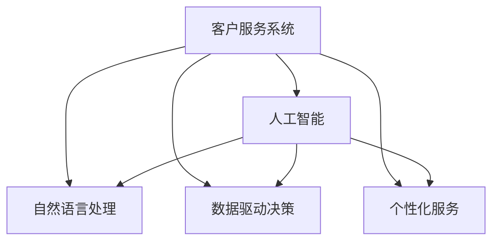

                 

## 1. 背景介绍

### 1.1 问题由来
注意力经济（Economy of Attention）是21世纪信息时代的一个重要概念，旨在描述随着信息爆炸，人们如何从大量的信息中筛选并获取有价值的内容。在企业客户服务领域，注意力经济的影响日益显著，客户期望能够获得快速、高效、个性化的服务，企业也面临着如何吸引和留住客户注意力的挑战。

传统的客户服务模式主要是基于人员的，包括热线电话、电子邮件、在线聊天等。这些模式在处理简单问题时效率较高，但对于复杂问题，尤其是涉及多个部门协作的复合问题，响应速度和解决质量往往不尽如人意。此外，大量重复性、低附加值的工作使得人力资源投入巨大，难以应对不断增长的客户需求。

近年来，人工智能（AI）和大数据技术的发展为解决这些问题提供了新的解决方案。通过智能客服系统、客户行为分析、个性化推荐等技术，企业能够更高效地捕捉客户需求，提供差异化的服务，从而在激烈的竞争中脱颖而出。

### 1.2 问题核心关键点
注意力经济对企业客户服务模式的影响主要体现在以下几个方面：

- **客户服务效率提升**：通过自动化和智能化手段，大幅提升服务响应速度和问题解决质量。
- **客户服务成本降低**：减少对人力的依赖，降低企业运营成本。
- **客户体验优化**：通过个性化和即时响应，提升客户满意度和忠诚度。
- **客户需求预测**：通过数据分析和预测技术，提前识别潜在问题，预防客户流失。

### 1.3 问题研究意义
研究注意力经济对客户服务模式的影响，对于提升企业客户服务水平、优化运营效率、降低成本具有重要意义。

- **提升服务质量**：通过AI技术，快速准确地处理客户问题，提高服务质量。
- **降低运营成本**：减少人工客服投入，降低运营成本，提升利润率。
- **增强市场竞争力**：通过个性化和即时响应，提升客户满意度，增强市场竞争力。
- **促进技术创新**：推动AI、大数据、自然语言处理等技术的深度应用，促进产业升级。

## 2. 核心概念与联系

### 2.1 核心概念概述

为更好地理解注意力经济对客户服务模式的影响，本节将介绍几个密切相关的核心概念：

- **客户服务系统（Customer Service System, CSS）**：指通过技术手段实现客户服务的自动化系统，包括智能客服、自助服务、社交媒体支持等。
- **人工智能（Artificial Intelligence, AI）**：指通过算法和模型实现智能决策和自动化执行的技术，包括机器学习、自然语言处理、计算机视觉等。
- **自然语言处理（Natural Language Processing, NLP）**：指使计算机能够理解、处理和生成人类自然语言的技术，包括语音识别、语义理解、生成文本等。
- **数据驱动决策（Data-Driven Decision Making）**：指通过数据分析和挖掘技术，支持企业做出科学、高效的决策。
- **个性化服务（Personalized Service）**：指根据客户需求和行为，提供定制化的服务，提升客户满意度。

这些核心概念之间的逻辑关系可以通过以下Mermaid流程图来展示：



这个流程图展示了一系列关键概念及其之间的关系：

1. 客户服务系统通过人工智能技术，实现自然语言处理和数据驱动决策，从而提供个性化服务。
2. 自然语言处理和人工智能技术相互支持，自然语言处理使机器能够理解人类语言，人工智能则提供智能决策和执行能力。
3. 数据驱动决策通过数据分析和挖掘，支持人工智能模型进行训练和优化，从而提升服务质量。
4. 个性化服务通过了解客户需求和行为，提供差异化的服务，提升客户体验。

这些概念共同构成了客户服务系统的核心架构，使其能够在不同场景下提供高效的、个性化的服务。

## 3. 核心算法原理 & 具体操作步骤
### 3.1 算法原理概述

注意力经济对客户服务模式的影响，本质上是客户对服务资源（如时间、人力、信息）的分配和利用。通过AI和大数据分析，企业可以更高效地分配这些资源，提升服务效率和质量，从而满足客户的个性化需求。

具体而言，基于注意力经济的企业客户服务模式包括：

- **智能客服系统**：通过自然语言处理和机器学习技术，实现自动化的客户服务。
- **客户行为分析**：通过数据分析技术，了解客户偏好和行为，优化服务策略。
- **个性化推荐**：基于客户历史行为和偏好，推荐个性化内容和服务。
- **预测性维护**：通过预测分析，预防客户问题，提升客户满意度。

### 3.2 算法步骤详解

基于注意力经济的企业客户服务模式，通常包括以下几个关键步骤：

**Step 1: 数据收集与清洗**
- 收集客户的历史交互数据，包括电话、邮件、聊天记录等。
- 对数据进行清洗和预处理，去除噪音和异常值，保证数据质量。

**Step 2: 特征工程**
- 提取和构建有意义的特征，如客户常用词汇、回复时间、情绪等。
- 使用特征选择和降维技术，优化模型性能。

**Step 3: 模型训练**
- 选择合适的机器学习算法，如逻辑回归、随机森林、深度学习等，进行模型训练。
- 使用交叉验证等技术，评估模型性能，防止过拟合。

**Step 4: 模型应用**
- 将训练好的模型部署到生产环境，实时处理客户请求。
- 使用监控和反馈机制，不断优化模型，提升服务质量。

**Step 5: 数据驱动决策**
- 分析客户数据，识别潜在问题和趋势。
- 根据分析结果，调整服务策略和资源分配，提升服务效率。

### 3.3 算法优缺点

基于注意力经济的企业客户服务模式，具有以下优点：

1. **提升服务效率**：通过自动化和智能化手段，大幅提升服务响应速度和问题解决质量。
2. **降低运营成本**：减少对人力的依赖，降低企业运营成本。
3. **增强客户体验**：通过个性化和即时响应，提升客户满意度和忠诚度。
4. **预防客户流失**：通过预测性维护，预防客户问题，降低客户流失率。

同时，该模式也存在一些局限性：

1. **技术门槛高**：需要具备较强的数据科学和AI技术背景，技术门槛较高。
2. **数据隐私风险**：收集和使用客户数据，可能涉及隐私问题，需要严格遵守相关法律法规。
3. **模型稳定性**：模型性能依赖于数据质量，低质量或偏差数据可能导致模型失效。
4. **客户信任问题**：自动化服务可能缺乏人情味，客户对AI客服的信任度较低，可能影响用户体验。

尽管存在这些局限性，但就目前而言，基于注意力经济的企业客户服务模式仍是最先进、最有效的方式之一。未来相关研究将继续探索如何进一步降低技术门槛，提高模型鲁棒性和客户信任度，从而更好地满足客户需求。

### 3.4 算法应用领域

基于注意力经济的企业客户服务模式，在多个领域得到了广泛应用：

- **金融服务**：通过智能客服和客户行为分析，提供个性化金融产品和服务。
- **零售电商**：通过推荐系统，提升客户购物体验和满意度。
- **医疗健康**：通过智能问诊和健康管理，提高医疗服务效率和质量。
- **教育培训**：通过个性化推荐和智能辅导，提升学习效果和体验。
- **旅游服务**：通过智能客服和客户行为分析，提供个性化的旅游服务。

除了上述这些经典领域外，企业客户服务模式的注意力经济范式也被创新性地应用于更多场景中，如智能家居、智能制造、智能物流等，为各行各业带来了新的增长点。

## 4. 数学模型和公式 & 详细讲解 & 举例说明

### 4.1 数学模型构建

为了更好地理解基于注意力经济的企业客户服务模式，本节将使用数学语言对相关模型进行详细讲解。

记客户服务系统为 $S$，输入为 $x$，输出为 $y$。假设服务系统的损失函数为 $\ell(x,y)$，模型的目标是最小化该损失函数。模型的训练过程可以形式化地表示为：

$$
\hat{\theta}=\mathop{\arg\min}_{\theta} \ell(x,y)
$$

其中 $\theta$ 为模型参数，$\hat{\theta}$ 为优化后的模型参数。

### 4.2 公式推导过程

以下我们以推荐系统为例，推导基于注意力经济的个性化推荐模型的优化公式。

假设推荐系统有一个基于深度学习的模型 $M_{\theta}$，输入为 $x$（用户行为数据），输出为 $y$（推荐物品）。模型的损失函数为均方误差损失（Mean Squared Error, MSE）：

$$
\ell(x,y) = \frac{1}{N}\sum_{i=1}^N (y_i - \hat{y}_i)^2
$$

其中 $y_i$ 为实际推荐物品，$\hat{y}_i$ 为模型预测的物品。

模型的目标是最小化损失函数：

$$
\hat{\theta}=\mathop{\arg\min}_{\theta} \ell(x,y)
$$

通过反向传播算法，可以得到模型参数 $\theta$ 的梯度：

$$
\nabla_{\theta}\ell(x,y) = -\frac{2}{N}\sum_{i=1}^N \hat{y}_i - y_i
$$

在实际应用中，推荐系统通常使用交叉熵损失或对比损失（Contrastive Loss），其梯度计算公式类似，但具体形式会有所不同。

### 4.3 案例分析与讲解

以金融服务的智能客服为例，分析基于注意力经济的客户服务模式的应用。

假设客户通过电话联系客服，提出关于账户余额的问题。客服系统通过语音识别技术将问题转化为文本，输入到模型 $M_{\theta}$ 中进行处理。模型的输出为推荐回答模板，如“您的账户余额为[余额]”。

模型的输入 $x$ 为语音识别结果，输出 $y$ 为推荐回答。模型的损失函数为交叉熵损失：

$$
\ell(x,y) = -\sum_{i=1}^N y_i\log \hat{y}_i + (1-y_i)\log(1-\hat{y}_i)
$$

通过训练，模型逐渐学习到正确的回答，从而实现智能客服的功能。在这个过程中，模型通过注意力机制，对语音识别结果进行特征提取和注意力分配，确保重要词汇和上下文信息得到充分的关注。

## 5. 项目实践：代码实例和详细解释说明

### 5.1 开发环境搭建

在进行基于注意力经济的客户服务模式开发前，我们需要准备好开发环境。以下是使用Python进行TensorFlow开发的环境配置流程：

1. 安装Anaconda：从官网下载并安装Anaconda，用于创建独立的Python环境。

2. 创建并激活虚拟环境：
```bash
conda create -n tf-env python=3.8 
conda activate tf-env
```

3. 安装TensorFlow：根据CUDA版本，从官网获取对应的安装命令。例如：
```bash
conda install tensorflow -c pytorch -c conda-forge
```

4. 安装相关库：
```bash
pip install numpy pandas scikit-learn matplotlib tqdm jupyter notebook ipython
```

完成上述步骤后，即可在`tf-env`环境中开始开发实践。

### 5.2 源代码详细实现

下面我们以推荐系统为例，给出使用TensorFlow对深度学习模型进行推荐实践的代码实现。

首先，定义推荐系统模型的训练数据和标签：

```python
import tensorflow as tf
from tensorflow.keras import layers

# 定义训练数据和标签
train_data = ... # 用户行为数据
train_labels = ... # 推荐物品

# 定义模型结构
model = tf.keras.Sequential([
    layers.Embedding(input_dim=vocab_size, output_dim=embedding_dim),
    layers.LSTM(128),
    layers.Dense(1, activation='sigmoid')
])
```

然后，定义模型的损失函数和优化器：

```python
# 定义损失函数
loss_fn = tf.keras.losses.BinaryCrossentropy()

# 定义优化器
optimizer = tf.keras.optimizers.Adam(learning_rate=0.001)
```

接着，定义模型的训练和评估函数：

```python
# 定义训练函数
def train_step(x, y):
    with tf.GradientTape() as tape:
        y_hat = model(x)
        loss = loss_fn(y, y_hat)
    gradients = tape.gradient(loss, model.trainable_variables)
    optimizer.apply_gradients(zip(gradients, model.trainable_variables))

# 定义评估函数
def evaluate(model, data, labels):
    y_hat = model(data)
    loss = loss_fn(y_hat, labels)
    return loss.numpy()
```

最后，启动训练流程并在测试集上评估：

```python
# 启动训练循环
for epoch in range(num_epochs):
    train_loss = 0
    for x, y in train_dataset:
        train_step(x, y)
        train_loss += evaluate(train_dataset, train_labels)

    print(f"Epoch {epoch+1}, train loss: {train_loss/len(train_dataset)}")

# 在测试集上评估
test_loss = evaluate(test_dataset, test_labels)
print(f"Test loss: {test_loss}")
```

以上就是使用TensorFlow进行推荐系统实践的完整代码实现。可以看到，TensorFlow提供了强大的深度学习框架和库，可以快速迭代开发和优化模型。

### 5.3 代码解读与分析

让我们再详细解读一下关键代码的实现细节：

**定义训练数据和标签**：
- `train_data`：用户行为数据，如浏览记录、购买历史等。
- `train_labels`：推荐物品，可以是商品ID、内容ID等。

**模型结构定义**：
- `layers.Embedding`：将用户行为数据转换为嵌入向量。
- `layers.LSTM`：使用LSTM网络进行特征提取和建模。
- `layers.Dense`：输出层，进行二分类预测。

**损失函数和优化器定义**：
- `loss_fn`：二分类交叉熵损失函数。
- `optimizer`：Adam优化器，用于最小化损失函数。

**训练和评估函数定义**：
- `train_step`：前向传播计算损失，反向传播更新参数。
- `evaluate`：计算模型在测试数据上的损失，用于评估模型性能。

**训练循环**：
- 定义总的训练轮数 `num_epochs`，开始循环迭代。
- 每个epoch内，在训练数据集上训练，输出平均损失。
- 在测试集上评估模型性能，输出最终结果。

可以看到，TensorFlow提供了灵活的模型定义和优化工具，方便开发者进行快速实验和迭代。

当然，工业级的系统实现还需考虑更多因素，如模型的保存和部署、超参数的自动搜索、更灵活的任务适配层等。但核心的算法原理和代码实现基本与此类似。

## 6. 实际应用场景

### 6.1 智能客服系统

基于注意力经济的智能客服系统，可以在7x24小时不间断服务，快速响应客户咨询，用自然流畅的语言解答各类常见问题。

在技术实现上，可以收集企业内部的历史客服对话记录，将问题和最佳答复构建成监督数据，在此基础上对预训练模型进行微调。微调后的模型能够自动理解用户意图，匹配最合适的答案模板进行回复。对于客户提出的新问题，还可以接入检索系统实时搜索相关内容，动态组织生成回答。如此构建的智能客服系统，能大幅提升客户咨询体验和问题解决效率。

### 6.2 金融舆情监测

金融机构需要实时监测市场舆论动向，以便及时应对负面信息传播，规避金融风险。传统的人工监测方式成本高、效率低，难以应对网络时代海量信息爆发的挑战。基于注意力经济的文本分类和情感分析技术，为金融舆情监测提供了新的解决方案。

具体而言，可以收集金融领域相关的新闻、报道、评论等文本数据，并对其进行主题标注和情感标注。在此基础上对预训练语言模型进行微调，使其能够自动判断文本属于何种主题，情感倾向是正面、中性还是负面。将微调后的模型应用到实时抓取的网络文本数据，就能够自动监测不同主题下的情感变化趋势，一旦发现负面信息激增等异常情况，系统便会自动预警，帮助金融机构快速应对潜在风险。

### 6.3 个性化推荐系统

当前的推荐系统往往只依赖用户的历史行为数据进行物品推荐，无法深入理解用户的真实兴趣偏好。基于注意力经济的推荐系统可以更好地挖掘用户行为背后的语义信息，从而提供更精准、多样的推荐内容。

在实践中，可以收集用户浏览、点击、评论、分享等行为数据，提取和用户交互的物品标题、描述、标签等文本内容。将文本内容作为模型输入，用户的后续行为（如是否点击、购买等）作为监督信号，在此基础上微调预训练语言模型。微调后的模型能够从文本内容中准确把握用户的兴趣点。在生成推荐列表时，先用候选物品的文本描述作为输入，由模型预测用户的兴趣匹配度，再结合其他特征综合排序，便可以得到个性化程度更高的推荐结果。

### 6.4 未来应用展望

随着注意力经济和AI技术的发展，基于智能客服、舆情监测、个性化推荐等技术的企业客户服务模式，将会在更多领域得到应用，为传统行业带来变革性影响。

在智慧医疗领域，基于智能客服和健康管理的应用，将提升医疗服务的智能化水平，辅助医生诊疗，加速新药开发进程。

在智能教育领域，基于个性化推荐和智能辅导的应用，将提升学习效果和体验，因材施教，促进教育公平，提高教学质量。

在智慧城市治理中，基于客户行为分析和舆情监测的应用，将提高城市管理的自动化和智能化水平，构建更安全、高效的未来城市。

此外，在企业生产、社会治理、文娱传媒等众多领域，基于注意力经济的客户服务模式的注意力经济范式也将不断涌现，为各行各业带来新的增长点。相信随着技术的日益成熟，客户服务模式将更加智能化、普适化，大幅提升客户满意度和企业竞争力。

## 7. 工具和资源推荐

### 7.1 学习资源推荐

为了帮助开发者系统掌握基于注意力经济的客户服务模式，这里推荐一些优质的学习资源：

1. TensorFlow官方文档：TensorFlow的官方文档详细介绍了TensorFlow的使用方法、深度学习模型的构建和优化，是学习和实践深度学习的重要资源。
2. PyTorch官方文档：PyTorch的官方文档提供了丰富的深度学习模型和优化算法，适合快速迭代研究。
3. 《深度学习》书籍：由Ian Goodfellow等人编写，详细介绍了深度学习的基本原理和应用，是深度学习领域的经典教材。
4. Coursera《深度学习专项课程》：由Andrew Ng等人开设，涵盖深度学习的基础知识、模型构建和优化等，适合初学者学习。
5. Kaggle数据竞赛：Kaggle提供了大量实际数据集和竞赛任务，通过参与竞赛可以提升实践能力和数据分析能力。

通过对这些资源的学习实践，相信你一定能够快速掌握基于注意力经济的客户服务模式的核心技术，并用于解决实际的客户服务问题。

### 7.2 开发工具推荐

高效的开发离不开优秀的工具支持。以下是几款用于基于注意力经济的客户服务系统开发的常用工具：

1. TensorFlow：由Google主导开发的开源深度学习框架，生产部署方便，适合大规模工程应用。
2. PyTorch：基于Python的开源深度学习框架，灵活动态的计算图，适合快速迭代研究。
3. Weights & Biases：模型训练的实验跟踪工具，可以记录和可视化模型训练过程中的各项指标，方便对比和调优。
4. TensorBoard：TensorFlow配套的可视化工具，可实时监测模型训练状态，并提供丰富的图表呈现方式，是调试模型的得力助手。

合理利用这些工具，可以显著提升基于注意力经济的客户服务系统的开发效率，加快创新迭代的步伐。

### 7.3 相关论文推荐

基于注意力经济的客户服务模式的研究源于学界的持续研究。以下是几篇奠基性的相关论文，推荐阅读：

1. Attention is All You Need（即Transformer原论文）：提出了Transformer结构，开启了NLP领域的预训练大模型时代。
2. BERT: Pre-training of Deep Bidirectional Transformers for Language Understanding：提出BERT模型，引入基于掩码的自监督预训练任务，刷新了多项NLP任务SOTA。
3. Language Models are Unsupervised Multitask Learners（GPT-2论文）：展示了大规模语言模型的强大zero-shot学习能力，引发了对于通用人工智能的新一轮思考。
4. Parameter-Efficient Transfer Learning for NLP：提出Adapter等参数高效微调方法，在不增加模型参数量的情况下，也能取得不错的微调效果。
5. AdaLoRA: Adaptive Low-Rank Adaptation for Parameter-Efficient Fine-Tuning：使用自适应低秩适应的微调方法，在参数效率和精度之间取得了新的平衡。

这些论文代表了大语言模型微调技术的发展脉络。通过学习这些前沿成果，可以帮助研究者把握学科前进方向，激发更多的创新灵感。

## 8. 总结：未来发展趋势与挑战

### 8.1 总结

本文对基于注意力经济的客户服务模式进行了全面系统的介绍。首先阐述了注意力经济对客户服务模式的影响，明确了基于AI和大数据技术的客户服务模式的优势。其次，从原理到实践，详细讲解了注意力经济在客户服务中的应用，包括智能客服、客户行为分析、个性化推荐等。同时，本文还广泛探讨了注意力经济在多个行业领域的应用前景，展示了其广阔的应用空间。此外，本文精选了相关技术的学习资源，力求为读者提供全方位的技术指引。

通过本文的系统梳理，可以看到，基于注意力经济的客户服务模式正在成为企业客户服务的重要范式，极大地提升了客户服务效率和质量，降低了运营成本，增强了客户体验。未来，伴随AI、大数据等技术的进一步发展，基于注意力经济的客户服务模式将更加智能化、普适化，为各行各业带来新的变革。

### 8.2 未来发展趋势

展望未来，基于注意力经济的客户服务模式将呈现以下几个发展趋势：

1. **智能化水平提升**：随着深度学习和大数据分析技术的进步，客户服务系统的智能化水平将进一步提升，能够更加精准地理解和响应客户需求。
2. **个性化服务深化**：通过深度学习模型，客户服务系统将能够更好地理解客户行为和偏好，提供更加个性化的服务。
3. **跨领域应用拓展**：基于注意力经济的客户服务模式将拓展到更多领域，如智慧医疗、智能教育、智能城市等，推动各行各业数字化转型。
4. **数据安全和隐私保护**：随着数据隐私法规的严格执行，客户服务系统将更加注重数据安全和隐私保护，保障客户数据的安全性和隐私性。
5. **实时性和可扩展性增强**：通过云架构和分布式计算技术，客户服务系统将具备更高的实时性和可扩展性，能够支持大规模用户并发请求。

以上趋势凸显了基于注意力经济的客户服务模式的应用前景。这些方向的探索发展，将进一步提升客户服务系统的性能和应用范围，为人工智能技术在垂直行业的落地提供新的动力。

### 8.3 面临的挑战

尽管基于注意力经济的客户服务模式已经取得了瞩目成就，但在迈向更加智能化、普适化应用的过程中，它仍面临着诸多挑战：

1. **技术门槛高**：需要具备较强的数据科学和AI技术背景，技术门槛较高。
2. **数据隐私风险**：收集和使用客户数据，可能涉及隐私问题，需要严格遵守相关法律法规。
3. **模型稳定性**：模型性能依赖于数据质量，低质量或偏差数据可能导致模型失效。
4. **客户信任问题**：自动化服务可能缺乏人情味，客户对AI客服的信任度较低，可能影响用户体验。
5. **实时性和可扩展性**：客户服务系统的实时性和可扩展性仍需进一步提升，以支持大规模用户并发请求。

尽管存在这些挑战，但随着技术的不断进步和成熟，基于注意力经济的客户服务模式将逐步克服这些困难，迎来更加广泛的应用前景。

### 8.4 研究展望

面对基于注意力经济的客户服务模式所面临的种种挑战，未来的研究需要在以下几个方面寻求新的突破：

1. **提升模型智能化水平**：通过深度学习和大数据分析，提升客户服务系统的智能化水平，能够更加精准地理解和响应客户需求。
2. **增强个性化服务能力**：通过深度学习模型，客户服务系统将能够更好地理解客户行为和偏好，提供更加个性化的服务。
3. **拓展应用场景**：基于注意力经济的客户服务模式将拓展到更多领域，如智慧医疗、智能教育、智能城市等，推动各行各业数字化转型。
4. **保障数据安全和隐私**：加强数据安全和隐私保护，保障客户数据的安全性和隐私性，满足数据隐私法规的要求。
5. **提高系统实时性和可扩展性**：通过云架构和分布式计算技术，客户服务系统将具备更高的实时性和可扩展性，能够支持大规模用户并发请求。

这些研究方向将引领基于注意力经济的客户服务模式的进一步发展，推动人工智能技术在更多垂直行业的落地应用。

## 9. 附录：常见问题与解答

**Q1：基于注意力经济的客户服务模式是否适用于所有行业？**

A: 基于注意力经济的客户服务模式适用于大多数行业，但不同行业的客户需求和服务场景不同，需要根据具体情况进行调整。例如，金融服务、零售电商等需要高度个性化的推荐和智能客服，而医疗健康、教育培训等需要高度的交互和解释性。

**Q2：如何进行客户行为分析？**

A: 客户行为分析主要包括以下步骤：
1. 收集客户的历史行为数据，如浏览记录、购买历史、客服互动记录等。
2. 对数据进行清洗和预处理，去除噪音和异常值，保证数据质量。
3. 提取有意义的特征，如客户常用词汇、回复时间、情绪等。
4. 使用机器学习算法，如逻辑回归、随机森林、深度学习等，进行模型训练和预测。

**Q3：如何提高客户服务系统的可扩展性？**

A: 提高客户服务系统的可扩展性主要包括以下方法：
1. 采用云架构，使用分布式计算技术，支持大规模用户并发请求。
2. 使用缓存技术，减少数据读取和计算的延迟，提升响应速度。
3. 优化模型架构，采用轻量级模型，减少内存和计算资源消耗。
4. 使用负载均衡技术，均匀分配请求，提高系统稳定性。

**Q4：如何进行模型评估和调优？**

A: 模型评估和调优主要包括以下步骤：
1. 使用交叉验证等技术，评估模型性能，防止过拟合。
2. 根据评估结果，调整模型参数和学习率，优化模型性能。
3. 使用A/B测试等方法，对比不同模型的性能，选择最优模型。
4. 监控模型性能，及时发现和解决问题，保证服务质量。

**Q5：如何保障客户数据的安全和隐私？**

A: 保障客户数据的安全和隐私主要包括以下方法：
1. 使用数据加密技术，保护数据在传输和存储过程中的安全性。
2. 采用访问控制和权限管理技术，限制数据访问权限。
3. 定期进行数据审计，检测和修复数据泄露风险。
4. 遵守相关法律法规，如GDPR、CCPA等，保护客户隐私。

通过这些措施，可以确保基于注意力经济的客户服务模式在数据安全和隐私保护方面达到高标准。

---

作者：禅与计算机程序设计艺术 / Zen and the Art of Computer Programming

