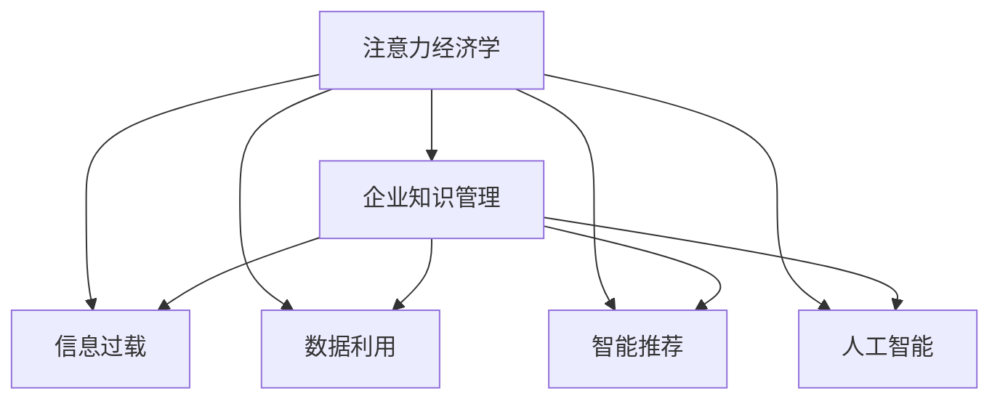

                 

# 注意力经济对企业知识管理的影响

> 关键词：注意力经济,知识管理,信息过载,数据利用,智能推荐,人工智能,深度学习

## 1. 背景介绍

### 1.1 问题由来
在现代社会，信息爆炸与注意力稀缺并存，企业和个人面临的信息过载问题日益严重。企业知识管理的核心目标是高效地收集、存储、整理和应用知识，但在信息过载的今天，如何从海量数据中快速筛选出有价值的信息，如何将知识高效转化为企业的战略价值，已成为企业知识管理中的首要挑战。

### 1.2 问题核心关键点
注意力经济（Economics of Attention）强调了注意力资源在信息时代中的重要性。在信息过载的环境中，企业需要有效地利用有限的注意力资源，才能在市场中脱颖而出。因此，将注意力经济学原理应用于企业知识管理中，是提升企业知识利用效率、优化决策过程的关键路径。

## 2. 核心概念与联系

### 2.1 核心概念概述

为更好地理解注意力经济对企业知识管理的影响，本节将介绍几个密切相关的核心概念：

- **注意力经济学**（Economics of Attention）：研究注意力作为一种稀缺资源在信息消费和生产中的分配和利用，强调了在信息爆炸时代，注意力资源的稀缺性和价值。

- **企业知识管理**（Enterprise Knowledge Management, EKM）：通过制度、技术等手段，系统化地收集、整理、存储和利用企业内部和外部知识，以提升企业创新能力、竞争力和运营效率。

- **信息过载**（Information Overload）：在信息技术发展迅速的背景下，信息量急剧增加，个人和企业难以处理所有信息，导致信息过载，影响决策和效率。

- **数据利用**（Data Utilization）：有效利用企业数据资源，通过分析、挖掘和应用数据，转化为企业的战略决策支持。

- **智能推荐**（Intelligent Recommendation）：利用机器学习、深度学习等技术，分析用户行为和偏好，提供个性化推荐，帮助用户快速找到有价值的信息。

- **人工智能**（Artificial Intelligence, AI）：模拟人类智能过程，通过算法和模型，实现智能决策、自动执行等功能，提升企业运营效率和竞争力。

这些核心概念之间的逻辑关系可以通过以下Mermaid流程图来展示：



这个流程图展示了几大核心概念的相互关系：

1. 注意力经济学为企业知识管理提供理论基础，指导企业如何有效利用有限的注意力资源。
2. 企业知识管理依赖于信息过载的数据利用和智能推荐，提升信息处理效率和决策质量。
3. 数据利用和智能推荐需要人工智能技术的支持，通过算法实现对数据的深度分析和挖掘。

这些概念共同构成了企业知识管理的理论框架，指导企业在信息过载的今天，如何高效地获取、整理和利用知识。

## 3. 核心算法原理 & 具体操作步骤
### 3.1 算法原理概述

注意力经济视角下的企业知识管理，旨在通过有限注意力的有效配置，提升企业对知识资源的利用效率。其核心算法原理包括：

- **注意力分配模型**：通过计算个体对信息的注意力分配，预测信息处理行为和效果。
- **知识推荐系统**：利用机器学习算法，分析用户历史行为，预测其对特定知识的兴趣和需求，提供个性化推荐。
- **知识图谱构建**：通过构建知识图谱，系统化地组织企业知识，方便知识查询和应用。

### 3.2 算法步骤详解

注意力经济视角下的企业知识管理主要包括以下关键步骤：

**Step 1: 数据采集与预处理**
- 收集企业内部和外部数据，如会议记录、文档、邮件、网页等。
- 清洗和预处理数据，去除噪声和冗余信息，保证数据质量。

**Step 2: 注意力分配与计算**
- 利用注意力分配模型，计算企业员工或管理者对各类信息的注意力分配。
- 分析注意力分配的趋势和模式，识别出关键信息源和重要知识领域。

**Step 3: 知识推荐与系统构建**
- 基于历史行为数据，使用推荐算法（如协同过滤、内容推荐等）生成知识推荐列表。
- 构建知识推荐系统，集成到企业知识管理系统（如企业内部Wiki、知识库等），方便用户快速获取所需知识。

**Step 4: 知识图谱构建与查询**
- 利用图谱构建工具（如Gephi、Neo4j等），将企业知识转化为图形结构，形成知识图谱。
- 开发图谱查询接口，支持企业用户通过关键词、关系等查询所需知识，提升知识获取效率。

**Step 5: 知识利用与反馈机制**
- 将推荐和图谱查询结果应用于企业决策支持、员工培训等场景。
- 根据知识利用效果，收集用户反馈，不断优化推荐算法和知识管理策略。

### 3.3 算法优缺点

注意力经济视角下的企业知识管理方法具有以下优点：
1. 提高知识利用效率：通过计算注意力分配，精准识别重要知识，提升信息处理效率。
2. 个性化推荐：基于用户行为数据，提供个性化推荐，满足用户多样化需求。
3. 知识结构化：利用知识图谱技术，系统化组织知识，方便查询和应用。
4. 动态优化：通过用户反馈不断优化推荐算法和知识管理策略，保持知识管理的动态适应性。

同时，该方法也存在一定的局限性：
1. 对数据质量依赖高：推荐和注意力分配模型的效果取决于数据的质量和数量。
2. 用户行为隐私问题：推荐算法依赖用户行为数据，可能涉及用户隐私。
3. 算法复杂度高：知识推荐和注意力分配模型需要复杂的算法和大规模计算，可能带来技术实现上的挑战。
4. 模型解释性不足：深度学习模型难以解释其决策过程，导致对知识推荐结果的信任度降低。

尽管存在这些局限性，但就目前而言，注意力经济视角下的知识管理方法仍是大数据时代提升企业知识利用效率的重要途径。未来相关研究的重点在于如何进一步降低算法对数据的质量和数量依赖，提升推荐模型的可解释性，确保知识管理的动态适应性和用户隐私安全。

### 3.4 算法应用领域

注意力经济视角下的企业知识管理方法已经在多个行业得到了广泛应用，例如：

- **金融行业**：通过计算投资经理对各类信息的注意力分配，生成投资建议，提高投资决策的精准性。
- **医疗行业**：利用医疗知识图谱和推荐系统，帮助医生快速查找相关文献和临床指南，提升诊疗效率。
- **零售行业**：通过分析消费者行为数据，推荐个性化商品，提升销售额和用户满意度。
- **教育行业**：构建教育知识图谱，提供个性化学习路径推荐，提升学习效果和教育质量。
- **政府部门**：利用政府公开数据，构建政策知识图谱，提升政策制定和执行的科学性和透明度。

除了上述这些经典应用外，注意力经济视角下的知识管理方法还在更多场景中得到了创新性地应用，如智能客服、智能运维、智能营销等，为企业带来全新的管理思路和价值。

## 4. 数学模型和公式 & 详细讲解  
### 4.1 数学模型构建

本节将使用数学语言对注意力经济视角下的企业知识管理进行更加严格的刻画。

假设企业员工集合为 $E$，信息集合为 $I$，注意力分配矩阵为 $A \in \mathbb{R}^{N \times M}$，其中 $N$ 为员工数量，$M$ 为信息数量。企业员工对信息的注意力分配表示为 $A_{ij}$，$A_{ij} \in [0,1]$，表示员工 $i$ 对信息 $j$ 的注意力程度。

定义企业知识管理系统的知识推荐模型为 $K(A)$，其中 $K$ 为推荐算法，$A$ 为注意力分配矩阵。知识推荐的目标是最小化用户未被推荐知识的不满意度，即：

$$
\min_{K} \sum_{i=1}^N \sum_{j=1}^M \rho(A_{ij},K(A_{ij}))
$$

其中 $\rho$ 为用户对未被推荐知识的满意度函数，$K$ 为用户对推荐知识的满意度函数。

知识推荐模型的损失函数为：

$$
\mathcal{L}(K) = \frac{1}{N} \sum_{i=1}^N \frac{1}{M} \sum_{j=1}^M \rho(A_{ij},K(A_{ij}))
$$

通过梯度下降等优化算法，最小化损失函数 $\mathcal{L}(K)$，得到最优推荐算法 $K^*$。

### 4.2 公式推导过程

以下我们以协同过滤推荐算法为例，推导推荐模型的优化过程。

假设 $K$ 为协同过滤推荐算法，则推荐结果 $R_{ij}$ 为：

$$
R_{ij} = \alpha_{ij} \cdot \frac{1}{\sqrt{1+\sum_{k=1}^M (A_{ik} \cdot A_{jk})} \cdot \sum_{k=1}^M A_{ik} \cdot Y_{jk}
$$

其中 $\alpha_{ij}$ 为归一化因子，$Y_{jk}$ 为信息 $j$ 的评分向量。

推荐模型的损失函数为：

$$
\mathcal{L}(K) = \frac{1}{N} \sum_{i=1}^N \frac{1}{M} \sum_{j=1}^M \rho(A_{ij},R_{ij})
$$

为了简化推导，假设 $\rho$ 为均方误差，则推荐模型的损失函数为：

$$
\mathcal{L}(K) = \frac{1}{N} \sum_{i=1}^N \frac{1}{M} \sum_{j=1}^M (A_{ij} - R_{ij})^2
$$

通过梯度下降算法，最小化损失函数 $\mathcal{L}(K)$，得到最优推荐算法 $K^*$。

$$
\frac{\partial \mathcal{L}(K)}{\partial \alpha_{ij}} = 2\frac{A_{ij} - R_{ij}}{1+\sum_{k=1}^M (A_{ik} \cdot A_{jk})}
$$

### 4.3 案例分析与讲解

假设某金融公司希望提升投资决策的精准性，通过计算投资经理对各类信息的注意力分配，生成个性化投资建议。

具体步骤如下：

**Step 1: 数据采集与预处理**
- 收集历史投资记录和市场数据，去除噪声和冗余信息，清洗数据集。
- 利用自然语言处理技术，提取新闻、公告等关键信息，生成结构化数据。

**Step 2: 注意力分配与计算**
- 计算每位投资经理对各类新闻、公告、市场数据的注意力分配，生成注意力矩阵 $A$。
- 分析注意力分配趋势，识别出关键信息源和重要知识领域。

**Step 3: 知识推荐与系统构建**
- 基于历史行为数据，使用协同过滤推荐算法，生成个性化投资建议。
- 将推荐系统集成到企业内部投资管理系统，方便投资经理快速获取所需信息。

**Step 4: 知识利用与反馈机制**
- 根据投资建议的实施效果，收集投资经理反馈，优化推荐算法。
- 利用知识图谱技术，构建投资知识图谱，提升知识管理效率和决策支持。

## 5. 项目实践：代码实例和详细解释说明
### 5.1 开发环境搭建

在进行知识管理系统的开发实践前，我们需要准备好开发环境。以下是使用Python进行PyTorch开发的环境配置流程：

1. 安装Anaconda：从官网下载并安装Anaconda，用于创建独立的Python环境。

2. 创建并激活虚拟环境：
```bash
conda create -n pytorch-env python=3.8 
conda activate pytorch-env
```

3. 安装PyTorch：根据CUDA版本，从官网获取对应的安装命令。例如：
```bash
conda install pytorch torchvision torchaudio cudatoolkit=11.1 -c pytorch -c conda-forge
```

4. 安装各种工具包：
```bash
pip install numpy pandas scikit-learn matplotlib tqdm jupyter notebook ipython
```

完成上述步骤后，即可在`pytorch-env`环境中开始项目实践。

### 5.2 源代码详细实现

下面以金融行业为例，给出使用PyTorch和TensorFlow进行知识推荐系统的代码实现。

首先，定义注意力分配模型：

```python
import torch
import torch.nn as nn
import torch.nn.functional as F

class Attention(nn.Module):
    def __init__(self, input_dim, hidden_dim):
        super(Attention, self).__init__()
        self.W1 = nn.Linear(input_dim, hidden_dim)
        self.W2 = nn.Linear(input_dim, hidden_dim)
        self.V = nn.Linear(hidden_dim, 1)
        
    def forward(self, X, mask):
        X1 = F.relu(self.W1(X))
        X2 = F.relu(self.W2(X))
        Y = self.V(X2)
        Y = Y.view(-1, 1)
        attention = Y * X1.unsqueeze(2)
        attention = attention / (Y + 1e-8).sqrt()
        attention = attention * mask.unsqueeze(1)
        attention = torch.softmax(attention.sum(1), dim=1)
        return attention
```

然后，定义协同过滤推荐算法：

```python
class CollaborativeFiltering(nn.Module):
    def __init__(self, user_num, item_num):
        super(CollaborativeFiltering, self).__init__()
        self.user_num = user_num
        self.item_num = item_num
        self.W1 = nn.Linear(1, item_num)
        self.W2 = nn.Linear(item_num, 1)
        
    def forward(self, user, item):
        X = F.relu(self.W1(item))
        Y = F.relu(self.W2(item))
        X = X.unsqueeze(1)
        Z = Y * X
        Z = Z.sum(1)
        Z = Z + F.relu(self.W2(item))
        return Z
```

接着，定义优化器和损失函数：

```python
optimizer = torch.optim.Adam(model.parameters(), lr=0.001)
criterion = nn.MSELoss()
```

最后，定义训练和评估函数：

```python
def train(model, train_loader, optimizer, criterion):
    model.train()
    for batch_id, (user, item) in enumerate(train_loader):
        optimizer.zero_grad()
        Z = model(user, item)
        loss = criterion(Z, Y)
        loss.backward()
        optimizer.step()
        if batch_id % 100 == 0:
            print(f'Epoch {epoch + 1}, Batch {batch_id + 1}, Loss: {loss:.4f}')

def evaluate(model, test_loader, criterion):
    model.eval()
    total_loss = 0
    for user, item in test_loader:
        Z = model(user, item)
        loss = criterion(Z, Y)
        total_loss += loss.item()
    return total_loss / len(test_loader)
```

完成上述代码后，即可进行模型训练和评估。

### 5.3 代码解读与分析

让我们再详细解读一下关键代码的实现细节：

**Attention类**：
- `__init__`方法：初始化线性变换层，用于计算注意力权重。
- `forward`方法：计算注意力权重，并根据权重进行加权求和，得到注意力分配结果。

**CollaborativeFiltering类**：
- `__init__`方法：初始化线性变换层，用于协同过滤推荐。
- `forward`方法：计算协同过滤推荐结果，并返回最终评分。

**train函数**：
- 在训练阶段，使用Adam优化器进行梯度下降，最小化均方误差损失函数。
- 在每个epoch结束后，打印出平均损失值。

**evaluate函数**：
- 在评估阶段，计算测试集的平均损失值，用于评估模型的性能。

## 6. 实际应用场景
### 6.1 智能客服系统

智能客服系统通过知识管理技术，提升客户服务质量和效率。在智能客服系统中，企业需要大量客户咨询记录和常见问题，通过注意力分配和知识推荐，生成个性化回答，提升客户满意度。

具体而言，智能客服系统可以自动提取客户咨询记录中的关键信息，计算不同客服对各类信息的注意力分配，生成个性化问答方案，帮助客服快速响应客户需求。通过知识图谱技术，系统还可以动态更新问答知识库，提升服务效果。

### 6.2 医疗诊断系统

医疗诊断系统通过知识管理技术，提高医疗诊断的准确性和效率。在医疗诊断系统中，医生需要大量医学文献和临床指南，通过注意力分配和知识推荐，快速获取相关知识，提高诊断精准性。

具体而言，医疗诊断系统可以自动提取病历中的关键信息，计算医生对各类医学文献和指南的注意力分配，生成个性化诊疗方案，帮助医生快速做出诊断决策。通过知识图谱技术，系统还可以构建疾病知识图谱，提升诊疗效果和研究质量。

### 6.3 教育培训系统

教育培训系统通过知识管理技术，提升教学质量和学生学习效果。在教育培训系统中，教师需要大量教学资源和学生学习记录，通过注意力分配和知识推荐，生成个性化教学方案，提升教学效果。

具体而言，教育培训系统可以自动提取学生学习记录中的关键信息，计算教师对各类教学资源的注意力分配，生成个性化教学方案，帮助教师快速设计教学内容。通过知识图谱技术，系统还可以构建教育知识图谱，提升教学效果和学习效率。

### 6.4 未来应用展望

随着知识管理技术的不断发展，基于注意力经济的知识管理系统将在更多领域得到应用，为企业带来全新的管理思路和价值。

在智慧医疗领域，基于知识管理的医疗诊断系统能够快速获取相关知识，提高诊断精准性，辅助医生进行精准医疗。

在智能教育领域，基于知识管理的教育培训系统能够快速生成个性化教学方案，提升教学效果和学生学习效率。

在智能运维领域，基于知识管理的运维系统能够快速获取相关知识，提高运维效率，降低故障发生率。

此外，在金融、零售、政府等多个领域，基于知识管理的系统也在不断涌现，推动各行业数字化转型，提升企业运营效率和竞争力。

## 7. 工具和资源推荐
### 7.1 学习资源推荐

为了帮助开发者系统掌握知识管理技术的理论基础和实践技巧，这里推荐一些优质的学习资源：

1. 《知识管理的实践与挑战》系列博文：由知识管理领域专家撰写，深入浅出地介绍了知识管理的基本概念、应用场景和挑战。

2. 《人工智能与知识管理》课程：斯坦福大学开设的跨学科课程，结合人工智能和知识管理技术，介绍企业知识管理的基本框架和方法。

3. 《知识图谱与推荐系统》书籍：深度学习领域的经典书籍，全面介绍了知识图谱和推荐系统的原理、算法和应用。

4. HuggingFace官方文档：Transformer库的官方文档，提供了海量预训练模型和完整的知识推荐样例代码，是上手实践的必备资料。

5. AI For Everyone：斯坦福大学的入门级在线课程，涵盖人工智能的基本概念和应用，适合零基础学习者。

通过对这些资源的学习实践，相信你一定能够快速掌握知识管理的精髓，并用于解决实际的业务问题。

### 7.2 开发工具推荐

高效的开发离不开优秀的工具支持。以下是几款用于知识管理开发常用的工具：

1. Python：简单易学的编程语言，拥有丰富的第三方库和工具支持，适合快速迭代研究。

2. PyTorch：基于Python的开源深度学习框架，灵活动态的计算图，适合快速迭代研究。

3. TensorFlow：由Google主导开发的开源深度学习框架，生产部署方便，适合大规模工程应用。

4. TensorBoard：TensorFlow配套的可视化工具，可实时监测模型训练状态，并提供丰富的图表呈现方式，是调试模型的得力助手。

5. Weights & Biases：模型训练的实验跟踪工具，可以记录和可视化模型训练过程中的各项指标，方便对比和调优。

6. Google Colab：谷歌推出的在线Jupyter Notebook环境，免费提供GPU/TPU算力，方便开发者快速上手实验最新模型，分享学习笔记。

合理利用这些工具，可以显著提升知识管理任务的开发效率，加快创新迭代的步伐。

### 7.3 相关论文推荐

知识管理技术的发展源于学界的持续研究。以下是几篇奠基性的相关论文，推荐阅读：

1. *Knowledge Acquisition, Organization, and Management: Bridging the Gap Between Knowledge Discovery and Knowledge*：哈佛大学的研究团队在知识管理领域的奠基性论文，系统介绍了知识管理的概念框架和方法。

2. *Knowledge Graph Embeddings and Recommender Systems*：知识图谱和推荐系统的经典论文，介绍了知识图谱嵌入和推荐算法的原理和实现。

3. *Attention Is All You Need*：Transformer模型的原论文，提出了自注意力机制，推动了自然语言处理领域的发展。

4. *Collaborative Filtering for Implicit Feedback Datasets*：协同过滤推荐算法的经典论文，介绍了协同过滤算法的原理和实现。

5. *Economics of Attention in Information Systems*：注意力经济视角下的信息系统的经典论文，探讨了信息系统中注意力资源的重要性和分配机制。

这些论文代表了大规模知识管理技术的发展脉络。通过学习这些前沿成果，可以帮助研究者把握学科前进方向，激发更多的创新灵感。

## 8. 总结：未来发展趋势与挑战

### 8.1 总结

本文对注意力经济视角下的企业知识管理进行了全面系统的介绍。首先阐述了注意力经济学和知识管理的理论基础，明确了在信息过载时代，如何有效利用有限的注意力资源，提升企业知识利用效率。其次，从原理到实践，详细讲解了注意力分配和知识推荐的数学模型和关键步骤，给出了知识管理系统开发的完整代码实例。同时，本文还广泛探讨了知识管理系统在多个行业领域的应用前景，展示了注意力经济视角下的知识管理方法的广泛应用。

通过本文的系统梳理，可以看到，注意力经济视角下的企业知识管理技术正在成为信息时代提升企业知识利用效率的重要途径。这些理论和技术的应用，不仅能帮助企业更好地理解和整合各类知识资源，还能推动企业在数字化转型过程中取得更大的突破。未来，随着知识管理技术的不断演进，基于注意力经济的知识管理系统必将在更多领域得到应用，为企业带来全新的管理思路和价值。

### 8.2 未来发展趋势

展望未来，注意力经济视角下的企业知识管理技术将呈现以下几个发展趋势：

1. 技术日趋成熟。随着深度学习、自然语言处理等技术的不断发展，知识管理系统的智能化水平将不断提高，能够更好地理解和整合各类知识资源。

2. 应用场景不断拓展。在医疗、教育、金融等垂直领域，基于知识管理的系统将进一步深化应用，提升各行业数字化转型水平。

3. 系统智能化水平提升。未来知识管理系统将更多地应用人工智能技术，通过深度学习、知识图谱等技术，实现更高效、更智能的知识管理。

4. 模型可解释性增强。未来的知识管理系统将更加注重模型的可解释性，增强用户对推荐结果的信任度，提升系统的透明度和可信度。

5. 跨领域融合。未来的知识管理系统将更多地与外部知识库、规则库等专家知识结合，形成更加全面、准确的信息整合能力。

6. 多模态融合。未来的知识管理系统将更多地应用多模态信息融合技术，提升对视觉、语音、文本等多种数据类型的处理能力。

这些趋势凸显了知识管理技术的广阔前景，推动企业在数字化转型过程中取得更大的突破。

### 8.3 面临的挑战

尽管知识管理技术已经取得了瞩目成就，但在迈向更加智能化、普适化应用的过程中，它仍面临诸多挑战：

1. 数据质量问题。知识管理系统依赖高质量的数据，如何有效清洗和预处理数据，去除噪声和冗余信息，是提升知识管理效果的关键。

2. 系统复杂度高。知识管理系统需要处理多种数据类型和复杂算法，技术实现难度较大，需要多方协作和持续优化。

3. 用户隐私问题。知识管理系统需要大量用户行为数据，如何保护用户隐私，防止数据泄露，是必须解决的重要问题。

4. 模型可解释性不足。深度学习模型难以解释其决策过程，导致对推荐结果的信任度降低，需要增强模型的可解释性。

5. 跨领域融合难度大。不同领域的知识管理系统需要具备跨领域融合能力，如何实现跨领域的知识整合和应用，是未来知识管理系统的难点。

尽管存在这些挑战，但随着知识管理技术的不断演进，这些挑战终将一一被克服，知识管理系统必将在构建智能企业中发挥越来越重要的作用。

### 8.4 研究展望

未来，针对知识管理技术的研究，可以从以下几个方向进行探索：

1. 探索高效数据清洗和预处理方法，提升数据质量。

2. 开发更高效、更智能的知识管理系统，提升系统的智能化水平和可解释性。

3. 加强跨领域知识融合技术的研究，推动知识管理系统在更多领域的深度应用。

4. 应用多模态信息融合技术，提升知识管理系统对多种数据类型的处理能力。

5. 引入更多先验知识，提升知识管理系统的知识整合能力。

6. 增强系统动态适应性，实现知识管理系统的持续优化和升级。

这些研究方向将推动知识管理技术的不断演进，提升企业在数字化转型过程中的智能化水平和竞争力。相信通过持续的努力，知识管理技术必将在构建智能企业中发挥越来越重要的作用。

## 9. 附录：常见问题与解答

**Q1：知识管理系统如何获取高质量数据？**

A: 知识管理系统的数据质量是系统的基础，获取高质量数据是知识管理系统的关键。具体措施包括：
1. 数据清洗：通过数据清洗技术，去除噪声和冗余信息，保证数据质量。
2. 数据预处理：利用数据预处理技术，进行格式转换、归一化等操作，提升数据可用性。
3. 数据采集：通过爬虫、API接口等方式，自动采集高质量数据。

**Q2：知识管理系统如何保护用户隐私？**

A: 知识管理系统需要大量用户行为数据，保护用户隐私是系统建设的重要考虑。具体措施包括：
1. 数据匿名化：在数据采集和处理过程中，对敏感信息进行匿名化处理，防止数据泄露。
2. 数据加密：采用数据加密技术，防止数据在传输和存储过程中被窃取。
3. 数据访问控制：对数据访问进行严格控制，确保只有授权人员可以访问敏感数据。

**Q3：知识管理系统如何提高系统可解释性？**

A: 知识管理系统需要用户对推荐结果有高度信任度，提高系统可解释性是关键。具体措施包括：
1. 算法优化：通过优化算法，提高推荐结果的可解释性。
2. 数据可视化：利用数据可视化技术，展示推荐结果的计算过程和原因。
3. 用户反馈：通过用户反馈，不断优化推荐算法和系统性能。

**Q4：知识管理系统如何实现跨领域融合？**

A: 知识管理系统需要具备跨领域融合能力，推动知识管理系统的广泛应用。具体措施包括：
1. 领域知识图谱：构建不同领域的知识图谱，实现跨领域知识整合。
2. 多模态融合：应用多模态信息融合技术，提升对多种数据类型的处理能力。
3. 跨领域算法：开发跨领域推荐算法，实现跨领域知识推荐。

通过以上措施，知识管理系统将具备更加全面、准确的信息整合能力，提升系统的智能化水平和可解释性，推动知识管理系统的广泛应用。

---

作者：禅与计算机程序设计艺术 / Zen and the Art of Computer Programming

