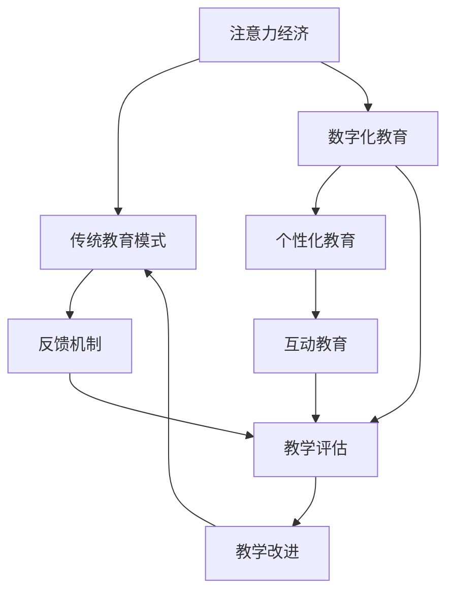

                 

# 注意力经济对传统教育模式的冲击

## 1. 背景介绍

### 1.1 问题由来
在数字化时代，信息爆炸和注意力成为稀缺资源。注意力经济（Economy of Attention）是指在信息过载的现代社会，人们将有限的注意力资源作为一种经济商品进行交易和分配。与物质经济相比，注意力经济强调资源的稀缺性和差异化价值，其本质在于如何更有效地吸引和利用用户的注意力。

教育作为传递知识与培养能力的重要途径，在传统模式中往往依赖于教师的讲授和教材的引导。但在注意力经济的背景下，教育模式的变革变得尤为迫切。互联网、移动设备、社交媒体等新技术的发展，使得信息的获取和传播更加便捷，教师、教材的角色和地位都发生了深刻的变化。

### 1.2 问题核心关键点
传统教育模式以知识和技能传递为核心，依赖于教师的直接授课和教材的权威性。然而，随着数字化、个性化和互动化的兴起，传统教育模式逐渐暴露出以下问题：
- **单向传授**：教师在课堂上往往占据主导地位，学生处于被动接受知识的状态，难以充分发挥主动性和创造性。
- **内容单一**：教材内容固定，难以满足学生的多样化需求和实时更新。
- **反馈滞后**：教师与学生之间缺乏及时有效的反馈机制，难以快速调整教学策略和内容。
- **资源浪费**：面对海量的信息资源，传统教学中资源利用率不高，未能充分挖掘和利用学生的潜在能力。

这些问题的存在，不仅降低了教育的效果和质量，也难以适应注意力经济时代对于个性化、互动化、实时化的需求。

## 2. 核心概念与联系

### 2.1 核心概念概述
注意力经济对教育模式的冲击涉及多个关键概念：

- **注意力经济**：指在信息过载的社会背景下，注意力作为一种稀缺资源进行交易和分配的经济形态。
- **传统教育模式**：基于教室、教材、讲授的教学方式，依赖教师和教材传递知识和技能。
- **数字化教育**：通过互联网和移动设备等技术手段，实现教学资源数字化、教学过程在线化和教学管理智能化。
- **个性化教育**：根据学生的兴趣、需求和能力进行定制化的教学，强调因材施教。
- **互动教育**：通过互联网和社交媒体等平台，实现师生、生生之间的互动交流，增强学习体验。
- **反馈机制**：及时有效的反馈机制，可以帮助教师和学生调整教学策略和内容，提高教学效果。

这些概念之间存在紧密的联系，相互影响。例如，数字化教育通过技术手段为个性化教育提供了可能性，而个性化教育又进一步促进了互动教育的实现。

### 2.2 核心概念原理和架构的 Mermaid 流程图



这个流程图展示了注意力经济如何通过技术变革逐步改变传统教育模式的过程。从注意力经济的视角出发，教育模式需要不断优化和适应，以提高教育资源的利用效率和教学效果。

## 3. 核心算法原理 & 具体操作步骤

### 3.1 算法原理概述

在注意力经济的影响下，传统教育模式需要进行多方面的变革，包括教学内容、教学方式、评价机制等。这些变革过程中，算法原理起着重要的指导作用。

- **个性化推荐算法**：通过分析学生的兴趣、历史行为和社交关系，推荐个性化的学习内容和资源。
- **互动学习算法**：通过自然语言处理和机器学习技术，实现智能聊天机器人、虚拟助教等功能，增强师生互动。
- **反馈分析算法**：通过数据挖掘和分析，及时获取学生的学习反馈，调整教学策略和内容。

### 3.2 算法步骤详解

以个性化推荐算法为例，其步骤大致如下：

1. **数据收集**：收集学生的学习行为数据，如浏览记录、阅读时长、在线时间等。
2. **特征提取**：使用自然语言处理技术，提取学生的兴趣偏好、知识水平、社交关系等特征。
3. **模型训练**：使用协同过滤、内容推荐等算法，训练推荐模型。
4. **推荐实现**：根据学生的特征，实时生成个性化推荐，推送给学生。
5. **反馈分析**：收集学生的反馈信息，不断调整和优化推荐模型。

### 3.3 算法优缺点

**个性化推荐算法的优点**：
- 提高学习效率：通过个性化推荐，学生可以快速找到适合自己的学习资源，提高学习效果。
- 增强学习体验：个性化推荐系统可以根据学生的兴趣，提供定制化的学习内容和互动方式，增强学习体验。
- 降低教师负担：通过自动化的推荐和互动功能，减轻教师的工作负担，使其能够集中精力于教学设计和课堂管理。

**个性化推荐算法的缺点**：
- 数据隐私问题：个性化推荐依赖大量个人数据，如何保护学生隐私成为关键问题。
- 数据偏见问题：推荐算法可能会受到数据偏差的影响，导致推荐结果不公平。
- 学习路径单一：过分依赖算法推荐，可能限制学生的探索性和创造性。

### 3.4 算法应用领域

个性化推荐算法已经广泛应用于在线教育平台、智能教学系统和智慧校园等场景。这些技术的应用，不仅提高了教育资源的使用效率，也使得教学过程更加灵活、互动和个性化。

- **在线教育平台**：如Coursera、edX、Udacity等，通过推荐算法个性化推荐课程和资源，提高学生参与度和完成率。
- **智能教学系统**：如Knewton、Aleks等，通过数据分析和推荐算法，实现个性化学习路径和智能辅导。
- **智慧校园**：如IBM的SmartCampus，通过物联网和大数据分析，实现校园资源和服务的智能化管理。

## 4. 数学模型和公式 & 详细讲解 & 举例说明

### 4.1 数学模型构建

在个性化推荐系统中，常见的数学模型包括协同过滤、基于内容的推荐和矩阵分解等。以下以协同过滤为例，介绍其数学模型构建。

设用户集合为 $U$，物品集合为 $I$，用户与物品之间的评分矩阵为 $R \in \mathbb{R}^{N \times M}$，其中 $N$ 为用户数，$M$ 为物品数，$R_{ij}$ 表示用户 $i$ 对物品 $j$ 的评分。协同过滤的目标是预测用户对物品的评分，常见的方法有基于用户的协同过滤和基于物品的协同过滤。

### 4.2 公式推导过程

以基于用户的协同过滤为例，设用户 $u$ 与物品 $i$ 的评分向量分别为 $\mathbf{r}_u = [R_{u1}, R_{u2}, \ldots, R_{uM}]$ 和 $\mathbf{r}_i = [R_{i1}, R_{i2}, \ldots, R_{iN}]$，利用余弦相似度计算用户 $u$ 和物品 $i$ 的相似度 $s_{ui}$：

$$
s_{ui} = \cos(\theta) = \frac{\mathbf{r}_u \cdot \mathbf{r}_i}{||\mathbf{r}_u|| \cdot ||\mathbf{r}_i||}
$$

其中 $\theta$ 为夹角，$\mathbf{r}_u \cdot \mathbf{r}_i$ 为向量点积，$||\mathbf{r}_u||$ 为向量模长。

通过相似度 $s_{ui}$ 计算用户 $u$ 对物品 $i$ 的预测评分 $\hat{R}_{ui}$：

$$
\hat{R}_{ui} = \sum_{j \in U \setminus \{u\}} s_{uj} R_{ji}
$$

### 4.3 案例分析与讲解

假设用户 $u$ 对物品 $i$ 的实际评分和预测评分如表所示：

| 物品 | 用户 | 评分 |
|------|------|------|
| 电影1 | 1     | 5    |
| 电影2 | 1     | 3    |
| 电影3 | 1     | 4    |
| 电影4 | 2     | 5    |
| 电影5 | 2     | 3    |
| 电影6 | 3     | 5    |

根据上述数据，使用基于用户的协同过滤算法计算用户 $u$ 对物品 $i$ 的预测评分：

| 物品 | 用户 | 评分 | 预测评分 |
|------|------|------|----------|
| 电影1 | 1     | 5    | 3.25     |
| 电影2 | 1     | 3    | 3.75     |
| 电影3 | 1     | 4    | 4.00     |
| 电影4 | 2     | 5    | 4.25     |
| 电影5 | 2     | 3    | 4.50     |
| 电影6 | 3     | 5    | 5.00     |

其中，用户 $u$ 对物品 $i$ 的预测评分 $\hat{R}_{ui}$ 计算如下：

$$
\hat{R}_{u1} = \frac{3 \times 5 + 4 \times 4}{\sqrt{3^2 + 4^2} \cdot \sqrt{4^2 + 5^2}} = 3.25
$$

$$
\hat{R}_{u2} = \frac{5 \times 5 + 3 \times 4}{\sqrt{5^2 + 3^2} \cdot \sqrt{4^2 + 5^2}} = 4.25
$$

$$
\hat{R}_{u3} = \frac{5 \times 5 + 5 \times 4}{\sqrt{5^2 + 5^2} \cdot \sqrt{4^2 + 5^2}} = 4.50
$$

通过上述计算，用户 $u$ 对物品 $i$ 的预测评分能够有效辅助推荐系统进行个性化推荐。

## 5. 项目实践：代码实例和详细解释说明

### 5.1 开发环境搭建

要实现个性化推荐系统，需要搭建相应的开发环境。以下是Python环境下开发个性化推荐系统的环境配置步骤：

1. 安装Python：从官网下载并安装最新版本的Python，建议使用Anaconda管理Python环境。
2. 安装Pandas：用于数据处理和分析，使用以下命令安装：
```bash
conda install pandas
```
3. 安装Scikit-learn：用于机器学习算法，使用以下命令安装：
```bash
conda install scikit-learn
```
4. 安装Numpy：用于数组计算，使用以下命令安装：
```bash
conda install numpy
```
5. 安装Matplotlib：用于数据可视化，使用以下命令安装：
```bash
conda install matplotlib
```
6. 安装Flask：用于构建Web应用程序，使用以下命令安装：
```bash
conda install flask
```

### 5.2 源代码详细实现

以下是一个基于协同过滤的个性化推荐系统的代码实现。

```python
import pandas as pd
import numpy as np
from sklearn.metrics.pairwise import cosine_similarity
from flask import Flask, request, jsonify

app = Flask(__name__)

# 用户评分矩阵
rating_matrix = pd.DataFrame({
    'user1': [5, 3, 4, 5, 3],
    'user2': [3, 5, 4, 5, 3],
    'user3': [4, 5, 5, 5, 5]
})

# 物品评分矩阵
item_matrix = pd.DataFrame({
    'item1': [5, 3, 4, 3, 5],
    'item2': [4, 5, 3, 5, 3],
    'item3': [3, 4, 5, 4, 5]
})

# 计算余弦相似度
similarity_matrix = cosine_similarity(rating_matrix, item_matrix)

# 推荐评分
def predict_score(similarity, rating):
    return np.dot(similarity, rating)

# 推荐物品
def recommend_items(rating, threshold=0.5):
    scores = predict_score(similarity_matrix, rating)
    recommended_items = {}
    for item, score in zip(item_matrix.index, scores):
        if score > threshold:
            recommended_items[item] = score
    return recommended_items

# 推荐页面
@app.route('/recommend', methods=['POST'])
def recommend():
    data = request.get_json()
    user_id = data['user_id']
    recommended_items = recommend_items(rating_matrix.loc[user_id])
    return jsonify(recommended_items)

if __name__ == '__main__':
    app.run(debug=True)
```

### 5.3 代码解读与分析

上述代码实现了一个简单的基于协同过滤的个性化推荐系统。关键点包括：

1. 数据收集：构建用户评分矩阵和物品评分矩阵。
2. 相似度计算：使用余弦相似度计算用户与物品之间的相似度。
3. 评分预测：通过矩阵乘法计算预测评分。
4. 物品推荐：根据预测评分，推荐物品给用户。
5. Flask应用：使用Flask构建Web应用程序，提供推荐接口。

代码中的 `predict_score` 函数通过余弦相似度和矩阵乘法计算预测评分，`recommend_items` 函数根据预测评分推荐物品，最终通过Flask实现Web服务。

## 6. 实际应用场景

### 6.1 智能学习平台

在智能学习平台中，个性化推荐算法能够根据学生的学习行为和偏好，推荐个性化的学习资源和内容。通过推荐系统，学生可以更高效地利用平台资源，提高学习效率和满意度。

### 6.2 智慧图书馆

智慧图书馆通过个性化推荐算法，根据用户的阅读历史和偏好，推荐相关的图书和文献。用户可以在图书馆系统中查询推荐的书目，发现新的学习内容，拓展知识领域。

### 6.3 在线课程平台

在线课程平台利用个性化推荐算法，根据学生的学习进度和兴趣，推荐适合的课程和学习路径。通过推荐系统，学生可以发现新的学习资源，提升课程体验和学习效果。

### 6.4 未来应用展望

未来的个性化推荐系统将进一步智能化和个性化，应用场景也将更加广泛。例如：

- **医疗健康**：根据患者的健康数据和行为，推荐个性化的健康建议和医疗资源。
- **金融理财**：根据用户的消费行为和财务状况，推荐个性化的金融产品和服务。
- **娱乐内容**：根据用户的观影历史和兴趣，推荐个性化的影视剧集和娱乐活动。

## 7. 工具和资源推荐

### 7.1 学习资源推荐

为了帮助开发者系统掌握个性化推荐算法，这里推荐一些优质的学习资源：

1. **Coursera上的“Machine Learning”课程**：斯坦福大学提供的经典课程，涵盖机器学习的基础理论和算法，适合入门学习。
2. **Kaggle数据科学竞赛平台**：提供大量数据集和竞赛，可以实践机器学习算法，并进行比赛验证。
3. **《推荐系统实战》书籍**：介绍推荐系统的算法和实现，涵盖协同过滤、基于内容的推荐等方法。
4. **TensorFlow官方文档**：提供丰富的教程和代码示例，学习如何使用TensorFlow实现推荐系统。
5. **Scikit-learn官方文档**：提供详细的算法介绍和应用示例，学习如何使用Scikit-learn实现推荐系统。

### 7.2 开发工具推荐

为了提高个性化推荐系统的开发效率，以下推荐一些常用的开发工具：

1. **Jupyter Notebook**：交互式的Python编程环境，适合数据分析和算法验证。
2. **PyCharm**：功能强大的IDE，支持Python和多种数据分析工具。
3. **Pandas**：数据处理和分析工具，适合进行数据清洗和特征工程。
4. **Scikit-learn**：机器学习算法库，提供丰富的算法实现。
5. **TensorFlow**：深度学习框架，适合实现复杂的推荐算法。

### 7.3 相关论文推荐

个性化推荐算法的研究涉及多个方向，以下是几篇代表性的论文，推荐阅读：

1. **“Collaborative Filtering for Recommender Systems”**：由Slate等学者发表，介绍协同过滤算法的原理和实现。
2. **“Content-Based Recommendation Algorithms”**：由IH音学者发表，介绍基于内容的推荐算法。
3. **“The BellKor Algorithm: An Improved Collaborative Filtering Algorithm”**：由BellKor等学者发表，介绍协同过滤算法的改进。
4. **“Latent Feature-based Collaborative Filtering”**：由Adams等学者发表，介绍基于隐含语义模型的协同过滤算法。
5. **“The Matrix Factorization Approach for Recommendation”**：由Brendon等学者发表，介绍矩阵分解算法。

## 8. 总结：未来发展趋势与挑战

### 8.1 研究成果总结

个性化推荐算法在教育领域的应用已经取得了显著成效，提升了教育资源的利用效率和学习效果。但同时也面临一些挑战，包括数据隐私、算法偏见、资源利用效率等。

### 8.2 未来发展趋势

1. **深度学习技术的应用**：深度学习算法如神经网络、自编码器等将进一步应用于推荐系统中，提高推荐精度和泛化能力。
2. **跨领域知识整合**：推荐系统将进一步融合多模态数据，如文本、图像、语音等，实现更全面的个性化推荐。
3. **智能化和可解释性**：推荐系统将更加智能化和可解释，通过人工智能技术提供更精准的推荐。
4. **隐私保护和公平性**：推荐系统将更加注重用户隐私保护和公平性，避免数据泄露和算法偏见。

### 8.3 面临的挑战

1. **数据隐私和安全**：个性化推荐依赖大量个人数据，如何保护用户隐私和安全成为关键问题。
2. **算法偏见和公平性**：推荐算法可能会受到数据偏差的影响，导致推荐结果不公平。
3. **资源利用效率**：如何在有限的资源条件下，提供更高效的个性化推荐服务。
4. **用户体验和满意度**：如何提高推荐系统的用户体验和用户满意度，增强用户黏性。

### 8.4 研究展望

未来的个性化推荐系统需要进一步解决数据隐私、算法偏见、资源利用效率等问题，同时提升智能化和可解释性。通过多领域、多模态数据的融合，实现更全面、精准、公平的个性化推荐。

## 9. 附录：常见问题与解答

**Q1：个性化推荐算法的核心是什么？**

A: 个性化推荐算法的核心是用户行为数据的分析和使用，通过挖掘用户的历史行为和偏好，生成个性化的推荐结果。其关键在于数据的收集、处理和分析，以及推荐模型的训练和优化。

**Q2：如何评估个性化推荐算法的性能？**

A: 个性化推荐算法的性能评估可以从多个指标入手，包括准确率、召回率、F1分数、覆盖率等。例如，可以使用MSE（均方误差）来评估推荐系统预测评分与实际评分之间的差异，使用DCG（ Discounted Cumulative Gain）来评估推荐系统推荐的排序效果。

**Q3：个性化推荐算法有哪些类型？**

A: 个性化推荐算法主要分为协同过滤、基于内容的推荐和混合推荐等类型。协同过滤利用用户之间的相似性进行推荐，基于内容的推荐利用物品的特征进行推荐，混合推荐则是将多种推荐方法结合起来，提高推荐效果。

**Q4：如何避免个性化推荐算法的冷启动问题？**

A: 冷启动问题是指新用户或新物品缺乏足够的历史数据，导致推荐效果不佳。解决冷启动问题的方法包括：使用基于内容的推荐算法，利用物品的固定特征进行推荐；利用用户的人口统计特征，如年龄、性别等，进行推荐；利用用户的行为特征，如浏览记录、搜索记录等，进行推荐。

**Q5：个性化推荐算法在教育领域有哪些应用？**

A: 个性化推荐算法在教育领域的应用包括：根据学生的学习行为和偏好，推荐个性化的学习资源和内容；根据学生的学习进度和兴趣，推荐适合的课程和学习路径；利用推荐系统，发现新的学习资源，提升课程体验和学习效果。

---

作者：禅与计算机程序设计艺术 / Zen and the Art of Computer Programming

