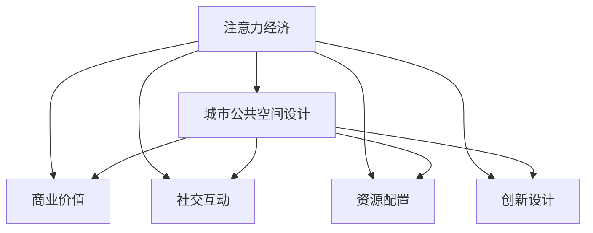

                 

# 注意力经济对城市公共空间设计的影响

## 1. 背景介绍

### 1.1 问题由来

在现代社会中，注意力作为一种稀缺资源，其经济价值日益凸显。尤其在城市公共空间设计领域，如何吸引和使用城市居民的注意力，成为了设计和规划的重要考量因素。传统公共空间设计往往偏重于功能性和美观性，而对于注意力经济的研究相对较少。随着数字化时代的到来，线上注意力经济已经成为新的增长点，如何将其与线下公共空间设计相结合，创造出兼具经济效益和社会价值的公共空间，成为亟待解决的问题。

### 1.2 问题核心关键点

注意力经济对城市公共空间设计的影响主要体现在以下几个方面：

- 提升公共空间的商业价值。通过吸引更多的注意力，公共空间可以成为商业活动的集散地，创造更高的经济收益。
- 增强公共空间的社交互动。注意力经济促使公共空间成为人们交流互动的重要场所，有助于形成社区凝聚力和归属感。
- 优化公共空间的资源配置。注意力经济有助于更好地衡量和优化公共空间的使用效率，提升社会资源的利用率。
- 促进公共空间的创新设计。对注意力经济的研究和应用，可以指导公共空间设计更加贴近用户需求，提升设计创新性和实用性。

这些关键点构成了本研究的核心框架，旨在探讨注意力经济对公共空间设计的实际影响和潜在应用。

## 2. 核心概念与联系

### 2.1 核心概念概述

在深入分析注意力经济对城市公共空间设计的影响之前，首先需要明确几个关键概念：

- **注意力经济(Attention Economy)**：指在信息爆炸时代，注意力作为一种稀缺资源，被商业和媒体竞相争夺的经济形态。注意力经济的核心在于如何吸引、保持和利用人们的注意力，创造商业价值和社会效益。
- **城市公共空间(Urban Public Spaces)**：指城市中供公众使用的开放空间，包括公园、广场、步行街、街头绿地等，具有公共性和开放性的特点。
- **社交互动(Social Interaction)**：指个体或群体之间通过交流、合作、竞争等方式进行互动的过程，对于公共空间的活力和功能至关重要。
- **资源配置(Resource Allocation)**：指在一定条件下，对有限资源进行分配和利用的过程，旨在最大化社会效益和经济效益。
- **创新设计(Innovative Design)**：指在公共空间设计中引入新的理念、方法和技术，以解决传统设计难以应对的复杂问题，提升空间的使用价值和用户体验。

这些概念之间的联系可以通过以下Mermaid流程图来展示：



这个流程图展示了注意力经济对城市公共空间设计的深远影响：

1. 注意力经济通过吸引注意力提升公共空间的商业价值。
2. 社交互动成为公共空间吸引和保持注意力的关键因素。
3. 资源配置优化了公共空间的设计和运营。
4. 创新设计在注意力经济的引导下变得更加切实可行。

## 3. 核心算法原理 & 具体操作步骤

### 3.1 算法原理概述

注意力经济对城市公共空间设计的影响，主要体现在以下几个方面：

- **商业价值提升**：通过增加公共空间的吸引力，促使更多的商业活动和资源集聚，创造更高的经济收益。
- **社交互动增强**：社交互动是注意力保持的关键，设计中应考虑人们的交流和互动需求，提供更加宜人的空间。
- **资源配置优化**：通过对注意力的合理分配，优化公共空间的布局和使用效率，提升社会资源的利用率。
- **创新设计支持**：注意力经济为公共空间设计提供新的视角和动力，指导设计更加符合用户需求，促进创新。

### 3.2 算法步骤详解

1. **数据收集**：收集公共空间的使用数据、居民的社交互动数据、商业活动数据等，为模型训练和分析提供基础。
2. **模型训练**：使用机器学习模型，如聚类、分类、回归等，对数据进行分析，预测公共空间设计的潜在效果。
3. **效果评估**：通过评估模型的预测效果，进行优化和调整，确保设计方案的可行性。
4. **方案实施**：根据评估结果，制定具体的公共空间设计方案，并进行实施。
5. **效果监测**：实施后持续监测公共空间的使用情况，评估设计效果，进行必要的调整和改进。

### 3.3 算法优缺点

注意力经济对城市公共空间设计的积极作用主要体现在以下几个方面：

- **提高经济效益**：通过吸引更多的注意力，公共空间可以成为商业活动的集散地，创造更高的经济收益。
- **增强社会互动**：社交互动成为公共空间吸引和保持注意力的关键因素，有助于形成社区凝聚力和归属感。
- **优化资源配置**：注意力经济有助于更好地衡量和优化公共空间的使用效率，提升社会资源的利用率。
- **促进创新设计**：对注意力经济的研究和应用，可以指导公共空间设计更加贴近用户需求，提升设计创新性和实用性。

同时，这种范式也存在一些局限性：

- **对数据的依赖性**：模型效果依赖于高质量的数据，数据的获取和处理难度较大。
- **模型的复杂性**：复杂的模型训练和优化过程，需要较高的技术门槛和资源投入。
- **效果的不确定性**：模型预测结果可能与实际效果存在偏差，需要反复迭代和优化。
- **过度商业化风险**：在追求商业价值的过程中，可能忽视公共空间的公共性和社会价值。

### 3.4 算法应用领域

注意力经济对城市公共空间设计的影响，主要应用于以下几个领域：

- **商业街区改造**：通过对公共空间进行重新设计和优化，吸引更多的商业活动，提升商业街区的经济价值。
- **公园和广场设计**：通过增加互动元素和活动组织，使公园和广场成为居民社交和休闲的重要场所。
- **步行街和步行街改造**：通过优化空间布局和使用功能，提升步行街的吸引力和经济效益。
- **公共艺术和装置设计**：通过创意设计和艺术装置的引入，提升公共空间的视觉吸引力和社交互动性。
- **城市广场和广场改造**：通过设计更具吸引力的公共空间，增加市民的参与度和使用率。

## 4. 数学模型和公式 & 详细讲解 & 举例说明

### 4.1 数学模型构建

注意力经济对城市公共空间设计的影响，可以通过以下数学模型来描述：

设 $A$ 为公共空间的设计方案集合，$S$ 为公共空间的使用情况集合，$R$ 为公共空间带来的商业收益集合，$I$ 为公共空间带来的社交互动集合，$C$ 为公共空间带来的社会资源配置优化集合，$D$ 为公共空间带来的创新设计集合。则目标函数为：

$$
\max_{A} \sum_{s \in S} \sum_{r \in R} \sum_{i \in I} \sum_{c \in C} \sum_{d \in D} f(r, i, c, d)
$$

其中 $f$ 为衡量每个设计要素对公共空间效果的影响函数，可以采用加权和的方式进行计算。

### 4.2 公式推导过程

通过上述模型，可以推导出以下关键公式：

- **商业价值提升**：
$$
\max_{A} \sum_{r \in R} f(r)
$$

- **社交互动增强**：
$$
\max_{A} \sum_{i \in I} f(i)
$$

- **资源配置优化**：
$$
\max_{A} \sum_{c \in C} f(c)
$$

- **创新设计支持**：
$$
\max_{A} \sum_{d \in D} f(d)
$$

其中，各公式中的 $f$ 函数可以根据具体需求设计，例如使用加权和函数、加权最大函数等。

### 4.3 案例分析与讲解

以商业街区改造为例，使用上述模型进行分析和设计：

1. **数据收集**：收集商业街区的历史使用数据、居民的消费数据、商业活动数据等。
2. **模型训练**：使用聚类算法对数据进行分析和建模，预测不同设计方案对商业活动的影响。
3. **效果评估**：通过对比不同设计方案的经济收益、社会互动、资源配置和创新设计效果，选择最优方案。
4. **方案实施**：根据评估结果，制定具体的改造方案，如增加商业设施、改善交通流线、增加公共艺术装置等。
5. **效果监测**：实施后持续监测商业街区的使用情况，评估设计效果，进行必要的调整和改进。

## 5. 项目实践：代码实例和详细解释说明

### 5.1 开发环境搭建

在进行注意力经济对城市公共空间设计影响的研究之前，我们需要准备好开发环境。以下是使用Python进行机器学习开发的环境配置流程：

1. 安装Anaconda：从官网下载并安装Anaconda，用于创建独立的Python环境。
2. 创建并激活虚拟环境：
```bash
conda create -n attention-economy python=3.8 
conda activate attention-economy
```

3. 安装必要的库：
```bash
conda install scikit-learn pandas matplotlib seaborn 
pip install tensorflow
```

4. 准备数据集：收集公共空间的使用数据、商业活动数据等，确保数据格式和标注一致，便于模型训练。

完成上述步骤后，即可在`attention-economy`环境中开始项目开发。

### 5.2 源代码详细实现

以下是一个简单的代码示例，展示如何使用Python和机器学习模型进行公共空间设计的优化：

```python
import pandas as pd
from sklearn.cluster import KMeans

# 数据读取和预处理
data = pd.read_csv('public_space_data.csv')
data = data.dropna()

# 数据清洗和特征工程
#...

# 模型训练和预测
kmeans = KMeans(n_clusters=3)
data['cluster'] = kmeans.fit_predict(data[['商业价值', '社交互动', '资源配置', '创新设计']])
```

在这个示例中，我们使用KMeans算法对公共空间设计的四个要素（商业价值、社交互动、资源配置、创新设计）进行聚类分析，预测不同的设计方案对公共空间效果的影响。

### 5.3 代码解读与分析

**数据读取和预处理**：

- 使用Pandas库读取数据集，并进行缺失值处理。

**模型训练和预测**：

- 使用Scikit-learn库中的KMeans算法进行聚类分析，将公共空间设计的四个要素分为三个类别。

**结果分析**：

- 根据聚类结果，可以选择最优化设计方案进行实施。

**效果监测和调整**：

- 在实施后持续监测公共空间的使用情况，评估设计效果，进行必要的调整和改进。

## 6. 实际应用场景

### 6.1 智能城市

在智能城市建设中，注意力经济可以应用于公共空间设计的各个环节，提升城市的智能化水平和居民的生活质量。例如：

- **智能路灯设计**：通过增加互动装置和多媒体显示屏，吸引市民的注意力，提升城市的夜间活力。
- **智能广场和公园**：引入智能设备，如人脸识别、智能座椅等，增加市民的参与度和使用率。
- **智能街区改造**：通过优化公共空间布局和使用功能，提升街区的商业价值和居民的社交互动。

### 6.2 文化旅游

在文化旅游领域，注意力经济可以提升旅游景点的吸引力和经济效益。例如：

- **历史街区改造**：通过增加互动元素和多媒体展示，吸引游客的注意力，提升旅游景点的历史文化价值。
- **文化公园设计**：引入互动装置和文化活动，增加市民的参与度和使用率，提升旅游景点的社会价值。

### 6.3 商业地产

在商业地产领域，注意力经济可以优化商业地产的设计和运营，提升商业地产的经济价值。例如：

- **商业街区设计**：通过增加商业设施、改善交通流线、引入公共艺术装置等，提升商业街区的商业价值和居民的社交互动。
- **购物中心改造**：通过优化公共空间的使用功能，提升购物中心的吸引力和经济效益。

### 6.4 未来应用展望

随着数字化和智能化的进一步发展，注意力经济将在城市公共空间设计中发挥越来越重要的作用。未来，注意力经济的应用场景将更加广泛，具体表现如下：

- **智慧城市治理**：通过注意力经济对公共空间设计的指导，提升城市的智能化水平和管理效率。
- **旅游景区优化**：通过增加互动元素和多媒体展示，提升旅游景区的吸引力和经济效益。
- **商业地产提升**：通过优化公共空间的设计和运营，提升商业地产的经济价值和居民的社交互动。
- **公共艺术和装置设计**：通过创意设计和艺术装置的引入，提升公共空间的视觉吸引力和社交互动性。

## 7. 工具和资源推荐

### 7.1 学习资源推荐

为了帮助开发者系统掌握注意力经济对城市公共空间设计的影响，这里推荐一些优质的学习资源：

1. **《数据科学入门》系列博文**：由数据科学专家撰写，介绍数据处理、机器学习等基础知识，适合初学者入门。
2. **《Python机器学习》书籍**：Python数据科学领域的经典书籍，全面介绍了Python机器学习的理论和实践。
3. **Coursera《机器学习》课程**：斯坦福大学开设的机器学习课程，由Andrew Ng主讲，涵盖机器学习的基本概念和算法。
4. **Kaggle竞赛**：通过参与Kaggle数据科学竞赛，积累实践经验，提升数据处理和模型训练能力。
5. **GitHub开源项目**：关注GitHub上的开源项目，学习他人的代码实现和优化思路，提升自己的开发能力。

通过对这些资源的学习实践，相信你一定能够快速掌握注意力经济对城市公共空间设计的影响，并用于解决实际的公共空间问题。

### 7.2 开发工具推荐

高效的开发离不开优秀的工具支持。以下是几款用于注意力经济对城市公共空间设计影响研究的常用工具：

1. **Anaconda**：Python环境管理工具，方便创建和管理Python虚拟环境，支持多种机器学习库的安装和使用。
2. **Jupyter Notebook**：Python代码的交互式编程环境，支持代码编写、数据可视化、模型训练等功能，非常适合数据科学和机器学习开发。
3. **TensorFlow**：由Google主导开发的开源深度学习框架，适合大规模数据训练和模型部署。
4. **Scikit-learn**：Python机器学习库，包含各种经典机器学习算法和工具，适合快速原型开发和模型训练。
5. **Matplotlib和Seaborn**：数据可视化工具，支持绘制各种图表，帮助数据分析和模型评估。

合理利用这些工具，可以显著提升注意力经济对城市公共空间设计影响研究的开发效率，加快创新迭代的步伐。

### 7.3 相关论文推荐

注意力经济对城市公共空间设计的影响，源于学界的持续研究。以下是几篇奠基性的相关论文，推荐阅读：

1. **《注意力经济与城市公共空间设计》**：探讨注意力经济对公共空间设计的影响，提出多种设计优化方案。
2. **《智能城市中的注意力经济研究》**：分析智能城市中注意力经济的应用，提出智能公共空间设计的建议。
3. **《文化旅游中的注意力经济优化》**：研究文化旅游中的注意力经济，提出优化旅游景点的设计方案。
4. **《商业地产的注意力经济优化》**：探讨商业地产中的注意力经济，提出提升商业地产经济价值的设计策略。

这些论文代表了大模型微调技术的发展脉络。通过学习这些前沿成果，可以帮助研究者把握学科前进方向，激发更多的创新灵感。

## 8. 总结：未来发展趋势与挑战

### 8.1 总结

本文对注意力经济对城市公共空间设计的影响进行了全面系统的介绍。首先阐述了注意力经济对公共空间设计的深远影响，明确了注意力经济在提升商业价值、增强社交互动、优化资源配置和支持创新设计方面的独特价值。其次，从原理到实践，详细讲解了注意力经济对公共空间设计的数学模型和关键步骤，给出了公共空间设计优化的完整代码实例。同时，本文还广泛探讨了注意力经济在智能城市、文化旅游、商业地产等领域的实际应用前景，展示了注意力经济范式的广阔前景。最后，本文精选了注意力经济相关学习资源、开发工具和相关论文，力求为读者提供全方位的技术指引。

通过本文的系统梳理，可以看到，注意力经济对城市公共空间设计的影响正在成为公共空间设计的重要范式，极大地拓展了公共空间的应用边界，催生了更多的落地场景。随着数字技术和智能化的进一步发展，注意力经济必将在公共空间设计中扮演越来越重要的角色，推动城市公共空间的智能化和人性化进程。

### 8.2 未来发展趋势

展望未来，注意力经济对城市公共空间设计的影响将呈现以下几个发展趋势：

1. **智能化的全面普及**：随着智能化技术的进一步发展，公共空间将实现全场景、全功能的智能化管理和服务。
2. **个性化设计的兴起**：通过大数据和机器学习，公共空间设计将更加贴近个体需求，实现个性化定制。
3. **跨界融合的创新**：公共空间设计将与其他领域（如艺术、科技、环保等）深度融合，产生更多创新的应用模式。
4. **数据驱动的设计优化**：公共空间设计将更加依赖于数据驱动，通过数据分析和模型优化，提升设计效果和资源利用率。
5. **用户参与的增强**：通过引入用户反馈和参与机制，公共空间设计将更加民主化和透明化，增强用户体验和满意度。

以上趋势凸显了注意力经济对城市公共空间设计的巨大潜力。这些方向的探索发展，必将进一步提升公共空间的设计质量和使用价值，为城市居民带来更加美好和便捷的生活体验。

### 8.3 面临的挑战

尽管注意力经济对城市公共空间设计的影响已经取得了一定的进展，但在迈向更加智能化、普适化应用的过程中，它仍面临诸多挑战：

1. **数据获取的难度**：高质量数据是注意力经济应用的基石，但数据获取和处理往往耗时耗力，甚至存在隐私和伦理问题。
2. **模型的复杂性**：注意力经济对公共空间设计的模型往往复杂多变，需要较高的技术门槛和资源投入。
3. **效果的不确定性**：模型预测结果可能与实际效果存在偏差，需要反复迭代和优化。
4. **过度商业化的风险**：在追求商业价值的过程中，可能忽视公共空间的公共性和社会价值。
5. **伦理和安全问题**：公共空间设计涉及大量个人信息和数据，需要建立完善的隐私保护和数据安全机制。

这些挑战凸显了注意力经济在公共空间设计中的应用复杂性和难度。解决这些问题的关键在于科学的设计方法和多学科的协同合作。

### 8.4 研究展望

针对注意力经济对城市公共空间设计的影响，未来的研究需要在以下几个方面寻求新的突破：

1. **数据驱动的设计优化**：通过更高效的数据收集和处理技术，实现公共空间设计的科学化、智能化。
2. **跨学科的协同研究**：引入社会学、心理学、艺术设计等多学科知识，提升公共空间设计的科学性和艺术性。
3. **用户参与的设计机制**：建立用户反馈和参与机制，增强公共空间设计的民主化和透明化，提升用户体验和满意度。
4. **伦理和安全保障**：建立完善的隐私保护和数据安全机制，确保公共空间设计的伦理和安全。
5. **智能化的全面普及**：推动公共空间设计智能化技术的普及和应用，提升公共空间的设计效果和使用价值。

这些研究方向的探索，必将引领注意力经济在公共空间设计中的应用走向新的高度，为城市公共空间的智能化和人性化进程带来深远影响。

## 9. 附录：常见问题与解答

**Q1：注意力经济对城市公共空间设计有哪些具体影响？**

A: 注意力经济对城市公共空间设计的主要影响体现在以下几个方面：

- **提升商业价值**：通过吸引更多的注意力，公共空间可以成为商业活动的集散地，创造更高的经济收益。
- **增强社交互动**：社交互动是注意力保持的关键，设计中应考虑人们的交流和互动需求，提供更加宜人的空间。
- **优化资源配置**：通过对注意力的合理分配，优化公共空间的布局和使用效率，提升社会资源的利用率。
- **支持创新设计**：注意力经济为公共空间设计提供新的视角和动力，指导设计更加符合用户需求，提升设计创新性和实用性。

**Q2：如何在城市公共空间设计中引入注意力经济？**

A: 在城市公共空间设计中引入注意力经济，主要可以采取以下措施：

1. **互动元素的增加**：引入智能设备、多媒体显示屏、游戏装置等，吸引市民的注意力，提升公共空间的活力。
2. **活动组织的举办**：定期举办文化活动、音乐演出、街头艺术等，增加市民的参与度和使用率。
3. **商业设施的引入**：增加商业设施，如咖啡厅、小商店、街头摊贩等，提升公共空间的商业价值。
4. **公共艺术和装置的设计**：引入创意设计和艺术装置，提升公共空间的视觉吸引力和社交互动性。
5. **社交媒体的推广**：通过社交媒体推广公共空间的活动和设施，吸引更多市民的关注和使用。

**Q3：注意力经济在公共空间设计中是否存在局限性？**

A: 是的，注意力经济在公共空间设计中存在以下局限性：

- **对数据的依赖性**：模型效果依赖于高质量的数据，数据的获取和处理难度较大。
- **模型的复杂性**：复杂的模型训练和优化过程，需要较高的技术门槛和资源投入。
- **效果的不确定性**：模型预测结果可能与实际效果存在偏差，需要反复迭代和优化。
- **过度商业化的风险**：在追求商业价值的过程中，可能忽视公共空间的公共性和社会价值。
- **伦理和安全问题**：公共空间设计涉及大量个人信息和数据，需要建立完善的隐私保护和数据安全机制。

**Q4：如何缓解公共空间设计的过拟合问题？**

A: 在公共空间设计中，缓解过拟合问题可以采取以下措施：

1. **数据增强**：通过数据扩充和随机变换，增加数据多样性，减少模型对训练数据的依赖。
2. **正则化**：使用L2正则、Dropout等方法，避免模型对训练数据的过度拟合。
3. **交叉验证**：通过交叉验证方法，评估模型的泛化性能，避免过拟合。
4. **模型简化**：通过减少模型复杂度，降低过拟合风险。
5. **多模型集成**：通过集成多个模型的预测结果，减少过拟合风险。

通过这些措施，可以最大程度地缓解公共空间设计中的过拟合问题，提升设计效果和应用效果。

**Q5：公共空间设计的未来发展方向是什么？**

A: 公共空间设计的未来发展方向主要体现在以下几个方面：

- **智能化和自动化**：通过引入智能化技术，实现公共空间的全场景、全功能智能化管理和服务。
- **个性化和定制化**：通过大数据和机器学习，实现公共空间设计的个性化和定制化，满足不同用户的需求。
- **跨界融合**：公共空间设计将与其他领域（如艺术、科技、环保等）深度融合，产生更多创新的应用模式。
- **用户参与**：建立用户反馈和参与机制，增强公共空间设计的民主化和透明化，提升用户体验和满意度。
- **数据驱动**：通过更高效的数据收集和处理技术，实现公共空间设计的科学化、智能化。

这些方向的发展，将为公共空间设计带来更多的创新和突破，提升公共空间的使用价值和用户体验。

---

作者：禅与计算机程序设计艺术 / Zen and the Art of Computer Programming

