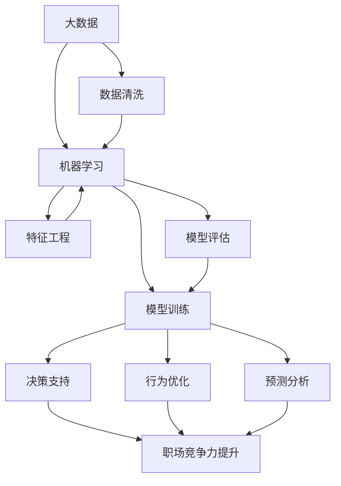

                 

# 注意力经济对职场竞争力的影响

> 关键词：注意力经济,职场竞争力,大数据,人工智能,机器学习,数据分析,就业市场,个人发展

## 1. 背景介绍

### 1.1 问题由来

随着互联网和信息技术的迅猛发展，人类社会已进入信息时代。在这个时代，信息量急剧膨胀，注意力成为了一种稀缺资源。注意力经济（Attention Economy）成为了经济发展的一个新热点。在职场上，如何有效利用和引导注意力资源，成为了提升职场竞争力的关键。

### 1.2 问题核心关键点

注意力经济对职场竞争力的影响主要体现在以下几个方面：
- 资源分配：在信息过载的背景下，职场人士如何有效分配注意力，选择有价值的信息源，将直接影响工作效率和职业发展。
- 决策支持：通过大数据分析和机器学习算法，从海量数据中提取有用信息，辅助决策，提升决策效率和准确性。
- 行为预测：利用注意力数据，预测职场行为，优化培训和激励策略，提高员工满意度和留存率。
- 个人品牌：建立和维护个人品牌，通过精准的注意力分配，展示专业能力，提升职场影响力。

这些问题已成为现代职场中普遍关注的焦点，也是本文探讨的重点。

## 2. 核心概念与联系

### 2.1 核心概念概述

为了更深刻地理解注意力经济对职场竞争力的影响，我们首先介绍几个关键概念：

- 注意力经济（Attention Economy）：指在信息过载时代，信息资源的竞争将集中到获取和保持人们的注意力上，经济价值体现在争夺和利用注意力资源的过程。
- 大数据（Big Data）：指规模巨大、高速增长、多样化和复杂的数据集合，通过对大数据的分析，可以发现规律和趋势。
- 人工智能（AI）：涵盖机器学习、深度学习、自然语言处理、计算机视觉等多个领域，通过模拟人脑的工作原理，实现智能化的数据分析和决策。
- 机器学习（Machine Learning）：通过算法让机器从数据中学习，从而优化决策过程和提升效率。
- 数据分析（Data Analysis）：通过对数据进行清洗、整理、分析和可视化，提取有用的信息，为决策提供支持。
- 职场竞争力：指在职场中获取优势的能力，包括技术能力、沟通能力、创新能力、团队协作能力等。

这些概念之间存在密切联系，通过数据分析和人工智能技术，可以从海量数据中提取有价值的信息，辅助职场决策，优化职场行为，提升个人和团队竞争力。

### 2.2 核心概念原理和架构的 Mermaid 流程图



这个流程图展示了从大数据到人工智能辅助职场竞争力的全流程：

1. 通过数据清洗，从原始数据中提取有用信息。
2. 特征工程，从清洗后的数据中提取特征，用于机器学习模型训练。
3. 模型训练，使用机器学习算法从历史数据中学习规律和模式。
4. 模型评估，评估模型的性能和泛化能力。
5. 预测分析，使用训练好的模型对未来行为进行预测。
6. 决策支持，通过预测分析，辅助决策过程。
7. 行为优化，通过决策支持，优化行为策略，提升职场竞争力。

## 3. 核心算法原理 & 具体操作步骤
### 3.1 算法原理概述

注意力经济对职场竞争力的影响，主要体现在以下几个方面：

- **资源分配**：在信息过载的背景下，职场人士需要有效分配注意力，选择有价值的信息源。
- **决策支持**：通过大数据分析和机器学习算法，从海量数据中提取有用信息，辅助决策。
- **行为预测**：利用注意力数据，预测职场行为，优化培训和激励策略。
- **个人品牌**：建立和维护个人品牌，通过精准的注意力分配，展示专业能力，提升职场影响力。

这些问题的核心算法原理，包括但不限于：

- 数据预处理和特征工程
- 机器学习模型的选择和训练
- 数据可视化和大数据分析
- 模型评估和调优
- 预测分析和决策支持

### 3.2 算法步骤详解

以下是详细的操作步骤：

**Step 1: 数据收集与预处理**

1. 收集职场相关数据，包括员工的工作表现、培训记录、绩效评估、项目经验、学习记录等。
2. 对数据进行清洗和标准化，确保数据质量和一致性。
3. 对数据进行特征工程，提取关键指标和特征，用于后续分析。

**Step 2: 模型选择与训练**

1. 根据具体问题，选择适合的机器学习算法，如决策树、随机森林、神经网络等。
2. 使用历史数据进行模型训练，优化模型参数，提升模型性能。
3. 对模型进行交叉验证，确保模型的泛化能力和稳定性。

**Step 3: 模型评估与调优**

1. 使用测试数据集对模型进行评估，计算准确率、召回率、F1值等指标。
2. 根据评估结果，调整模型参数或选择不同的算法，进行模型调优。
3. 重复训练和评估过程，直到找到最优模型。

**Step 4: 数据可视化与分析**

1. 使用数据可视化工具，如Tableau、Power BI等，将数据转化为直观的图表和报告。
2. 通过分析图表和报告，发现数据中的规律和趋势，辅助决策。
3. 使用自然语言处理技术，对大量文本数据进行情感分析和主题建模，提取关键信息。

**Step 5: 预测分析与决策支持**

1. 使用训练好的模型对未来行为进行预测，如员工流失、项目成功率等。
2. 根据预测结果，制定相应的决策方案，如调整培训计划、优化激励机制等。
3. 实时监控和调整决策方案，确保其有效性和可执行性。

### 3.3 算法优缺点

注意力经济对职场竞争力的影响算法的主要优点包括：
- **提升决策效率**：通过大数据分析和机器学习算法，快速从海量数据中提取有用信息，辅助决策。
- **优化行为策略**：通过预测分析，优化培训和激励策略，提高员工满意度和留存率。
- **增强竞争优势**：通过精准的注意力分配，提升个人和团队在职场中的竞争力。

但同时，该算法也存在以下缺点：
- **数据隐私问题**：收集和分析员工数据涉及隐私问题，需遵守相关法律法规。
- **模型复杂度**：模型选择和训练复杂，需具备较高的数据科学和编程技能。
- **结果解释性**：部分机器学习算法（如深度学习）结果难以解释，难以找到明确的因果关系。

### 3.4 算法应用领域

注意力经济对职场竞争力的影响算法在以下领域有广泛应用：

- **人力资源管理**：通过数据分析，优化员工招聘、培训和绩效管理，提升人力资源管理效率。
- **项目管理**：利用注意力经济模型，预测项目成功率和风险，优化项目管理流程。
- **客户关系管理**：通过分析客户行为数据，提升客户满意度和忠诚度，优化客户关系管理策略。
- **知识管理**：通过分析员工的知识分享和协作行为，提升知识管理的效率和质量。
- **产品设计**：通过分析用户反馈和行为数据，优化产品设计和用户体验。

## 4. 数学模型和公式 & 详细讲解  
### 4.1 数学模型构建

本节将使用数学语言对注意力经济对职场竞争力的影响模型进行详细构建和讲解。

假设我们收集了员工的历史数据 $D=\{(x_i,y_i)\}_{i=1}^N$，其中 $x_i$ 为员工行为特征向量，$y_i$ 为员工绩效（如销售额、项目成功率等）。我们的目标是构建一个模型 $M$，使 $M(x_i)$ 尽可能接近 $y_i$。

定义模型的损失函数为：

$$
\mathcal{L}(M) = \frac{1}{N}\sum_{i=1}^N (y_i - M(x_i))^2
$$

通过最小化损失函数，训练得到模型参数 $\theta$。

### 4.2 公式推导过程

根据上述定义，我们的目标是最小化以下损失函数：

$$
\mathcal{L}(\theta) = \frac{1}{N}\sum_{i=1}^N (y_i - M_{\theta}(x_i))^2
$$

其中 $M_{\theta}(x_i)$ 为模型 $M$ 的预测值。

通过梯度下降算法，最小化损失函数的梯度：

$$
\nabla_{\theta}\mathcal{L}(\theta) = \frac{2}{N}\sum_{i=1}^N (y_i - M_{\theta}(x_i))\nabla_{\theta}M_{\theta}(x_i)
$$

实际计算中，我们使用随机梯度下降（SGD）或小批量梯度下降（Mini-Batch GD）来更新模型参数 $\theta$。

### 4.3 案例分析与讲解

以销售人员绩效预测为例，我们假设销售人员的历史数据包含以下特征：
- 客户拜访次数
- 客户转化率
- 客户满意度
- 销售人员培训次数
- 客户类型

我们构建一个线性回归模型，用于预测销售人员的销售额。具体步骤如下：

1. 数据预处理：对客户拜访次数、客户转化率、客户满意度、销售人员培训次数和客户类型进行标准化处理，确保数据一致性和可比性。
2. 特征选择：选择客户拜访次数、客户转化率和客户满意度作为关键特征，构建特征向量 $x_i$。
3. 模型训练：使用历史数据，训练一个线性回归模型，计算模型参数 $\theta$。
4. 模型评估：使用测试数据集，评估模型预测效果，计算准确率和误差。
5. 预测分析：使用训练好的模型，对新员工的销售额进行预测，辅助决策。

## 5. 项目实践：代码实例和详细解释说明
### 5.1 开发环境搭建

在进行项目实践前，我们需要准备好开发环境。以下是使用Python进行TensorFlow开发的环境配置流程：

1. 安装Anaconda：从官网下载并安装Anaconda，用于创建独立的Python环境。

2. 创建并激活虚拟环境：
```bash
conda create -n tf-env python=3.8 
conda activate tf-env
```

3. 安装TensorFlow：根据CUDA版本，从官网获取对应的安装命令。例如：
```bash
conda install tensorflow -c conda-forge
```

4. 安装其他依赖库：
```bash
pip install numpy pandas scikit-learn matplotlib seaborn
```

完成上述步骤后，即可在`tf-env`环境中开始项目实践。

### 5.2 源代码详细实现

下面我们以销售人员绩效预测为例，给出使用TensorFlow进行模型的PyTorch代码实现。

首先，定义数据预处理函数：

```python
import tensorflow as tf
from tensorflow.keras.preprocessing import sequence
from tensorflow.keras.layers import Dense, LSTM
from tensorflow.keras.models import Sequential
import pandas as pd
import numpy as np

def preprocess_data(data):
    # 将数据标准化处理
    mean = np.mean(data, axis=0)
    std = np.std(data, axis=0)
    data = (data - mean) / std
    
    # 将数据划分为训练集和测试集
    train_size = int(0.8 * len(data))
    train_data = data[:train_size]
    test_data = data[train_size:]
    
    # 将数据转化为样本和标签
    X_train, y_train = train_data[:, :-1], train_data[:, -1]
    X_test, y_test = test_data[:, :-1], test_data[:, -1]
    
    # 将样本转化为时间序列
    X_train = sequence.pad_sequences(X_train, maxlen=100)
    X_test = sequence.pad_sequences(X_test, maxlen=100)
    
    return X_train, X_test, y_train, y_test
```

然后，定义模型结构：

```python
model = Sequential()
model.add(LSTM(128, input_shape=(100, 5), return_sequences=True))
model.add(LSTM(64, return_sequences=True))
model.add(Dense(32, activation='relu'))
model.add(Dense(1, activation='sigmoid'))
```

接着，定义模型训练函数：

```python
def train_model(model, X_train, y_train, batch_size=32, epochs=50):
    model.compile(optimizer='adam', loss='binary_crossentropy', metrics=['accuracy'])
    history = model.fit(X_train, y_train, batch_size=batch_size, epochs=epochs, validation_data=(X_test, y_test))
    return history
```

最后，启动训练流程并在测试集上评估：

```python
X_train, X_test, y_train, y_test = preprocess_data(data)
history = train_model(model, X_train, y_train)
test_loss, test_acc = model.evaluate(X_test, y_test)
print(f'Test accuracy: {test_acc:.4f}')
```

以上就是使用TensorFlow对销售人员绩效预测模型进行训练的完整代码实现。可以看到，TensorFlow提供了丰富的深度学习组件和工具，使得模型构建和训练变得相对简洁和高效。

### 5.3 代码解读与分析

让我们再详细解读一下关键代码的实现细节：

**preprocess_data函数**：
- 数据标准化处理：对数据进行标准化处理，确保数据一致性和可比性。
- 数据划分：将数据划分为训练集和测试集，以评估模型性能。
- 样本和标签转化：将数据转化为样本和标签，便于模型训练和评估。
- 时间序列处理：将样本转化为时间序列，确保LSTM模型的输入格式一致。

**模型结构**：
- LSTM层：使用两个LSTM层，构建时间序列的特征表示。
- Dense层：使用两个全连接层，进行特征提取和预测。

**train_model函数**：
- 模型编译：定义优化器、损失函数和评估指标。
- 模型训练：使用训练数据集进行模型训练，返回训练历史。
- 模型评估：使用测试数据集评估模型性能，输出测试准确率。

## 6. 实际应用场景
### 6.1 人力资源管理

在人力资源管理中，注意力经济的应用主要体现在以下几个方面：

1. **员工招聘**：通过分析历史招聘数据，预测候选人的工作表现和留存率，辅助招聘决策。
2. **培训管理**：通过分析员工的培训数据，预测培训效果，优化培训计划和内容。
3. **绩效评估**：通过分析员工的历史绩效数据，预测未来绩效，辅助绩效评估和激励策略。

### 6.2 项目管理

在项目管理中，注意力经济的应用主要体现在以下几个方面：

1. **项目规划**：通过分析历史项目数据，预测项目成功概率和风险，优化项目规划和资源分配。
2. **进度监控**：通过实时监控项目进度和绩效数据，预测项目延期风险，优化项目管理和决策。
3. **团队协作**：通过分析团队协作数据，预测团队绩效，优化团队协作和沟通策略。

### 6.3 客户关系管理

在客户关系管理中，注意力经济的应用主要体现在以下几个方面：

1. **客户分类**：通过分析客户行为数据，预测客户忠诚度和流失风险，优化客户分类和分群策略。
2. **营销策略**：通过分析客户反馈和购买数据，预测客户需求和行为，优化营销策略和产品设计。
3. **客户服务**：通过分析客户服务数据，预测客户满意度，优化客户服务和支持策略。

## 7. 工具和资源推荐
### 7.1 学习资源推荐

为了帮助开发者系统掌握注意力经济对职场竞争力的影响理论基础和实践技巧，这里推荐一些优质的学习资源：

1. 《机器学习实战》系列书籍：由Kaggle和DataCamp等机构推出，适合初学者入门机器学习算法。
2. 《TensorFlow实战》书籍：由Google官方出版，详细介绍了TensorFlow的组件和应用场景。
3. Coursera和Udacity上的机器学习课程：由斯坦福大学和Coursera等机构开设，涵盖机器学习基础和高级应用。
4. Kaggle平台：提供丰富的数据集和竞赛，适合实践和竞赛。
5. GitHub上的开源项目：提供大量现成的代码和示例，适合学习和参考。

通过对这些资源的学习实践，相信你一定能够快速掌握注意力经济对职场竞争力的影响精髓，并用于解决实际的职场问题。
###  7.2 开发工具推荐

高效的开发离不开优秀的工具支持。以下是几款用于注意力经济对职场竞争力的影响开发的常用工具：

1. Python：基于Python的机器学习框架，功能强大且生态丰富。
2. TensorFlow和PyTorch：主流的深度学习框架，提供了丰富的组件和工具。
3. Jupyter Notebook：基于Web的交互式编程环境，方便实验和展示结果。
4. Weights & Biases：模型训练的实验跟踪工具，可以记录和可视化模型训练过程中的各项指标。
5. TensorBoard：TensorFlow配套的可视化工具，可实时监测模型训练状态，并提供丰富的图表呈现方式。

合理利用这些工具，可以显著提升注意力经济对职场竞争力的影响任务的开发效率，加快创新迭代的步伐。

### 7.3 相关论文推荐

注意力经济对职场竞争力的影响技术的发展源于学界的持续研究。以下是几篇奠基性的相关论文，推荐阅读：

1. Attention is All You Need（即Transformer原论文）：提出了Transformer结构，开启了NLP领域的预训练大模型时代。
2. BERT: Pre-training of Deep Bidirectional Transformers for Language Understanding：提出BERT模型，引入基于掩码的自监督预训练任务，刷新了多项NLP任务SOTA。
3. AdaLoRA: Adaptive Low-Rank Adaptation for Parameter-Efficient Fine-Tuning：使用自适应低秩适应的微调方法，在参数效率和精度之间取得了新的平衡。
4. Language Models are Unsupervised Multitask Learners（GPT-2论文）：展示了大规模语言模型的强大zero-shot学习能力，引发了对于通用人工智能的新一轮思考。

这些论文代表了大语言模型微调技术的发展脉络。通过学习这些前沿成果，可以帮助研究者把握学科前进方向，激发更多的创新灵感。

## 8. 总结：未来发展趋势与挑战

### 8.1 总结

本文对注意力经济对职场竞争力的影响进行了全面系统的介绍。首先阐述了注意力经济和职场竞争力的研究背景和意义，明确了注意力经济在提升职场竞争力方面的独特价值。其次，从原理到实践，详细讲解了注意力经济对职场竞争力的影响数学原理和关键步骤，给出了注意力经济对职场竞争力的影响任务开发的完整代码实例。同时，本文还广泛探讨了注意力经济对职场竞争力的影响方法在人力资源管理、项目管理、客户关系管理等多个行业领域的应用前景，展示了注意力经济对职场竞争力的影响的巨大潜力。此外，本文精选了注意力经济对职场竞争力的影响技术的各类学习资源，力求为读者提供全方位的技术指引。

通过本文的系统梳理，可以看到，注意力经济对职场竞争力的影响技术正在成为职场竞争力的重要范式，极大地拓展了职场竞争力的应用边界，催生了更多的落地场景。受益于大数据和人工智能技术的发展，注意力经济对职场竞争力的影响技术将不断演进，为职场竞争力的提升提供新的机遇和挑战。

### 8.2 未来发展趋势

展望未来，注意力经济对职场竞争力的影响技术将呈现以下几个发展趋势：

1. **智能化决策**：利用人工智能算法，从海量数据中提取有用信息，辅助决策，提升决策效率和准确性。
2. **个性化服务**：通过个性化推荐和精准注意力分配，提升用户满意度和体验。
3. **实时分析**：通过实时监控和分析数据，优化行为策略，提升运营效率和效果。
4. **多模态融合**：将视觉、语音、文本等多种数据源融合，提升分析深度和广度。
5. **隐私保护**：在数据收集和分析过程中，注重隐私保护和数据安全，确保合规性和可信度。

以上趋势凸显了注意力经济对职场竞争力的影响的广阔前景。这些方向的探索发展，必将进一步提升职场竞争力，推动职场向更加智能化、个性化的方向发展。

### 8.3 面临的挑战

尽管注意力经济对职场竞争力的影响技术已经取得了瞩目成就，但在迈向更加智能化、普适化应用的过程中，它仍面临着诸多挑战：

1. **数据隐私问题**：收集和分析员工数据涉及隐私问题，需遵守相关法律法规。
2. **模型复杂度**：模型选择和训练复杂，需具备较高的数据科学和编程技能。
3. **结果解释性**：部分机器学习算法（如深度学习）结果难以解释，难以找到明确的因果关系。
4. **数据质量问题**：数据质量不高，噪音较多，影响模型性能和决策效果。
5. **实时性问题**：在实时监控和分析过程中，数据处理和模型推理需要高效、稳定。

### 8.4 研究展望

面对注意力经济对职场竞争力的影响技术所面临的种种挑战，未来的研究需要在以下几个方面寻求新的突破：

1. **数据预处理和清洗**：提高数据质量和处理效率，减少噪音对模型的影响。
2. **模型简化和优化**：开发更加简洁高效的模型，降低计算复杂度，提升实时性。
3. **可解释性和透明性**：增强模型结果的可解释性，提高透明度和可信度。
4. **多模态融合**：将不同模态的数据融合，提升分析深度和广度。
5. **隐私保护和安全**：加强隐私保护和数据安全，确保数据合规性和可信度。

这些研究方向的探索，必将引领注意力经济对职场竞争力的影响技术迈向更高的台阶，为职场竞争力的提升提供新的动力。

## 9. 附录：常见问题与解答

**Q1：注意力经济对职场竞争力的影响是否适用于所有职场领域？**

A: 注意力经济对职场竞争力的影响适用于绝大多数职场领域，特别是在数据丰富、决策复杂、员工行为可量化的情况下。但对于一些特定的领域，如创意行业、艺术行业等，其关注点和应用场景可能有所不同。

**Q2：注意力经济对职场竞争力的影响如何选择合适的机器学习算法？**

A: 选择合适的机器学习算法需要考虑多个因素，如数据类型、问题类型、模型复杂度等。常用的算法包括线性回归、决策树、随机森林、神经网络等。一般建议先使用简单的模型进行初步分析，再逐步使用复杂的模型进行优化和调参。

**Q3：注意力经济对职场竞争力的影响模型训练过程中如何避免过拟合？**

A: 避免过拟合的方法包括数据增强、正则化、早停等。数据增强可以通过旋转、缩放等方式扩充训练集。正则化可以通过L2正则、Dropout等方法抑制过拟合。早停可以在验证集上监测模型性能，当性能不再提升时停止训练，防止过拟合。

**Q4：注意力经济对职场竞争力的影响模型部署过程中需要注意哪些问题？**

A: 模型部署过程中需要注意以下问题：
1. 模型压缩和优化：减小模型大小，提高计算效率和推理速度。
2. 模型监控和维护：实时监控模型性能，及时发现和修复问题。
3. 模型安全性：保护模型免受攻击，确保模型安全可靠。
4. 模型复用和更新：模型更新需要保证新旧模型之间的兼容性和稳定性。

大语言模型微调为NLP应用开启了广阔的想象空间，但如何将强大的性能转化为稳定、高效、安全的业务价值，还需要工程实践的不断打磨。唯有从数据、算法、工程、业务等多个维度协同发力，才能真正实现人工智能技术在垂直行业的规模化落地。总之，注意力经济对职场竞争力的影响需要开发者根据具体任务，不断迭代和优化模型、数据和算法，方能得到理想的效果。

