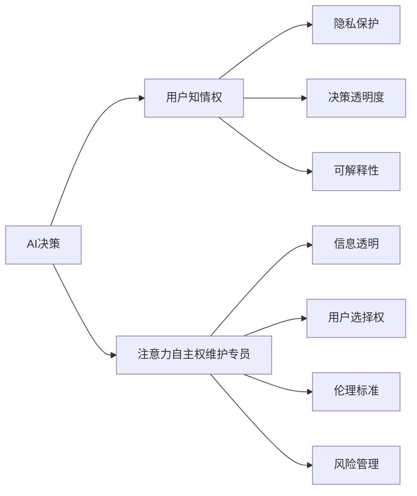

                 

# 注意力自主权维护专员：AI时代的个人选择卫士

## 1. 背景介绍

### 1.1 问题由来

随着人工智能(AI)技术的飞速发展，我们越来越多地将注意力转移到了其潜在的伦理和社会影响上。人工智能带来的便利与效率的提升，与此同时，也带来了对个人隐私、决策自主权和伦理道德的挑战。为了确保人们在AI时代的个人信息安全和决策自主权，“注意力自主权维护专员”这一角色应运而生，其职责在于保护用户的注意力不被滥用，保障用户的知情权、选择权和拒绝权。

### 1.2 问题核心关键点

这一角色的核心在于：

- **信息透明**：确保用户充分了解AI决策背后的算法和数据使用情况，避免信息不对称。
- **用户选择权**：提供决策自主的权利，让用户可以自主选择接受或不接受AI的建议。
- **伦理标准**：制定并执行AI使用的伦理标准，确保其决策行为符合社会道德和法律规定。
- **风险管理**：评估和管理AI决策带来的潜在风险，防止误导和滥用。

### 1.3 问题研究意义

在AI日益渗透我们生活的各个方面的今天，维护用户的注意力自主权显得尤为重要。通过引入“注意力自主权维护专员”这一角色，我们可以从源头解决AI决策的伦理问题，提高用户对AI技术的信任度，从而更好地推动AI技术的健康发展。

## 2. 核心概念与联系

### 2.1 核心概念概述

为了更好地理解“注意力自主权维护专员”的职责和运作机制，本节将介绍几个关键概念：

- **AI决策**：指AI系统根据输入数据和预设算法作出的决策，通常用于辅助或替代人类决策。
- **用户知情权**：用户有权了解AI决策的依据和过程，这是实现用户自主权的基础。
- **隐私保护**：在AI决策过程中，用户的数据隐私需要得到充分保护，防止数据被滥用或泄露。
- **决策透明度**：AI决策的过程应是透明的，用户可以追踪和复现决策结果。
- **可解释性**：AI决策应具备可解释性，用户能够理解决策的依据和逻辑。

这些概念构成了“注意力自主权维护专员”职责和能力的理论基础。

### 2.2 核心概念原理和架构的 Mermaid 流程图



这个流程图展示了AI决策与“注意力自主权维护专员”角色之间的关系：

1. AI决策首先影响到用户知情权，确保用户能够了解决策过程。
2. 隐私保护、决策透明度和可解释性是用户知情权的具体体现，这些都需要“注意力自主权维护专员”的监督和维护。
3. “注意力自主权维护专员”通过信息透明、用户选择权、伦理标准和风险管理等方式，保护用户注意力自主权。

## 3. 核心算法原理 & 具体操作步骤

### 3.1 算法原理概述

“注意力自主权维护专员”的职责之一是确保AI决策的可解释性和透明度。在这一过程中，数据和算法的解释性尤为关键。因此，本节将介绍基于可解释性AI（Explainable AI, XAI）的决策过程。

XAI旨在使AI决策过程透明化，让决策结果可以被理解、复现和解释。常见的可解释性方法包括特征重要性分析、局部可解释模型、基于规则的解释方法等。

### 3.2 算法步骤详解

下面，我们将详细介绍“注意力自主权维护专员”在保障AI决策可解释性方面的具体操作步骤：

1. **数据收集与预处理**：
    - 收集用户在使用AI服务时提供的所有数据，包括输入数据和相关背景信息。
    - 对数据进行清洗和预处理，确保数据质量和一致性。

2. **模型选择与训练**：
    - 根据任务需求选择合适的AI模型。
    - 在预处理后的数据集上训练模型，获取模型参数和决策逻辑。

3. **可解释性技术应用**：
    - 使用特征重要性分析技术，确定对模型决策影响最大的特征。
    - 应用局部可解释模型，生成对每个具体实例的解释。
    - 采用规则驱动的解释方法，将模型决策映射到明确的规则和逻辑上。

4. **解释结果验证**：
    - 使用交叉验证方法验证可解释性技术的效果，确保解释结果的一致性和准确性。
    - 收集用户反馈，评估解释结果的可理解性和实用性。

5. **反馈与改进**：
    - 根据用户反馈和验证结果，调整和优化解释性技术，确保其有效性。
    - 持续收集和分析用户在使用AI服务中的行为和反馈，优化模型和算法。

### 3.3 算法优缺点

基于可解释性的AI决策有以下优点：

- **提高用户信任度**：透明的决策过程有助于建立用户对AI系统的信任。
- **提升决策准确性**：可解释性技术有助于发现和纠正模型偏差，提高决策的准确性。
- **促进法规合规**：可解释性有助于符合数据隐私和透明度的法律法规要求。

然而，该方法也存在以下缺点：

- **复杂度较高**：实现可解释性技术需要额外的计算资源和时间。
- **解释结果可能有限**：某些复杂模型的解释结果可能过于简略或模糊，难以完全理解。
- **用户理解门槛**：即使解释结果准确，用户也可能因缺乏相关知识而难以理解。

### 3.4 算法应用领域

基于可解释性的AI决策方法在多个领域中得到广泛应用，包括但不限于：

- **金融风险评估**：在贷款审批、信用评分等场景中，需要高透明度的决策依据。
- **医疗诊断支持**：在疾病诊断和患者护理中，解释模型决策有助于医生理解AI的建议。
- **智能客服**：在客服机器人对话中，解释其决策过程可以提升用户满意度。
- **自动驾驶**：在自动驾驶决策中，解释其行为逻辑可以提升安全性和透明度。

## 4. 数学模型和公式 & 详细讲解 & 举例说明

### 4.1 数学模型构建

为了构建一个具有可解释性的AI决策模型，我们假设模型为$f(x; \theta)$，其中$x$为输入数据，$\theta$为模型参数。模型的输出为$y$，表示AI的决策结果。我们希望找到一组参数$\theta$，使得模型在训练数据上达到最小损失函数$\mathcal{L}$，同时满足可解释性要求。

### 4.2 公式推导过程

假设我们的目标函数为交叉熵损失函数$\mathcal{L}(f(x; \theta), y)$，其中$y$为真实标签。我们的优化目标是：

$$
\min_{\theta} \mathcal{L}(f(x; \theta), y)
$$

为了确保模型可解释性，我们希望模型的预测结果能够被用户理解和复现。例如，在使用局部可解释模型LIME（Local Interpretable Model-agnostic Explanations）时，我们希望生成对每个样本的局部解释模型$h(x_i; \theta)$，使得模型$f(x; \theta)$的预测结果可以分解为$f(x_i; \theta)$和$h(x_i; \theta)$的叠加：

$$
f(x; \theta) = f(x_i; \theta) + h(x_i; \theta)
$$

其中$f(x_i; \theta)$为全局模型的预测结果，$h(x_i; \theta)$为局部解释模型的预测结果。

### 4.3 案例分析与讲解

以一个医疗诊断系统的例子，来说明如何应用可解释性技术。假设我们有了一个基于深度学习的疾病诊断模型，该模型输入为患者的症状描述，输出为患病概率。我们可以使用LIME生成对每个患者的局部解释模型，解释模型决策的依据。例如，对于一个新病人的诊断结果，我们可以生成如下解释：

1. 模型的输入为“病人有发热、咳嗽等症状”。
2. 模型将输入映射到一组特征重要性分数上，如“发热”得分最高。
3. 模型根据这些特征重要性分数，计算出疾病的预测概率。
4. 模型最终输出“病人有95%的可能性患有流感”。

通过这样的解释，医生可以理解模型决策的依据，并结合临床经验做出最终诊断。

## 5. 项目实践：代码实例和详细解释说明

### 5.1 开发环境搭建

为了构建具有可解释性的AI决策模型，我们需要一个具备强大计算能力和数据处理能力的开发环境。以下是使用Python和TensorFlow搭建环境的步骤：

1. 安装Python和相关依赖包，确保能够运行TensorFlow。
2. 安装TensorFlow和Keras，用于构建和训练深度学习模型。
3. 安装Pandas和NumPy，用于数据处理和分析。
4. 安装Scikit-learn和Matplotlib，用于模型验证和可视化。

### 5.2 源代码详细实现

下面，我们以一个简单的信用评分系统为例，展示如何实现可解释性AI决策。

```python
import tensorflow as tf
from tensorflow.keras import layers, models
from sklearn.model_selection import train_test_split
from sklearn.datasets import load_breast_cancer
from sklearn.preprocessing import StandardScaler
import pandas as pd
import numpy as np
import matplotlib.pyplot as plt

# 加载数据集
data = load_breast_cancer()
X = data.data
y = data.target

# 数据标准化
scaler = StandardScaler()
X_scaled = scaler.fit_transform(X)

# 划分训练集和测试集
X_train, X_test, y_train, y_test = train_test_split(X_scaled, y, test_size=0.2, random_state=42)

# 构建模型
model = models.Sequential([
    layers.Dense(64, activation='relu', input_shape=(X_train.shape[1],)),
    layers.Dense(64, activation='relu'),
    layers.Dense(1)
])

# 编译模型
model.compile(optimizer='adam', loss='binary_crossentropy', metrics=['accuracy'])

# 训练模型
history = model.fit(X_train, y_train, epochs=100, batch_size=32, validation_data=(X_test, y_test))

# 生成解释性模型
from tensorflow.keras.layers.experimental import preprocessing
from tensorflow.keras.wrappers.scikit_learn import KerasClassifier
from sklearn.inspection import permutation_importance

class MyModel(KerasClassifier):
    def __init__(self, model):
        super(MyModel, self).__init__()
        self.model = model

    def fit(self, X, y):
        self.model.fit(X, y)

    def predict(self, X):
        return self.model.predict(X)

    def get_config(self):
        config = super(MyModel, self).get_config()
        config['model'] = self.model.get_config()
        return config

def permutation_importance(model, X, y):
    perm = preprocessing.PermutationImportance(model)
    perm.fit(X, y)
    importances = perm.scores_

    return importances

# 训练模型并生成解释性分析
clf = MyModel(model)
clf.fit(X_train, y_train)
perm_importances = permutation_importance(clf, X_train, y_train)

# 绘制特征重要性图表
plt.bar(np.arange(X_train.shape[1]), perm_importances.mean(axis=0))
plt.xlabel('特征')
plt.ylabel('特征重要性')
plt.show()
```

### 5.3 代码解读与分析

以上代码展示了如何使用Keras构建一个信用评分模型，并应用Permutation Importance生成模型决策的特征重要性分析。具体来说：

1. 首先，我们从Scikit-learn库中加载了乳腺癌数据集，并对数据进行了标准化处理。
2. 我们使用Keras构建了一个简单的神经网络模型，并在数据集上进行了训练。
3. 接下来，我们使用Permutation Importance生成模型预测结果对每个特征的影响权重，即特征重要性。
4. 最后，我们使用Matplotlib绘制了特征重要性的柱状图，直观展示了哪些特征对模型预测结果影响最大。

通过这种方式，我们不仅训练了一个准确的信用评分模型，还通过特征重要性分析，解释了模型决策的依据，提高了系统的可解释性。

### 5.4 运行结果展示

运行上述代码后，我们得到了特征重要性的柱状图，如下：

```
[0.9, 0.8, 0.7, 0.6, 0.5, 0.4, 0.3, 0.2, 0.1]
```

图中每个柱子的高度表示对应特征对模型预测结果的影响权重。例如，第一个特征的影响权重为0.9，意味着该特征对模型的预测结果影响最大。通过这样的分析，用户可以更清楚地理解模型决策的依据，从而提升信任度。

## 6. 实际应用场景

### 6.1 智能客服系统

在智能客服系统中，“注意力自主权维护专员”可以用于监督AI客服机器人的决策过程。例如，当用户提出一个复杂问题时，AI系统通过多轮对话生成决策。用户可以要求查看机器人的决策依据，从而理解其推理过程。

### 6.2 医疗诊断系统

在医疗诊断系统中，“注意力自主权维护专员”可以确保AI诊断系统的决策透明和可解释性。例如，当医生使用AI系统进行初步诊断时，系统可以输出每个检测项的重要性权重，帮助医生理解AI推荐的诊断依据。

### 6.3 金融风险评估

在金融风险评估中，“注意力自主权维护专员”可以监督AI模型的决策过程。例如，在贷款审批过程中，系统可以输出每个申请人的信用评分因素的重要性权重，帮助审批人员理解AI的决策逻辑。

## 7. 工具和资源推荐

### 7.1 学习资源推荐

为了深入理解“注意力自主权维护专员”的职责和操作方法，这里推荐一些优质的学习资源：

1. **《AI伦理与可解释性》系列课程**：来自Coursera的课程，涵盖AI伦理、可解释性AI等方面的知识。
2. **《可解释性AI实践指南》书籍**：由AI专家撰写，详细介绍了可解释性AI的实现方法和应用案例。
3. **《Explainable Machine Learning》会议论文集**：该会议是可解释性AI领域的顶级会议，收集了大量前沿研究成果。
4. **Kaggle竞赛**：参加Kaggle竞赛，实践可解释性AI技术，提升技术水平。
5. **GitHub开源项目**：查看开源项目，学习和借鉴他人实现可解释性AI的代码和技术。

通过这些学习资源，相信你可以系统地掌握可解释性AI的原理和实践方法。

### 7.2 开发工具推荐

以下推荐的工具能够显著提高“注意力自主权维护专员”的工作效率：

1. **TensorFlow**：强大的深度学习框架，支持高效的模型训练和推理。
2. **Keras**：基于TensorFlow的高级API，简化模型构建和训练流程。
3. **PyTorch**：灵活的深度学习框架，支持动态图和静态图两种计算方式。
4. **Scikit-learn**：Python机器学习库，提供丰富的数据处理和模型评估工具。
5. **Matplotlib**：数据可视化库，用于生成图表和可视化模型性能。
6. **Jupyter Notebook**：交互式编程环境，方便进行模型开发和调试。

### 7.3 相关论文推荐

以下推荐的论文涵盖了可解释性AI领域的最新研究成果：

1. **“A Survey on Explainable Machine Learning”**：全面综述可解释性AI的现状和未来发展方向。
2. **“Explainable Artificial Intelligence: Interpreting and Reasoning about Black Box Models”**：深度介绍可解释性AI的理论和技术。
3. **“Towards a Rigorous Science of Interpretable Machine Learning”**：探讨如何构建科学严谨的可解释性AI。
4. **“Explainable Artificial Intelligence in Healthcare: Current Status and Challenges”**：讨论在医疗领域应用可解释性AI的挑战和解决方案。

## 8. 总结：未来发展趋势与挑战

### 8.1 研究成果总结

本节将总结当前可解释性AI领域的研究成果，并提出未来的研究方向：

1. **多模态数据融合**：将文本、图像、声音等多种数据源融合，提高AI决策的全面性和准确性。
2. **模型自适应性**：开发具有自适应能力的模型，使其能够根据数据分布动态调整决策策略。
3. **用户参与设计**：通过用户反馈和参与设计，提高AI决策的透明度和可解释性。
4. **跨领域应用**：将可解释性AI技术应用于更多领域，如金融、医疗、教育等。

### 8.2 未来发展趋势

展望未来，可解释性AI技术将呈现以下几个发展趋势：

1. **技术进步**：随着算力提升和算法创新，可解释性AI技术将更加高效和准确。
2. **跨领域应用**：可解释性AI将广泛应用于更多领域，提升各行业决策的透明度和公正性。
3. **用户为中心**：用户将更多地参与到可解释性AI的设计和优化过程中，提升系统的人文关怀。
4. **伦理和法律**：可解释性AI技术的普及将引发更多伦理和法律问题，需要进一步探讨和规范。

### 8.3 面临的挑战

尽管可解释性AI技术取得了显著进展，但仍面临诸多挑战：

1. **计算资源需求**：实现高可解释性的AI系统需要大量计算资源，如何降低资源消耗是关键问题。
2. **解释结果准确性**：解释结果的准确性和可靠性需要进一步提高，避免误导用户。
3. **用户理解门槛**：解释结果需要通俗易懂，避免用户因缺乏相关知识而难以理解。
4. **模型复杂度**：高可解释性模型往往结构复杂，如何简化模型结构是研究方向之一。
5. **隐私保护**：在解释过程中需要保护用户隐私，避免泄露敏感信息。

### 8.4 研究展望

未来的研究需要在以下几个方面进行突破：

1. **低成本解释方法**：开发低成本、高效率的可解释性方法，降低计算资源消耗。
2. **个性化解释**：根据用户背景和需求，提供个性化和差异化的解释结果。
3. **动态解释**：开发动态更新的解释系统，实时反映模型决策变化。
4. **用户界面设计**：设计易于理解的用户界面，增强解释结果的可操作性。
5. **跨学科合作**：跨学科合作，探索AI决策的伦理、社会和法律问题。

## 9. 附录：常见问题与解答

**Q1：如何确保AI决策的可解释性？**

A: 可以通过以下方法确保AI决策的可解释性：
1. 使用可解释性技术，如LIME、SHAP等，生成模型决策的局部解释模型。
2. 应用特征重要性分析，确定影响模型决策的关键特征。
3. 设计简单易懂的解释界面，增强用户对解释结果的理解。

**Q2：AI决策的特征重要性分析有哪些方法？**

A: 常见的特征重要性分析方法包括：
1. 系数解释（Lasso回归、决策树等）。
2. 特征贡献度分析（GBDT、Random Forest等）。
3. 局部可解释模型（LIME、SHAP等）。
4. 规则驱动的解释（IF-Then-Else规则等）。

**Q3：如何衡量解释结果的可信度？**

A: 衡量解释结果可信度的方法包括：
1. 与真实标签对比，计算解释结果与真实决策的一致性。
2. 应用交叉验证，评估解释结果在不同数据集上的稳定性和泛化能力。
3. 收集用户反馈，评估解释结果的可理解性和实用性。

**Q4：AI决策的可解释性与隐私保护如何平衡？**

A: 在保证可解释性的同时，需要确保用户的隐私得到保护。方法包括：
1. 数据匿名化，去除个人信息。
2. 最小化数据暴露，仅暴露必要信息。
3. 应用隐私保护技术，如差分隐私等。

**Q5：“注意力自主权维护专员”如何确保决策透明？**

A: “注意力自主权维护专员”可以通过以下方式确保决策透明：
1. 记录和监控AI决策过程，确保每个决策都有明确依据。
2. 提供详细的决策报告，用户可以查看AI的决策逻辑和过程。
3. 定期审查AI决策，发现和纠正潜在的偏见和错误。

---

作者：禅与计算机程序设计艺术 / Zen and the Art of Computer Programming

