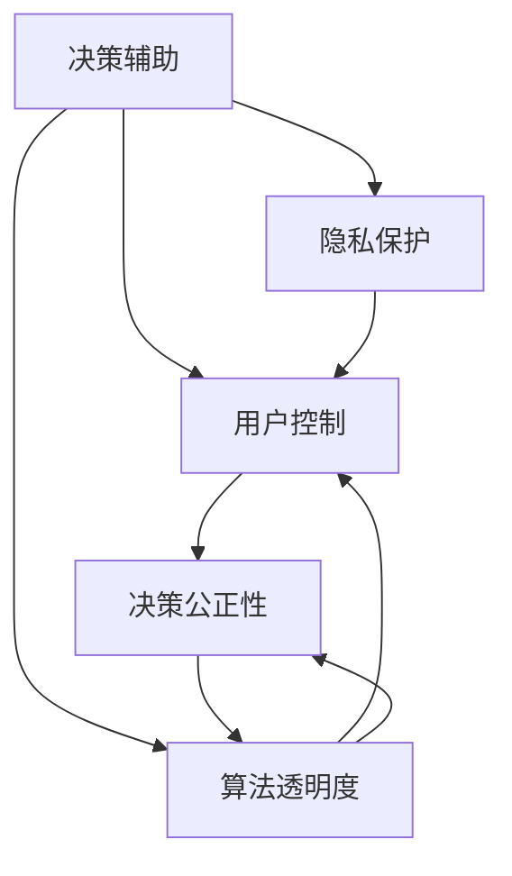

                 

# 注意力自主权维护专员：AI时代的个人选择卫士

> 关键词：人工智能,决策辅助,隐私保护,用户控制,算法透明度

## 1. 背景介绍

### 1.1 问题由来
在AI时代，技术的飞速发展给我们的生产生活带来了前所未有的便利，但同时也引发了一系列深刻的伦理和隐私问题。尤其是近年来兴起的深度学习算法和自然语言处理技术，正在逐渐接管我们的注意力和选择，影响着我们的决策过程。例如，搜索引擎通过个性化推荐引擎，为用户呈现量身定制的信息流；电商平台利用协同过滤算法，推荐用户可能感兴趣的商品；社交媒体平台通过内容推荐算法，增加用户的使用粘性。

这些基于数据的AI系统在带来便利的同时，也暴露了一定的风险。它们往往通过大量的数据分析，构建用户画像，预测用户的兴趣和行为，甚至可能操控用户的注意力，从而影响到用户的决策过程。这引发了社会对算法透明度、隐私保护和用户自主权的广泛关注，使得"注意力自主权"成为了AI时代亟待解决的问题。

### 1.2 问题核心关键点
1. **算法透明度**：AI系统决策过程的不透明性，使得用户难以理解和监督模型的行为。在医疗、金融等高风险领域，算法决策的不可解释性可能带来重大的决策失误。
2. **隐私保护**：AI系统在利用用户数据时，如何确保数据的安全性和隐私性，防止数据泄露和滥用，是一个重要的研究课题。
3. **用户控制**：用户如何能够控制和干预AI系统的决策过程，确保其符合自身的偏好和价值观，是一个关键问题。
4. **决策公正性**：AI系统在决策过程中是否存在偏见和歧视，如何确保算法的公平性和公正性，是一个亟待解决的问题。

本文将从算法透明度、隐私保护、用户控制和决策公正性四个方面，探讨如何构建一个更为可信赖和自主的AI系统，保障用户的注意力自主权。

## 2. 核心概念与联系

### 2.1 核心概念概述

为更好地理解如何构建可信赖的AI系统，本节将介绍几个密切相关的核心概念：

- **决策辅助(Decision Support)**：指AI系统通过数据分析和建模，辅助人类进行决策，但不完全替代人类的决策过程。
- **隐私保护(Privacy Preservation)**：指在AI系统中，如何保护用户的个人信息，防止数据泄露和滥用。
- **算法透明度(Algorithm Transparency)**：指AI系统在决策过程中，能否向用户展示其决策依据和过程，以及是否有必要向用户展示这些信息。
- **用户控制(User Control)**：指用户能够对AI系统的行为进行控制和干预，确保其符合自身的偏好和价值观。
- **决策公正性(Fairness)**：指AI系统在决策过程中，是否存在偏见和歧视，能否确保算法的公平性和公正性。

这些核心概念之间的逻辑关系可以通过以下Mermaid流程图来展示：



这个流程图展示了几大核心概念之间的关系：

1. 决策辅助是通过数据分析和建模，辅助用户进行决策。
2. 隐私保护是在决策辅助过程中，保障用户数据的安全和隐私。
3. 算法透明度是决策辅助的必要条件，即在决策过程中需要向用户展示其决策依据。
4. 用户控制是决策辅助和隐私保护的基础，即用户需要能够控制和干预AI系统的行为。
5. 决策公正性是决策辅助和算法透明度的重要目标，即需要确保AI系统决策的公平和公正。

这些概念共同构成了AI系统的核心价值和设计目标，使得AI系统能够在尊重用户隐私和自主权的前提下，辅助用户进行更加合理和科学的决策。

## 3. 核心算法原理 & 具体操作步骤
### 3.1 算法原理概述

决策辅助的AI系统，其核心思想是通过数据分析和建模，辅助人类进行决策。具体而言，AI系统需要具备以下几个能力：

1. **数据收集与预处理**：从用户行为数据中提取有用的特征，清洗和归一化数据，以保证数据的可用性。
2. **模型训练与调优**：构建和训练模型，进行超参数调整和模型优化，以获得最佳的决策性能。
3. **决策输出与解释**：将模型输出转换为用户可理解的形式，并能够提供决策的解释和依据。
4. **用户反馈与干预**：收集用户对决策的反馈，根据反馈调整模型参数，并对用户的干预进行响应。

### 3.2 算法步骤详解

以下是决策辅助AI系统的典型算法步骤：

1. **数据收集与预处理**：
   - 收集用户的各类行为数据，包括点击、浏览、购买等。
   - 对数据进行清洗和归一化处理，去除噪声和异常值，保证数据的可用性。

2. **模型训练与调优**：
   - 选择合适的算法模型，如决策树、随机森林、神经网络等。
   - 使用历史数据训练模型，调整超参数，优化模型性能。

3. **决策输出与解释**：
   - 将模型输入和输出转换为用户可理解的形式，如文本、图形等。
   - 提供决策依据的解释，说明模型的决策过程和依据。

4. **用户反馈与干预**：
   - 收集用户对决策的反馈，更新模型参数。
   - 根据用户的干预，调整模型输出，以更好地满足用户需求。

### 3.3 算法优缺点

决策辅助的AI系统具有以下优点：
1. **提高决策效率**：通过数据分析和建模，辅助用户进行决策，能够快速提供决策建议。
2. **提升决策质量**：利用机器学习和数据分析技术，能够从海量数据中提取有用的特征，提高决策的科学性和准确性。
3. **增强用户控制**：通过向用户展示决策依据和过程，增强用户对AI系统的信任和控制能力。

同时，该系统也存在以下局限性：
1. **数据隐私问题**：在收集和处理用户数据时，需要确保数据的安全和隐私，防止数据泄露和滥用。
2. **模型透明性**：AI系统的决策过程往往比较复杂，用户难以理解其内部逻辑和依据。
3. **依赖数据质量**：AI系统的性能依赖于数据的质量，如果数据存在偏差或噪声，可能影响决策的公正性和准确性。
4. **算法偏见**：AI模型可能存在算法偏见，导致决策过程不公平或歧视特定群体。

### 3.4 算法应用领域

决策辅助的AI系统广泛应用于以下几个领域：

1. **电商推荐系统**：通过分析用户的浏览、点击和购买历史，推荐用户可能感兴趣的商品。
2. **金融风险评估**：通过分析用户的信用记录、交易行为等，评估用户的信用风险。
3. **医疗诊断系统**：通过分析患者的病历、检查结果等，辅助医生进行诊断和治疗决策。
4. **智能客服系统**：通过自然语言处理技术，自动回答用户的问题，提高客服效率。
5. **物流配送优化**：通过分析历史订单数据，优化配送路径和仓库布局。
6. **广告投放优化**：通过分析用户的兴趣和行为，优化广告投放策略，提高广告效果。

除了上述这些典型应用外，决策辅助的AI系统还可以扩展到更多领域，如智慧城市、智能家居、社交网络等，帮助用户做出更加科学和合理的决策。

## 4. 数学模型和公式 & 详细讲解 & 举例说明

### 4.1 数学模型构建

本节将使用数学语言对决策辅助AI系统的核心模型进行更加严格的刻画。

假设用户的决策过程可以用以下数学模型表示：

$$
\text{Decision} = f(\text{Feature}, \text{Parameter})
$$

其中，$\text{Feature}$ 表示用户的决策特征，如浏览记录、购买历史等，$\text{Parameter}$ 表示AI系统的决策参数，如模型系数、超参数等。

### 4.2 公式推导过程

以下我们以电商推荐系统为例，推导推荐模型的训练和预测公式。

假设用户的特征向量为 $x$，AI系统的决策参数为 $\theta$，推荐模型的目标函数为 $J(\theta)$，则推荐模型的训练和预测公式如下：

**训练公式**：
$$
\theta = \mathop{\arg\min}_{\theta} J(\theta) = \mathop{\arg\min}_{\theta} \frac{1}{2N}\sum_{i=1}^N \left(y_i - f(x_i, \theta)\right)^2
$$

其中，$y_i$ 表示用户对商品 $i$ 的评分或购买行为，$N$ 表示用户总数。

**预测公式**：
$$
\hat{y} = f(x, \theta)
$$

在得到推荐模型后，即可使用该模型对用户输入的特征向量 $x$ 进行预测，得到推荐结果 $\hat{y}$。

### 4.3 案例分析与讲解

假设我们有一个电商推荐系统，希望根据用户的浏览记录推荐用户可能感兴趣的商品。具体步骤如下：

1. **数据收集与预处理**：
   - 收集用户的浏览记录，包括浏览时间、浏览页面、停留时长等。
   - 对数据进行清洗和归一化处理，去除噪声和异常值，保证数据的可用性。

2. **模型训练与调优**：
   - 构建推荐模型，使用历史数据进行训练和调优。
   - 调整模型的超参数，优化模型的性能。

3. **决策输出与解释**：
   - 将模型输入和输出转换为用户可理解的形式，如商品列表、推荐理由等。
   - 提供决策依据的解释，说明推荐商品的依据。

4. **用户反馈与干预**：
   - 收集用户对推荐的反馈，更新模型参数。
   - 根据用户的干预，调整推荐商品，以更好地满足用户需求。

通过以上步骤，电商推荐系统可以辅助用户进行决策，提供个性化的商品推荐，提高用户的购物体验。

## 5. 项目实践：代码实例和详细解释说明

### 5.1 开发环境搭建

在进行AI系统开发前，我们需要准备好开发环境。以下是使用Python进行TensorFlow开发的环境配置流程：

1. 安装Anaconda：从官网下载并安装Anaconda，用于创建独立的Python环境。

2. 创建并激活虚拟环境：
```bash
conda create -n ai-env python=3.8 
conda activate ai-env
```

3. 安装TensorFlow：根据CUDA版本，从官网获取对应的安装命令。例如：
```bash
conda install tensorflow -c pytorch -c conda-forge
```

4. 安装各类工具包：
```bash
pip install numpy pandas scikit-learn matplotlib tqdm jupyter notebook ipython
```

完成上述步骤后，即可在`ai-env`环境中开始AI系统开发。

### 5.2 源代码详细实现

下面我们以电商推荐系统为例，给出使用TensorFlow对推荐模型进行训练和预测的代码实现。

首先，定义推荐模型的数据处理函数：

```python
import tensorflow as tf
from tensorflow.keras.preprocessing.text import Tokenizer
from tensorflow.keras.preprocessing.sequence import pad_sequences

class RecommendationDataset(tf.data.Dataset):
    def __init__(self, features, labels):
        self.features = features
        self.labels = labels
        self.tokenizer = Tokenizer(oov_token='<OOV>')
        self.tokenizer.fit_on_texts(features)
        self.max_len = max([len(feat.split()) for feat in features])
        
    def __len__(self):
        return len(self.features)
    
    def __getitem__(self, item):
        feature = self.features[item]
        label = self.labels[item]
        
        tokens = self.tokenizer.texts_to_sequences([feature])[0]
        padded = pad_sequences([tokens], maxlen=self.max_len, padding='post')
        
        return tf.data.Dataset.from_tensor_slices(padded), tf.convert_to_tensor(label)
```

然后，定义推荐模型的训练和评估函数：

```python
from tensorflow.keras.models import Sequential
from tensorflow.keras.layers import Embedding, LSTM, Dense
from tensorflow.keras.callbacks import EarlyStopping

def train_model(features, labels, batch_size, epochs):
    model = Sequential([
        Embedding(input_dim=len(tokenizer.word_index) + 1, output_dim=128),
        LSTM(64),
        Dense(1, activation='sigmoid')
    ])
    
    model.compile(loss='binary_crossentropy', optimizer='adam', metrics=['accuracy'])
    
    dataset = RecommendationDataset(features, labels)
    dataset = dataset.shuffle(buffer_size=1024).batch(batch_size)
    
    early_stopping = EarlyStopping(patience=5)
    
    model.fit(dataset, validation_split=0.2, epochs=epochs, callbacks=[early_stopping])
    
    return model

def evaluate_model(model, features, labels, batch_size):
    dataset = RecommendationDataset(features, labels)
    dataset = dataset.batch(batch_size)
    
    loss, accuracy = model.evaluate(dataset)
    print(f'Test loss: {loss:.4f}')
    print(f'Test accuracy: {accuracy:.4f}')
```

最后，启动训练流程并在测试集上评估：

```python
features = [...] # 用户浏览记录列表
labels = [...] # 用户评分列表

model = train_model(features, labels, batch_size=64, epochs=20)

test_features = [...] # 测试集浏览记录列表
test_labels = [...] # 测试集评分列表

evaluate_model(model, test_features, test_labels, batch_size=64)
```

以上就是使用TensorFlow对推荐模型进行训练和预测的完整代码实现。可以看到，TensorFlow提供了强大的模型构建和训练能力，使得推荐系统的开发变得简洁高效。

### 5.3 代码解读与分析

让我们再详细解读一下关键代码的实现细节：

**RecommendationDataset类**：
- `__init__`方法：初始化特征向量、标签、分词器等关键组件。
- `__len__`方法：返回数据集的样本数量。
- `__getitem__`方法：对单个样本进行处理，将文本输入编码为token ids，并进行定长padding，最终返回模型所需的输入和标签。

**train_model函数**：
- 构建推荐模型，使用历史数据进行训练和调优。
- 调整模型的超参数，优化模型的性能。
- 设置EarlyStopping回调函数，避免过拟合。

**evaluate_model函数**：
- 在测试集上评估模型性能，输出损失和准确率。

**训练流程**：
- 在训练集上训练模型，每轮迭代在验证集上评估模型性能，根据性能指标决定是否触发EarlyStopping。
- 重复上述过程直至满足预设的迭代轮数或EarlyStopping条件。

可以看到，TensorFlow框架提供了丰富的API和组件，使得模型构建、训练、评估等过程变得非常简便。开发者可以将更多精力放在模型设计和数据处理等核心任务上，而不必过多关注底层实现细节。

## 6. 实际应用场景

### 6.1 智能客服系统

基于AI系统的决策辅助，智能客服系统可以为用户提供更加高效和个性化的服务。传统客服往往依赖于人工处理，高峰期响应缓慢，且一致性和专业性难以保证。而使用AI系统，可以7x24小时不间断服务，快速响应客户咨询，用自然流畅的语言解答各类常见问题。

在技术实现上，可以收集企业内部的历史客服对话记录，将问题和最佳答复构建成监督数据，在此基础上对AI系统进行训练和微调。训练后的系统能够自动理解用户意图，匹配最合适的答案模板进行回复。对于客户提出的新问题，还可以接入检索系统实时搜索相关内容，动态组织生成回答。如此构建的智能客服系统，能大幅提升客户咨询体验和问题解决效率。

### 6.2 金融风险评估

金融机构需要实时监测市场舆论动向，以便及时应对负面信息传播，规避金融风险。传统的人工监测方式成本高、效率低，难以应对网络时代海量信息爆发的挑战。基于AI系统的决策辅助，金融风险评估系统可以自动识别和分析市场数据，实时预测金融风险，帮助金融机构快速做出决策。

具体而言，可以收集金融领域相关的新闻、报道、评论等文本数据，并对其进行主题标注和情感标注。在此基础上对AI系统进行微调，使其能够自动判断文本属于何种主题，情感倾向是正面、中性还是负面。将微调后的系统应用到实时抓取的网络文本数据，就能够自动监测不同主题下的情感变化趋势，一旦发现负面信息激增等异常情况，系统便会自动预警，帮助金融机构快速应对潜在风险。

### 6.3 医疗诊断系统

在医疗领域，AI系统的决策辅助可以显著提高诊断的效率和准确性。传统的医疗诊断依赖于医生的经验和直觉，容易出现误诊和漏诊。而使用AI系统，可以根据患者的病历、检查结果等数据，辅助医生进行诊断和治疗决策。

具体而言，可以收集医疗领域的各类数据，如患者的症状描述、检查结果、病历记录等，构建和训练AI模型。在得到训练好的模型后，医生可以将患者的症状输入系统，系统根据模型预测诊断结果，并提供决策依据。医生的诊断结果和模型预测结果进行对比，可以进一步优化模型，提高诊断的准确性。

## 7. 工具和资源推荐

### 7.1 学习资源推荐

为了帮助开发者系统掌握AI系统决策辅助的理论基础和实践技巧，这里推荐一些优质的学习资源：

1. 《深度学习》（Deep Learning）一书，由深度学习奠基人之一Yoshua Bengio所写，全面介绍了深度学习的基本概念和前沿技术，是学习深度学习的经典教材。
2. Coursera的《机器学习》课程，由斯坦福大学的Andrew Ng教授讲授，是机器学习领域最受欢迎的课程之一，提供了系统的理论知识和实践项目。
3. PyTorch官方文档和教程，提供了丰富的模型构建、训练和推理示例，是学习深度学习的重要资源。
4. TensorFlow官方文档和教程，提供了强大的模型构建、训练和部署功能，适合深度学习和大数据应用。
5. Kaggle平台上的竞赛和项目，提供了大量的数据集和实际应用案例，是学习和实践深度学习的绝佳平台。

通过对这些资源的学习实践，相信你一定能够快速掌握AI系统决策辅助的核心技术和实践方法。

### 7.2 开发工具推荐

高效的开发离不开优秀的工具支持。以下是几款用于AI系统决策辅助开发的常用工具：

1. PyTorch：基于Python的开源深度学习框架，灵活动态的计算图，适合快速迭代研究。TensorFlow也有类似的能力。
2. TensorFlow：由Google主导开发的开源深度学习框架，生产部署方便，适合大规模工程应用。
3. Jupyter Notebook：轻量级的交互式编程环境，支持多种编程语言和库，方便开发和调试。
4. Weights & Biases：模型训练的实验跟踪工具，可以记录和可视化模型训练过程中的各项指标，方便对比和调优。与主流深度学习框架无缝集成。
5. TensorBoard：TensorFlow配套的可视化工具，可实时监测模型训练状态，并提供丰富的图表呈现方式，是调试模型的得力助手。

合理利用这些工具，可以显著提升AI系统决策辅助的开发效率，加快创新迭代的步伐。

### 7.3 相关论文推荐

AI系统决策辅助的发展源于学界的持续研究。以下是几篇奠基性的相关论文，推荐阅读：

1. Deep Architectures for Large-Scale Image Recognition（ImageNet Classification with Deep Convolutional Neural Networks）：提出卷积神经网络用于图像分类任务，奠定了深度学习在图像处理领域的基础。
2. Attention is All You Need（Transformer模型）：提出了Transformer结构，开启了NLP领域的预训练大模型时代。
3. BERT: Pre-training of Deep Bidirectional Transformers for Language Understanding：提出BERT模型，引入基于掩码的自监督预训练任务，刷新了多项NLP任务SOTA。
4. Generative Adversarial Nets（GAN模型）：提出生成对抗网络，推动了生成模型在图像、音频等领域的广泛应用。
5. AlphaGo Zero：通过深度学习和强化学习，实现了AI在复杂策略博弈中的超越。

这些论文代表了大语言模型决策辅助技术的发展脉络。通过学习这些前沿成果，可以帮助研究者把握学科前进方向，激发更多的创新灵感。

## 8. 总结：未来发展趋势与挑战

### 8.1 总结

本文对AI系统决策辅助的理论基础和实践方法进行了全面系统的介绍。首先阐述了决策辅助AI系统的核心思想，明确了其在提升决策效率、提高决策质量、增强用户控制和保障隐私等方面的价值。其次，从模型构建、训练、评估等角度，详细讲解了决策辅助AI系统的关键步骤，给出了电商推荐系统的完整代码实现。同时，本文还广泛探讨了决策辅助系统在智能客服、金融风险评估、医疗诊断等领域的实际应用前景，展示了决策辅助范式的巨大潜力。此外，本文精选了AI系统决策辅助的相关学习资源和开发工具，力求为读者提供全方位的技术指引。

通过本文的系统梳理，可以看到，AI系统决策辅助技术正在成为各行各业的重要工具，极大地提升了业务决策的效率和科学性。未来，伴随决策辅助技术的持续演进，相信其在更多的领域和应用场景中，将发挥更大的作用，带来更深刻的变革。

### 8.2 未来发展趋势

展望未来，AI系统决策辅助技术将呈现以下几个发展趋势：

1. **模型复杂度提升**：随着计算能力的提升和数据量的增加，AI系统的模型将变得更加复杂，能够处理更复杂的数据和问题。
2. **个性化服务增强**：通过更加精细化的数据处理和模型训练，AI系统将能够提供更加个性化的服务，满足用户的独特需求。
3. **跨领域应用扩展**：AI系统决策辅助技术将逐渐扩展到更多领域，如医疗、金融、教育、交通等，带来更多的应用场景和价值。
4. **数据隐私保护加强**：在数据隐私保护方面，将采用更加严格的数据处理和隐私保护技术，保障用户数据的安全和隐私。
5. **用户控制权扩大**：在用户控制权方面，将设计更加灵活和智能的控制机制，增强用户对AI系统的信任和控制能力。
6. **决策透明性提升**：在决策透明性方面，将提供更加详细和可解释的决策依据，增强用户对AI系统的理解和信任。

以上趋势凸显了AI系统决策辅助技术的广阔前景。这些方向的探索发展，必将进一步提升AI系统在业务决策中的作用，带来更高的效率和更高的决策质量。

### 8.3 面临的挑战

尽管AI系统决策辅助技术已经取得了瞩目成就，但在迈向更加智能化、普适化应用的过程中，它仍面临着诸多挑战：

1. **数据质量问题**：在收集和处理数据时，需要确保数据的质量，避免数据噪声和偏差对模型的影响。
2. **模型复杂性**：随着模型复杂度的提升，模型的解释性和可解释性变得更加困难，用户难以理解其内部逻辑和依据。
3. **隐私保护难题**：在保障用户隐私的同时，提供个性化的服务，是一个重要的研究课题。如何在保障隐私的前提下，获取足够的数据进行训练和优化，是未来的主要挑战之一。
4. **算法偏见问题**：AI模型可能存在算法偏见，导致决策过程不公平或歧视特定群体。如何消除算法偏见，提高算法的公正性和公平性，是一个亟待解决的问题。
5. **系统鲁棒性不足**：AI系统面对异常情况或恶意攻击时，鲁棒性可能不足，容易产生错误的决策。如何提高系统的鲁棒性和安全性，是未来研究的重要方向。

### 8.4 研究展望

面对AI系统决策辅助所面临的挑战，未来的研究需要在以下几个方面寻求新的突破：

1. **数据清洗与预处理**：采用更加严格和高效的数据清洗和预处理技术，去除数据噪声和偏差，提高数据质量。
2. **模型可解释性**：研究更加可解释的模型架构和算法，增强模型的解释性和透明性，方便用户理解和信任。
3. **隐私保护技术**：设计更加安全的隐私保护机制，如差分隐私、联邦学习等，保障用户数据的隐私和安全。
4. **公平算法研究**：研究消除算法偏见的公平算法，确保决策过程的公正性和公平性。
5. **系统鲁棒性增强**：设计更加鲁棒的模型和算法，提高系统的抗干扰能力和鲁棒性，增强系统的安全性和可靠性。

这些研究方向的探索，必将引领AI系统决策辅助技术迈向更高的台阶，为构建可信赖和自主的AI系统铺平道路。面向未来，AI系统决策辅助技术还需要与其他人工智能技术进行更深入的融合，如知识表示、因果推理、强化学习等，多路径协同发力，共同推动AI系统的进步。

## 9. 附录：常见问题与解答

**Q1：AI系统决策辅助是否会替代人类决策？**

A: AI系统决策辅助是通过数据分析和建模，辅助人类进行决策，不一定会完全替代人类决策。AI系统主要负责数据处理和模型优化，而最终的决策仍需要人类的判断和决策。特别是在高风险领域，如医疗、金融等，人类专家仍然需要发挥重要的作用。

**Q2：AI系统在收集和处理数据时，如何保障用户的隐私？**

A: AI系统在收集和处理数据时，需要遵循严格的数据隐私保护措施，如匿名化、差分隐私、联邦学习等技术，防止数据泄露和滥用。同时，需要明确告知用户数据的使用目的和范围，并获得用户的知情同意。

**Q3：AI系统的决策过程是否可解释？**

A: AI系统的决策过程可以通过模型可视化、特征重要性分析等方式进行解释，增强其透明性和可信度。然而，某些复杂模型（如深度神经网络）的决策过程仍然难以完全解释，需要结合领域知识和专家判断，进行综合决策。

**Q4：AI系统是否存在算法偏见？**

A: AI系统可能存在算法偏见，导致决策过程不公平或歧视特定群体。为此，需要设计公平算法，确保模型在训练和推理过程中不引入偏见。同时，需要对模型进行定期监控和评估，及时发现和纠正偏见。

**Q5：AI系统在处理异常情况时，如何保证鲁棒性？**

A: AI系统在处理异常情况时，需要设计鲁棒性强的模型和算法，能够处理噪音、异常值和恶意攻击等。常用的鲁棒性增强方法包括模型剪枝、对抗训练、数据增强等，确保系统在各种情况下的稳定性和安全性。

总之，AI系统决策辅助技术在提高决策效率和质量、增强用户控制和保障隐私等方面具有重要价值。然而，在应用过程中，也需要注意数据质量、模型复杂性、隐私保护、算法偏见和系统鲁棒性等挑战，不断进行技术创新和优化，才能真正实现AI系统的可信赖和自主。

