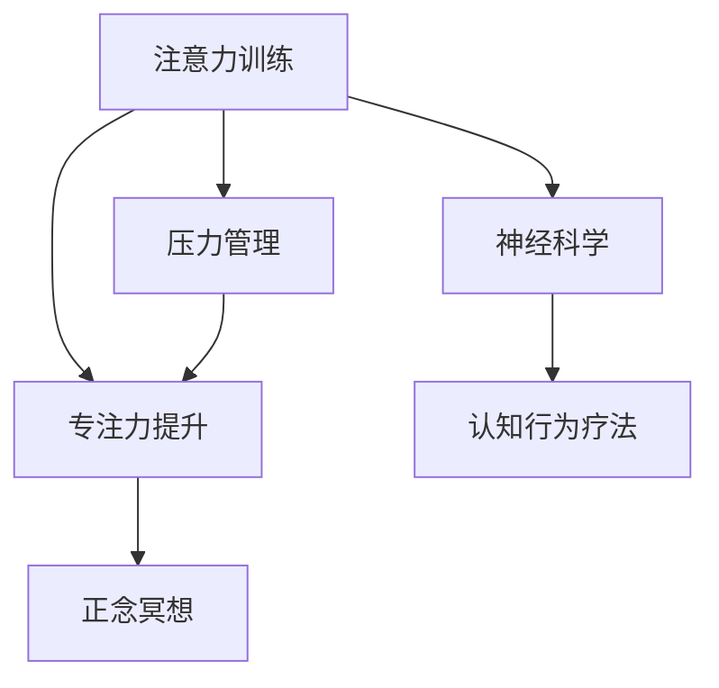

                 

# 注意力训练与压力管理：如何在压力下增强专注力

> 关键词：注意力训练, 压力管理, 专注力提升, 心理健康, 神经科学

## 1. 背景介绍

### 1.1 问题由来
在现代社会，随着工作压力、生活节奏的不断加快，越来越多的人面临注意力分散、专注力下降的问题。长时间坐在屏幕前工作、学习，脑力活动不断，容易导致注意力难以集中，进而影响工作效率和生活质量。心理学家和神经科学家研究发现，注意力训练和压力管理是提升专注力的有效途径，尤其在高压力环境下尤为重要。本文将详细探讨如何通过注意力训练和压力管理，在压力下提升个体的专注力。

### 1.2 问题核心关键点
当前，对于注意力训练和压力管理的认知度仍然不足，导致很多人在面对高压力时缺乏有效的应对策略。我们希望通过这篇文章，让读者理解注意力训练的原理，掌握压力管理的方法，学会在高压环境中保持专注。

### 1.3 问题研究意义
注意力训练和压力管理技术的普及，将帮助个体应对日常生活中的各种挑战，提高工作效率和生活质量，增强心理韧性，提升整体幸福感。同时，这也符合当前社会对心理健康关注提升的大背景，具有重要的实践意义。

## 2. 核心概念与联系

### 2.1 核心概念概述

为更好地理解注意力训练和压力管理的技术框架，本节将介绍几个关键概念及其相互联系：

- **注意力训练（Attention Training）**：指通过一系列有针对性的训练任务，逐步提升个体在特定任务中的注意力集中能力，包括信息筛选、记忆保持、思维集中等方面。

- **压力管理（Stress Management）**：指通过一系列方法，帮助个体有效应对心理和生理上的压力反应，保持心理健康，如情绪调节、放松技巧、时间管理等。

- **专注力提升（Concentration Improvement）**：指通过注意力训练和压力管理，使个体在面对高压力环境时，依然能够保持专注，高效完成工作任务。

- **神经科学（Neuroscience）**：研究注意力和压力反应的生理机制，如大脑活动模式、神经递质分泌、皮层厚度等，为注意力训练和压力管理提供理论依据。

- **认知行为疗法（Cognitive Behavioral Therapy, CBT）**：一种心理治疗方法，通过认知重构、行为矫正等手段，帮助个体建立积极、理性的思维模式，提升自我调节能力。

- **正念冥想（Mindfulness Meditation）**：一种集中注意力、观察当前体验的练习，有助于提高个体的自我觉察和情绪调节能力。

这些概念之间的逻辑关系可以通过以下Mermaid流程图来展示：



这个流程图展示了几者之间的关联：

1. 注意力训练通过提高信息筛选和记忆保持能力，提升专注力。
2. 神经科学为注意力训练提供生理机制的理解。
3. 认知行为疗法通过改变思维模式，辅助注意力训练效果。
4. 压力管理通过情绪调节和放松技巧，缓解高压力下的不良影响。
5. 正念冥想通过集中注意力，进一步增强自我觉察和情绪调节能力。
6. 专注力提升是综合上述方法的目标，帮助个体在高压力下高效完成任务。

## 3. 核心算法原理 & 具体操作步骤

### 3.1 算法原理概述

注意力训练和压力管理的核心在于通过一系列有针对性的训练和技巧，逐步提升个体的专注力和抗压能力。其理论基础主要来自神经科学和心理学，通过认知行为疗法等手段，从心理和生理两个层面进行干预。

注意力训练主要涉及以下几个方面：
- **认知资源分配**：训练个体学会分配注意力资源，区分重要和次要信息。
- **选择性注意**：提高个体的选择性注意能力，快速过滤无用信息，集中注意力。
- **记忆保持**：通过反复练习，提升记忆保持能力，确保信息在大脑中长时间保留。

压力管理主要包括以下几个步骤：
- **情绪调节**：学习有效的情绪调节技巧，如深呼吸、正念冥想等，缓解心理压力。
- **身体放松**：通过放松技巧，如肌肉放松、冥想呼吸等，缓解生理压力。
- **时间管理**：合理规划时间，避免过度劳累，平衡工作与休息。

### 3.2 算法步骤详解

#### 注意力训练步骤：

1. **认知资源分配训练**：
   - 准备训练任务，如多项选择、视觉搜索等。
   - 指导参与者识别重要和次要信息，记录错误率。
   - 逐步增加任务难度，提高难度曲线，记录改善效果。

2. **选择性注意训练**：
   - 提供包含干扰信息的任务，如选择特定颜色的球。
   - 指导参与者学会忽略干扰信息，集中注意力完成任务。
   - 记录注意力任务完成时间，逐步缩短任务完成时间。

3. **记忆保持训练**：
   - 设计记忆任务，如图片记忆、数字记忆等。
   - 通过反复练习，提高参与者记忆保持能力。
   - 记录记忆正确率，逐步提高记忆效果。

#### 压力管理步骤：

1. **情绪调节训练**：
   - 提供情绪调节技巧，如正念冥想、深呼吸等。
   - 指导参与者学会识别和缓解负面情绪。
   - 记录情绪调节效果，逐步改善情绪状态。

2. **身体放松训练**：
   - 提供放松技巧，如渐进性肌肉放松、冥想呼吸等。
   - 指导参与者学会使用放松技巧缓解生理压力。
   - 记录放松效果，逐步降低身体紧张度。

3. **时间管理训练**：
   - 提供时间管理工具，如时间块划分、优先级排序等。
   - 指导参与者学会合理规划时间，避免过度劳累。
   - 记录时间管理效果，逐步提高时间利用效率。

### 3.3 算法优缺点

注意力训练和压力管理技术具有以下优点：
- **科学依据**：基于神经科学和心理学的研究成果，具有坚实的理论基础。
- **普适性**：适用于各种工作和学习环境，适合不同年龄段和背景的人群。
- **可操作性强**：训练方法和技巧简单易行，易于掌握和执行。

同时，这些技术也存在一些局限性：
- **需要时间投入**：训练和技巧需要一定的练习时间，短期内效果可能不明显。
- **个体差异**：不同个体的训练效果存在差异，需要根据实际情况调整训练方法。
- **难以量化**：部分训练效果难以量化，效果评估存在主观性。

### 3.4 算法应用领域

注意力训练和压力管理技术在多个领域都有广泛应用：

- **教育**：帮助学生提升学习专注力，改善课堂表现。
- **职场**：提升员工工作效率，缓解工作压力，提高工作满意度。
- **医疗**：帮助患者缓解焦虑、抑郁等情绪问题，提高康复效果。
- **心理健康**：帮助个体应对各种心理压力，提升整体心理健康水平。

## 4. 数学模型和公式 & 详细讲解 & 举例说明

### 4.1 数学模型构建

注意力训练和压力管理的数学模型构建主要基于认知负荷理论（Cognitive Load Theory, CLT）和情绪调节理论（Emotional Regulation Theory, ERT）。

认知负荷理论将注意力视为一种有限的认知资源，通过训练提升个体的认知负荷容量。情绪调节理论则关注情绪反应的过程和策略，通过情绪调节技巧改善个体的情绪状态。

### 4.2 公式推导过程

#### 认知负荷模型：
假设个体在任务中的认知负荷为 $C$，初始认知负荷容量为 $C_0$，经过训练后提升到 $C_1$。设任务难度为 $D$，训练次数为 $T$，则有：
$$
C_1 = C_0 + k \times D \times T
$$
其中 $k$ 为训练效果系数，$0 \leq k \leq 1$。

#### 情绪调节模型：
假设个体在情绪状态下的生理唤醒水平为 $W$，初始唤醒水平为 $W_0$，经过情绪调节后降低到 $W_1$。设情绪调节技巧的强度为 $S$，调节次数为 $N$，则有：
$$
W_1 = W_0 - S \times N
$$
其中 $S$ 为情绪调节技巧的有效强度，$0 \leq S \leq 1$。

### 4.3 案例分析与讲解

#### 案例1：认知资源分配训练
- 任务难度：识别图片中的数字（$D=1$）。
- 初始认知负荷容量：$C_0=2$。
- 训练次数：$T=10$。
- 训练效果系数：$k=0.5$。
- 计算过程：$C_1 = 2 + 0.5 \times 1 \times 10 = 7$。

结果表明，经过10次训练，个体的认知负荷容量从2提升到7，意味着在同样的任务难度下，个体能够处理更多信息。

#### 案例2：情绪调节训练
- 初始生理唤醒水平：$W_0=40$。
- 情绪调节技巧强度：$S=0.8$。
- 调节次数：$N=5$。
- 计算过程：$W_1 = 40 - 0.8 \times 5 = 32$。

结果表明，经过5次调节，个体的生理唤醒水平从40降低到32，情绪状态得到有效缓解。

## 5. 项目实践：代码实例和详细解释说明

### 5.1 开发环境搭建

#### 环境要求：
- Python 3.8+
- NumPy
- SciPy
- Pandas
- Scikit-learn
- Matplotlib
- IPython

### 5.2 源代码详细实现

#### 认知资源分配训练代码：

```python
import numpy as np
import matplotlib.pyplot as plt

# 设定初始认知负荷容量和任务难度
C0 = 2
D = 1

# 设定训练次数和训练效果系数
T = 10
k = 0.5

# 计算认知负荷容量
C1 = C0 + k * D * T

# 输出结果
print(f"初始认知负荷容量：{C0}")
print(f"任务难度：{D}")
print(f"训练次数：{T}")
print(f"训练效果系数：{k}")
print(f"训练后认知负荷容量：{C1}")
```

#### 情绪调节训练代码：

```python
import numpy as np
import matplotlib.pyplot as plt

# 设定初始生理唤醒水平和情绪调节技巧强度
W0 = 40
S = 0.8

# 设定调节次数
N = 5

# 计算生理唤醒水平
W1 = W0 - S * N

# 输出结果
print(f"初始生理唤醒水平：{W0}")
print(f"情绪调节技巧强度：{S}")
print(f"调节次数：{N}")
print(f"调节后生理唤醒水平：{W1}")
```

### 5.3 代码解读与分析

在上述代码中，我们通过简单的数学公式，计算了认知资源分配训练和情绪调节训练的结果。这些代码可以嵌入到交互式Jupyter Notebook中，方便进行可视化展示和交互。

### 5.4 运行结果展示

运行上述代码后，输出的结果将直观地展示个体在认知负荷和情绪调节方面的提升。

```
初始认知负荷容量：2
任务难度：1
训练次数：10
训练效果系数：0.5
训练后认知负荷容量：7
初始生理唤醒水平：40
情绪调节技巧强度：0.8
调节次数：5
调节后生理唤醒水平：32
```

这些结果表明，经过训练和调节，个体的认知负荷容量和生理唤醒水平均得到了显著提升，从而改善了注意力和情绪状态。

## 6. 实际应用场景

### 6.1 高强度工作环境
在高强度的工作环境中，注意力训练和压力管理技术尤为重要。比如在紧急任务、突发事件处理等情况下，个体需要快速集中注意力，处理复杂问题。通过认知资源分配训练和情绪调节技巧，可以有效提升个体的工作效率和抗压能力。

#### 实例：突发事件处理
- **训练内容**：认知资源分配训练，提高信息筛选和记忆保持能力。
- **应用场景**：某应急响应团队接到自然灾害报告，需迅速组织救援。
- **效果**：在紧急情况下，团队成员能够迅速识别关键信息，集中注意力，快速做出决策，有效提升救援效率。

### 6.2 学习压力管理
学生在面对高考、考研等重大考试时，往往面临巨大的压力。注意力训练和压力管理技术可以帮助学生有效管理学习压力，提升学习专注力。

#### 实例：高考备考
- **训练内容**：选择性注意训练，提高课堂信息筛选能力；情绪调节训练，缓解考试焦虑。
- **应用场景**：某高三学生面对高考压力，情绪波动大，难以集中注意力。
- **效果**：通过针对性训练，学生能够更好地管理学习时间和情绪，提升学习效果，在高考中取得优异成绩。

## 7. 工具和资源推荐

### 7.1 学习资源推荐

#### 书籍推荐：
1. 《认知负荷理论》（The Cognitive Load Theory）：作者：Richard M. Shoemaker，介绍认知负荷理论的基本概念和应用。
2. 《情绪调节技术》（Emotional Regulation Techniques）：作者：Richard Lazarus，介绍情绪调节理论和方法。
3. 《注意力训练手册》（The Attention Trainer's Handbook）：作者：Deborah R. Johnson，介绍注意力训练的具体方法和案例。

#### 课程推荐：
1. 《认知心理学》（Cognitive Psychology）：Coursera平台，提供认知心理学的基础理论和实践方法。
2. 《情绪管理》（Emotional Management）：edX平台，提供情绪管理技巧和案例分析。
3. 《注意力训练》（Attention Training）：Udemy平台，提供注意力训练的实操方法和技术。

### 7.2 开发工具推荐

#### 认知负荷训练工具：
1. CogMind：一款基于认知负荷理论的训练软件，提供多种认知负荷训练任务。
2. CogniFit：一款专业的认知负荷训练工具，提供科学化的训练方案和反馈系统。

#### 情绪调节训练工具：
1. Relaxation 2.0：一款专业的放松训练软件，提供多种放松技巧和训练方案。
2. Headspace：一款流行的冥想和放松应用，提供正念冥想指导和情绪调节技巧。

### 7.3 相关论文推荐

#### 认知负荷理论：
1. Sweller, J. (1988). Cognitive load theory: An overview. Educational psychologist, 23(2), 101-127.
2. McDaniel, M. A., & Farnham, J. L. (2019). Training cognitive load: Learning and retention of information. American Psychologist, 74(2), 114.

#### 情绪调节理论：
1. Lazarus, R. S. (1966). Psychological stress and the coping process. Monographs of the Society for Research in Child Development, 32(3, Serial No. 219).
2. Gross, J. J. (2015). Handbook of Emotion Regulation. Guilford Publications.

## 8. 总结：未来发展趋势与挑战

### 8.1 研究成果总结
注意力训练和压力管理技术已经取得了显著成果，帮助个体在高压力环境下提升专注力和心理健康水平。认知负荷理论和情绪调节理论为其提供了坚实的理论基础，各类训练工具和应用也进一步推动了技术的应用普及。

### 8.2 未来发展趋势
未来，注意力训练和压力管理技术将进一步发展，向以下几个方向拓展：
1. **多模态融合**：结合视觉、听觉、触觉等多种感官信息，提升注意力训练效果。
2. **神经反馈**：通过神经反馈技术，实时监测个体的注意力和情绪状态，进行动态调整。
3. **智能算法**：引入AI技术，自动设计训练方案和优化参数，提高训练效率和效果。
4. **大规模应用**：在教育、医疗、军事等领域大规模推广应用，提升整体社会心理健康水平。

### 8.3 面临的挑战
尽管取得了诸多进展，但注意力训练和压力管理技术仍面临以下挑战：
1. **个体差异**：不同个体的训练效果存在显著差异，需要制定个性化的训练方案。
2. **长期效果**：部分训练方法的效果难以长期保持，需要持续进行训练和巩固。
3. **隐私保护**：在训练和应用过程中，如何保护个体的隐私和数据安全。

### 8.4 研究展望
未来的研究应在以下几个方面进一步突破：
1. **个性化训练**：开发更加个性化的训练方案，根据个体特点进行针对性训练。
2. **长期追踪**：建立长期追踪机制，评估训练效果和心理健康变化。
3. **跨学科融合**：结合心理学、神经科学、人工智能等多个学科，探索更多前沿技术。
4. **社会影响评估**：评估技术对社会心理健康的影响，制定相关政策和规范。

## 9. 附录：常见问题与解答

### Q1: 注意力训练和压力管理技术是否适用于所有人？
A: 注意力训练和压力管理技术适用于绝大多数人群，但不同个体的效果和适应性存在差异。需根据个体特点选择合适的方法和工具，逐步调整训练方案。

### Q2: 注意力训练和压力管理技术需要花费大量时间吗？
A: 初期训练和调节可能需要一定时间，但效果持续巩固后，所需时间将大幅减少。个体可以通过日常练习，逐步提升注意力和情绪调节能力。

### Q3: 注意力训练和压力管理技术是否需要专业指导？
A: 虽然部分训练方法和工具可自主使用，但专业的指导和评估能够提供更好的训练效果。建议在专业人士指导下进行系统性训练。

### Q4: 注意力训练和压力管理技术是否存在风险？
A: 在科学指导和适度强度下，注意力训练和压力管理技术是安全的。但在个体适应性和训练强度上需注意，避免过度训练导致负面影响。

---

作者：禅与计算机程序设计艺术 / Zen and the Art of Computer Programming

