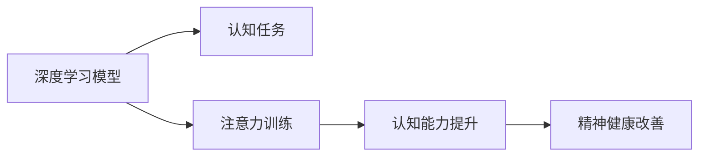

                 

# 注意力训练与大脑健康改善实践：通过专注力增强认知能力

> 关键词：注意力训练,大脑健康,认知能力,专注力提升,深度学习模型,认知神经科学,精神健康改善

## 1. 背景介绍

### 1.1 问题由来

在现代社会，人们的生活节奏日益加快，信息过载成为常态。工作、学习、生活的多重压力导致注意力下降、认知负荷加重。长期处于这种状态，不仅影响工作和学习效率，还可能导致心理压力增加、精神疾病风险上升。因此，如何通过有效训练提升注意力和认知能力，改善大脑健康，成为当前研究的热点问题。

### 1.2 问题核心关键点

注意力训练，即通过有意识的练习提升个体在特定任务上的注意水平和持续时间，进而改善认知功能和心理状态。目前，主要有两种形式的注意力训练：

1. **外部刺激注意力训练**：通过特定外部刺激（如声音、光、气味等）的反复训练，强化大脑对特定刺激的敏感性和反应速度，从而提升注意力。
2. **内部认知注意力训练**：通过内在的认知活动（如记忆、问题解决、认知推理等）的反复训练，提升大脑的认知处理能力和效率。

这两种训练方式在理论上有不同侧重点，但在实践中常结合使用。本文将重点探讨内部认知注意力训练，即通过认知任务（如记忆、问题解决等）训练提升注意力，增强认知能力。

### 1.3 问题研究意义

注意力训练和认知能力提升，对于改善大脑健康、提高生活质量具有重要意义。具体而言：

1. **提升工作效率**：通过训练提升注意力和认知能力，可以显著提升工作效率和质量，减轻职业倦怠。
2. **改善学习效果**：注意力和认知能力的提升，有助于学生更好地掌握知识，提高学习效率和成绩。
3. **促进心理健康**：注意力训练有助于缓解压力、焦虑等负面情绪，预防精神疾病的发生。
4. **支持大脑康复**：对于认知障碍和脑损伤患者，注意力训练可以显著改善其认知功能，促进康复进程。
5. **提升生活质量**：良好的认知和注意力水平，有助于更好地处理日常事务，提高生活满意度和幸福感。

本文通过深度学习模型，探索认知注意力训练的原理和操作方法，旨在为提升大脑健康和认知能力提供科学指导。

## 2. 核心概念与联系

### 2.1 核心概念概述

- **注意力（Attention）**：指个体在特定任务上集中注意力的能力。
- **认知能力（Cognitive Abilities）**：指个体进行信息处理、问题解决、记忆等认知活动的综合能力。
- **深度学习模型（Deep Learning Models）**：通过多层神经网络结构，实现对复杂数据的特征提取和模式识别，常用于处理自然语言、图像等数据。
- **认知神经科学（Cognitive Neuroscience）**：研究认知过程的神经机制，包括注意力、记忆、语言处理等。
- **精神健康改善（Mental Health Improvement）**：通过心理干预、物理训练等方式，改善心理健康状态，增强心理韧性。

这些概念之间存在紧密联系，共同构成了认知训练的理论与实践基础。通过深度学习模型，可以构建有效训练注意力的认知任务，并通过神经科学原理指导训练过程，最终实现认知能力的提升。

### 2.2 核心概念原理和架构的 Mermaid 流程图(Mermaid 流程节点中不要有括号、逗号等特殊字符)



这个流程图展示了注意力训练与认知能力提升、精神健康改善之间的内在联系。深度学习模型在认知任务设计中起关键作用，注意力训练通过认知任务提升注意力，进而提升认知能力和改善精神健康。

## 3. 核心算法原理 & 具体操作步骤
### 3.1 算法原理概述

认知注意力训练的算法原理基于认知神经科学和心理学理论。其主要目标是通过反复训练特定的认知任务，增强大脑的认知处理能力和注意力水平。

具体而言，认知注意力训练主要包含以下几个步骤：

1. **任务设计**：根据认知心理学原理，设计适合训练注意力的认知任务。
2. **模型选择**：选择合适的深度学习模型（如LSTM、RNN、Transformer等），作为认知任务的执行主体。
3. **训练优化**：通过优化深度学习模型的训练过程，提升注意力和认知能力。
4. **效果评估**：通过定期评估训练效果，调整训练策略，确保训练目标的达成。

### 3.2 算法步骤详解

#### 3.2.1 任务设计

任务设计是认知注意力训练的核心。通过设计合适的认知任务，可以有效地训练注意力和认知能力。常见的认知任务包括：

1. **记忆任务**：如记忆序列、数字记忆等，训练大脑的记忆存储和检索能力。
2. **问题解决任务**：如拼图、逻辑推理等，训练大脑的逻辑思维和推理能力。
3. **注意力集中任务**：如视觉搜索、语音识别等，训练大脑的注意力集中和转换能力。

这些任务设计的关键在于选择具有高认知负荷和挑战性的任务，以最大程度激发大脑的注意力和认知能力。

#### 3.2.2 模型选择

选择合适的深度学习模型对于训练效果至关重要。目前，常用的深度学习模型包括：

1. **循环神经网络（RNN）**：适合处理序列数据，如时间序列预测、语言处理等。
2. **卷积神经网络（CNN）**：适合处理图像数据，如视觉识别、图像处理等。
3. **自注意力模型（Transformer）**：适合处理复杂的数据结构，如自然语言处理、语音识别等。

根据任务特点选择合适的模型，可以有效提升训练效果。

#### 3.2.3 训练优化

训练优化是认知注意力训练的重要环节。主要包括以下几个方面：

1. **学习率调整**：通过调整学习率，控制模型参数的更新速度，避免过拟合或欠拟合。
2. **正则化技术**：如L2正则、Dropout等，避免模型过拟合。
3. **批处理技术**：通过批处理数据，提高训练效率。
4. **模型剪枝**：通过剪枝减少模型参数量，提高训练和推理速度。

#### 3.2.4 效果评估

效果评估是认知注意力训练的关键步骤。主要包括以下几个方面：

1. **注意力水平评估**：通过注意力任务的表现评估注意力水平的提升。
2. **认知能力评估**：通过认知任务的表现评估认知能力的提升。
3. **精神健康评估**：通过心理问卷、行为观察等方法评估精神健康状态的变化。

### 3.3 算法优缺点

认知注意力训练的算法有以下优点：

1. **高效性**：通过深度学习模型，可以高效处理复杂数据，实现快速训练。
2. **可量化**：通过评估训练效果，可以量化注意力和认知能力的提升。
3. **普适性**：适用于各种认知和注意力训练任务，具有广泛的适用性。

同时，该算法也存在一些缺点：

1. **数据依赖**：训练效果依赖于训练数据的质量和数量，数据收集成本较高。
2. **模型复杂性**：深度学习模型参数量较大，训练复杂度较高。
3. **训练周期长**：训练过程需要较长的周期，可能不适合急需提升注意力的用户。

### 3.4 算法应用领域

认知注意力训练广泛应用于心理治疗、教育培训、智能辅助等领域，具体包括：

1. **心理治疗**：通过认知任务训练，帮助精神疾病患者恢复认知和注意力功能。
2. **教育培训**：通过认知任务训练，提升学生的学习能力和效率。
3. **智能辅助**：通过认知任务训练，增强人的认知处理能力和效率，支持智能决策。

## 4. 数学模型和公式 & 详细讲解 & 举例说明

### 4.1 数学模型构建

认知注意力训练的数学模型主要基于深度学习模型，如LSTM、RNN、Transformer等。以LSTM模型为例，其数学模型构建如下：

1. **输入层**：将认知任务的数据输入到LSTM模型中，如文本、图像等。
2. **LSTM层**：通过LSTM层进行特征提取和记忆，LSTM层的数学模型如下：

$$
\begin{aligned}
& h_t = \sigma(\mathbf{W}_{xh}x_t + \mathbf{W}_{hh_{t-1}}h_{t-1} + b_h) \\
& \tilde{c}_t = \tanh(\mathbf{W}_{xh}x_t + \mathbf{U}_{hh_{t-1}}h_{t-1} + b_h) \\
& c_t = c_{t-1} \odot \sigma(\mathbf{W}_{xh}x_t + \mathbf{U}_{hh_{t-1}}h_{t-1} + b_h) + \tilde{c}_t \\
& o_t = \sigma(\mathbf{W}_{xh}x_t + \mathbf{U}_{hh_{t-1}}h_{t-1} + b_h) \\
& h_t = o_t \odot \tanh(c_t)
\end{aligned}
$$

其中，$x_t$ 为输入，$h_t$ 为当前时刻的隐藏状态，$c_t$ 为记忆细胞，$o_t$ 为门控信号，$\mathbf{W}$、$\mathbf{U}$、$b$ 为模型参数。

3. **输出层**：通过输出层输出认知任务的结果，如分类、预测等。

### 4.2 公式推导过程

以LSTM模型为例，其推导过程如下：

1. **输入门**：计算输入门的激活函数，如sigmoid函数，用于控制当前输入对记忆的影响。
2. **遗忘门**：计算遗忘门的激活函数，如sigmoid函数，用于控制当前记忆的状态。
3. **记忆单元**：通过LSTM层和遗忘门计算当前时刻的记忆单元$c_t$。
4. **输出门**：计算输出门的激活函数，如sigmoid函数，用于控制当前记忆的输出。
5. **当前状态**：通过输出门和记忆单元计算当前状态的输出。

### 4.3 案例分析与讲解

以记忆任务为例，通过LSTM模型进行训练：

1. **任务定义**：给定一段文本序列，要求记忆序列中的特定信息，并给出相应的输出。
2. **模型输入**：将文本序列输入到LSTM模型中，进行特征提取和记忆。
3. **训练过程**：通过反向传播算法更新模型参数，最小化预测输出与真实标签之间的差异。
4. **效果评估**：通过评估模型在测试集上的表现，判断训练效果。

## 5. 项目实践：代码实例和详细解释说明

### 5.1 开发环境搭建

要搭建深度学习模型的开发环境，需要安装Python和相关的深度学习库。具体步骤如下：

1. **安装Python**：从官网下载并安装Python，建议使用Anaconda，便于管理依赖包。
2. **安装深度学习库**：安装TensorFlow、Keras、PyTorch等深度学习库，使用pip命令即可。
3. **设置环境变量**：设置Python路径和深度学习库路径，方便后续开发。

### 5.2 源代码详细实现

以下是使用Keras框架进行LSTM模型训练的Python代码实现：

```python
from keras.models import Sequential
from keras.layers import LSTM, Dense, Dropout
from keras.optimizers import Adam
from keras.callbacks import EarlyStopping

# 定义LSTM模型
model = Sequential()
model.add(LSTM(128, input_shape=(None, 1)))
model.add(Dense(1, activation='sigmoid'))
model.compile(loss='binary_crossentropy', optimizer=Adam(), metrics=['accuracy'])

# 加载数据
X_train, y_train = ...
X_test, y_test = ...

# 训练模型
early_stopping = EarlyStopping(patience=10)
model.fit(X_train, y_train, batch_size=32, epochs=50, validation_data=(X_test, y_test), callbacks=[early_stopping])

# 评估模型
loss, accuracy = model.evaluate(X_test, y_test)
print('Test loss:', loss)
print('Test accuracy:', accuracy)
```

### 5.3 代码解读与分析

以上代码实现了LSTM模型在认知任务上的训练和评估。具体解读如下：

1. **定义模型**：使用Keras框架定义LSTM模型，包含一个LSTM层和一个全连接层，用于二分类任务。
2. **编译模型**：设置模型的损失函数、优化器和评估指标。
3. **加载数据**：从文件中加载训练和测试数据，可以使用Pandas库进行处理。
4. **训练模型**：设置早停策略，防止过拟合，进行模型训练。
5. **评估模型**：使用测试数据评估模型性能，输出测试集上的损失和准确率。

## 6. 实际应用场景

### 6.1 精神健康改善

认知注意力训练在精神健康改善方面具有重要应用。例如，抑郁症和焦虑症患者通过认知任务训练，可以提升注意力和情绪管理能力，减轻症状。训练过程通常包括以下步骤：

1. **任务设计**：选择具有较高认知负荷的任务，如记忆序列、拼图等。
2. **模型选择**：选择合适的深度学习模型，如LSTM或Transformer。
3. **训练优化**：调整学习率、正则化参数等，优化训练过程。
4. **效果评估**：通过精神状态问卷、行为观察等方法评估训练效果。

### 6.2 教育培训

认知注意力训练在教育培训中也有广泛应用。例如，通过认知任务训练，提升学生的学习能力和效率，减轻学业压力。具体步骤如下：

1. **任务设计**：选择适合不同学科和年级的认知任务，如数学解题、记忆单词等。
2. **模型选择**：根据任务特点选择合适的深度学习模型。
3. **训练优化**：优化训练过程，提升训练效果。
4. **效果评估**：通过测试成绩、学习反馈等方法评估训练效果。

### 6.3 智能辅助

认知注意力训练在智能辅助领域也有重要应用。例如，通过认知任务训练，增强人的认知处理能力和效率，支持智能决策和任务自动化。具体步骤如下：

1. **任务设计**：设计具有较高认知负荷的任务，如数据分析、问题解决等。
2. **模型选择**：选择合适的深度学习模型，如LSTM或Transformer。
3. **训练优化**：优化训练过程，提升训练效果。
4. **效果评估**：通过任务完成时间和准确率等方法评估训练效果。

## 7. 工具和资源推荐

### 7.1 学习资源推荐

为了帮助开发者系统掌握认知注意力训练的理论基础和实践技巧，这里推荐一些优质的学习资源：

1. **《深度学习入门》系列书籍**：深入浅出地介绍了深度学习的基本概念和前沿技术，适合初学者入门。
2. **Coursera《深度学习专项课程》**：由斯坦福大学开设的深度学习课程，涵盖深度学习的基础知识和实践技能。
3. **《认知心理学》教材**：系统介绍认知心理学的基本理论和应用方法，适合进一步学习认知注意力训练的原理。
4. **Kaggle认知注意力训练竞赛**：参加认知注意力训练竞赛，实践认知任务设计和深度学习模型训练，提升实践能力。

### 7.2 开发工具推荐

高效的开发离不开优秀的工具支持。以下是几款用于认知注意力训练开发的常用工具：

1. **Anaconda**：开源的Python环境管理工具，方便安装和管理依赖库。
2. **TensorFlow**：开源的深度学习框架，支持分布式计算，适合大规模训练。
3. **Keras**：简单易用的深度学习框架，适合快速迭代研究。
4. **TensorBoard**：TensorFlow的可视化工具，用于监测训练过程和评估模型性能。
5. **Jupyter Notebook**：开源的交互式编程工具，支持多种编程语言，方便快速实验。

合理利用这些工具，可以显著提升认知注意力训练的开发效率，加快创新迭代的步伐。

### 7.3 相关论文推荐

认知注意力训练的研究源于学界的持续研究。以下是几篇奠基性的相关论文，推荐阅读：

1. **Attention is All You Need**：提出了Transformer模型，实现了基于自注意力的注意力训练。
2. **Learning to Execute**：提出了通过执行器（Exeutor）进行认知任务训练的方法。
3. **Mental Training Effects on Cognitive and Affective Processes**：系统综述了认知注意力训练对认知和情感的影响，提供了丰富的实验数据和理论支持。

## 8. 总结：未来发展趋势与挑战

### 8.1 研究成果总结

本文系统介绍了认知注意力训练的原理和操作步骤，探讨了深度学习模型在认知任务设计中的应用，并通过具体代码实例和案例分析，展示了认知注意力训练的实际效果。

### 8.2 未来发展趋势

未来，认知注意力训练技术将呈现以下几个发展趋势：

1. **模型结构优化**：随着深度学习模型的不断发展，将涌现更多高效、轻量级的模型结构，提升训练和推理效率。
2. **任务设计多样化**：通过更加多样化的任务设计，提升认知注意力训练的覆盖面和适应性。
3. **跨模态训练**：结合图像、声音、文本等多模态数据，实现更全面、更深入的认知训练。
4. **神经科学指导**：进一步结合神经科学原理，优化训练过程，提升训练效果。
5. **个性化训练**：根据个体差异和需求，设计个性化认知任务，提升训练效果。

### 8.3 面临的挑战

尽管认知注意力训练技术已经取得了一定进展，但在迈向更加智能化、普适化应用的过程中，仍面临以下挑战：

1. **数据收集难度**：高认知负荷任务的设计和数据收集成本较高。
2. **模型复杂度**：深度学习模型参数量较大，训练和推理复杂度较高。
3. **训练效果评估**：认知注意力训练效果的评估方法较为复杂，难以量化。
4. **训练时间周期长**：认知注意力训练通常需要较长的训练周期，不适合急需提升注意力的用户。

### 8.4 研究展望

未来研究应在以下几个方面寻求新的突破：

1. **数据收集自动化**：开发自动化的数据收集工具，降低高认知负荷任务设计的难度。
2. **模型结构简化**：开发更高效的模型结构，提升训练和推理效率。
3. **神经科学结合**：进一步结合神经科学原理，优化训练过程。
4. **个性化训练**：设计更加个性化的认知任务，提升训练效果。
5. **跨学科研究**：结合心理学、神经科学、教育学等多个学科，深入研究认知注意力训练的原理和应用。

综上所述，认知注意力训练技术具有广阔的应用前景，但实现其大规模应用仍需克服诸多挑战。通过不断的技术创新和跨学科合作，未来认知注意力训练必将带来更加深远的社会和科学影响。

## 9. 附录：常见问题与解答

### Q1：认知注意力训练是否适合所有人？

A: 认知注意力训练适合大多数人群，尤其是有注意力分散、认知功能减退等问题的人群。但对于一些特殊人群（如神经发育障碍患者），需要根据个体情况谨慎选择训练方法和强度。

### Q2：如何设计适合认知注意力训练的任务？

A: 设计适合认知注意力训练的任务需要遵循以下原则：
1. 任务具有较高认知负荷，需要集中注意力和持续努力。
2. 任务具有挑战性，能够持续激发大脑的认知处理能力。
3. 任务与日常生活相关，便于推广和应用。

### Q3：认知注意力训练的效果如何评估？

A: 认知注意力训练的效果可以通过以下方式评估：
1. 认知能力测试：通过标准化认知测试评估认知能力的提升。
2. 行为观察：通过观察训练后的行为变化，评估注意力和认知能力的提升。
3. 自我报告：通过问卷调查，收集用户对训练效果的反馈。

### Q4：认知注意力训练需要多久才能见效？

A: 认知注意力训练的效果通常需要持续数周或数月才能显现。训练效果取决于任务的难度、学习频率、个体的认知基础等因素。因此，需要长期坚持训练，才能获得显著的效果。

### Q5：认知注意力训练是否会造成过劳？

A: 认知注意力训练本身不会造成过劳，但过度训练可能会带来负面影响。因此，需要合理安排训练强度和时间，避免疲劳和过度训练。

---

作者：禅与计算机程序设计艺术 / Zen and the Art of Computer Programming

