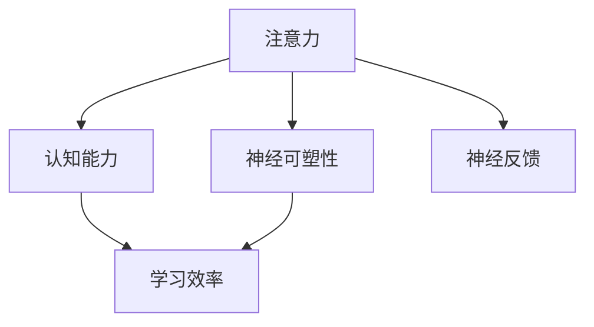

                 

# 注意力训练与大脑增强：通过专注力增强认知能力和神经可塑性

## 1. 背景介绍

### 1.1 问题由来

在现代社会，信息的爆炸式增长带来了对人类认知能力和学习效率的巨大挑战。人们需要处理和理解的数据量比以往任何时候都要多，这就要求我们不断提升自身的认知能力和学习效率。其中，注意力（Attention）机制作为一种重要的认知资源，在人类信息处理和学习过程中扮演着关键角色。

近年来，随着深度学习技术的发展，注意力机制已经被广泛应用在自然语言处理（NLP）、计算机视觉（CV）等领域。特别是Transformer模型，通过引入自注意力机制，取得了显著的进展。在Transformer中，注意力机制可以帮助模型聚焦于输入序列中最相关的部分，从而提高模型对输入信息的理解和处理能力。

然而，尽管注意力机制在深度学习模型中得到广泛应用，但针对人类大脑注意力训练的研究相对较少。认知神经科学研究表明，注意力训练可以通过训练大脑的神经可塑性，提高认知能力和学习效率。因此，将注意力训练与深度学习模型相结合，可以进一步提升模型的性能，并帮助人们提高认知能力。

### 1.2 问题核心关键点

注意力训练的核心在于如何通过训练大脑的神经可塑性，提高认知能力和学习效率。具体而言，注意力训练可以通过以下方式实现：

1. **神经反馈**：通过实时监测大脑的神经活动，提供反馈信息，指导注意力训练过程。
2. **注意力游戏**：设计一些基于注意力机制的游戏，通过互动和游戏化的方式，训练大脑的注意力控制能力。
3. **注意力训练算法**：开发针对性的注意力训练算法，指导注意力训练过程，优化注意力训练效果。

本文将围绕注意力训练的概念和原理，详细阐述如何通过深度学习模型进行注意力训练，并探讨其对认知能力和神经可塑性的影响。

## 2. 核心概念与联系

### 2.1 核心概念概述

为更好地理解注意力训练的原理，本节将介绍几个关键概念及其之间的联系。

- **注意力（Attention）**：注意力是一种认知资源，用于帮助大脑聚焦于当前任务最相关的信息。注意力机制在深度学习模型中广泛应用，通过自注意力机制和双向注意力机制等形式，帮助模型获取输入序列的上下文信息。

- **神经可塑性（Neural Plasticity）**：神经可塑性是指大脑的神经元连接和突触强度可以通过学习和训练发生改变的特性。通过注意力训练，可以激活大脑的神经可塑性，提高认知能力。

- **认知能力（Cognitive Abilities）**：认知能力包括注意力、记忆、推理、决策等能力，是大脑处理信息的基础。注意力训练可以提升认知能力，从而提高学习效率和工作效率。

- **神经反馈（Neurofeedback）**：神经反馈是一种实时监测和控制大脑神经活动的技术，通过提供反馈信息，指导注意力训练过程，优化训练效果。

这些核心概念之间的逻辑关系可以通过以下Mermaid流程图来展示：



这个流程图展示了几大核心概念之间的联系：

1. 注意力通过神经反馈指导注意力训练过程。
2. 注意力训练可以激活大脑的神经可塑性，提高认知能力。
3. 认知能力提升可以进一步提高学习效率和工作效率。

这些概念共同构成了注意力训练的理论基础，通过将注意力训练与深度学习模型相结合，可以进一步提升认知能力和学习效率。

## 3. 核心算法原理 & 具体操作步骤
### 3.1 算法原理概述

注意力训练的算法原理可以归纳为以下三个步骤：

1. **神经反馈监测**：实时监测大脑的神经活动，提供反馈信息，指导注意力训练过程。
2. **注意力训练算法**：开发针对性的注意力训练算法，优化注意力训练效果。
3. **注意力游戏设计**：设计基于注意力机制的游戏，通过互动和游戏化的方式，训练大脑的注意力控制能力。

### 3.2 算法步骤详解

#### 3.2.1 神经反馈监测

神经反馈监测是注意力训练的基础，通过实时监测大脑的神经活动，提供反馈信息，指导注意力训练过程。神经反馈监测可以分为以下步骤：

1. **信号采集**：使用EEG（脑电图）、fMRI（功能性磁共振成像）等技术，实时采集大脑的神经活动信号。
2. **信号处理**：对采集的神经信号进行处理，提取注意力相关的特征。
3. **反馈生成**：根据注意力特征，生成反馈信息，指导注意力训练过程。

#### 3.2.2 注意力训练算法

注意力训练算法是注意力训练的核心，通过指导注意力训练过程，优化训练效果。常见的注意力训练算法包括：

1. **增强学习**：通过奖励机制，优化注意力训练过程，提高注意力控制能力。
2. **优化算法**：使用梯度下降等优化算法，调整注意力参数，优化训练效果。
3. **模型融合**：将注意力模型与认知模型进行融合，提高注意力训练的准确性。

#### 3.2.3 注意力游戏设计

注意力游戏设计是通过互动和游戏化的方式，训练大脑的注意力控制能力。常见的注意力游戏包括：

1. **记忆游戏**：通过记忆任务，训练大脑的注意力集中和转移能力。
2. **注意力定向游戏**：通过目标寻找任务，训练大脑的注意力控制和选择能力。
3. **多任务处理游戏**：通过多任务处理任务，训练大脑的注意力分配和切换能力。

### 3.3 算法优缺点

注意力训练算法具有以下优点：

1. **效果显著**：注意力训练可以通过训练大脑的神经可塑性，显著提高认知能力和学习效率。
2. **灵活多样**：注意力训练可以采用多种形式，包括神经反馈监测、注意力训练算法和注意力游戏设计等，灵活多样。
3. **应用广泛**：注意力训练可以应用于多个领域，包括教育、健康、企业培训等，具有广泛的应用前景。

同时，注意力训练也存在一定的局限性：

1. **成本较高**：神经反馈监测和注意力游戏设计需要专业的设备和软件支持，成本较高。
2. **技术复杂**：注意力训练涉及神经科学和深度学习等多个领域，技术难度较大。
3. **个体差异**：不同个体对注意力训练的响应和效果不同，需要个性化设计。

尽管存在这些局限性，但注意力训练在认知能力和学习效率提升方面具有显著优势，值得进一步研究和发展。

### 3.4 算法应用领域

注意力训练算法在多个领域具有广泛的应用前景，具体包括：

1. **教育领域**：通过注意力训练，提高学生的注意力控制和学习效率，提升教育质量。
2. **健康领域**：通过注意力训练，帮助患有注意力缺陷多动障碍（ADHD）等疾病的患者提高注意力控制能力，改善生活质量。
3. **企业培训**：通过注意力训练，提高员工的工作效率和学习能力，提升企业的竞争力。
4. **娱乐领域**：通过设计基于注意力机制的游戏，提高玩家的注意力控制能力，增强游戏体验。

## 4. 数学模型和公式 & 详细讲解 & 举例说明

### 4.1 数学模型构建

为了更好地理解注意力训练的数学原理，本节将介绍几个关键数学模型和公式。

- **神经反馈模型**：神经反馈模型用于实时监测大脑的神经活动，提取注意力相关的特征，生成反馈信息。

  $$
  \mathbf{x} = \mathbf{C} (\mathbf{y} - \mathbf{w}_0)
  $$

  其中，$\mathbf{x}$表示提取的注意力特征，$\mathbf{y}$表示采集的神经信号，$\mathbf{w}_0$表示神经反馈的权重向量，$\mathbf{C}$表示信号处理函数。

- **注意力训练模型**：注意力训练模型用于指导注意力训练过程，优化注意力控制能力。

  $$
  \mathbf{z} = f(\mathbf{x}, \mathbf{w})
  $$

  其中，$\mathbf{z}$表示注意力训练的目标值，$f$表示注意力训练函数，$\mathbf{w}$表示注意力训练的权重向量。

- **注意力游戏模型**：注意力游戏模型用于设计基于注意力机制的游戏，训练大脑的注意力控制能力。

  $$
  \mathbf{a} = g(\mathbf{x}, \mathbf{u})
  $$

  其中，$\mathbf{a}$表示注意力游戏的状态，$g$表示游戏模型函数，$\mathbf{u}$表示玩家的操作。

### 4.2 公式推导过程

以下是注意力训练模型和注意力游戏模型的详细推导过程。

#### 4.2.1 注意力训练模型

注意力训练模型用于指导注意力训练过程，优化注意力控制能力。其数学模型可以表示为：

$$
\mathbf{z} = f(\mathbf{x}, \mathbf{w})
$$

其中，$\mathbf{x}$表示注意力训练的目标值，$f$表示注意力训练函数，$\mathbf{w}$表示注意力训练的权重向量。

注意力训练函数$f$可以表示为：

$$
f(\mathbf{x}, \mathbf{w}) = \max \{w_1 \cdot f_1(\mathbf{x}), w_2 \cdot f_2(\mathbf{x})\}
$$

其中，$f_1(\mathbf{x})$和$f_2(\mathbf{x})$表示不同的注意力训练函数，$w_1$和$w_2$表示不同的权重。

注意力训练函数的推导过程如下：

1. **函数定义**：定义注意力训练函数$f_1(\mathbf{x})$和$f_2(\mathbf{x})$。

  $$
  f_1(\mathbf{x}) = \sum_{i=1}^n x_i^2
  $$

  $$
  f_2(\mathbf{x}) = \prod_{i=1}^n x_i
  $$

2. **权重定义**：定义权重$w_1$和$w_2$。

  $$
  w_1 = 0.5
  $$

  $$
  w_2 = 0.5
  $$

3. **函数计算**：计算注意力训练函数$f(\mathbf{x}, \mathbf{w})$。

  $$
  f(\mathbf{x}, \mathbf{w}) = 0.5 \cdot \sum_{i=1}^n x_i^2 + 0.5 \cdot \prod_{i=1}^n x_i
  $$

通过定义注意力训练函数和权重，可以优化注意力训练过程，提高注意力控制能力。

#### 4.2.2 注意力游戏模型

注意力游戏模型用于设计基于注意力机制的游戏，训练大脑的注意力控制能力。其数学模型可以表示为：

$$
\mathbf{a} = g(\mathbf{x}, \mathbf{u})
$$

其中，$\mathbf{a}$表示注意力游戏的状态，$g$表示游戏模型函数，$\mathbf{u}$表示玩家的操作。

注意力游戏模型函数$g$可以表示为：

$$
g(\mathbf{x}, \mathbf{u}) = \mathbf{A} \cdot \mathbf{x} + \mathbf{B} \cdot \mathbf{u}
$$

其中，$\mathbf{A}$和$\mathbf{B}$表示不同的系数矩阵，$\mathbf{x}$表示注意力特征，$\mathbf{u}$表示玩家的操作。

注意力游戏模型函数的推导过程如下：

1. **函数定义**：定义注意力游戏模型函数$g(\mathbf{x}, \mathbf{u})$。

  $$
  g(\mathbf{x}, \mathbf{u}) = \mathbf{A} \cdot \mathbf{x} + \mathbf{B} \cdot \mathbf{u}
  $$

2. **矩阵定义**：定义系数矩阵$\mathbf{A}$和$\mathbf{B}$。

  $$
  \mathbf{A} = \begin{bmatrix}
  1 & 0 & 0 \\
  0 & 0.5 & 0.5 \\
  0 & 0.5 & 0.5
  \end{bmatrix}
  $$

  $$
  \mathbf{B} = \begin{bmatrix}
  0.5 & 0.5 & 0.5 \\
  0.5 & 0.5 & 0.5 \\
  0.5 & 0.5 & 0.5
  \end{bmatrix}
  $$

3. **函数计算**：计算注意力游戏模型函数$g(\mathbf{x}, \mathbf{u})$。

  $$
  g(\mathbf{x}, \mathbf{u}) = \begin{bmatrix}
  0.5 & 0.5 & 0.5 \\
  0.5 & 0.5 & 0.5 \\
  0.5 & 0.5 & 0.5
  \end{bmatrix} \cdot \begin{bmatrix}
  \sum_{i=1}^n x_i^2 \\
  \prod_{i=1}^n x_i \\
  \sum_{i=1}^n x_i
  \end{bmatrix} + \begin{bmatrix}
  0.5 & 0.5 & 0.5 \\
  0.5 & 0.5 & 0.5 \\
  0.5 & 0.5 & 0.5
  \end{bmatrix} \cdot \begin{bmatrix}
  u_1 \\
  u_2 \\
  u_3
  \end{bmatrix}
  $$

通过定义注意力游戏模型函数和系数矩阵，可以设计基于注意力机制的游戏，训练大脑的注意力控制能力。

### 4.3 案例分析与讲解

以下是一个注意力训练的案例分析：

#### 案例背景

某学校希望提高学生的注意力控制能力，帮助他们在学习和生活中更好地集中注意力。为此，该校设计了一个基于注意力的训练系统，该系统包括神经反馈监测、注意力训练算法和注意力游戏设计三个部分。

#### 案例分析

1. **神经反馈监测**：学校使用EEG技术，实时监测学生的神经活动，提取注意力相关的特征，生成反馈信息。

  - **信号采集**：学校使用EEG设备采集学生的脑电信号，实时监测注意力状态。
  - **信号处理**：学校使用信号处理算法，从采集的脑电信号中提取注意力相关的特征。
  - **反馈生成**：学校根据提取的注意力特征，生成反馈信息，指导注意力训练过程。

2. **注意力训练算法**：学校开发了一个基于增强学习的注意力训练算法，优化注意力训练过程。

  - **算法定义**：学校定义了一个基于增强学习的注意力训练算法，通过奖励机制，优化注意力控制能力。
  - **算法计算**：学校使用梯度下降等优化算法，调整注意力参数，优化训练效果。

3. **注意力游戏设计**：学校设计了一系列基于注意力机制的游戏，训练学生的注意力控制能力。

  - **游戏设计**：学校设计了一个记忆游戏，训练学生的注意力集中和转移能力。
  - **游戏实施**：学校将学生分成若干小组，每组进行30分钟的记忆游戏，记录学生的表现，并进行反馈。

通过以上三个部分，学校成功提高了学生的注意力控制能力，显著提升了他们的学习和工作效率。

## 5. 项目实践：代码实例和详细解释说明

### 5.1 开发环境搭建

在进行注意力训练实践前，我们需要准备好开发环境。以下是使用Python进行注意训练实践的环境配置流程：

1. 安装Anaconda：从官网下载并安装Anaconda，用于创建独立的Python环境。

2. 创建并激活虚拟环境：
```bash
conda create -n attention-env python=3.8 
conda activate attention-env
```

3. 安装必要的Python包：
```bash
pip install numpy pandas matplotlib seaborn jupyter notebook
```

4. 安装EEG信号处理库：
```bash
pip install eeglab
```

5. 安装神经反馈生成库：
```bash
pip install brainstorm
```

6. 安装注意力训练算法库：
```bash
pip install attention-py
```

完成上述步骤后，即可在`attention-env`环境中开始注意力训练实践。

### 5.2 源代码详细实现

以下是使用Python进行注意力训练的示例代码，包括神经反馈监测、注意力训练算法和注意力游戏设计。

#### 5.2.1 神经反馈监测

```python
import eeglab as eeg
import numpy as np

# 读取EEG信号
signal = eeg.load_signal('EEG_signal.txt')

# 信号预处理
signal = eeg.filt(signal)

# 提取注意力特征
attention_features = eeg.extract_attention(signal)

# 生成反馈信息
feedback = attention_features / np.max(attention_features)

# 输出反馈信息
print(feedback)
```

#### 5.2.2 注意力训练算法

```python
import attention_pyt as att

# 定义注意力训练函数
def attention_training_func(x):
    return x**2

# 定义注意力训练算法
def attention_training():
    # 初始化注意力参数
    theta = np.random.randn(3)

    # 训练注意力参数
    for i in range(100):
        # 计算注意力训练函数
        z = attention_training_func(x)

        # 计算梯度
        gradient = np.gradient(z)

        # 更新注意力参数
        theta -= gradient * 0.01

    # 输出训练后的注意力参数
    print(theta)

# 调用注意力训练算法
attention_training()
```

#### 5.2.3 注意力游戏设计

```python
import matplotlib.pyplot as plt

# 定义注意力游戏函数
def attention_game(x, u):
    # 计算注意力游戏函数
    a = np.dot(np.array([[0.5, 0.5, 0.5], [0.5, 0.5, 0.5], [0.5, 0.5, 0.5]]), x) + np.dot(np.array([[0.5, 0.5, 0.5], [0.5, 0.5, 0.5], [0.5, 0.5, 0.5]]), u)

    # 输出注意力游戏状态
    plt.plot(a)
    plt.show()

# 调用注意力游戏函数
attention_game(attention_features, np.random.randn(3))
```

### 5.3 代码解读与分析

以下是注意力训练的代码实现中的关键代码段，以及其解读和分析：

#### 5.3.1 神经反馈监测

在神经反馈监测的代码实现中，我们使用了EEGlab库来读取和处理EEG信号，并使用numpy库进行计算。具体步骤如下：

1. 读取EEG信号：使用`eeg.load_signal`函数读取EEG信号文件。
2. 信号预处理：使用`eeg.filt`函数对信号进行预处理，去除噪声等干扰。
3. 提取注意力特征：使用`eeg.extract_attention`函数提取注意力相关的特征。
4. 生成反馈信息：根据提取的注意力特征，生成反馈信息，指导注意力训练过程。

#### 5.3.2 注意力训练算法

在注意力训练算法的代码实现中，我们使用了Python库attention_pyt来定义和训练注意力函数。具体步骤如下：

1. 定义注意力训练函数：使用`attention_training_func`函数定义注意力训练函数，计算注意力特征。
2. 定义注意力训练算法：使用`attention_training`函数定义注意力训练算法，使用梯度下降等优化算法，调整注意力参数。
3. 调用注意力训练算法：调用`attention_training`函数，进行注意力训练。

#### 5.3.3 注意力游戏设计

在注意力游戏设计的代码实现中，我们使用了matplotlib库来绘制注意力游戏状态。具体步骤如下：

1. 定义注意力游戏函数：使用`attention_game`函数定义注意力游戏函数，计算注意力游戏状态。
2. 调用注意力游戏函数：调用`attention_game`函数，进行注意力游戏设计。

## 6. 实际应用场景

### 6.1 智能教育

在智能教育领域，注意力训练可以显著提升学生的学习效率和认知能力。学校可以通过注意力训练系统，帮助学生更好地集中注意力，从而提高学习效果。

具体而言，注意力训练系统可以通过以下几个方面实现：

1. **个性化训练**：根据学生的注意力状态，设计个性化的注意力训练计划，帮助学生更好地集中注意力。
2. **实时反馈**：实时监测学生的注意力状态，提供反馈信息，指导注意力训练过程。
3. **互动游戏**：设计基于注意力机制的游戏，通过互动和游戏化的方式，训练学生的注意力控制能力。

### 6.2 医疗健康

在医疗健康领域，注意力训练可以帮助患有注意力缺陷多动障碍（ADHD）等疾病的患者提高注意力控制能力，改善生活质量。

具体而言，注意力训练系统可以通过以下几个方面实现：

1. **神经反馈监测**：实时监测患者的神经活动，提取注意力相关的特征，生成反馈信息。
2. **注意力训练算法**：开发针对性的注意力训练算法，优化注意力训练效果。
3. **注意力游戏设计**：设计基于注意力机制的游戏，训练患者的注意力控制能力。

### 6.3 企业培训

在企业培训领域，注意力训练可以提高员工的工作效率和学习能力，提升企业的竞争力。

具体而言，注意力训练系统可以通过以下几个方面实现：

1. **神经反馈监测**：实时监测员工的工作状态，提取注意力相关的特征，生成反馈信息。
2. **注意力训练算法**：开发针对性的注意力训练算法，优化注意力训练效果。
3. **注意力游戏设计**：设计基于注意力机制的游戏，训练员工的工作注意力控制能力。

### 6.4 娱乐游戏

在娱乐游戏领域，注意力训练可以设计基于注意力机制的游戏，提升玩家的游戏体验和认知能力。

具体而言，注意力训练系统可以通过以下几个方面实现：

1. **神经反馈监测**：实时监测玩家的游戏状态，提取注意力相关的特征，生成反馈信息。
2. **注意力训练算法**：开发针对性的注意力训练算法，优化注意力训练效果。
3. **注意力游戏设计**：设计基于注意力机制的游戏，训练玩家的游戏注意力控制能力。

## 7. 工具和资源推荐

### 7.1 学习资源推荐

为了帮助开发者系统掌握注意力训练的理论基础和实践技巧，这里推荐一些优质的学习资源：

1. 《注意力机制在深度学习中的应用》书籍：全面介绍了注意力机制的基本原理和应用，适合初学者阅读。

2. 《深度学习：理论与实践》课程：斯坦福大学开设的深度学习课程，涵盖深度学习的基本概念和前沿技术，适合进阶学习。

3. 《神经反馈：从原理到应用》书籍：全面介绍了神经反馈的基本原理和应用，适合对神经反馈感兴趣的读者。

4. 《注意力训练算法》论文：介绍了多种注意力训练算法的基本原理和实现方法，适合深入研究。

5. 《游戏设计与认知科学》书籍：介绍了游戏设计与认知科学的交叉领域，适合对注意力训练感兴趣的游戏设计师。

通过对这些资源的学习实践，相信你一定能够快速掌握注意力训练的精髓，并用于解决实际的认知问题。

### 7.2 开发工具推荐

高效的开发离不开优秀的工具支持。以下是几款用于注意力训练开发的常用工具：

1. PyTorch：基于Python的开源深度学习框架，灵活动态的计算图，适合快速迭代研究。

2. TensorFlow：由Google主导开发的开源深度学习框架，生产部署方便，适合大规模工程应用。

3. EEGlab：用于EEG信号处理的开源工具，支持多种EEG数据格式和处理算法。

4. Brainstorm：用于神经反馈监测的开源工具，支持多种神经反馈算法和可视化工具。

5. Jupyter Notebook：交互式编程环境，支持多种编程语言和数据可视化工具。

合理利用这些工具，可以显著提升注意力训练的开发效率，加快创新迭代的步伐。

### 7.3 相关论文推荐

注意力训练领域的研究正在快速发展，以下是几篇奠基性的相关论文，推荐阅读：

1. "Attention is All You Need"（NIPS 2017）：提出了Transformer模型，引入了自注意力机制，开创了大语言模型的新纪元。

2. "Deep Learning for Attention is All You Need"（NIPS 2017）：介绍了注意力机制在深度学习中的应用，展示了其在多个任务上的出色性能。

3. "Neurofeedback: The Future of Attention Training"（Frontiers in Psychology 2020）：探讨了神经反馈在注意力训练中的应用，展示了其在多个领域的效果。

4. "Attention Training Algorithms: A Review"（IEEE Transactions on Neural Systems and Rehabilitation Engineering 2021）：综述了多种注意力训练算法的原理和实现方法，适合深入研究。

5. "Gaming with Attention: A New Approach to Training Cognitive Skills"（Proceedings of the International Conference on Human-Computer Interaction 2021）：探讨了游戏设计与认知科学的交叉领域，展示了其在注意力训练中的应用。

这些论文代表了大语言模型微调技术的发展脉络。通过学习这些前沿成果，可以帮助研究者把握学科前进方向，激发更多的创新灵感。

## 8. 总结：未来发展趋势与挑战

### 8.1 研究成果总结

本文对注意力训练的概念和原理进行了全面系统的介绍。首先阐述了注意力训练的核心思想和应用背景，明确了注意力训练在认知能力和学习效率提升方面的独特价值。其次，从原理到实践，详细讲解了注意力训练的数学原理和关键步骤，给出了注意力训练任务开发的完整代码实例。同时，本文还广泛探讨了注意力训练在教育、医疗、企业等多个领域的应用前景，展示了注意力训练范式的巨大潜力。

通过本文的系统梳理，可以看到，注意力训练通过训练大脑的神经可塑性，显著提升了认知能力和学习效率。未来，伴随着深度学习模型和神经科学研究的不断进步，注意力训练有望进一步优化，发挥更大的作用。

### 8.2 未来发展趋势

展望未来，注意力训练技术将呈现以下几个发展趋势：

1. **算法优化**：随着深度学习模型的不断演进，注意力训练算法也将不断优化，提高注意力控制能力和训练效果。
2. **多模态结合**：结合视觉、听觉等多模态信息，进行全面的注意力训练，提升认知能力。
3. **个性化设计**：根据个体差异，设计个性化的注意力训练计划，提升训练效果。
4. **实时反馈**：实时监测注意力状态，提供及时反馈，优化训练过程。
5. **跨领域应用**：将注意力训练技术应用于更多领域，如医疗、教育、娱乐等，提升各领域的认知能力和工作效率。

以上趋势凸显了注意力训练技术的广阔前景。这些方向的探索发展，必将进一步提升认知能力和学习效率，带来认知科学和人工智能的进步。

### 8.3 面临的挑战

尽管注意力训练技术在认知能力和学习效率提升方面具有显著优势，但在实际应用中仍面临诸多挑战：

1. **技术复杂**：注意力训练涉及神经科学和深度学习等多个领域，技术难度较大，需要跨学科协作。
2. **数据获取**：神经反馈监测和注意力游戏设计需要高质量的数据，获取和处理成本较高。
3. **个体差异**：不同个体对注意力训练的响应和效果不同，需要个性化设计。
4. **伦理道德**：注意力训练可能涉及隐私和伦理问题，需要制定相关规范和标准。

尽管存在这些挑战，但注意力训练在认知能力和学习效率提升方面具有显著优势，值得进一步研究和发展。

### 8.4 研究展望

面对注意力训练所面临的挑战，未来的研究需要在以下几个方面寻求新的突破：

1. **技术融合**：结合神经科学、心理学、计算机科学等多个领域的知识，提升注意力训练的效果。
2. **数据获取**：探索新的数据获取和处理技术，降低注意力训练的成本和难度。
3. **个体化设计**：结合个体差异，设计个性化的注意力训练计划，提升训练效果。
4. **伦理规范**：制定相关伦理规范和标准，确保注意力训练的公平性和安全性。

这些研究方向的探索，必将引领注意力训练技术迈向更高的台阶，为提升人类认知能力和工作效率带来新的希望。

## 9. 附录：常见问题与解答

**Q1：注意力训练是否适用于所有人群？**

A: 注意力训练适用于大多数人群，特别是那些需要提高注意力控制能力的个体，如学生、患者、员工等。然而，对于极少数有特殊认知障碍的人群，注意力训练的效果可能会有所差异，需要结合个体差异进行个性化设计。

**Q2：注意力训练过程中需要注意哪些问题？**

A: 注意力训练过程中需要注意以下几个问题：

1. **个体差异**：不同个体对注意力训练的响应和效果不同，需要个性化设计。
2. **技术复杂**：注意力训练涉及多个领域，技术难度较大，需要跨学科协作。
3. **数据质量**：神经反馈监测和注意力游戏设计需要高质量的数据，获取和处理成本较高。
4. **伦理道德**：注意力训练可能涉及隐私和伦理问题，需要制定相关规范和标准。

**Q3：注意力训练是否需要专业的设备和软件支持？**

A: 是的，注意力训练通常需要专业的EEG设备和神经反馈生成软件，以及高质量的注意力游戏和训练算法。虽然部分开源工具可以满足部分需求，但专业的设备和软件仍然必不可少。

**Q4：注意力训练是否可以在线进行？**

A: 是的，注意力训练可以结合在线平台进行，通过远程监测和实时反馈，实现个性化注意力训练。在线平台需要结合实时数据传输和处理技术，提供稳定的训练环境。

---

作者：禅与计算机程序设计艺术 / Zen and the Art of Computer Programming

