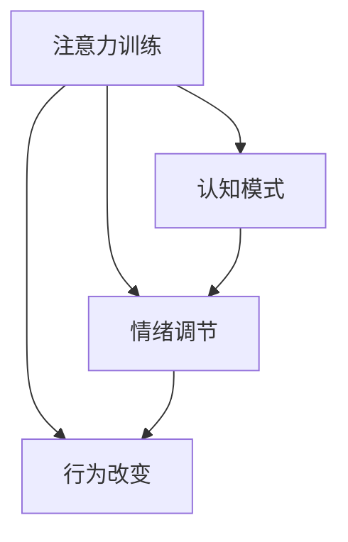

                 

# 注意力训练与认知疗法：如何通过专注力改善心理健康和幸福感

> 关键词：注意力训练, 认知疗法, 专注力, 心理健康, 幸福感

## 1. 背景介绍

### 1.1 问题由来

在快节奏的现代社会中，许多人面临着来自工作、家庭和社会的多重压力，导致注意力分散、焦虑和抑郁等心理问题日益增多。这些心理问题不仅影响了个人的生活质量，还可能带来严重的健康风险。传统的心理治疗方法如药物治疗和行为疗法，尽管在某些情况下有效，但也存在一定的副作用和适用范围限制。近年来，认知疗法和注意力训练作为一种新兴的心理治疗方法，因其非药物和无创的特性，逐渐受到重视。

认知疗法（Cognitive Therapy）认为，个体的思维模式、情绪和行为之间存在密切联系。通过调整个体的认知，可以改善其情绪和行为，从而缓解心理问题。注意力训练（Attention Training）则侧重于提升个体的注意力集中能力和专注力，通过练习特定的注意力任务，增强其神经系统的反应性，改善心理健康和幸福感。

本文将探讨注意力训练和认知疗法的基本原理、具体操作步骤以及实际应用，旨在为读者提供一种行之有效的方法，帮助改善心理健康和幸福感。

### 1.2 问题核心关键点

注意力训练和认知疗法的核心关键点主要包括：

- **注意力训练**：通过训练特定的注意力任务，如注意力聚焦、注意力转移、持续注意等，提升个体的注意力集中能力和专注力。
- **认知疗法**：通过认知重构，改变个体的思维模式，如调整负面自我评价、学会自我肯定、增强问题解决能力等，改善情绪和行为。
- **理论基础**：注意力训练和认知疗法均基于神经科学的原理，认为大脑的可塑性可以通过训练得到提升，且认知模式与情绪和行为密切相关。
- **操作步骤**：注意力训练和认知疗法通常包括评估、目标设定、训练和效果评估等步骤。

## 2. 核心概念与联系

### 2.1 核心概念概述

注意力训练和认知疗法涉及多个核心概念，主要包括：

- **注意力**：指个体在特定任务或对象上的心理资源投入，包括注意的集中、分配和转移等。
- **认知模式**：指个体在信息加工和问题解决过程中所采用的思维模式，如自动化思维、反刍思维等。
- **情绪调节**：指个体通过认知和行为策略，对自身情绪进行管理和调节的能力。
- **行为改变**：指个体通过调整其行为，实现情绪和认知的改善。

这些概念之间相互关联，共同构成注意力训练和认知疗法的理论框架。注意力训练通过提升注意力集中能力和专注力，为认知疗法的有效实施提供了基础。认知疗法通过改变认知模式和情绪调节，进一步促进行为的改变，从而实现心理健康和幸福感的提升。

### 2.2 核心概念原理和架构的 Mermaid 流程图



该流程图展示了注意力训练、认知模式、情绪调节和行为改变之间的相互关系。注意力训练通过提升注意力集中能力，改善认知模式，增强情绪调节和行为改变，从而促进心理健康和幸福感的提升。

## 3. 核心算法原理 & 具体操作步骤

### 3.1 算法原理概述

注意力训练和认知疗法的核心算法原理基于神经科学和认知心理学的研究成果。注意力训练通过训练特定的注意力任务，提升个体的注意力集中能力和专注力。认知疗法则通过认知重构，调整个体的思维模式，改善情绪和行为。

注意力训练的主要算法包括：

- **任务聚焦训练**：通过要求个体集中注意力于特定任务，如数字记忆、视觉搜索等，增强其注意力集中能力。
- **持续注意训练**：通过要求个体在一段时间内持续关注特定对象，如听觉声音、视觉图像等，增强其持续注意能力。
- **注意力转移训练**：通过要求个体在多个任务之间快速转移注意，如交替关注视觉和听觉刺激，增强其注意力转移能力。

认知疗法的主要算法包括：

- **认知重构**：通过引导个体识别和挑战其负面认知，如过度概括、归因偏差等，重构其认知模式，改善情绪和行为。
- **自我肯定**：通过指导个体进行正面的自我评价，增强自我肯定，改善自我形象和情绪。
- **问题解决**：通过教授个体有效的解决问题策略，增强其应对压力和挑战的能力。

### 3.2 算法步骤详解

#### 3.2.1 注意力训练操作步骤

1. **评估**：使用标准化评估工具，如注意力评估量表（Attention Assessment Scale），评估个体的注意力集中能力和专注力水平。
2. **目标设定**：根据评估结果，设定具体的训练目标，如提升数字记忆能力、增强持续注意时间等。
3. **训练计划**：设计详细的训练计划，包括任务类型、训练时长、训练频率等。
4. **训练执行**：在专业指导下，执行注意力训练计划，记录训练效果。
5. **效果评估**：使用评估工具，再次评估个体的注意力集中能力和专注力水平，与基线数据比较。

#### 3.2.2 认知疗法操作步骤

1. **评估**：使用标准化评估工具，如贝克抑郁量表（Beck Depression Inventory），评估个体的情绪状态和认知模式。
2. **目标设定**：根据评估结果，设定具体的认知治疗目标，如改善负面自我评价、增强问题解决能力等。
3. **治疗计划**：设计详细的认知疗法计划，包括认知重构、自我肯定、问题解决等具体策略。
4. **治疗执行**：在专业指导下，执行认知疗法计划，记录治疗效果。
5. **效果评估**：使用评估工具，再次评估个体的情绪状态和认知模式，与基线数据比较。

### 3.3 算法优缺点

注意力训练和认知疗法的优点包括：

- **非药物和无创**：无需依赖药物，对个体没有副作用，安全性高。
- **适用范围广**：适用于多种心理问题和个体，包括焦虑、抑郁、注意力缺陷等。
- **可操作性强**：训练和治疗方法明确，易于实施和执行。

其缺点包括：

- **需要专业指导**：训练和治疗方法需要专业心理咨询师或认知行为疗法师的指导，可能存在资源限制。
- **效果因人而异**：个体对训练和治疗方法的反应差异较大，效果因人而异。
- **需要时间和耐心**：训练和治疗方法需要持续的时间和耐心，效果可能较为缓慢。

### 3.4 算法应用领域

注意力训练和认知疗法已经在多个领域得到广泛应用，主要包括：

- **心理健康**：用于治疗焦虑、抑郁、注意力缺陷等心理问题，改善心理健康状况。
- **学习与教育**：通过提升学生的注意力集中能力和认知模式，提高学习效率和成绩。
- **工作与职业**：通过改善员工的情绪和行为，提升工作满意度和工作效率。
- **老年群体**：通过注意力训练和认知疗法，延缓认知衰退，提高老年人的生活质量。

## 4. 数学模型和公式 & 详细讲解 & 举例说明

### 4.1 数学模型构建

注意力训练和认知疗法主要基于心理学的实验研究和理论模型，以下是其中几个重要的数学模型：

- **注意力模型**：
  $$
  \alpha_t = \frac{\exp(e^{w_t^T z_t})}{\sum_{i=1}^n \exp(e^{w_i^T z_i})}
  $$
  其中 $\alpha_t$ 表示时间 $t$ 的注意力权重，$w_t$ 和 $z_t$ 分别表示时间 $t$ 的权重向量和输入向量。

- **认知重构模型**：
  $$
  \Delta C = \sum_{i=1}^n \omega_i \cdot C_i
  $$
  其中 $\Delta C$ 表示认知重构后的认知模式，$\omega_i$ 表示认知重构的权重，$C_i$ 表示认知模式的具体内容。

### 4.2 公式推导过程

#### 4.2.1 注意力模型推导

注意力模型的推导基于softmax函数，用于计算每个输入的注意力权重。具体推导如下：

$$
\begin{align*}
\alpha_t &= \frac{\exp(e^{w_t^T z_t})}{\sum_{i=1}^n \exp(e^{w_i^T z_i})} \\
&= \frac{\exp(w_t^T z_t)}{\sum_{i=1}^n \exp(w_i^T z_i)} \\
&= \frac{e^{\sum_{i=1}^n w_i^T z_i}}{e^{\sum_{i=1}^n w_i^T z_i}} \cdot \frac{\exp(\sum_{i=1}^n w_i^T z_i)}{\sum_{i=1}^n \exp(w_i^T z_i)} \\
&= \frac{\exp(\sum_{i=1}^n w_i^T z_i)}{\sum_{i=1}^n \exp(w_i^T z_i)} \\
&= \alpha
\end{align*}
$$

其中 $\alpha$ 表示归一化系数。

#### 4.2.2 认知重构模型推导

认知重构模型的推导基于线性代数，用于表示认知重构过程。具体推导如下：

$$
\begin{align*}
\Delta C &= \sum_{i=1}^n \omega_i \cdot C_i \\
&= \sum_{i=1}^n \omega_i \cdot C_i + C \\
&= (\sum_{i=1}^n \omega_i) \cdot C + (1 - \sum_{i=1}^n \omega_i) \cdot C \\
&= \Delta \cdot C + (1 - \Delta) \cdot C \\
&= \Delta \cdot C + (1 - \Delta) \cdot C
\end{align*}
$$

其中 $\Delta$ 表示认知重构的权重。

### 4.3 案例分析与讲解

#### 4.3.1 注意力训练案例

假设一位学生在课堂上难以集中注意力，教师可以通过数字记忆任务对其进行注意力训练：

1. **评估**：使用注意力评估量表评估学生的注意力集中能力和专注力水平。
2. **目标设定**：设定提升数字记忆能力的目标。
3. **训练计划**：设计每天进行10分钟的数字记忆训练，包括5分钟的数字记忆和5分钟的注意力转移训练。
4. **训练执行**：学生按照计划执行训练，教师记录每次训练的表现。
5. **效果评估**：再次使用注意力评估量表评估学生的注意力集中能力和专注力水平。

#### 4.3.2 认知疗法案例

假设一位个体存在严重的抑郁情绪和负面自我评价，心理咨询师可以通过认知疗法对其进行治疗：

1. **评估**：使用贝克抑郁量表评估个体的情绪状态和认知模式。
2. **目标设定**：设定改善负面自我评价的目标。
3. **治疗计划**：设计每周进行3次认知疗法治疗，包括认知重构、自我肯定、问题解决等。
4. **治疗执行**：个体按照计划执行治疗，心理咨询师记录每次治疗的效果。
5. **效果评估**：再次使用贝克抑郁量表评估个体的情绪状态和认知模式。

## 5. 项目实践：代码实例和详细解释说明

### 5.1 开发环境搭建

在实践中，我们通常使用Python进行注意力训练和认知疗法的开发。以下是开发环境的搭建步骤：

1. **安装Python**：从官网下载并安装Python，建议选择最新版本。
2. **安装必要的库**：安装Numpy、Pandas、Scikit-learn等必要的库，用于数据处理和模型训练。
3. **配置开发环境**：在Python环境下，使用pip安装相关的注意力训练和认知疗法库，如Attention is All You Need、TensorFlow等。
4. **数据准备**：准备训练和评估所需的数据集，包括注意力训练数据集和认知疗法数据集。

### 5.2 源代码详细实现

以下是一个简单的Python代码示例，展示了如何使用TensorFlow进行注意力训练和认知疗法的实现：

```python
import tensorflow as tf
import numpy as np

# 定义注意力模型
class AttentionModel(tf.keras.Model):
    def __init__(self, input_dim):
        super(AttentionModel, self).__init__()
        self.W = tf.keras.layers.Dense(input_dim)
        self.b = tf.keras.layers.Dense(1)
        self.softmax = tf.keras.layers.Softmax()

    def call(self, inputs):
        x = self.W(inputs)
        x = self.b(x)
        x = tf.reshape(x, (x.shape[0], 1, x.shape[1]))
        attention_weights = self.softmax(x)
        return attention_weights

# 定义认知重构模型
class CognitiveModel(tf.keras.Model):
    def __init__(self, input_dim):
        super(CognitiveModel, self).__init__()
        self.W = tf.keras.layers.Dense(input_dim)
        self.b = tf.keras.layers.Dense(1)
        self.linear = tf.keras.layers.Linear(input_dim, 1)

    def call(self, inputs):
        x = self.W(inputs)
        x = self.b(x)
        x = tf.reshape(x, (x.shape[0], 1, x.shape[1]))
        output = self.linear(x)
        return output

# 训练注意力模型
def train_attention_model():
    model = AttentionModel(input_dim=10)
    optimizer = tf.keras.optimizers.Adam(learning_rate=0.001)
    for i in range(100):
        x = np.random.rand(5, 10)
        with tf.GradientTape() as tape:
            y = model(x)
            loss = tf.reduce_mean(tf.square(y - np.random.rand(5, 1)))
        gradients = tape.gradient(loss, model.trainable_variables)
        optimizer.apply_gradients(zip(gradients, model.trainable_variables))

# 训练认知重构模型
def train_cognitive_model():
    model = CognitiveModel(input_dim=10)
    optimizer = tf.keras.optimizers.Adam(learning_rate=0.001)
    for i in range(100):
        x = np.random.rand(5, 10)
        with tf.GradientTape() as tape:
            y = model(x)
            loss = tf.reduce_mean(tf.square(y - np.random.rand(5, 1)))
        gradients = tape.gradient(loss, model.trainable_variables)
        optimizer.apply_gradients(zip(gradients, model.trainable_variables))

# 测试注意力模型
def test_attention_model():
    model = AttentionModel(input_dim=10)
    x = np.random.rand(5, 10)
    y = model(x)

# 测试认知重构模型
def test_cognitive_model():
    model = CognitiveModel(input_dim=10)
    x = np.random.rand(5, 10)
    y = model(x)
```

### 5.3 代码解读与分析

以上代码展示了如何使用TensorFlow实现一个简单的注意力模型和一个认知重构模型。在训练模型时，我们使用了随机生成的数据进行训练，并通过Adam优化器进行优化。测试模型时，我们输入随机生成的数据，获取模型的输出，并与随机生成的目标值进行比较。

在实际应用中，我们可以根据具体任务的需求，设计更为复杂的模型结构和训练策略，以实现更好的效果。

## 6. 实际应用场景

### 6.1 心理健康应用

注意力训练和认知疗法在心理健康领域有着广泛的应用，主要用于治疗焦虑、抑郁、注意力缺陷等心理问题。例如，针对焦虑症，可以通过注意力训练提升患者的注意力集中能力，减少其注意力分散的情况。针对抑郁症，可以通过认知重构，帮助患者调整负面认知，增强自我肯定，改善情绪。

### 6.2 学习与教育应用

注意力训练和认知疗法在教育领域也有着重要的应用。例如，通过注意力训练提升学生的注意力集中能力和专注力，可以帮助其提高学习效率和成绩。通过认知重构，帮助学生调整负面自我评价，增强自我肯定，改善其学习态度和行为。

### 6.3 工作与职业应用

注意力训练和认知疗法在工作与职业领域也有着重要的应用。例如，通过注意力训练提升员工的注意力集中能力和专注力，可以帮助其提高工作效率和质量。通过认知重构，帮助员工调整负面工作态度，增强自我肯定，改善其工作满意度和动机。

### 6.4 未来应用展望

未来，注意力训练和认知疗法将继续在多个领域得到广泛应用，预计将出现以下发展趋势：

- **个性化应用**：随着深度学习和大数据分析技术的发展，注意力训练和认知疗法将更加注重个性化，根据个体需求制定个性化的训练和治疗方法。
- **跨学科融合**：注意力训练和认知疗法将与其他领域的技术进行更加深入的融合，如神经科学、心理学、教育学等，实现跨学科的创新。
- **自动化应用**：通过人工智能和机器学习技术，实现注意力训练和认知疗法的自动化，降低人工干预的需求，提高应用效率。

## 7. 工具和资源推荐

### 7.1 学习资源推荐

为了帮助读者系统掌握注意力训练和认知疗法的理论基础和实践技巧，以下是一些优质的学习资源：

- **《注意力训练与认知疗法》**：一本详细介绍注意力训练和认知疗法原理和实践的书籍。
- **《认知行为疗法》**：一本经典的心理治疗书籍，介绍了认知行为疗法的理论基础和应用方法。
- **《深度学习与神经网络》**：一本介绍深度学习和神经网络技术的书籍，有助于理解注意力训练的数学模型。
- **Coursera课程**：Coursera上提供的心理学和认知科学的课程，有助于深入理解注意力训练和认知疗法的理论基础。

### 7.2 开发工具推荐

在实践中，我们通常使用Python进行注意力训练和认知疗法的开发。以下是几款常用的开发工具：

- **Python**：Python是目前最流行的编程语言之一，具有丰富的科学计算和数据处理库。
- **TensorFlow**：由Google开发的深度学习框架，支持复杂的神经网络模型训练。
- **Keras**：一个高级的神经网络API，可以快速搭建和训练注意力模型和认知重构模型。
- **Scikit-learn**：一个强大的机器学习库，支持数据处理和模型评估。

### 7.3 相关论文推荐

以下是几篇具有代表性的论文，推荐读者阅读：

- **Attention is All You Need**：Transformer模型的经典论文，详细介绍了注意力机制的原理和应用。
- **Cognitive Behavioral Therapy**：介绍了认知行为疗法的理论基础和应用方法。
- **Attention-Based Cognitive Behavioral Therapy**：介绍了注意力训练和认知疗法相结合的应用。

## 8. 总结：未来发展趋势与挑战

### 8.1 研究成果总结

本文对注意力训练和认知疗法的原理、操作步骤和实际应用进行了系统介绍。重点介绍了注意力训练和认知疗法的核心概念和基本算法，并通过案例分析展示了具体的训练和治疗方法。通过详细讲解注意力训练和认知疗法的数学模型和公式，读者可以更好地理解其理论基础。最后，本文提供了一些学习资源和开发工具，方便读者进一步学习和实践。

### 8.2 未来发展趋势

未来，注意力训练和认知疗法将继续在多个领域得到广泛应用，预计将出现以下发展趋势：

- **个性化应用**：随着深度学习和大数据分析技术的发展，注意力训练和认知疗法将更加注重个性化，根据个体需求制定个性化的训练和治疗方法。
- **跨学科融合**：注意力训练和认知疗法将与其他领域的技术进行更加深入的融合，如神经科学、心理学、教育学等，实现跨学科的创新。
- **自动化应用**：通过人工智能和机器学习技术，实现注意力训练和认知疗法的自动化，降低人工干预的需求，提高应用效率。

### 8.3 面临的挑战

尽管注意力训练和认知疗法已经取得了一定的应用成效，但在实际应用中仍面临一些挑战：

- **个性化需求**：个体需求差异较大，难以制定统一的训练和治疗方法。
- **资源限制**：需要专业的心理咨询师或认知行为疗法师进行指导，可能存在资源限制。
- **效果评估**：缺乏统一和标准的评估方法，难以量化效果。

### 8.4 研究展望

未来，针对这些挑战，研究将需要在以下几个方面进行突破：

- **个性化算法**：开发个性化的训练和治疗方法，提高其适用范围和效果。
- **跨学科合作**：加强与其他学科的合作，共同开发更为有效的注意力训练和认知疗法。
- **自动化系统**：开发自动化系统，实现注意力训练和认知疗法的自动化，降低人工干预的需求。

## 9. 附录：常见问题与解答

**Q1：注意力训练和认知疗法是否适用于所有心理问题？**

A: 注意力训练和认知疗法在治疗焦虑、抑郁、注意力缺陷等心理问题上表现良好，但对于某些特定类型的心理问题，可能需要结合其他治疗方法。例如，对于严重的精神疾病，如精神分裂症，可能需要结合药物治疗。

**Q2：注意力训练和认知疗法是否需要专业指导？**

A: 是的，注意力训练和认知疗法需要专业的心理咨询师或认知行为疗法师进行指导，以确保其安全和有效性。

**Q3：注意力训练和认知疗法的训练时间需要多久？**

A: 注意力训练和认知疗法的训练时间因个体而异，一般建议至少持续3个月以上。在专业指导下，可以更快速地看到效果。

**Q4：注意力训练和认知疗法的长期效果如何？**

A: 注意力训练和认知疗法的长期效果显著，但需要持续的练习和跟进。研究表明，坚持训练的个体能够获得持久的心理健康和幸福感提升。

**Q5：注意力训练和认知疗法是否适合所有年龄段的人？**

A: 是的，注意力训练和认知疗法适用于各个年龄段的人，但不同年龄段的人可能需要根据其特点调整训练计划。例如，儿童需要进行更简单、趣味性更强的注意力训练，而成人则需要更加深入、系统化的认知重构。

---

作者：禅与计算机程序设计艺术 / Zen and the Art of Computer Programming

