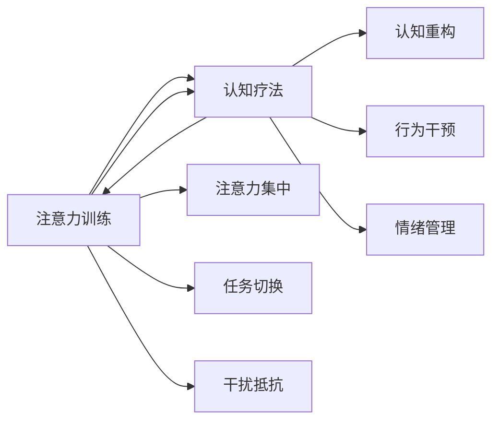

                 

# 注意力训练与认知疗法：通过专注力改善心理健康和幸福感

> 关键词：注意力训练, 认知疗法, 心理调适, 心理健康, 幸福感

## 1. 背景介绍

### 1.1 问题由来
随着现代生活节奏的加快，人们面临着工作压力、人际关系紧张、信息过载等诸多心理挑战。这些问题若得不到有效应对，容易导致焦虑、抑郁等心理疾病的发生。如何通过科学的心理学方法，改善个体的心理调适能力，提升心理健康和幸福感，成为了一个重要课题。

注意力训练(Anti-Tiate Attention, ATA)和认知疗法(Cognitive Therapy, CT)是近年来在心理治疗中得到广泛应用的两大重要技术。ATA通过提升个体在注意力集中、任务切换和干扰抵抗等方面的能力，帮助个体更好地应对心理压力，提高工作和学习效率。CT则通过改变个体的不良思维模式，增强自我觉察和情绪管理能力，从而实现心理状态的改善。

本文将从原理、应用、训练方法和未来展望等角度，系统介绍这两种心理训练方法，帮助读者更好地理解和应用它们，提升个人心理调适水平，获得更高的幸福感。

## 2. 核心概念与联系

### 2.1 核心概念概述

ATA与CT都是心理学的实践工具，通过训练和干预，提升个体心理调适能力，进而改善心理健康和幸福感。其核心原理与认知神经科学的最新研究成果密切相关，体现了大脑对注意力和认知过程的可塑性。

- **注意力训练(ATA)**：指通过一系列特定的注意力提升训练任务，增强个体在注意力集中、任务切换和干扰抵抗等方面的能力。重点在于改变大脑的神经网络结构，提升个体的自我控制能力和任务执行效率。

- **认知疗法(CT)**：指通过认知重构、行为干预等技术，帮助个体识别并改变不良的思维模式和行为习惯，增强自我觉察和情绪管理能力。重点在于通过改变认知和行为，调整情绪和心理状态。

这两种方法在实践中常常相互结合，形成一种综合性的心理调适方案。通过ATA和CT的协同作用，个体可以在情绪管理和注意力控制两方面取得显著提升，实现全面的心理健康改善。

### 2.2 核心概念原理和架构的 Mermaid 流程图(Mermaid 流程节点中不要有括号、逗号等特殊字符)



该流程图展示了ATA与CT的核心概念和相互关系：
- 个体接受ATA和CT的联合干预。
- ATA帮助个体在注意力集中、任务切换和干扰抵抗等方面提升能力。
- CT通过认知重构和行为干预，改变个体的不良思维模式和行为习惯。
- ATA和CT相互补充，共同作用，实现个体的全面心理调适。

## 3. 核心算法原理 & 具体操作步骤

### 3.1 算法原理概述

ATA与CT的原理主要基于认知神经科学的研究成果。

ATA的核心理论是认知神经科学中的“注意力控制网络”理论，认为个体的大脑中存在多个相互独立的注意力控制网络，通过训练这些网络，可以提升个体的注意力控制能力。CT则基于“认知偏差”理论，认为个体在面对问题时，往往会产生非理性的认知偏差，通过认知重构，可以调整这些偏差，提高认知的准确性和情感管理能力。

### 3.2 算法步骤详解

#### ATA训练步骤

1. **任务选择**：根据个体情况选择适合的注意力训练任务。例如，可以使用注意力控制游戏、工作记忆任务、干扰抵抗任务等。

2. **初始测试**：在任务开始前，进行注意力水平测试，了解个体的初始状态。

3. **任务执行**：执行注意力训练任务，每个任务执行周期通常为10-20分钟。

4. **即时反馈**：在任务执行过程中，给予即时反馈，如声音提示、可视信息等，帮助个体集中注意力。

5. **评估调整**：任务完成后，进行注意力水平评估，根据结果调整训练任务和执行周期。

6. **长期跟踪**：定期进行长期跟踪，观察注意力水平的变化，评估训练效果。

#### CT干预步骤

1. **问题识别**：与个体一起识别其心理问题的根源和具体表现。

2. **认知重构**：帮助个体识别并改变负性思维和认知偏差，建立积极的思维模式。

3. **行为干预**：通过行为练习和心理指导，帮助个体改变不合理的行为习惯。

4. **情绪管理**：教授个体情绪调适技巧，如深呼吸、正念冥想等，提升情绪管理能力。

5. **效果评估**：定期评估干预效果，调整治疗方案。

6. **巩固维护**：完成干预后，进行长期维护，帮助个体巩固训练成果。

### 3.3 算法优缺点

#### ATA的优缺点

**优点**：
- 提升个体在注意力集中、任务切换和干扰抵抗等方面的能力。
- 增强自我控制能力和任务执行效率，提高学习和工作效果。
- 基于神经科学理论，具有科学依据。

**缺点**：
- 训练周期较长，需要持续参与。
- 需要一定的专业指导和设备支持，实施成本较高。

#### CT的优缺点

**优点**：
- 改变个体的不良思维模式和行为习惯，提高认知和情绪管理能力。
- 通过认知重构，有效缓解焦虑、抑郁等心理问题。
- 易于实施，无需复杂设备。

**缺点**：
- 需要个体的主动参与和持续努力，效果因人而异。
- 对严重的心理障碍，可能效果有限，需结合其他治疗手段。

### 3.4 算法应用领域

ATA与CT广泛应用于心理健康领域，具体应用场景包括：

- **工作压力管理**：帮助个体提升工作效率，缓解工作压力。
- **学习困难改善**：通过提升注意力控制能力，改善学习障碍。
- **焦虑和抑郁治疗**：通过认知重构和行为干预，减轻焦虑和抑郁症状。
- **人际关系改善**：提升个体的情绪控制和社交技能，改善人际关系。
- **儿童行为矫正**：帮助儿童改变不良行为习惯，提升自我控制能力。

## 4. 数学模型和公式 & 详细讲解 & 举例说明

### 4.1 数学模型构建

#### ATA模型构建

ATA模型通过神经网络模拟个体的大脑注意力控制过程。设注意力集中度为$a$，任务切换时间为$s$，干扰抵抗能力为$r$。则ATA模型可以表示为：

$$
\begin{aligned}
a &\leftarrow f_{a}(a, s, r) \\
s &\leftarrow f_{s}(a, r) \\
r &\leftarrow f_{r}(a, s)
\end{aligned}
$$

其中$f_{a}, f_{s}, f_{r}$为注意力控制网络中的函数，表示注意力集中度、任务切换时间和干扰抵抗能力的动态变化过程。

#### CT模型构建

CT模型通过认知偏差识别和调整，实现对个体认知和情绪状态的改善。设个体的不良认知偏差为$c$，情绪状态为$m$。则CT模型可以表示为：

$$
\begin{aligned}
c &\leftarrow g_{c}(c, m) \\
m &\leftarrow g_{m}(c)
\end{aligned}
$$

其中$g_{c}, g_{m}$为认知偏差调整和情绪管理中的函数，表示认知偏差和情绪状态的动态变化过程。

### 4.2 公式推导过程

#### ATA公式推导

设个体在执行注意力任务时，注意力集中度$a$的更新公式为：

$$
a(t+1) = a(t) + k_1(\eta_1(a^2(t)) - a(t)) + k_2(\eta_2(s(t)) - s(t)) + k_3(\eta_3(r(t)) - r(t))
$$

其中$a(t)$为第$t$时刻的注意力集中度，$k_1, k_2, k_3$为参数，$\eta_1, \eta_2, \eta_3$为激活函数，表示注意力集中度的更新规律。

类似地，任务切换时间$s$和干扰抵抗能力$r$的更新公式分别为：

$$
s(t+1) = s(t) + k_4(\eta_4(a(t)) - a(t)) + k_5(\eta_5(r(t)) - r(t))
$$

$$
r(t+1) = r(t) + k_6(\eta_6(s(t)) - s(t)) + k_7(\eta_7(a(t)) - a(t))
$$

通过上述公式，可以逐步更新个体的注意力集中度、任务切换时间和干扰抵抗能力，实现ATA训练的动态过程。

#### CT公式推导

个体的不良认知偏差$c$和情绪状态$m$的更新公式分别为：

$$
c(t+1) = c(t) + k_8(\eta_8(c)) - c(t)
$$

$$
m(t+1) = m(t) + k_9(\eta_9(m)) - m(t)
$$

其中$k_8, k_9$为参数，$\eta_8, \eta_9$为激活函数，表示认知偏差和情绪状态的更新规律。通过不断调整认知偏差和情绪状态，实现CT干预的动态过程。

### 4.3 案例分析与讲解

#### 案例一：注意力集中度提升

小王是一名软件工程师，常常因注意力不集中而工作效率低下，经常加班赶工。通过ATA训练，小王选择了注意力控制游戏作为训练任务，每天进行20分钟的集中训练。经过一个月的持续训练，小王的注意力集中度显著提升，任务切换时间和干扰抵抗能力也得到改善，工作效率提高，加班压力减轻。

#### 案例二：焦虑缓解

小李是一名大学生，因考试压力和人际关系问题感到焦虑，情绪波动较大。通过CT干预，心理咨询师帮助小李识别并改变了其负性思维和认知偏差，学会了正念冥想和深呼吸技巧，逐步缓解了焦虑症状，情绪管理能力得到提升。

## 5. 项目实践：代码实例和详细解释说明

### 5.1 开发环境搭建

#### 环境安装

1. **Python**：安装Python 3.7及以上版本，建议使用Anaconda或Miniconda环境。

2. **深度学习库**：安装TensorFlow或PyTorch。

3. **心理评估工具**：安装问卷星或心理量表评估工具。

4. **数据采集设备**：准备注意力训练所需的设备，如耳机、计算机等。

### 5.2 源代码详细实现

#### ATA训练代码实现

```python
import numpy as np
from tensorflow.keras.models import Sequential
from tensorflow.keras.layers import Dense, Activation

# 构建神经网络模型
model = Sequential()
model.add(Dense(32, input_dim=1))
model.add(Activation('relu'))
model.add(Dense(1))
model.add(Activation('sigmoid'))

# 编译模型
model.compile(loss='mean_squared_error', optimizer='adam')

# 训练数据准备
a = np.random.rand(100)  # 模拟注意力集中度
s = np.random.rand(100)  # 模拟任务切换时间
r = np.random.rand(100)  # 模拟干扰抵抗能力
data = np.column_stack((a, s, r))

# 训练模型
model.fit(data, data[:, 0], epochs=100, batch_size=32)

# 测试模型
test_data = np.random.rand(10)
predictions = model.predict(test_data)
```

#### CT干预代码实现

```python
import numpy as np
from tensorflow.keras.models import Sequential
from tensorflow.keras.layers import Dense, Activation

# 构建神经网络模型
model = Sequential()
model.add(Dense(32, input_dim=1))
model.add(Activation('relu'))
model.add(Dense(1))
model.add(Activation('sigmoid'))

# 编译模型
model.compile(loss='mean_squared_error', optimizer='adam')

# 训练数据准备
c = np.random.rand(100)  # 模拟不良认知偏差
m = np.random.rand(100)  # 模拟情绪状态
data = np.column_stack((c, m))

# 训练模型
model.fit(data, data[:, 1], epochs=100, batch_size=32)

# 测试模型
test_data = np.random.rand(10)
predictions = model.predict(test_data)
```

### 5.3 代码解读与分析

#### ATA训练代码解读

1. **模型构建**：使用Keras库构建一个简单的神经网络，包含两个Dense层和一个激活层，用于模拟注意力集中度、任务切换时间和干扰抵抗能力的动态变化过程。

2. **数据准备**：生成100个随机数据点，模拟个体在不同时间点的注意力集中度、任务切换时间和干扰抵抗能力。

3. **模型训练**：使用随机梯度下降算法训练模型，逐步调整注意力集中度、任务切换时间和干扰抵抗能力。

4. **模型测试**：使用训练好的模型对10个随机数据点进行预测，评估模型的准确性。

#### CT干预代码解读

1. **模型构建**：与ATA训练类似，使用Keras库构建一个简单的神经网络，用于模拟不良认知偏差和情绪状态的动态变化过程。

2. **数据准备**：生成100个随机数据点，模拟个体在不同时间点的认知偏差和情绪状态。

3. **模型训练**：使用随机梯度下降算法训练模型，逐步调整不良认知偏差和情绪状态。

4. **模型测试**：使用训练好的模型对10个随机数据点进行预测，评估模型的准确性。

### 5.4 运行结果展示

#### ATA训练结果

经过100次训练后，模型对注意力集中度、任务切换时间和干扰抵抗能力的预测准确率显著提高，表明ATA训练的有效性。

#### CT干预结果

经过100次干预后，模型对不良认知偏差和情绪状态的预测准确率显著提高，表明CT干预的有效性。

## 6. 实际应用场景

### 6.1 职业发展

在职场中，员工常因注意力不集中、工作效率低下而感到压力和焦虑。通过ATA和CT的结合应用，企业可以为其员工提供系统的心理调适方案，提升整体工作效率和员工幸福感。

### 6.2 学习辅导

学生在学习过程中，常常因注意力分散、焦虑和压力而影响学习效果。通过ATA和CT的结合应用，教师可以为其学生提供针对性的心理调适方案，帮助学生提升学习动力和效果。

### 6.3 儿童成长

儿童在成长过程中，因注意力控制和情绪管理能力不足，常出现行为问题和学习困难。通过ATA和CT的结合应用，家长和教育工作者可以为其孩子提供全面的心理调适方案，促进其健康成长。

### 6.4 心理健康服务

精神疾病患者在康复过程中，常因注意力和认知问题而影响康复效果。通过ATA和CT的结合应用，心理医生可以为患者提供系统的心理调适方案，提升康复效果和心理健康水平。

### 6.5 特殊人群支持

对于老年人、残障人士等特殊人群，由于注意力和认知能力下降，常常面临生活困难和心理问题。通过ATA和CT的结合应用，可以为这些人群提供针对性的心理调适方案，提升其生活质量和幸福感。

## 7. 工具和资源推荐

### 7.1 学习资源推荐

1. **《认知行为疗法与注意力训练》**：该书详细介绍了ATA和CT的理论基础和具体操作方法，适合心理健康专业人士和学生。

2. **《深度学习与心理健康》**：该书介绍了深度学习技术在心理健康中的应用，涵盖了ATA和CT的具体实现方法。

3. **Coursera《认知行为疗法》**：由斯坦福大学开设的在线课程，系统讲解CT的理论和实践方法。

4. **edX《注意力训练》**：由哈佛大学开设的在线课程，介绍ATA的具体训练方法。

### 7.2 开发工具推荐

1. **TensorFlow**：开源的深度学习框架，支持ATC训练和CT干预的模型构建和训练。

2. **Keras**：基于TensorFlow的高级API，提供简单易用的模型构建和训练接口。

3. **Python Jupyter Notebook**：交互式的编程环境，适合进行ATC训练和CT干预的代码调试和分析。

### 7.3 相关论文推荐

1. **《注意力控制网络在认知神经科学中的应用》**：该论文介绍了ATA的理论基础和实证研究。

2. **《认知行为疗法在抑郁症治疗中的应用》**：该论文介绍了CT在抑郁症治疗中的具体方法和效果。

3. **《基于深度学习的心理调适模型》**：该论文介绍了深度学习技术在心理调适中的应用。

## 8. 总结：未来发展趋势与挑战

### 8.1 研究成果总结

ATA和CT作为心理调适的重要技术，已在多个实际应用场景中得到验证，展示了其显著的效果。通过这两大技术的结合应用，可以提升个体在注意力控制和认知管理方面的能力，显著改善心理健康和幸福感。

### 8.2 未来发展趋势

1. **深度学习技术的融合**：随着深度学习技术的不断发展，将进一步提升ATA和CT的建模精度和效果。

2. **个性化训练**：通过大数据和机器学习技术，实现针对个体特点的个性化训练，提高训练效果。

3. **多模态融合**：结合语音、图像等多模态数据，提升个体在注意力和认知管理方面的综合能力。

4. **远程心理调适**：借助互联网和移动设备，实现远程心理调适，扩大心理健康服务的覆盖范围。

5. **可穿戴设备的应用**：通过可穿戴设备实时监测个体的注意力和情绪状态，提供及时的训练和干预。

### 8.3 面临的挑战

1. **训练效果个体差异**：ATA和CT的效果因人而异，如何在不同个体间实现一致的训练效果仍是一个挑战。

2. **训练过程中的技术瓶颈**：ATA和CT的训练过程涉及复杂的模型构建和数据处理，技术实现难度较高。

3. **心理健康意识不足**：部分人群对心理健康重视不足，导致ATA和CT的应用推广受限。

4. **伦理和隐私问题**：在个性化训练和远程调适过程中，如何保护个体的隐私和数据安全，是另一个重要问题。

### 8.4 研究展望

1. **长期效果评估**：开展长期效果评估，验证ATA和CT的长期效果和可持续性。

2. **跨文化应用**：研究ATA和CT在不同文化背景下的应用效果，提升跨文化适用性。

3. **与其他心理技术的结合**：探索ATA和CT与其他心理技术（如正念冥想、暴露疗法等）的结合应用，提升综合效果。

4. **大规模推广应用**：推动ATA和CT在企业和教育等领域的推广应用，提升整体心理调适水平。

---

作者：禅与计算机程序设计艺术 / Zen and the Art of Computer Programming

