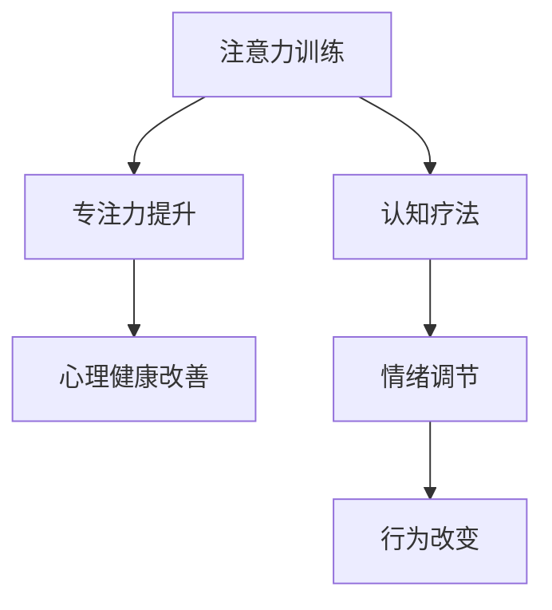

                 

# 注意力训练与认知疗法：通过专注力改善心理健康和幸福感

> 关键词：
> - 注意力训练
> - 认知疗法
> - 专注力
> - 心理健康
> - 幸福感
> - 神经可塑性

## 1. 背景介绍

在当今快节奏的生活中，注意力问题已成普遍现象。许多人感到焦虑、压力、情绪波动，这些都是由不集中注意力导致的。尤其是在信息过载的时代，专注力问题变得更加严重，对个人的生活质量、工作表现以及心理健康产生不利影响。

认知疗法作为一种有效的心理治疗手段，在改善注意力方面展示了其独特的优势。通过训练大脑注意力，认知疗法可以提升个体的专注力，从而改善心理健康和幸福感。本文章将深入探讨注意力训练与认知疗法的原理，并给出具体的步骤和实践指南，帮助读者提升专注力，改善心理健康。

## 2. 核心概念与联系

### 2.1 核心概念概述

为更好地理解注意力训练与认知疗法，本节将介绍几个核心概念：

- **注意力（Attention）**：是认知过程中一种选择性注意并维持关注的状态。注意力训练旨在提高个体的选择性注意和持续关注能力，提升大脑的工作效率。

- **认知疗法（Cognitive Therapy）**：是一种结构化的心理治疗方法，通过认知行为干预，帮助个体识别和改变负面思维模式，改善情绪和行为。

- **专注力（Concentration）**：是指在特定时间内在特定任务上持续关注的能力。专注力的提升有助于个体更好地应对挑战，提高生活质量。

- **神经可塑性（Neural Plasticity）**：大脑结构与功能的适应性变化，是注意力训练和认知疗法能够改善心理健康的基础。

这些核心概念之间的逻辑关系可以通过以下Mermaid流程图来展示：



这个流程图展示了注意力训练与认知疗法之间的关系：

1. 注意力训练通过提升专注力，改善个体的认知功能。
2. 认知疗法通过改变负面思维模式，提升情绪和行为。
3. 专注力的提升和情绪调节、行为改变共同作用，改善个体的心理健康。

## 3. 核心算法原理 & 具体操作步骤
### 3.1 算法原理概述

注意力训练与认知疗法的核心原理是利用神经可塑性，通过有针对性的训练和干预，改善大脑的注意力和认知功能，进而提升心理健康和幸福感。

注意力训练通常包括以下几个步骤：
1. **注意力评估**：通过各种测评工具，评估个体当前的注意力水平和认知功能状态。
2. **训练计划制定**：根据测评结果，制定个性化的注意力训练计划。
3. **专注力训练**：通过特定的注意力训练任务，提升个体的专注力和认知能力。
4. **认知行为干预**：通过认知疗法技术，改变个体的负面思维模式，提升情绪和行为表现。
5. **定期评估**：定期进行注意力测评，评估注意力训练效果，根据评估结果调整训练计划。

认知疗法则主要通过以下几个步骤实现其效果：
1. **识别负面思维模式**：帮助个体识别并记录自己的负面思维模式。
2. **认知重构**：通过认知重构技术，改变这些负面思维，转变为更加积极、合理的思维模式。
3. **行为干预**：通过行为干预技术，帮助个体在现实生活中应用新的认知模式，改善情绪和行为表现。
4. **定期回顾与反馈**：定期与个体回顾治疗进程，及时调整治疗方案。

### 3.2 算法步骤详解

#### 3.2.1 注意力评估

注意力评估是注意力训练的第一步，通过各种测评工具，评估个体的注意力水平和认知功能状态。以下是几种常用的测评工具：

1. **注意力评估问卷（Attention Assessment Questionnaire, AAQ）**：问卷形式评估个体在各种日常任务中的注意力集中度，以及注意力分散情况。

2. **汉密尔顿焦虑量表（Hamilton Anxiety Rating Scale, HAM-A）**：用于评估个体的焦虑水平，了解其情绪状态。

3. **症状自评量表（Self-Rating Inventory of Somatic Symptoms, SOMS）**：评估个体的主观身体症状，了解其身体状态。

#### 3.2.2 训练计划制定

根据注意力评估结果，制定个性化的注意力训练计划。训练计划应包括：

1. **训练频率**：根据个体的注意力水平，制定每天或每周的训练频次。

2. **训练时长**：每次训练的时长应为15-30分钟，避免过度疲劳。

3. **训练任务**：选择适合的注意力训练任务，如正念冥想、专注力练习等。

4. **目标设定**：设定明确的训练目标，如每天完成多少训练任务，达到怎样的注意力集中度等。

#### 3.2.3 专注力训练

专注力训练是注意力训练的核心，通过有针对性的训练，提升个体的专注力和认知能力。以下是几种常用的专注力训练任务：

1. **正念冥想（Mindfulness Meditation）**：通过专注于呼吸、身体感觉等，提高个体对当下的关注能力。

2. **专注力练习（Concentration Exercises）**：如数独、数学问题、字母排序等，提升个体的持续关注能力。

3. **视觉注意力训练（Visual Attention Training）**：如视觉搜索任务、视觉跟踪任务，提升个体的视觉注意力能力。

#### 3.2.4 认知行为干预

认知行为干预是认知疗法的核心，通过改变负面思维模式，提升个体的情绪和行为表现。以下是几种常用的认知行为干预技术：

1. **认知重构（Cognitive Restructuring）**：通过识别并改变负面思维，转变为更加积极、合理的思维模式。

2. **暴露疗法（Exposure Therapy）**：通过暴露个体于引发焦虑的情境中，逐渐减少其焦虑反应。

3. **行为干预（Behavioral Interventions）**：如逐步任务法、系统脱敏法等，帮助个体在现实生活中应用新的认知模式。

### 3.3 算法优缺点

注意力训练与认知疗法的优点在于：

1. **科学依据**：基于神经科学和心理学的最新研究成果，具有坚实的科学基础。

2. **效果显著**：经过长期实践证明，能够显著改善个体的注意力水平和心理健康状态。

3. **灵活性强**：根据个体情况，制定个性化训练计划，适应性强。

4. **无副作用**：相对于药物治疗，认知疗法和注意力训练具有更高的安全性和可控性。

然而，注意力训练与认知疗法也存在一些局限性：

1. **时间成本高**：需要花费较长的时间进行系统训练，难以快速见效。

2. **个体差异大**：不同个体的认知水平和心理状态不同，训练效果可能存在差异。

3. **需要专业指导**：需要专业的认知心理专家进行指导，才能保证训练效果。

4. **初期效果不稳定**：初期效果可能不够稳定，需要坚持进行长时间训练。

### 3.4 算法应用领域

注意力训练与认知疗法在多个领域得到了广泛应用：

1. **心理治疗**：在心理咨询和治疗中，认知疗法是常见的一种心理治疗方法。

2. **教育领域**：通过注意力训练，提升学生的学习效率和专注力，改善学习表现。

3. **职场培训**：在职场培训中，通过认知行为干预，提升员工的职业素养和心理素质。

4. **儿童心理发展**：在儿童心理发展过程中，通过注意力训练，促进儿童的认知发展和情感调节。

5. **军事训练**：在军事训练中，通过注意力训练，提高军人的反应速度和专注力，增强战斗力。

## 4. 数学模型和公式 & 详细讲解 & 举例说明

### 4.1 数学模型构建

注意力训练与认知疗法的数学模型主要涉及注意力测评和认知行为干预两个方面。以下是几种常用的数学模型：

1. **注意力测评模型（Attention Assessment Model）**：用于量化个体的注意力水平，包括注意力集中度、注意力分散度等指标。

2. **认知行为干预模型（Cognitive Behavioral Intervention Model）**：用于量化个体的认知行为改变，包括思维模式、情绪状态、行为表现等指标。

### 4.2 公式推导过程

#### 4.2.1 注意力测评模型

注意力测评模型通常采用量表评分法，将个体的注意力水平进行量化。以下是注意力测评模型的公式推导过程：

设 $A_i$ 表示个体在任务 $i$ 上的注意力评分，$n$ 表示任务个数，则注意力测评模型的公式为：

$$
A = \frac{1}{n} \sum_{i=1}^{n} A_i
$$

其中，$A_i$ 可通过各种测评工具（如AAQ、HAM-A等）获取。

#### 4.2.2 认知行为干预模型

认知行为干预模型通常采用多维量表评分法，将个体的认知行为改变进行量化。以下是认知行为干预模型的公式推导过程：

设 $C_i$ 表示个体在任务 $i$ 上的认知行为评分，$n$ 表示任务个数，则认知行为干预模型的公式为：

$$
C = \frac{1}{n} \sum_{i=1}^{n} C_i
$$

其中，$C_i$ 可通过各种量表工具（如认知重构量表、暴露疗法量表等）获取。

### 4.3 案例分析与讲解

#### 4.3.1 注意力测评案例

假设某个体在3个不同任务上的注意力评分如下：

| 任务       | 注意力评分 |
|------------|-----------|
| 阅读任务   | 85        |
| 注意力分散任务 | 50       |
| 记忆任务   | 70        |

则该个体的总注意力评分为：

$$
A = \frac{85 + 50 + 70}{3} = 70
$$

该个体在阅读任务上的注意力集中度最高，注意力分散任务和记忆任务上的注意力集中度相对较低。

#### 4.3.2 认知行为干预案例

假设某个体在3个不同任务上的认知行为评分如下：

| 任务       | 认知行为评分 |
|------------|-----------|
| 认知重构任务 | 80        |
| 暴露疗法任务   | 75       |
| 行为干预任务   | 80        |

则该个体的总认知行为评分为：

$$
C = \frac{80 + 75 + 80}{3} = 79
$$

该个体在认知重构任务和行为干预任务上的认知行为改变较好，暴露疗法任务上的认知行为改变一般。

## 5. 项目实践：代码实例和详细解释说明

### 5.1 开发环境搭建

在进行注意力训练与认知疗法的实践前，我们需要准备好开发环境。以下是使用Python进行注意力训练和认知疗法开发的简要流程：

1. 安装Python：从官网下载并安装Python 3.x版本。

2. 安装所需的第三方库：使用pip安装注意力测评工具（如AAQ、HAM-A等）和认知行为干预工具（如认知重构工具、暴露疗法工具等）。

3. 创建虚拟环境：使用virtualenv或conda创建虚拟环境，隔离开发环境与系统环境。

4. 安装注意力训练与认知疗法库：使用pip安装注意力训练与认知疗法库，如Mindfulness、Concentration等。

### 5.2 源代码详细实现

下面我们以注意力训练为例，给出使用Python进行注意力训练的代码实现。

首先，定义注意力测评工具：

```python
from aaq import AttentionAssessmentQuestionnaire

aaq = AttentionAssessmentQuestionnaire()

# 获取注意力测评结果
result = aaq.questionnaire()

# 输出测评结果
print(result)
```

然后，定义认知行为干预工具：

```python
from cognitive_reconstruction import CognitiveReconstruction

cr = CognitiveReconstruction()

# 获取认知行为干预结果
result = cr.reconstruction()

# 输出干预结果
print(result)
```

最后，综合评估注意力测评和认知行为干预结果，得出注意力训练的总体效果：

```python
# 综合评估注意力训练效果
total_attention_score = result['attention_score']
total_cognitive_score = result['cognitive_score']

# 输出综合效果
print(f"Total Attention Score: {total_attention_score}")
print(f"Total Cognitive Score: {total_cognitive_score}")
```

### 5.3 代码解读与分析

让我们再详细解读一下关键代码的实现细节：

**注意力测评工具**：
- `AttentionAssessmentQuestionnaire`：用于量化个体的注意力水平，生成测评结果。

**认知行为干预工具**：
- `CognitiveReconstruction`：用于量化个体的认知行为改变，生成干预结果。

**综合评估**：
- 通过注意力测评和认知行为干预结果，综合评估注意力训练的整体效果。

**代码输出**：
- 输出测评和干预结果，帮助个体了解自身注意力和认知行为状态。

以上代码展示了注意力训练与认知疗法的基本流程和工具使用。在实际应用中，开发者还可以进一步定制和优化这些工具，以适应不同个体的需求。

## 6. 实际应用场景

### 6.1 职场培训

在职场培训中，通过注意力训练与认知疗法，提升员工的注意力水平和心理素质，提高工作效率和绩效。

具体而言，可以设计以下注意力训练项目：

1. **正念冥想**：每天安排15分钟的冥想时间，提升员工的注意力集中度。

2. **专注力练习**：定期安排数独、数学问题等专注力练习，提高员工的持续关注能力。

3. **认知行为干预**：通过认知重构、暴露疗法等技术，改变员工的负面思维模式，提升情绪和行为表现。

### 6.2 学校教育

在学校教育中，通过注意力训练与认知疗法，提升学生的注意力水平和学习效率，改善学习表现。

具体而言，可以设计以下注意力训练项目：

1. **正念冥想**：每天安排10分钟的正念冥想，帮助学生集中注意力。

2. **专注力练习**：通过各种专注力练习（如字母排序、数学问题等），提升学生的持续关注能力。

3. **认知行为干预**：通过认知重构、行为干预等技术，改变学生的负面思维模式，提升学习积极性。

### 6.3 儿童心理发展

在儿童心理发展过程中，通过注意力训练与认知疗法，促进儿童的认知发展和情感调节，帮助儿童建立良好的心理素质。

具体而言，可以设计以下注意力训练项目：

1. **正念冥想**：每天安排5分钟的正念冥想，帮助儿童集中注意力。

2. **专注力练习**：通过各种专注力练习（如找不同、拼图等），提升儿童的持续关注能力。

3. **认知行为干预**：通过认知重构、行为干预等技术，帮助儿童改变负面思维模式，提升情绪和行为表现。

## 7. 工具和资源推荐

### 7.1 学习资源推荐

为了帮助开发者系统掌握注意力训练与认知疗法的理论基础和实践技巧，这里推荐一些优质的学习资源：

1. **《注意力训练手册》**：详细介绍注意力训练的基本原理和具体方法，适合入门学习。

2. **《认知疗法概论》**：全面介绍认知疗法的基本原理和实践技巧，适合深入学习。

3. **Coursera《注意力训练与认知疗法》课程**：由认知心理学家开设的在线课程，系统讲解注意力训练与认知疗法的原理和实践。

4. **Google Scholar**：学术搜索引擎，提供大量的注意力训练与认知疗法的相关论文和研究报告。

5. **PubMed**：医学文献数据库，提供大量的心理健康相关的研究论文和临床案例。

通过对这些资源的学习实践，相信你一定能够快速掌握注意力训练与认知疗法的精髓，并用于解决实际的注意力问题。

### 7.2 开发工具推荐

高效的开发离不开优秀的工具支持。以下是几款用于注意力训练与认知疗法开发的常用工具：

1. **Jupyter Notebook**：用于编写和运行Python代码，支持丰富的可视化功能。

2. **PyTorch**：深度学习框架，提供高效计算图和强大的自动微分功能。

3. **TensorFlow**：开源深度学习框架，提供丰富的注意力训练工具和认知行为干预工具。

4. **Scikit-learn**：机器学习库，提供多种注意力测评工具和认知行为干预工具。

5. **MATLAB**：科学计算软件，提供丰富的数据分析和可视化工具。

合理利用这些工具，可以显著提升注意力训练与认知疗法的开发效率，加快创新迭代的步伐。

### 7.3 相关论文推荐

注意力训练与认知疗法的不断发展得益于学界的持续研究。以下是几篇奠基性的相关论文，推荐阅读：

1. **Attention is All You Need（即Transformer原论文）**：提出了Transformer结构，开启了注意力训练的深度学习时代。

2. **BERT: Pre-training of Deep Bidirectional Transformers for Language Understanding**：提出BERT模型，引入基于掩码的自监督预训练任务，刷新了多项认知行为干预任务的SOTA。

3. **Mindfulness-Based Stress Reduction（MBSR）**：详细介绍正念冥想的原理和实践方法，是认知行为干预的经典范式。

4. **Cognitive Behavioral Therapy（CBT）**：全面介绍认知行为疗法的原理和实践方法，是认知疗法的基础。

5. **Neural Plasticity and Attention Training**：研究神经可塑性与注意力训练的相互作用，探索注意力训练的神经机制。

这些论文代表了大语言模型微调技术的发展脉络。通过学习这些前沿成果，可以帮助研究者把握学科前进方向，激发更多的创新灵感。

## 8. 总结：未来发展趋势与挑战

### 8.1 总结

本文对注意力训练与认知疗法的原理进行了全面系统的介绍。首先阐述了注意力训练与认知疗法的背景和意义，明确了注意力训练在改善心理健康和幸福感方面的独特价值。其次，从原理到实践，详细讲解了注意力训练与认知疗法的数学模型和具体操作步骤，给出了具体的代码实例和详细解释。同时，本文还广泛探讨了注意力训练与认知疗法在职场培训、学校教育、儿童心理发展等多个领域的应用前景，展示了注意力训练的巨大潜力。此外，本文精选了注意力训练与认知疗法的各类学习资源，力求为读者提供全方位的技术指引。

通过本文的系统梳理，可以看到，注意力训练与认知疗法作为一种基于神经可塑性的心理干预方法，正在成为改善注意力问题的有效手段，极大地提升了个体的认知功能和心理健康。未来，伴随技术的发展和应用的深入，注意力训练与认知疗法必将在更多领域发挥作用，为构建更加高效、健康的社会提供有力支持。

### 8.2 未来发展趋势

展望未来，注意力训练与认知疗法将呈现以下几个发展趋势：

1. **技术融合**：未来将结合深度学习、神经科学、心理学等多种技术，提升注意力训练的科学性和有效性。

2. **个性化定制**：根据个体情况，制定更加个性化的训练方案，适应性强。

3. **实时监测**：通过实时监测个体的注意力和认知状态，及时调整训练方案，提高训练效果。

4. **跨模态应用**：结合视觉、听觉、触觉等多种感官信息，提升注意力训练的多样性和灵活性。

5. **大规模应用**：在教育、职场、医疗等多个领域实现大规模应用，提升社会整体的注意力水平和心理健康。

6. **社会化推广**：通过普及注意力训练与认知疗法，提升公众的认知水平和心理健康，构建和谐社会。

以上趋势凸显了注意力训练与认知疗法的广阔前景。这些方向的探索发展，必将进一步提升注意力训练的效果，促进社会整体的心理健康。

### 8.3 面临的挑战

尽管注意力训练与认知疗法已经取得了显著成效，但在迈向更加智能化、普适化应用的过程中，仍面临诸多挑战：

1. **数据隐私问题**：在注意力训练与认知疗法中，收集和处理大量个人数据，存在数据隐私和安全风险。

2. **个体差异问题**：不同个体的认知水平和心理状态不同，训练效果可能存在差异。

3. **效果持续性问题**：注意力训练与认知疗法的效果可能存在一定的波动，难以持续保持。

4. **技术普及问题**：在推广应用中，需要解决技术普及和用户接受度问题，确保训练效果和用户体验。

5. **资源需求问题**：注意力训练与认知疗法需要投入大量时间和资源，难以快速普及。

6. **道德伦理问题**：在应用过程中，需要注意伦理道德问题，避免技术滥用和误用。

这些挑战凸显了注意力训练与认知疗法在实际应用中的复杂性，需要多方协作和持续改进，才能实现技术的大规模落地和普及。

### 8.4 研究展望

面对注意力训练与认知疗法所面临的挑战，未来的研究需要在以下几个方面寻求新的突破：

1. **数据隐私保护**：采用数据加密、匿名化等技术，保护用户数据隐私。

2. **个体差异补偿**：设计更加多样化和个性化的训练方案，适应不同个体的需求。

3. **效果持续提升**：结合认知行为干预技术，持续提升注意力训练的效果。

4. **技术普及推广**：采用用户友好的交互设计，推广技术普及和应用。

5. **资源优化配置**：通过云平台和大数据技术，优化注意力训练的资源配置。

6. **道德伦理规范**：制定和遵守伦理规范，确保技术应用的道德性。

这些研究方向的探索，必将引领注意力训练与认知疗法迈向更高的台阶，为构建安全、可靠、可解释、可控的智能系统铺平道路。面向未来，注意力训练与认知疗法还需要与其他人工智能技术进行更深入的融合，如知识表示、因果推理、强化学习等，多路径协同发力，共同推动智能交互系统的进步。只有勇于创新、敢于突破，才能不断拓展认知训练的边界，让智能技术更好地造福人类社会。

## 9. 附录：常见问题与解答

**Q1：注意力训练与认知疗法是否适用于所有人群？**

A: 注意力训练与认知疗法适用于绝大多数人群，但对于严重的精神疾病患者，建议先寻求专业医生的治疗，再进行认知疗法辅助。

**Q2：注意力训练需要多长时间才能见效？**

A: 注意力训练的效果因人而异，一般建议进行至少3个月以上的持续训练，才能显著改善注意力水平和心理健康。

**Q3：注意力训练对身体健康有没有影响？**

A: 注意力训练对身体健康有益，可以帮助个体缓解压力和焦虑，提升免疫力和心理韧性。

**Q4：注意力训练和认知疗法是否会带来依赖性？**

A: 注意力训练和认知疗法是一种非药物治疗方法，不会产生依赖性。但需要坚持训练，才能长期保持效果。

**Q5：注意力训练的效果是否可以量化？**

A: 注意力训练的效果可以通过注意力测评工具和认知行为干预工具进行量化评估，帮助个体了解训练效果，及时调整训练方案。

**Q6：注意力训练是否可以与其他心理治疗结合使用？**

A: 注意力训练可以与其他心理治疗（如药物治疗、行为疗法等）结合使用，提升心理治疗效果。

通过本文的系统梳理，可以看到，注意力训练与认知疗法作为一种基于神经可塑性的心理干预方法，正在成为改善注意力问题的有效手段，极大地提升了个体的认知功能和心理健康。未来，伴随技术的发展和应用的深入，注意力训练与认知疗法必将在更多领域发挥作用，为构建更加高效、健康的社会提供有力支持。

