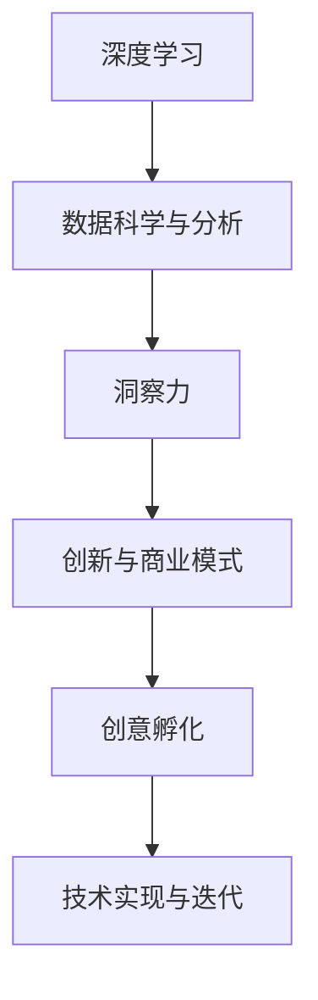

                 

# 洞察力与创意：突破性想法的孵化

> 关键词：突破性想法,创新,洞察力,创意孵化,深度学习,机器学习,人工智能

## 1. 背景介绍

### 1.1 问题由来
在当今信息化、数字化时代，技术的快速发展极大地改变了各行各业的生产方式和商业模式。其中，人工智能（AI）和深度学习（Deep Learning）的崛起，为各行各业带来了前所未有的机遇和挑战。在这个背景下，如何挖掘出潜在的创新点，并成功地将其转化为可行的商业模式，成为了创新者和技术从业者关注的焦点。

人工智能的快速发展，不仅体现在其技术本身的进步，更体现在其应用场景的不断拓展。从自动驾驶、机器人到智能客服、金融科技等领域，AI技术已经渗透到了社会的各个角落。然而，如何从庞大的数据中挖掘出有价值的洞察力，并根据这些洞察力创造出新的商业模式，仍然是当前技术创新的关键所在。

### 1.2 问题核心关键点
突破性想法的孵化，本质上是一个从数据中挖掘洞察力，并根据这些洞察力创造新商业价值的过程。其核心关键点包括：

- **数据采集与处理**：收集和处理高质量的数据，为后续的洞察力挖掘提供基础。
- **模型训练与优化**：选择合适的模型，并对模型进行有效的训练和优化，以提高其预测准确性和泛化能力。
- **洞察力提取**：从模型输出中提取出有意义的信息，洞察出商业价值和应用潜力。
- **创意孵化**：将洞察力转化为具体的商业创意，并评估其可行性和市场潜力。
- **技术实现与迭代**：将创意转化为可执行的技术方案，并进行迭代优化，直至产品化。

## 2. 核心概念与联系

### 2.1 核心概念概述

为了更好地理解如何从数据中挖掘洞察力并创造新的商业模式，本节将介绍几个关键概念：

- **深度学习（Deep Learning）**：基于神经网络的机器学习技术，能够自动从数据中提取特征，并通过多层网络结构进行复杂模式的建模。
- **数据科学与分析（Data Science & Analytics）**：通过数据收集、处理和分析，发现数据中的模式和趋势，为商业决策提供支持。
- **创新与商业模式**：结合数据分析结果，创造出新的商业价值和盈利模式，推动行业发展。
- **洞察力（Insight）**：从数据中提炼出的有意义的信息，为创新提供方向。
- **创意孵化（Idea Incubation）**：将洞察力转化为具体的创新点，并对其进行评估和验证的过程。
- **技术实现与迭代（Technology Implementation & Iteration）**：将创意转换为实际可用的产品或服务，并进行持续优化和改进。

这些核心概念之间的逻辑关系可以通过以下Mermaid流程图来展示：



这个流程图展示了大数据驱动的创新过程中的关键步骤：首先通过深度学习从数据中提取洞察力，然后基于这些洞察力进行创新，并将创新点孵化为可行的商业模式，最后通过技术实现和迭代将其转化为实际应用。

## 3. 核心算法原理 & 具体操作步骤
### 3.1 算法原理概述

深度学习模型，如卷积神经网络（CNN）和循环神经网络（RNN），通过多层非线性变换，能够自动学习数据的复杂特征表示。在数据科学和分析过程中，我们通常使用这些模型来处理和分析大规模数据集，以发现潜在的模式和趋势。

通过数据科学的分析，我们可以挖掘出数据的洞察力，这些洞察力可以是关于用户行为的模式、产品特征的关联，或者是市场趋势的变化等。这些洞察力为创新提供了方向，帮助创新者识别潜在的商业机会。

基于这些洞察力，创新者可以进一步进行创意孵化，即设计和评估具体的商业创新点。创意孵化通常涉及到市场调研、用户反馈、竞争对手分析等环节，以确保创意的可行性和市场潜力。

最后，技术实现与迭代是将创意转化为实际应用的关键步骤。这包括选择合适的技术栈，开发和测试产品原型，以及根据用户反馈和技术发展不断进行优化和迭代。

### 3.2 算法步骤详解

以下是基于深度学习和数据分析的突破性想法孵化的一般步骤：

**Step 1: 数据采集与处理**
- 收集高质量的数据，确保数据的完整性和代表性。
- 对数据进行清洗、去重、归一化等预处理操作，确保数据质量。
- 利用数据科学的分析方法，如统计分析、回归分析等，对数据进行初步分析，发现数据中的模式和趋势。

**Step 2: 模型训练与优化**
- 选择合适的深度学习模型，并对其进行训练和优化。
- 使用交叉验证、超参数调优等技术，提高模型的泛化能力和预测准确性。
- 在训练过程中，注意避免过拟合，通过正则化、Dropout等技术提高模型的鲁棒性。

**Step 3: 洞察力提取**
- 对模型输出进行分析，提取出有意义的信息，如用户行为模式、产品关联特征等。
- 利用数据可视化工具，如图表、热力图等，直观展示洞察力，帮助创新者理解数据的深层含义。

**Step 4: 创意孵化**
- 基于洞察力，设计具体的商业创意，如新产品的功能、新业务模式等。
- 进行市场调研和用户反馈收集，评估创意的可行性和市场潜力。
- 利用MVP（最小可行产品）的方法，快速迭代和验证创意，优化方案。

**Step 5: 技术实现与迭代**
- 选择合适的技术栈和开发工具，将创意转化为可执行的技术方案。
- 进行产品开发和测试，确保产品功能的实现和性能的优化。
- 根据用户反馈和技术发展，持续进行产品迭代，提升用户体验和系统性能。

### 3.3 算法优缺点

基于深度学习和数据分析的创新方法，具有以下优点：
1. 能够自动从大规模数据中提取洞察力，避免了人工分析的繁琐和误差。
2. 深度学习模型的泛化能力和预测准确性较高，能够发现数据中的复杂模式。
3. 技术实现和迭代过程中，可以持续优化产品，快速响应市场变化。

同时，该方法也存在一些局限性：
1. 对数据质量有较高要求，数据收集和处理过程较为繁琐。
2. 深度学习模型的训练和优化需要较长的计算资源和时间。
3. 创意孵化和市场验证过程中，需要多学科协作，存在一定的风险。

尽管存在这些局限性，但就目前而言，基于深度学习和数据分析的创新方法仍然是突破性想法孵化的主流范式。未来相关研究的重点在于如何进一步降低数据获取和处理的成本，提高创意孵化的成功率，同时兼顾技术和商业的双重优化。

### 3.4 算法应用领域

基于深度学习和数据分析的创新方法，在多个领域中得到了广泛应用，包括但不限于：

- **金融科技**：利用深度学习模型对用户行为进行预测，优化金融产品设计，提升用户体验。
- **零售电商**：通过数据分析和洞察力提取，实现个性化推荐和精准营销，提升销售额。
- **医疗健康**：利用深度学习模型进行疾病预测和诊断，提升医疗服务的质量和效率。
- **智慧城市**：通过数据分析和洞察力提取，优化城市管理和公共服务，提升城市运行效率。
- **教育培训**：利用深度学习模型进行学习行为分析，实现个性化教育，提升教育质量。

## 4. 数学模型和公式 & 详细讲解 & 举例说明
### 4.1 数学模型构建

在进行深度学习模型训练和数据分析的过程中，数学模型的构建至关重要。以下是几个关键数学模型及其构建方法：

**多层感知器（MLP）**
- 构建公式：$$\hat{y} = \sigma(W \cdot x + b)$$
- 其中，$W$为权重矩阵，$b$为偏置向量，$\sigma$为激活函数，$x$为输入向量，$\hat{y}$为输出向量。

**卷积神经网络（CNN）**
- 构建公式：$$\hat{y} = W * \sigma \left( \sum_{k=1}^N [x_{k} * K_k + b_k] \right)$$
- 其中，$K_k$为卷积核，$b_k$为偏置项，$\sigma$为激活函数，$*$为卷积操作。

**循环神经网络（RNN）**
- 构建公式：$$\hat{y} = \sigma(W * [x_t * \hat{y}_{t-1} + b]$$
- 其中，$W$为权重矩阵，$b$为偏置向量，$\sigma$为激活函数，$x_t$为输入向量，$y_t$为输出向量。

**长短期记忆网络（LSTM）**
- 构建公式：$$\hat{y} = \sigma(W * [x_t * \hat{y}_{t-1} + b]$$
- 其中，$W$为权重矩阵，$b$为偏置向量，$\sigma$为激活函数，$x_t$为输入向量，$\hat{y}_t$为输出向量。

### 4.2 公式推导过程

以卷积神经网络（CNN）为例，以下是其基本推导过程：

1. 卷积操作
- 卷积操作通过滑动卷积核，计算输入特征图和卷积核的权重点积，得到卷积特征图。
- 公式表示：$$C_k = x * K_k + b_k$$

2. 激活函数
- 激活函数用于增加网络非线性能力，通常采用ReLU、Sigmoid等激活函数。
- 公式表示：$$\sigma(z) = \max(0, z)$$

3. 池化操作
- 池化操作用于减少特征图的大小，提高模型的计算效率。
- 公式表示：$$p_{k,i} = max(p_{k,i-1}, p_{k,i+1})$$

4. 多层堆叠
- 通过多层堆叠，增加网络的深度和复杂度，提升模型的表示能力。
- 公式表示：$$\hat{y} = \sigma(W * \sigma(W * \sigma(...)))$$

### 4.3 案例分析与讲解

**案例：个性化推荐系统**

在零售电商领域，个性化推荐系统是提升用户体验和销售额的关键。通过数据分析和深度学习模型，可以从用户的历史行为中提取洞察力，发现用户偏好和行为模式，从而实现个性化推荐。

具体步骤如下：
1. 数据采集：收集用户行为数据，包括浏览、购买、评价等。
2. 数据处理：对数据进行清洗、去重、归一化等预处理操作。
3. 模型训练：使用深度学习模型，如协同过滤、序列模型等，对用户行为进行建模。
4. 洞察力提取：分析模型输出，提取用户偏好和行为模式，如用户对某一类产品的兴趣程度。
5. 创意孵化：基于洞察力，设计个性化推荐算法，如基于协同过滤的推荐算法。
6. 技术实现与迭代：实现推荐算法，进行A/B测试和用户反馈收集，不断优化推荐效果。

## 5. 项目实践：代码实例和详细解释说明
### 5.1 开发环境搭建

在进行深度学习模型训练和数据分析的过程中，开发环境搭建非常重要。以下是使用Python和PyTorch进行深度学习开发的环境配置流程：

1. 安装Anaconda：从官网下载并安装Anaconda，用于创建独立的Python环境。

2. 创建并激活虚拟环境：
```bash
conda create -n pytorch-env python=3.8 
conda activate pytorch-env
```

3. 安装PyTorch：根据CUDA版本，从官网获取对应的安装命令。例如：
```bash
conda install pytorch torchvision torchaudio cudatoolkit=11.1 -c pytorch -c conda-forge
```

4. 安装TensorBoard：用于可视化深度学习模型的训练过程和性能指标。

5. 安装TensorFlow：用于构建复杂的深度学习模型，如卷积神经网络和循环神经网络。

### 5.2 源代码详细实现

以下是一个基于PyTorch的卷积神经网络（CNN）的实现示例：

```python
import torch
import torch.nn as nn
import torch.optim as optim

# 定义卷积神经网络模型
class CNN(nn.Module):
    def __init__(self):
        super(CNN, self).__init__()
        self.conv1 = nn.Conv2d(3, 16, 3, 1, 1)
        self.conv2 = nn.Conv2d(16, 32, 3, 1, 1)
        self.fc1 = nn.Linear(32*28*28, 128)
        self.fc2 = nn.Linear(128, 10)
        
    def forward(self, x):
        x = self.conv1(x)
        x = nn.functional.relu(x)
        x = self.conv2(x)
        x = nn.functional.relu(x)
        x = x.view(-1, 32*28*28)
        x = self.fc1(x)
        x = nn.functional.relu(x)
        x = self.fc2(x)
        return nn.functional.log_softmax(x, dim=1)

# 加载数据集
train_dataset = ...
test_dataset = ...

# 定义模型和优化器
model = CNN()
optimizer = optim.Adam(model.parameters(), lr=0.001)

# 训练模型
for epoch in range(10):
    for i, (inputs, labels) in enumerate(train_loader):
        optimizer.zero_grad()
        outputs = model(inputs)
        loss = nn.functional.nll_loss(outputs, labels)
        loss.backward()
        optimizer.step()
```

### 5.3 代码解读与分析

**代码分析**：
- 首先，我们定义了一个包含两个卷积层和两个全连接层的卷积神经网络模型，用于图像分类任务。
- 在训练过程中，我们使用了Adam优化器，并在每个epoch结束时进行模型参数的更新。
- 在每次前向传播中，我们通过nn.functional.log_softmax函数计算模型的输出概率分布，并使用nn.functional.nll_loss函数计算损失函数。
- 通过反向传播，我们更新模型参数，并在每次训练结束时打印损失函数值。

**运行结果**：
- 在训练过程中，损失函数值会逐渐下降，模型开始学习到数据中的模式和趋势。
- 在测试集上，我们可以计算模型的准确率和误差率，评估模型的泛化能力。

## 6. 实际应用场景
### 6.1 智能客服系统

基于深度学习和数据分析的突破性想法，可以广泛应用于智能客服系统的构建。传统客服往往需要配备大量人力，高峰期响应缓慢，且一致性和专业性难以保证。通过深度学习模型，可以训练出能够自动理解用户意图，提供精准回答的智能客服系统。

具体步骤如下：
1. 数据采集：收集历史客服对话记录，提取问题和最佳答复。
2. 数据处理：对数据进行清洗、去重、归一化等预处理操作。
3. 模型训练：使用深度学习模型，如Transformer等，对客服对话进行建模。
4. 洞察力提取：分析模型输出，提取用户意图和问题类型，如情感分析、主题分类等。
5. 创意孵化：基于洞察力，设计智能客服系统，实现自动化回复。
6. 技术实现与迭代：实现智能客服系统，进行A/B测试和用户反馈收集，不断优化系统性能。

### 6.2 金融舆情监测

金融机构需要实时监测市场舆论动向，以便及时应对负面信息传播，规避金融风险。传统的人工监测方式成本高、效率低，难以应对网络时代海量信息爆发的挑战。通过深度学习模型，可以实现对金融舆情的自动化监测和分析。

具体步骤如下：
1. 数据采集：收集金融领域相关的新闻、报道、评论等文本数据。
2. 数据处理：对数据进行清洗、去重、归一化等预处理操作。
3. 模型训练：使用深度学习模型，如BERT等，对金融舆情进行建模。
4. 洞察力提取：分析模型输出，提取市场舆情变化趋势，如情感分析、主题分类等。
5. 创意孵化：基于洞察力，设计舆情监测系统，实现自动化预警。
6. 技术实现与迭代：实现舆情监测系统，进行A/B测试和用户反馈收集，不断优化系统性能。

### 6.3 个性化推荐系统

当前的推荐系统往往只依赖用户的历史行为数据进行物品推荐，无法深入理解用户的真实兴趣偏好。通过深度学习模型，可以实现对用户行为更深层次的洞察，从而提供更个性化、精准的推荐。

具体步骤如下：
1. 数据采集：收集用户浏览、点击、评论、分享等行为数据。
2. 数据处理：对数据进行清洗、去重、归一化等预处理操作。
3. 模型训练：使用深度学习模型，如协同过滤、序列模型等，对用户行为进行建模。
4. 洞察力提取：分析模型输出，提取用户兴趣点，如用户对某一类产品的偏好程度。
5. 创意孵化：基于洞察力，设计个性化推荐算法，如基于协同过滤的推荐算法。
6. 技术实现与迭代：实现推荐算法，进行A/B测试和用户反馈收集，不断优化推荐效果。

### 6.4 未来应用展望

随着深度学习模型和数据分析技术的不断发展，基于突破性想法的孵化方法将在更多领域得到应用，为传统行业带来变革性影响。

在智慧医疗领域，基于深度学习的诊断和推荐系统，可以提升医疗服务的智能化水平，辅助医生诊疗，加速新药开发进程。

在智能教育领域，通过深度学习模型进行学情分析，实现个性化教育，提升教育质量。

在智慧城市治理中，通过深度学习模型进行城市事件监测、舆情分析、应急指挥等环节，提高城市管理的自动化和智能化水平，构建更安全、高效的未来城市。

此外，在企业生产、社会治理、文娱传媒等众多领域，基于深度学习和数据分析的突破性想法，也将不断涌现，为经济社会发展注入新的动力。相信随着技术的日益成熟，深度学习和大数据分析将成为人工智能技术落地应用的重要手段，推动人工智能技术的进一步普及和发展。

## 7. 工具和资源推荐
### 7.1 学习资源推荐

为了帮助开发者系统掌握深度学习和大数据分析的理论基础和实践技巧，这里推荐一些优质的学习资源：

1. 《深度学习》系列书籍：由Ian Goodfellow、Yoshua Bengio和Aaron Courville合著，全面介绍了深度学习的基本概念和关键技术。
2. 《TensorFlow官方文档》：Google开发的深度学习框架，提供了丰富的教程和样例，是进行深度学习开发的必备资料。
3. 《PyTorch官方文档》：Facebook开发的深度学习框架，提供了灵活的动态计算图和高效训练功能，是进行深度学习开发的理想选择。
4. Kaggle平台：提供了大量的公开数据集和竞赛项目，可以帮助开发者进行深度学习和大数据分析实践。
5. Coursera和edX等在线课程：提供系统化的深度学习和大数据分析课程，涵盖从理论到实践的各个环节。

通过对这些资源的学习实践，相信你一定能够快速掌握深度学习和大数据分析的精髓，并用于解决实际的NLP问题。

### 7.2 开发工具推荐

高效的开发离不开优秀的工具支持。以下是几款用于深度学习和大数据分析开发的常用工具：

1. PyTorch：基于Python的开源深度学习框架，灵活动态的计算图，适合快速迭代研究。大部分深度学习模型都有PyTorch版本的实现。
2. TensorFlow：由Google主导开发的开源深度学习框架，生产部署方便，适合大规模工程应用。同样有丰富的深度学习模型资源。
3. Keras：基于TensorFlow的高级API，提供了简单易用的接口，适合快速原型开发。
4. Jupyter Notebook：用于数据科学和机器学习实验的交互式开发环境，支持Python、R等多种语言。
5. Visual Studio Code：轻量级、功能强大的代码编辑器，支持多种编程语言和扩展。

合理利用这些工具，可以显著提升深度学习和大数据分析的开发效率，加快创新迭代的步伐。

### 7.3 相关论文推荐

深度学习和大数据分析的发展源于学界的持续研究。以下是几篇奠基性的相关论文，推荐阅读：

1. AlexNet：ImageNet大规模视觉识别挑战赛的冠军，标志着深度学习在计算机视觉领域的应用。
2. LeNet-5：最初的卷积神经网络，用于手写数字识别任务，奠定了深度学习在图像识别领域的基础。
3. RNN：递归神经网络，用于序列数据建模，广泛应用于自然语言处理和语音识别等任务。
4. LSTM：长短期记忆网络，用于处理时间序列数据，广泛应用于文本生成、语音识别等任务。
5. Attention Mechanism：注意力机制，用于提高深度学习模型的泛化能力和推理性能。

这些论文代表了大数据驱动的创新过程中的关键技术突破，为后续深度学习和大数据分析的研究奠定了基础。

## 8. 总结：未来发展趋势与挑战
### 8.1 总结

本文对基于深度学习和数据分析的突破性想法孵化过程进行了全面系统的介绍。首先阐述了深度学习和数据分析的理论基础和应用场景，明确了大数据驱动的创新过程中的关键步骤。其次，从原理到实践，详细讲解了深度学习模型的构建和优化，以及数据分析中的洞察力提取和创意孵化过程。同时，本文还广泛探讨了深度学习和大数据分析在多个行业领域的应用前景，展示了其广阔的应用潜力。

通过本文的系统梳理，可以看到，深度学习和大数据分析技术正在成为人工智能技术的重要支撑，推动了各行各业的技术创新和产业升级。未来，伴随深度学习模型和数据分析技术的进一步发展，基于突破性想法的孵化方法将在更多领域得到应用，为人类社会的各个方面带来深远的影响。

### 8.2 未来发展趋势

展望未来，深度学习和大数据分析技术将呈现以下几个发展趋势：

1. 模型规模持续增大。随着算力成本的下降和数据规模的扩张，深度学习模型和数据分析模型的参数量还将持续增长。超大规模模型蕴含的丰富知识，将为更多的应用场景提供支持。
2. 模型复杂度不断提升。未来深度学习模型将更加复杂，能够处理更复杂的多模态数据，并实现跨领域、跨模态的知识迁移。
3. 数据质量和技术栈更加多样化。随着数据采集和处理的自动化水平提升，数据质量将进一步提高。同时，更多灵活的技术栈将出现，满足不同应用场景的需求。
4. 创新过程更加数据驱动。大数据驱动的创新将成为主流，深度学习和数据分析在各个领域的应用将更加深入和广泛。
5. 人工智能技术与各行业的融合更加紧密。深度学习和大数据分析将与各行业的应用场景深度结合，推动各行各业的智能化转型。

以上趋势凸显了深度学习和大数据分析技术的广泛应用前景，将为人类社会带来更多机遇和挑战。

### 8.3 面临的挑战

尽管深度学习和大数据分析技术已经取得了显著的进步，但在迈向更广泛应用的过程中，仍面临诸多挑战：

1. 数据隐私和安全问题。深度学习模型通常需要大量数据进行训练，如何保护数据隐私和安全，避免数据泄露和滥用，成为关键挑战。
2. 模型泛化能力不足。深度学习模型在特定数据集上表现优异，但在其他数据集上泛化性能往往较差，需要进行更广泛的数据和模型训练。
3. 模型复杂度和计算成本高。深度学习模型和数据分析模型的复杂度和计算成本较高，需要高性能计算资源支持。
4. 技术普及和应用门槛高。深度学习和大数据分析技术在实际应用中，需要多学科协作和较高技术门槛，推广普及存在困难。
5. 伦理和社会影响。深度学习和大数据分析技术的应用，涉及隐私、伦理和社会影响等多方面问题，需要制定相应的政策和规范。

正视深度学习和大数据分析技术面临的这些挑战，积极应对并寻求突破，将是大数据驱动的创新技术走向成熟的重要步骤。

### 8.4 研究展望

面对深度学习和大数据分析技术所面临的挑战，未来的研究需要在以下几个方面寻求新的突破：

1. 开发更高效的数据采集和处理技术，提升数据质量，降低数据获取成本。
2. 探索更高效的模型训练和优化方法，提高模型的泛化能力和计算效率。
3. 引入更多先验知识，增强模型的推理能力和跨领域迁移能力。
4. 引入因果分析和博弈论工具，增强模型的稳定性和鲁棒性。
5. 结合符号逻辑和知识图谱，提升模型的解释能力和可控性。

这些研究方向的探索，必将引领深度学习和大数据分析技术迈向更高的台阶，为人工智能技术的普及和应用提供更坚实的技术支撑。

## 9. 附录：常见问题与解答

**Q1：深度学习模型在实际应用中容易出现过拟合问题，如何解决？**

A: 深度学习模型容易出现过拟合问题，主要是因为模型过于复杂，导致在训练集上表现优异，但在测试集上泛化性能较差。解决过拟合问题的方法包括：

1. 数据增强：通过对训练数据进行扩充，增加数据多样性，如旋转、裁剪、加噪声等。
2. 正则化：使用L1、L2正则、Dropout等技术，限制模型的复杂度，减少过拟合风险。
3. 早停法：在验证集上监测模型性能，当性能不再提升时，停止训练，防止过拟合。
4. 模型集成：通过集成多个模型的预测结果，提高模型的泛化能力和鲁棒性。

通过以上方法，可以有效地缓解深度学习模型在实际应用中的过拟合问题，提高模型的泛化性能。

**Q2：深度学习模型的训练和优化过程中，如何选择合适的超参数？**

A: 深度学习模型的训练和优化过程中，选择合适的超参数至关重要，直接影响模型的性能和泛化能力。选择合适的超参数通常需要以下步骤：

1. 初始化超参数：根据模型结构和数据特点，选择一组初始的超参数值。
2. 网格搜索和随机搜索：通过网格搜索或随机搜索，在超参数空间中寻找最优解。
3. 交叉验证：使用交叉验证技术，评估模型在验证集上的性能，选择最优超参数。
4. 自动调参：使用自动调参工具，如Hyperopt、Optuna等，自动搜索最优超参数。

通过以上方法，可以有效地选择合适的超参数，提高深度学习模型的性能和泛化能力。

**Q3：深度学习模型在实际应用中，如何进行模型压缩和加速？**

A: 深度学习模型在实际应用中，通常面临计算资源和存储空间的限制。为了解决这一问题，可以进行模型压缩和加速：

1. 模型剪枝：通过剪枝技术，去除冗余参数，减小模型规模，提高计算效率。
2. 量化加速：将浮点模型转为定点模型，压缩存储空间，提高计算效率。
3. 模型并行：通过分布式计算和模型并行，提高计算速度和处理能力。
4. 模型蒸馏：通过模型蒸馏技术，将大模型压缩为小模型，减小计算资源和存储空间需求。

通过以上方法，可以有效地解决深度学习模型在实际应用中的计算资源和存储空间问题，提高模型的实时性和可扩展性。

**Q4：如何评估深度学习模型的性能和泛化能力？**

A: 深度学习模型的性能和泛化能力可以通过以下指标进行评估：

1. 准确率（Accuracy）：模型在测试集上的分类正确率。
2. 精确率（Precision）：模型预测为正类的样本中，真正为正类的比例。
3. 召回率（Recall）：真正为正类的样本中，被模型预测为正类的比例。
4. F1 Score：精确率和召回率的调和平均，综合评估模型的性能。
5. ROC曲线：以假正率为横坐标，真正率为纵坐标，评估模型的分类性能。
6. AUC值：ROC曲线下的面积，用于衡量模型的分类性能。

通过以上指标，可以全面评估深度学习模型的性能和泛化能力，选择合适的模型进行应用。

---

作者：禅与计算机程序设计艺术 / Zen and the Art of Computer Programming

