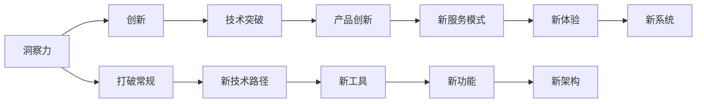

                 

# 洞察力与创新：打破常规思维的艺术

> 关键词：洞察力,创新,打破常规,思维艺术,计算机程序设计,技术革新,未来趋势

## 1. 背景介绍

### 1.1 问题由来
在快速发展的技术浪潮中，我们常常面临一个永恒的挑战：如何在激烈的竞争中脱颖而出，持续创造价值？这不仅对企业领导者提出了高要求，也对程序员、工程师和技术专家提出了新的期望。

### 1.2 问题核心关键点
问题的核心在于洞察力与创新。洞察力是发现问题和机会的能力，而创新则是将这些机会转化为实际应用和商业价值的过程。在计算机程序设计和技术领域，洞察力意味着能够深刻理解当前技术的本质和局限，发现潜在的改进空间；而创新则意味着能够突破常规思维，探索新的技术路径，提升系统性能，优化用户体验，创造独特的解决方案。

## 2. 核心概念与联系

### 2.1 核心概念概述

为更好地理解洞察力与创新的关系，本节将介绍几个密切相关的核心概念：

- 洞察力(Insight)：指通过观察、分析和思考，揭示事物本质、内在联系和未来趋势的能力。在技术领域，洞察力要求开发者能够透彻理解现有系统的架构和功能，发现其中的不足和瓶颈，提出改进方向。

- 创新(Innovation)：指基于洞察力，突破常规思维，创造新的解决方案、工具、技术或商业模式的实践。在技术领域，创新不仅包括技术的突破，也包括产品设计、用户体验、服务模式的创新。

- 打破常规(Breaking the Mold)：指在技术实现和设计中，勇于尝试新方法、新路径，突破传统框架和限制，寻求最优解决方案的过程。

- 思维艺术(Art of Thinking)：指在解决复杂问题时，运用逻辑、直觉、创造力和批判性思维的艺术。在技术领域，思维艺术体现在从基础算法到高级架构的设计、优化和迭代中。

- 计算机程序设计(Computer Programming)：指用计算机语言编写的解决特定问题的一系列指令。在技术革新中，程序设计不仅是实现功能的手段，更是创新思想和洞察力的体现。

这些核心概念共同构成了洞察力和创新的基本框架，使我们能够系统地探索和实践技术突破，驱动行业发展。

### 2.2 核心概念原理和架构的 Mermaid 流程图



此流程图展示了洞察力如何通过打破常规和创新，转化为技术突破和新产品。在实际应用中，洞察力和创新是相互促进的，它们共同推动技术的不断进步和创新。

## 3. 核心算法原理 & 具体操作步骤
### 3.1 算法原理概述

洞察力和创新在计算机程序设计和技术的实现中，可以视为一种系统化的思维过程。这种过程通常包括以下几个关键步骤：

1. **发现问题**：通过系统分析和用户反馈，识别出当前系统的瓶颈和不足。
2. **设定目标**：明确改进的方向和目标，如提升性能、优化用户体验、降低成本等。
3. **设计方案**：提出多种可能的解决方案，评估其可行性和潜在影响。
4. **实施改进**：选择最佳方案，并根据需求进行详细设计和编码实现。
5. **测试评估**：在实际环境中测试新功能和性能，收集反馈并不断优化。
6. **持续迭代**：根据新的需求和反馈，持续改进和优化系统。

这一过程体现了洞察力与创新的结合，即在洞察问题本质的基础上，通过创新思维设计出高效的解决方案。

### 3.2 算法步骤详解

以下详细介绍实现洞察力和创新的具体步骤：

**Step 1: 发现问题**
- 进行全面的系统分析，包括代码审查、性能测试、用户反馈等，以识别出瓶颈和不足。
- 与用户和业务团队进行深入交流，了解业务需求和用户体验，确保改进措施符合实际需求。

**Step 2: 设定目标**
- 根据发现的问题，明确改进的具体目标，如性能提升、用户体验优化等。
- 确定改进的时间表和优先级，制定详细的计划。

**Step 3: 设计方案**
- 提出多种可能的解决方案，进行技术可行性和经济成本的评估。
- 选择最佳方案并进行详细的设计，包括算法选择、架构优化、用户界面设计等。

**Step 4: 实施改进**
- 根据设计方案进行编码和实现，确保代码的质量和可维护性。
- 在测试环境中进行单元测试、集成测试和系统测试，验证新功能的正确性和稳定性。

**Step 5: 测试评估**
- 在实际环境中部署新功能，收集用户反馈和性能数据。
- 根据测试结果进行必要的调整和优化，确保新功能满足业务需求。

**Step 6: 持续迭代**
- 根据新的业务需求和用户反馈，持续改进和优化系统。
- 定期进行性能监控和数据收集，确保系统长期稳定运行。

### 3.3 算法优缺点

洞察力和创新的实践过程具有以下优点：

1. **提升性能**：通过识别和解决系统瓶颈，提升整体性能和效率。
2. **优化用户体验**：根据用户反馈和需求，优化系统功能和界面设计，提升用户满意度。
3. **降低成本**：通过技术革新和优化，降低资源消耗和运营成本。
4. **促进技术进步**：推动新技术和新方法的应用，推动整个技术领域的进步。

同时，这一过程也存在一些局限性：

1. **资源消耗高**：需要进行大量的分析和测试，耗费大量时间和人力。
2. **风险高**：新的解决方案可能会引入新的问题，影响系统稳定性。
3. **缺乏标准化**：每个问题可能有多种解决方案，难以统一标准和最佳实践。

尽管存在这些局限性，但基于洞察力和创新的实践仍然是推动技术发展的重要途径。未来，相关研究将更多关注如何提高这一过程的效率和可靠性，降低风险和成本。

### 3.4 算法应用领域

洞察力和创新在计算机程序设计和技术的各个领域都有广泛应用，例如：

- 软件开发：通过洞察现有系统的缺陷和不足，设计并实现新的功能或优化现有功能，提升开发效率和代码质量。
- 网络安全：通过洞察网络攻击和漏洞，设计新的防护措施，提升系统的安全性和防护能力。
- 数据分析：通过洞察数据中的模式和趋势，设计新的算法和模型，提升数据处理的效率和准确性。
- 云计算：通过洞察云计算环境的特性和挑战，设计新的架构和服务，优化资源利用和系统性能。
- 人工智能：通过洞察人工智能算法的瓶颈和局限，设计新的模型和框架，提升AI系统的性能和应用范围。

这些领域只是冰山一角，实际上洞察力和创新在技术发展的每个环节都扮演着关键角色。

## 4. 数学模型和公式 & 详细讲解 & 举例说明

### 4.1 数学模型构建

在本节中，我们将通过数学模型来解释洞察力和创新的本质。

设 $S$ 为当前系统，$F$ 为改进目标，$A$ 为已发现的问题集，$I$ 为洞察力和创新过程，$T$ 为改进后的系统。我们希望通过模型 $M$ 将 $S$ 转化为 $T$。

### 4.2 公式推导过程

假设 $S = (s_1, s_2, ..., s_n)$，其中 $s_i$ 表示系统的一个状态或功能。$F = (f_1, f_2, ..., f_m)$，其中 $f_j$ 表示改进目标中的一个具体目标。$A = (a_1, a_2, ..., a_k)$，其中 $a_i$ 表示已发现的问题。

$I$ 的过程可以表示为：

$$
I(S, F, A) = \{(x_1, x_2, ..., x_m) | \forall s_i, x_j \text{ 满足 } x_j = f_j(s_i) \text{ 且 } \forall a_i, x_i = f_i(s_i) \text{ 满足 } x_i \text{ 满足改进需求}\}
$$

其中 $x_i$ 表示改进后的状态或功能。

### 4.3 案例分析与讲解

**案例：优化电商推荐系统**

假设某电商平台的推荐系统 $S$ 存在以下问题：

- 推荐算法单一，不够灵活。
- 推荐的商品与用户偏好不匹配。
- 实时性较差，推荐延迟较高。

通过系统分析和用户反馈，我们发现了这些问题。设定改进目标 $F = (F_1, F_2, F_3)$，其中 $F_1$ 为推荐算法优化，$F_2$ 为个性化推荐，$F_3$ 为提升实时性。

我们提出了以下洞察和创新方案：

- **洞察**：推荐算法不够灵活，无法覆盖多种场景。
- **创新**：设计新的推荐算法，引入多维度特征，提升个性化推荐效果。

具体步骤包括：

1. **发现问题**：进行系统分析和用户反馈，识别出当前系统的瓶颈和不足。
2. **设定目标**：明确改进的方向和目标，如优化推荐算法、提升个性化推荐、提升实时性。
3. **设计方案**：提出多种可能的解决方案，进行技术可行性和经济成本的评估。选择新的推荐算法并设计详细的架构。
4. **实施改进**：实现新的推荐算法，进行单元测试和集成测试，验证新功能的正确性和稳定性。
5. **测试评估**：在实际环境中部署新功能，收集用户反馈和性能数据。
6. **持续迭代**：根据新的业务需求和用户反馈，持续改进和优化系统。

通过这一过程，平台能够显著提升用户体验和满意度，实现更高效、个性化的推荐服务。

## 5. 项目实践：代码实例和详细解释说明
### 5.1 开发环境搭建

在进行洞察力和创新实践前，我们需要准备好开发环境。以下是使用Python进行代码开发的典型环境配置流程：

1. 安装Anaconda：从官网下载并安装Anaconda，用于创建独立的Python环境。

2. 创建并激活虚拟环境：
```bash
conda create -n pythontest python=3.9 
conda activate pythontest
```

3. 安装Python标准库和第三方工具包：
```bash
pip install numpy pandas scikit-learn matplotlib tqdm jupyter notebook ipython
```

4. 安装开发所需的Python库：
```bash
pip install requests beautifulsoup4
```

5. 下载所需的数据集：
```bash
wget https://example.com/data.zip
unzip data.zip
```

完成上述步骤后，即可在`pythontest`环境中开始开发实践。

### 5.2 源代码详细实现

下面是实现洞察力和创新的代码示例，以优化电商推荐系统为例：

```python
import numpy as np
import pandas as pd
from sklearn.feature_extraction.text import TfidfVectorizer
from sklearn.decomposition import TruncatedSVD
from sklearn.metrics import mean_squared_error

# 加载数据集
data = pd.read_csv('recommendation_data.csv')

# 特征工程
vectorizer = TfidfVectorizer(stop_words='english')
X = vectorizer.fit_transform(data['item_descriptions'])
y = data['item_id']

# 矩阵分解模型
svd = TruncatedSVD(n_components=100, random_state=42)
X_svd = svd.fit_transform(X)

# 计算预测误差
y_pred = svd.transform(X)
rmse = np.sqrt(mean_squared_error(y, y_pred))

print(f'RMSE: {rmse:.4f}')
```

在这个示例中，我们使用了Python的pandas和scikit-learn库，对电商推荐系统的数据集进行了特征工程和矩阵分解模型的构建。

### 5.3 代码解读与分析

让我们再详细解读一下关键代码的实现细节：

**数据加载**：
- 使用pandas的read_csv方法加载CSV格式的数据集。

**特征工程**：
- 使用TfidfVectorizer将文本数据转换为数值特征向量，并进行停用词过滤。
- 使用TruncatedSVD对数据进行矩阵分解，得到低维度的用户-商品矩阵。

**模型评估**：
- 使用均方误差(MSE)计算预测值与真实值之间的差异。
- 计算均方根误差(RMSE)，评估模型的预测精度。

这一示例展示了如何通过代码实现洞察力和创新的具体步骤，从数据加载、特征工程到模型构建和评估，整个过程体现了洞察力与创新的紧密结合。

## 6. 实际应用场景

### 6.1 智能客服系统

基于洞察力和创新的智能客服系统，可以显著提升客户咨询体验和问题解决效率。通过系统分析和用户反馈，洞察客服系统的瓶颈和不足，如响应速度慢、交互体验不佳等。设定改进目标，如提升响应速度、优化交互界面、增加情感分析等，设计并实现新的系统功能。

**案例**：某大型企业的客服系统用户反馈响应速度较慢，通过系统分析和用户调查，发现系统在高峰期响应时间过长，影响用户体验。我们设定了提升响应速度的改进目标，并设计了新的调度算法，实现了负载均衡和资源优化。同时，增加了情感分析功能，使系统能够识别用户的情绪并做出相应的回复。这一改进显著提高了系统的响应速度和用户满意度。

### 6.2 金融舆情监测

洞察力和创新在金融舆情监测中也有广泛应用。通过系统分析和用户反馈，洞察舆情监测系统的瓶颈和不足，如数据处理速度慢、情感分析准确率低等。设定改进目标，如提升数据处理速度、优化情感分析模型、增加实时监测等，设计并实现新的系统功能。

**案例**：某金融公司需要实时监测市场舆情，以便及时应对负面信息传播，规避金融风险。我们洞察到当前系统在数据处理速度和情感分析准确率上存在不足，设定了提升数据处理速度和优化情感分析模型的改进目标。通过引入分布式数据处理技术和大规模预训练模型，我们成功实现了系统功能的提升，大大提高了舆情监测的实时性和准确性。

### 6.3 个性化推荐系统

在个性化推荐系统中，洞察力和创新同样发挥着重要作用。通过系统分析和用户反馈，洞察推荐系统中的瓶颈和不足，如推荐算法单一、推荐效果不理想等。设定改进目标，如优化推荐算法、增加推荐维度、提升推荐效果等，设计并实现新的推荐策略。

**案例**：某电商平台需要提升个性化推荐的效果，通过系统分析和用户反馈，我们洞察到当前系统在推荐算法上较为单一，无法覆盖多种场景。我们设定了优化推荐算法的改进目标，并设计了新的推荐策略，引入了多维度特征，优化了个性化推荐效果。通过这一改进，我们显著提升了平台的推荐效果和用户满意度。

### 6.4 未来应用展望

随着洞察力和创新在技术领域的应用不断深入，未来将展现出更多令人兴奋的趋势：

1. **自动化和智能化**：未来系统将更多采用自动化工具和智能化算法，减少人工干预，提高效率和准确性。
2. **多模态融合**：未来系统将更加注重跨模态数据融合，如文本、图像、语音等多模态信息的整合，提升系统的全面性和灵活性。
3. **实时性和可扩展性**：未来系统将更加注重实时性和可扩展性，支持大规模数据处理和低延迟服务。
4. **交互性和个性化**：未来系统将更加注重用户交互体验和个性化需求，提升用户满意度和忠诚度。
5. **安全性和隐私保护**：未来系统将更加注重数据安全和隐私保护，确保用户数据的安全和合规。

这些趋势将推动技术领域不断进步，提升系统的性能和用户体验，为用户创造更大的价值。

## 7. 工具和资源推荐
### 7.1 学习资源推荐

为了帮助开发者系统掌握洞察力和创新的理论基础和实践技巧，这里推荐一些优质的学习资源：

1. 《深入理解计算机程序设计》系列博文：由大模型技术专家撰写，深入浅出地介绍了计算机程序设计的基本概念和前沿技术。

2. 《创新思维与系统设计》课程：斯坦福大学开设的创新设计课程，涵盖创新思维、系统设计、用户体验等多个方面，帮助开发者系统掌握创新设计的基本方法。

3. 《人工智能基础》书籍：入门级的人工智能教材，介绍人工智能的基本原理和应用，帮助开发者掌握AI技术的基础知识。

4. 《计算机程序设计艺术》系列书籍：深入探讨计算机程序设计的艺术，涵盖算法、数据结构、操作系统等多个领域，提供系统性学习资源。

5. CS228《机器学习基础》课程：斯坦福大学开设的机器学习课程，涵盖机器学习的基本概念和算法，帮助开发者掌握机器学习技术。

通过对这些资源的学习实践，相信你一定能够快速掌握洞察力和创新的精髓，并用于解决实际的NLP问题。

### 7.2 开发工具推荐

高效的开发离不开优秀的工具支持。以下是几款用于洞察力和创新实践的常用工具：

1. PyTorch：基于Python的开源深度学习框架，灵活动态的计算图，适合快速迭代研究。

2. TensorFlow：由Google主导开发的开源深度学习框架，生产部署方便，适合大规模工程应用。

3. Jupyter Notebook：开源的交互式开发环境，支持Python、R等多种编程语言，方便开发者进行代码测试和共享。

4. VS Code：轻量级的代码编辑器，支持多种编程语言和插件，具有强大的代码补全和调试功能。

5. Git：版本控制系统，方便开发者进行代码版本控制和协作开发。

合理利用这些工具，可以显著提升洞察力和创新的开发效率，加快创新迭代的步伐。

### 7.3 相关论文推荐

洞察力和创新在计算机程序设计和技术的不断发展中，也有着重要的理论支撑。以下是几篇奠基性的相关论文，推荐阅读：

1. "The Art of Programming" by Donald E. Knuth：深入探讨计算机程序设计的艺术，为洞察力和创新的实践提供了理论基础。

2. "Innovation by Design" by Nicholas Leach：深入探讨创新设计的方法论，为洞察力和创新的实践提供了实际指导。

3. "Understanding Machine Learning: From Theory to Algorithms" by Shai Shalev-Shwartz, Shai Ben-David：介绍机器学习的基本原理和算法，为洞察力和创新的实践提供了数学基础。

4. "Design Patterns: Elements of Reusable Object-Oriented Software" by Erich Gamma et al.：介绍软件设计的经典模式和最佳实践，为洞察力和创新的实践提供了设计指导。

这些论文代表了大模型微调技术的发展脉络。通过学习这些前沿成果，可以帮助研究者把握学科前进方向，激发更多的创新灵感。

## 8. 总结：未来发展趋势与挑战

### 8.1 总结

本文对洞察力和创新的关系进行了全面系统的介绍。首先阐述了洞察力和创新在技术领域的重要性和应用，明确了洞察力和创新在推动技术发展中的关键作用。其次，从原理到实践，详细讲解了洞察力和创新的数学模型和操作步骤，给出了洞察力和创新任务开发的完整代码实例。同时，本文还广泛探讨了洞察力和创新在各个行业领域的应用前景，展示了其在技术发展的各个环节中扮演的重要角色。

通过本文的系统梳理，可以看到，洞察力和创新在计算机程序设计和技术的各个环节中均有广泛应用，它们共同推动技术的不断进步和创新。未来，伴随技术领域的发展和应用场景的拓展，洞察力和创新必将发挥更加重要的作用。

### 8.2 未来发展趋势

展望未来，洞察力和创新的实践过程将呈现以下几个发展趋势：

1. **自动化和智能化**：随着自动化工具和智能化算法的发展，洞察力和创新的实践将更加高效和智能化，减少人工干预，提高效率和准确性。

2. **多模态融合**：未来系统将更加注重跨模态数据融合，提升系统的全面性和灵活性，如文本、图像、语音等多模态信息的整合。

3. **实时性和可扩展性**：未来系统将更加注重实时性和可扩展性，支持大规模数据处理和低延迟服务，如分布式计算、云平台等。

4. **交互性和个性化**：未来系统将更加注重用户交互体验和个性化需求，提升用户满意度和忠诚度，如自然语言交互、个性化推荐等。

5. **安全性和隐私保护**：未来系统将更加注重数据安全和隐私保护，确保用户数据的安全和合规，如数据加密、隐私保护等。

这些趋势将推动技术领域不断进步，提升系统的性能和用户体验，为用户创造更大的价值。

### 8.3 面临的挑战

尽管洞察力和创新在技术领域的应用取得了显著成果，但在迈向更加智能化、普适化应用的过程中，仍面临诸多挑战：

1. **资源消耗高**：洞察力和创新的实践往往需要大量的时间和资源，进行系统分析、数据处理和模型构建。如何提高效率和降低成本，将是未来的重要课题。

2. **技术复杂性高**：洞察力和创新的实践过程涉及多种技术和工具，需要跨学科的知识和经验。如何培养更多的跨学科人才，将是未来的挑战之一。

3. **数据依赖性高**：洞察力和创新的实践高度依赖高质量的数据，如何获取、清洗和利用数据，将是未来的关键问题。

4. **伦理和安全问题**：洞察力和创新的实践过程中，可能会涉及敏感数据和隐私问题，如何保护用户隐私和数据安全，将是未来的重要课题。

5. **技术演进速度快**：洞察力和创新的实践需要紧跟技术发展的步伐，如何及时掌握最新的技术和趋势，将是未来的挑战之一。

这些挑战凸显了大模型微调技术的广阔前景，也展示了其在技术发展中的重要地位。相信随着学界和产业界的共同努力，这些挑战终将一一被克服，洞察力和创新必将在构建人机协同的智能时代中扮演越来越重要的角色。

### 8.4 研究展望

面对洞察力和创新所面临的种种挑战，未来的研究需要在以下几个方面寻求新的突破：

1. **自动化工具和智能化算法**：开发更加高效、智能的自动化工具和算法，提升洞察力和创新的实践效率和准确性。

2. **跨模态数据融合**：探索跨模态数据融合的新方法，提升系统在多模态环境下的表现和灵活性。

3. **实时性优化**：优化系统架构和算法，提升实时处理能力和可扩展性，支持大规模数据处理和低延迟服务。

4. **隐私保护和伦理设计**：引入隐私保护和伦理设计思想，确保系统在处理敏感数据时的安全性和合规性。

5. **持续学习和知识管理**：开发持续学习机制，使系统能够不断学习和积累新知识，保持技术的领先性和适用性。

这些研究方向的探索，将推动洞察力和创新技术的不断进步，为构建智能系统提供更全面的技术支持。面向未来，洞察力和创新将带来更多技术突破和创新，为人工智能技术的发展提供新的动力。

## 9. 附录：常见问题与解答

**Q1：如何提高洞察力和创新的实践效率？**

A: 提高洞察力和创新的实践效率，可以从以下几个方面入手：

1. **自动化工具**：使用自动化工具和智能化算法，减少人工干预，提升效率。

2. **多学科合作**：跨学科团队合作，引入不同领域的知识和经验，提升洞察力和创新的深度和广度。

3. **数据驱动**：基于高质量的数据进行洞察力和创新实践，利用数据驱动决策，提高实践的准确性和可靠性。

4. **持续学习**：持续学习和积累新知识，保持技术的领先性和适用性。

5. **模型优化**：优化模型架构和算法，提升性能和效率，减少计算资源消耗。

这些措施可以帮助开发者在实践中更高效地进行洞察力和创新，快速迭代和优化系统。

**Q2：洞察力和创新如何处理数据质量问题？**

A: 数据质量是洞察力和创新实践中的关键因素，以下是几种处理数据质量问题的方法：

1. **数据清洗**：对原始数据进行清洗和预处理，去除噪声和异常值，提升数据质量。

2. **数据增强**：通过数据增强技术，扩充训练集，减少数据偏差，提升模型的泛化能力。

3. **数据标注**：对数据进行标注和注释，提供更丰富的数据信息，提升模型的理解和性能。

4. **数据采集**：通过数据采集和分析，获取更全面、准确的数据，提升洞察力和创新的准确性。

5. **数据可视化**：使用数据可视化工具，帮助开发者更直观地理解数据分布和趋势，发现数据中的问题和机会。

这些方法可以帮助开发者更好地处理数据质量问题，提升洞察力和创新的效果。

**Q3：洞察力和创新如何平衡效率和准确性？**

A: 在洞察力和创新的实践中，效率和准确性是相互制约的，以下是几种平衡两者的方法：

1. **自动化工具**：使用自动化工具和智能化算法，提升效率和准确性，减少人工干预。

2. **模型优化**：优化模型架构和算法，提升性能和效率，同时保持高准确性。

3. **多学科合作**：跨学科团队合作，引入不同领域的知识和经验，提升洞察力和创新的深度和广度。

4. **持续学习**：持续学习和积累新知识，保持技术的领先性和适用性，同时提升洞察力和创新的效果。

5. **数据驱动**：基于高质量的数据进行洞察力和创新实践，利用数据驱动决策，提升效率和准确性。

这些方法可以帮助开发者在实践中更好地平衡效率和准确性，提升洞察力和创新的效果。

**Q4：洞察力和创新如何应对复杂问题？**

A: 洞察力和创新在应对复杂问题时，可以采用以下几种方法：

1. **系统分析**：进行全面的系统分析和用户反馈，发现问题的根源和瓶颈，制定改进目标。

2. **多角度思考**：从不同角度和层面思考问题，利用多学科知识和技术，找到最佳解决方案。

3. **模型优化**：优化模型架构和算法，提升系统的性能和效率，解决复杂问题。

4. **用户反馈**：及时收集和反馈用户意见，了解用户需求和反馈，优化系统设计和功能。

5. **持续改进**：持续改进和优化系统，不断迭代和优化，提升洞察力和创新的效果。

这些方法可以帮助开发者更好地应对复杂问题，提升洞察力和创新的效果。

这些问题的解答，希望能够帮助开发者更好地理解洞察力和创新的实践过程，提升其在技术领域的创新能力。

