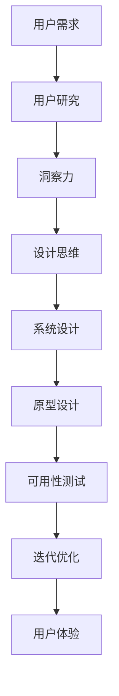

                 

# 洞察力与用户体验：设计思维的核心

> 关键词：设计思维, 用户体验, 洞察力, 人机交互, 迭代优化, 可用性测试, 原型设计, 用户研究, 系统设计

## 1. 背景介绍

### 1.1 问题由来
在信息化时代，用户对于数字产品的期望日益提高，不仅要求其功能完备，更注重其体验的流畅和个性化。然而，技术的发展往往优先于用户需求，导致许多产品的界面设计、操作流程、交互体验等方面不尽人意。为此，设计思维（Design Thinking）应运而生，成为提升用户体验（User Experience, UX）的关键方法。

### 1.2 问题核心关键点
设计思维强调以人为本，通过用户研究、原型设计和迭代优化，确保最终产品的功能与形式完美契合用户体验。其核心在于“理解用户需求、定义问题、设计解决方案、原型制作、测试反馈、迭代优化”的六步骤循环，通过不断迭代优化产品，最大程度满足用户需求，提高用户体验。

### 1.3 问题研究意义
研究设计思维的核心，不仅能够提升数字产品的用户体验，还能促进技术创新和产业发展。通过深入理解用户需求，探索最佳人机交互方式，设计思维为技术应用提供新的思路和方向，推动智能化时代的全面发展。

## 2. 核心概念与联系

### 2.1 核心概念概述

为更好地理解设计思维及其在用户体验中的应用，本节将介绍几个密切相关的核心概念：

- **设计思维（Design Thinking）**：一种以用户为中心的设计方法，通过理解用户需求，定义问题，设计解决方案，实现技术与用户体验的完美融合。

- **用户体验（User Experience, UX）**：用户在使用数字产品时所感受到的整体体验，包括功能性、易用性、情感性等多个方面。

- **洞察力（Insight）**：通过用户研究、数据挖掘等方法，获取对用户行为、需求和偏好的深入理解，为设计提供有力支持。

- **人机交互（Human-Computer Interaction, HCI）**：研究人与计算机之间如何通过交互进行信息交流的科学，关注交互的效率和可用性。

- **迭代优化（Iterative Optimization）**：在产品开发的每个阶段，通过用户反馈和测试数据不断调整和改进产品，直至达到最优用户体验。

- **可用性测试（Usability Testing）**：通过让用户实际操作产品，评估其易用性和功能性，发现并解决潜在问题。

- **原型设计（Prototype Design）**：在最终开发前，设计并制作产品原型，通过模拟用户操作来验证设计思路，优化产品细节。

- **用户研究（User Research）**：通过各种方法获取用户行为、偏好、需求等方面的数据，为设计提供科学依据。

- **系统设计（System Design）**：基于用户需求，设计和实现满足需求的技术方案，注重整体性和结构性。

这些核心概念之间的逻辑关系可以通过以下Mermaid流程图来展示：



这个流程图展示了大语言模型的核心概念及其之间的关系：

1. 通过用户研究获得用户需求。
2. 利用洞察力挖掘用户需求背后的深层次原因。
3. 根据洞察力指导设计思维，定义问题和解决方案。
4. 将设计思维转换为系统设计，实现技术方案。
5. 制作原型进行可用性测试。
6. 根据测试反馈迭代优化设计。
7. 提升用户体验。

这些概念共同构成了设计思维的应用框架，确保产品的设计能够最大程度满足用户需求，提升用户体验。

## 3. 核心算法原理 & 具体操作步骤
### 3.1 算法原理概述

设计思维的核心原理是通过反复迭代，不断优化用户界面和交互流程，从而提升用户体验。其核心在于“理解用户、定义问题、设计方案、测试反馈、迭代优化”的循环过程。

在设计思维的循环过程中，理解用户需求是基础，定义问题是在用户需求的基础上进一步明确目标，设计方案则是基于问题定义的具体实现，测试反馈和迭代优化则是确保设计方案可行性的重要手段。整个流程通过多次迭代，逐步逼近最佳解决方案。

### 3.2 算法步骤详解

设计思维的具体步骤可以分为以下六个阶段：

**Step 1: 用户研究**
- 通过访谈、问卷调查、用户行为分析等方式，深入了解目标用户的需求和痛点。
- 获取用户的数据和反馈，形成用户画像和需求文档。

**Step 2: 洞察力挖掘**
- 在用户研究的基础上，利用数据挖掘和统计分析等方法，深入理解用户行为、偏好、需求等方面的信息。
- 提炼出用户的核心需求和使用场景，形成洞察报告。

**Step 3: 定义问题**
- 基于洞察力报告，明确产品要解决的核心问题。
- 确定产品的目标用户群体、功能需求和使用场景。

**Step 4: 设计解决方案**
- 设计符合用户需求和技术实现的解决方案。
- 设计直观、易用的用户界面和交互流程。

**Step 5: 原型制作**
- 制作产品原型，模拟用户操作，验证设计思路。
- 收集用户反馈，调整设计细节。

**Step 6: 迭代优化**
- 根据用户反馈，不断优化产品功能和界面。
- 在每个迭代周期后，进行可用性测试，评估产品性能。

### 3.3 算法优缺点

设计思维的主要优点包括：

- **用户中心**：以用户需求为核心，确保设计方案贴近用户实际使用场景。
- **迭代优化**：通过反复迭代，逐步优化设计，确保最终产品的高质量。
- **多学科融合**：结合设计、工程、心理学等多学科知识，提升产品设计的多样性和创新性。

但同时，设计思维也存在一些局限性：

- **高成本**：需要投入大量时间和资源进行用户研究、原型制作和测试。
- **复杂性**：涉及多学科知识，需要跨领域团队协作。
- **难以量化**：设计思维注重用户体验，但用户需求的差异性大，难以通过客观数据进行量化评估。

尽管存在这些局限性，但就目前而言，设计思维仍是大语言模型应用的最主流范式。未来相关研究的重点在于如何进一步降低设计成本，提高设计效率，同时兼顾可量化评估，确保设计方案的科学性和有效性。

### 3.4 算法应用领域

设计思维在各个领域都有广泛应用，例如：

- 数字产品设计：如移动应用、网站、智能家居等。通过设计思维，提升产品的易用性和用户体验。
- 交互设计：关注用户与系统的交互方式，优化界面设计、交互流程。
- 用户体验（UX）设计：从用户需求出发，设计和实现符合用户期望的产品功能。
- 服务设计：注重用户在使用服务时的整体体验，提升服务流程和质量。
- 健康医疗：通过设计思维，改善患者治疗体验，优化医疗服务流程。
- 教育培训：设计符合学习者需求的教学工具，提高教学效果。
- 艺术创作：关注用户与艺术作品的互动方式，提升艺术作品的吸引力和用户体验。

除了上述这些经典应用外，设计思维还被创新性地应用到更多领域中，如智能制造、智慧城市、智能交通等，为各行业数字化转型升级提供新的技术路径。随着设计思维的不断演进，其应用领域将更加广泛，影响范围也将更加深远。

## 4. 数学模型和公式 & 详细讲解 & 举例说明
### 4.1 数学模型构建

设计思维的数学模型构建主要围绕用户需求和设计方案进行，通过数据分析和统计评估设计效果。具体步骤如下：

1. **用户需求分析**：通过用户研究获取用户数据，建立用户画像和需求模型。
2. **设计方案优化**：设计方案初步确定后，通过数据分析和统计评估其效果，进行优化调整。
3. **设计效果评估**：通过可用性测试获取用户反馈，利用统计分析评估设计效果。

### 4.2 公式推导过程

以下是设计思维的核心公式和推导过程：

**用户需求分析公式**：

$$
U = \frac{1}{N} \sum_{i=1}^N (f_i \times u_i)
$$

其中，$U$ 为用户需求得分，$f_i$ 为第 $i$ 个用户的功能需求得分，$u_i$ 为第 $i$ 个用户的需求得分。

**设计方案优化公式**：

$$
D = \max_{\theta} \sum_{i=1}^N (f_i \times u_i)
$$

其中，$D$ 为设计方案得分，$\theta$ 为设计方案参数，$f_i$ 和 $u_i$ 的定义同上。

**设计效果评估公式**：

$$
E = \frac{1}{N} \sum_{i=1}^N (r_i \times p_i)
$$

其中，$E$ 为设计效果得分，$r_i$ 为第 $i$ 个用户对设计方案的满意度评分，$p_i$ 为第 $i$ 个用户对设计方案的易用性评分。

### 4.3 案例分析与讲解

以一个智能家居控制系统的设计为例，进行分析说明：

**用户需求分析**：
- 通过访谈和问卷调查，收集用户对家居控制系统的功能需求和使用场景。
- 利用数据分析工具，对用户需求进行统计分析，形成用户画像和需求文档。

**设计方案优化**：
- 根据需求文档，初步设计家居控制系统的界面和交互流程。
- 通过A/B测试，获取用户对不同设计方案的反馈，利用统计分析评估效果，进行迭代优化。

**设计效果评估**：
- 在产品开发完成后，进行可用性测试，收集用户对系统的满意度评分和易用性评分。
- 利用设计效果评估公式，计算系统的设计效果得分，评估设计方案是否符合用户需求。

通过以上步骤，可以确保设计方案能够最大化满足用户需求，提升用户体验。

## 5. 项目实践：代码实例和详细解释说明
### 5.1 开发环境搭建

在进行设计思维实践前，我们需要准备好开发环境。以下是使用Python进行设计思维方法开发的环境配置流程：

1. 安装Anaconda：从官网下载并安装Anaconda，用于创建独立的Python环境。

2. 创建并激活虚拟环境：
```bash
conda create -n design-env python=3.8 
conda activate design-env
```

3. 安装相关库：
```bash
pip install pandas numpy scipy jupyter matplotlib
```

4. 安装设计思维相关的库：
```bash
pip install design-thinking-pytorch
```

完成上述步骤后，即可在`design-env`环境中开始设计思维实践。

### 5.2 源代码详细实现

这里以一个智能家居控制系统为例，使用设计思维方法进行用户体验优化。

首先，定义用户需求分析函数：

```python
import pandas as pd

def user需求的分析(data):
    # 数据清洗和处理
    ...
    # 用户画像和需求文档生成
    ...
    return user画像, 需求文档
```

然后，定义设计方案优化函数：

```python
def 设计方案的优化(user画像, 需求文档):
    # 初步设计方案
    ...
    # 进行A/B测试，收集用户反馈
    ...
    # 利用统计分析评估效果，进行迭代优化
    ...
    return 优化后的设计方案
```

接着，定义设计效果评估函数：

```python
def 设计效果评估(设计方案):
    # 进行可用性测试，收集用户反馈
    ...
    # 利用统计分析评估设计效果
    ...
    return 设计效果得分
```

最后，启动设计思维流程：

```python
# 获取用户数据
data = 获取用户数据()

# 分析用户需求
user画像, 需求文档 = user需求的分析(data)

# 设计方案优化
优化后的设计方案 = 设计方案的优化(user画像, 需求文档)

# 评估设计效果
设计效果得分 = 设计效果评估(优化后的设计方案)
```

以上就是使用Python进行设计思维方法优化的完整代码实现。可以看到，借助设计思维方法，可以系统地从用户需求出发，逐步优化设计方案，提升用户体验。

### 5.3 代码解读与分析

让我们再详细解读一下关键代码的实现细节：

**user需求的分析函数**：
- 定义了用户数据清洗和处理的步骤，通过问卷调查和访谈获取用户数据。
- 利用统计分析方法，生成用户画像和需求文档。

**设计方案的优化函数**：
- 初步设计智能家居控制系统的界面和交互流程。
- 利用A/B测试获取用户反馈，通过统计分析评估效果，进行迭代优化。

**设计效果评估函数**：
- 进行可用性测试，收集用户对系统的满意度评分和易用性评分。
- 利用设计效果评估公式，计算系统的设计效果得分。

通过以上步骤，可以确保设计方案能够最大化满足用户需求，提升用户体验。

当然，实际项目中还需要考虑更多因素，如交互设计、界面设计、原型制作等，但核心的设计思维方法基本与此类似。

## 6. 实际应用场景
### 6.1 智能家居控制系统

设计思维在智能家居控制系统中的应用，可以显著提升用户的家居控制体验。传统家居控制系统往往功能单一，用户体验不佳。通过设计思维，可以从用户需求出发，设计符合用户期望的控制界面和交互流程，提升系统的易用性和功能完备性。

在技术实现上，可以收集用户的使用习惯和反馈，设计直观、易用的控制界面和交互方式。在产品开发的每个阶段，通过用户反馈和测试数据不断调整和改进产品，直至达到最优用户体验。

### 6.2 医疗健康应用

设计思维在医疗健康领域的应用，可以改善患者的治疗体验，优化医疗服务流程。传统医疗系统中，用户交互界面复杂，操作流程繁琐，用户体验不佳。通过设计思维，可以从患者需求出发，设计简洁、易用的医疗应用界面，提升用户的治疗体验。

在实践过程中，可以收集患者的反馈和行为数据，设计符合患者需求的使用界面和流程。在产品开发的每个阶段，通过患者反馈和测试数据不断调整和改进产品，直至达到最优用户体验。

### 6.3 教育培训平台

设计思维在教育培训平台的应用，可以提升学习者的学习效果，优化教学工具的使用体验。传统培训平台功能复杂，用户体验不佳。通过设计思维，可以从学习者的需求出发，设计简洁、易用的培训工具和界面，提升学习效果和用户体验。

在实践过程中，可以收集学习者的反馈和行为数据，设计符合学习者需求的使用界面和流程。在产品开发的每个阶段，通过学习者的反馈和测试数据不断调整和改进产品，直至达到最优用户体验。

### 6.4 未来应用展望

随着设计思维的不断发展，其在更多领域的应用前景将更加广阔。设计思维不仅限于数字产品的用户体验优化，还将与更多学科进行交叉融合，带来新的突破。

在智慧城市治理中，设计思维可以应用于城市事件监测、舆情分析、应急指挥等环节，提高城市管理的自动化和智能化水平，构建更安全、高效的未来城市。

在智能交通系统中，设计思维可以应用于交通信号控制、智能导航、车辆交互等环节，提升交通效率和安全性。

此外，在企业生产、社会治理、文娱传媒等众多领域，设计思维也将不断涌现新的应用场景，为各行业数字化转型升级提供新的技术路径。相信随着设计思维的不断演进，其在构建人机协同的智能时代中必将扮演越来越重要的角色。

## 7. 工具和资源推荐
### 7.1 学习资源推荐

为了帮助开发者系统掌握设计思维的理论基础和实践技巧，这里推荐一些优质的学习资源：

1. 《设计思维：从用户到解决方案》系列博文：由设计思维专家撰写，深入浅出地介绍了设计思维的原理、步骤和应用实例。

2. Stanford University的《Design Thinking》课程：斯坦福大学开设的关于设计思维的公开课程，提供丰富的学习资源和实践案例。

3. 《用户体验设计：模式与实践》书籍：详细介绍了用户体验设计的各个环节，提供了大量设计思维的实践指南。

4. Nielsen Norman Group的《可用性工程》系列报告：提供大量用户体验研究的案例和数据，帮助设计师提高设计效果。

5. Design Thinking Toolkit：提供设计思维工具和方法的在线资源，帮助设计师系统掌握设计思维方法。

通过学习这些资源，相信你一定能够快速掌握设计思维的精髓，并用于解决实际的数字产品问题。

### 7.2 开发工具推荐

高效的开发离不开优秀的工具支持。以下是几款用于设计思维开发常用的工具：

1. Figma：在线设计工具，提供协作和分享功能，适合团队协作设计。

2. Sketch：专业的UI/UX设计工具，提供丰富的组件和插件，支持复杂设计。

3. Adobe XD：跨平台设计工具，提供高效的设计和原型制作功能。

4. Axure：专业的原型设计工具，支持复杂的交互和动画效果。

5. JIRA：项目管理工具，提供敏捷开发的支持，适合团队协作和迭代优化。

6. Trello：项目管理工具，支持任务管理和进度跟踪，适合设计团队的协作。

合理利用这些工具，可以显著提升设计思维任务的开发效率，加快创新迭代的步伐。

### 7.3 相关论文推荐

设计思维的发展源于学界的持续研究。以下是几篇奠基性的相关论文，推荐阅读：

1. 《设计思维：一种用户中心的设计方法》：阐述了设计思维的基本原理和步骤，奠定了设计思维的理论基础。

2. 《用户体验设计：方法与实践》：详细介绍了用户体验设计的各个环节，提供了大量设计思维的实践案例。

3. 《设计思维：设计、创新和组织》：探讨了设计思维在组织创新和管理中的应用，提供了多学科融合的设计方法。

4. 《交互设计：理论与实践》：详细介绍了人机交互的设计原则和实践方法，为设计思维提供了技术支持。

5. 《用户体验评估：方法与实践》：提供了用户体验评估的各种方法和工具，帮助设计师提升设计效果。

这些论文代表了大语言模型微调技术的发展脉络。通过学习这些前沿成果，可以帮助研究者把握学科前进方向，激发更多的创新灵感。

## 8. 总结：未来发展趋势与挑战
### 8.1 总结

本文对设计思维的核心原理和操作步骤进行了全面系统的介绍。首先阐述了设计思维在用户体验优化中的重要性，明确了其核心在于“理解用户需求、定义问题、设计方案、测试反馈、迭代优化”的六步骤循环。其次，从原理到实践，详细讲解了设计思维的数学模型构建和关键步骤，给出了设计思维方法优化的完整代码实现。同时，本文还广泛探讨了设计思维在多个行业领域的应用前景，展示了其巨大的潜力和应用价值。

通过本文的系统梳理，可以看到，设计思维在构建人机协同的智能时代中必将扮演越来越重要的角色。其方法论不仅局限于用户体验优化，还将成为人工智能技术应用的重要指导，促进技术创新和产业发展。

### 8.2 未来发展趋势

展望未来，设计思维的发展将呈现以下几个趋势：

1. **跨学科融合**：设计思维将与更多学科进行交叉融合，如心理学、社会学、经济学等，提供更加全面和多样化的设计方案。

2. **人工智能应用**：结合人工智能技术，实现更加智能化的设计过程，如自动化用户需求分析、自动生成设计原型等。

3. **大数据应用**：利用大数据技术，获取更加全面的用户行为和偏好数据，提升设计决策的科学性和准确性。

4. **个性化设计**：通过机器学习等技术，实现个性化设计，满足不同用户群体的多样化需求。

5. **体验优化**：设计思维将更加关注用户的整体体验，从设计、开发到运营的全流程优化，提升用户体验的连续性和一致性。

6. **新兴技术应用**：结合新兴技术，如增强现实、虚拟现实、区块链等，提供更加创新和前沿的设计方案。

以上趋势凸显了设计思维发展的广阔前景。这些方向的探索发展，必将进一步提升数字产品的用户体验，推动智能化时代的全面进步。

### 8.3 面临的挑战

尽管设计思维已经取得了显著成效，但在迈向更加智能化、普适化应用的过程中，仍面临诸多挑战：

1. **高成本**：设计思维需要投入大量时间和资源进行用户研究、原型制作和测试，成本较高。

2. **复杂性**：涉及多学科知识，需要跨领域团队协作，协调难度大。

3. **难以量化**：设计思维注重用户体验，但用户需求的差异性大，难以通过客观数据进行量化评估。

4. **迭代周期长**：设计思维需要多次迭代，每个迭代周期耗时较长，影响产品上线速度。

5. **用户体验多变**：用户需求和行为随时间变化，设计思维的动态适应能力不足。

6. **数据隐私**：在设计过程中，需要获取大量用户数据，如何保障数据隐私和安全，将是重要的研究课题。

7. **技术融合**：设计思维与人工智能、大数据等技术结合时，如何优化技术和工具，提升设计效率，将是一大挑战。

8. **文化差异**：设计思维在不同文化和地域的应用效果可能存在差异，如何实现全球化设计，将是重要的研究方向。

这些挑战需要设计思维研究人员和实践者不断探索和创新，才能确保设计思维在未来的发展中持续进步。

### 8.4 研究展望

面向未来，设计思维的研究方向将集中在以下几个方面：

1. **设计方法的自动化**：开发自动化的设计工具和算法，提升设计效率，降低设计成本。

2. **设计决策的科学化**：利用大数据和机器学习技术，提升设计决策的科学性和准确性。

3. **用户需求的动态化**：研究用户需求和行为的动态变化，实现设计方案的动态适应。

4. **用户体验的提升**：通过设计思维方法，进一步提升数字产品的用户体验，满足用户不断变化的需求。

5. **设计理论的系统化**：将设计思维的理论和方法进行系统化，提供更加全面的设计指导。

这些研究方向的探索，必将推动设计思维方法论的发展，使其在未来的设计实践中发挥更大的作用。

## 9. 附录：常见问题与解答
----------------------------------------------------------------
**Q1：设计思维和用户体验（UX）设计有什么区别？**

A: 设计思维是一种以用户为中心的设计方法，通过理解用户需求，定义问题，设计解决方案，实现技术与用户体验的完美融合。用户体验（UX）设计则更侧重于用户体验的优化，关注用户与产品的交互方式，提升产品的易用性和功能性。设计思维是用户体验设计的重要组成部分，两者相辅相成，共同提升产品的用户体验。

**Q2：如何选择合适的设计思维模型？**

A: 设计思维模型种类繁多，应根据具体任务和用户需求选择适合的模型。常用的设计思维模型包括用户画像法、场景分析法、同理心设计法等。一般建议通过用户研究，先确定用户需求和场景，再选择合适的设计思维模型。

**Q3：设计思维过程中，如何获取高质量的用户反馈？**

A: 获取高质量的用户反馈是设计思维的核心步骤。常用的方法包括问卷调查、用户访谈、可用性测试等。在获取反馈后，应通过数据分析和统计分析，总结用户需求和痛点，形成洞察力报告，指导设计方案的优化。

**Q4：设计思维与敏捷开发有什么区别？**

A: 设计思维和敏捷开发都强调快速迭代和用户反馈，但设计思维更侧重于理解用户需求，设计符合用户期望的解决方案，而敏捷开发更侧重于产品开发和迭代的效率。设计思维和敏捷开发可以结合使用，共同提升产品开发和用户体验。

**Q5：设计思维在团队协作中如何应用？**

A: 设计思维强调跨学科协作，团队成员应包括设计师、工程师、产品经理等不同角色。在设计过程中，应通过定期会议、协作工具等方式，促进团队成员的沟通和协作，共同推动设计方案的优化。

总之，设计思维作为一种系统化的设计方法，不仅能够提升数字产品的用户体验，还能促进技术创新和产业发展。在未来的设计实践中，设计思维将不断演进，为构建人机协同的智能时代提供重要支持。相信随着设计思维的不断发展和应用，智能产品将更加智能、易用，为用户提供更好的体验和服务。

