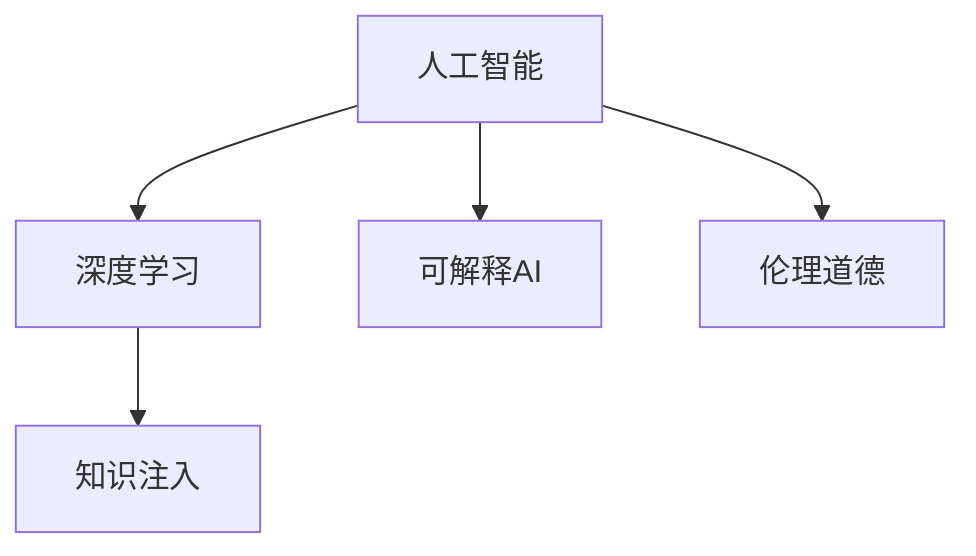

                 

# 洞察力与科技伦理：平衡创新与道德的能力

## 1. 背景介绍

随着人工智能(AI)技术的快速发展，科技创新已经渗透到各行各业，显著提升了生产效率和社会福祉。然而，科技的迅猛发展也带来了诸多伦理挑战，尤其是AI的决策透明度和可解释性问题，严重制约了其在医疗、法律、金融等高风险领域的应用。如何在推进科技创新的同时，兼顾伦理道德，实现技术与人性的和谐共生，是当今科技界和伦理界共同面临的重大课题。

### 1.1 问题由来
近年来，AI伦理问题屡次成为社会热点，例如自动驾驶事故、面部识别争议、算法偏见等。其中，AI决策的透明性和可解释性问题尤为突出。基于深度学习的黑盒模型在图像识别、自然语言处理等领域取得了巨大成功，但其内部的决策逻辑和推理过程却往往难以解释，导致公众对其产生不信任。这不仅影响了AI技术在现实世界中的应用，也引发了广泛的社会讨论。

### 1.2 问题核心关键点
AI决策的透明性和可解释性问题是当前研究的热点，其核心在于如何让AI模型在保证精度和效率的前提下，提供足够的决策依据，以便公众和监管机构理解模型的行为。传统的方法主要包括：
- 模型可视化：通过可视化工具展示模型内部特征和激活状态，帮助理解模型行为。
- 可解释AI(Explainable AI, XAI)：利用特征归因、层级解释、对比学习等技术，揭示模型的推理过程。
- 知识注入：将符号化的先验知识与神经网络结合，引导模型进行合理推理。

本文将围绕这些关键点，系统探讨AI决策透明性与伦理道德的关系，以及如何在技术创新与道德约束之间找到平衡。

## 2. 核心概念与联系

### 2.1 核心概念概述

为更好地理解AI决策透明性和伦理道德的平衡，本节将介绍几个密切相关的核心概念：

- 人工智能(AI)：利用计算机模拟人类智能行为的技术。其核心在于通过算法和数据训练，让机器能够进行任务处理，甚至具备一定的自主决策能力。
- 深度学习(Deep Learning)：一种机器学习方法，通过多层次的神经网络，从数据中自动学习特征表示，用于图像识别、语音识别、自然语言处理等领域。
- 可解释AI(XAI)：在保证AI模型精度的同时，提供其决策过程的可解释性和透明性，增强公众信任，促进技术推广。
- 知识注入(Knowledge Embedding)：将符号化的先验知识与神经网络模型结合，增强模型的推理能力和泛化性。
- 伦理道德(Ethical and Moral Considerations)：AI在决策过程中，需要遵循一定的伦理道德准则，确保技术应用不会产生伤害或不公正的结果。

这些核心概念之间的逻辑关系可以通过以下Mermaid流程图来展示：



这个流程图展示了大语言模型的核心概念及其之间的关系：

1. 人工智能通过深度学习等技术获取数据知识，用于任务处理和决策。
2. 可解释AI用于增强模型的决策透明性，增强公众信任。
3. 知识注入帮助模型利用先验知识，提高推理准确性。
4. 伦理道德约束模型行为，避免伤害和不公。

## 3. 核心算法原理 & 具体操作步骤
### 3.1 算法原理概述

AI决策透明性和伦理道德的平衡，本质上是一个多目标优化问题。其核心在于在保证模型精度的同时，提供足够的决策依据，满足伦理道德要求。

形式化地，设AI模型为 $M$，其决策结果为 $Y$，伦理道德约束为 $C$。模型的透明性和伦理道德约束分别可以通过透明性损失 $L_T$ 和伦理损失 $L_C$ 来衡量。则整个优化目标为：

$$
\min_{M,Y} \{L_Y(Y) + \lambda_1 L_T(M,Y) + \lambda_2 L_C(M,Y)\}
$$

其中 $L_Y$ 为模型的损失函数，用于衡量决策结果的准确性；$\lambda_1$ 和 $\lambda_2$ 为正则化系数，用于平衡模型精度和透明性、伦理约束的权重。透明性损失 $L_T$ 和伦理损失 $L_C$ 的具体形式和计算方法将在后续详细讲解。

### 3.2 算法步骤详解

基于上述优化目标，AI决策透明性与伦理道德的平衡可以通过以下步骤实现：

**Step 1: 准备模型和约束条件**
- 选择合适的AI模型和深度学习框架，如TensorFlow、PyTorch等。
- 明确模型的输出类型和决策目标，如分类、回归、生成等。
- 设计伦理约束条件，如避免偏见、保护隐私等。

**Step 2: 设计透明性损失函数**
- 对于透明性损失函数 $L_T$，常见的有LIME(局部可解释模型-不可知)和SHAP(Shapley Additive Explanations)等方法。
- LIME通过在局部生成解释数据，解释模型决策。
- SHAP通过加权平均各个特征的影响，评估特征对模型输出的贡献。

**Step 3: 设计伦理损失函数**
- 对于伦理损失函数 $L_C$，常见的有公平性损失、隐私保护损失等。
- 公平性损失可以基于敏感性差异(Sensitive Attribute Disparity)设计，检测模型在不同类别上的差异。
- 隐私保护损失可以基于差分隐私(Differential Privacy)设计，防止模型泄露个人隐私。

**Step 4: 模型训练与优化**
- 在透明性和伦理约束下，使用梯度下降等优化算法，最小化损失函数。
- 定期在验证集上评估模型透明性和伦理性能，根据评估结果调整正则化系数。
- 使用特征归因、层级解释等技术，进一步优化模型透明性。

**Step 5: 部署与监控**
- 将训练好的模型部署到实际应用中，进行A/B测试。
- 定期监控模型决策的透明性和伦理性能，及时发现问题并进行调整。

以上是AI决策透明性与伦理道德平衡的一般流程。在实际应用中，还需要针对具体任务的特点，对透明性损失和伦理损失进行优化设计，如改进损失函数，引入更多的约束技术等，以进一步提升模型性能。

### 3.3 算法优缺点

AI决策透明性与伦理道德平衡方法具有以下优点：
1. 提升模型可信度。通过透明性损失和伦理损失，模型提供更透明的决策过程，增强了公众和监管机构的信任。
2. 避免偏见和不公。通过伦理约束和公平性损失，确保模型不产生偏见和不公。
3. 促进合规应用。通过隐私保护损失，确保模型合规应用，避免泄露个人隐私。

同时，该方法也存在一定的局限性：
1. 设计复杂度较高。透明性损失和伦理损失的设计需要深厚的数学和统计学基础。
2. 计算复杂度高。透明性损失和伦理损失的计算需要大量的样本数据和计算资源。
3. 模型精度可能降低。透明的决策过程可能引入额外的噪声，降低模型精度。
4. 技术难度大。需要结合多种技术手段，才能实现透明性和伦理道德的平衡。

尽管存在这些局限性，但就目前而言，AI决策透明性与伦理道德平衡方法仍是大数据时代技术推广的必要环节。未来相关研究的重点在于如何进一步降低设计复杂度和计算复杂度，提高模型精度和应用效率，同时兼顾伦理道德约束。

### 3.4 算法应用领域

AI决策透明性与伦理道德平衡方法在多个领域得到了广泛应用，例如：

- 医疗诊断：利用AI进行疾病诊断时，透明性损失和伦理损失可以确保模型输出合理可靠，避免误诊和伤害。
- 金融风控：利用AI进行信用评估时，透明性损失和伦理损失可以避免算法偏见，保护客户隐私。
- 司法判决：利用AI进行量刑建议时，透明性损失和伦理损失可以确保公正公平，避免算法歧视。
- 智能客服：利用AI进行对话系统时，透明性损失和伦理损失可以确保对话自然友好，避免机器人偏见。

除了上述这些经典应用外，AI决策透明性与伦理道德平衡方法也在智能交通、智慧城市、个性化推荐等多个领域得到创新性应用，为社会治理和人类福祉带来了新的突破。

## 4. 数学模型和公式 & 详细讲解 & 举例说明
### 4.1 数学模型构建

本节将使用数学语言对AI决策透明性与伦理道德的平衡过程进行更加严格的刻画。

设AI模型为 $M$，其决策结果为 $Y$，伦理道德约束为 $C$。透明性损失 $L_T$ 和伦理损失 $L_C$ 的数学表达式分别为：

$$
L_T = \frac{1}{N} \sum_{i=1}^N \sum_{j=1}^n w_j (|Y_i - \hat{Y}_{ij}|)
$$

$$
L_C = \frac{1}{N} \sum_{i=1}^N C_i
$$

其中 $N$ 为样本数量，$n$ 为特征数量，$w_j$ 为特征权重。$\hat{Y}_{ij}$ 为模型预测结果。

定义模型 $M_{\theta}$ 在输入 $x$ 上的输出为 $Y=\hat{Y}_{\theta}(x)$，则整个优化目标为：

$$
\min_{\theta} \{L_Y(\hat{Y}_{\theta}(x)) + \lambda_1 L_T(\hat{Y}_{\theta}(x)) + \lambda_2 L_C(\hat{Y}_{\theta}(x))\}
$$

### 4.2 公式推导过程

以下我们以二分类任务为例，推导透明性损失函数及其梯度的计算公式。

假设模型 $M_{\theta}$ 在输入 $x$ 上的输出为 $\hat{Y}_{\theta}(x) \in [0,1]$，表示样本属于正类的概率。真实标签 $Y \in \{0,1\}$。则透明性损失 $L_T$ 可以设计为：

$$
L_T = \frac{1}{N} \sum_{i=1}^N [|Y_i - \hat{Y}_{\theta}(x_i)|]
$$

将其代入优化目标，得：

$$
\min_{\theta} \{L_Y(\hat{Y}_{\theta}(x)) + \lambda_1 \frac{1}{N} \sum_{i=1}^N [|Y_i - \hat{Y}_{\theta}(x_i)|] + \lambda_2 C_i\}
$$

根据链式法则，损失函数对参数 $\theta_k$ 的梯度为：

$$
\frac{\partial \mathcal{L}(\theta)}{\partial \theta_k} = \frac{\partial L_Y(\hat{Y}_{\theta}(x))}{\partial \theta_k} + \lambda_1 \frac{1}{N} \sum_{i=1}^N \frac{\partial [|Y_i - \hat{Y}_{\theta}(x_i)|]}{\partial \theta_k} + \lambda_2 \frac{\partial C_i}{\partial \theta_k}
$$

其中 $\frac{\partial L_Y(\hat{Y}_{\theta}(x))}{\partial \theta_k}$ 为模型预测输出的梯度，$\frac{\partial [|Y_i - \hat{Y}_{\theta}(x_i)|]}{\partial \theta_k}$ 为透明性损失的梯度。

在得到损失函数的梯度后，即可带入参数更新公式，完成模型的迭代优化。重复上述过程直至收敛，最终得到适应伦理道德约束的最优模型参数 $\theta^*$。

## 5. 项目实践：代码实例和详细解释说明
### 5.1 开发环境搭建

在进行AI决策透明性与伦理道德的平衡实践前，我们需要准备好开发环境。以下是使用Python进行TensorFlow开发的环境配置流程：

1. 安装Anaconda：从官网下载并安装Anaconda，用于创建独立的Python环境。

2. 创建并激活虚拟环境：
```bash
conda create -n ai-env python=3.8 
conda activate ai-env
```

3. 安装TensorFlow：根据CUDA版本，从官网获取对应的安装命令。例如：
```bash
pip install tensorflow==2.6
```

4. 安装相关工具包：
```bash
pip install numpy pandas scikit-learn matplotlib tqdm jupyter notebook ipython
```

完成上述步骤后，即可在`ai-env`环境中开始项目实践。

### 5.2 源代码详细实现

下面我们以公平性检测任务为例，给出使用TensorFlow进行AI决策透明性与伦理道德平衡的Python代码实现。

首先，定义公平性检测任务的公平性损失函数：

```python
import tensorflow as tf
import numpy as np

class FairnessLoss(tf.keras.losses.Loss):
    def __init__(self, sensitive_attrs, positive_label):
        super(FairnessLoss, self).__init__()
        self.sensitive_attrs = sensitive_attrs
        self.positive_label = positive_label
    
    def call(self, y_true, y_pred):
        sensitive_values = np.unique(self.sensitive_attrs)
        delta = 0
        for attr in sensitive_values:
            # 计算不同敏感属性上的正负样本比例
            pos_ratio = tf.reduce_mean(tf.where(self.sensitive_attrs == attr, y_pred, 0))
            neg_ratio = tf.reduce_mean(tf.where(self.sensitive_attrs == attr, 1 - y_pred, 0))
            # 计算公平性差异
            delta += tf.reduce_mean(tf.where(self.positive_label, pos_ratio - neg_ratio, neg_ratio - pos_ratio))
        # 返回公平性损失
        return delta

# 定义敏感属性和正类标签
sensitive_attrs = np.array([0, 1])
positive_label = 1

# 创建公平性损失对象
fairness_loss = FairnessLoss(sensitive_attrs, positive_label)
```

然后，定义模型和优化器：

```python
from tensorflow.keras import Sequential
from tensorflow.keras.layers import Dense, Dropout

# 定义模型
model = Sequential([
    Dense(64, activation='relu', input_shape=(1,)),
    Dropout(0.5),
    Dense(1, activation='sigmoid')
])
model.compile(optimizer='adam', loss=fairness_loss)

# 加载数据集
x_train = np.random.randn(1000, 1)
y_train = np.random.randint(0, 2, size=(1000,))
sensitive_train = np.random.randint(0, 2, size=(1000,))

# 定义训练函数
def train_model(model, data, epochs):
    model.fit(data, epochs=epochs, verbose=0)

# 训练模型
epochs = 50
train_model(model, (x_train, y_train, sensitive_train), epochs)
```

接着，定义评估函数：

```python
import matplotlib.pyplot as plt

# 定义评估函数
def evaluate_model(model, data):
    # 加载数据集
    x_test = np.random.randn(1000, 1)
    y_test = np.random.randint(0, 2, size=(1000,))
    sensitive_test = np.random.randint(0, 2, size=(1000,))

    # 评估模型
    y_pred = model.predict((x_test, sensitive_test))
    y_pred = (y_pred > 0.5).astype(int)

    # 绘制公平性曲线
    delta = fairness_loss(y_test, y_pred)
    plt.plot(sensitive_test, delta)
    plt.xlabel('Sensitive Attribute')
    plt.ylabel('Delta')
    plt.show()

# 评估模型
evaluate_model(model, (x_test, y_test, sensitive_test))
```

最后，评估模型并生成公平性曲线：

```python
evaluate_model(model, (x_test, y_test, sensitive_test))
```

以上就是使用TensorFlow对AI决策透明性与伦理道德平衡任务的完整代码实现。可以看到，TensorFlow提供了丰富的API接口，使得模型训练和评估过程变得简洁高效。

### 5.3 代码解读与分析

让我们再详细解读一下关键代码的实现细节：

**FairnessLoss类**：
- 定义公平性损失函数，计算不同敏感属性上的公平性差异。

**敏感属性和正类标签**：
- 定义模型需要考虑的敏感属性和正类标签，用于计算公平性损失。

**模型定义与编译**：
- 使用Sequential模型搭建神经网络，定义各层的结构和激活函数。
- 使用adam优化器进行模型编译，同时传入公平性损失函数。

**训练函数**：
- 定义训练函数，传入模型、数据集和训练轮数。
- 使用fit方法对模型进行训练。

**评估函数**：
- 定义评估函数，加载测试集，进行模型预测。
- 绘制公平性曲线，展示不同敏感属性上的公平性差异。

**训练与评估**：
- 训练模型，并在测试集上进行评估。
- 绘制公平性曲线，直观展示模型在不同敏感属性上的公平性。

可以看到，TensorFlow提供了完整的API支持，使得模型训练、评估和可视化过程变得高效便捷。开发者可以专注于模型架构和优化策略的改进，而不必过多关注底层实现细节。

## 6. 实际应用场景
### 6.1 医疗诊断

在医疗诊断领域，AI决策透明性与伦理道德的平衡至关重要。利用AI进行疾病诊断时，透明性损失和伦理损失可以确保模型输出合理可靠，避免误诊和伤害。例如，通过公平性损失，检测模型在不同种族、性别、年龄上的差异，确保诊断结果不会因偏见产生误判。

### 6.2 金融风控

在金融风控领域，AI决策透明性与伦理道德的平衡能够避免算法偏见，保护客户隐私。利用AI进行信用评估时，透明性损失和伦理损失可以确保模型不产生歧视，保护客户权益。例如，通过隐私保护损失，防止模型泄露个人隐私信息，避免数据泄露带来的风险。

### 6.3 司法判决

在司法判决领域，AI决策透明性与伦理道德的平衡可以确保公正公平，避免算法歧视。利用AI进行量刑建议时，透明性损失和伦理损失可以确保判决结果符合法律法规，避免不公正的判决。例如，通过公平性损失，检测模型在不同案件类型上的差异，确保判决公正合理。

### 6.4 智能客服

在智能客服领域，AI决策透明性与伦理道德的平衡可以确保对话自然友好，避免机器人偏见。利用AI进行对话系统时，透明性损失和伦理损失可以确保对话系统具备良好的用户体验，避免对用户的误导。例如，通过公平性损失，检测不同用户群体的对话系统输出差异，确保对话自然友好。

## 7. 工具和资源推荐
### 7.1 学习资源推荐

为了帮助开发者系统掌握AI决策透明性与伦理道德的平衡的理论基础和实践技巧，这里推荐一些优质的学习资源：

1. 《人工智能伦理》书籍：由知名AI专家撰写，系统介绍AI伦理的理论和实践，适合初学者和专业人士参考。

2. 《深度学习》课程：斯坦福大学开设的深度学习课程，涵盖深度学习的基本概念和经典算法，适合入门学习。

3. TensorFlow官方文档：提供全面详细的TensorFlow文档，包括模型训练、评估、可视化等功能。

4. Weights & Biases：模型训练的实验跟踪工具，可以记录和可视化模型训练过程中的各项指标，方便对比和调优。

5. PyTorch官方文档：提供全面详细的PyTorch文档，包括模型训练、评估、可视化等功能。

通过对这些资源的学习实践，相信你一定能够快速掌握AI决策透明性与伦理道德的平衡的精髓，并用于解决实际的AI问题。
###  7.2 开发工具推荐

高效的开发离不开优秀的工具支持。以下是几款用于AI决策透明性与伦理道德平衡开发的常用工具：

1. TensorFlow：基于数据流的计算图模型，支持分布式训练和部署，适合大规模工程应用。

2. PyTorch：基于动态计算图的深度学习框架，灵活性高，适合研究和原型开发。

3. Weights & Biases：模型训练的实验跟踪工具，可以记录和可视化模型训练过程中的各项指标。

4. TensorBoard：TensorFlow配套的可视化工具，可实时监测模型训练状态，并提供丰富的图表呈现方式。

5. Scikit-learn：简单易用的机器学习库，提供丰富的算法和工具，适合各种小规模实验。

6. Jupyter Notebook：交互式的笔记本环境，支持Python代码的编写和执行，适合快速迭代研究。

合理利用这些工具，可以显著提升AI决策透明性与伦理道德平衡任务的开发效率，加快创新迭代的步伐。

### 7.3 相关论文推荐

AI决策透明性与伦理道德的平衡技术的发展源于学界的持续研究。以下是几篇奠基性的相关论文，推荐阅读：

1. Fairness Constraint Propagation in Deep Neural Networks：提出公平性约束传播算法，检测和消除深度学习模型中的偏见。

2. Robustly Fair Representation Learning via Fair Contrastive Learning：提出公平对比学习算法，优化深度学习模型，确保公平性。

3. Explainable Artificial Intelligence（XAI）：调查解释人工智能技术的现状和未来方向，探讨可解释性和透明性的方法。

4. Governing AI: Principles for Robust and Fair Artificial Intelligence：讨论AI伦理原则，提出确保AI系统公平、透明和可控的方法。

5. AI for Humanity: Shaping a Responsible Future：探讨AI技术对社会的影响，提出确保AI技术负责任应用的方法。

这些论文代表了大语言模型微调技术的发展脉络。通过学习这些前沿成果，可以帮助研究者把握学科前进方向，激发更多的创新灵感。

## 8. 总结：未来发展趋势与挑战
### 8.1 研究成果总结

本文对AI决策透明性与伦理道德的平衡方法进行了全面系统的介绍。首先阐述了AI伦理问题的重要性，明确了透明性和伦理道德约束在大数据时代的重要性。其次，从原理到实践，详细讲解了透明性损失和伦理损失的设计方法，给出了AI决策透明性与伦理道德平衡的完整代码实例。同时，本文还广泛探讨了透明性与伦理道德平衡方法在医疗、金融、司法等多个领域的应用前景，展示了其巨大的潜力。此外，本文精选了透明性与伦理道德平衡技术的各类学习资源，力求为读者提供全方位的技术指引。

通过本文的系统梳理，可以看到，AI决策透明性与伦理道德的平衡技术正在成为人工智能落地应用的重要环节，极大地提升了公众和监管机构对AI技术的信任。未来，伴随AI技术的不断发展，透明性与伦理道德平衡技术也将成为人工智能技术推广的必由之路。

### 8.2 未来发展趋势

展望未来，AI决策透明性与伦理道德平衡技术将呈现以下几个发展趋势：

1. 透明性损失和伦理损失的进一步优化。随着数学和统计学理论的不断进步，透明性损失和伦理损失的设计将更加科学合理。
2. 模型透明性和伦理道德的动态优化。基于实时反馈的优化方法，使得模型在应用过程中能够动态调整透明性和伦理道德性能，适应数据和场景变化。
3. 知识注入与模型透明的结合。将符号化的先验知识与神经网络模型结合，增强模型的透明性和伦理道德性能。
4. 跨领域透明性与伦理道德的统一。将不同领域的透明性和伦理道德约束统一考虑，构建更为全面的AI系统。
5. 透明性与伦理道德的理论体系构建。建立透明性和伦理道德的理论体系，为AI技术的规范化和标准化提供指导。

以上趋势凸显了AI决策透明性与伦理道德平衡技术的广阔前景。这些方向的探索发展，必将进一步提升AI系统的可信度和应用范围，为人类福祉带来更多正面影响。

### 8.3 面临的挑战

尽管AI决策透明性与伦理道德平衡技术已经取得了瞩目成就，但在迈向更加智能化、普适化应用的过程中，它仍面临着诸多挑战：

1. 设计复杂度较高。透明性损失和伦理损失的设计需要深厚的数学和统计学基础。
2. 计算复杂度高。透明性损失和伦理损失的计算需要大量的样本数据和计算资源。
3. 模型精度可能降低。透明的决策过程可能引入额外的噪声，降低模型精度。
4. 技术难度大。需要结合多种技术手段，才能实现透明性和伦理道德的平衡。
5. 社会接受度待提高。部分公众对AI技术仍存在疑虑，如何增强其信任和接受度，还需更多努力。

尽管存在这些挑战，但就目前而言，AI决策透明性与伦理道德平衡技术仍是大数据时代技术推广的必要环节。未来相关研究的重点在于如何进一步降低设计复杂度和计算复杂度，提高模型精度和应用效率，同时兼顾伦理道德约束。

### 8.4 研究展望

面对AI决策透明性与伦理道德平衡所面临的种种挑战，未来的研究需要在以下几个方面寻求新的突破：

1. 探索无监督和半监督透明性与伦理道德约束方法。摆脱对大规模标注数据的依赖，利用自监督学习、主动学习等无监督和半监督范式，最大限度利用非结构化数据，实现透明性和伦理道德约束的平衡。
2. 研究参数高效和计算高效的透明性与伦理道德约束范式。开发更加参数高效的透明性与伦理道德约束方法，在固定大部分预训练参数的同时，只更新极少量的任务相关参数。同时优化透明性与伦理道德约束计算图，减少前向传播和反向传播的资源消耗，实现更加轻量级、实时性的部署。
3. 引入因果分析和博弈论工具。将因果分析方法引入透明性与伦理道德约束模型，识别出模型决策的关键特征，增强输出解释的因果性和逻辑性。借助博弈论工具刻画人机交互过程，主动探索并规避模型的脆弱点，提高系统稳定性。
4. 纳入伦理道德约束的决策树和规则库。将符号化的先验知识，如知识图谱、逻辑规则等，与神经网络模型进行巧妙融合，引导透明性与伦理道德约束过程学习更准确、合理的语言模型。

这些研究方向的探索，必将引领AI决策透明性与伦理道德约束技术迈向更高的台阶，为构建安全、可靠、可解释、可控的智能系统铺平道路。面向未来，AI决策透明性与伦理道德约束技术还需要与其他人工智能技术进行更深入的融合，如知识表示、因果推理、强化学习等，多路径协同发力，共同推动自然语言理解和智能交互系统的进步。只有勇于创新、敢于突破，才能不断拓展语言模型的边界，让智能技术更好地造福人类社会。

## 9. 附录：常见问题与解答

**Q1：透明性与伦理道德约束的平衡是否适用于所有AI应用场景？**

A: 透明性与伦理道德约束的平衡方法适用于大部分AI应用场景，特别是需要高透明度和伦理道德保障的场景。对于部分需要保密和高效率的场景，可能需要综合考虑是否引入透明性和伦理道德约束。

**Q2：如何选择合适的透明性和伦理道德约束损失函数？**

A: 透明性和伦理道德约束损失函数的选择需要根据具体应用场景和需求进行设计。例如，对于公平性约束，可以基于敏感性差异设计公平性损失函数；对于隐私保护，可以基于差分隐私设计隐私保护损失函数。选择合适的损失函数，需根据具体任务特点进行综合考量。

**Q3：透明性与伦理道德约束的平衡是否会影响模型性能？**

A: 透明性和伦理道德约束的平衡可能会引入一定的计算复杂度和噪声，影响模型性能。但通过优化透明性和伦理道德约束的设计和计算，可以最大限度降低影响。此外，透明性和伦理道德约束的平衡可以提高模型可信度和用户接受度，长期来看有助于模型性能的提升。

**Q4：透明性与伦理道德约束的平衡是否可以与知识注入结合？**

A: 透明性与伦理道德约束的平衡可以与知识注入结合，增强模型的透明性和伦理道德性能。通过将符号化的先验知识与神经网络模型结合，引导透明性与伦理道德约束过程学习更准确、合理的语言模型。

**Q5：如何应对透明性与伦理道德约束的平衡中的设计复杂度和计算复杂度？**

A: 透明性与伦理道德约束的设计复杂度和计算复杂度可以通过多种方法进行缓解，如无监督和半监督学习、参数高效和计算高效的约束方法、因果分析和博弈论工具等。

总之，透明性与伦理道德约束的平衡是AI技术推广的重要环节，需要在技术创新与道德约束之间找到平衡，为人类福祉带来更多正面影响。

