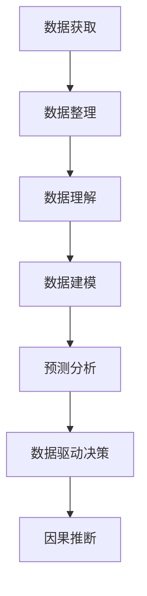

                 

# 洞察力的培养：从观察到预测的能力提升

> 关键词：洞察力, 机器学习, 数据挖掘, 预测分析, 数据驱动决策

## 1. 背景介绍

### 1.1 问题由来

在现代信息爆炸的时代，数据无处不在，如何从中提取出有价值的信息，实现从观察到预测的转变，是每个数据分析师和决策者都面临的挑战。数据挖掘和机器学习技术的发展，为这一问题提供了强有力的工具和框架，从数据中发现模式、建立模型、做出预测，已广泛应用于商业智能、风险评估、客户分析等多个领域。

然而，仅仅依赖模型和算法，仍然不能保证高质量的洞察力。观察和思考的能力，对于准确理解和应用数据，具有不可替代的作用。数据分析师和决策者需要具备高度的洞察力，能够从数据中发现潜在的趋势、模式和关联，才能做出科学的决策。

### 1.2 问题核心关键点

洞察力的培养，是一个从观察到预测、从数据到决策的连续过程。这一过程中，数据的观察和解释，是洞察力培养的基石。而预测和决策，则是洞察力的应用和验证。具体而言，洞察力培养包括以下几个关键点：

1. 数据获取与整理：有效收集和处理相关数据，是洞察力培养的前提。
2. 数据理解与探索：从数据中发现潜在的趋势、模式和关联，是洞察力培养的核心。
3. 数据建模与预测：建立模型并做出预测，是洞察力培养的关键步骤。
4. 决策应用与验证：将预测结果应用于实际决策，并验证其效果，是洞察力培养的最终目的。

本文将围绕这些核心关键点，详细阐述如何通过机器学习、数据挖掘等技术，培养和发展洞察力，从而实现从观察到预测的能力提升。

## 2. 核心概念与联系

### 2.1 核心概念概述

为更好地理解洞察力培养的过程，本节将介绍几个密切相关的核心概念：

- 数据挖掘(Data Mining)：从大量数据中发现潜在的模式和关联，为后续决策提供依据。
- 机器学习(Machine Learning)：通过数据训练模型，使模型具备自动学习和预测能力。
- 预测分析(Predictive Analytics)：利用机器学习模型，对未来事件进行预测，辅助决策。
- 数据驱动决策(Data-Driven Decision Making)：基于数据分析和预测结果，做出科学合理的决策。
- 因果推断(Causal Inference)：分析数据背后的因果关系，评估模型预测的准确性。

这些核心概念之间的逻辑关系可以通过以下Mermaid流程图来展示：



这个流程图展示了大数据环境下洞察力培养的主要流程：

1. 数据获取：从多源数据中收集相关数据，确保数据的多样性和代表性。
2. 数据整理：对数据进行清洗、去重、归一化等预处理，确保数据的质量和可用性。
3. 数据理解：通过可视化和探索性分析，从数据中发现潜在的趋势、模式和关联。
4. 数据建模：建立合适的机器学习模型，对数据进行建模和预测。
5. 预测分析：利用模型进行预测，评估预测结果的准确性和可靠性。
6. 数据驱动决策：基于预测结果，做出科学合理的决策。
7. 因果推断：分析数据背后的因果关系，评估模型预测的因果性。

这些概念共同构成了洞察力培养的基本框架，使得数据分析师和决策者能够从数据中提取价值，支持决策过程。

## 3. 核心算法原理 & 具体操作步骤

### 3.1 算法原理概述

洞察力的培养，本质上是基于数据的机器学习和数据挖掘技术的应用。其核心思想是：通过数据分析和模型训练，从数据中提取规律和知识，实现从观察到预测的转变。

形式化地，假设数据集为 $D=\{(x_i,y_i)\}_{i=1}^N$，其中 $x_i$ 为特征向量，$y_i$ 为标签或目标变量。洞察力培养的目标是找到一个模型 $f$，使其能够在新的数据 $x$ 上，准确预测目标变量 $y$。

具体而言，洞察力培养的过程包括：
1. 数据收集和预处理。收集相关数据，并进行清洗、去重、归一化等预处理。
2. 数据探索和理解。通过可视化和统计分析，从数据中发现潜在的趋势、模式和关联。
3. 模型训练和评估。建立合适的机器学习模型，训练模型并对模型性能进行评估。
4. 预测应用和验证。利用模型进行预测，并将预测结果应用于实际决策，验证其效果。

### 3.2 算法步骤详解

洞察力培养的具体操作步骤如下：

**Step 1: 数据收集与预处理**
- 确定数据来源：如公共数据集、API接口、爬虫抓取等。
- 数据清洗：去除噪声、处理缺失值、修正错误数据等。
- 数据归一化：对不同来源的数据进行归一化，确保数据的一致性和可比性。

**Step 2: 数据探索与理解**
- 数据可视化：利用图表、热图等工具，直观展示数据的分布和变化趋势。
- 统计分析：使用描述性统计、关联分析等方法，发现数据中的模式和关联。
- 特征工程：选择和构造合适的特征，提高模型预测的准确性。

**Step 3: 模型训练与评估**
- 模型选择：根据任务类型选择合适的机器学习算法，如回归、分类、聚类等。
- 模型训练：使用训练集数据训练模型，通过迭代优化模型参数。
- 模型评估：在验证集上评估模型性能，选择合适的评估指标，如准确率、召回率、F1值等。

**Step 4: 预测应用与验证**
- 模型应用：利用训练好的模型，对新数据进行预测。
- 结果分析：分析预测结果，评估模型的预测精度和可靠性。
- 实际决策：将预测结果应用于实际决策，验证决策效果。

### 3.3 算法优缺点

洞察力培养的方法具有以下优点：
1. 数据驱动：基于数据驱动的分析，能够发现隐藏在数据背后的模式和关联，提供有力的决策依据。
2. 模型灵活：可以选择合适的机器学习模型，适应不同的任务需求，灵活性强。
3. 预测准确：通过模型训练，能够对未来事件进行预测，提高决策的科学性和准确性。
4. 效果显著：在商业智能、风险评估、客户分析等领域，洞察力培养方法已取得显著的效果。

同时，该方法也存在一些局限性：
1. 数据依赖：洞察力培养高度依赖数据的质量和多样性，数据不足时效果可能不佳。
2. 模型复杂：选择合适的机器学习模型，需要深入理解数据特征和任务需求，有一定难度。
3. 结果解释：模型预测结果的解释和可解释性，需要进一步研究和改进。
4. 因果性问题：模型预测的准确性，依赖于数据和模型的因果关系，可能存在偏差。

尽管存在这些局限性，但就目前而言，洞察力培养方法仍是大数据分析和决策支持的重要手段。未来相关研究的重点在于如何进一步降低数据获取和处理的成本，提高模型的灵活性和可解释性，同时兼顾模型的因果性和鲁棒性等因素。

### 3.4 算法应用领域

洞察力培养方法已经广泛应用于商业智能、风险评估、客户分析、市场预测、医疗诊断等多个领域。以下是几个典型的应用场景：

- 客户行为分析：通过分析用户的历史行为数据，预测其未来的购买行为和需求。
- 信用风险评估：利用客户的贷款、还款等数据，评估其信用风险，制定相应的风险管理策略。
- 市场趋势预测：分析市场的历史数据，预测未来的市场变化趋势，帮助企业制定营销策略。
- 疾病预测和诊断：利用患者的医疗数据，预测其患病风险，提供个性化的治疗方案。
- 智能客服系统：通过分析用户的对话历史，预测用户的需求，提供个性化的服务。

## 4. 数学模型和公式 & 详细讲解 & 举例说明

### 4.1 数学模型构建

本节将使用数学语言对洞察力培养的过程进行更加严格的刻画。

假设训练集为 $D=\{(x_i,y_i)\}_{i=1}^N$，其中 $x_i$ 为特征向量，$y_i$ 为目标变量。模型 $f$ 在输入 $x$ 上的预测为 $\hat{y}=f(x)$。洞察力培养的目标是找到一个最优模型 $f^*$，使其在测试集上取得最小的误差 $\epsilon$：

$$
f^* = \mathop{\arg\min}_{f} \mathcal{L}(f,D)
$$

其中 $\mathcal{L}$ 为损失函数，常用的损失函数包括均方误差、交叉熵等。

### 4.2 公式推导过程

以下我们以线性回归为例，推导洞察力培养的数学模型。

假设 $x_i=(x_{i1},x_{i2},...,x_{ip})$，$y_i$ 为连续变量。线性回归模型为：

$$
\hat{y}_i = \sum_{j=1}^p \theta_j x_{ij} + \theta_0
$$

其中 $\theta=(\theta_1, \theta_2, ..., \theta_p, \theta_0)$ 为模型参数。

根据均方误差损失函数：

$$
\mathcal{L}(f,D) = \frac{1}{N} \sum_{i=1}^N (\hat{y}_i - y_i)^2
$$

则最优参数 $\theta^*$ 满足：

$$
\theta^* = \mathop{\arg\min}_{\theta} \frac{1}{N} \sum_{i=1}^N (\hat{y}_i - y_i)^2
$$

根据梯度下降算法，参数更新公式为：

$$
\theta \leftarrow \theta - \eta \nabla_{\theta}\mathcal{L}(\theta)
$$

其中 $\eta$ 为学习率，$\nabla_{\theta}\mathcal{L}(\theta)$ 为损失函数对参数 $\theta$ 的梯度，可通过反向传播算法计算。

### 4.3 案例分析与讲解

**案例：市场趋势预测**

某电商平台希望预测下个月某商品的销售量。已知历史销售数据 $D=\{(x_i,y_i)\}_{i=1}^N$，其中 $x_i=(t_i,s_i,p_i)$ 为时间、季节和促销信息，$y_i$ 为销售量。目标模型为线性回归模型：

$$
\hat{y}_i = \theta_0 + \theta_1 t_i + \theta_2 s_i + \theta_3 p_i
$$

首先，使用均方误差损失函数：

$$
\mathcal{L}(f,D) = \frac{1}{N} \sum_{i=1}^N (\hat{y}_i - y_i)^2
$$

通过梯度下降算法更新模型参数：

$$
\theta \leftarrow \theta - \eta \nabla_{\theta}\mathcal{L}(\theta)
$$

最后，利用训练好的模型对下个月销售量进行预测，并根据预测结果制定相应的营销策略。

## 5. 项目实践：代码实例和详细解释说明

### 5.1 开发环境搭建

在进行洞察力培养的实践前，我们需要准备好开发环境。以下是使用Python进行Scikit-learn开发的环境配置流程：

1. 安装Anaconda：从官网下载并安装Anaconda，用于创建独立的Python环境。

2. 创建并激活虚拟环境：
```bash
conda create -n sklearn-env python=3.8 
conda activate sklearn-env
```

3. 安装Scikit-learn：
```bash
conda install scikit-learn
```

4. 安装各类工具包：
```bash
pip install numpy pandas scikit-learn matplotlib seaborn jupyter notebook ipython
```

完成上述步骤后，即可在`sklearn-env`环境中开始洞察力培养实践。

### 5.2 源代码详细实现

这里我们以线性回归为例，给出使用Scikit-learn进行洞察力培养的Python代码实现。

首先，定义训练数据集和目标变量：

```python
import numpy as np
from sklearn.model_selection import train_test_split
from sklearn.linear_model import LinearRegression
from sklearn.metrics import mean_squared_error
from sklearn.preprocessing import StandardScaler

# 生成模拟数据
X = np.random.randn(100, 3) # 特征矩阵
y = 0.5 * X[:, 0] + 0.2 * X[:, 1] + 0.3 * X[:, 2] + np.random.randn(100) # 目标变量

# 分割数据集
X_train, X_test, y_train, y_test = train_test_split(X, y, test_size=0.2, random_state=42)

# 数据标准化
scaler = StandardScaler()
X_train = scaler.fit_transform(X_train)
X_test = scaler.transform(X_test)
```

然后，定义模型和训练函数：

```python
model = LinearRegression()

# 训练模型
def train_model(X_train, y_train):
    model.fit(X_train, y_train)
    return model

# 训练模型并返回模型
model = train_model(X_train, y_train)
```

接着，定义模型评估和预测函数：

```python
# 模型评估
def evaluate_model(model, X_test, y_test):
    y_pred = model.predict(X_test)
    mse = mean_squared_error(y_test, y_pred)
    return mse

# 预测新数据
def predict(model, X_new):
    y_pred = model.predict(X_new)
    return y_pred
```

最后，启动训练流程并在测试集上评估：

```python
# 训练模型
model = train_model(X_train, y_train)

# 评估模型
mse = evaluate_model(model, X_test, y_test)
print(f"测试集均方误差: {mse:.3f}")

# 预测新数据
X_new = np.array([[0.5, 0.2, 0.3]])
y_pred = predict(model, X_new)
print(f"预测值: {y_pred:.2f}")
```

以上就是使用Scikit-learn进行洞察力培养的完整代码实现。可以看到，借助Scikit-learn，洞察力培养的代码实现变得简洁高效。

### 5.3 代码解读与分析

让我们再详细解读一下关键代码的实现细节：

**生成模拟数据**：
- 使用`numpy.random.randn`生成100个随机特征矩阵 $X$，每个特征维度为3。
- 目标变量 $y$ 的生成公式为 $y = 0.5 \times X[:, 0] + 0.2 \times X[:, 1] + 0.3 \times X[:, 2] + \text{噪声}$，其中噪声服从标准正态分布。

**数据分割与标准化**：
- 使用`sklearn.model_selection.train_test_split`分割数据集，将数据集分为训练集和测试集。
- 使用`sklearn.preprocessing.StandardScaler`对数据进行标准化，将特征矩阵 $X$ 进行归一化。

**模型训练与评估**：
- 使用`sklearn.linear_model.LinearRegression`建立线性回归模型。
- 调用自定义的`train_model`函数，训练模型并返回模型对象。
- 调用自定义的`evaluate_model`函数，计算模型在测试集上的均方误差。

**预测应用**：
- 使用训练好的模型对新数据 $X_{\text{new}}$ 进行预测，输出预测结果。

## 6. 实际应用场景

### 6.1 金融风险管理

在金融领域，洞察力培养方法可以用于信用风险评估、欺诈检测、投资组合优化等多个场景。金融机构可以利用客户的交易历史、信用记录、社交媒体数据等，建立预测模型，评估客户的信用风险和欺诈行为。

**案例：信用风险评估**

某银行希望评估客户的信用风险，利用客户的贷款、还款、职业等信息，建立预测模型。已知数据集 $D=\{(x_i,y_i)\}_{i=1}^N$，其中 $x_i$ 为客户的特征向量，$y_i$ 为客户的信用评分。模型为线性回归模型：

$$
\hat{y}_i = \theta_0 + \theta_1 t_i + \theta_2 s_i + \theta_3 p_i
$$

首先，使用均方误差损失函数：

$$
\mathcal{L}(f,D) = \frac{1}{N} \sum_{i=1}^N (\hat{y}_i - y_i)^2
$$

通过梯度下降算法更新模型参数：

$$
\theta \leftarrow \theta - \eta \nabla_{\theta}\mathcal{L}(\theta)
$$

最后，利用训练好的模型对新客户进行信用评分预测，并根据预测结果制定相应的贷款策略。

### 6.2 市场营销

在市场营销领域，洞察力培养方法可以用于客户细分、产品推荐、广告投放等多个场景。企业可以利用客户的购买历史、浏览记录、社交媒体互动等数据，建立预测模型，优化市场营销策略。

**案例：客户细分**

某电商平台希望对客户进行细分，利用客户的购买历史、浏览记录、评价信息等，建立预测模型。已知数据集 $D=\{(x_i,y_i)\}_{i=1}^N$，其中 $x_i$ 为客户的特征向量，$y_i$ 为客户分类的标签。模型为分类模型：

$$
\hat{y}_i = \text{sigmoid}(\theta_0 + \theta_1 x_{i1} + \theta_2 x_{i2} + \theta_3 x_{i3})
$$

首先，使用交叉熵损失函数：

$$
\mathcal{L}(f,D) = -\frac{1}{N} \sum_{i=1}^N y_i \log(\hat{y}_i) + (1-y_i) \log(1-\hat{y}_i)
$$

通过梯度下降算法更新模型参数：

$$
\theta \leftarrow \theta - \eta \nabla_{\theta}\mathcal{L}(\theta)
$$

最后，利用训练好的模型对新客户进行分类预测，并根据预测结果制定相应的营销策略。

### 6.3 医疗健康

在医疗领域，洞察力培养方法可以用于疾病预测、药物研发、患者分诊等多个场景。医疗机构可以利用患者的病历、体检数据、基因信息等，建立预测模型，预测疾病风险和患者分诊。

**案例：疾病预测**

某医院希望预测患者患某种疾病的风险，利用患者的病历数据、基因信息、生活方式等信息，建立预测模型。已知数据集 $D=\{(x_i,y_i)\}_{i=1}^N$，其中 $x_i$ 为患者的特征向量，$y_i$ 为患者是否患病的标签。模型为逻辑回归模型：

$$
\hat{y}_i = \text{sigmoid}(\theta_0 + \theta_1 x_{i1} + \theta_2 x_{i2} + \theta_3 x_{i3})
$$

首先，使用交叉熵损失函数：

$$
\mathcal{L}(f,D) = -\frac{1}{N} \sum_{i=1}^N y_i \log(\hat{y}_i) + (1-y_i) \log(1-\hat{y}_i)
$$

通过梯度下降算法更新模型参数：

$$
\theta \leftarrow \theta - \eta \nabla_{\theta}\mathcal{L}(\theta)
$$

最后，利用训练好的模型对新患者进行疾病风险预测，并根据预测结果制定相应的治疗方案。

## 7. 工具和资源推荐

### 7.1 学习资源推荐

为了帮助开发者系统掌握洞察力培养的理论基础和实践技巧，这里推荐一些优质的学习资源：

1. 《机器学习实战》书籍：详细介绍了机器学习和数据挖掘的基础知识和实践方法，适合初学者入门。
2. 《Python数据科学手册》书籍：全面介绍了Python在数据科学中的应用，涵盖数据获取、处理、建模等多个环节。
3. 《统计学习方法》课程：清华大学开设的机器学习课程，深入浅出地讲解了统计学习理论，适合进阶学习。
4. Kaggle竞赛：参加Kaggle数据科学竞赛，实践机器学习和数据挖掘的最新技术，积累实战经验。
5. Coursera课程：Coursera平台上的机器学习和数据挖掘课程，包括多个知名大学的公开课。

通过对这些资源的学习实践，相信你一定能够快速掌握洞察力培养的精髓，并用于解决实际的NLP问题。

### 7.2 开发工具推荐

高效的开发离不开优秀的工具支持。以下是几款用于洞察力培养开发的常用工具：

1. Python：通用编程语言，拥有丰富的科学计算和数据处理库。
2. R：专业的统计分析语言，拥有丰富的数据挖掘和可视化库。
3. Scikit-learn：Python科学计算库，提供了大量常用的机器学习算法和工具。
4. TensorFlow和PyTorch：深度学习框架，支持多种算法模型和分布式计算。
5. Jupyter Notebook：交互式编程环境，支持代码编写、数据可视化和交互展示。

合理利用这些工具，可以显著提升洞察力培养任务的开发效率，加快创新迭代的步伐。

### 7.3 相关论文推荐

洞察力培养技术的发展源于学界的持续研究。以下是几篇奠基性的相关论文，推荐阅读：

1. 《机器学习》书籍：Tomas Mitchell所著，系统介绍了机器学习的理论基础和实际应用，是入门级的经典教材。
2. 《统计学习基础》书籍：Gareth James等所著，深入讲解了统计学习理论，适合进阶学习。
3. 《Pattern Recognition and Machine Learning》书籍：Christopher Bishop所著，讲解了模式识别和机器学习的核心概念和算法。
4. 《Causal Inference in Statistics, Social, and Biomedical Sciences》书籍：Teddy Seidenfeld等所著，讲解了因果推断的理论基础和应用。
5. 《Deep Learning》书籍：Ian Goodfellow等所著，讲解了深度学习的理论基础和实际应用，适合进阶学习。

这些论文代表了大数据环境下洞察力培养的发展脉络。通过学习这些前沿成果，可以帮助研究者把握学科前进方向，激发更多的创新灵感。

## 8. 总结：未来发展趋势与挑战

### 8.1 总结

本文对洞察力培养的过程进行了全面系统的介绍。首先阐述了洞察力培养的重要性，明确了数据收集、数据理解、模型训练、预测应用等核心步骤。其次，从原理到实践，详细讲解了机器学习和数据挖掘技术在洞察力培养中的应用。最后，给出了洞察力培养方法在多个行业领域的应用场景，展示了其巨大的潜力。

通过本文的系统梳理，可以看到，洞察力培养方法已经成为数据驱动决策的重要手段，极大地拓展了数据分析和决策支持的应用范围。未来，伴随数据科学技术的不断进步，洞察力培养将更加高效、灵活、可解释，为数据驱动的决策支持带来革命性的变化。

### 8.2 未来发展趋势

展望未来，洞察力培养技术将呈现以下几个发展趋势：

1. 深度学习与大数据的结合：随着深度学习算法的不断优化，洞察力培养方法将更加灵活、准确，能够处理更加复杂的数据类型和结构。
2. 自动化与智能化的提升：基于自动化机器学习(AutoML)和智能算法，洞察力培养过程将更加自动化、智能化，减少人工干预。
3. 多模态数据的整合：将视觉、语音、文本等多种模态的数据整合，进行联合建模，提升洞察力培养的效果。
4. 实时数据流的处理：利用流式计算和实时数据处理技术，洞察力培养方法将更加实时、高效，适用于动态变化的决策场景。
5. 可解释性与透明度的增强：基于可解释机器学习(XAI)技术，洞察力培养方法将更加透明、可解释，增强决策的可信度。
6. 因果推断的强化：利用因果推断理论，洞察力培养方法将更加注重因果关系的分析，提高决策的科学性和可靠性。

以上趋势凸显了洞察力培养技术的广阔前景。这些方向的探索发展，必将进一步提升洞察力培养的效率和效果，为数据驱动的决策支持带来新的突破。

### 8.3 面临的挑战

尽管洞察力培养技术已经取得了显著成就，但在迈向更加智能化、普适化应用的过程中，仍面临诸多挑战：

1. 数据隐私与安全：洞察力培养依赖大量数据，可能涉及用户隐私和数据安全问题，如何保护数据隐私，防止数据滥用，是关键问题。
2. 模型复杂性与可解释性：洞察力培养方法往往依赖复杂的算法模型，模型的可解释性和透明性不足，难以理解和调试。
3. 数据质量与多样性：洞察力培养高度依赖数据的质量和多样性，数据不足或不平衡时，模型效果可能不佳。
4. 算力与资源限制：洞察力培养方法需要大量的计算资源和存储空间，如何在有限的资源条件下实现高效计算，是重要问题。
5. 因果关系的复杂性：洞察力培养方法往往忽视数据的因果关系，如何识别和消除因果关系的偏差，是未来研究的重要方向。

正视洞察力培养面临的这些挑战，积极应对并寻求突破，将是大数据环境下洞察力培养技术走向成熟的关键。相信随着学界和产业界的共同努力，这些挑战终将一一被克服，洞察力培养必将在构建人机协同的智能决策体系中扮演越来越重要的角色。

### 8.4 研究展望

面对洞察力培养面临的种种挑战，未来的研究需要在以下几个方面寻求新的突破：

1. 数据隐私保护技术：开发更高效的数据隐私保护技术，如差分隐私、联邦学习等，确保数据使用的安全性。
2. 模型简化与可解释性增强：简化模型结构，增强模型的可解释性和透明性，提高决策的可信度。
3. 数据治理与质量提升：构建数据治理框架，提升数据质量，确保数据的多样性和代表性。
4. 自动化与智能化的提升：开发更加自动化和智能化的洞察力培养方法，减少人工干预，提高决策效率。
5. 因果推断与因果关系的强化：利用因果推断理论，识别和消除数据的因果偏差，提高模型的科学性和可靠性。

这些研究方向的探索，必将引领洞察力培养技术迈向更高的台阶，为构建安全、可靠、可解释、可控的智能决策体系铺平道路。面向未来，洞察力培养技术还需要与其他人工智能技术进行更深入的融合，如知识表示、因果推理、强化学习等，多路径协同发力，共同推动数据驱动的智能决策系统的进步。只有勇于创新、敢于突破，才能不断拓展洞察力培养的边界，让智能决策技术更好地造福人类社会。

## 9. 附录：常见问题与解答

**Q1：如何提高洞察力培养方法的精度？**

A: 提高洞察力培养方法的精度，需要从多个方面进行优化：
1. 数据质量：确保数据的多样性和代表性，避免数据偏差。
2. 特征工程：选择和构造合适的特征，提高模型预测的准确性。
3. 模型选择：选择合适的算法和模型，适应不同的任务需求。
4. 超参数调优：通过超参数调优，找到最优的模型参数。
5. 正则化技术：使用正则化技术，如L2正则、Dropout等，避免过拟合。

**Q2：如何选择洞察力培养的算法？**

A: 选择洞察力培养的算法，需要考虑以下几个因素：
1. 任务类型：根据任务类型选择合适的算法，如回归、分类、聚类等。
2. 数据类型：根据数据类型选择合适的算法，如时间序列、文本数据等。
3. 数据量：根据数据量选择合适的算法，如小样本学习、大数据处理等。
4. 模型复杂度：根据模型复杂度选择合适的算法，如简单的线性回归、复杂的深度学习模型等。

**Q3：如何评估洞察力培养方法的性能？**

A: 评估洞察力培养方法的性能，可以使用多种指标：
1. 均方误差：用于回归任务，衡量模型预测值与真实值之间的误差。
2. 交叉熵：用于分类任务，衡量模型预测概率与真实标签之间的差异。
3. F1值：综合考虑精确率和召回率，衡量模型预测的准确性和完整性。
4. ROC曲线：衡量模型在不同阈值下的性能，判断模型的可靠性和鲁棒性。
5. 可解释性指标：衡量模型的可解释性和透明性，判断模型的可信度和可用性。

通过选择合适的评估指标，可以全面了解模型的性能和局限性，指导后续的优化和改进。

**Q4：洞察力培养方法在实际应用中需要注意哪些问题？**

A: 在实际应用中，洞察力培养方法需要注意以下几个问题：
1. 数据隐私与安全：保护数据隐私，防止数据滥用，确保数据使用的安全性。
2. 模型复杂性与可解释性：简化模型结构，增强模型的可解释性和透明性，提高决策的可信度。
3. 数据质量与多样性：提升数据质量，确保数据的多样性和代表性。
4. 算力与资源限制：优化计算资源和存储空间，提高计算效率。
5. 因果关系的复杂性：识别和消除数据的因果偏差，提高模型的科学性和可靠性。

通过解决这些实际问题，可以最大限度地发挥洞察力培养方法的潜力，实现数据驱动的决策支持。

**Q5：洞察力培养方法在实际应用中如何应用？**

A: 在实际应用中，洞察力培养方法可以用于以下几个方面：
1. 客户行为分析：通过分析用户的历史行为数据，预测其未来的购买行为和需求。
2. 信用风险评估：利用客户的交易历史、还款等数据，评估客户的信用风险。
3. 市场趋势预测：分析市场的历史数据，预测未来的市场变化趋势。
4. 疾病预测和诊断：利用患者的病历、基因信息等数据，预测疾病风险和患者分诊。
5. 智能客服系统：通过分析用户的对话历史，预测用户的需求，提供个性化的服务。

通过这些应用，可以充分利用洞察力培养方法的优势，提升业务决策的科学性和准确性。

---

作者：禅与计算机程序设计艺术 / Zen and the Art of Computer Programming

