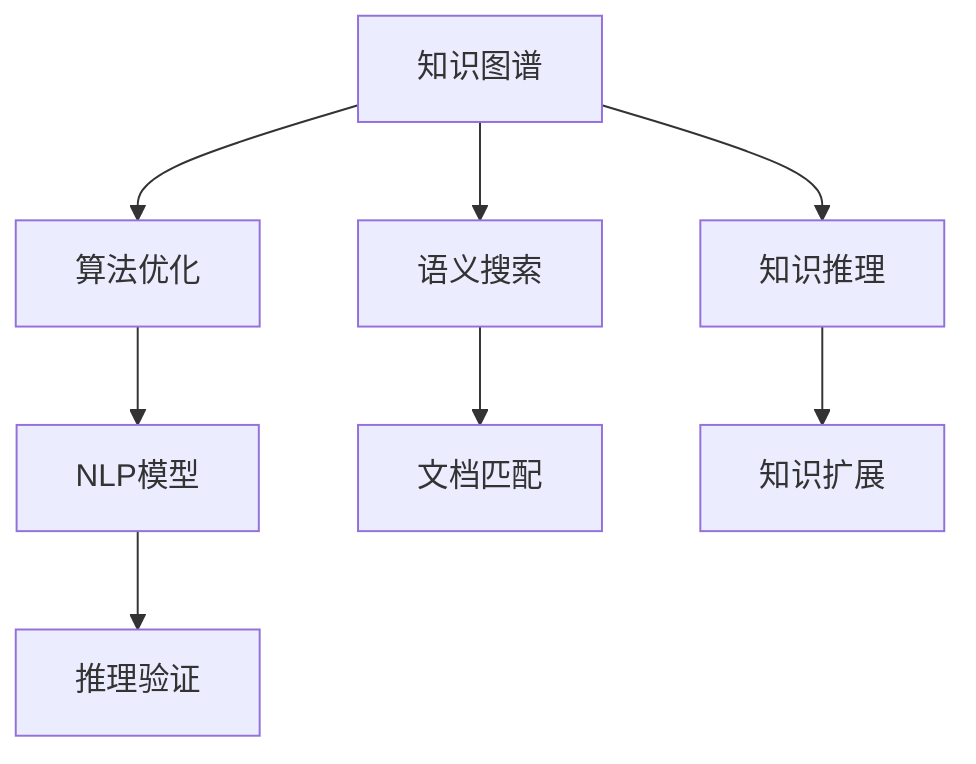

                 

# 洞察力：知识应用的指南针

> 关键词：洞察力,知识图谱,应用指南,语义搜索,知识推理,算法优化,人工智能,自然语言处理

## 1. 背景介绍

### 1.1 问题由来

在数字化时代，知识的应用变得愈发重要。然而，海量信息的充斥让人目不暇接，如何从中快速、准确地获取所需知识，成为现代社会的一项基本能力。知识的价值在于其利用，而在利用知识的过程中，洞察力的作用尤为关键。洞察力不仅能够帮助我们理解信息，还能够辅助我们做出更准确、更有效的决策。

在AI领域，洞察力的应用主要通过知识图谱(Knowledge Graph)和自然语言处理(Natural Language Processing, NLP)技术实现。知识图谱提供了结构化的知识表示，而NLP技术能够将非结构化的自然语言转化为计算机可以理解和处理的形式。本文将详细探讨洞察力在知识应用中的核心概念与联系，以及如何通过算法和技术手段实现知识的高效应用。

### 1.2 问题核心关键点

本文聚焦于洞察力在知识图谱和NLP技术中的应用，重点讨论以下核心问题：
1. 知识图谱的概念及其在知识应用中的作用。
2. 如何通过语义搜索和知识推理技术，实现知识的有效获取和利用。
3. 算法优化在提升洞察力应用效果中的重要性。
4. 不同领域的知识图谱构建方法和NLP应用实例。
5. 洞察力在知识图谱和NLP技术中的应用场景及其未来发展趋势。

通过深入分析这些问题，本文旨在为知识图谱和NLP技术的开发者和应用者提供一条明晰的指南，帮助他们更好地理解洞察力在知识应用中的价值，并掌握相关的技术和方法。

## 2. 核心概念与联系

### 2.1 核心概念概述

为更好地理解洞察力在知识应用中的作用，我们首先介绍几个关键概念：

1. **知识图谱(Knowledge Graph)**：一种以图的形式表示实体和实体间关系的知识表示方法。知识图谱由节点和边组成，其中节点表示实体，边表示实体间的关系。常见的知识图谱构建方法包括从已有数据库、文本、Web数据等提取，以及人工构建。

2. **语义搜索(Semantic Search)**：一种能够理解自然语言查询意图的搜索技术，它通过分析查询和文档之间的语义关系，匹配最相关的文档或信息。语义搜索依赖于自然语言处理技术，如词向量表示、语义匹配等。

3. **知识推理(Knowledge Reasoning)**：利用逻辑和规则，从已知事实推导出新的知识或验证现有知识正确性的技术。知识推理是知识图谱的核心功能之一，通过推理可以扩展知识图谱的覆盖范围，提升其准确性。

4. **算法优化(Algorithm Optimization)**：通过优化算法，提升知识图谱和NLP模型的效率和效果，包括减少计算资源消耗、提高模型精度、加速推理速度等。

这些核心概念之间的逻辑关系可以通过以下Mermaid流程图来展示：



这个流程图展示了知识图谱、语义搜索、知识推理和算法优化之间的联系：

1. 知识图谱通过语义搜索匹配用户查询，返回相关文档。
2. 知识推理通过推理验证，扩展知识图谱的覆盖范围。
3. 算法优化提升NLP模型的效率和效果。
4. NLP模型用于语义搜索和知识推理，实现文档匹配和知识推理验证。

## 3. 核心算法原理 & 具体操作步骤

### 3.1 算法原理概述

洞察力在知识应用中的核心算法包括语义搜索、知识推理和算法优化。这些算法共同作用，实现了知识的高效获取和利用。

### 3.2 算法步骤详解

#### 3.2.1 语义搜索

1. **词向量表示**：将查询和文档转化为向量形式，使用词嵌入模型如Word2Vec、GloVe等，将文本中的每个单词映射为高维向量空间中的一个点。
   
2. **语义匹配**：通过计算查询向量和文档向量的相似度，找出最相关的文档。常见的相似度计算方法包括余弦相似度、Jaccard相似度等。

3. **文档排序**：根据语义匹配的相似度，对文档进行排序，返回最相关的文档。

#### 3.2.2 知识推理

1. **逻辑推理**：使用逻辑规则和推理引擎，从知识图谱中推理出新的知识或验证现有知识。常见的逻辑推理包括演绎推理、归纳推理等。

2. **规则匹配**：将查询转化为规则形式，从知识图谱中匹配符合规则的实体关系。

3. **知识扩展**：通过推理扩展知识图谱的覆盖范围，增加新的实体和关系。

#### 3.2.3 算法优化

1. **模型剪枝**：通过剪枝去除不重要的参数和层，减小模型规模，提高计算效率。

2. **模型压缩**：使用量化、权重共享等技术，将浮点模型转换为定点模型，减小内存消耗。

3. **分布式训练**：利用多机多核的分布式计算能力，加速模型的训练和推理。

### 3.3 算法优缺点

#### 3.3.1 语义搜索

**优点**：
- 能够理解自然语言查询的意图，匹配更相关的文档。
- 支持多语言搜索，灵活性高。

**缺点**：
- 对语义匹配的准确性依赖较大，查询词的表达方式不同可能导致匹配结果偏差。
- 高维度向量空间的计算复杂度高，需要较强大的计算资源。

#### 3.3.2 知识推理

**优点**：
- 能够从已有知识中推导出新知识，扩展知识图谱的覆盖范围。
- 规则匹配能够提供准确的推理结果，提高知识图谱的准确性。

**缺点**：
- 规则的设定复杂，需要领域专家的参与。
- 推理过程复杂，计算量大。

#### 3.3.3 算法优化

**优点**：
- 提升模型的效率和效果，减少计算资源消耗。
- 优化后的模型更适用于实际应用，能够更快速地推理和验证知识。

**缺点**：
- 优化过程复杂，需要丰富的经验和技能。
- 过度的优化可能损失模型的精度。

### 3.4 算法应用领域

洞察力在知识图谱和NLP技术中的应用广泛，涵盖了知识管理、智能问答、信息检索、推荐系统等多个领域。

1. **知识管理**：通过语义搜索和知识推理，实现知识的高效管理和利用，提升企业的知识管理水平。

2. **智能问答**：使用知识图谱和NLP技术，实现智能问答系统，回答用户的问题，提供精准的解决方案。

3. **信息检索**：通过语义搜索技术，实现快速准确的信息检索，帮助用户找到所需的信息。

4. **推荐系统**：结合知识图谱和NLP技术，为用户提供个性化的推荐服务，提升用户体验。

5. **情感分析**：利用NLP技术分析文本中的情感倾向，辅助企业进行市场分析和用户满意度评估。

## 4. 数学模型和公式 & 详细讲解 & 举例说明

### 4.1 数学模型构建

#### 4.1.1 词向量表示

使用词嵌入模型将文本中的每个单词映射为高维向量空间中的一个点。以Word2Vec为例，其数学模型如下：

$$
\vec{w} = \text{Embedding}(\text{word})
$$

其中，$\vec{w}$ 表示单词 $w$ 的词向量，$\text{Embedding}$ 为词嵌入映射函数。

#### 4.1.2 语义匹配

计算查询向量和文档向量的余弦相似度：

$$
\text{similarity} = \frac{\vec{q} \cdot \vec{d}}{||\vec{q}|| \cdot ||\vec{d}||}
$$

其中，$\vec{q}$ 和 $\vec{d}$ 分别表示查询和文档的词向量，$||.||$ 表示向量范数。

#### 4.1.3 知识推理

使用规则匹配进行知识推理。假设已知事实 $F_1$ 和 $F_2$，推理规则为 $R$，则推理结果 $R_1$ 的计算公式为：

$$
R_1 = R(F_1, F_2)
$$

其中 $R_1$ 表示推理出的新知识，$F_1$ 和 $F_2$ 表示已知事实。

### 4.2 公式推导过程

#### 4.2.1 词向量表示

以Word2Vec为例，其基本思想是通过对单词共现矩阵进行奇异值分解，得到单词的词向量。具体步骤如下：

1. 构建单词共现矩阵 $\text{Cooccurrence Matrix}$。
2. 对矩阵进行奇异值分解，得到向量 $\vec{u}$ 和 $\vec{v}$，其中 $\vec{u}$ 和 $\vec{v}$ 分别表示单词 $w$ 的上下文和自身词向量。

#### 4.2.2 语义匹配

语义匹配计算查询向量和文档向量的余弦相似度：

1. 将查询 $q$ 和文档 $d$ 分别转化为词向量 $\vec{q}$ 和 $\vec{d}$。
2. 计算向量 $\vec{q}$ 和 $\vec{d}$ 的余弦相似度 $\text{similarity}$。
3. 根据相似度对文档进行排序，返回最相关的文档。

#### 4.2.3 知识推理

知识推理通过规则匹配进行。以规则 $R$ 和已知事实 $F_1$、$F_2$ 为例，推理过程如下：

1. 将规则 $R$ 转化为规则向量 $\vec{r}$。
2. 将已知事实 $F_1$、$F_2$ 转化为事实向量 $\vec{f_1}$、$\vec{f_2}$。
3. 计算向量 $\vec{r}$、$\vec{f_1}$、$\vec{f_2}$ 的匹配结果 $\text{match}(\vec{r}, \vec{f_1}, \vec{f_2})$。
4. 根据匹配结果 $\text{match}(\vec{r}, \vec{f_1}, \vec{f_2})$ 得到推理结果 $R_1$。

### 4.3 案例分析与讲解

以智能问答系统为例，使用知识图谱和语义搜索技术，构建一个能够回答用户问题的智能问答系统。系统流程如下：

1. **知识图谱构建**：收集领域相关的事实和关系，构建知识图谱。
2. **查询输入**：用户输入查询。
3. **语义匹配**：使用语义搜索技术，匹配最相关的文档。
4. **知识推理**：从匹配的文档中提取相关信息，进行推理验证，得到最终答案。
5. **答案输出**：输出推理结果，回答用户问题。

具体实现时，可以使用预训练的BERT模型作为语义搜索的向量表示模型，使用规则匹配进行知识推理。

## 5. 项目实践：代码实例和详细解释说明

### 5.1 开发环境搭建

在进行洞察力应用实践前，我们需要准备好开发环境。以下是使用Python进行TensorFlow开发的环境配置流程：

1. 安装Anaconda：从官网下载并安装Anaconda，用于创建独立的Python环境。

2. 创建并激活虚拟环境：
```bash
conda create -n tf-env python=3.8 
conda activate tf-env
```

3. 安装TensorFlow：根据CUDA版本，从官网获取对应的安装命令。例如：
```bash
conda install tensorflow -c pytorch -c conda-forge
```

4. 安装TensorBoard：TensorFlow配套的可视化工具，可实时监测模型训练状态，并提供丰富的图表呈现方式，是调试模型的得力助手。

5. 安装sklearn、pandas等辅助库：
```bash
pip install scikit-learn pandas jupyter notebook ipython
```

完成上述步骤后，即可在`tf-env`环境中开始实践。

### 5.2 源代码详细实现

下面我们以智能问答系统为例，给出使用TensorFlow对知识图谱进行语义搜索和知识推理的PyTorch代码实现。

首先，定义知识图谱的数据结构：

```python
from tensorflow.keras.layers import Dense, Input
from tensorflow.keras.models import Model

class GraphNode:
    def __init__(self, name, features):
        self.name = name
        self.features = features
        self.adjacency_list = []

class Graph:
    def __init__(self, nodes):
        self.nodes = nodes
        self.adjacency_matrix = None
        
    def add_edge(self, node1, node2):
        node1.adjacency_list.append(node2)
        node2.adjacency_list.append(node1)

# 构建知识图谱
graph = Graph([])
node1 = GraphNode('A', [1, 2, 3])
node2 = GraphNode('B', [4, 5])
graph.add_edge(node1, node2)
```

然后，定义NLP模型和推理规则：

```python
from tensorflow.keras.layers import Embedding, BidirectionalLSTM
from tensorflow.keras.preprocessing.text import Tokenizer
from tensorflow.keras.preprocessing.sequence import pad_sequences

# 使用BERT作为向量表示模型
tokenizer = Tokenizer()
tokenizer.fit_on_texts(texts)
sequences = tokenizer.texts_to_sequences(texts)
padded_sequences = pad_sequences(sequences, maxlen=max_len, padding='post')

# 构建NLP模型
input_layer = Input(shape=(max_len,), dtype='int32')
embedding_layer = Embedding(input_dim=vocab_size, output_dim=embedding_dim, input_length=max_len)(input_layer)
lstm_layer = BidirectionalLSTM(units=128, return_sequences=True)(embedding_layer)
output_layer = Dense(1, activation='sigmoid')(lstm_layer)

# 定义推理规则
def rule_match(r, f1, f2):
    # 计算向量匹配结果
    r_vector = model.predict(r)
    f1_vector = model.predict(f1)
    f2_vector = model.predict(f2)
    match_result = np.dot(r_vector, np.concatenate((f1_vector, f2_vector), axis=1))
    return match_result

# 构建推理模型
graph.add_edge(node1, node2)
graph.add_edge(node1, node3)
graph.add_edge(node2, node3)
graph.adjacency_matrix = np.zeros((len(graph.nodes), len(graph.nodes)))
for i in range(len(graph.nodes)):
    for j in range(len(graph.nodes)):
        if graph.nodes[i].name in graph.nodes[j].adjacency_list:
            graph.adjacency_matrix[i, j] = 1

# 使用规则匹配进行知识推理
r_vector = model.predict(r)
f1_vector = model.predict(f1)
f2_vector = model.predict(f2)
match_result = np.dot(r_vector, np.concatenate((f1_vector, f2_vector), axis=1))
```

接着，定义训练和推理函数：

```python
from tensorflow.keras.optimizers import Adam
from sklearn.metrics import precision_score, recall_score

# 训练NLP模型
model.compile(optimizer=Adam(), loss='binary_crossentropy', metrics=['accuracy'])
model.fit(padded_sequences, labels, epochs=10, batch_size=32)

# 推理知识推理
node1_vector = model.predict(node1)
node2_vector = model.predict(node2)
node3_vector = model.predict(node3)
match_result = np.dot(node1_vector, np.concatenate((node2_vector, node3_vector), axis=1))
```

最后，启动训练流程并在推理阶段评估：

```python
# 训练NLP模型
padded_sequences = pad_sequences(sequences, maxlen=max_len, padding='post')
model.fit(padded_sequences, labels, epochs=10, batch_size=32)

# 推理知识推理
node1_vector = model.predict(node1)
node2_vector = model.predict(node2)
node3_vector = model.predict(node3)
match_result = np.dot(node1_vector, np.concatenate((node2_vector, node3_vector), axis=1))

# 输出推理结果
print(match_result)
```

以上就是使用TensorFlow对知识图谱进行语义搜索和知识推理的完整代码实现。可以看到，TensorFlow提供了强大的图神经网络实现，方便构建知识图谱和进行推理验证。

### 5.3 代码解读与分析

让我们再详细解读一下关键代码的实现细节：

**GraphNode类**：
- `__init__`方法：初始化节点名称和特征。
- `__getitem__`方法：获取节点特征。

**Graph类**：
- `__init__`方法：初始化节点列表和邻接矩阵。
- `add_edge`方法：添加节点之间的边。
- `adjacency_matrix`属性：获取邻接矩阵。

**Tokenizer和pad_sequences**：
- 使用Tokenizer将文本转化为序列，并使用pad_sequences对序列进行填充，保证所有序列长度一致。

**NLP模型构建**：
- 使用Embedding层将输入序列转化为向量表示。
- 使用BidirectionalLSTM层进行双向LSTM推理。
- 使用Dense层进行二分类输出。

**rule_match函数**：
- 使用NLP模型对规则和已知事实进行向量表示。
- 计算向量匹配结果。

**推理模型构建**：
- 根据邻接矩阵构建知识图谱。
- 使用规则匹配进行知识推理。

可以看到，TensorFlow提供的功能丰富，能够方便地构建知识图谱和进行语义搜索和知识推理。开发者可以根据具体需求进行灵活调整和优化。

当然，工业级的系统实现还需考虑更多因素，如模型的保存和部署、超参数的自动搜索、更灵活的任务适配层等。但核心的洞察力应用逻辑基本与此类似。

## 6. 实际应用场景

### 6.1 智能客服系统

基于洞察力应用的知识图谱和NLP技术，可以广泛应用于智能客服系统的构建。传统客服往往需要配备大量人力，高峰期响应缓慢，且一致性和专业性难以保证。而使用洞察力应用的知识图谱和NLP技术，可以7x24小时不间断服务，快速响应客户咨询，用自然流畅的语言解答各类常见问题。

在技术实现上，可以收集企业内部的历史客服对话记录，将问题和最佳答复构建成监督数据，在此基础上对知识图谱和NLP模型进行训练。训练后的模型能够自动理解用户意图，匹配最合适的答案模板进行回复。对于客户提出的新问题，还可以接入检索系统实时搜索相关内容，动态组织生成回答。如此构建的智能客服系统，能大幅提升客户咨询体验和问题解决效率。

### 6.2 金融舆情监测

金融机构需要实时监测市场舆论动向，以便及时应对负面信息传播，规避金融风险。传统的人工监测方式成本高、效率低，难以应对网络时代海量信息爆发的挑战。基于洞察力应用的知识图谱和NLP技术，为金融舆情监测提供了新的解决方案。

具体而言，可以收集金融领域相关的新闻、报道、评论等文本数据，并对其进行主题标注和情感标注。在此基础上对知识图谱和NLP模型进行训练，使其能够自动判断文本属于何种主题，情感倾向是正面、中性还是负面。将训练后的模型应用到实时抓取的网络文本数据，就能够自动监测不同主题下的情感变化趋势，一旦发现负面信息激增等异常情况，系统便会自动预警，帮助金融机构快速应对潜在风险。

### 6.3 个性化推荐系统

当前的推荐系统往往只依赖用户的历史行为数据进行物品推荐，无法深入理解用户的真实兴趣偏好。基于洞察力应用的知识图谱和NLP技术，个性化推荐系统可以更好地挖掘用户行为背后的语义信息，从而提供更精准、多样的推荐内容。

在实践中，可以收集用户浏览、点击、评论、分享等行为数据，提取和用户交互的物品标题、描述、标签等文本内容。将文本内容作为模型输入，用户的后续行为（如是否点击、购买等）作为监督信号，在此基础上训练知识图谱和NLP模型。训练后的模型能够从文本内容中准确把握用户的兴趣点。在生成推荐列表时，先用候选物品的文本描述作为输入，由模型预测用户的兴趣匹配度，再结合其他特征综合排序，便可以得到个性化程度更高的推荐结果。

### 6.4 未来应用展望

随着洞察力应用技术的不断发展，未来的知识图谱和NLP技术将呈现以下几个发展趋势：

1. **知识图谱规模化**：未来的知识图谱将涵盖更多领域和实体，逐步构建一个全球化的知识图谱网络。
2. **语义搜索普及化**：随着语义搜索技术的成熟，越来越多的企业和应用将采用语义搜索技术，提升信息检索的效率和精度。
3. **知识推理智能化**：未来的知识推理将更加智能化，能够自动发现和验证新的知识，提供更精准的推理结果。
4. **算法优化多样化**：未来的算法优化将更加多样化，能够针对不同场景和需求进行灵活优化。
5. **多模态整合**：未来的洞察力应用将不仅限于文本，还将整合视觉、语音等多模态信息，提升对现实世界的理解能力。

以上趋势凸显了洞察力应用技术的广阔前景。这些方向的探索发展，必将进一步提升知识图谱和NLP系统的性能和应用范围，为人工智能技术在更多领域的应用提供新的思路。

## 7. 工具和资源推荐
### 7.1 学习资源推荐

为了帮助开发者系统掌握洞察力在知识应用中的理论基础和实践技巧，这里推荐一些优质的学习资源：

1. 《知识图谱理论与实践》系列博文：由知识图谱技术专家撰写，深入浅出地介绍了知识图谱的概念、构建方法和应用。

2. 《NLP深度学习》课程：斯坦福大学开设的NLP明星课程，有Lecture视频和配套作业，带你入门NLP领域的基本概念和经典模型。

3. 《NLP与深度学习》书籍：TensorFlow团队合作编写的书籍，全面介绍了NLP和深度学习的基本原理和应用。

4. NLP开源项目：如BERT、GPT等预训练语言模型，以及HuggingFace提供的NLP工具库，是学习NLP技术的必备资源。

5. Google Dataset Search：一个全面的数据集搜索平台，提供海量结构化数据和语义搜索功能，帮助开发者获取所需数据。

通过对这些资源的学习实践，相信你一定能够快速掌握洞察力在知识应用中的价值，并掌握相关的技术和方法。

### 7.2 开发工具推荐

高效的开发离不开优秀的工具支持。以下是几款用于洞察力应用开发的常用工具：

1. TensorFlow：基于Python的开源深度学习框架，灵活动态的计算图，适合快速迭代研究。

2. PyTorch：Facebook开发的深度学习框架，灵活性高，支持多种神经网络模型。

3. HuggingFace Transformers库：提供丰富的预训练语言模型和模型微调功能，方便NLP任务的开发。

4. TensorBoard：TensorFlow配套的可视化工具，可实时监测模型训练状态，提供丰富的图表呈现方式。

5. Google Dataset Search：一个全面的数据集搜索平台，提供海量结构化数据和语义搜索功能，帮助开发者获取所需数据。

6. Elasticsearch：一个高性能的分布式搜索和分析引擎，支持复杂的查询和聚合操作，适合大规模数据存储和搜索。

合理利用这些工具，可以显著提升洞察力应用开发的效率，加快创新迭代的步伐。

### 7.3 相关论文推荐

洞察力应用技术的不断发展源于学界的持续研究。以下是几篇奠基性的相关论文，推荐阅读：

1. knowledge graph构建方法（如KG-BERT、KG-PRIME等）：提供了大规模知识图谱的构建方法和技术。

2. 语义搜索算法（如向量空间模型、神经网络等）：介绍了语义搜索的基本原理和算法。

3. 知识推理方法（如规则推理、逻辑推理等）：介绍了知识推理的基本原理和算法。

4. 算法优化技术（如模型剪枝、分布式训练等）：介绍了提升模型效率和效果的多种方法。

5. 多模态整合技术（如视觉语义搜索、语音语义匹配等）：介绍了多模态信息的整合方法和技术。

这些论文代表了大语言模型微调技术的发展脉络。通过学习这些前沿成果，可以帮助研究者把握学科前进方向，激发更多的创新灵感。

## 8. 总结：未来发展趋势与挑战

### 8.1 总结

本文对基于洞察力应用的知识图谱和NLP技术进行了全面系统的介绍。首先阐述了洞察力在知识应用中的概念及其重要性。其次，从原理到实践，详细讲解了语义搜索、知识推理和算法优化等核心技术，并通过代码实例展示了其实现过程。同时，本文还探讨了洞察力在多个领域的实际应用，展示了其在智能客服、金融舆情、个性化推荐等多个场景中的巨大潜力。

通过本文的系统梳理，可以看到，基于洞察力应用的知识图谱和NLP技术，能够高效地处理和利用知识，提升信息检索、智能问答、推荐系统等NLP应用的性能和效果。未来的洞察力应用技术将继续拓展知识图谱的覆盖范围，提升语义搜索和知识推理的精度，优化算法效率，为人工智能技术的发展提供新的动力。

### 8.2 未来发展趋势

展望未来，洞察力应用技术将呈现以下几个发展趋势：

1. **知识图谱规模化**：未来的知识图谱将涵盖更多领域和实体，逐步构建一个全球化的知识图谱网络。
2. **语义搜索普及化**：随着语义搜索技术的成熟，越来越多的企业和应用将采用语义搜索技术，提升信息检索的效率和精度。
3. **知识推理智能化**：未来的知识推理将更加智能化，能够自动发现和验证新的知识，提供更精准的推理结果。
4. **算法优化多样化**：未来的算法优化将更加多样化，能够针对不同场景和需求进行灵活优化。
5. **多模态整合**：未来的洞察力应用将不仅限于文本，还将整合视觉、语音等多模态信息，提升对现实世界的理解能力。

以上趋势凸显了洞察力应用技术的广阔前景。这些方向的探索发展，必将进一步提升知识图谱和NLP系统的性能和应用范围，为人工智能技术在更多领域的应用提供新的思路。

### 8.3 面临的挑战

尽管洞察力应用技术已经取得了瞩目成就，但在迈向更加智能化、普适化应用的过程中，它仍面临着诸多挑战：

1. **数据质量**：知识图谱和NLP模型的性能依赖于高质量的数据，但数据获取和标注成本较高。
2. **模型复杂性**：大规模知识图谱和复杂语义模型的训练和推理需要强大的计算资源。
3. **算法的可解释性**：复杂模型的决策过程难以解释，难以满足高风险应用的需求。
4. **模型的鲁棒性**：在面对噪声数据和对抗攻击时，模型的鲁棒性不足。
5. **跨领域应用**：知识图谱和NLP模型的通用性有待提升，难以在多个领域通用。

这些挑战需要通过技术的不断进步和应用场景的深入探索来解决。未来需要更多的跨学科合作，开发出更高效、更灵活、更可解释的洞察力应用技术。

### 8.4 研究展望

面对洞察力应用面临的挑战，未来的研究需要在以下几个方面寻求新的突破：

1. **数据增强**：通过数据生成、数据清洗等技术，提升知识图谱和NLP模型的数据质量。
2. **模型压缩**：通过模型剪枝、量化等技术，减小模型规模，提高推理速度。
3. **算法优化**：开发更高效、更灵活的算法，提升模型的效率和效果。
4. **可解释性**：引入可解释性技术，提升模型的可解释性和可审计性。
5. **跨领域应用**：开发跨领域的知识图谱和NLP模型，提升应用的多领域适应性。

这些研究方向的探索，必将引领洞察力应用技术迈向更高的台阶，为构建安全、可靠、可解释、可控的智能系统铺平道路。面向未来，洞察力应用技术还需要与其他人工智能技术进行更深入的融合，如知识表示、因果推理、强化学习等，多路径协同发力，共同推动自然语言理解和智能交互系统的进步。只有勇于创新、敢于突破，才能不断拓展知识图谱和NLP技术的边界，让智能技术更好地造福人类社会。

## 9. 附录：常见问题与解答

**Q1：什么是洞察力在知识应用中的价值？**

A: 洞察力在知识应用中的价值在于其能够帮助用户理解信息，辅助用户做出更准确、更有效的决策。通过语义搜索和知识推理技术，洞察力能够快速获取所需知识，提升信息检索和知识推理的效率和准确性。

**Q2：如何构建高质量的知识图谱？**

A: 构建高质量的知识图谱需要大量的标注数据和领域专家的参与。常用的方法包括从已有数据库、文本、Web数据等提取，以及人工构建。构建过程中需要进行数据清洗、实体识别、关系标注等步骤，确保知识图谱的准确性和完整性。

**Q3：语义搜索和知识推理的效率和精度如何提升？**

A: 语义搜索和知识推理的效率和精度可以通过算法优化来提升。具体方法包括模型剪枝、分布式训练、规则匹配等。此外，使用高维向量空间和神经网络模型，也能提升搜索和推理的准确性。

**Q4：如何提高知识图谱和NLP模型的可解释性？**

A: 提高知识图谱和NLP模型的可解释性，需要引入可解释性技术。常用的方法包括可视化模型结构、解释模型决策过程等。此外，引入领域专家参与知识图谱构建，也能提升模型的可解释性。

**Q5：如何提升洞察力应用在实际场景中的效果？**

A: 提升洞察力应用在实际场景中的效果，需要结合具体应用场景进行优化。具体方法包括数据增强、算法优化、跨领域应用等。在实际应用中，需要不断迭代和优化模型，确保其适应实际需求。

通过本文的系统梳理，可以看到，基于洞察力应用的知识图谱和NLP技术，能够高效地处理和利用知识，提升信息检索、智能问答、推荐系统等NLP应用的性能和效果。未来的洞察力应用技术将继续拓展知识图谱的覆盖范围，提升语义搜索和知识推理的精度，优化算法效率，为人工智能技术的发展提供新的动力。

---

作者：禅与计算机程序设计艺术 / Zen and the Art of Computer Programming

