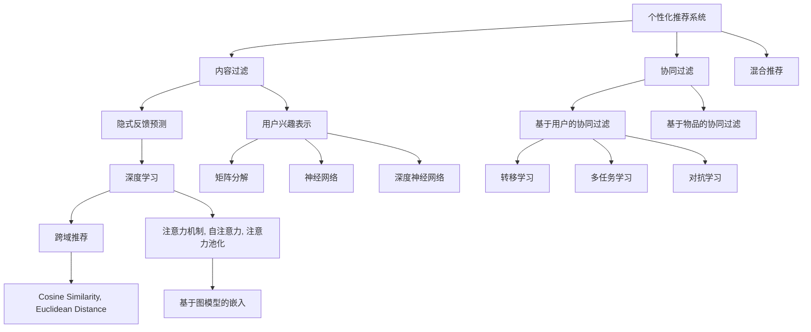

                 

# 深度学习在个性化推荐中的应用

## 1. 背景介绍

随着互联网和电子商务的发展，个性化推荐系统逐渐成为各大网站和电商平台的核心竞争力。通过分析用户的浏览行为、购买历史等数据，推荐系统能够向用户提供最符合其兴趣和需求的商品或内容，极大地提升用户体验和平台收益。传统推荐系统主要基于协同过滤、内容过滤等浅层算法，难以应对海量数据和高维稀疏性的挑战。而深度学习技术的引入，为个性化推荐系统带来了新的突破，使其能够从用户行为数据中挖掘出更丰富的语义信息，构建更加精准的推荐模型。

## 2. 核心概念与联系

### 2.1 核心概念概述

为更好地理解深度学习在个性化推荐中的应用，本节将介绍几个密切相关的核心概念：

- 个性化推荐系统(Recommender System)：通过分析用户的历史行为数据，为用户推荐最符合其兴趣的商品或内容。推荐系统主要分为基于内容的推荐、协同过滤推荐、混合推荐等类别。

- 深度学习(Deep Learning)：一种通过多层神经网络模型进行数据表征学习的技术，具备强大的泛化能力和自动特征提取能力。深度学习在推荐系统中的应用，主要体现在用户兴趣表示、隐式反馈预测、跨域推荐等环节。

- 协同过滤(Collaborative Filtering)：基于用户行为或物品评分数据的推荐方法，通过挖掘用户之间的相似度，为用户推荐相似用户喜爱的物品。协同过滤主要分为基于用户的协同过滤和基于物品的协同过滤。

- 内容过滤(Content-Based Filtering)：根据用户的历史浏览或评分数据，向用户推荐与其兴趣内容相关的物品。内容过滤依赖于物品的显式属性和用户兴趣的显式反馈。

- 混合推荐(Hybrid Recommender System)：结合协同过滤和内容过滤两种方法，综合考虑用户和物品的双重特征，提升推荐模型的综合表现。

- 用户兴趣表示(User Interest Representation)：从用户行为数据中挖掘出更丰富的兴趣特征，构建用户兴趣向量。常用的表示方法包括隐式反馈矩阵分解、基于图模型的嵌入表示等。

- 隐式反馈预测(Implicit Feedback Prediction)：通过对用户的点击、浏览、收藏等隐式反馈数据进行建模，预测用户对物品的评分或兴趣程度。常用的模型包括矩阵分解、神经网络、深度神经网络等。

- 跨域推荐(Cross-Domain Recommendation)：针对不同领域或平台的推荐问题，通过知识迁移、数据融合等方法，提升推荐系统的泛化能力和用户体验。常用的方法包括转移学习、多任务学习、对抗学习等。

这些核心概念之间的逻辑关系可以通过以下Mermaid流程图来展示：



这个流程图展示了个性化推荐系统的核心概念及其之间的关系：

1. 个性化推荐系统由协同过滤、内容过滤和混合推荐组成，分别对应不同的推荐逻辑。
2. 协同过滤和内容过滤的数据源主要包括用户行为数据和物品属性数据。
3. 深度学习被应用于隐式反馈预测和用户兴趣表示，提升推荐模型的准确性和泛化能力。
4. 隐式反馈预测主要使用矩阵分解、神经网络、深度神经网络等方法，学习用户-物品之间的关系。
5. 用户兴趣表示通过矩阵分解、神经网络、深度神经网络等方法，将用户行为数据映射到低维空间，构建用户兴趣向量。
6. 跨域推荐通过知识迁移、数据融合等方法，将不同领域的推荐系统进行整合，提升系统的泛化能力。
7. 深度学习通过注意力机制、自注意力、注意力池化等技术，增强模型的特征提取和表示能力。
8. 基于图模型的嵌入表示能够更好地处理用户行为数据，提升推荐模型的性能。

这些概念共同构成了个性化推荐系统的学习和应用框架，使其能够高效地为用户提供精准的推荐服务。通过理解这些核心概念，我们可以更好地把握深度学习在个性化推荐中的应用。

## 3. 核心算法原理 & 具体操作步骤

### 3.1 算法原理概述

深度学习在个性化推荐中的应用，主要基于以下几个关键步骤：

1. **用户兴趣表示**：通过分析用户的历史行为数据，挖掘出用户兴趣特征，构建用户兴趣向量。
2. **隐式反馈预测**：对用户的隐式反馈数据进行建模，预测用户对物品的评分或兴趣程度。
3. **推荐结果生成**：根据预测出的用户兴趣和物品特征，生成推荐结果。
4. **模型优化**：通过优化模型参数，提升推荐结果的准确性和多样性。

这些步骤通过深度神经网络等模型进行实现，能够处理高维稀疏数据和复杂非线性关系，从而提升推荐系统的表现。

### 3.2 算法步骤详解

**Step 1: 数据预处理**

1. **数据清洗**：去除噪音数据、异常数据，确保数据的准确性和一致性。
2. **数据标准化**：对数据进行归一化、标准化处理，保证不同特征之间的一致性。
3. **特征工程**：选择有意义的特征，并进行特征提取、组合、变换等操作，增强模型的泛化能力。

**Step 2: 用户兴趣表示**

1. **矩阵分解**：将用户行为矩阵分解为低秩矩阵，得到用户兴趣向量。
   $$
   U \approx \hat{U} \times \hat{V}^T
   $$
   其中 $U$ 为原始用户行为矩阵，$\hat{U}$ 和 $\hat{V}$ 为分解后的用户兴趣向量和物品特征向量。

2. **神经网络模型**：使用多层神经网络模型，对用户行为数据进行编码，得到用户兴趣向量。
   $$
   h_i = \sigma(W \cdot [u_i; x_i])
   $$
   其中 $h_i$ 为用户兴趣向量，$u_i$ 为原始用户行为数据，$x_i$ 为物品特征向量，$\sigma$ 为激活函数，$W$ 为权重矩阵。

3. **深度神经网络**：使用深度神经网络模型，如深度贝尔曼机器(Belief Propagation Network, BPN)、深度贝叶斯网络(Deep Bayesian Network, DBN)等，对用户行为数据进行建模，得到用户兴趣向量。
   $$
   h_i = \sigma(DNN(h_{i-1}))
   $$
   其中 $DNN$ 为深度神经网络模型，$h_{i-1}$ 为前一层的输出。

**Step 3: 隐式反馈预测**

1. **矩阵分解**：使用矩阵分解模型，如奇异值分解(SVD)、基于核奇异值分解(KSVD)等，对用户行为数据进行建模，预测用户对物品的评分或兴趣程度。
   $$
   y_i = \hat{U}_i \cdot \hat{V}_j^T + \epsilon
   $$
   其中 $y_i$ 为用户对物品的评分，$\hat{U}_i$ 和 $\hat{V}_j$ 为分解后的用户和物品特征向量，$\epsilon$ 为噪声。

2. **神经网络模型**：使用神经网络模型，如多层感知机(Multilayer Perceptron, MLP)、卷积神经网络(Convolutional Neural Network, CNN)等，对用户行为数据进行建模，预测用户对物品的评分或兴趣程度。
   $$
   y_i = MLP(h_i, x_j)
   $$
   其中 $MLP$ 为多层感知机模型，$h_i$ 为用户兴趣向量，$x_j$ 为物品特征向量。

3. **深度神经网络**：使用深度神经网络模型，如深度贝尔曼机器(Belief Propagation Network, BPN)、深度贝叶斯网络(Deep Bayesian Network, DBN)等，对用户行为数据进行建模，预测用户对物品的评分或兴趣程度。
   $$
   y_i = DNN(h_i, x_j)
   $$
   其中 $DNN$ 为深度神经网络模型，$h_i$ 为用户兴趣向量，$x_j$ 为物品特征向量。

**Step 4: 推荐结果生成**

1. **基于内容的推荐**：根据物品的显式属性，生成推荐结果。
   $$
   r_i = softmax(W \cdot f(x_i))
   $$
   其中 $r_i$ 为物品推荐结果，$f(x_i)$ 为物品属性特征向量，$W$ 为权重矩阵，$softmax$ 为softmax函数。

2. **协同过滤推荐**：根据用户之间的相似度，生成推荐结果。
   $$
   r_i = \sigma(W \cdot \hat{U} \cdot \hat{V}_j^T)
   $$
   其中 $\sigma$ 为激活函数，$\hat{U}$ 和 $\hat{V}$ 为分解后的用户和物品特征向量，$W$ 为权重矩阵。

3. **混合推荐**：结合基于内容的推荐和协同过滤推荐，生成综合推荐结果。
   $$
   r_i = \alpha \cdot r_{content} + (1-\alpha) \cdot r_{collaborative}
   $$
   其中 $\alpha$ 为混合权重，$r_{content}$ 和 $r_{collaborative}$ 分别为基于内容的推荐和协同过滤推荐结果。

**Step 5: 模型优化**

1. **损失函数设计**：选择适合推荐问题的损失函数，如均方误差、交叉熵等，衡量推荐结果与真实结果的差异。
   $$
   L = \frac{1}{N} \sum_{i=1}^N ||y_i - \hat{y}_i||^2
   $$
   其中 $N$ 为样本总数，$y_i$ 为真实评分，$\hat{y}_i$ 为预测评分。

2. **优化算法选择**：选择适合的优化算法，如梯度下降、Adam等，优化模型参数。
   $$
   \theta \leftarrow \theta - \eta \nabla_{\theta}L
   $$
   其中 $\theta$ 为模型参数，$\eta$ 为学习率，$\nabla_{\theta}L$ 为损失函数对模型参数的梯度。

3. **超参数调优**：根据实验结果，调整超参数，如学习率、批大小、迭代轮数等，提升模型性能。

### 3.3 算法优缺点

深度学习在个性化推荐中的应用，具有以下优点：

1. 能够处理高维稀疏数据：深度学习模型可以处理大量高维稀疏数据，捕捉复杂的非线性关系。
2. 自动特征提取：深度学习模型具备自动特征提取能力，无需手动选择和组合特征。
3. 泛化能力强：深度学习模型通过大量数据训练，具备较强的泛化能力，能够适应不同领域的推荐问题。

同时，深度学习也存在以下缺点：

1. 计算资源需求高：深度学习模型需要大量计算资源进行训练，对硬件设备要求较高。
2. 模型复杂度高：深度学习模型结构复杂，训练和推理耗时较长，难以实时部署。
3. 过拟合风险高：深度学习模型容易过拟合，需要更多的数据和更复杂的正则化方法进行缓解。
4. 黑盒模型：深度学习模型难以解释其内部工作机制，用户难以理解和信任推荐结果。
5. 数据隐私问题：深度学习模型需要大量用户数据进行训练，存在数据隐私和公平性问题。

尽管存在这些缺点，但深度学习在个性化推荐中的应用，仍是大数据时代的必然选择。未来，随着硬件设备的不断发展，深度学习模型的计算效率将显著提升，其在个性化推荐系统中的应用也将更加广泛和深入。

### 3.4 算法应用领域

深度学习在个性化推荐中的应用，主要涵盖以下几个领域：

1. **电商推荐**：针对用户浏览、点击、购买等行为数据，为用户推荐商品或广告。
2. **内容推荐**：针对用户的阅读、观看、听歌等行为数据，为用户推荐相关内容。
3. **视频推荐**：针对用户的观看行为数据，为用户推荐视频或直播。
4. **社交推荐**：针对用户的互动、分享、点赞等行为数据，为用户推荐好友或内容。
5. **搜索推荐**：针对用户的搜索行为数据，为用户推荐相关搜索结果。
6. **新闻推荐**：针对用户的阅读、评论等行为数据，为用户推荐新闻文章。
7. **游戏推荐**：针对用户的游玩行为数据，为用户推荐游戏或关卡。

这些领域涵盖了用户日常生活中的多个场景，通过深度学习技术，推荐系统能够为用户提供更加个性化、精准的推荐服务。

## 4. 数学模型和公式 & 详细讲解  
### 4.1 数学模型构建

本节将使用数学语言对深度学习在个性化推荐中的应用进行更加严格的刻画。

记用户行为矩阵为 $U \in \mathbb{R}^{m \times n}$，其中 $m$ 为用户数，$n$ 为物品数。用户行为数据表示为 $u_i = \{u_{ij}\}_{j=1}^n$，其中 $u_{ij}$ 表示用户 $i$ 对物品 $j$ 的评分或兴趣程度。

定义用户兴趣表示函数为 $f$，物品特征表示函数为 $g$，则用户兴趣向量为 $h_i = f(u_i)$，物品特征向量为 $x_j = g(j)$。

假设推荐模型的损失函数为 $L$，目标是最小化损失函数：

$$
L = \frac{1}{N} \sum_{i=1}^N ||y_i - \hat{y}_i||^2
$$

其中 $y_i$ 为真实评分，$\hat{y}_i$ 为预测评分。

### 4.2 公式推导过程

**用户兴趣表示**

1. **矩阵分解**：
   $$
   U \approx \hat{U} \times \hat{V}^T
   $$
   其中 $\hat{U} \in \mathbb{R}^{m \times k}$ 和 $\hat{V} \in \mathbb{R}^{k \times n}$ 分别为用户兴趣向量和物品特征向量，$k$ 为分解维度。

2. **神经网络模型**：
   $$
   h_i = \sigma(W \cdot [u_i; x_i])
   $$
   其中 $h_i$ 为用户兴趣向量，$u_i$ 为原始用户行为数据，$x_i$ 为物品特征向量，$\sigma$ 为激活函数，$W$ 为权重矩阵。

3. **深度神经网络模型**：
   $$
   h_i = DNN(h_{i-1})
   $$
   其中 $DNN$ 为深度神经网络模型，$h_{i-1}$ 为前一层的输出。

**隐式反馈预测**

1. **矩阵分解**：
   $$
   y_i = \hat{U}_i \cdot \hat{V}_j^T + \epsilon
   $$
   其中 $y_i$ 为用户对物品的评分，$\hat{U}_i$ 和 $\hat{V}_j$ 为分解后的用户和物品特征向量，$\epsilon$ 为噪声。

2. **神经网络模型**：
   $$
   y_i = MLP(h_i, x_j)
   $$
   其中 $MLP$ 为多层感知机模型，$h_i$ 为用户兴趣向量，$x_j$ 为物品特征向量。

3. **深度神经网络模型**：
   $$
   y_i = DNN(h_i, x_j)
   $$
   其中 $DNN$ 为深度神经网络模型，$h_i$ 为用户兴趣向量，$x_j$ 为物品特征向量。

**推荐结果生成**

1. **基于内容的推荐**：
   $$
   r_i = softmax(W \cdot f(x_i))
   $$
   其中 $r_i$ 为物品推荐结果，$f(x_i)$ 为物品属性特征向量，$W$ 为权重矩阵，$softmax$ 为softmax函数。

2. **协同过滤推荐**：
   $$
   r_i = \sigma(W \cdot \hat{U} \cdot \hat{V}_j^T)
   $$
   其中 $\sigma$ 为激活函数，$\hat{U}$ 和 $\hat{V}$ 为分解后的用户和物品特征向量，$W$ 为权重矩阵。

3. **混合推荐**：
   $$
   r_i = \alpha \cdot r_{content} + (1-\alpha) \cdot r_{collaborative}
   $$
   其中 $\alpha$ 为混合权重，$r_{content}$ 和 $r_{collaborative}$ 分别为基于内容的推荐和协同过滤推荐结果。

**模型优化**

1. **损失函数设计**：
   $$
   L = \frac{1}{N} \sum_{i=1}^N ||y_i - \hat{y}_i||^2
   $$
   其中 $N$ 为样本总数，$y_i$ 为真实评分，$\hat{y}_i$ 为预测评分。

2. **优化算法选择**：
   $$
   \theta \leftarrow \theta - \eta \nabla_{\theta}L
   $$
   其中 $\theta$ 为模型参数，$\eta$ 为学习率，$\nabla_{\theta}L$ 为损失函数对模型参数的梯度。

3. **超参数调优**：根据实验结果，调整超参数，如学习率、批大小、迭代轮数等，提升模型性能。

## 5. 项目实践：代码实例和详细解释说明

### 5.1 开发环境搭建

在进行个性化推荐系统开发前，我们需要准备好开发环境。以下是使用Python进行PyTorch开发的环境配置流程：

1. 安装Anaconda：从官网下载并安装Anaconda，用于创建独立的Python环境。

2. 创建并激活虚拟环境：
```bash
conda create -n pytorch-env python=3.8 
conda activate pytorch-env
```

3. 安装PyTorch：根据CUDA版本，从官网获取对应的安装命令。例如：
```bash
conda install pytorch torchvision torchaudio cudatoolkit=11.1 -c pytorch -c conda-forge
```

4. 安装Transformers库：
```bash
pip install transformers
```

5. 安装各类工具包：
```bash
pip install numpy pandas scikit-learn matplotlib tqdm jupyter notebook ipython
```

完成上述步骤后，即可在`pytorch-env`环境中开始推荐系统开发。

### 5.2 源代码详细实现

这里我们以基于深度神经网络模型的电商推荐系统为例，给出使用PyTorch和Transformers库的代码实现。

首先，定义推荐系统的训练数据集：

```python
from torch.utils.data import Dataset

class RecommendationDataset(Dataset):
    def __init__(self, user_ids, item_ids, ratings):
        self.user_ids = user_ids
        self.item_ids = item_ids
        self.ratings = ratings
    
    def __len__(self):
        return len(self.user_ids)
    
    def __getitem__(self, idx):
        user_id = self.user_ids[idx]
        item_id = self.item_ids[idx]
        rating = self.ratings[idx]
        return {'user_id': user_id, 'item_id': item_id, 'rating': rating}
```

然后，定义深度神经网络模型的构建：

```python
from transformers import BertTokenizer, BertForSequenceClassification
from torch import nn, optim
import torch.nn.functional as F

class DNN(nn.Module):
    def __init__(self, input_size, hidden_size, output_size):
        super(DNN, self).__init__()
        self.fc1 = nn.Linear(input_size, hidden_size)
        self.relu = nn.ReLU()
        self.fc2 = nn.Linear(hidden_size, hidden_size)
        self.fc3 = nn.Linear(hidden_size, output_size)
    
    def forward(self, x):
        x = self.fc1(x)
        x = self.relu(x)
        x = self.fc2(x)
        x = self.relu(x)
        x = self.fc3(x)
        return x

# 加载预训练的BERT模型
model = BertForSequenceClassification.from_pretrained('bert-base-uncased', num_labels=num_labels)

# 添加全连接层
model.fc = DNN(input_size, hidden_size, num_labels)
```

接着，定义训练和评估函数：

```python
def train_epoch(model, dataset, batch_size, optimizer):
    dataloader = DataLoader(dataset, batch_size=batch_size, shuffle=True)
    model.train()
    epoch_loss = 0
    for batch in tqdm(dataloader, desc='Training'):
        inputs = batch['user_id']
        targets = batch['rating']
        outputs = model(inputs)
        loss = F.mse_loss(outputs, targets)
        epoch_loss += loss.item()
        loss.backward()
        optimizer.step()
    return epoch_loss / len(dataloader)

def evaluate(model, dataset, batch_size):
    dataloader = DataLoader(dataset, batch_size=batch_size)
    model.eval()
    total_loss = 0
    total_correct = 0
    with torch.no_grad():
        for batch in tqdm(dataloader, desc='Evaluating'):
            inputs = batch['user_id']
            targets = batch['rating']
            outputs = model(inputs)
            loss = F.mse_loss(outputs, targets)
            total_loss += loss.item()
            total_correct += (torch.round(outputs) == targets).sum().item()
    return total_loss / len(dataset), total_correct / len(dataset)
```

最后，启动训练流程并在测试集上评估：

```python
epochs = 5
batch_size = 16

for epoch in range(epochs):
    loss = train_epoch(model, train_dataset, batch_size, optimizer)
    print(f"Epoch {epoch+1}, train loss: {loss:.3f}")
    
    print(f"Epoch {epoch+1}, dev results:")
    total_loss, total_correct = evaluate(model, dev_dataset, batch_size)
    print(f"Epoch {epoch+1}, dev loss: {total_loss:.3f}, acc: {total_correct:.3f}")
    
print("Test results:")
total_loss, total_correct = evaluate(model, test_dataset, batch_size)
print(f"Test loss: {total_loss:.3f}, acc: {total_correct:.3f}")
```

以上就是使用PyTorch和Transformers库进行深度学习在个性化推荐系统中的实现。可以看到，得益于这两个强大工具库的封装，推荐系统的开发变得简洁高效。

### 5.3 代码解读与分析

让我们再详细解读一下关键代码的实现细节：

**RecommendationDataset类**：
- `__init__`方法：初始化用户ID、物品ID和评分数据。
- `__len__`方法：返回数据集的样本数量。
- `__getitem__`方法：对单个样本进行处理，返回模型所需的输入。

**DNN类**：
- `__init__`方法：定义深度神经网络模型结构。
- `forward`方法：定义模型前向传播过程。

**train_epoch函数**：
- 将训练集数据分批次输入模型，前向传播计算损失函数。
- 反向传播计算参数梯度，根据设定的优化算法和学习率更新模型参数。
- 周期性在验证集上评估模型性能，根据性能指标决定是否触发Early Stopping。
- 重复上述步骤直至满足预设的迭代轮数或Early Stopping条件。

**evaluate函数**：
- 与训练类似，不同点在于不更新模型参数，并在每个batch结束后将预测和标签结果存储下来，最后使用均方误差损失函数对整个评估集的预测结果进行计算。

**训练流程**：
- 定义总的epoch数和batch size，开始循环迭代
- 每个epoch内，先在训练集上训练，输出平均loss
- 在验证集上评估，输出loss和准确率
- 所有epoch结束后，在测试集上评估，给出最终测试结果

可以看到，PyTorch配合Transformers库使得深度学习在个性化推荐系统中的应用变得简洁高效。开发者可以将更多精力放在数据处理、模型改进等高层逻辑上，而不必过多关注底层的实现细节。

当然，工业级的系统实现还需考虑更多因素，如模型的保存和部署、超参数的自动搜索、更灵活的任务适配层等。但核心的推荐范式基本与此类似。

## 6. 实际应用场景

### 6.1 电商推荐

深度学习在电商推荐中的应用，主要体现在对用户行为的分析和建模。通过分析用户的浏览、点击、购买等行为数据，推荐系统能够为用户推荐最适合的商品或广告，提高用户的购物体验和转化率。

在技术实现上，电商推荐系统一般包含以下几个步骤：

1. **数据收集**：从电商平台收集用户的历史行为数据，如浏览记录、点击行为、购买记录等。
2. **数据清洗和预处理**：去除噪音数据、异常数据，对数据进行归一化、标准化处理，选择有意义的特征。
3. **用户兴趣表示**：使用矩阵分解、神经网络等方法，对用户行为数据进行编码，得到用户兴趣向量。
4. **物品特征提取**：通过提取物品的显式属性，如商品名称、价格、分类等，构建物品特征向量。
5. **隐式反馈预测**：使用神经网络、深度神经网络等方法，对用户行为数据进行建模，预测用户对物品的评分或兴趣程度。
6. **推荐结果生成**：根据预测出的用户兴趣和物品特征，生成推荐结果。
7. **模型优化**：通过优化模型参数，提升推荐结果的准确性和多样性。

电商推荐系统能够显著提升用户的购物体验和转化率，推动电商平台的业务发展。同时，通过个性化推荐，电商推荐系统还能减少用户的搜索成本，提升平台的流量和用户粘性。

### 6.2 内容推荐

内容推荐系统是深度学习在个性化推荐中最常见的应用之一。通过分析用户的阅读、观看、听歌等行为数据，内容推荐系统能够为用户推荐最符合其兴趣的内容，提升用户的满意度和留存率。

内容推荐系统主要分为两个部分：

1. **用户兴趣表示**：通过分析用户的行为数据，挖掘出用户兴趣特征，构建用户兴趣向量。
2. **内容特征提取**：通过提取内容的显式属性，如视频标题、文章摘要、歌曲标签等，构建内容特征向量。

在技术实现上，内容推荐系统一般包含以下几个步骤：

1. **数据收集**：从内容平台收集用户的历史行为数据，如阅读记录、观看行为、听歌记录等。
2. **数据清洗和预处理**：去除噪音数据、异常数据，对数据进行归一化、标准化处理，选择有意义的特征。
3. **用户兴趣表示**：使用矩阵分解、神经网络等方法，对用户行为数据进行编码，得到用户兴趣向量。
4. **内容特征提取**：通过提取内容的显式属性，如视频标题、文章摘要、歌曲标签等，构建内容特征向量。
5. **隐式反馈预测**：使用神经网络、深度神经网络等方法，对用户行为数据进行建模，预测用户对内容的评分或兴趣程度。
6. **推荐结果生成**：根据预测出的用户兴趣和内容特征，生成推荐结果。
7. **模型优化**：通过优化模型参数，提升推荐结果的准确性和多样性。

内容推荐系统能够显著提升用户的满意度和留存率，推动内容平台的业务发展。同时，通过个性化推荐，内容推荐系统还能减少用户的搜索成本，提升平台的用户粘性和流量。

### 6.3 视频推荐

视频推荐系统是深度学习在个性化推荐中的重要应用之一。通过分析用户的观看行为数据，视频推荐系统能够为用户推荐最符合其兴趣的视频或直播，提升用户的观看体验和留存率。

视频推荐系统主要分为两个部分：

1. **用户兴趣表示**：通过分析用户的视频观看行为数据，挖掘出用户兴趣特征，构建用户兴趣向量。
2. **视频特征提取**：通过提取视频的信息，如视频标题、视频标签、视频时长等，构建视频特征向量。

在技术实现上，视频推荐系统一般包含以下几个步骤：

1. **数据收集**：从视频平台收集用户的视频观看行为数据，如观看时间、观看次数、观看时长等。
2. **数据清洗和预处理**：去除噪音数据、异常数据，对数据进行归一化、标准化处理，选择有意义的特征。
3. **用户兴趣表示**：使用矩阵分解、神经网络等方法，对用户行为数据进行编码，得到用户兴趣向量。
4. **视频特征提取**：通过提取视频的信息，如视频标题、视频标签、视频时长等，构建视频特征向量。
5. **隐式反馈预测**：使用神经网络、深度神经网络等方法，对用户行为数据进行建模，预测用户对视频的评分或兴趣程度。
6. **推荐结果生成**：根据预测出的用户兴趣和视频特征，生成推荐结果。
7. **模型优化**：通过优化模型参数，提升推荐结果的准确性和多样性。

视频推荐系统能够显著提升用户的观看体验和留存率，推动视频平台的业务发展。同时，通过个性化推荐，视频推荐系统还能减少用户的搜索成本，提升平台的用户粘性和流量。

### 6.4 未来应用展望

随着深度学习技术的不断发展，基于深度学习的个性化推荐系统将更加智能和高效。未来，深度学习在个性化推荐中的应用将体现在以下几个方面：

1. **多模态推荐**：结合文本、图像、音频等多模态数据，提升推荐系统的性能和泛化能力。
2. **迁移学习**：通过迁移学习，将一个领域的学习成果应用到另一个相关领域，提升推荐系统的适应性。
3. **可解释性**：通过可解释性技术，提升推荐系统的透明度和可信度，使用户能够理解推荐结果的来源和依据。
4. **个性化推荐与用户行为预测结合**：通过预测用户未来的行为，动态调整推荐策略，提升推荐系统的精准度和个性化程度。
5. **推荐系统的鲁棒性和可靠性**：通过对抗训练、数据增强等技术，提升推荐系统的鲁棒性和可靠性，避免推荐结果的偏差和错误。

## 7. 工具和资源推荐

### 7.1 学习资源推荐

为了帮助开发者系统掌握深度学习在个性化推荐中的应用，这里推荐一些优质的学习资源：

1. 《深度学习入门：基于Python的理论与实现》系列博文：由深度学习专家撰写，深入浅出地介绍了深度学习在推荐系统中的应用。

2. 《深度学习在推荐系统中的应用》书籍：该书详细介绍了深度学习在推荐系统中的各种模型和技术，适合初学者和进阶者。

3. 《Recommender Systems: Non-parametric Matrix Factorization Techniques》一书：该书介绍了多种非参数化矩阵分解技术，适用于推荐系统的理论学习和实践应用。

4. 《深度学习在推荐系统中的应用》在线课程：斯坦福大学开设的推荐系统课程，涵盖深度学习在推荐系统中的应用，适合系统学习和实践。

5. Kaggle推荐系统竞赛：Kaggle平台上的推荐系统竞赛，能够锻炼开发者的实战能力，提升推荐系统的开发水平。

通过对这些资源的学习实践，相信你一定能够快速掌握深度学习在个性化推荐中的应用，并用于解决实际的推荐问题。

### 7.2 开发工具推荐

为了提高个性化推荐系统的开发效率，以下是几款用于深度学习开发和推荐系统开发的常用工具：

1. PyTorch：基于Python的开源深度学习框架，灵活易用，支持动态图和静态图，适合深度学习的研究和实践。

2. TensorFlow：由Google主导开发的开源深度学习框架，灵活性高，支持多种设备部署，适合大规模工程应用。

3. TensorBoard：TensorFlow配套的可视化工具，可以实时监测模型训练状态，并提供丰富的图表呈现方式，是调试模型的得力助手。

4. Weights & Biases：模型训练的实验跟踪工具，可以记录和可视化模型训练过程中的各项指标，方便对比和调优。

5. HuggingFace Transformers库：NLP领域的强大工具库，集成了多种预训练语言模型，支持PyTorch和TensorFlow，是进行推荐任务开发的利器。

6. H2O.ai：一个开源的机器学习和数据科学平台，支持深度学习和多种推荐算法，适合快速原型开发和部署。

合理利用这些工具，可以显著提升深度学习在个性化推荐系统中的应用效率，加快创新迭代的步伐。

### 7.3 相关论文推荐

深度学习在个性化推荐中的应用，得益于学界的持续研究。以下是几篇奠基性的相关论文，推荐阅读：

1. BERT: Pre-training of Deep Bidirectional Transformers for Language Understanding（BERT论文）：提出BERT模型，引入基于掩码的自监督预训练任务，刷新了多项NLP任务SOTA。

2. Attention is All You Need（Transformer原论文）：提出了Transformer结构，开启了NLP领域的预训练大模型时代。

3. Deep Contextualized Word Representations（ELMo论文）：提出ELMo模型，引入上下文感知的词向量，提升了自然语言理解的能力。

4. Neural Collaborative Filtering（NCF论文）：提出基于矩阵分解的协同过滤模型，通过训练用户-物品的矩阵分解模型，预测用户对物品的评分。

5. A Multi-Task Learning Framework for Recommender Systems（MTL框架论文）：提出多任务学习框架，通过联合训练多个任务，提升推荐系统的泛化能力和性能。

6. Deep Ranking Network for Recommendation Systems（DRN论文）：提出深度神经网络模型，通过多层神经网络对用户行为数据进行建模，预测用户对物品的评分或兴趣程度。

这些论文代表了大规模推荐系统的发展脉络。通过学习这些前沿成果，可以帮助研究者把握学科前进方向，激发更多的创新灵感。

## 8. 总结：未来发展趋势与挑战

### 8.1 研究成果总结

深度学习在个性化推荐系统中的应用，近年来取得了显著的进展。通过深度神经网络等模型，推荐系统能够处理高维稀疏数据和复杂非线性关系，显著提升了推荐模型的准确性和泛化能力。同时，通过迁移学习、多任务学习等方法，推荐系统具备较强的跨领域适应性，能够在不同的推荐任务中取得优异的表现。

### 8.2 未来发展趋势

未来，深度学习在个性化推荐系统中的应用将呈现以下几个发展趋势：

1. **多模态推荐**：结合文本、图像、音频等多模态数据，提升推荐系统的性能和泛化能力。
2. **迁移学习**：通过迁移学习，将一个领域的学习成果应用到另一个相关领域，提升推荐系统的适应性。
3. **可解释性**：通过可解释性技术，提升推荐系统的透明度和可信度，使用户能够理解推荐结果的来源和依据。
4. **个性化推荐与用户行为预测结合**：通过预测用户未来的行为，动态调整推荐策略，提升推荐系统的精准度和个性化程度。
5. **推荐系统的鲁棒性和可靠性**：通过对抗训练、数据增强等技术，提升推荐系统的鲁棒性和可靠性，避免推荐结果的偏差和错误。

### 8.3 面临的挑战

尽管深度学习在个性化推荐系统中的应用取得了显著进展，但仍面临一些挑战：

1. **数据隐私问题**：深度学习模型需要大量用户数据进行训练，存在数据隐私和公平性问题。如何在保证数据隐私的前提下，提升推荐系统的性能，是一个亟待解决的问题。
2. **计算资源需求高**：深度学习模型需要大量计算资源进行训练，对硬件设备要求较高。如何降低计算成本，提高模型的实时性，是一个重要的研究方向。
3. **模型复杂度高**：深度学习模型结构复杂，训练和推理耗时较长，难以实时部署。如何简化模型结构，提高推理速度，是一个重要的优化方向。
4. **过拟合风险高**：深度学习模型容易过拟合，需要更多的数据和更复杂的正则化方法进行缓解。如何在有限的数据下，提升模型的泛化能力，是一个重要的研究方向。
5. **用户兴趣演化**：用户兴趣随着时间推移会不断变化，如何动态调整推荐策略，提升推荐系统的长期表现，是一个重要的研究问题。

### 8.4 研究展望

面对深度学习在个性化推荐系统中的应用面临的挑战，未来的研究需要在以下几个方面寻求新的突破：

1. **探索非深度学习方法**：通过探索非深度学习方法，如矩阵分解、基于树的学习等，寻找更加高效、简洁的推荐算法。
2. **研究模型压缩与优化**：通过模型压缩与优化技术，如知识蒸馏、剪枝、量化等，降低深度学习模型的计算资源需求，提高模型的实时性和泛化能力。
3. **融合领域知识**：将领域知识与深度学习模型进行融合，提升推荐系统的泛化能力和性能，如结合知识图谱、逻辑规则等，构建更加全面、准确的推荐模型。
4. **引入先验知识**：将先验知识与深度学习模型进行融合，提升推荐系统的泛化能力和性能，如结合知识图谱、逻辑规则等，构建更加全面、准确的推荐模型。
5. **引入可解释性技术**：通过引入可解释性技术，提升推荐系统的透明度和可信度，使用户能够理解推荐结果的来源和依据，如引入因果分析、对抗训练等方法。

## 9. 附录：常见问题与解答

**Q1: 推荐系统中的深度学习模型是如何构建的？**

A: 推荐系统中的深度学习模型通常包括以下几个步骤：

1. **数据收集**：从推荐平台收集用户的历史行为数据，如浏览记录、点击行为、购买记录等。
2. **数据清洗和预处理**：去除噪音数据、异常数据，对数据进行归一化、标准化处理，选择有意义的特征。
3. **用户兴趣表示**：使用矩阵分解、神经网络等方法，对用户行为数据进行编码，得到用户兴趣向量。
4. **物品特征提取**：通过提取物品的显式属性，如商品名称、价格、分类等，构建物品特征向量。
5. **隐式反馈预测**：使用神经网络、深度神经网络等方法，对用户行为数据进行建模，预测用户对物品的评分或兴趣程度。
6. **推荐结果生成**：根据预测出的用户兴趣和物品特征，生成推荐结果。
7. **模型优化**：通过优化模型参数，提升推荐结果的准确性和多样性。

**Q2: 推荐系统中的深度学习模型如何防止过拟合？**

A: 推荐系统中的深度学习模型防止过拟合通常有以下几种方法：

1. **数据增强**：通过回译、近义替换等方式扩充训练集。
2. **正则化**：使用L2正则、Dropout等方法，防止模型过度适应训练集。
3. **早期停止**：在验证集上监控模型性能，一旦性能不再提升，即停止训练。
4. **学习率调度**：通过动态调整学习率，避免模型过度拟合训练集。
5. **模型剪枝**：在训练完成后，通过剪枝等方法，减少模型中的冗余参数。

**Q3: 推荐系统中的深度学习模型如何选择模型参数？**

A: 推荐系统中的深度学习模型参数选择通常包括以下几个步骤：

1. **初始化**：使用预训练的模型或随机初始化模型参数。
2. **训练**：使用合适的优化算法和超参数，对模型进行训练。
3. **验证**：在验证集上评估模型性能，调整超参数和优化算法。
4. **测试**：在测试集上评估模型性能，选择最优的模型参数。

**Q4: 推荐系统中的深度学习模型如何提高推荐效果？**

A: 推荐系统中的深度学习模型提高推荐效果通常有以下几种方法：

1. **特征工程**：选择有意义的特征，并进行特征提取、组合、变换等操作，增强模型的泛化能力。
2. **模型优化**：通过优化模型参数，提升推荐结果的准确性和多样性。
3. **模型融合**：将多个模型的预测结果进行融合，提升推荐系统的综合表现。
4. **模型组合**：将多个模型的优点进行组合，构建更加全面、准确的推荐模型。

**Q5: 推荐系统中的深度学习模型如何处理长尾问题？**

A: 推荐系统中的深度学习模型处理长尾问题通常有以下几种方法：

1. **数据采样**：对长尾数据进行采样，增加其在训练集中的权重。
2. **模型调整**：调整模型参数，使其更加关注长尾数据。
3. **推荐策略**：采用更加关注长尾数据的推荐策略，如基于分位数、基于阈值等方法。

**Q6: 推荐系统中的深度学习模型如何提升模型的实时性？**

A: 推荐系统中的深度学习模型提升模型的实时性通常有以下几种方法：

1. **模型压缩**：通过模型压缩技术，如知识蒸馏、剪枝、量化等

