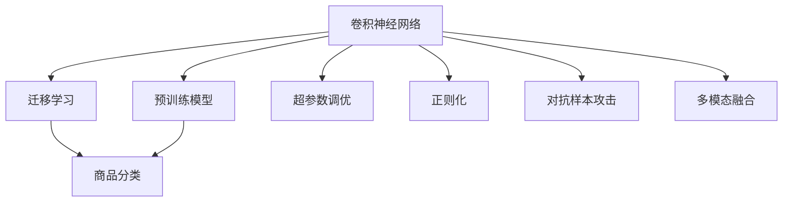

                 

# 深度学习在商品图像识别与分类中的应用

> 关键词：深度学习,商品图像识别,图像分类,卷积神经网络,迁移学习,预训练模型,商品分类

## 1. 背景介绍

### 1.1 问题由来
在现代零售和电子商务领域，商品图像识别与分类技术已成为提升用户体验、优化库存管理和自动化流程的关键工具。通过深度学习技术，可以从庞大的商品图片库中快速高效地进行分类和检索，为消费者提供更精准的推荐，同时也为商家带来了显著的运营效率提升。然而，商品图片种类繁多，且同一类别商品在图片上可能有着显著的外观差异，传统的手工特征提取方法往往难以捕捉这些复杂性，导致准确率较低。深度学习，尤其是卷积神经网络(Convolutional Neural Networks, CNNs)，为商品图像识别与分类提供了新的可能。

### 1.2 问题核心关键点
商品图像识别与分类问题主要包括以下几个关键点：
- 数据集构建：需要大规模标注的商品图片数据集，用于训练和测试深度学习模型。
- 模型选择与优化：选择合适的深度学习模型结构，并通过超参数调优和正则化技术来提高模型泛化能力。
- 迁移学习：利用预训练模型在更广泛的视觉任务上获得的知识，进行迁移学习，在商品图像分类上取得更好的效果。
- 多模态融合：将商品图片与商品描述等其他模态的信息结合，提升分类准确率。
- 对抗样本识别：设计抗对抗样本攻击的模型，确保商品分类模型的鲁棒性。
- 实时性要求：保证模型在实时场景下的推理速度和响应效率。

这些问题点和核心概念构成了商品图像识别与分类的核心研究框架，本文将通过系统介绍深度学习在其中的应用，帮助读者了解如何在实际场景中高效地应用商品图像识别与分类技术。

## 2. 核心概念与联系

### 2.1 核心概念概述

为更好地理解深度学习在商品图像识别与分类中的应用，本节将介绍几个关键的概念：

- 卷积神经网络(Convolutional Neural Networks, CNNs)：一种专门用于处理图像、视频等二维数据的多层神经网络，通过卷积、池化等操作提取图像特征。
- 迁移学习(Transfer Learning)：将预训练模型在新任务上的知识迁移应用到目标任务上，减少标注数据的依赖，提高模型性能。
- 预训练模型(Pre-trained Model)：在大型数据集上预先训练好的深度学习模型，用于迁移学习的初始化。
- 超参数调优(Hyperparameter Tuning)：通过调整模型的学习率、批大小等超参数，优化模型性能。
- 正则化(Regularization)：通过L2正则、Dropout等技术防止模型过拟合，提高泛化能力。
- 对抗样本攻击(Adversarial Attacks)：攻击者通过在输入数据中添加微小扰动，使模型输出错误结果的技术。
- 多模态融合(Multi-modal Fusion)：将不同模态的信息结合，如图像与文本描述，以提升分类效果。

这些核心概念之间的逻辑关系可以通过以下Mermaid流程图来展示：



这个流程图展示了大语言模型的核心概念及其之间的关系：

1. 卷积神经网络通过卷积和池化操作提取图像特征。
2. 迁移学习通过利用预训练模型，在新任务上获得更好的效果。
3. 预训练模型通过大规模数据集进行训练，为迁移学习提供初始化。
4. 超参数调优通过调整学习率、批大小等参数优化模型。
5. 正则化技术防止模型过拟合，提高泛化能力。
6. 对抗样本攻击设计抗干扰模型，保证模型鲁棒性。
7. 多模态融合将不同模态的信息结合，提升分类效果。

这些概念共同构成了商品图像识别与分类的核心研究框架，使其能够有效地利用深度学习技术解决实际问题。

## 3. 核心算法原理 & 具体操作步骤
### 3.1 算法原理概述

深度学习在商品图像识别与分类中的应用，主要基于卷积神经网络(CNNs)。CNNs通过卷积层、池化层等结构，有效地从图像数据中提取特征，并结合全连接层进行分类。以下是一个典型的CNNs模型结构：

```
Input Layer --> Convolution Layer --> ReLU Layer --> Pooling Layer --> Fully Connected Layer --> Softmax Layer
```

在训练过程中，通过反向传播算法更新模型参数，最小化损失函数，使模型能够准确分类商品图像。常用的损失函数包括交叉熵损失函数。

### 3.2 算法步骤详解

深度学习在商品图像识别与分类中的具体操作步骤如下：

**Step 1: 数据准备**
- 收集并预处理商品图片数据集，包括图像缩放、归一化、数据增强等。
- 准备商品分类标签，确保每个商品图片都有对应的分类标签。

**Step 2: 模型选择与优化**
- 选择适合的商品分类CNNs模型，如VGG、ResNet、Inception等。
- 进行超参数调优，包括学习率、批大小、正则化参数等，使用随机搜索或网格搜索等方法。
- 应用正则化技术，如L2正则、Dropout等，防止模型过拟合。

**Step 3: 训练模型**
- 将准备好的数据集划分为训练集、验证集和测试集。
- 使用反向传播算法更新模型参数，最小化交叉熵损失。
- 在验证集上评估模型性能，避免过拟合。
- 根据验证集性能调整超参数，重新训练模型。

**Step 4: 测试与部署**
- 在测试集上评估最终模型的性能。
- 将训练好的模型部署到实际应用中，进行商品分类预测。

### 3.3 算法优缺点

深度学习在商品图像识别与分类中的应用具有以下优点：
1. 高准确率：通过卷积和池化操作，可以高效地提取图像特征，提升分类准确率。
2. 鲁棒性：CNNs对图像噪声、旋转等变换具有一定的鲁棒性。
3. 泛化能力：迁移学习可以通过预训练模型，减少标注数据的依赖，提高模型泛化能力。
4. 多模态融合：结合商品图片与商品描述等多模态信息，进一步提升分类效果。

同时，该方法也存在一定的局限性：
1. 计算资源需求高：CNNs模型参数量大，需要高性能计算资源。
2. 标注数据依赖：虽然迁移学习可以降低对标注数据的依赖，但在部分领域仍然需要大量标注数据。
3. 对抗样本脆弱：CNNs模型对抗样本攻击较为脆弱，可能被恶意攻击导致分类错误。
4. 过拟合风险：在标注数据较少的情况下，CNNs模型容易过拟合。
5. 可解释性不足：深度学习模型通常难以解释其内部决策过程。

尽管存在这些局限性，但深度学习在商品图像识别与分类中的应用已经取得了显著成效，成为该领域的主流技术。

### 3.4 算法应用领域

深度学习在商品图像识别与分类中的应用，已经在多个行业得到了广泛的应用，例如：

- 电子商务：用于商品图片分类、推荐系统、自动搜索等，提升用户体验和运营效率。
- 零售商店：用于库存管理、货架优化、顾客行为分析等，提高运营决策的精准度。
- 农产品市场：用于果蔬分类、质量检测、价格评估等，提升商品质量和市场竞争力。
- 医疗领域：用于医学影像分类、病理诊断、疾病检测等，辅助医生诊断和治疗决策。

除了上述这些典型应用外，深度学习在商品图像识别与分类中的应用还在不断扩展，为各行各业带来了新的发展机遇。

## 4. 数学模型和公式 & 详细讲解 & 举例说明
### 4.1 数学模型构建

商品图像分类问题可以形式化为一个分类任务，记输入为 $\mathbf{x} \in \mathbb{R}^d$，其中 $d$ 为输入的维度（如图像的像素数），输出为 $\mathbf{y} \in \{1, 2, \ldots, K\}$，其中 $K$ 为商品类别的数量。假设模型为 $M_{\theta}(\mathbf{x})$，其中 $\theta$ 为模型参数。分类任务的目标是找到一个最优的 $\theta^*$，使得：

$$
\theta^* = \mathop{\arg\min}_{\theta} \mathcal{L}(M_{\theta}(\mathbf{x}), \mathbf{y})
$$

其中 $\mathcal{L}$ 为损失函数，常用的损失函数为交叉熵损失函数：

$$
\mathcal{L}(M_{\theta}(\mathbf{x}), \mathbf{y}) = -\sum_{i=1}^K y_i \log M_{\theta}(x_i)
$$

### 4.2 公式推导过程

以下我们将详细推导CNNs在商品图像分类中的数学模型和公式。

假设输入图像 $\mathbf{x}$ 经过卷积层和池化层后，得到特征表示 $\mathbf{f}$，然后通过全连接层和Softmax层输出分类概率 $\mathbf{p}$。模型的输出可以表示为：

$$
\mathbf{p} = \text{Softmax}(M_{\theta}(\mathbf{f})) = \frac{\exp(M_{\theta}(\mathbf{f}))}{\sum_{k=1}^K \exp(M_{\theta}(\mathbf{f}_k))}
$$

其中 $M_{\theta}(\mathbf{f})$ 表示模型在特征表示 $\mathbf{f}$ 上的输出，$M_{\theta}(\mathbf{f}_k)$ 表示模型在特征表示 $\mathbf{f}_k$ 上的输出。

将分类概率 $\mathbf{p}$ 与真实标签 $\mathbf{y}$ 进行交叉熵损失计算，得到损失函数：

$$
\mathcal{L} = -\sum_{i=1}^K y_i \log p_i
$$

### 4.3 案例分析与讲解

为了更好地理解深度学习在商品图像分类中的数学模型和公式，下面以一个简单的商品分类任务为例，进行详细讲解。

假设有一个包含200张商品的图像数据集，其中每个商品图像属于10个类别之一。我们使用VGG16模型进行商品分类，模型包含16个卷积层和3个全连接层，输出维度为10。在训练过程中，我们随机抽取100张图像作为训练集，另外100张作为验证集和测试集。

1. 数据预处理：
   - 对图像进行缩放，使其大小为224x224像素。
   - 对图像进行归一化，使其像素值在[0, 1]之间。
   - 对训练集进行数据增强，包括旋转、裁剪、翻转等操作。

2. 模型构建：
   - 加载预训练的VGG16模型，并随机初始化全连接层权重。
   - 将图像数据输入模型，通过卷积层和池化层提取特征表示 $\mathbf{f}$。
   - 将特征表示 $\mathbf{f}$ 输入全连接层和Softmax层，得到分类概率 $\mathbf{p}$。

3. 训练过程：
   - 使用交叉熵损失函数计算模型输出与真实标签之间的差距。
   - 使用随机梯度下降算法更新模型参数，最小化损失函数。
   - 在验证集上评估模型性能，防止过拟合。
   - 根据验证集性能调整超参数，重新训练模型。

4. 测试与部署：
   - 在测试集上评估最终模型的性能。
   - 将训练好的模型部署到实际应用中，进行商品分类预测。

这个例子展示了深度学习在商品图像分类中的基本流程和关键步骤，帮助读者更好地理解该技术的数学模型和公式。

## 5. 项目实践：代码实例和详细解释说明
### 5.1 开发环境搭建

在进行商品图像分类任务开发前，我们需要准备好开发环境。以下是使用Python进行Keras和TensorFlow开发的环境配置流程：

1. 安装Anaconda：从官网下载并安装Anaconda，用于创建独立的Python环境。

2. 创建并激活虚拟环境：
```bash
conda create -n pytorch-env python=3.8 
conda activate pytorch-env
```

3. 安装Keras和TensorFlow：从官网获取对应的安装命令。例如：
```bash
pip install keras tensorflow
```

4. 安装各类工具包：
```bash
pip install numpy pandas scikit-learn matplotlib tqdm jupyter notebook ipython
```

完成上述步骤后，即可在`pytorch-env`环境中开始商品图像分类任务的开发。

### 5.2 源代码详细实现

下面以商品分类任务为例，给出使用Keras进行深度学习模型训练和测试的Python代码实现。

```python
from keras.applications import VGG16
from keras.layers import Dense, Flatten, Dropout
from keras.models import Sequential
from keras.optimizers import Adam
from keras.preprocessing.image import ImageDataGenerator
from keras.utils import to_categorical

# 定义模型结构
model = Sequential([
    VGG16(weights='imagenet', include_top=False, input_shape=(224, 224, 3)),
    Flatten(),
    Dense(512, activation='relu'),
    Dropout(0.5),
    Dense(10, activation='softmax')
])

# 编译模型
model.compile(optimizer=Adam(lr=0.001), loss='categorical_crossentropy', metrics=['accuracy'])

# 数据增强
train_datagen = ImageDataGenerator(rescale=1./255, rotation_range=20, width_shift_range=0.2, height_shift_range=0.2, shear_range=0.2, zoom_range=0.2, horizontal_flip=True)
test_datagen = ImageDataGenerator(rescale=1./255)

# 加载数据集
train_generator = train_datagen.flow_from_directory('train', target_size=(224, 224), batch_size=32, class_mode='categorical')
test_generator = test_datagen.flow_from_directory('test', target_size=(224, 224), batch_size=32, class_mode='categorical')

# 训练模型
history = model.fit_generator(train_generator, steps_per_epoch=100, epochs=10, validation_data=test_generator, validation_steps=50)

# 评估模型
test_loss, test_acc = model.evaluate_generator(test_generator, steps=50)

# 保存模型
model.save('商品分类模型.h5')
```

### 5.3 代码解读与分析

让我们再详细解读一下关键代码的实现细节：

**模型定义**：
- 使用Keras中的VGG16模型作为卷积层，通过Flatten层将特征表示转换为全连接层的输入。
- 设计两个全连接层，其中第一个包含512个神经元，使用ReLU激活函数，第二个输出10个类别的概率。
- 使用Dropout层防止过拟合。

**数据增强**：
- 使用Keras中的ImageDataGenerator进行数据增强，包括旋转、裁剪、翻转等操作。
- 对训练集和测试集分别应用不同的数据增强策略，以保持数据的多样性。

**模型编译与训练**：
- 使用Adam优化器，学习率为0.001，交叉熵损失函数和准确率作为评估指标。
- 使用Keras的fit_generator方法进行模型训练，指定训练集和验证集的数据生成器，以及每个epoch的步数和训练次数。
- 在训练过程中，记录模型在验证集上的性能，防止过拟合。
- 根据验证集性能调整超参数，重新训练模型。

**模型评估与保存**：
- 使用evaluate_generator方法评估模型在测试集上的性能，输出损失和准确率。
- 保存训练好的模型，以便后续部署和推理。

## 6. 实际应用场景

### 6.1 智能货架管理

商品图像分类技术可以应用于智能货架管理系统中，通过实时捕捉商品图像，快速识别商品位置和状态，实现库存自动更新和补货。

在技术实现上，可以将智能摄像头与货架系统连接，实时拍摄货架上的商品图像，并使用商品分类模型对图像进行分类。当检测到某个商品缺失或异常时，系统会立即发出报警，并自动生成补货指令。这种系统可以大幅提升库存管理的自动化水平，减少人为错误。

### 6.2 线上商品推荐

基于商品图像分类技术，电子商务平台可以实现精准的商品推荐系统，提升用户购物体验。通过分析用户的浏览和购买历史，结合商品分类信息，推荐相关的商品，提高用户转化率。

在推荐算法中，可以使用商品分类模型对商品进行聚类和相似度计算，生成推荐列表。同时，可以结合商品描述、用户评价等多模态信息，提升推荐的准确性和多样性。

### 6.3 产品设计优化

在产品设计阶段，可以使用商品图像分类技术对设计方案进行快速筛选和评估，提升产品开发效率。通过分类模型对设计图进行分类，可以判断哪些设计方案符合用户需求和市场需求，避免无效设计。

在技术实现上，可以将设计图转换为图像数据，输入商品分类模型进行分类评估。分类结果可以帮助设计师快速调整设计方案，提升产品设计的质量。

### 6.4 未来应用展望

随着深度学习技术的不断发展，商品图像分类技术将在更多领域得到应用，为各行各业带来新的发展机遇。

在医疗领域，可以通过对医学影像进行分类和分析，辅助医生进行疾病诊断和治疗。在农业领域，可以对农产品的质量进行分类，提升农产品的市场价值。在智能家居领域，可以对家庭环境进行分类，提升用户体验。

此外，在智慧城市、智能交通、智能制造等众多领域，商品图像分类技术也将发挥重要作用，提升城市管理效率、交通运行安全、制造流程自动化等。

## 7. 工具和资源推荐
### 7.1 学习资源推荐

为了帮助开发者系统掌握商品图像分类技术，这里推荐一些优质的学习资源：

1. 《深度学习》课程（斯坦福大学）：由斯坦福大学开设的深度学习入门课程，详细讲解了深度学习的基本原理和经典模型。
2. TensorFlow官方文档：TensorFlow官方提供的详细文档和教程，帮助开发者快速上手。
3. Keras官方文档：Keras官方提供的详细文档和教程，介绍了Keras的基本用法和高级技巧。
4. 《Python深度学习》书籍：李沐等专家合著，系统介绍了深度学习在图像分类、目标检测等领域的实现方法。
5. Arxiv论文库：收集了深度学习领域的最新研究成果，是学习前沿技术的宝贵资源。

通过对这些资源的学习实践，相信你一定能够快速掌握商品图像分类技术的精髓，并用于解决实际的图像识别与分类问题。

### 7.2 开发工具推荐

高效的开发离不开优秀的工具支持。以下是几款用于深度学习开发和部署的工具：

1. TensorFlow：由Google主导开发的深度学习框架，生产部署方便，适合大规模工程应用。
2. Keras：基于TensorFlow等深度学习框架的高级API，提供了简单易用的接口，适合快速迭代研究。
3. PyTorch：由Facebook开发的深度学习框架，灵活动态的计算图，适合快速迭代研究。
4. TensorBoard：TensorFlow配套的可视化工具，实时监测模型训练状态，提供丰富的图表呈现方式。
5. Weights & Biases：模型训练的实验跟踪工具，记录和可视化模型训练过程中的各项指标，方便对比和调优。

合理利用这些工具，可以显著提升深度学习模型的开发效率，加快创新迭代的步伐。

### 7.3 相关论文推荐

深度学习在商品图像分类中的应用，已经得到了广泛的研究。以下是几篇奠基性的相关论文，推荐阅读：

1. Very Deep Convolutional Networks for Large-Scale Image Recognition（ImageNet paper）：提出了VGG模型，为卷积神经网络在图像分类中的广泛应用奠定了基础。
2. ResNet: Deep Residual Learning for Image Recognition（ResNet paper）：提出了ResNet模型，通过残差连接解决了深度神经网络中的梯度消失问题，显著提升了网络深度。
3. Inception: GoogLeNet（Inception paper）：提出了Inception模型，通过并行结构增加了模型表达能力。
4. Batch Normalization: Accelerating Deep Network Training by Reducing Internal Covariate Shift（Batch Normalization paper）：提出了Batch Normalization技术，提高了深度神经网络的训练速度和收敛能力。

这些论文代表了大语言模型微调技术的发展脉络。通过学习这些前沿成果，可以帮助研究者把握学科前进方向，激发更多的创新灵感。

## 8. 总结：未来发展趋势与挑战

### 8.1 研究成果总结

本文对深度学习在商品图像分类中的应用进行了全面系统的介绍。首先阐述了商品图像分类问题的核心关键点和研究背景，明确了深度学习在该领域的独特价值。其次，从原理到实践，详细讲解了深度学习模型的构建和训练过程，提供了完整代码实例。同时，本文还广泛探讨了深度学习在商品图像分类中的应用前景，展示了其在智能货架管理、线上商品推荐、产品设计优化等多个领域的应用潜力。此外，本文精选了深度学习相关的学习资源和开发工具，力求为读者提供全方位的技术指引。

通过本文的系统梳理，可以看到，深度学习在商品图像分类中的应用已经取得了显著成效，成为该领域的主流技术。未来，伴随深度学习技术的不断发展，商品图像分类技术将进一步拓展其应用边界，提升各行各业的智能化水平。

### 8.2 未来发展趋势

展望未来，深度学习在商品图像分类中的应用将呈现以下几个发展趋势：

1. 模型规模持续增大。随着算力成本的下降和数据规模的扩张，深度学习模型的参数量还将持续增长。超大规模模型蕴含的丰富特征表示，将进一步提升分类效果。
2. 模型鲁棒性增强。深度学习模型将进一步引入对抗样本攻击等鲁棒性增强技术，确保模型在实际应用中的稳定性和可靠性。
3. 多模态融合深入。深度学习模型将结合商品图片、商品描述、消费者评价等多种模态信息，进一步提升分类准确率。
4. 实时性要求提升。深度学习模型将进一步优化计算图，引入模型剪枝、量化加速等技术，提升模型在实时场景下的推理速度和响应效率。
5. 模型可解释性增强。深度学习模型将引入可解释性技术，帮助用户理解模型的决策过程和内部机制。
6. 数据标注成本降低。深度学习模型将进一步引入无监督学习、半监督学习等技术，减少对标注数据的依赖。

这些趋势凸显了深度学习在商品图像分类领域的广阔前景。这些方向的探索发展，必将进一步提升深度学习模型的性能和应用范围，为各行各业带来新的发展机遇。

### 8.3 面临的挑战

尽管深度学习在商品图像分类领域已经取得了显著成效，但在迈向更加智能化、普适化应用的过程中，它仍面临着诸多挑战：

1. 标注成本瓶颈。深度学习模型需要大量标注数据进行训练，但标注数据获取成本较高，尤其是在部分领域。如何进一步降低标注成本，将是一大难题。
2. 模型鲁棒性不足。深度学习模型面临对抗样本攻击时，泛化性能往往大打折扣。如何提高模型的鲁棒性，避免灾难性遗忘，还需要更多理论和实践的积累。
3. 计算资源需求高。深度学习模型参数量大，需要高性能计算资源。如何在保证模型性能的同时，优化资源消耗，是一个重要的优化方向。
4. 模型可解释性不足。深度学习模型通常难以解释其内部决策过程，这对高风险应用尤为重要。如何赋予模型更强的可解释性，将是亟待攻克的难题。
5. 数据标注成本高。尽管迁移学习可以降低对标注数据的依赖，但在部分领域仍然需要大量标注数据。如何减少标注成本，是一个重要的研究方向。
6. 计算资源需求高。深度学习模型参数量大，需要高性能计算资源。如何在保证模型性能的同时，优化资源消耗，是一个重要的优化方向。

尽管存在这些挑战，但深度学习在商品图像分类领域的应用前景广阔。相信通过学界和产业界的共同努力，这些挑战终将一一被克服，深度学习将进一步拓展其应用边界，提升各行各业的智能化水平。

### 8.4 研究展望

面对深度学习在商品图像分类领域所面临的挑战，未来的研究需要在以下几个方面寻求新的突破：

1. 探索无监督和半监督学习。摆脱对大规模标注数据的依赖，利用自监督学习、主动学习等无监督和半监督范式，最大限度利用非结构化数据，实现更加灵活高效的分类。
2. 研究参数高效和计算高效的模型。开发更加参数高效的模型结构，在固定大部分预训练参数的同时，只更新极少量的任务相关参数。同时优化计算图，减少前向传播和反向传播的资源消耗，实现更加轻量级、实时性的部署。
3. 引入因果和对比学习范式。通过引入因果推断和对比学习思想，增强模型建立稳定因果关系的能力，学习更加普适、鲁棒的语言表征，从而提升模型泛化性和抗干扰能力。
4. 引入更多先验知识。将符号化的先验知识，如知识图谱、逻辑规则等，与神经网络模型进行巧妙融合，引导分类过程学习更准确、合理的特征表示。同时加强不同模态数据的整合，实现视觉、语音等多模态信息与文本信息的协同建模。
5. 引入可解释性技术。引入可解释性技术，帮助用户理解模型的决策过程和内部机制，确保模型的透明性和可信度。
6. 引入鲁棒性增强技术。引入鲁棒性增强技术，设计抗干扰模型，保证模型在实际应用中的稳定性和可靠性。

这些研究方向将引领深度学习在商品图像分类领域迈向更高的台阶，为构建更加智能、可控、可靠的系统铺平道路。面向未来，深度学习需要与其他人工智能技术进行更深入的融合，如知识表示、因果推理、强化学习等，多路径协同发力，共同推动商品图像分类技术的进步。只有勇于创新、敢于突破，才能不断拓展深度学习模型的边界，让智能技术更好地造福人类社会。

## 9. 附录：常见问题与解答

**Q1: 深度学习在商品图像分类中是否适用于所有商品类别？**

A: 深度学习在商品图像分类中的应用对商品类别没有限制，但需要根据商品类别特性进行模型设计。例如，对于纹理复杂、形状多变的商品类别，可能需要使用更复杂的模型结构和更多的训练数据。

**Q2: 深度学习模型是否容易过拟合？**

A: 深度学习模型在训练过程中容易过拟合，特别是在训练数据不足的情况下。为了防止过拟合，可以使用正则化技术、数据增强等方法。此外，还可以通过迁移学习、参数高效微调等方法，进一步提高模型的泛化能力。

**Q3: 深度学习模型如何提高实时性？**

A: 提高深度学习模型的实时性需要优化计算图，使用模型剪枝、量化加速等技术，减少模型推理的计算量和内存占用。同时，可以在服务器端对模型进行优化部署，提高推理速度和响应效率。

**Q4: 深度学习模型如何提高可解释性？**

A: 提高深度学习模型的可解释性需要引入可解释性技术，如LIME、SHAP等。这些技术可以解释模型的决策过程和内部机制，帮助用户理解模型的输出。同时，可以在模型设计和训练过程中引入更多先验知识，如领域规则、知识图谱等，提升模型的可解释性。

**Q5: 深度学习模型如何应对对抗样本攻击？**

A: 应对对抗样本攻击需要引入鲁棒性增强技术，如对抗训练、模型剪枝等。这些技术可以提高模型的鲁棒性，减少对抗样本攻击对分类结果的影响。同时，可以引入对抗样本检测技术，提前发现并过滤攻击样本，确保模型的安全性。

这些问题的解答展示了深度学习在商品图像分类中可能遇到的实际问题及其解决方案，帮助读者更好地理解该技术的应用前景和挑战。

---

作者：禅与计算机程序设计艺术 / Zen and the Art of Computer Programming

