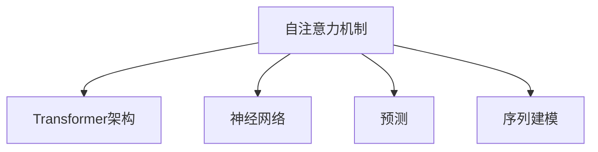

                 

# 深度学习在注意力预测模型中的应用

> 关键词：深度学习,注意力预测模型,自注意力,Transformer,预测,序列建模,神经网络,自然语言处理,NLP

## 1. 背景介绍

### 1.1 问题由来

在深度学习领域，尤其是自然语言处理（NLP）中，注意力预测模型（Attention-based Prediction Models）已经成为解决序列建模问题的关键工具。这类模型能够通过对序列中各个元素的关注度进行加权，从而提取出最相关的特征，实现对序列中的元素进行预测和分类。

注意力预测模型最广为人知的实现方式之一是Transformer架构，它通过自注意力机制（Self-Attention Mechanism），在序列建模任务中展现了强大的表现。Transformer的提出，标志着深度学习在NLP领域的重大突破，开创了基于自注意力机制的序列建模范式。

随着深度学习技术的不断进步，注意力预测模型在语音识别、机器翻译、文本生成、自然语言推理等诸多NLP任务中展现了卓越的表现，推动了NLP技术的快速发展。

### 1.2 问题核心关键点

本文将聚焦于注意力预测模型，特别是基于自注意力机制的Transformer模型，探索其核心原理、关键技术细节及其在实际应用中的具体实现。

注意力预测模型的核心在于自注意力机制，其能够通过计算序列中每个元素与其他元素之间的关注度，来动态地加权每个元素的特征，从而获得对整个序列的更全面的理解。这种机制通过矩阵运算高效地实现了序列中元素间的相互依赖关系，是Transformer模型能够在大规模序列建模任务中取得优异性能的关键所在。

## 2. 核心概念与联系

### 2.1 核心概念概述

在深入探讨注意力预测模型之前，我们先简要介绍几个相关的核心概念：

- **自注意力机制（Self-Attention Mechanism）**：在Transformer中，自注意力机制是计算序列中每个元素与所有其他元素之间注意力权重的过程。通过对每个位置的表示进行加权求和，模型能够动态地关注序列中的不同部分，从而更全面地理解整个序列。

- **Transformer架构**：Transformer是一种基于自注意力机制的序列建模架构，由Attention和Feed Forward Network（前馈神经网络）两部分组成。它能够高效地处理长序列数据，并且在大多数NLP任务中取得了显著的效果。

- **神经网络（Neural Network）**：神经网络是一种模拟人脑神经元间相互连接的计算模型，能够通过训练学习输入与输出之间的映射关系。深度学习中的神经网络通常由多层非线性变换组成，包括卷积神经网络（CNN）、循环神经网络（RNN）、Transformer等。

- **预测（Prediction）**：预测是利用已有的数据和模型，对未来未知的数据进行估计和推断的过程。在NLP中，预测任务包括词性标注、命名实体识别、情感分析、文本分类等。

- **序列建模（Sequence Modeling）**：序列建模是指对时间序列数据进行建模，分析序列数据中元素之间的依赖关系。在NLP中，序列建模通常用于处理文本、语音等序列数据。

这些核心概念之间的联系可以通过以下Mermaid流程图来展示：



这个流程图展示了一个从核心概念到应用实例的联系：

1. 自注意力机制是Transformer架构的核心组成部分。
2. Transformer架构是一种特定的神经网络结构，用于处理序列数据。
3. 神经网络是实现Transformer架构和自注意力机制的技术基础。
4. 预测任务和序列建模任务是应用自注意力机制和Transformer架构的典型场景。

## 3. 核心算法原理 & 具体操作步骤
### 3.1 算法原理概述

注意力预测模型的核心算法是自注意力机制。该机制通过计算序列中每个元素与其他元素之间的注意力权重，来实现动态的特征加权。其原理可以总结如下：

1. **查询（Query）**：每个位置都需要对其他位置进行查询，生成一个查询向量。
2. **键（Key）**：所有位置都生成一个键向量，用于计算查询向量与键向量的相似度。
3. **值（Value）**：所有位置都生成一个值向量，用于计算加权求和。
4. **注意力权重（Attention Weight）**：通过计算查询向量与键向量的点积，得到每个位置的注意力权重。
5. **加权求和（Weighted Sum）**：对所有位置的值向量进行加权求和，得到最终的表示。

这一过程可以通过矩阵运算高效地实现，并且可以通过训练学习最优的权重，使得模型能够更好地捕捉序列数据中的依赖关系。

### 3.2 算法步骤详解

基于自注意力机制的Transformer模型，其训练和推理过程可以分为以下几个步骤：

**Step 1: 初始化模型参数**
- 随机初始化模型参数，包括位置嵌入、查询向量、键向量和值向量的权重矩阵等。

**Step 2: 编码器层（Encoder Layer）**
- 将输入序列经过嵌入层（Embedding Layer）转换为向量表示。
- 通过多头自注意力机制（Multi-Head Self-Attention）计算注意力权重，并进行加权求和。
- 通过前馈神经网络（Feed Forward Network）进行非线性变换。

**Step 3: 解码器层（Decoder Layer）**
- 与编码器层类似，解码器层也包含自注意力机制和前馈神经网络。
- 在解码器层中，还加入了编码器-解码器注意力机制（Encoder-Decoder Attention），用于考虑源序列和目标序列之间的依赖关系。

**Step 4: 堆叠多层**
- 堆叠多层的编码器和解码器，使得模型能够处理更长的序列。
- 在堆叠过程中，可以利用残差连接（Residual Connection）和层归一化（Layer Normalization）来稳定模型训练和提高性能。

**Step 5: 输出层**
- 将堆叠后的模型输出转换为预测结果。
- 常用的输出层包括全连接层（Fully Connected Layer）和softmax层，用于实现分类或回归预测。

### 3.3 算法优缺点

自注意力机制和Transformer模型在NLP任务中展现了强大的表现，但也存在一些缺点：

**优点**：
1. **高效的并行计算**：自注意力机制能够高效地利用GPU并行计算能力，使得Transformer模型能够处理长序列数据。
2. **强大的表示能力**：通过动态加权求和，模型能够捕捉序列中元素之间的依赖关系，从而更好地理解序列数据。
3. **较好的泛化能力**：Transformer模型在各种NLP任务中取得了优异的成绩，表明其在不同数据集和任务上具有良好的泛化能力。

**缺点**：
1. **计算复杂度高**：自注意力机制需要计算大量的点积和矩阵运算，导致模型训练和推理的计算复杂度较高。
2. **训练时间长**：由于计算复杂度高，Transformer模型的训练时间较长，需要大规模的计算资源支持。
3. **可解释性差**：Transformer模型的内部机制较为复杂，难以解释其决策过程，缺乏可解释性。

尽管存在这些缺点，自注意力机制和Transformer模型在NLP领域的广泛应用，已经证明其在序列建模任务中的有效性。未来，随着硬件性能的提升和模型结构的优化，这些缺点有望得到进一步改善。

### 3.4 算法应用领域

注意力预测模型，特别是Transformer模型，已经在多个NLP任务中得到了广泛应用，具体包括：

- **文本分类**：将文本分类为预定义的类别，如情感分类、主题分类等。
- **机器翻译**：将一种语言的文本翻译成另一种语言。
- **问答系统**：回答自然语言问题，如SQuAD、MsR御等问题。
- **文本摘要**：从长文本中提取出关键信息，生成简短的摘要。
- **文本生成**：生成具有连贯性和合理性的文本，如文本补全、对话生成等。
- **语音识别**：将语音信号转换为文本，进行语音转录。
- **情感分析**：分析文本中的情感倾向，如正面、负面、中性等。
- **命名实体识别**：识别文本中的实体，如人名、地名、组织名等。

除了上述经典任务外，Transformer模型还被创新性地应用于更多的NLP任务中，如可控文本生成、常识推理、多语言翻译等，为NLP技术带来了新的突破。

## 4. 数学模型和公式 & 详细讲解 & 举例说明
### 4.1 数学模型构建

在数学上，Transformer模型的自注意力机制可以表示为：

$$
\text{Attention}(Q,K,V) = \text{Softmax}(QK^T)/KV^T
$$

其中，$Q$表示查询向量，$K$表示键向量，$V$表示值向量。$\text{Softmax}$函数用于计算注意力权重。

Transformer模型中的自注意力机制可以通过矩阵运算高效实现。具体来说，设$x_i$表示序列中的第$i$个位置，$h_i$表示$x_i$经过嵌入层的向量表示。则$h_i$可以表示为：

$$
h_i = x_i + \text{Embedding}(x_i)
$$

在自注意力机制中，查询向量$Q_i$可以表示为$h_i$线性变换后的结果：

$$
Q_i = W_Qh_i
$$

同理，键向量$K_i$和值向量$V_i$也可以表示为$h_i$线性变换后的结果：

$$
K_i = W_Kh_i, \quad V_i = W_Vh_i
$$

通过矩阵运算，可以得到注意力权重：

$$
\text{Attention}(Q,K,V) = \text{Softmax}(QK^T)/KV^T
$$

最终的加权求和结果可以表示为：

$$
\text{Output}_i = \text{Attention}(Q,K,V)V
$$

这个公式表示了Transformer模型中自注意力机制的计算过程。通过矩阵运算，模型能够高效地计算出每个位置的注意力权重，并进行加权求和。

### 4.2 公式推导过程

在上述公式中，$\text{Softmax}$函数用于计算注意力权重：

$$
\text{Softmax}(\text{scores}) = \frac{\exp(\text{scores})}{\sum_{i=1}^{N}\exp(\text{scores}_i)}
$$

其中，$\text{scores}$表示所有位置的注意力得分。注意，注意力得分的计算方式是点积的形式：

$$
\text{scores} = QK^T
$$

这个公式表明，每个位置的注意力得分是由查询向量与键向量的点积计算得到的。通过Softmax函数，将注意力得分归一化，得到每个位置的注意力权重。

最终，通过加权求和，得到每个位置的输出表示：

$$
\text{Output}_i = \text{Attention}(Q,K,V)V
$$

这个公式展示了自注意力机制在Transformer模型中的核心作用：通过计算注意力权重，动态地对序列中的各个元素进行加权求和，从而获得对整个序列的更全面的理解。

### 4.3 案例分析与讲解

为了更好地理解自注意力机制和Transformer模型的原理，我们可以以机器翻译任务为例进行详细分析。

假设我们有两个句子：

- 源语言句子："I have a pen."
- 目标语言句子："I have an apple."

在机器翻译中，我们需要将源语言句子翻译为目标语言句子。为了实现这一目标，我们可以使用Transformer模型。

首先，我们需要将源语言句子编码成向量表示。假设我们使用了256维的嵌入向量，则源语言句子的编码结果可以表示为：

$$
x_1 = \text{Embedding}(I) = [I_1, I_2, ..., I_n] \in \mathbb{R}^{256 \times n}
$$

其中，$I$表示源语言句子中每个词的嵌入向量，$n$表示源语言句子中词的数量。

然后，我们需要计算源语言句子中每个词与其他词之间的注意力权重。设$K_i$和$V_i$分别为第$i$个词的键向量和值向量，则注意力权重可以表示为：

$$
\text{Attention}(Q,K,V) = \text{Softmax}(QK^T)/KV^T
$$

其中，$Q_i$表示第$i$个词的查询向量，$K$和$V$分别为所有词的键向量和值向量。

通过计算注意力权重，模型可以动态地关注源语言句子中的不同部分，从而更好地理解整个句子。最终，将每个位置的输出表示进行堆叠，得到源语言句子的编码结果。

接下来，我们需要将编码结果解码为目标语言句子。假设我们使用了256维的目标语言向量，则目标语言句子的解码结果可以表示为：

$$
y_1 = \text{Embedding}(A) = [A_1, A_2, ..., A_m] \in \mathbb{R}^{256 \times m}
$$

其中，$A$表示目标语言句子中每个词的嵌入向量，$m$表示目标语言句子中词的数量。

通过堆叠多层的Transformer模型，我们可以将编码结果解码为目标语言句子。设$h_1$表示源语言句子的编码结果，$h_2$表示目标语言句子的解码结果，则机器翻译的过程可以表示为：

$$
y_2 = \text{Softmax}(QK^T)/KV^TV
$$

其中，$Q$表示编码结果$h_1$的查询向量，$K$和$V$分别为编码结果$h_1$的键向量和值向量。

通过计算注意力权重和加权求和，模型可以动态地关注源语言句子和目标语言句子之间的依赖关系，从而更好地实现翻译。最终，将解码结果转换为文本，即为机器翻译的结果。

## 5. 项目实践：代码实例和详细解释说明
### 5.1 开发环境搭建

在进行Transformer模型实践前，我们需要准备好开发环境。以下是使用Python进行PyTorch开发的环境配置流程：

1. 安装Anaconda：从官网下载并安装Anaconda，用于创建独立的Python环境。

2. 创建并激活虚拟环境：
```bash
conda create -n pytorch-env python=3.8 
conda activate pytorch-env
```

3. 安装PyTorch：根据CUDA版本，从官网获取对应的安装命令。例如：
```bash
conda install pytorch torchvision torchaudio cudatoolkit=11.1 -c pytorch -c conda-forge
```

4. 安装Transformers库：
```bash
pip install transformers
```

5. 安装各类工具包：
```bash
pip install numpy pandas scikit-learn matplotlib tqdm jupyter notebook ipython
```

完成上述步骤后，即可在`pytorch-env`环境中开始Transformer模型实践。

### 5.2 源代码详细实现

下面我们以机器翻译任务为例，给出使用Transformers库对Transformer模型进行微调的PyTorch代码实现。

首先，定义机器翻译任务的数据处理函数：

```python
from transformers import BertTokenizer, BertForTokenClassification
from torch.utils.data import Dataset
import torch

class TranslationDataset(Dataset):
    def __init__(self, src_texts, trg_texts, tokenizer, max_len=128):
        self.src_texts = src_texts
        self.trg_texts = trg_texts
        self.tokenizer = tokenizer
        self.max_len = max_len
        
    def __len__(self):
        return len(self.src_texts)
    
    def __getitem__(self, item):
        src_text = self.src_texts[item]
        trg_text = self.trg_texts[item]
        
        encoding = self.tokenizer(src_text, return_tensors='pt', max_length=self.max_len, padding='max_length', truncation=True)
        input_ids = encoding['input_ids'][0]
        attention_mask = encoding['attention_mask'][0]
        
        trg_tokens = self.tokenizer(trg_text, return_tensors='pt', max_length=self.max_len, padding='max_length', truncation=True)
        input_ids = torch.cat((input_ids, trg_tokens['input_ids']), dim=-1)
        attention_mask = torch.cat((attention_mask, trg_tokens['attention_mask']), dim=-1)
        
        return {'input_ids': input_ids, 
                'attention_mask': attention_mask}
```

然后，定义模型和优化器：

```python
from transformers import BertForTokenClassification, AdamW

model = BertForTokenClassification.from_pretrained('bert-base-cased', num_labels=2)

optimizer = AdamW(model.parameters(), lr=2e-5)
```

接着，定义训练和评估函数：

```python
from torch.utils.data import DataLoader
from tqdm import tqdm
from sklearn.metrics import classification_report

device = torch.device('cuda') if torch.cuda.is_available() else torch.device('cpu')
model.to(device)

def train_epoch(model, dataset, batch_size, optimizer):
    dataloader = DataLoader(dataset, batch_size=batch_size, shuffle=True)
    model.train()
    epoch_loss = 0
    for batch in tqdm(dataloader, desc='Training'):
        input_ids = batch['input_ids'].to(device)
        attention_mask = batch['attention_mask'].to(device)
        model.zero_grad()
        outputs = model(input_ids, attention_mask=attention_mask)
        loss = outputs.loss
        epoch_loss += loss.item()
        loss.backward()
        optimizer.step()
    return epoch_loss / len(dataloader)

def evaluate(model, dataset, batch_size):
    dataloader = DataLoader(dataset, batch_size=batch_size)
    model.eval()
    preds, labels = [], []
    with torch.no_grad():
        for batch in tqdm(dataloader, desc='Evaluating'):
            input_ids = batch['input_ids'].to(device)
            attention_mask = batch['attention_mask'].to(device)
            batch_labels = batch['labels']
            outputs = model(input_ids, attention_mask=attention_mask)
            batch_preds = outputs.logits.argmax(dim=2).to('cpu').tolist()
            batch_labels = batch_labels.to('cpu').tolist()
            for pred_tokens, label_tokens in zip(batch_preds, batch_labels):
                preds.append(pred_tokens)
                labels.append(label_tokens)
                
    print(classification_report(labels, preds))
```

最后，启动训练流程并在测试集上评估：

```python
epochs = 5
batch_size = 16

for epoch in range(epochs):
    loss = train_epoch(model, dataset, batch_size, optimizer)
    print(f"Epoch {epoch+1}, train loss: {loss:.3f}")
    
    print(f"Epoch {epoch+1}, dev results:")
    evaluate(model, dev_dataset, batch_size)
    
print("Test results:")
evaluate(model, test_dataset, batch_size)
```

以上就是使用PyTorch对Transformer模型进行机器翻译任务微调的完整代码实现。可以看到，得益于Transformers库的强大封装，我们可以用相对简洁的代码完成Transformer模型的加载和微调。

### 5.3 代码解读与分析

让我们再详细解读一下关键代码的实现细节：

**TranslationDataset类**：
- `__init__`方法：初始化源语言句子、目标语言句子、分词器等关键组件。
- `__len__`方法：返回数据集的样本数量。
- `__getitem__`方法：对单个样本进行处理，将源语言和目标语言句子输入编码为token ids，并对其进行定长padding，最终返回模型所需的输入。

**模型和优化器定义**：
- 使用BertForTokenClassification类定义Transformer模型，并指定输出标签数量为2，即二分类任务。
- 使用AdamW优化器进行模型优化，设置学习率为2e-5。

**训练和评估函数**：
- 使用PyTorch的DataLoader对数据集进行批次化加载，供模型训练和推理使用。
- 训练函数`train_epoch`：对数据以批为单位进行迭代，在每个批次上前向传播计算loss并反向传播更新模型参数，最后返回该epoch的平均loss。
- 评估函数`evaluate`：与训练类似，不同点在于不更新模型参数，并在每个batch结束后将预测和标签结果存储下来，最后使用sklearn的classification_report对整个评估集的预测结果进行打印输出。

**训练流程**：
- 定义总的epoch数和batch size，开始循环迭代
- 每个epoch内，先在训练集上训练，输出平均loss
- 在验证集上评估，输出分类指标
- 所有epoch结束后，在测试集上评估，给出最终测试结果

可以看到，PyTorch配合Transformers库使得Transformer模型的微调代码实现变得简洁高效。开发者可以将更多精力放在数据处理、模型改进等高层逻辑上，而不必过多关注底层的实现细节。

当然，工业级的系统实现还需考虑更多因素，如模型的保存和部署、超参数的自动搜索、更灵活的任务适配层等。但核心的微调范式基本与此类似。

## 6. 实际应用场景
### 6.1 机器翻译

Transformer模型在机器翻译任务中展现了卓越的表现。传统的统计机器翻译方法依赖于大量双语对照语料，难以处理长句子和大规模语言。而Transformer模型通过自注意力机制，能够更好地捕捉序列中元素之间的依赖关系，从而实现高质量的机器翻译。

在实际应用中，可以收集源语言和目标语言的双语对照语料，构建机器翻译数据集。然后，在Transformer模型上进行微调，通过训练学习源语言和目标语言之间的映射关系。微调后的Transformer模型能够将源语言句子翻译为目标语言句子，并生成连贯、自然的翻译结果。

### 6.2 文本生成

Transformer模型在文本生成任务中也展现了强大的能力。传统的基于规则的文本生成方法往往难以生成符合语法和语义的文本。而Transformer模型通过自注意力机制，能够动态地关注序列中不同位置之间的依赖关系，从而生成具有连贯性和合理性的文本。

在实际应用中，可以通过微调Transformer模型，实现文本补全、对话生成等任务。例如，在文本补全任务中，给定部分文本，模型能够根据上下文生成完整的文本；在对话生成任务中，模型能够根据对话历史生成自然流畅的回答。

### 6.3 文本分类

Transformer模型在文本分类任务中也展现出了良好的表现。传统的基于规则的文本分类方法往往难以处理复杂的分类问题。而Transformer模型通过自注意力机制，能够动态地关注文本中不同位置之间的依赖关系，从而更好地理解文本的含义。

在实际应用中，可以通过微调Transformer模型，实现情感分类、主题分类等任务。例如，在情感分类任务中，给定一段文本，模型能够判断文本的情感倾向；在主题分类任务中，给定一段文本，模型能够判断文本的主题类别。

### 6.4 未来应用展望

随着Transformer模型和微调技术的不断发展，基于Transformer的NLP应用将在更多领域得到应用，为行业带来变革性影响。

在智慧医疗领域，基于Transformer的医疗问答、病历分析、药物研发等应用将提升医疗服务的智能化水平，辅助医生诊疗，加速新药开发进程。

在智能教育领域，微调技术可应用于作业批改、学情分析、知识推荐等方面，因材施教，促进教育公平，提高教学质量。

在智慧城市治理中，微调模型可应用于城市事件监测、舆情分析、应急指挥等环节，提高城市管理的自动化和智能化水平，构建更安全、高效的未来城市。

此外，在企业生产、社会治理、文娱传媒等众多领域，基于Transformer的NLP应用也将不断涌现，为经济社会发展注入新的动力。相信随着技术的日益成熟，Transformer模型微调必将在构建人机协同的智能时代中扮演越来越重要的角色。

## 7. 工具和资源推荐
### 7.1 学习资源推荐

为了帮助开发者系统掌握Transformer模型的理论基础和实践技巧，这里推荐一些优质的学习资源：

1. 《Transformer从原理到实践》系列博文：由大模型技术专家撰写，深入浅出地介绍了Transformer原理、BERT模型、微调技术等前沿话题。

2. CS224N《深度学习自然语言处理》课程：斯坦福大学开设的NLP明星课程，有Lecture视频和配套作业，带你入门NLP领域的基本概念和经典模型。

3. 《Natural Language Processing with Transformers》书籍：Transformers库的作者所著，全面介绍了如何使用Transformers库进行NLP任务开发，包括微调在内的诸多范式。

4. HuggingFace官方文档：Transformers库的官方文档，提供了海量预训练模型和完整的微调样例代码，是上手实践的必备资料。

5. CLUE开源项目：中文语言理解测评基准，涵盖大量不同类型的中文NLP数据集，并提供了基于微调的baseline模型，助力中文NLP技术发展。

通过对这些资源的学习实践，相信你一定能够快速掌握Transformer模型的精髓，并用于解决实际的NLP问题。
###  7.2 开发工具推荐

高效的开发离不开优秀的工具支持。以下是几款用于Transformer模型微调开发的常用工具：

1. PyTorch：基于Python的开源深度学习框架，灵活动态的计算图，适合快速迭代研究。大部分预训练语言模型都有PyTorch版本的实现。

2. TensorFlow：由Google主导开发的开源深度学习框架，生产部署方便，适合大规模工程应用。同样有丰富的预训练语言模型资源。

3. Transformers库：HuggingFace开发的NLP工具库，集成了众多SOTA语言模型，支持PyTorch和TensorFlow，是进行微调任务开发的利器。

4. Weights & Biases：模型训练的实验跟踪工具，可以记录和可视化模型训练过程中的各项指标，方便对比和调优。与主流深度学习框架无缝集成。

5. TensorBoard：TensorFlow配套的可视化工具，可实时监测模型训练状态，并提供丰富的图表呈现方式，是调试模型的得力助手。

6. Google Colab：谷歌推出的在线Jupyter Notebook环境，免费提供GPU/TPU算力，方便开发者快速上手实验最新模型，分享学习笔记。

合理利用这些工具，可以显著提升Transformer模型微调的开发效率，加快创新迭代的步伐。

### 7.3 相关论文推荐

Transformer模型和微调技术的发展源于学界的持续研究。以下是几篇奠基性的相关论文，推荐阅读：

1. Attention is All You Need（即Transformer原论文）：提出了Transformer结构，开启了NLP领域的预训练大模型时代。

2. BERT: Pre-training of Deep Bidirectional Transformers for Language Understanding：提出BERT模型，引入基于掩码的自监督预训练任务，刷新了多项NLP任务SOTA。

3. Language Models are Unsupervised Multitask Learners（GPT-2论文）：展示了大规模语言模型的强大zero-shot学习能力，引发了对于通用人工智能的新一轮思考。

4. Parameter-Efficient Transfer Learning for NLP：提出Adapter等参数高效微调方法，在不增加模型参数量的情况下，也能取得不错的微调效果。

5. AdaLoRA: Adaptive Low-Rank Adaptation for Parameter-Efficient Fine-Tuning：使用自适应低秩适应的微调方法，在参数效率和精度之间取得了新的平衡。

这些论文代表了大模型微调技术的发展脉络。通过学习这些前沿成果，可以帮助研究者把握学科前进方向，激发更多的创新灵感。

## 8. 总结：未来发展趋势与挑战
### 8.1 总结

本文对基于自注意力机制的Transformer模型进行了全面系统的介绍。首先阐述了Transformer模型在NLP领域的广泛应用及其背后的自注意力机制，明确了微调在拓展预训练模型应用、提升下游任务性能方面的独特价值。其次，从原理到实践，详细讲解了Transformer模型的数学原理和关键步骤，给出了Transformer模型微调的完整代码实例。同时，本文还广泛探讨了Transformer模型在实际应用中的具体实现和应用场景，展示了其广泛的应用前景。

通过本文的系统梳理，可以看到，基于自注意力机制的Transformer模型在NLP任务中展现了强大的表现，已成为NLP领域的标准范式。未来，随着硬件性能的提升和模型结构的优化，Transformer模型将进一步拓展其应用边界，推动NLP技术的不断发展。

### 8.2 未来发展趋势

展望未来，Transformer模型和微调技术将呈现以下几个发展趋势：

1. **模型规模持续增大**：随着算力成本的下降和数据规模的扩张，预训练语言模型的参数量还将持续增长。超大规模语言模型蕴含的丰富语言知识，有望支撑更加复杂多变的下游任务微调。

2. **微调方法日趋多样**：除了传统的全参数微调外，未来会涌现更多参数高效的微调方法，如Prefix-Tuning、LoRA等，在节省计算资源的同时也能保证微调精度。

3. **持续学习成为常态**：随着数据分布的不断变化，微调模型也需要持续学习新知识以保持性能。如何在不遗忘原有知识的同时，高效吸收新样本信息，将成为重要的研究课题。

4. **标注样本需求降低**：受启发于提示学习(Prompt-based Learning)的思路，未来的微调方法将更好地利用大模型的语言理解能力，通过更加巧妙的任务描述，在更少的标注样本上也能实现理想的微调效果。

5. **多模态微调崛起**：当前的微调主要聚焦于纯文本数据，未来会进一步拓展到图像、视频、语音等多模态数据微调。多模态信息的融合，将显著提升语言模型对现实世界的理解和建模能力。

6. **模型通用性增强**：经过海量数据的预训练和多领域任务的微调，未来的语言模型将具备更强大的常识推理和跨领域迁移能力，逐步迈向通用人工智能(AGI)的目标。

以上趋势凸显了Transformer模型微调技术的广阔前景。这些方向的探索发展，必将进一步提升NLP系统的性能和应用范围，为人类认知智能的进化带来深远影响。

### 8.3 面临的挑战

尽管Transformer模型和微调技术已经取得了瞩目成就，但在迈向更加智能化、普适化应用的过程中，它仍面临着诸多挑战：

1. **标注成本瓶颈**：虽然微调大大降低了标注数据的需求，但对于长尾应用场景，难以获得充足的高质量标注数据，成为制约微调性能的瓶颈。如何进一步降低微调对标注样本的依赖，将是一大难题。

2. **模型鲁棒性不足**：当前微调模型面对域外数据时，泛化性能往往大打折扣。对于测试样本的微小扰动，微调模型的预测也容易发生波动。如何提高微调模型的鲁棒性，避免灾难性遗忘，还需要更多理论和实践的积累。

3. **推理效率有待提高**：大规模语言模型虽然精度高，但在实际部署时往往面临推理速度慢、内存占用大等效率问题。如何在保证性能的同时，简化模型结构，提升推理速度，优化资源占用，将是重要的优化方向。

4. **可解释性亟需加强**：当前微调模型更像是"黑盒"系统，难以解释其内部工作机制和决策逻辑。对于医疗、金融等高风险应用，算法的可解释性和可审计性尤为重要。如何赋予微调模型更强的可解释性，将是亟待攻克的难题。

5. **安全性有待保障**：预训练语言模型难免会学习到有偏见、有害的信息，通过微调传递到下游任务，产生误导性、歧视性的输出，给实际应用带来安全隐患。如何从数据和算法层面消除模型偏见，避免恶意用途，确保输出的安全性，也将是重要的研究课题。

6. **知识整合能力不足**。现有的微调模型往往局限于任务内数据，难以灵活吸收和运用更广泛的先验知识。如何让微调过程更好地与外部知识库、规则库等专家知识结合，形成更加全面、准确的信息整合能力，还有很大的想象空间。

正视Transformer模型微调面临的这些挑战，积极应对并寻求突破，将是大模型微调走向成熟的必由之路。相信随着学界和产业界的共同努力，这些挑战终将一一被克服，Transformer模型微调必将在构建人机协同的智能时代中扮演越来越重要的角色。

### 8.4 研究展望

面对Transformer模型微调所面临的种种挑战，未来的研究需要在以下几个方面寻求新的突破：

1. **探索无监督和半监督微调方法**。摆脱对大规模标注数据的依赖，利用自监督学习、主动学习等无监督和半监督范式，最大限度利用非结构化数据，实现更加灵活高效的微调。

2. **研究参数高效和计算高效的微调范式**。开发更加参数高效的微调方法，在固定大部分预训练参数的同时，只更新极少量的任务相关参数。同时优化微调模型的计算图，减少前向传播和反向传播的资源消耗，实现更加轻量级、实时性的部署。

3. **融合因果和对比学习范式**。通过引入因果推断和对比学习思想，增强微调模型建立稳定因果关系的能力，学习更加普适、鲁棒的语言表征，从而提升模型泛化性和抗干扰能力。

4. **引入更多先验知识**。将符号化的先验知识，如知识图谱、逻辑规则等，与神经网络模型进行巧妙融合，引导微调过程学习更准确、合理的语言模型。同时加强不同模态数据的整合，实现视觉、语音等多模态信息与文本信息的协同建模。

5. **结合因果分析和博弈论工具**。将因果分析方法引入微调模型，识别出模型决策的关键特征，增强输出解释的因果性和逻辑性。借助博弈论工具刻画人机交互过程，主动探索并规避模型的脆弱点，提高系统稳定性。

6. **纳入伦理道德约束**。在模型训练目标中引入伦理导向的评估指标，过滤和惩罚有偏见、有害的输出倾向。同时加强人工干预和审核，建立模型行为的监管机制，确保输出符合人类价值观和伦理道德。

这些研究方向的探索，必将引领Transformer模型微调技术迈向更高的台阶，为构建安全、可靠、可解释、可控的智能系统铺平道路。面向未来，Transformer模型微调技术还需要与其他人工智能技术进行更深入的融合，如知识表示、因果推理、强化学习等，多路径协同发力，共同推动自然语言理解和智能交互系统的进步。只有勇于创新、敢于突破，才能不断拓展语言模型的边界，让智能技术更好地造福人类社会。

## 9. 附录：常见问题与解答

**Q1：Transformer模型为什么能够在NLP任务中取得卓越表现？**

A: Transformer模型在NLP任务中取得卓越表现的原因主要有以下几点：

1. **自注意力机制**：自注意力机制能够动态地关注序列中不同位置之间的依赖关系，从而更好地理解文本的含义。相比传统的循环神经网络，自注意力机制能够高效地处理长序列数据。

2. **模型参数高效**：Transformer模型在参数数量和计算复杂度上相对于传统模型都有显著优势。它的参数规模相比循环神经网络大幅减小，且计算复杂度较低，能够高效地进行训练和推理。

3. **模型通用性**：Transformer模型不仅在机器翻译、文本生成、文本分类等任务上表现优异，还能够应用于图像、语音等多模态数据的处理。

4. **开源社区支持**：Transformer模型基于开源框架实现，有大量的预训练模型和代码资源供开发者使用，大大简化了微调模型的开发过程。

5. **大规模数据训练**：Transformer模型通常在大型数据集上进行训练，如英文的维基百科数据集，这使得模型能够学习到更多的语言知识和语法规则。

综上所述，Transformer模型通过自注意力机制、参数高效性、通用性、开源支持和大规模数据训练等多方面因素，在NLP任务中取得了卓越表现。

**Q2：微调Transformer模型时如何选择合适的学习率？**

A: 微调Transformer模型时，选择合适的学习率至关重要。过高的学习率可能导致模型过拟合，过低的学习率可能导致模型无法有效更新。

通常，微调的学习率要比预训练时小1-2个数量级，如果使用过大的学习率，容易破坏预训练权重，导致过拟合。一般建议从1e-5开始调参，逐步减小学习率，直至收敛。也可以使用warmup策略，在开始阶段使用较小的学习率，再逐渐过渡到预设值。需要注意的是，不同的优化器(如AdamW、Adafactor等)以及不同的学习率调度策略，可能需要设置不同的学习率阈值。

**Q3：微调Transformer模型时如何缓解过拟合问题？**

A: 微调Transformer模型时，缓解过拟合问题的方法主要有以下几点：

1. **数据增强**：通过回译、近义替换等方式扩充训练集，增加样本多样性。
2. **正则化**：使用L2正则、Dropout、Early Stopping等方法，防止模型过度适应训练集。
3. **参数高效微调**：只更新少量参数(如Adapter、Prefix等)，减小过拟合风险。
4. **多模型集成**：训练多个微调模型，取平均输出，抑制过拟合。
5. **对抗训练**：引入对抗样本，提高模型鲁棒性，防止过拟合。

这些方法往往需要根据具体任务和数据特点进行灵活组合。只有在数据、模型、训练、推理等各环节进行全面优化，才能最大限度地发挥Transformer模型的性能。

**Q4：微调Transformer模型时如何提高推理效率？**

A: 微调Transformer模型时，提高推理效率的方法主要有以下几点：

1. **模型裁剪**：去除不必要的层和参数，减小模型尺寸，加快推理速度。
2. **量化加速**：将浮点模型转为定点模型，压缩存储空间，提高计算效率。
3. **服务化封装**：将模型封装为标准化服务接口，便于集成调用。
4. **弹性伸缩**：根据请求流量动态调整资源配置，平衡服务质量和成本。
5. **硬件加速**：使用GPU、TPU等高性能设备进行推理，提升计算速度。

这些方法需要根据具体应用场景进行选择和优化。只有在硬件、软件、服务等多个层面进行协同优化，才能实现高效的推理部署。

**Q5：微调Transformer模型时如何提升可解释性？**

A: 微调Transformer模型时，提升可解释性的方法主要有以下几点：

1. **可视化**：使用可视化工具如TensorBoard，展示模型的内部状态和训练过程，增强可解释性。
2. **可解释模型**：引入可解释模型，如LIME、SHAP等，解释模型预测结果。
3. **因果分析**：通过因果分析方法，识别出模型决策的关键特征，增强输出解释的因果性和逻辑性。
4. **知识图谱**：将符号化的先验知识，如知识图谱、逻辑规则等，与神经网络模型进行融合，增强模型的可解释性。

这些方法能够帮助开发者更好地理解Transformer模型的内部机制和决策过程，提高模型的可解释性。

总之，微调Transformer模型需要在数据、模型、训练、推理等多个层面进行全面优化，才能实现高效、可解释的NLP应用。

---

作者：禅与计算机程序设计艺术 / Zen and the Art of Computer Programming

