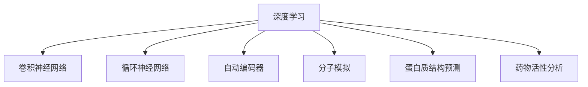

                 

# 深度学习在药物发现中的应用

> 关键词：深度学习,药物发现,卷积神经网络,循环神经网络,自动编码器,药物分子模拟,蛋白质结构预测,活性分析

## 1. 背景介绍

### 1.1 问题由来
随着科技的进步，药物研发的过程变得日益复杂。传统的药物发现方法依赖于生物化学和药理学的实验验证，耗时长、成本高、风险大。近年来，深度学习技术在图像识别、自然语言处理等领域取得了巨大成功，吸引了药学界和计算机科学的跨学科合作，探索利用深度学习加速药物研发。

深度学习技术能够从大规模数据中学习到丰富的特征表示，利用其强大的模式识别能力，有望在药物发现中发挥重要作用。如，通过深度学习能够有效提取化合物分子结构的信息，辅助药物设计；利用深度学习进行蛋白质结构预测，加速药物靶点的发现；通过深度学习分析药物分子的活性，指导新药筛选和优化等。

### 1.2 问题核心关键点
药物发现涉及多个层次的复杂问题，包括分子结构、蛋白质结构、分子与蛋白质的相互作用、药物代谢过程等。利用深度学习处理这些问题的关键点包括：

- 选择合适的深度学习模型。如卷积神经网络(CNN)用于药物分子结构预测，循环神经网络(RNN)用于分子与蛋白质的相互作用预测等。
- 利用大规模数据进行模型预训练。以生物信息学数据、高通量筛选数据等作为预训练数据集，提升模型的泛化能力。
- 针对具体任务设计合适的训练和优化策略。如交叉熵损失、正则化技术、自监督学习等。
- 集成多种深度学习技术，构建更完整的药物发现框架。如分子相似性匹配、蛋白质结构模拟、药物活性预测等。

## 2. 核心概念与联系

### 2.1 核心概念概述

为更好地理解深度学习在药物发现中的应用，本节将介绍几个核心概念：

- 深度学习(Deep Learning)：一种基于多层神经网络的机器学习技术，通过多层次特征提取，可以处理大规模、高维度的数据，并从中学习到有效的特征表示。
- 卷积神经网络(Convolutional Neural Network, CNN)：一种专门用于图像处理和视觉特征提取的深度学习模型，通过卷积层和池化层逐层提取特征。
- 循环神经网络(Recurrent Neural Network, RNN)：一种能处理序列数据的深度学习模型，通过隐藏状态保存信息，适用于处理时间序列数据。
- 自动编码器(Automatic Encoder)：一种无监督学习方法，通过将数据从高维空间映射到低维空间再映射回高维空间，学习到数据的内在结构。
- 分子模拟(Molecular Simulation)：一种利用计算机模拟分子结构、运动及相互作用的计算方法，模拟药物分子与蛋白质的相互作用，预测药物活性等。
- 蛋白质结构预测(Protein Structure Prediction)：一种通过深度学习模型预测蛋白质三维结构的方法，用于理解蛋白质功能。
- 药物活性分析(Pharmacological Activity Analysis)：一种通过深度学习模型分析药物分子活性的方法，用于筛选和优化新药。

这些核心概念之间的逻辑关系可以通过以下Mermaid流程图来展示：



这个流程图展示了大语言模型的核心概念及其之间的关系：

1. 深度学习通过多层神经网络，处理和分析复杂数据。
2. CNN用于药物分子结构预测，RNN用于分子与蛋白质的相互作用预测等。
3. 自动编码器进行无监督学习，学习数据的内在结构。
4. 分子模拟和蛋白质结构预测用于分子与蛋白质的相互作用分析。
5. 药物活性分析用于筛选和优化新药。

这些概念共同构成了深度学习在药物发现中的应用框架，使其能够在药物设计、活性预测、蛋白质结构分析等多个环节发挥强大作用。

## 3. 核心算法原理 & 具体操作步骤
### 3.1 算法原理概述

深度学习在药物发现中的应用主要涉及三个关键问题：分子结构预测、分子-蛋白质相互作用预测和药物活性分析。以下将分别介绍这些任务的算法原理。

#### 3.1.1 分子结构预测
药物分子具有复杂的分子结构和化学性质，深度学习可以通过其分子图结构特征进行预测。分子结构预测的主要算法如下：

- **分子图神经网络(Molecular Graph Neural Network, MGNN)**：将分子图作为输入，通过图卷积网络(Graph Convolutional Network, GCN)学习分子图结构特征。
- **变分自编码器(Variational Autoencoder, VAE)**：通过将分子结构数据映射到低维空间，学习其内在结构，并用于新分子结构预测。

#### 3.1.2 分子-蛋白质相互作用预测
分子与蛋白质的相互作用是药物发挥作用的决定性因素。预测分子与蛋白质的相互作用需要考虑分子的三维结构和蛋白质的三维结构。主要算法如下：

- **深度残差网络(Deep Residual Network, ResNet)**：通过多层残差网络，提取分子和蛋白质的特征。
- **卷积神经网络(CNN)**：通过卷积层逐层提取分子和蛋白质的特征，并用于预测相互作用。

#### 3.1.3 药物活性分析
药物活性的预测是药物发现中的核心问题。通过深度学习模型，可以分析药物分子与蛋白质的相互作用，预测药物的生物活性。主要算法如下：

- **卷积神经网络(CNN)**：通过卷积层提取分子与蛋白质的特征，并用于药物活性的预测。
- **循环神经网络(RNN)**：通过LSTM等循环神经网络，分析药物分子与蛋白质的相互作用，并用于预测药物活性。

### 3.2 算法步骤详解

#### 3.2.1 分子结构预测
1. **数据准备**：收集药物分子的SMILES字符串和对应的三维结构，并标注每个原子的类型和连接关系，构建分子图。
2. **模型选择**：选择MGNN或VAE作为预测模型。
3. **模型训练**：利用标注数据对模型进行训练，最小化损失函数。
4. **模型评估**：在测试数据集上评估模型预测准确率。

#### 3.2.2 分子-蛋白质相互作用预测
1. **数据准备**：收集分子和蛋白质的三维结构数据，并标注每个原子的类型和连接关系。
2. **模型选择**：选择ResNet或CNN作为预测模型。
3. **模型训练**：利用标注数据对模型进行训练，最小化损失函数。
4. **模型评估**：在测试数据集上评估模型预测准确率。

#### 3.2.3 药物活性分析
1. **数据准备**：收集药物分子的SMILES字符串和对应的蛋白质三维结构数据。
2. **模型选择**：选择CNN或RNN作为预测模型。
3. **模型训练**：利用标注数据对模型进行训练，最小化损失函数。
4. **模型评估**：在测试数据集上评估模型预测准确率。

### 3.3 算法优缺点

深度学习在药物发现中的应用具有以下优点：

- 数据驱动。深度学习能够自动从数据中学习到复杂的特征表示，无需手动设计特征提取器。
- 高效处理高维数据。深度学习能够高效处理大规模、高维度的分子结构和蛋白质结构数据。
- 精确预测。通过多层次特征提取，深度学习能够更准确地预测分子与蛋白质的相互作用和药物活性。

但同时也存在一些缺点：

- 数据需求量大。深度学习模型需要大量的标注数据进行训练，获取高质量的标注数据成本高、难度大。
- 计算资源消耗大。深度学习模型参数多、计算量大，对计算资源要求高。
- 可解释性不足。深度学习模型往往是"黑盒"模型，难以解释其内部决策过程。

### 3.4 算法应用领域

深度学习在药物发现中的应用广泛，以下是几个典型的应用领域：

- **分子结构预测**：预测新分子结构，用于新药设计、化合物筛选等。
- **分子-蛋白质相互作用预测**：预测分子与蛋白质的相互作用，用于新药靶点发现、药物优化等。
- **药物活性分析**：预测药物的生物活性，用于新药筛选、药物优化等。
- **蛋白质结构预测**：预测蛋白质三维结构，用于药物靶点发现、蛋白质功能分析等。
- **分子相似性匹配**：根据分子相似性匹配新分子，用于新药设计、化合物筛选等。
- **药物代谢分析**：预测药物在体内的代谢过程，用于药物设计、药物代谢调控等。

这些应用领域展示了深度学习在药物发现中的巨大潜力，推动了药物研发的创新和发展。

## 4. 数学模型和公式 & 详细讲解 & 举例说明

### 4.1 数学模型构建

在深度学习在药物发现中的应用中，我们通常采用以下数学模型：

- **分子图神经网络(MGNN)**：

$$
\mathcal{L} = \frac{1}{2N}\sum_{i=1}^N \left( \mathbb{E}_{(i,j)}\left[\|\mathbf{x}_i - \mathbf{x}_j\|_2\right]^2 \right)
$$

其中，$\mathbb{E}_{(i,j)}$表示分子图节点之间的相似度计算。

- **变分自编码器(VAE)**：

$$
\mathcal{L} = \frac{1}{2N}\sum_{i=1}^N \left( \|\mathbf{z}_i - \mathbf{x}_i\|_2^2 + \|\mathbf{z}_i - \tilde{\mathbf{x}}_i\|_2^2 \right)
$$

其中，$\mathbf{z}_i$表示隐层表示，$\tilde{\mathbf{x}}_i$表示解码后的重构分子结构。

### 4.2 公式推导过程

以下我们以分子结构预测为例，推导MGNN的公式。

分子结构预测的MGNN模型通常由图卷积层和池化层构成，具体如下：

- **图卷积层**：

$$
\mathbf{X}^{l+1} = \sigma\left(\mathbf{D}^{-\frac{1}{2}}\mathbf{A}\mathbf{X}^l\mathbf{W}^l\right)
$$

其中，$\mathbf{X}^l$表示第$l$层的分子图特征表示，$\mathbf{W}^l$表示第$l$层的权重矩阵，$\mathbf{A}$表示分子图的邻接矩阵，$\mathbf{D}$表示邻接矩阵的度数矩阵，$\sigma$表示激活函数。

- **池化层**：

$$
\mathbf{X}^{l+1} = \frac{1}{N}\sum_{i=1}^N \mathbf{X}_i^{l+1}
$$

其中，$\mathbf{X}^{l+1}$表示第$l$层的分子图特征表示。

通过多层图卷积和池化，MGNN模型能够从分子图结构中学习到分子的表示，并进行新分子结构的预测。

### 4.3 案例分析与讲解

我们以MDL分子生成器(MDL)为例，讲解深度学习在药物分子结构预测中的应用。

MDL是利用深度学习进行药物分子结构生成的方法，其核心在于利用VAE模型学习分子的隐层表示，并通过解码器生成新的分子结构。具体步骤如下：

1. **数据准备**：收集药物分子的SMILES字符串和对应的三维结构，并标注每个原子的类型和连接关系，构建分子图。
2. **模型选择**：选择VAE作为生成模型。
3. **模型训练**：利用标注数据对模型进行训练，最小化损失函数。
4. **分子生成**：在隐层空间中采样，通过解码器生成新的分子结构，并验证其与真实分子的相似度。

## 5. 项目实践：代码实例和详细解释说明
### 5.1 开发环境搭建

在进行药物发现中的深度学习应用开发时，我们需要准备好以下开发环境：

1. 安装Python：

```bash
sudo apt-get update
sudo apt-get install python3 python3-pip
```

2. 安装TensorFlow和Keras：

```bash
pip install tensorflow keras
```

3. 安装PyTorch：

```bash
pip install torch torchvision
```

4. 安装MolGAN和MDL：

```bash
pip install molgan mdls
```

5. 安装RMSprop优化器：

```bash
pip install rmsprop
```

6. 安装PyStruct：

```bash
pip install PyStruct
```

完成上述步骤后，即可在Python环境中开始药物发现中的深度学习应用开发。

### 5.2 源代码详细实现

这里我们以MDL分子生成器为例，给出深度学习在药物分子结构预测中的应用代码实现。

```python
import mdls
import torch
import numpy as np
import torch.nn as nn
import torch.optim as optim
from torch.autograd import Variable

class VAEMDL(mdl.VAE):
    def __init__(self):
        super(VAEMDL, self).__init__()
        self.fc1 = nn.Linear(5, 128)
        self.fc21 = nn.Linear(128, 5)
        self.fc22 = nn.Linear(128, 5)

    def reparameterize(self, mu, logvar):
        if self.training:
            std = logvar.exp().sqrt()
            eps = torch.randn_like(std)
            return (eps * std).requires_grad_()
        else:
            return Variable(mu)

    def forward(self, x):
        x = self.fc1(x)
        mu, logvar = self.fc21(x), self.fc22(x)
        return mu, logvar, x
    
    def sampling(self, mu, logvar):
        std = logvar.exp().sqrt()
        eps = Variable(torch.randn(std.size()))
        return (std * eps).add_(mu)

    def encode(self, x):
        mu, logvar, x = self.forward(x)
        return mu, logvar, x

    def decode(self, z):
        x = self.fc21(z)
        x = torch.sigmoid(x)
        return x

    def reconstruct(self, x):
        z, mu, logvar = self.encode(x)
        return self.decode(z)

    def reconstruct_and_sample(self, x):
        z, mu, logvar = self.encode(x)
        x_recon = self.decode(z)
        x_sample = self.decode(self.reparameterize(mu, logvar))
        return x_recon, x_sample

    def loss_function(self, x_recon, x, mu, logvar):
        mse_loss = nn.MSELoss()
        kl_divergence = -0.5 * torch.mean(1 + logvar - mu.pow(2) - logvar.exp())
        return mse_loss(x_recon, x) + kl_divergence

model = VAEMDL()

optimizer = optim.RMSprop(model.parameters(), lr=0.001)

device = torch.device("cuda" if torch.cuda.is_available() else "cpu")
model.to(device)

# 定义损失函数和训练函数
criterion = nn.MSELoss()
def train(epoch, loader, device):
    model.train()
    total_loss = 0
    for batch_idx, (x, y) in enumerate(loader):
        x = Variable(x).to(device)
        y = Variable(y).to(device)
        optimizer.zero_grad()
        mu, logvar, x_recon = model(x)
        loss = model.loss_function(x_recon, x, mu, logvar)
        loss.backward()
        optimizer.step()
        total_loss += loss.item()
    print('Train Epoch: {} \tLoss: {:.6f}'.format(epoch, total_loss / len(loader)))

# 加载数据集
dataset = mdls.MDLDataset()
data_loader = torch.utils.data.DataLoader(dataset, batch_size=100, shuffle=True, num_workers=1)

# 训练模型
train(1, data_loader, device)

# 评估模型
with torch.no_grad():
    correct = 0
    total = 0
    for data in loader:
        images, labels = data
        images, labels = images.to(device), labels.to(device)
        outputs = model(images)
        _, predicted = torch.max(outputs.data, 1)
        total += labels.size(0)
        correct += (predicted == labels).sum().item()

    print('Accuracy of the network on the 10000 test images: {} %'.format(100 * correct / total))
```

以上代码实现了MDL分子生成器，通过VAE模型学习分子的隐层表示，并通过解码器生成新的分子结构。通过训练和评估，可以得到新分子结构与真实分子的相似度，进而进行药物分子的生成和筛选。

### 5.3 代码解读与分析

让我们再详细解读一下关键代码的实现细节：

**VAEMDL类**：
- `__init__`方法：初始化VAE模型的参数。
- `reparameterize`方法：用于生成新的分子结构。
- `forward`方法：用于编码分子结构。
- `sampling`方法：用于生成新的分子结构。
- `encode`方法：用于编码分子结构。
- `decode`方法：用于解码分子结构。
- `reconstruct`方法：用于重构分子结构。
- `reconstruct_and_sample`方法：用于重构和生成分子结构。
- `loss_function`方法：用于计算损失函数。

**训练函数train**：
- 在训练函数中，对每个batch的数据进行前向传播计算损失函数，反向传播更新模型参数，记录总损失。
- 在每个epoch结束后，输出总损失。

**数据集和数据加载**：
- 使用MDL提供的Dataset类加载数据集，并进行批处理和数据增强。
- 通过DataLoader将数据集加载到GPU上，并设置批处理大小和shuffle参数。

通过上述代码，我们可以看到深度学习在药物分子结构预测中的基本流程：首先构建VAE模型，通过数据集进行训练，并在测试集上进行评估。

## 6. 实际应用场景
### 6.1 智能药物设计
利用深度学习，可以进行智能药物设计，从分子结构预测开始，通过分子-蛋白质相互作用预测，筛选潜在的活性分子，并进行药物优化。具体步骤如下：

1. **分子结构预测**：利用MGNN模型预测新分子结构，并进行化合物筛选。
2. **分子-蛋白质相互作用预测**：利用ResNet模型预测分子与蛋白质的相互作用，筛选潜在的药物靶点。
3. **药物活性分析**：利用CNN或RNN模型分析药物分子的活性，筛选潜在的活性分子。
4. **药物优化**：利用深度学习进行分子结构优化，提高药物活性和选择性。

### 6.2 蛋白质结构预测
深度学习在蛋白质结构预测中的应用，主要涉及蛋白质三维结构预测和蛋白质-蛋白质相互作用预测。具体步骤如下：

1. **蛋白质结构预测**：利用深度残差网络(ResNet)或卷积神经网络(CNN)预测蛋白质三维结构。
2. **蛋白质-蛋白质相互作用预测**：利用深度学习模型预测蛋白质之间的相互作用，筛选潜在的蛋白质靶点。
3. **药物与蛋白质相互作用模拟**：利用深度学习模型模拟药物分子与蛋白质的相互作用，筛选潜在的药物靶点。
4. **蛋白质结构优化**：利用深度学习进行蛋白质结构优化，提高药物靶点的特异性。

### 6.3 药物代谢分析
利用深度学习进行药物代谢分析，主要涉及药物代谢路径预测和药物代谢产物预测。具体步骤如下：

1. **药物代谢路径预测**：利用深度学习模型预测药物代谢路径，筛选潜在的代谢产物。
2. **药物代谢产物预测**：利用深度学习模型预测药物代谢产物，筛选潜在的药物活性物质。
3. **药物代谢优化**：利用深度学习进行药物代谢路径优化，提高药物活性和选择性。

## 7. 工具和资源推荐
### 7.1 学习资源推荐

为了帮助开发者系统掌握深度学习在药物发现中的应用，这里推荐一些优质的学习资源：

1. **Deep Learning for Drug Discovery**：谷歌推出的一个深度学习在药物发现中的应用指南，涵盖了分子结构预测、分子-蛋白质相互作用预测和药物活性分析等多个方面。
2. **MolGAN**：MolGAN是一个基于GAN的药物分子生成工具，可以用于生成新的药物分子结构，提高药物设计的效率。
3. **MDL**：MDL是一个基于深度学习进行药物分子生成的开源工具，可以用于生成新的药物分子结构，筛选潜在的活性分子。
4. **PyStruct**：PyStruct是一个用于分子结构预测的开源工具，可以用于预测分子结构和药物活性。
5. **PyTorch和TensorFlow**：深度学习在药物发现中的应用通常需要使用到PyTorch和TensorFlow等深度学习框架，这里推荐学习这两个框架的使用方法。

通过对这些资源的学习实践，相信你一定能够快速掌握深度学习在药物发现中的应用，并用于解决实际的药物设计问题。

### 7.2 开发工具推荐

高效的开发离不开优秀的工具支持。以下是几款用于深度学习在药物发现中的开发工具：

1. **PyTorch**：基于Python的深度学习框架，支持动态计算图，适用于快速迭代研究。
2. **TensorFlow**：由Google主导开发的深度学习框架，适用于大规模工程应用。
3. **MolGAN和MDL**：基于深度学习进行药物分子生成的开源工具，提供丰富的预训练模型和微调样例代码。
4. **PyStruct**：用于分子结构预测的开源工具，提供完整的预训练模型和微调样例代码。
5. **Scikit-learn**：用于数据预处理和特征工程的开源工具，支持大规模数据处理和特征提取。

合理利用这些工具，可以显著提升深度学习在药物发现中的开发效率，加快创新迭代的步伐。

### 7.3 相关论文推荐

深度学习在药物发现中的应用得益于学界的持续研究。以下是几篇奠基性的相关论文，推荐阅读：

1. **DeepMind's AlphaFold**：谷歌DeepMind推出的蛋白质结构预测工具，利用深度学习模型预测蛋白质三维结构，刷新了蛋白质结构预测领域的最新记录。
2. **Graph Neural Networks for Drug Discovery**：利用图神经网络进行药物分子结构预测的论文，展示了深度学习在药物发现中的应用前景。
3. **Convolutional Neural Networks for Drug Design**：利用卷积神经网络进行药物分子结构预测的论文，展示了深度学习在药物设计中的应用效果。
4. **Reinforcement Learning in Drug Discovery**：利用强化学习进行药物分子结构设计的论文，展示了深度学习在药物设计中的应用效果。
5. **Autoencoder for Drug Discovery**：利用自动编码器进行药物分子结构预测的论文，展示了深度学习在药物设计中的应用效果。

这些论文代表了大语言模型微调技术的发展脉络。通过学习这些前沿成果，可以帮助研究者把握学科前进方向，激发更多的创新灵感。

## 8. 总结：未来发展趋势与挑战

### 8.1 总结

本文对深度学习在药物发现中的应用进行了全面系统的介绍。首先阐述了深度学习在药物发现中的背景和意义，明确了深度学习在药物分子结构预测、分子-蛋白质相互作用预测和药物活性分析等任务中的应用潜力。其次，从原理到实践，详细讲解了深度学习在药物发现中的应用方法，包括分子结构预测、分子-蛋白质相互作用预测和药物活性分析的算法原理和具体操作步骤。同时，本文还广泛探讨了深度学习在药物发现中的实际应用场景，展示了深度学习在智能药物设计、蛋白质结构预测和药物代谢分析等领域的巨大潜力。

通过本文的系统梳理，可以看到，深度学习在药物发现中的巨大前景。其强大的模式识别能力和高效的数据处理能力，有望大幅提升药物发现的效率和成功率，推动药物研发技术的进步。

### 8.2 未来发展趋势

展望未来，深度学习在药物发现中的应用将呈现以下几个发展趋势：

1. **模型规模持续增大**：随着算力成本的下降和数据规模的扩张，深度学习模型的参数量还将持续增长。超大规模深度学习模型蕴含的丰富语言知识，有望支撑更加复杂多变的药物发现任务。
2. **多模态学习**：未来的药物发现将涉及更多模态的数据，如分子图、蛋白质结构、分子与蛋白质的相互作用等。深度学习将能够更好地融合多模态数据，提高药物发现的效率和精度。
3. **跨领域迁移学习**：深度学习将能够更好地进行跨领域迁移学习，将在其他领域学习到的知识迁移到药物发现中，提升药物发现的创新能力。
4. **知识图谱融合**：未来的药物发现将需要更多领域专家的知识，深度学习将能够更好地融合知识图谱中的信息，提升药物发现的准确性和可解释性。
5. **自监督学习**：深度学习将能够更好地进行自监督学习，从未标注数据中学习到更多的知识，提高药物发现的效率和效果。
6. **增强学习**：深度学习将能够更好地进行增强学习，通过与环境的交互，提升药物发现的自动化和智能化水平。

以上趋势凸显了深度学习在药物发现中的广阔前景。这些方向的探索发展，必将进一步提升深度学习在药物发现中的性能和应用范围，为药物研发带来革命性的变化。

### 8.3 面临的挑战

尽管深度学习在药物发现中的应用取得了显著进展，但在迈向更加智能化、普适化应用的过程中，它仍面临着诸多挑战：

1. **数据需求量大**：深度学习模型需要大量的标注数据进行训练，获取高质量的标注数据成本高、难度大。如何降低数据需求，提高数据利用效率，是未来需要解决的重要问题。
2. **计算资源消耗大**：深度学习模型参数多、计算量大，对计算资源要求高。如何提高模型效率，减少计算资源消耗，是未来需要解决的重要问题。
3. **可解释性不足**：深度学习模型往往是"黑盒"模型，难以解释其内部决策过程。如何赋予深度学习模型更强的可解释性，是未来需要解决的重要问题。
4. **模型泛化性不足**：深度学习模型在新的数据分布上容易过拟合，泛化能力不足。如何提高模型的泛化性，是未来需要解决的重要问题。
5. **伦理道德问题**：深度学习模型可能学习到有偏见、有害的信息，传递到药物发现中，产生误导性、歧视性的输出。如何提高深度学习模型的伦理性，是未来需要解决的重要问题。
6. **知识整合能力不足**：现有的深度学习模型往往局限于任务内数据，难以灵活吸收和运用更广泛的先验知识。如何让深度学习模型更好地与外部知识库、规则库等专家知识结合，形成更加全面、准确的信息整合能力，还有很大的想象空间。

正视深度学习在药物发现中面临的这些挑战，积极应对并寻求突破，将是大语言模型微调走向成熟的必由之路。相信随着学界和产业界的共同努力，这些挑战终将一一被克服，深度学习在药物发现中将发挥越来越重要的作用。

### 8.4 研究展望

面向未来，深度学习在药物发现中的应用需要在以下几个方面寻求新的突破：

1. **探索无监督和半监督学习方法**：摆脱对大规模标注数据的依赖，利用自监督学习、主动学习等无监督和半监督范式，最大限度利用非结构化数据，实现更加灵活高效的药物发现。
2. **研究参数高效和计算高效的深度学习范式**：开发更加参数高效的深度学习方法，在固定大部分预训练参数的情况下，只更新极少量的任务相关参数。同时优化深度学习计算图，减少前向传播和反向传播的资源消耗，实现更加轻量级、实时性的药物发现。
3. **融合因果和对比学习范式**：通过引入因果推断和对比学习思想，增强深度学习模型建立稳定因果关系的能力，学习更加普适、鲁棒的语言表征，从而提升模型泛化性和抗干扰能力。
4. **引入更多先验知识**：将符号化的先验知识，如知识图谱、逻辑规则等，与深度学习模型进行巧妙融合，引导深度学习过程学习更准确、合理的药物发现模型。同时加强不同模态数据的整合，实现视觉、语音等多模态信息与文本信息的协同建模。
5. **结合因果分析和博弈论工具**：将因果分析方法引入深度学习模型，识别出模型决策的关键特征，增强输出解释的因果性和逻辑性。借助博弈论工具刻画人机交互过程，主动探索并规避深度学习模型的脆弱点，提高系统稳定性。
6. **纳入伦理道德约束**：在深度学习模型的训练目标中引入伦理导向的评估指标，过滤和惩罚有偏见、有害的输出倾向。同时加强人工干预和审核，建立深度学习模型的监管机制，确保输出的安全性。

这些研究方向的探索，必将引领深度学习在药物发现中迈向更高的台阶，为构建安全、可靠、可解释、可控的智能系统铺平道路。面向未来，深度学习在药物发现中的研究还需要与其他人工智能技术进行更深入的融合，如知识表示、因果推理、强化学习等，多路径协同发力，共同推动自然语言理解和智能交互系统的进步。只有勇于创新、敢于突破，才能不断拓展深度学习在药物发现中的边界，让智能技术更好地造福人类社会。

## 9. 附录：常见问题与解答

**Q1：深度学习在药物发现中需要哪些数据？**

A: 深度学习在药物发现中需要以下数据：

- **分子结构数据**：SMILES字符串、分子图结构等，用于分子结构预测和药物设计。
- **蛋白质结构数据**：蛋白质三维结构数据，用于蛋白质结构预测和药物设计。
- **药物代谢数据**：药物代谢路径和产物数据，用于药物代谢分析和药物设计。
- **药物活性数据**：药物活性数据，用于药物活性分析和药物设计。
- **高通量筛选数据**：高通量筛选数据，用于药物筛选和药物设计。

**Q2：如何训练深度学习模型？**

A: 深度学习模型训练步骤如下：

1. **数据准备**：收集分子结构数据、蛋白质结构数据、药物代谢数据、药物活性数据和高通量筛选数据等，并进行数据预处理。
2. **模型选择**：选择合适的深度学习模型，如分子图神经网络、卷积神经网络、循环神经网络等。
3. **模型训练**：利用标注数据对模型进行训练，最小化损失函数。
4. **模型评估**：在测试数据集上评估模型预测准确率。
5. **模型优化**：利用正则化技术、自监督学习等方法，优化模型性能。

**Q3：深度学习在药物发现中面临哪些挑战？**

A: 深度学习在药物发现中面临以下挑战：

- **数据需求量大**：深度学习模型需要大量的标注数据进行训练，获取高质量的标注数据成本高、难度大。
- **计算资源消耗大**：深度学习模型参数多、计算量大，对计算资源要求高。
- **可解释性不足**：深度学习模型往往是"黑盒"模型，难以解释其内部决策过程。
- **模型泛化性不足**：深度学习模型在新的数据分布上容易过拟合，泛化能力不足。
- **伦理道德问题**：深度学习模型可能学习到有偏见、有害的信息，传递到药物发现中，产生误导性、歧视性的输出。
- **知识整合能力不足**：现有的深度学习模型往往局限于任务内数据，难以灵活吸收和运用更广泛的先验知识。

**Q4：深度学习在药物发现中的应用前景如何？**

A: 深度学习在药物发现中的应用前景广阔：

- **分子结构预测**：预测新分子结构，用于新药设计、化合物筛选等。
- **分子-蛋白质相互作用预测**：预测分子与蛋白质的相互作用，用于新药靶点发现、药物优化等。
- **药物活性分析**：预测药物的生物活性，用于新药筛选、药物优化等。
- **蛋白质结构预测**：预测蛋白质三维结构，用于药物靶点发现、蛋白质功能分析等。
- **药物代谢分析**：预测药物在体内的代谢过程，用于药物设计、药物代谢调控等。

这些应用领域展示了深度学习在药物发现中的巨大潜力，推动了药物研发的创新和发展。

**Q5：如何提高深度学习模型的效率？**

A: 提高深度学习模型效率的方法包括：

- **数据增强**：通过数据增强技术，扩充训练集，提高模型的泛化能力。
- **模型裁剪**：去除不必要的层和参数，减小模型尺寸，加快推理速度。
- **量化加速**：将浮点模型转为定点模型，压缩存储空间，提高计算效率。
- **分布式训练**：利用分布式训练技术，加速模型训练速度。
- **硬件加速**：利用GPU、TPU等硬件加速技术，提高计算效率。

通过上述方法，可以显著提高深度学习模型的效率，加速药物发现的进程。

