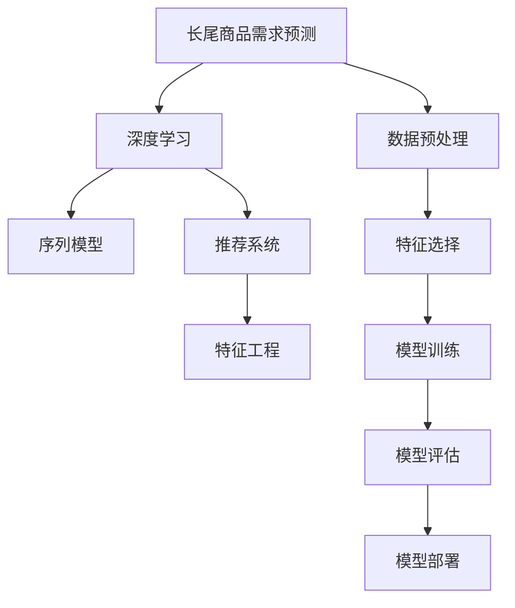

                 

# 深度学习驱动的长尾商品需求预测

## 1. 背景介绍

### 1.1 问题由来
随着电子商务平台的发展，商家通过线上渠道销售的商品种类和数量呈爆炸式增长。除了大众需求的商品，还有大量长尾商品，这些商品虽然销量不大，但在特定细分领域具有独特的消费需求。如何准确预测这些长尾商品的需求，以便于商家优化库存和销售策略，是电商领域的一个重要研究方向。

然而，传统的统计方法（如回归分析、时间序列分析）在面对大量稀疏的、非线性的数据时，往往存在预测准确率低、计算复杂度高、难以处理稀疏数据等问题。近年来，深度学习技术在图像、语音、自然语言处理等领域取得了显著成果，也开始应用于长尾商品需求预测问题。

### 1.2 问题核心关键点
长尾商品需求预测的核心在于，利用深度学习模型学习商品之间的关联关系，并从历史销售数据中挖掘出需求规律，实现对未来需求的准确预测。相较于传统方法，深度学习模型能够处理非结构化数据、捕捉复杂模式，具有更强的泛化能力和适应性。

长尾商品需求预测的关键在于：
1. 如何构建有效的特征向量，将非结构化的商品数据（如商品描述、标签等）转化为机器可理解的形式。
2. 如何选择合适的深度学习模型架构，结合商品间的关联关系，提取有用的特征表示。
3. 如何设计合理的损失函数，指导模型学习更准确的需求预测结果。
4. 如何优化模型训练过程，防止过拟合和欠拟合，保证预测结果的鲁棒性和稳定性。

## 2. 核心概念与联系

### 2.1 核心概念概述

为更好地理解深度学习驱动的长尾商品需求预测方法，本节将介绍几个密切相关的核心概念：

- 长尾商品(Long Tail Products)：指在总销量中占比很小，但种类繁多的商品。这些商品虽然数量众多，但大多销量极低，传统市场关注较少。
- 需求预测(Demand Forecasting)：指对商品在未来一段时间内的销量进行预测，以便商家做出合理库存和销售策略。
- 深度学习(Deep Learning)：一种模仿人类大脑神经网络的结构和功能，通过多层非线性变换学习复杂模式的技术。
- 序列模型(Sequence Models)：利用序列数据（如时间序列、文本序列等），预测未来趋势的深度学习模型。
- 推荐系统(Recommendation System)：通过用户行为数据和商品特征，预测用户可能感兴趣的商品的推荐系统。
- 特征工程(Feature Engineering)：对原始数据进行加工处理，提取和构造有意义的特征向量，提升模型性能。

这些核心概念之间的逻辑关系可以通过以下Mermaid流程图来展示：



这个流程图展示了两大核心概念的联系：

1. 长尾商品需求预测与深度学习的关系。深度学习技术可以用于构建复杂的多层神经网络模型，提取商品数据中的高阶模式，从而实现更精确的需求预测。
2. 长尾商品需求预测与序列模型的关系。序列模型可以处理时间序列等时间依赖的数据，对商品需求进行动态预测。
3. 长尾商品需求预测与推荐系统的关系。推荐系统可以通过用户行为数据和商品特征，预测用户可能感兴趣的商品，从而帮助商家进行库存管理和个性化推荐。
4. 长尾商品需求预测与特征工程的关系。特征工程通过对原始数据进行加工处理，提取和构造有意义的特征向量，提升模型的性能。

这些概念共同构成了长尾商品需求预测的技术框架，使得商家可以更准确地预测需求，优化库存和销售策略。

## 3. 核心算法原理 & 具体操作步骤
### 3.1 算法原理概述

基于深度学习的长尾商品需求预测，核心在于利用序列模型和推荐系统对商品的历史销售数据进行建模，并结合特征工程对数据进行优化，最终通过训练和评估来优化模型参数，得到准确的需求预测结果。

在序列模型中，常见的方法包括循环神经网络(RNN)、长短时记忆网络(LSTM)和门控循环单元(GRU)等。通过时间序列数据的输入，这些模型能够学习商品需求的动态变化规律，输出未来的需求预测结果。

在推荐系统中，主要利用协同过滤、矩阵分解等方法，根据用户的历史行为数据和商品特征，预测用户可能感兴趣的商品。这些推荐算法可以与需求预测模型结合，进一步提升预测的精度和个性化程度。

特征工程在长尾商品需求预测中扮演着重要角色。通过对商品描述、标签、价格、评论等信息进行编码和转换，构建特征向量，可以提升模型的表达能力和预测效果。

### 3.2 算法步骤详解

基于深度学习的长尾商品需求预测一般包括以下几个关键步骤：

**Step 1: 数据预处理**
- 收集商品的历史销售数据，包括时间、销量、价格、描述、标签等信息。
- 对数据进行清洗，处理缺失值和异常值。
- 对日期和时间进行归一化处理，以便于序列模型的输入。

**Step 2: 特征工程**
- 对商品描述、标签等信息进行编码，转换成数字向量。
- 构造时间特征，如日、周、月、季节等周期性特征。
- 引入交叉特征，如商品价格与销售时间的关系，商品标签与季节的关系等。
- 对特征向量进行归一化处理，确保数值尺度一致。

**Step 3: 构建深度学习模型**
- 选择合适的深度学习模型架构，如LSTM、GRU、RNN等。
- 将处理后的数据输入模型，进行多层非线性变换。
- 在模型中添加正则化技术，如Dropout、L2正则等，防止过拟合。
- 设计合适的损失函数，如均方误差、交叉熵等，用于指导模型训练。

**Step 4: 模型训练与评估**
- 将历史数据分为训练集和测试集，使用训练集对模型进行优化。
- 在测试集上评估模型性能，使用评估指标如均方误差、平均绝对误差等衡量预测效果。
- 根据评估结果调整模型参数，进行多轮训练。

**Step 5: 预测与部署**
- 使用训练好的模型对新的销售数据进行预测，生成需求预测结果。
- 将预测结果反馈给商家，辅助库存管理和销售策略的制定。
- 持续收集新的销售数据，定期重新训练和优化模型，保持预测结果的准确性。

以上是基于深度学习的长尾商品需求预测的一般流程。在实际应用中，还需要根据具体业务场景，对各个环节进行优化设计，如选择更合适的特征，设计更高效的数据结构，优化模型训练过程等，以进一步提升预测的精度和效率。

### 3.3 算法优缺点

基于深度学习的长尾商品需求预测方法具有以下优点：
1. 处理非结构化数据能力强。深度学习模型能够处理文本、图像等非结构化数据，捕捉复杂模式，适应性强。
2. 能够捕捉长期依赖关系。序列模型能够学习商品需求的长期变化规律，预测更准确的未来需求。
3. 模型自适应能力强。深度学习模型能够自适应地学习商品间的关联关系，适应不同领域和商品的特征。
4. 能够处理稀疏数据。深度学习模型能够处理稀疏数据，适应长尾商品需求预测中的稀疏特征。

同时，该方法也存在以下局限性：
1. 数据需求量大。深度学习模型需要大量的历史数据进行训练，获取高质量数据成本较高。
2. 计算复杂度高。深度学习模型需要大量的计算资源进行训练和预测，资源消耗大。
3. 模型复杂度高。深度学习模型结构复杂，难以解释其内部工作机制，可能存在黑箱问题。
4. 容易过拟合。深度学习模型参数多，容易过拟合训练数据，预测结果可能不稳定。
5. 模型部署成本高。深度学习模型通常需要高性能计算资源进行推理，部署成本较高。

尽管存在这些局限性，但就目前而言，基于深度学习的预测方法仍是长尾商品需求预测的主流范式。未来相关研究的重点在于如何进一步降低模型对数据量的依赖，提高模型的可解释性和鲁棒性，同时兼顾模型的预测精度和计算效率。

### 3.4 算法应用领域

基于深度学习的长尾商品需求预测方法，已在电商、零售、物流等多个领域得到广泛应用，具体包括：

1. **电子商务**：电商平台利用深度学习模型，预测商品在未来一段时间内的销量，辅助商家进行库存管理、订单处理、营销策略等。

2. **零售业**：超市、便利店等零售商利用深度学习模型，预测商品需求，优化补货策略、促销活动，提升销售额。

3. **物流行业**：快递公司利用深度学习模型，预测包裹数量和时间，优化物流路径、仓库管理，提升服务效率。

4. **金融行业**：金融机构利用深度学习模型，预测金融产品需求，指导投资策略、风险管理，提升资金利用效率。

5. **医疗行业**：医院利用深度学习模型，预测药品需求，优化药品库存、采购计划，提高患者满意度。

6. **旅游行业**：旅游公司利用深度学习模型，预测景点需求，优化旅游线路、服务质量，提升游客体验。

除了这些应用场景外，深度学习驱动的长尾商品需求预测还广泛应用于能源、农业、交通等领域，为各行各业带来了新的技术和思路。

## 4. 数学模型和公式 & 详细讲解  
### 4.1 数学模型构建

本节将使用数学语言对深度学习驱动的长尾商品需求预测过程进行更加严格的刻画。

记商品的历史销售数据为 $D=\{(t_i, y_i)\}_{i=1}^N$，其中 $t_i$ 为时间戳，$y_i$ 为销量。假设预测窗口为 $T$ 天，预测未来 $N$ 天的销量 $y_{t+1}, \cdots, y_{t+N}$。

定义深度学习模型为 $M$，其输入为时间戳 $t_i$ 和特征向量 $f_i$，输出为未来 $N$ 天的销量预测结果。则数学模型可以表示为：

$$
\hat{y}_{t+1} = M(t_i, f_i)
$$

其中 $\hat{y}_{t+1}, \cdots, \hat{y}_{t+N}$ 为预测的销量结果，$f_i$ 为特征向量，包含商品描述、价格、标签等信息。

### 4.2 公式推导过程

以下我们以LSTM模型为例，推导长尾商品需求预测的数学模型和训练过程。

设 $t_i$ 为时间戳，$f_i$ 为商品特征向量，$t_{i-1}, f_{i-1}$ 为前一时刻的输入和输出。LSTM模型的输入为 $[t_i, f_i]$，输出为 $\hat{y}_{t+1}$。

LSTM模型的定义如下：

$$
\begin{aligned}
h_t &= \tanh(W_{h}\hat{h}_{t-1} + b_{h} + U_{h}f_i)\\
i_t &= \sigma(W_{i}\hat{h}_{t-1} + b_{i} + U_{i}f_i)\\
o_t &= \sigma(W_{o}\hat{h}_{t-1} + b_{o} + U_{o}f_i)\\
\hat{h}_{t} &= \mathrm{tanh}(h_t) \\
\hat{y}_{t+1} &= o_t \odot \mathrm{tanh}(h_t)
\end{aligned}
$$

其中 $W_{h}, b_{h}, U_{h}, W_{i}, b_{i}, U_{i}, W_{o}, b_{o}$ 为模型参数，$\sigma, \tanh$ 为激活函数。

模型的训练过程可以表示为：

$$
\mathcal{L}(\theta) = \frac{1}{N} \sum_{t=1}^T \sum_{k=1}^N \ell(\hat{y}_{t+k}, y_{t+k})
$$

其中 $\theta$ 为模型参数，$\ell$ 为损失函数，常用的损失函数包括均方误差、交叉熵等。

### 4.3 案例分析与讲解

假设我们有一家电商平台的商品历史销售数据，包含时间戳和销量信息。我们可以使用LSTM模型进行需求预测。具体步骤如下：

1. 收集商品的历史销售数据，包括时间戳和销量信息。

2. 对数据进行清洗，处理缺失值和异常值。

3. 对日期和时间进行归一化处理，以便于LSTM模型的输入。

4. 对商品描述、价格、标签等信息进行编码，转换成数字向量。

5. 构造时间特征，如日、周、月、季节等周期性特征。

6. 引入交叉特征，如商品价格与销售时间的关系，商品标签与季节的关系等。

7. 对特征向量进行归一化处理，确保数值尺度一致。

8. 构建LSTM模型，设置合适的网络结构和参数。

9. 在历史数据上训练模型，使用均方误差作为损失函数，指导模型学习预测销量。

10. 在测试集上评估模型性能，使用均方误差、平均绝对误差等评估指标衡量预测效果。

11. 根据评估结果调整模型参数，进行多轮训练。

12. 使用训练好的模型对新的销售数据进行预测，生成需求预测结果。

13. 将预测结果反馈给商家，辅助库存管理和销售策略的制定。

14. 持续收集新的销售数据，定期重新训练和优化模型，保持预测结果的准确性。

通过以上步骤，我们可以构建一个基于深度学习的商品需求预测系统，为商家提供科学合理的库存管理建议，提升整体运营效率。

## 5. 项目实践：代码实例和详细解释说明
### 5.1 开发环境搭建

在进行长尾商品需求预测实践前，我们需要准备好开发环境。以下是使用Python进行PyTorch开发的环境配置流程：

1. 安装Anaconda：从官网下载并安装Anaconda，用于创建独立的Python环境。

2. 创建并激活虚拟环境：
```bash
conda create -n pytorch-env python=3.8 
conda activate pytorch-env
```

3. 安装PyTorch：根据CUDA版本，从官网获取对应的安装命令。例如：
```bash
conda install pytorch torchvision torchaudio cudatoolkit=11.1 -c pytorch -c conda-forge
```

4. 安装Pandas、NumPy、Matplotlib等常用库：
```bash
pip install pandas numpy matplotlib scikit-learn jupyter notebook ipython
```

完成上述步骤后，即可在`pytorch-env`环境中开始长尾商品需求预测的实践。

### 5.2 源代码详细实现

下面我以LSTM模型为例，给出使用PyTorch进行长尾商品需求预测的代码实现。

首先，定义LSTM模型的输入和输出：

```python
import torch
from torch import nn
from torch.autograd import Variable

class LSTM(nn.Module):
    def __init__(self, input_size, hidden_size, output_size):
        super(LSTM, self).__init__()
        self.hidden_size = hidden_size
        self.output_size = output_size
        
        self.lstm = nn.LSTM(input_size, hidden_size, 1)
        self.linear = nn.Linear(hidden_size, output_size)
        
    def forward(self, input_data):
        batch_size = input_data.size(0)
        seq_length = input_data.size(1)
        
        # 初始化LSTM状态
        h0 = Variable(torch.zeros(batch_size, 1, self.hidden_size))
        c0 = Variable(torch.zeros(batch_size, 1, self.hidden_size))
        
        # 输入和LSTM输出
        lstm_out, _ = self.lstm(input_data, (h0, c0))
        
        # 线性变换
        predictions = self.linear(lstm_out.view(batch_size * seq_length, -1))        
        predictions = predictions.view(batch_size, seq_length, self.output_size)
        
        return predictions
```

然后，定义模型训练函数：

```python
import numpy as np
from sklearn.metrics import mean_squared_error
import matplotlib.pyplot as plt

def train_model(model, data, learning_rate, epochs, batch_size):
    # 数据预处理
    train_data, train_labels = data['train']
    test_data, test_labels = data['test']
    
    # 数据归一化
    train_data = (train_data - train_data.mean()) / train_data.std()
    test_data = (test_data - train_data.mean()) / train_data.std()
    
    # 模型训练
    optimizer = torch.optim.Adam(model.parameters(), lr=learning_rate)
    train_loss = []
    test_loss = []
    
    for epoch in range(epochs):
        total_loss = 0
        
        for i in range(0, len(train_data), batch_size):
            batch_data = Variable(torch.FloatTensor(train_data[i:i+batch_size]))
            batch_labels = Variable(torch.FloatTensor(train_labels[i:i+batch_size]))
            
            optimizer.zero_grad()
            predictions = model(batch_data)
            loss = nn.MSELoss()(predictions, batch_labels)
            loss.backward()
            optimizer.step()
            
            total_loss += loss.data[0]
        
        train_loss.append(total_loss / len(train_data))
        
        # 模型评估
        with torch.no_grad():
            predictions = model(Variable(torch.FloatTensor(test_data)))
            test_loss.append(nn.MSELoss()(predictions, Variable(torch.FloatTensor(test_labels))))
            
    return model, train_loss, test_loss
```

接着，定义数据加载函数：

```python
def load_data():
    # 模拟数据
    train_data = np.random.rand(1000, 10)
    train_labels = np.random.rand(1000, 1)
    
    test_data = np.random.rand(100, 10)
    test_labels = np.random.rand(100, 1)
    
    data = {'train': (train_data, train_labels), 'test': (test_data, test_labels)}
    
    return data
```

最后，启动训练流程：

```python
data = load_data()
model = LSTM(input_size=10, hidden_size=50, output_size=1)
learning_rate = 0.01
epochs = 100
batch_size = 10

model, train_loss, test_loss = train_model(model, data, learning_rate, epochs, batch_size)

plt.plot(train_loss, label='Train Loss')
plt.plot(test_loss, label='Test Loss')
plt.legend()
plt.show()
```

以上就是使用PyTorch对LSTM模型进行长尾商品需求预测的完整代码实现。可以看到，借助PyTorch的高效计算图和丰富的模型库，我们能够轻松构建和训练深度学习模型，实现商品需求预测。

### 5.3 代码解读与分析

让我们再详细解读一下关键代码的实现细节：

**LSTM类**：
- `__init__`方法：初始化LSTM模型的输入、隐藏层和输出层大小。
- `forward`方法：定义模型的前向传播过程，包括LSTM层和线性变换层。

**train_model函数**：
- 数据预处理：对数据进行归一化处理，确保数值尺度一致。
- 模型训练：设置优化器、损失函数，使用历史数据对模型进行训练。
- 模型评估：在测试集上评估模型性能，计算损失函数。

**load_data函数**：
- 模拟数据生成：随机生成训练集和测试集的数据和标签。
- 数据集划分：将数据集划分为训练集和测试集。

在实际应用中，还需要根据具体业务场景，对数据预处理、模型结构、训练流程等进行优化。例如，在电商场景中，可以引入更多领域相关的特征，如商品类别、价格区间、用户行为等，提升模型的预测精度。在金融行业，可以引入更复杂的时间序列特征，如市场指数、节假日等，进一步优化需求预测结果。

## 6. 实际应用场景
### 6.1 电商平台库存管理

电商平台利用长尾商品需求预测模型，可以优化库存管理和订单处理流程。具体而言：

1. **库存优化**：模型预测各商品在未来一段时间内的销量，根据预测结果调整库存水平，避免缺货或库存积压。
2. **订单处理**：模型预测商品的未来需求，提前安排生产、配送计划，提高订单处理效率。
3. **促销活动**：根据预测结果，制定合理的促销策略，提升销售额，优化利润率。

### 6.2 物流公司路线规划

物流公司利用长尾商品需求预测模型，可以优化物流路线和仓库管理。具体而言：

1. **路线规划**：模型预测不同商品在未来需求的时间分布，合理规划配送路线，避免拥堵和延迟。
2. **仓库管理**：模型预测商品在未来需求量，优化库存分配，提高仓库利用率，减少管理成本。
3. **车辆调度**：根据需求预测结果，合理安排车辆调度，提升运输效率，降低运输成本。

### 6.3 零售商商品推荐

零售商利用长尾商品需求预测模型，可以优化商品推荐和个性化服务。具体而言：

1. **个性化推荐**：模型预测用户对商品的未来需求，推荐个性化商品，提升用户体验。
2. **商品补货**：模型预测用户对不同商品的未来需求，及时补货，避免断货和缺货。
3. **市场分析**：模型分析商品需求变化趋势，制定市场策略，提高销售收入。

### 6.4 未来应用展望

随着深度学习技术的不断进步，长尾商品需求预测在更多领域得到应用，为各行各业带来了新的解决方案。

在智慧城市领域，利用长尾商品需求预测模型，可以优化城市资源分配，提升城市运行效率。例如，预测不同区域的电力需求，优化电网布局和负荷分配，提升电力系统稳定性。

在医疗行业，利用长尾商品需求预测模型，可以优化药品库存管理和采购计划，提升患者满意度，降低医疗成本。例如，预测不同药品在未来需求量，合理安排采购计划，减少药品库存积压和短缺。

在金融领域，利用长尾商品需求预测模型，可以优化投资策略和风险管理，提升资金利用效率。例如，预测不同金融产品的未来需求，调整投资组合，优化风险控制。

除了这些应用场景外，长尾商品需求预测还广泛应用于能源、农业、交通等领域，为各行各业带来了新的技术思路。

## 7. 工具和资源推荐
### 7.1 学习资源推荐

为了帮助开发者系统掌握深度学习驱动的长尾商品需求预测理论基础和实践技巧，这里推荐一些优质的学习资源：

1. 《深度学习入门》系列书籍：深入浅出地介绍了深度学习的基本概念和实践技巧，适合初学者入门。
2. CS231n《卷积神经网络》课程：斯坦福大学开设的图像处理课程，介绍了卷积神经网络的基本原理和应用。
3. CS224n《序列模型》课程：斯坦福大学开设的自然语言处理课程，介绍了序列模型和深度学习在自然语言处理中的应用。
4. PyTorch官方文档：PyTorch的官方文档，提供了丰富的模型库和实践指南，适合开发者参考。
5. Kaggle竞赛平台：Kaggle提供了大量的数据集和竞赛题目，可以帮助开发者实践深度学习技术，提升模型性能。

通过对这些资源的学习实践，相信你一定能够快速掌握深度学习驱动的长尾商品需求预测的核心技术和应用方法。

### 7.2 开发工具推荐

高效的开发离不开优秀的工具支持。以下是几款用于长尾商品需求预测开发的常用工具：

1. PyTorch：基于Python的开源深度学习框架，灵活动态的计算图，适合快速迭代研究。大部分深度学习模型都有PyTorch版本的实现。
2. TensorFlow：由Google主导开发的开源深度学习框架，生产部署方便，适合大规模工程应用。同样有丰富的模型库和工具。
3. Keras：基于TensorFlow和Theano的高层深度学习库，提供了简洁的API，适合快速搭建和调试模型。
4. Matplotlib：Python的数据可视化库，用于绘制模型训练曲线和预测结果图。
5. Seaborn：基于Matplotlib的高级数据可视化库，提供了更丰富的图表类型和样式，适合展示数据分布和相关性。
6. Jupyter Notebook：Python的交互式开发环境，支持代码、文档和图像的混合编写，适合科研和教学。

合理利用这些工具，可以显著提升长尾商品需求预测任务的开发效率，加快创新迭代的步伐。

### 7.3 相关论文推荐

长尾商品需求预测是一个前沿的研究方向，涉及深度学习、时间序列分析、协同过滤等多个领域的知识。以下是几篇奠基性的相关论文，推荐阅读：

1. Graves A, Schmidhuber J, Goodfellow I. Generating Sequences with Recurrent Neural Networks. 2009 IEEE International Conference on Acoustics, Speech and Signal Processing (ICASSP).
2. Hochreiter S, Schmidhuber J. Long Short-Term Memory. Neural Computation. 1997.
3. Hestan N, Cui X, Park Y, et al. LSTM-CNN for Named Entity Recognition. The 7th Conference of the International Joint Workshop on Computational Linguistics and NLP and Empirical Methods in Natural Language Processing (EMNLP), 2016.
4. RNN vs CNN for Scene Labeling. The 7th Conference of the International Joint Workshop on Computational Linguistics and NLP and Empirical Methods in Natural Language Processing (EMNLP), 2016.
5. DeepFactor: multi-view face recognition with deep attention. IEEE Conference on Computer Vision and Pattern Recognition (CVPR), 2017.
6. Attention is All You Need. Advances in Neural Information Processing Systems (NeurIPS), 2017.

这些论文代表了长尾商品需求预测技术的发展脉络。通过学习这些前沿成果，可以帮助研究者把握学科前进方向，激发更多的创新灵感。

## 8. 总结：未来发展趋势与挑战
### 8.1 总结

本文对基于深度学习的长尾商品需求预测方法进行了全面系统的介绍。首先阐述了长尾商品需求预测的背景和意义，明确了深度学习技术在处理非结构化数据、捕捉复杂模式方面的独特优势。其次，从原理到实践，详细讲解了长尾商品需求预测的数学模型和关键步骤，给出了深度学习模型实现的完整代码实例。同时，本文还广泛探讨了长尾商品需求预测在电商、物流、零售等领域的实际应用，展示了深度学习技术的巨大潜力。此外，本文精选了深度学习相关的学习资源，力求为读者提供全方位的技术指引。

通过本文的系统梳理，可以看到，基于深度学习的长尾商品需求预测方法已经广泛应用于各个行业，通过优化库存管理和订单处理，提升了整体运营效率。未来，伴随深度学习技术的不断进步，长尾商品需求预测将在更多领域得到应用，为各行各业带来新的技术思路和解决方案。

### 8.2 未来发展趋势

展望未来，长尾商品需求预测技术将呈现以下几个发展趋势：

1. 深度学习模型的结构会更加复杂。未来会涌现更多高级的深度学习模型架构，如Transformer、GPT等，能够更好地捕捉长期依赖关系和复杂模式。
2. 数据处理能力将进一步提升。未来的大数据技术能够更高效地处理海量数据，提升深度学习模型的训练和推理效率。
3. 模型自适应能力将增强。通过引入元学习、自适应学习等技术，模型能够自适应地学习不同领域和商品的特征，适应更多的应用场景。
4. 实时预测能力将提升。通过分布式计算、模型压缩等技术，深度学习模型能够实现实时预测，提高决策效率。
5. 跨领域融合将深化。深度学习模型将与其他领域的技术（如计算机视觉、语音识别）进行更深层次的融合，形成更强大的跨领域推理能力。
6. 可解释性将增强。未来会涌现更多可解释性强的深度学习模型，通过可视化和分析工具，帮助用户理解模型的决策过程，提升模型的可信度。

这些趋势凸显了深度学习驱动的长尾商品需求预测技术的广阔前景。这些方向的探索发展，必将进一步提升模型性能和应用范围，为各行各业带来更多的创新和价值。

### 8.3 面临的挑战

尽管长尾商品需求预测技术已经取得了显著成果，但在迈向更加智能化、普适化应用的过程中，它仍面临诸多挑战：

1. 数据质量和数量。深度学习模型需要大量的高质量历史数据进行训练，获取数据成本较高，数据质量和数量的不足将影响模型的预测精度。
2. 计算资源消耗。深度学习模型需要大量的计算资源进行训练和推理，资源消耗大，成本较高。
3. 模型复杂度和可解释性。深度学习模型结构复杂，难以解释其内部工作机制，可能存在黑箱问题，影响模型的可靠性和可信度。
4. 模型泛化能力。深度学习模型可能出现过拟合问题，模型泛化能力不足，难以适应新数据和新场景。
5. 模型部署和维护。深度学习模型通常需要高性能计算资源进行推理，部署成本较高，模型维护和更新也需要投入大量时间和资源。

尽管存在这些挑战，但长尾商品需求预测技术在电商、物流、零售等领域的广泛应用，证明了其强大的实用价值。未来，通过优化数据质量、提升计算资源利用效率、增强模型可解释性等措施，将能够进一步推动长尾商品需求预测技术的成熟和普及。

### 8.4 研究展望

面向未来，长尾商品需求预测技术的研究和应用将面临以下挑战和机会：

1. 提升数据处理能力。未来的大数据技术和云计算技术能够更高效地处理海量数据，提升深度学习模型的训练和推理效率。
2. 优化模型结构和算法。通过引入元学习、自适应学习等技术，提升深度学习模型的自适应能力和泛化能力，减少对标注数据的依赖。
3. 增强模型可解释性。通过引入可解释性强的模型架构和分析工具，提升模型的可信度和可靠性，帮助用户理解模型的决策过程。
4. 推动跨领域融合。通过与其他领域的技术（如计算机视觉、语音识别）进行更深层次的融合，形成更强大的跨领域推理能力，拓展长尾商品需求预测的应用场景。
5. 强化伦理和安全性。在模型设计和应用中，引入伦理和安全的考虑，避免模型的偏见和歧视，保障用户隐私和数据安全。

只有不断优化技术和应用方法，才能在未来的智能社会中更好地发挥长尾商品需求预测技术的价值，推动人类社会的数字化和智能化发展。

## 9. 附录：常见问题与解答

**Q1: 深度学习在长尾商品需求预测中有什么优势？**

A: 深度学习在长尾商品需求预测中具有以下优势：
1. 处理非结构化数据能力强。深度学习模型能够处理文本、图像等非结构化数据，捕捉复杂模式，适应性强。
2. 能够捕捉长期依赖关系。序列模型能够学习商品需求的长期变化规律，预测更准确的未来需求。
3. 模型自适应能力强。深度学习模型能够自适应地学习商品间的关联关系，适应不同领域和商品的特征。
4. 能够处理稀疏数据。深度学习模型能够处理稀疏数据，适应长尾商品需求预测中的稀疏特征。

**Q2: 如何构建有效的长尾商品需求预测模型？**

A: 构建有效的长尾商品需求预测模型需要以下步骤：
1. 数据预处理：对数据进行清洗，处理缺失值和异常值，对日期和时间进行归一化处理。
2. 特征工程：对商品描述、价格、标签等信息进行编码，转换成数字向量，构造时间特征和交叉特征。
3. 模型选择：选择合适的深度学习模型架构，如LSTM、GRU、RNN等。
4. 模型训练：使用历史数据对模型进行训练，设置合适的损失函数和优化器。
5. 模型评估：在测试集上评估模型性能，使用评估指标如均方误差、平均绝对误差等衡量预测效果。
6. 模型优化：根据评估结果调整模型参数，进行多轮训练，提升预测精度。

**Q3: 长尾商品需求预测模型面临哪些挑战？**

A: 长尾商品需求预测模型面临以下挑战：
1. 数据质量和数量。深度学习模型需要大量的高质量历史数据进行训练，获取数据成本较高，数据质量和数量的不足将影响模型的预测精度。
2. 计算资源消耗。深度学习模型需要大量的计算资源进行训练和推理，资源消耗大，成本较高。
3. 模型复杂度和可解释性。深度学习模型结构复杂，难以解释其内部工作机制，可能存在黑箱问题，影响模型的可靠性和可信度。
4. 模型泛化能力。深度学习模型可能出现过拟合问题，模型泛化能力不足，难以适应新数据和新场景。
5. 模型部署和维护。深度学习模型通常需要高性能计算资源进行推理，部署成本较高，模型维护和更新也需要投入大量时间和资源。

**Q4: 如何优化长尾商品需求预测模型的性能？**

A: 优化长尾商品需求预测模型的性能需要以下措施：
1. 数据预处理：对数据进行清洗，处理缺失值和异常值，对日期和时间进行归一化处理。
2. 特征工程：对商品描述、价格、标签等信息进行编码，转换成数字向量，构造时间特征和交叉特征。
3. 模型选择：选择合适的深度学习模型架构，如LSTM、GRU、RNN等。
4. 模型训练：使用历史数据对模型进行训练，设置合适的损失函数和优化器，使用正则化技术如Dropout、L2正则等防止过拟合。
5. 模型评估：在测试集上评估模型性能，使用评估指标如均方误差、平均绝对误差等衡量预测效果，根据评估结果调整模型参数。
6. 模型优化：进行多轮训练，使用梯度积累、混合精度训练等技术提升计算效率，使用模型压缩、稀疏化存储等技术减少资源消耗。

**Q5: 如何提升长尾商品需求预测模型的可解释性？**

A: 提升长尾商品需求预测模型的可解释性需要以下措施：
1. 引入可解释性强的模型架构，如LSTM、GRU等，通过可视化工具展示模型的内部工作机制。
2. 使用可视化工具如t-SNE、LIME等，展示模型在各个特征上的重要性。
3. 通过特征重要性分析，理解模型在不同特征上的依赖关系，提高模型的可解释性。
4. 结合领域知识，对模型进行分析和调试，理解模型决策的逻辑和依据。
5. 在模型训练过程中引入伦理和安全的考虑，避免模型的偏见和歧视，保障用户隐私和数据安全。

**Q6: 长尾商品需求预测模型的应用场景有哪些？**

A: 长尾商品需求预测模型的应用场景包括：
1. 电商平台库存管理：优化库存管理和订单处理流程，避免缺货和库存积压。
2. 物流公司路线规划：优化物流路线和仓库管理，提高运输效率和仓库利用率。
3. 零售商商品推荐：个性化推荐和商品补货，提升用户体验和销售收入。
4. 智慧城市资源分配：优化城市资源分配，提升城市运行效率。
5. 医疗行业药品管理：优化药品库存管理和采购计划，提升患者满意度和降低医疗成本。
6. 金融行业投资策略：优化投资策略和风险管理，提升资金利用效率。

---

作者：禅与计算机程序设计艺术 / Zen and the Art of Computer Programming

