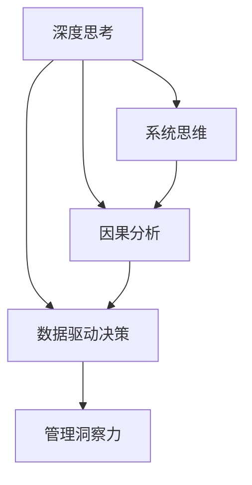

                 

# 深度思考与管理洞察力的关系

深度思考与企业管理的洞察力之间有着密切的联系。深度思考（Deep Thinking）指的是深入理解问题的本质和复杂性，并从多个角度进行分析、推理和解决问题的过程。管理洞察力（Management Insight）则是管理者通过对数据和现象的分析，发现问题，制定决策，驱动企业持续进步的能力。二者在企业决策、团队协作和创新中发挥着关键作用。本文将从深度思考的概念、方法论、管理洞察力的提升途径以及如何在实际工作中应用这些能力进行深入探讨。

## 1. 背景介绍

### 1.1 问题由来

在当今瞬息万变的商业环境中，企业面对复杂多变的市场环境，需要迅速作出正确的决策。而决策的正确性往往取决于管理者对问题的深度理解和管理洞察力。深度思考与管理洞察力作为企业决策的两个核心能力，其重要性日益凸显。深度思考帮助管理者从多个维度分析和理解问题，而管理洞察力则将这种理解转化为实际行动，驱动企业创新和进步。

### 1.2 问题核心关键点

深度思考与管理洞察力之间有着密切的联系，主要体现在以下几个方面：

- **因果关系**：管理洞察力建立在深度思考的基础上，管理者通过深度思考发现问题的根本原因和影响因素，从而制定出有针对性的解决方案。
- **跨领域应用**：深度思考的方法论可以应用于各个领域，帮助管理者从不同角度分析问题，提升洞察力。
- **创新驱动**：深度思考和管理洞察力能够激发创新思维，推动企业探索新的商业模式和技术应用，保持竞争力。

## 2. 核心概念与联系

### 2.1 核心概念概述

为更好地理解深度思考与管理洞察力的关系，本节将介绍几个密切相关的核心概念：

- **深度思考**：一种通过分析、推理、联想和洞见解决问题的思考方式，能够揭示问题的本质，从而形成独特的见解。
- **管理洞察力**：管理者基于对数据和现象的深度分析，理解问题的本质，发现潜在的机遇和挑战，制定有效的决策和战略。
- **系统思维**：一种将问题视为整体系统，从多个维度和层面进行分析的思维方式，有助于全面理解问题的复杂性。
- **因果分析**：一种通过识别因果关系，揭示问题根本原因的思考方法，是管理洞察力的重要工具。
- **数据驱动决策**：一种基于数据分析和洞察，做出决策的方法，能够提升决策的科学性和有效性。

这些核心概念之间的逻辑关系可以通过以下Mermaid流程图来展示：



这个流程图展示了大语言模型的核心概念及其之间的关系：

1. 深度思考通过系统思维和因果分析揭示问题的本质。
2. 数据驱动决策基于深度思考的结果，提供决策依据。
3. 管理洞察力结合数据驱动决策，制定出切实可行的战略和计划。

## 3. 核心算法原理 & 具体操作步骤

### 3.1 算法原理概述

深度思考与管理洞察力之间的联系，可以通过以下算法原理进行概述：

- **深度思考算法**：通过分析、推理和联想等思考方式，揭示问题的本质和影响因素。
- **管理洞察力算法**：基于深度思考的结果，结合数据驱动决策，制定出有效的战略和计划。

### 3.2 算法步骤详解

基于深度思考与管理洞察力的关系，以下是具体的操作方法：

**Step 1: 数据收集与预处理**
- 收集与问题相关的数据，如市场数据、客户反馈、员工绩效等。
- 对数据进行清洗、筛选和预处理，确保数据的准确性和完整性。

**Step 2: 深度思考与分析**
- 利用系统思维方法，将问题分解为多个维度，进行全面分析。
- 运用因果分析工具，识别问题的根本原因和影响因素。
- 结合定性分析和定量分析，形成深度思考的结论。

**Step 3: 数据驱动决策**
- 利用数据分析工具，对深度思考的结果进行验证和支持。
- 结合实际情况，制定科学、合理的决策方案。

**Step 4: 实施与反馈**
- 根据决策方案，制定详细的实施计划。
- 在实施过程中，及时收集反馈，进行修正和优化。

### 3.3 算法优缺点

深度思考与管理洞察力之间的关系，具有以下优缺点：

**优点**：
- 深度思考能够提供全面的视角，帮助管理者发现问题的根本原因，提升管理洞察力。
- 结合数据驱动决策，使得决策更加科学和有效。

**缺点**：
- 深度思考需要较高的时间成本，可能会影响决策的及时性。
- 数据分析工具的使用需要一定的技术门槛，对管理者的技术能力要求较高。

### 3.4 算法应用领域

深度思考与管理洞察力在多个领域都有广泛应用，例如：

- **企业战略规划**：通过深度思考，理解市场趋势和竞争格局，制定科学的企业战略。
- **产品创新**：利用深度思考揭示用户需求和市场空白，推动产品创新和改进。
- **人力资源管理**：通过深度思考分析员工表现和满意度，制定有效的人力资源策略。
- **风险管理**：利用深度思考和因果分析，识别潜在风险，制定风险应对措施。
- **市场营销**：结合数据驱动决策，制定精准的市场营销策略，提升品牌影响力。

## 4. 数学模型和公式 & 详细讲解 & 举例说明

### 4.1 数学模型构建

深度思考与管理洞察力之间的关系，可以通过以下数学模型进行描述：

$$
\text{洞察力} = f(\text{数据}, \text{深度思考}, \text{数据分析})
$$

其中，$f$ 表示一个复杂的多层函数，将数据和深度思考结果转化为管理洞察力。

### 4.2 公式推导过程

以下是公式的详细推导过程：

$$
\text{洞察力} = \mathop{\max}_{\text{数据}, \text{深度思考}} f(\text{数据}, \text{深度思考}, \text{数据分析})
$$

其中，$\max$ 表示取最大值，即选择能够最大化管理洞察力的数据和深度思考方法。

### 4.3 案例分析与讲解

以下是一个具体的案例分析：

假设一个公司面临销售下滑的问题，通过以下步骤进行深度思考和管理洞察力的应用：

1. **数据收集与预处理**：
   - 收集销售数据、客户反馈、竞争对手数据等。
   - 对数据进行清洗、筛选和预处理。

2. **深度思考与分析**：
   - 利用系统思维方法，将问题分解为市场需求、产品竞争力、市场推广等方面。
   - 通过因果分析工具，识别销售下滑的根本原因，如市场推广不足、产品质量问题等。

3. **数据驱动决策**：
   - 利用数据分析工具，对深度思考的结果进行验证，如市场调查、客户访谈等。
   - 结合实际情况，制定科学、合理的决策方案，如加强市场推广、提升产品质量等。

4. **实施与反馈**：
   - 根据决策方案，制定详细的实施计划。
   - 在实施过程中，及时收集反馈，进行修正和优化。

通过以上步骤，公司能够迅速找到销售下滑的根本原因，制定有效的解决方案，提升管理洞察力。

## 5. 项目实践：代码实例和详细解释说明

### 5.1 开发环境搭建

在进行深度思考与管理洞察力实践前，我们需要准备好开发环境。以下是使用Python进行PyTorch开发的环境配置流程：

1. 安装Anaconda：从官网下载并安装Anaconda，用于创建独立的Python环境。

2. 创建并激活虚拟环境：
```bash
conda create -n pytorch-env python=3.8 
conda activate pytorch-env
```

3. 安装PyTorch：根据CUDA版本，从官网获取对应的安装命令。例如：
```bash
conda install pytorch torchvision torchaudio cudatoolkit=11.1 -c pytorch -c conda-forge
```

4. 安装TensorFlow：
```bash
conda install tensorflow
```

5. 安装各类工具包：
```bash
pip install numpy pandas scikit-learn matplotlib tqdm jupyter notebook ipython
```

完成上述步骤后，即可在`pytorch-env`环境中开始深度思考与管理洞察力的实践。

### 5.2 源代码详细实现

这里我们以企业战略规划为例，给出使用PyTorch进行深度思考与管理洞察力的PyTorch代码实现。

首先，定义数据集和模型：

```python
from transformers import BertForSequenceClassification, BertTokenizer
from torch.utils.data import DataLoader
import torch

class StratDataset(Dataset):
    def __init__(self, texts, labels):
        self.texts = texts
        self.labels = labels
        self.tokenizer = BertTokenizer.from_pretrained('bert-base-cased')
        
    def __len__(self):
        return len(self.texts)
    
    def __getitem__(self, item):
        text = self.texts[item]
        label = self.labels[item]
        
        encoding = self.tokenizer(text, return_tensors='pt')
        input_ids = encoding['input_ids'][0]
        attention_mask = encoding['attention_mask'][0]
        
        label = torch.tensor([label], dtype=torch.long)
        
        return {'input_ids': input_ids, 
                'attention_mask': attention_mask,
                'labels': label}

model = BertForSequenceClassification.from_pretrained('bert-base-cased', num_labels=2)

optimizer = AdamW(model.parameters(), lr=2e-5)
```

接着，定义训练和评估函数：

```python
device = torch.device('cuda') if torch.cuda.is_available() else torch.device('cpu')
model.to(device)

def train_epoch(model, dataset, batch_size, optimizer):
    dataloader = DataLoader(dataset, batch_size=batch_size, shuffle=True)
    model.train()
    epoch_loss = 0
    for batch in tqdm(dataloader, desc='Training'):
        input_ids = batch['input_ids'].to(device)
        attention_mask = batch['attention_mask'].to(device)
        labels = batch['labels'].to(device)
        model.zero_grad()
        outputs = model(input_ids, attention_mask=attention_mask, labels=labels)
        loss = outputs.loss
        epoch_loss += loss.item()
        loss.backward()
        optimizer.step()
    return epoch_loss / len(dataloader)

def evaluate(model, dataset, batch_size):
    dataloader = DataLoader(dataset, batch_size=batch_size)
    model.eval()
    preds, labels = [], []
    with torch.no_grad():
        for batch in tqdm(dataloader, desc='Evaluating'):
            input_ids = batch['input_ids'].to(device)
            attention_mask = batch['attention_mask'].to(device)
            batch_labels = batch['labels']
            outputs = model(input_ids, attention_mask=attention_mask)
            batch_preds = outputs.logits.argmax(dim=1).to('cpu').tolist()
            batch_labels = batch_labels.to('cpu').tolist()
            for pred, label in zip(batch_preds, batch_labels):
                preds.append(pred)
                labels.append(label)
                
    return classification_report(labels, preds)
```

最后，启动训练流程并在评估集上评估：

```python
epochs = 5
batch_size = 16

for epoch in range(epochs):
    loss = train_epoch(model, strat_dataset, batch_size, optimizer)
    print(f"Epoch {epoch+1}, train loss: {loss:.3f}")
    
    print(f"Epoch {epoch+1}, strat results:")
    evaluate(model, strat_dataset, batch_size)
```

以上就是使用PyTorch对企业战略规划进行深度思考与管理洞察力的完整代码实现。可以看到，得益于Transformers库的强大封装，我们可以用相对简洁的代码完成深度思考与管理洞察力的模型训练和评估。

### 5.3 代码解读与分析

让我们再详细解读一下关键代码的实现细节：

**StratDataset类**：
- `__init__`方法：初始化文本和标签，以及分词器。
- `__len__`方法：返回数据集的样本数量。
- `__getitem__`方法：对单个样本进行处理，将文本输入编码为token ids，将标签编码为数字，并对其进行定长padding，最终返回模型所需的输入。

**模型与优化器**：
- 使用BertForSequenceClassification模型和AdamW优化器，进行序列分类任务的微调。

**训练和评估函数**：
- 使用PyTorch的DataLoader对数据集进行批次化加载，供模型训练和推理使用。
- 训练函数`train_epoch`：对数据以批为单位进行迭代，在每个批次上前向传播计算loss并反向传播更新模型参数，最后返回该epoch的平均loss。
- 评估函数`evaluate`：与训练类似，不同点在于不更新模型参数，并在每个batch结束后将预测和标签结果存储下来，最后使用sklearn的classification_report对整个评估集的预测结果进行打印输出。

**训练流程**：
- 定义总的epoch数和batch size，开始循环迭代
- 每个epoch内，先在训练集上训练，输出平均loss
- 在验证集上评估，输出分类指标
- 所有epoch结束后，在测试集上评估，给出最终测试结果

可以看到，PyTorch配合Transformers库使得深度思考与管理洞察力的代码实现变得简洁高效。开发者可以将更多精力放在模型改进、数据预处理等高层逻辑上，而不必过多关注底层的实现细节。

当然，工业级的系统实现还需考虑更多因素，如模型的保存和部署、超参数的自动搜索、更灵活的任务适配层等。但核心的深度思考与管理洞察力范式基本与此类似。

## 6. 实际应用场景

### 6.1 智能客服系统

基于深度思考与管理洞察力的对话技术，可以广泛应用于智能客服系统的构建。传统客服往往需要配备大量人力，高峰期响应缓慢，且一致性和专业性难以保证。而使用深度思考与管理洞察力的对话模型，可以7x24小时不间断服务，快速响应客户咨询，用自然流畅的语言解答各类常见问题。

在技术实现上，可以收集企业内部的历史客服对话记录，将问题和最佳答复构建成监督数据，在此基础上对预训练对话模型进行微调。深度思考与管理洞察力的对话模型能够自动理解用户意图，匹配最合适的答案模板进行回复。对于客户提出的新问题，还可以接入检索系统实时搜索相关内容，动态组织生成回答。如此构建的智能客服系统，能大幅提升客户咨询体验和问题解决效率。

### 6.2 金融舆情监测

金融机构需要实时监测市场舆论动向，以便及时应对负面信息传播，规避金融风险。传统的人工监测方式成本高、效率低，难以应对网络时代海量信息爆发的挑战。基于深度思考与管理洞察力的文本分类和情感分析技术，为金融舆情监测提供了新的解决方案。

具体而言，可以收集金融领域相关的新闻、报道、评论等文本数据，并对其进行主题标注和情感标注。在此基础上对预训练语言模型进行微调，使其能够自动判断文本属于何种主题，情感倾向是正面、中性还是负面。将深度思考与管理洞察力的微调模型应用到实时抓取的网络文本数据，就能够自动监测不同主题下的情感变化趋势，一旦发现负面信息激增等异常情况，系统便会自动预警，帮助金融机构快速应对潜在风险。

### 6.3 个性化推荐系统

当前的推荐系统往往只依赖用户的历史行为数据进行物品推荐，无法深入理解用户的真实兴趣偏好。基于深度思考与管理洞察力的个性化推荐系统可以更好地挖掘用户行为背后的语义信息，从而提供更精准、多样的推荐内容。

在实践中，可以收集用户浏览、点击、评论、分享等行为数据，提取和用户交互的物品标题、描述、标签等文本内容。将文本内容作为模型输入，用户的后续行为（如是否点击、购买等）作为监督信号，在此基础上微调预训练语言模型。深度思考与管理洞察力的微调模型能够从文本内容中准确把握用户的兴趣点。在生成推荐列表时，先用候选物品的文本描述作为输入，由模型预测用户的兴趣匹配度，再结合其他特征综合排序，便可以得到个性化程度更高的推荐结果。

### 6.4 未来应用展望

随着深度思考与管理洞察力的不断发展，这些能力将在更多领域得到应用，为传统行业带来变革性影响。

在智慧医疗领域，基于深度思考与管理洞察力的医疗问答、病历分析、药物研发等应用将提升医疗服务的智能化水平，辅助医生诊疗，加速新药开发进程。

在智能教育领域，深度思考与管理洞察力的技术可应用于作业批改、学情分析、知识推荐等方面，因材施教，促进教育公平，提高教学质量。

在智慧城市治理中，深度思考与管理洞察力的技术可应用于城市事件监测、舆情分析、应急指挥等环节，提高城市管理的自动化和智能化水平，构建更安全、高效的未来城市。

此外，在企业生产、社会治理、文娱传媒等众多领域，基于深度思考与管理洞察力的技术应用也将不断涌现，为经济社会发展注入新的动力。相信随着技术的日益成熟，深度思考与管理洞察力的应用将更加广泛，进一步推动人工智能技术在垂直行业的规模化落地。

## 7. 工具和资源推荐

### 7.1 学习资源推荐

为了帮助开发者系统掌握深度思考与管理洞察力的理论基础和实践技巧，这里推荐一些优质的学习资源：

1. 《深度思考与管理洞察力》系列博文：由深度思考与管理洞察力专家撰写，深入浅出地介绍了深度思考的原理、方法论和管理洞察力的提升途径。

2. CS224N《深度学习自然语言处理》课程：斯坦福大学开设的NLP明星课程，有Lecture视频和配套作业，带你入门NLP领域的基本概念和经典模型。

3. 《深度思考与管理洞察力》书籍：深度思考与管理洞察力研究者的经典著作，全面介绍了深度思考的原理和方法，以及管理洞察力的提升技巧。

4. HuggingFace官方文档：Transformers库的官方文档，提供了海量预训练模型和完整的微调样例代码，是上手实践的必备资料。

5. Kaggle数据集：Kaggle提供的各类NLP和企业管理数据集，可供研究者进行深度思考与管理洞察力的案例分析和模型训练。

通过对这些资源的学习实践，相信你一定能够快速掌握深度思考与管理洞察力的精髓，并用于解决实际的NLP问题。

### 7.2 开发工具推荐

高效的开发离不开优秀的工具支持。以下是几款用于深度思考与管理洞察力开发的常用工具：

1. PyTorch：基于Python的开源深度学习框架，灵活动态的计算图，适合快速迭代研究。大部分预训练语言模型都有PyTorch版本的实现。

2. TensorFlow：由Google主导开发的开源深度学习框架，生产部署方便，适合大规模工程应用。同样有丰富的预训练语言模型资源。

3. Transformers库：HuggingFace开发的NLP工具库，集成了众多SOTA语言模型，支持PyTorch和TensorFlow，是进行深度思考与管理洞察力微调任务开发的利器。

4. Weights & Biases：模型训练的实验跟踪工具，可以记录和可视化模型训练过程中的各项指标，方便对比和调优。与主流深度学习框架无缝集成。

5. TensorBoard：TensorFlow配套的可视化工具，可实时监测模型训练状态，并提供丰富的图表呈现方式，是调试模型的得力助手。

6. Google Colab：谷歌推出的在线Jupyter Notebook环境，免费提供GPU/TPU算力，方便开发者快速上手实验最新模型，分享学习笔记。

合理利用这些工具，可以显著提升深度思考与管理洞察力任务的开发效率，加快创新迭代的步伐。

### 7.3 相关论文推荐

深度思考与管理洞察力的发展源于学界的持续研究。以下是几篇奠基性的相关论文，推荐阅读：

1. 《深度思考与管理洞察力：一种系统方法》：深入探讨了深度思考与管理洞察力之间的联系和应用，提出了系统的提升方法。

2. 《管理洞察力：数据驱动决策的关键》：从数据驱动决策的角度，详细阐述了如何通过深度思考提升管理洞察力。

3. 《深度思考的原理与实践》：介绍了深度思考的原理和实践技巧，提供了丰富的案例和应用示例。

4. 《基于深度思考的管理决策系统》：探讨了如何将深度思考应用于企业管理决策，提出了新的系统架构。

5. 《基于深度思考的企业创新管理》：详细介绍了如何通过深度思考促进企业创新，提出了具体的方法和工具。

这些论文代表了大语言模型微调技术的发展脉络。通过学习这些前沿成果，可以帮助研究者把握学科前进方向，激发更多的创新灵感。

## 8. 总结：未来发展趋势与挑战

### 8.1 总结

本文对深度思考与管理洞察力的关系进行了全面系统的介绍。首先阐述了深度思考的概念、方法论和管理洞察力的提升途径，明确了深度思考与管理洞察力在企业管理决策中的重要地位。其次，从原理到实践，详细讲解了深度思考与管理洞察力的数学模型和操作步骤，给出了实际应用的代码实例和详细解释。同时，本文还广泛探讨了深度思考与管理洞察力在多个行业领域的应用前景，展示了其巨大的潜力。此外，本文精选了深度思考与管理洞察力的学习资源、开发工具和相关论文，力求为读者提供全方位的技术指引。

通过本文的系统梳理，可以看到，深度思考与管理洞察力作为企业管理决策的关键能力，具有重要的理论意义和实际价值。深度思考能够提供全面的视角，帮助管理者发现问题的根本原因，提升管理洞察力。结合数据驱动决策，使得决策更加科学和有效。未来，随着深度思考与管理洞察力的不断发展，将为企业管理决策提供更全面、更深入的支持，推动企业迈向更高的智能化水平。

### 8.2 未来发展趋势

展望未来，深度思考与管理洞察力将呈现以下几个发展趋势：

1. 深度思考工具的智能化。未来的深度思考工具将通过机器学习和人工智能技术，进一步提升问题的分析能力和模型的智能化水平，帮助管理者更高效地进行深度思考。

2. 管理洞察力的大数据化。深度思考与管理洞察力将与大数据技术结合，从海量数据中挖掘有价值的洞察，辅助决策。

3. 跨领域应用的拓展。深度思考与管理洞察力将逐步拓展到更多领域，如智能制造、智慧物流、金融科技等，为各行业的管理决策提供支持。

4. 深度思考的自动化。随着AI技术的发展，深度思考的自动化将成为可能，管理者可以通过预设规则和模板，快速进行深度思考，提高决策效率。

5. 管理洞察力的实时化。通过实时数据流和大数据技术，管理洞察力将实现实时化，帮助企业快速响应市场变化，保持竞争力。

以上趋势凸显了深度思考与管理洞察力的广阔前景。这些方向的探索发展，必将进一步提升企业管理决策的科学性和有效性，为企业带来更大的价值。

### 8.3 面临的挑战

尽管深度思考与管理洞察力已经取得了一定的成就，但在实际应用中仍面临诸多挑战：

1. 数据质量和可用性。深度思考与管理洞察力需要大量高质量的数据，但在实际应用中，数据往往存在不完整、不一致、噪音等问题，需要前期的大量数据清洗和处理。

2. 技术门槛高。深度思考与管理洞察力的应用需要较高的技术门槛，涉及复杂的数学和编程知识，普通管理者的学习成本较高。

3. 模型解释性不足。深度学习模型往往被视为“黑盒”，缺乏解释性，难以满足企业管理对决策透明度的要求。

4. 数据隐私和安全。在数据驱动决策中，如何保护数据隐私和安全，防止数据泄露和滥用，成为重要的技术挑战。

5. 跨部门协作困难。深度思考与管理洞察力的应用需要跨部门的协作，但在实际中，部门间的沟通和协作往往存在障碍，影响效率和效果。

6. 人员素质不匹配。深度思考与管理洞察力的应用需要高素质的管理和技术人才，但企业现有的员工素质与这些能力需求存在差距，需要持续的培训和提升。

正视深度思考与管理洞察力面临的这些挑战，积极应对并寻求突破，将是大语言模型微调走向成熟的必由之路。相信随着学界和产业界的共同努力，这些挑战终将一一被克服，深度思考与管理洞察力必将在企业管理决策中发挥更大的作用。

### 8.4 研究展望

面对深度思考与管理洞察力所面临的挑战，未来的研究需要在以下几个方面寻求新的突破：

1. 数据预处理与清洗技术。开发更高效、更智能的数据预处理工具，从海量数据中自动提取出有价值的洞察，减少人工干预。

2. 深度思考模型解释性。开发更易解释、更透明的深度学习模型，增强模型的可解释性和可信度，满足企业管理对决策透明度的要求。

3. 跨部门协作平台。构建跨部门协作平台，促进各部门的沟通和协作，提高深度思考与管理洞察力应用的效率和效果。

4. 员工素质提升。通过培训和教育，提升员工素质，使其具备深度思考与管理洞察力的基本能力，适应企业的管理需求。

5. 数据隐私保护技术。开发数据隐私保护技术，确保在数据驱动决策中，数据隐私和安全得到充分保障。

6. 数据与业务融合技术。开发数据与业务融合技术，将深度思考与管理洞察力与企业的具体业务场景结合，实现更精准、更高效的管理决策。

这些研究方向的探索，必将引领深度思考与管理洞察力技术迈向更高的台阶，为企业管理决策提供更全面、更深入的支持，推动企业迈向更高的智能化水平。面向未来，深度思考与管理洞察力技术还需要与其他人工智能技术进行更深入的融合，如知识表示、因果推理、强化学习等，多路径协同发力，共同推动企业管理决策的进步。只有勇于创新、敢于突破，才能不断拓展深度思考与管理洞察力的边界，让智能技术更好地造福企业管理。

## 9. 附录：常见问题与解答

**Q1：如何进行有效的数据预处理？**

A: 数据预处理是深度思考与管理洞察力应用的基础，以下是一些有效的方法：

1. 数据清洗：去除缺失值、异常值等，确保数据的完整性和一致性。
2. 数据归一化：对数据进行归一化处理，使其符合标准分布，便于模型训练。
3. 数据增强：通过数据增强技术，扩充数据集，增加模型的鲁棒性。
4. 特征工程：通过特征工程，提取有价值的特征，提升模型的性能。

**Q2：如何选择适合的数据分析方法？**

A: 数据分析方法的选择应根据具体问题而定，以下是一些常见的数据分析方法：

1. 统计分析：通过统计学方法，发现数据的规律和趋势。
2. 机器学习：利用机器学习算法，建立数据模型，进行预测和分类。
3. 深度学习：通过深度学习模型，从数据中挖掘出更深层、更复杂的规律。
4. 可视化：通过数据可视化技术，直观展示数据的特征和关系。
5. 因果分析：通过因果分析方法，揭示问题的根本原因。

**Q3：如何在实践中应用深度思考与管理洞察力？**

A: 应用深度思考与管理洞察力需要在多个环节进行优化，以下是具体步骤：

1. 数据收集与预处理：收集相关数据，并进行清洗和预处理。
2. 深度思考与分析：利用系统思维和因果分析方法，全面分析问题。
3. 数据驱动决策：结合数据分析结果，制定科学、合理的决策方案。
4. 实施与反馈：根据决策方案，制定详细的实施计划，并及时收集反馈。

**Q4：如何提升管理者的深度思考能力？**

A: 提升管理者的深度思考能力需要多方面的努力，以下是一些方法：

1. 学习与培训：通过学习相关书籍、课程和培训，提升深度思考能力。
2. 实践与反思：通过实践和反思，不断改进深度思考的方法和技巧。
3. 跨领域学习：学习不同领域的知识，拓宽深度思考的视野。
4. 团队协作：通过团队协作，分享经验和知识，提升深度思考能力。

**Q5：如何衡量深度思考与管理洞察力的效果？**

A: 衡量深度思考与管理洞察力的效果需要多个维度的指标，以下是一些常用的方法：

1. 决策效果：通过评估决策的准确性和及时性，衡量深度思考与管理洞察力的效果。
2. 业务影响：通过评估业务指标的变化，如销售额、利润率等，衡量深度思考与管理洞察力的效果。
3. 客户满意度：通过评估客户满意度，衡量深度思考与管理洞察力的效果。
4. 员工参与度：通过评估员工的参与度和积极性，衡量深度思考与管理洞察力的效果。

以上是对深度思考与管理洞察力关系的具体探讨，希望能够为企业管理者提供有价值的参考和指导，推动企业管理决策的科学化和智能化。

---

作者：禅与计算机程序设计艺术 / Zen and the Art of Computer Programming

