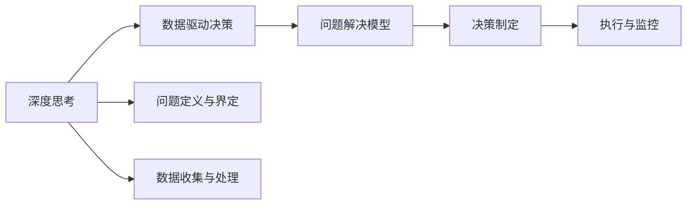

                 

# 深度思考与管理问题解决能力的提升

> 关键词：深度思考, 问题解决, 管理, 数据驱动, 人工智能, 决策优化, 案例分析

## 1. 背景介绍

### 1.1 问题由来
在当今快速变化和高度竞争的商业环境中，企业需要不断解决复杂多变的问题，以保持竞争优势。然而，传统依靠经验和直觉的管理方法往往难以应对复杂性，导致决策失误和资源浪费。为了更有效地应对这些问题，深度思考和管理问题解决能力的提升成为了企业和个人关注的焦点。

### 1.2 问题核心关键点
深度思考和管理问题解决能力的提升涉及多个方面，包括问题定义、数据收集、分析、决策制定和执行等环节。以下关键点概述了提升过程的核心内容：

1. **问题定义与界定**：准确地识别和界定问题是问题解决的首要步骤。明确问题性质、影响范围和解决目标，有助于后续的分析和决策。
2. **数据收集与处理**：收集高质量的数据是深度思考和管理问题解决的基础。数据需要经过清洗、筛选和处理，确保其相关性和完整性。
3. **数据分析与洞察**：通过定量和定性分析，发现数据背后的模式和趋势，为决策提供支持。
4. **决策制定**：基于数据和分析结果，制定合理的决策方案。
5. **执行与监控**：实施决策并持续监控其效果，根据反馈进行调整和优化。

### 1.3 问题研究意义
提升深度思考和管理问题解决能力，对于企业运营效率、创新能力和市场竞争力具有重要意义：

1. **提升运营效率**：通过精准的问题分析和决策，可以优化流程，减少浪费，提高资源利用率。
2. **增强创新能力**：深度思考能激发新的创意和解决方案，为企业带来突破性创新。
3. **提高市场竞争力**：及时应对市场变化，快速调整策略，在竞争中占据优势。
4. **促进员工成长**：鼓励员工进行深度思考，提升其问题解决能力和综合素质。

## 2. 核心概念与联系

### 2.1 核心概念概述

提升深度思考和管理问题解决能力，涉及到多个核心概念，包括深度思考、数据驱动决策、问题解决模型等。这些概念之间通过相互作用，形成了一个完整的问题解决框架：

1. **深度思考**：指对问题进行深入分析和全面思考，识别问题的根本原因和潜在的解决方案。
2. **数据驱动决策**：基于数据的分析和洞察，制定和调整决策方案。
3. **问题解决模型**：系统化的方法和框架，指导问题解决的整个过程。

这些概念之间的联系可以通过以下Mermaid流程图来展示：



这个流程图展示了深度思考和管理问题解决的核心流程：

1. 从深度思考开始，识别和界定问题。
2. 数据收集与处理，为决策提供依据。
3. 通过问题解决模型指导决策制定。
4. 实施决策并监控其效果。

## 3. 核心算法原理 & 具体操作步骤
### 3.1 算法原理概述

提升深度思考和管理问题解决能力，本质上是一个数据驱动的优化过程。其核心思想是：通过系统的数据分析和深度思考，找到最优的解决方案。

形式化地，假设问题的解决目标为 $O$，已有的数据集为 $D$，解决问题的模型为 $M$。提升过程的目标是最大化模型对数据的拟合程度，即：

$$
\max \limits_{M} \mathcal{L}(D, M) = \frac{1}{N} \sum_{i=1}^N (y_i - M(x_i))^2
$$

其中 $\mathcal{L}$ 为损失函数，$y_i$ 为数据 $x_i$ 的真实解决方案，$M(x_i)$ 为模型对数据 $x_i$ 的预测解决方案。通过梯度下降等优化算法，逐步调整模型参数，最小化损失函数，最终得到最优模型 $M^*$。

### 3.2 算法步骤详解

基于数据驱动的优化过程，提升深度思考和管理问题解决能力的一般步骤如下：

**Step 1: 问题定义与界定**
- 收集和分析相关文档、报告和背景资料，明确问题性质和解决目标。
- 制定具体的问题描述，包括问题类型（如技术问题、运营问题、市场问题等）、影响范围和优先级。

**Step 2: 数据收集与处理**
- 根据问题定义，收集相关的数据。数据来源包括内部系统记录、市场调研报告、客户反馈等。
- 对数据进行清洗和预处理，如去除噪音、填补缺失值、归一化等。
- 使用数据挖掘和可视化工具，发现数据背后的模式和趋势。

**Step 3: 数据分析与洞察**
- 采用统计分析、机器学习等方法，进行定量分析，评估问题的重要性和紧急程度。
- 通过定性分析，理解问题的深层次原因和潜在影响。
- 使用案例研究、情景模拟等方法，生成多角度的洞察，支持决策。

**Step 4: 决策制定**
- 基于数据和分析结果，制定初步的解决方案。
- 对多个方案进行比较和评估，选择最优方案。
- 如果数据不足或问题复杂，考虑采用多层次或迭代决策方法。

**Step 5: 执行与监控**
- 制定详细的执行计划，分配任务和资源，实施决策。
- 实时监控决策效果，收集反馈信息。
- 根据反馈进行调整和优化，确保决策的持续改进。

### 3.3 算法优缺点

提升深度思考和管理问题解决能力的算法具有以下优点：
1. **系统性**：基于数据驱动的方法，确保问题解决的全面性和系统性。
2. **科学性**：通过量化分析和统计方法，减少主观偏见，提高决策的客观性和准确性。
3. **可复用性**：一旦模型建立，可以应用于多个类似问题，提高效率。

同时，该方法也存在一些局限性：
1. **数据质量要求高**：需要高质量、全面、准确的数据支持。
2. **计算资源消耗大**：数据量大、复杂度高时，计算成本较高。
3. **模型复杂性**：需要选择合适的模型和算法，解决模型过拟合或欠拟合等问题。
4. **实施难度**：实际操作中，数据清洗、分析工具的选择和实施难度较大。

尽管存在这些局限性，但就目前而言，数据驱动的方法仍然是提升深度思考和管理问题解决能力的重要手段。未来相关研究的重点在于如何进一步降低数据依赖，提高模型的灵活性和可解释性，以及优化决策过程的效率。

### 3.4 算法应用领域

提升深度思考和管理问题解决能力的算法在多个领域中得到了广泛应用：

1. **企业管理**：通过数据分析和深度思考，优化运营流程，提高生产效率。
2. **市场营销**：利用客户数据和市场趋势，制定营销策略，提升市场份额。
3. **产品开发**：基于用户反馈和需求分析，快速迭代产品，满足市场需求。
4. **供应链管理**：通过数据分析和优化决策，提升供应链的灵活性和效率。
5. **金融投资**：利用历史数据和市场分析，制定投资策略，降低风险。

除了上述这些经典领域外，提升问题解决能力的方法也在更多新兴领域得到应用，如智能制造、智慧城市、智能交通等，为传统行业的数字化转型提供了新的技术支持。

## 4. 数学模型和公式 & 详细讲解 & 举例说明

### 4.1 数学模型构建

本节将使用数学语言对提升深度思考和管理问题解决能力的过程进行更加严格的刻画。

假设问题的解决目标为 $O$，已有的数据集为 $D$，解决问题的模型为 $M$。提升过程的目标是最大化模型对数据的拟合程度，即：

$$
\max \limits_{M} \mathcal{L}(D, M) = \frac{1}{N} \sum_{i=1}^N (y_i - M(x_i))^2
$$

其中 $\mathcal{L}$ 为损失函数，$y_i$ 为数据 $x_i$ 的真实解决方案，$M(x_i)$ 为模型对数据 $x_i$ 的预测解决方案。

### 4.2 公式推导过程

以下我们以数据驱动的优化算法为例，推导模型的参数更新公式。

假设模型 $M$ 为线性回归模型，即 $M(x_i) = \theta^T x_i$，其中 $\theta$ 为模型参数。损失函数 $\mathcal{L}$ 为均方误差，即：

$$
\mathcal{L}(D, M) = \frac{1}{N} \sum_{i=1}^N (y_i - M(x_i))^2
$$

对 $\theta$ 求导，得到：

$$
\nabla_{\theta}\mathcal{L}(D, M) = -2\frac{1}{N}\sum_{i=1}^N (y_i - M(x_i))x_i
$$

则参数的更新公式为：

$$
\theta \leftarrow \theta - \eta \nabla_{\theta}\mathcal{L}(D, M)
$$

其中 $\eta$ 为学习率，控制参数更新的步长。通过迭代更新 $\theta$，最小化损失函数 $\mathcal{L}(D, M)$，最终得到最优模型 $M^*$。

### 4.3 案例分析与讲解

假设某企业的销售数据存在问题，需要进行优化分析。具体步骤如下：

**Step 1: 问题定义与界定**
- 收集企业的销售记录和市场调研报告，识别销售下降的具体原因。
- 明确问题为“销售下降问题”，优先级为高，影响范围包括所有销售渠道。

**Step 2: 数据收集与处理**
- 从企业内部系统收集销售数据、库存数据、市场调研报告等。
- 对数据进行清洗，去除异常值，填补缺失值。
- 使用数据可视化工具，生成销售趋势图，发现销售下降的具体时间段。

**Step 3: 数据分析与洞察**
- 使用时间序列分析方法，评估销售下降的周期性和季节性因素。
- 通过回归分析，评估产品价格和市场需求对销售的影响。
- 结合市场调研报告，理解市场竞争环境的变化。

**Step 4: 决策制定**
- 初步方案为“调整产品价格”，但需进一步分析价格调整的影响。
- 制定多个方案，包括“提升营销投入”、“优化产品组合”等。
- 使用蒙特卡洛模拟方法，评估不同方案的效果。

**Step 5: 执行与监控**
- 实施价格调整方案，监控销售变化。
- 根据监控结果，适时调整营销策略。
- 收集客户反馈，优化产品组合。

## 5. 项目实践：代码实例和详细解释说明
### 5.1 开发环境搭建

在进行数据驱动的问题解决实践前，我们需要准备好开发环境。以下是使用Python进行Pandas和Scikit-learn开发的环境配置流程：

1. 安装Anaconda：从官网下载并安装Anaconda，用于创建独立的Python环境。

2. 创建并激活虚拟环境：
```bash
conda create -n data-driver-env python=3.8 
conda activate data-driver-env
```

3. 安装Pandas和Scikit-learn：
```bash
conda install pandas scikit-learn
```

4. 安装必要的工具包：
```bash
pip install matplotlib seaborn statsmodels statsmodels
```

完成上述步骤后，即可在`data-driver-env`环境中开始问题解决实践。

### 5.2 源代码详细实现

下面我以线性回归模型为例，给出使用Pandas和Scikit-learn进行数据驱动决策的PyTorch代码实现。

首先，定义数据处理函数：

```python
import pandas as pd
import seaborn as sns
import matplotlib.pyplot as plt
from sklearn.linear_model import LinearRegression
from sklearn.metrics import mean_squared_error

def load_data(file_path):
    data = pd.read_csv(file_path)
    return data

def clean_data(data):
    # 去除缺失值
    data = data.dropna()
    # 标准化数据
    data = (data - data.mean()) / data.std()
    return data

def visualize_data(data):
    sns.lineplot(x='date', y='sales', data=data)
    plt.show()

def train_model(data):
    # 分离特征和标签
    X = data.drop('sales', axis=1)
    y = data['sales']
    # 训练模型
    model = LinearRegression()
    model.fit(X, y)
    return model

def evaluate_model(model, data):
    # 预测并评估模型效果
    y_pred = model.predict(data)
    mse = mean_squared_error(data['sales'], y_pred)
    return mse
```

然后，定义数据预处理和模型训练函数：

```python
def preprocess_data(data):
    # 清洗数据
    cleaned_data = clean_data(data)
    # 可视化数据趋势
    visualize_data(cleaned_data)
    return cleaned_data

def train(data):
    # 预处理数据
    preprocessed_data = preprocess_data(data)
    # 训练模型
    model = train_model(preprocessed_data)
    return model
```

最后，启动数据驱动的决策流程并在测试集上评估：

```python
# 加载数据
data = load_data('sales_data.csv')

# 训练模型
model = train(data)

# 评估模型效果
mse = evaluate_model(model, data)
print(f'Mean Squared Error: {mse:.3f}')
```

以上就是使用Pandas和Scikit-learn进行数据驱动决策的完整代码实现。可以看到，Pandas和Scikit-learn使得数据预处理和模型训练变得简洁高效。

### 5.3 代码解读与分析

让我们再详细解读一下关键代码的实现细节：

**load_data函数**：
- 读取CSV文件，加载数据。

**clean_data函数**：
- 去除缺失值，标准化数据。

**visualize_data函数**：
- 使用Seaborn库绘制时间序列图，帮助理解数据趋势。

**train_model函数**：
- 分离特征和标签，训练线性回归模型。

**evaluate_model函数**：
- 使用均方误差评估模型预测效果。

**preprocess_data函数**：
- 数据清洗，数据可视化，预处理。

**train函数**：
- 数据预处理，模型训练。

**代码总结**：
- 通过Pandas和Scikit-learn，实现了数据清洗、数据可视化、模型训练和效果评估等关键步骤。
- 利用简单的线性回归模型，展示了如何通过数据驱动的方法解决实际问题。
- 实际应用中，还需要进一步扩展算法和模型，以应对复杂和多样化的数据。

## 6. 实际应用场景
### 6.1 企业管理

在企业管理中，数据驱动的深度思考和管理问题解决能力尤为关键。企业可以基于销售数据、运营数据、财务数据等，识别和解决各种运营问题。

具体而言，企业可以通过以下步骤进行问题解决：

**Step 1: 问题定义与界定**
- 收集企业的销售记录、运营数据、财务报告等，识别业务流程中的问题。
- 明确问题为“销售下降”、“成本上升”、“库存积压”等。

**Step 2: 数据收集与处理**
- 从企业内部系统收集相关的数据。
- 对数据进行清洗和预处理，确保数据的准确性和完整性。

**Step 3: 数据分析与洞察**
- 使用时间序列分析方法，评估销售下降的周期性和季节性因素。
- 通过回归分析，评估产品价格和市场需求对销售的影响。

**Step 4: 决策制定**
- 初步方案为“调整产品价格”、“提升营销投入”、“优化库存管理”等。
- 制定多个方案，并使用数据模拟方法评估方案效果。

**Step 5: 执行与监控**
- 实施价格调整、营销策略、库存优化等方案。
- 实时监控销售变化，收集客户反馈，及时调整策略。

### 6.2 市场营销

市场营销中，数据驱动的决策方法能够帮助企业更精准地制定和调整营销策略，提升市场份额和品牌影响力。

具体而言，企业可以基于客户数据、市场调研数据、销售数据等，进行问题解决。

**Step 1: 问题定义与界定**
- 收集客户反馈、市场调研报告、销售数据等，识别市场变化和客户需求。
- 明确问题为“市场份额下降”、“品牌影响力不足”等。

**Step 2: 数据收集与处理**
- 从内部系统、第三方数据平台等收集客户数据和市场调研数据。
- 对数据进行清洗和预处理，确保数据的准确性和完整性。

**Step 3: 数据分析与洞察**
- 使用客户分析工具，评估客户购买行为和偏好。
- 通过市场趋势分析，理解市场变化和竞争环境。

**Step 4: 决策制定**
- 初步方案为“提升品牌曝光度”、“优化产品定价”等。
- 制定多个方案，并使用A/B测试方法评估方案效果。

**Step 5: 执行与监控**
- 实施品牌推广、产品定价优化等方案。
- 实时监控市场反应，收集客户反馈，及时调整策略。

### 6.3 产品开发

产品开发中，数据驱动的决策方法能够帮助企业更快速地迭代和优化产品，满足市场需求。

具体而言，企业可以基于用户反馈、市场调研数据、产品销售数据等，进行问题解决。

**Step 1: 问题定义与界定**
- 收集用户反馈、市场调研报告、产品销售数据等，识别产品问题。
- 明确问题为“产品功能不足”、“用户体验不佳”等。

**Step 2: 数据收集与处理**
- 从内部系统、第三方数据平台等收集用户反馈和产品销售数据。
- 对数据进行清洗和预处理，确保数据的准确性和完整性。

**Step 3: 数据分析与洞察**
- 使用用户行为分析工具，评估产品使用情况和用户满意度。
- 通过市场趋势分析，理解市场需求和竞争环境。

**Step 4: 决策制定**
- 初步方案为“增加新功能”、“优化用户体验”等。
- 制定多个方案，并使用数据模拟方法评估方案效果。

**Step 5: 执行与监控**
- 实施产品功能优化、用户体验改进等方案。
- 实时监控产品反馈，收集用户反馈，及时调整策略。

### 6.4 未来应用展望

随着数据驱动的方法在多个领域的应用，未来的问题解决能力将得到进一步提升。展望未来，数据驱动的方法将呈现以下几个发展趋势：

1. **自动化决策**：引入机器学习、人工智能等技术，自动化数据处理和分析过程，提高决策效率。
2. **跨领域融合**：将数据驱动的方法与其他领域的技术（如物联网、区块链等）结合，拓展应用范围。
3. **实时处理**：利用大数据技术，实现数据的实时采集、处理和分析，快速响应市场变化。
4. **智能决策**：引入深度学习和神经网络等技术，提高决策的智能化和自动化水平。

这些趋势将使数据驱动的方法更加灵活、高效，为企业提供更强的竞争优势。未来，数据驱动的问题解决能力将成为企业运营的重要基础。

## 7. 工具和资源推荐
### 7.1 学习资源推荐

为了帮助开发者系统掌握数据驱动的深度思考和管理问题解决理论基础和实践技巧，这里推荐一些优质的学习资源：

1. 《数据驱动的决策科学》：该书系统介绍了数据驱动决策的原理、方法和应用，适合初学者和进阶学习者。
2. 《Python数据分析实战》：该书详细介绍了Pandas、Scikit-learn等库的使用方法，适合数据处理和模型训练的实践者。
3. 《机器学习实战》：该书通过实际案例，介绍了机器学习算法在各个领域的应用，适合实践者快速上手。
4. Kaggle：一个数据科学竞赛平台，提供丰富的数据集和竞赛项目，适合学习者进行实践和竞赛。
5. Coursera：提供多门数据科学和机器学习课程，适合系统学习数据驱动的方法和工具。

通过对这些资源的学习实践，相信你一定能够快速掌握数据驱动的问题解决能力，并用于解决实际的商业问题。

### 7.2 开发工具推荐

高效的工具支持能够显著提升数据驱动的问题解决能力，以下是几款推荐的工具：

1. Jupyter Notebook：一个交互式编程环境，支持多种编程语言，适合数据处理和模型训练。
2. Python：一个强大的编程语言，拥有丰富的数据处理和机器学习库，适合数据驱动的决策方法。
3. R：另一个强大的数据分析和统计工具，适合统计分析和可视化。
4. Microsoft Excel：一个功能强大的电子表格软件，适合简单的数据处理和分析。
5. Tableau：一个数据可视化工具，适合数据的探索和呈现。

合理利用这些工具，可以显著提升数据驱动的问题解决能力，加快创新迭代的步伐。

### 7.3 相关论文推荐

数据驱动的方法在多个领域得到了广泛研究，以下是几篇具有代表性的论文，推荐阅读：

1. "数据驱动决策的框架和方法"：探讨数据驱动决策的理论基础和实践方法。
2. "机器学习在产品开发中的应用"：介绍机器学习算法在产品开发中的具体应用。
3. "大数据技术在市场营销中的应用"：探讨大数据技术在市场营销中的具体应用。
4. "自动化决策系统"：介绍自动化决策系统的构建和应用。
5. "深度学习在智能制造中的应用"：介绍深度学习在智能制造中的具体应用。

这些论文代表了大数据驱动方法的发展脉络。通过学习这些前沿成果，可以帮助研究者把握学科前进方向，激发更多的创新灵感。

## 8. 总结：未来发展趋势与挑战
### 8.1 总结

本文对数据驱动的深度思考和管理问题解决能力进行了全面系统的介绍。首先阐述了数据驱动方法在提升问题解决能力中的核心作用，明确了问题解决的过程和关键步骤。其次，从原理到实践，详细讲解了数据驱动决策的数学模型和关键算法，给出了数据驱动决策的代码实例。同时，本文还广泛探讨了数据驱动方法在企业管理、市场营销、产品开发等多个领域的应用前景，展示了数据驱动方法的强大潜力。

通过本文的系统梳理，可以看到，数据驱动的方法在提升问题解决能力方面具有显著的优势，已经被广泛应用于多个行业。未来，数据驱动的方法将在更广泛的领域发挥作用，推动企业运营的智能化和自动化水平。

### 8.2 未来发展趋势

展望未来，数据驱动的方法将呈现以下几个发展趋势：

1. **自动化水平提升**：引入更多自动化工具和技术，进一步提高问题解决的效率。
2. **智能化程度加深**：引入更多智能算法，提高问题解决的精准性和自动化水平。
3. **跨领域应用拓展**：将数据驱动的方法与其他领域的技术结合，拓展应用范围。
4. **实时化处理增强**：利用大数据技术，实现数据的实时采集、处理和分析，快速响应市场变化。
5. **智能化决策推广**：引入深度学习和神经网络等技术，提高决策的智能化和自动化水平。

这些趋势将使数据驱动的方法更加灵活、高效，为企业提供更强的竞争优势。未来，数据驱动的问题解决能力将成为企业运营的重要基础。

### 8.3 面临的挑战

尽管数据驱动的方法已经取得了显著成就，但在迈向更加智能化、普适化应用的过程中，它仍面临诸多挑战：

1. **数据质量和可用性**：数据的质量和可用性直接影响问题解决的准确性和效率。需要确保数据的全面性、准确性和时效性。
2. **计算资源消耗**：数据量大、复杂度高时，计算成本较高。需要优化计算资源，提高问题解决的效率。
3. **模型复杂性**：需要选择适合的模型和算法，解决模型过拟合或欠拟合等问题。
4. **实施难度**：实际操作中，数据清洗、分析工具的选择和实施难度较大。
5. **可解释性**：数据驱动的方法往往难以解释其内部工作机制和决策逻辑。需要增强模型的可解释性，提高决策的可信度。

尽管存在这些挑战，但通过不断优化和改进，数据驱动的方法将越来越成熟，为企业运营带来更多的价值。

### 8.4 研究展望

未来，数据驱动的问题解决能力需要在以下几个方面寻求新的突破：

1. **数据质量提升**：通过数据清洗、数据增强等方法，提高数据的全面性和准确性。
2. **模型简化**：引入更简单、高效的模型和算法，降低计算成本，提高问题解决的效率。
3. **自动化优化**：引入自动化工具和技术，优化问题解决的各个环节，提高效率。
4. **智能决策优化**：引入深度学习和神经网络等技术，提高决策的智能化和自动化水平。
5. **可解释性增强**：通过可解释性方法，提高决策的可信度和可控性。

这些研究方向将使数据驱动的方法更加灵活、高效，为企业提供更强的竞争优势。只有勇于创新、敢于突破，才能不断拓展数据驱动的问题解决能力，推动人工智能技术的持续发展。

## 9. 附录：常见问题与解答

**Q1：数据驱动的方法是否适用于所有问题解决？**

A: 数据驱动的方法在处理数据丰富、结构清晰的问题时，效果显著。但对于一些需要深度思考和创造性解决的问题，如艺术创作、哲学思考等，数据驱动的方法可能无法胜任。

**Q2：如何选择合适的学习率？**

A: 学习率的选择需要根据具体问题调整。一般建议从小值开始尝试，逐步减小学习率，直至收敛。如果模型过拟合，可以尝试使用更小的学习率或添加正则化项。

**Q3：数据驱动的方法在落地部署时需要注意哪些问题？**

A: 在将数据驱动的方法转化为实际应用时，需要注意以下几个问题：
1. 数据隐私保护：确保数据的合法合规使用。
2. 系统架构设计：设计高效、可扩展的系统架构，支持大规模数据处理。
3. 实时性优化：优化数据处理和分析流程，提高响应速度。
4. 可靠性保障：确保系统的稳定性和可靠性，避免数据丢失和错误。
5. 安全防护：采取措施保护数据和系统的安全。

合理利用这些工具，可以显著提升数据驱动的问题解决能力，加快创新迭代的步伐。

通过本文的系统梳理，可以看到，数据驱动的方法在提升问题解决能力方面具有显著的优势，已经被广泛应用于多个行业。未来，数据驱动的方法将在更广泛的领域发挥作用，推动企业运营的智能化和自动化水平。

总之，数据驱动的深度思考和管理问题解决能力将成为企业运营的重要基础，助力企业在竞争中保持优势。

