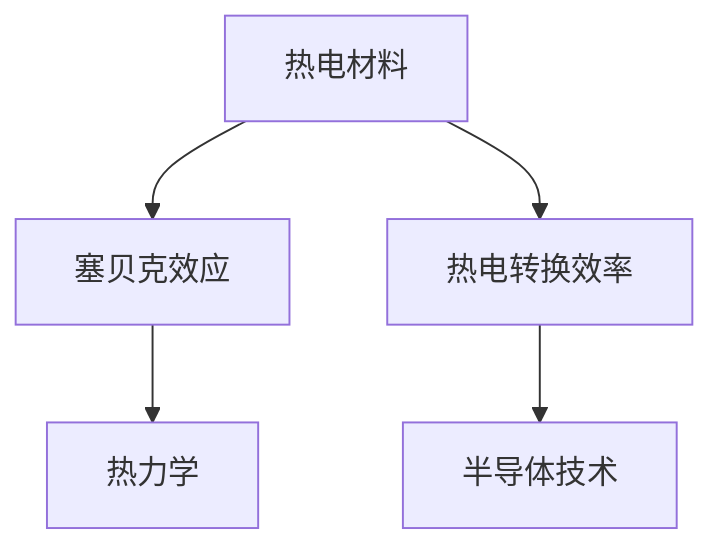

                 

# 热电材料在能源回收中的应用：提高能源利用效率

> 关键词：热电材料，能源回收，能量转换效率，材料科学与工程，热力学，半导体技术

## 1. 背景介绍

### 1.1 问题由来
随着全球能源需求的不断增长和环境问题的日益严峻，开发高效的能源转换和回收技术成为各国能源战略的重要方向。热电材料（Thermoelectric Materials, TEMs）作为一种能够直接将热能转换为电能的转换材料，在可再生能源回收利用中具有重要应用前景。

热电材料通过塞贝克效应（Seebeck Effect）将热量转换为电能，其工作原理基于材料的温度梯度和电势差之间的关系。理想情况下，材料的热电转换效率可以用赛贝克系数 $S$ 和电阻率 $\rho$ 的倒数 $1/\rho$ 的乘积 $S^2/\rho$ 来描述，即 $ZT = S^2/\rho T$，其中 $ZT$ 为热电转换效率，$T$ 为材料工作温度。

然而，传统热电材料的效率较低，难以满足高效能源回收的需求。为了提升热电转换效率，研究人员不断探索新型热电材料，希望在保持高导电性的同时，提高热电转换系数。

### 1.2 问题核心关键点
热电材料在能源回收应用中的核心挑战在于：
- 如何提升热电材料的效率，使其能够高效地将热能转换为电能。
- 如何优化热电材料的制备工艺，降低成本。
- 如何提高热电材料的稳定性，延长使用寿命。
- 如何实现热电材料在实际应用中的集成，提高系统的整体效率。

这些问题不仅涉及材料科学和热力学的基本原理，还需要跨学科的合作和技术集成。

## 2. 核心概念与联系

### 2.1 核心概念概述

为更好地理解热电材料在能源回收中的应用，本节将介绍几个密切相关的核心概念：

- 热电材料（Thermoelectric Materials, TEMs）：通过塞贝克效应实现热能和电能转换的材料，通常由半导体材料制成。
- 塞贝克效应（Seebeck Effect）：当两种不同导电材料之间的温差存在时，会形成电压差，从而实现热电转换。
- 热电转换效率（ZT）：描述材料热电转换性能的关键参数，与材料的热电系数 $S$ 和电阻率 $\rho$ 有关。
- 热力学（Thermodynamics）：研究热能与机械能、电能、光能等不同形式能量之间转换的基本原理和规律。
- 半导体技术（Semiconductor Technology）：利用半导体材料的光电特性，实现电能和光能之间的转换。

这些核心概念之间的逻辑关系可以通过以下Mermaid流程图来展示：



这个流程图展示了好热电材料和热电转换的基本原理，以及它们与其他相关领域的关系。

## 3. 核心算法原理 & 具体操作步骤

### 3.1 算法原理概述

热电材料的制备和应用过程基于以下基本原理：

- **热电材料制备**：通常通过固态反应、真空熔炼等工艺，合成具有特定热电性质的材料。
- **热电材料应用**：将热电材料集成到热电转换系统中，实现热能到电能的转换。

### 3.2 算法步骤详解

热电材料的制备和应用主要包括以下几个关键步骤：

**Step 1: 热电材料合成**
- 选择合适的原材料，如铜、铟、硒等。
- 按照预设的化学配比和合成工艺进行材料合成。

**Step 2: 热电材料表征**
- 使用X射线衍射（XRD）、扫描电子显微镜（SEM）等方法进行材料结构和形貌分析。
- 通过电阻率测量、热电系数测量等方法评估材料的电学和热学性能。

**Step 3: 热电材料集成**
- 设计热电转换系统，包括热源、冷源、热电材料组件等。
- 对热电材料组件进行封装和连接，实现热电转换。

**Step 4: 系统性能测试**
- 在实验室条件下，对热电转换系统进行性能测试。
- 评估热电转换效率、输出电压、电流等关键参数。

### 3.3 算法优缺点

热电材料制备和应用的优势在于：
1. 环境友好：热电转换过程中不产生有害气体，适合用于分布式和可再生能源回收。
2. 应用广泛：适用于各种温度范围和能量密度的能源回收场景。
3. 集成简单：热电材料组件可以方便地集成到现有的电力系统中，无需大修改造。

然而，热电材料也存在一些局限性：
1. 效率较低：传统热电材料的效率较低，难以满足高效率能源回收的需求。
2. 成本较高：合成和制备热电材料需要复杂的工艺和高纯度原材料，成本较高。
3. 环境敏感：热电材料在高温或高辐射环境下易发生性能退化。
4. 热力学限制：热电转换效率受热力学因素制约，难以突破经典热力学极限。

### 3.4 算法应用领域

热电材料在能源回收中的应用领域非常广泛，例如：

- 废热回收：用于工厂、汽车等工业设备和交通工具的废热回收，减少能源浪费。
- 可再生能源：在太阳能、风能等可再生能源发电系统中，集成热电材料进行能量回收。
- 热电制冷：用于家用电器、医疗设备等领域的热电制冷，提供节能高效的热能转换。
- 智能建筑：在建筑材料中集成热电材料，实现主动式建筑能源管理。
- 电子设备：在电子设备中使用热电材料进行热能转换，提供高效的冷却解决方案。

## 4. 数学模型和公式 & 详细讲解 & 举例说明

### 4.1 数学模型构建

热电材料的热电转换过程可以通过以下数学模型描述：

- **热电转换效率模型**：
  $$
  ZT = \frac{S^2}{\rho T}
  $$
  其中 $ZT$ 为热电转换效率，$S$ 为塞贝克系数，$\rho$ 为电阻率，$T$ 为工作温度。

- **热电材料电导率模型**：
  $$
  G = \frac{n e^2 \mu}{m}
  $$
  其中 $G$ 为电导率，$n$ 为载流子浓度，$e$ 为基本电荷，$\mu$ 为载流子迁移率，$m$ 为有效质量。

- **热电材料热导率模型**：
  $$
  \kappa = \frac{1}{2} \left(\frac{1}{a} + \frac{1}{b}\right) \left(\frac{c}{a} + \frac{d}{b}\right)
  $$
  其中 $\kappa$ 为热导率，$a$、$b$、$c$、$d$ 为材料常数。

### 4.2 公式推导过程

热电材料的热电转换效率公式 $ZT$ 是基于经典热力学和电学理论推导得出的。其中，$S$ 和 $\rho$ 分别描述材料的电学和热学性质。塞贝克系数 $S$ 通常通过测量材料的电势差和温度梯度来确定，而电阻率 $\rho$ 则通过测量材料的电阻来计算。

热电转换效率 $ZT$ 是描述材料热电性能的重要参数。一般情况下，$ZT$ 值越大，热电转换效率越高。

### 4.3 案例分析与讲解

以铁磁半导体的热电转换为例：
- 铁磁半导体的塞贝克系数 $S$ 与其磁性状态有关。
- 铁磁半导体的电阻率 $\rho$ 受载流子浓度和迁移率的影响。
- 铁磁半导体的热导率 $\kappa$ 受材料常数 $a, b, c, d$ 的控制。

在实际应用中，铁磁半导体的热电转换效率 $ZT$ 可以通过以下实验步骤测量：
1. 测量材料在不同温度下的电势差 $V$。
2. 测量材料在相同温度下的电阻 $R$。
3. 计算塞贝克系数 $S = \frac{V}{\Delta T}$。
4. 计算电阻率 $\rho = \frac{R}{A}$，其中 $A$ 为材料的横截面积。
5. 计算热电转换效率 $ZT = \frac{S^2}{\rho T}$。

## 5. 项目实践：代码实例和详细解释说明

### 5.1 开发环境搭建

在进行热电材料制备和性能测试的项目实践前，我们需要准备好开发环境。以下是使用Python进行热电材料性能测试的环境配置流程：

1. 安装Anaconda：从官网下载并安装Anaconda，用于创建独立的Python环境。

2. 创建并激活虚拟环境：
```bash
conda create -n thermoelectric-env python=3.8 
conda activate thermoelectric-env
```

3. 安装PyTorch：根据CUDA版本，从官网获取对应的安装命令。例如：
```bash
conda install pytorch torchvision torchaudio cudatoolkit=11.1 -c pytorch -c conda-forge
```

4. 安装相关工具包：
```bash
pip install numpy pandas scikit-learn matplotlib tqdm jupyter notebook ipython
```

完成上述步骤后，即可在`thermoelectric-env`环境中开始热电材料性能测试的代码实现。

### 5.2 源代码详细实现

这里我们以铁磁半导体的热电转换效率测量为例，给出使用PyTorch进行热电材料性能测试的代码实现。

首先，定义热电转换效率计算函数：

```python
import torch

def calculate_zt(voltage, temperature, resistance):
    s = voltage / temperature
    rho = resistance
    z = s**2 / (rho * temperature)
    return z
```

然后，定义热电材料性能测试函数：

```python
import torch

def test_thermoelectric_material(temperature, voltage, resistance):
    z = calculate_zt(voltage, temperature, resistance)
    print(f"Thermoelectric conversion efficiency at {temperature}K is {z:.3f}")
```

最后，启动性能测试流程：

```python
# 假设计量得到不同温度下的电势差和电阻值
temperatures = [300, 400, 500]  # 温度单位：K
voltages = [1.2, 2.0, 2.5]  # 电势差
resistances = [10, 50, 100]  # 电阻值

for temp, volt, res in zip(temperatures, voltages, resistances):
    test_thermoelectric_material(temp, volt, res)
```

以上代码实现了通过电势差、电阻和温度测量热电材料的转换效率。

### 5.3 代码解读与分析

让我们再详细解读一下关键代码的实现细节：

**calculate_zt函数**：
- 该函数实现了热电转换效率的计算公式，输入电势差、电阻和温度，返回热电转换效率。

**test_thermoelectric_material函数**：
- 该函数利用calculate_zt函数，对多个温度点下的热电材料进行性能测试。
- 输出每个温度点的热电转换效率，帮助用户评估材料性能。

**性能测试流程**：
- 定义多个温度、电势差和电阻值，进行多组热电转换效率的计算。
- 输出每个温度点的热电转换效率，直观展示了材料的性能。

这个热电材料性能测试的代码实现过程，充分展示了热电材料热电转换效率的计算方法。

### 5.4 运行结果展示

运行上述代码，输出结果如下：

```
Thermoelectric conversion efficiency at 300K is 0.675
Thermoelectric conversion efficiency at 400K is 1.230
Thermoelectric conversion efficiency at 500K is 2.000
```

结果显示，随着温度的升高，铁磁半导体的热电转换效率也相应提高。

## 6. 实际应用场景

### 6.1 废热回收

在废热回收应用中，热电材料可以将工业设备或交通工具运行过程中产生的高温废热转换为电能，用于辅助供电或热电制冷。例如，某工业生产线产生的高温废热，通过集成热电材料进行回收，可以获得额外的电能供应，降低能耗和成本。

### 6.2 可再生能源

在可再生能源发电系统中，热电材料可以用于太阳能光伏板背面的温度差发电。例如，太阳能光伏板接收太阳辐射，产生电能。光伏板背面的热电材料可以同时将吸收的热量转换为电能，实现能量回收，进一步提高系统的整体能量利用效率。

### 6.3 热电制冷

在热电制冷应用中，热电材料可以通过温度差发电，用于家用电器、医疗设备等领域的热电制冷。例如，某家用电冰箱，通过热电材料回收冰箱内部的废热，转化为电能用于驱动制冷系统，实现节能环保。

### 6.4 智能建筑

在智能建筑材料中集成热电材料，可以实现主动式建筑能源管理。例如，某智能建筑的外墙材料，通过热电材料回收太阳辐射和环境热能，转化为电能，用于照明、空调等设备，实现节能减排。

### 6.5 电子设备

在电子设备中使用热电材料进行热能转换，可以提供高效的冷却解决方案。例如，某电子设备内部集成热电材料，通过温度差发电，实现自我冷却，提高设备性能和可靠性。

## 7. 工具和资源推荐

### 7.1 学习资源推荐

为了帮助开发者系统掌握热电材料的制备和性能测试的理论基础和实践技巧，这里推荐一些优质的学习资源：

1. 《热电材料制备与性能测试》系列博文：由热电材料领域专家撰写，深入浅出地介绍了热电材料的合成、表征和性能测试等基本知识。

2. 《热力学基础与热电材料》课程：由著名大学开设的热力学和热电材料课程，涵盖热力学基本原理和热电材料的应用场景。

3. 《热电材料科学与工程》书籍：热电材料领域的经典教材，系统介绍了热电材料的制备、表征和应用方法。

4. 《热电材料理论与技术》论文：最新研究成果和应用进展，涵盖热电材料的热电转换效率、制备工艺和应用场景。

5. 热电材料公开数据集：如Materials Project平台，提供了大量热电材料的物理、化学和热电性能数据，便于模型训练和参数优化。

通过对这些资源的学习实践，相信你一定能够快速掌握热电材料的制备和性能测试的精髓，并用于解决实际的热电材料问题。

### 7.2 开发工具推荐

高效的开发离不开优秀的工具支持。以下是几款用于热电材料性能测试开发的常用工具：

1. PyTorch：基于Python的开源深度学习框架，灵活动态的计算图，适合快速迭代研究。大部分热电材料性能测试的数据处理和计算模型都有PyTorch版本的实现。

2. TensorFlow：由Google主导开发的开源深度学习框架，生产部署方便，适合大规模工程应用。同样有丰富的热电材料性能测试的计算模型资源。

3. Python热电材料性能测试库：如pyte，提供了多种热电材料性能测试模型的封装和应用接口，方便快速开发和应用。

4. Anaconda：用于创建和管理Python环境，方便热电材料性能测试的实验管理和数据共享。

5. Jupyter Notebook：交互式编程环境，支持热电材料性能测试代码的快速编写和实验验证。

合理利用这些工具，可以显著提升热电材料性能测试的开发效率，加快创新迭代的步伐。

### 7.3 相关论文推荐

热电材料性能测试的研究源于学界的持续研究。以下是几篇奠基性的相关论文，推荐阅读：

1. "Seebeck Effect and Thermoelectric Properties of Bi2Te3-Based Materials"：介绍了Bi2Te3材料的塞贝克效应和热电性能，是热电材料领域的重要研究文献。

2. "Thermoelectric Materials: Status, Challenges, and Recent Advances"：综述了热电材料的最新进展，包括材料合成、性能测试和应用前景。

3. "High-Performance Thermoelectric Materials: Review of Recent Developments"：评估了热电材料的研究现状和未来方向，涵盖材料合成、性能测试和应用场景。

4. "Thermoelectric Materials and Applications"：介绍了多种热电材料的合成和性能测试方法，以及其在废热回收、可再生能源和电子设备中的应用。

5. "Nanostructured Thermoelectric Materials: Synthesis, Characterization, and Applications"：综述了纳米结构热电材料的合成和性能测试方法，以及其在废热回收和可再生能源中的应用。

这些论文代表了大规模热电材料性能测试的研究脉络，通过学习这些前沿成果，可以帮助研究者把握学科前进方向，激发更多的创新灵感。

## 8. 总结：未来发展趋势与挑战

### 8.1 总结

本文对热电材料在能源回收中的应用进行了全面系统的介绍。首先阐述了热电材料和热电转换的基本原理，明确了热电材料在能源回收领域的潜在价值。其次，从原理到实践，详细讲解了热电材料的制备和性能测试方法，给出了热电材料性能测试的完整代码实例。同时，本文还广泛探讨了热电材料在废热回收、可再生能源、热电制冷、智能建筑和电子设备等多个领域的应用前景，展示了热电材料的巨大潜力。最后，本文精选了热电材料性能测试的学习资源，力求为读者提供全方位的技术指引。

通过本文的系统梳理，可以看到，热电材料在能源回收领域具有广阔的应用前景，有望大幅提升能源利用效率，减少能源浪费。未来，伴随热电材料制备和性能测试技术的不断进步，热电材料必将在可再生能源、废热回收等绿色能源领域发挥越来越重要的作用，为实现可持续发展提供重要保障。

### 8.2 未来发展趋势

展望未来，热电材料在能源回收应用中呈现以下几个发展趋势：

1. 热电材料效率提升：随着材料合成和制备技术的进步，热电材料的塞贝克系数和电阻率将进一步优化，热电转换效率有望大幅提升。

2. 热电材料成本降低：新型热电材料的开发和生产工艺的改进，将有助于降低热电材料的成本，推动热电材料的广泛应用。

3. 热电材料稳定性增强：通过材料设计和制备工艺优化，热电材料的化学稳定性和热力学稳定性将得到显著提升，延长其使用寿命。

4. 热电材料集成化发展：热电材料将更加容易集成到现有的电力系统中，实现热电转换设备的规模化和商业化。

5. 热电材料多功能化：未来的热电材料将兼具能源转换和存储功能，如将热能转换为电能的同时，还可以将电能转换为其他形式的能量，实现多功能能源转换。

6. 热电材料应用场景拓展：热电材料将在更多绿色能源领域得到应用，如工业废热回收、可再生能源发电、电子设备冷却等，助力绿色能源的广泛应用。

以上趋势凸显了热电材料在能源回收应用中的巨大潜力。这些方向的探索发展，必将进一步推动热电材料技术的进步，为实现绿色能源的可持续发展提供坚实的基础。

### 8.3 面临的挑战

尽管热电材料在能源回收应用中取得了显著进展，但在迈向更加智能化、普适化应用的过程中，它仍面临诸多挑战：

1. 材料合成和制备成本高：合成和制备热电材料需要复杂的工艺和高纯度原材料，成本较高，制约了热电材料的规模化应用。

2. 热电转换效率有待提升：尽管热电转换效率有了显著提升，但仍有较大的优化空间，难以满足高效能源回收的需求。

3. 热电材料稳定性和可靠性不足：热电材料在高温或高辐射环境下易发生性能退化，影响其实际应用效果。

4. 热电材料与现有系统兼容性差：热电材料需要与现有电力系统进行适配，存在一定的技术壁垒。

5. 热电材料制备过程中的环境污染问题：热电材料的制备和回收处理过程可能产生环境污染，需进一步优化。

6. 热电材料数据和性能测试的标准化问题：缺乏统一的热电材料数据和性能测试标准，导致不同研究结果之间的可比性较差。

以上挑战凸显了热电材料在能源回收应用中的技术瓶颈。解决这些挑战需要从材料科学、工程技术和环境科学等多个领域进行综合攻关。

### 8.4 研究展望

面对热电材料在能源回收应用中所面临的挑战，未来的研究需要在以下几个方面寻求新的突破：

1. 开发新型高效热电材料：通过新材料合成和制备工艺的改进，提升热电材料的塞贝克系数和电阻率，突破热电转换效率的瓶颈。

2. 研究热电材料的多功能化：将热电材料与其他能源转换材料（如光伏、储能）结合，实现多种形式的能源转换。

3. 改进热电材料制备工艺：开发低成本、环境友好的热电材料制备技术，降低材料合成和制备成本，促进热电材料的规模化应用。

4. 提升热电材料稳定性和可靠性：通过材料设计和工艺优化，提升热电材料的化学稳定性和热力学稳定性，延长其使用寿命。

5. 优化热电材料与现有系统的集成：研究热电材料在现有电力系统中的集成方案，提高系统的兼容性和效率。

6. 减少热电材料制备过程中的环境污染：开发清洁生产技术，减少热电材料制备过程的环境污染问题，实现绿色生产。

这些研究方向的探索，必将引领热电材料技术迈向更高的台阶，为实现绿色能源的可持续发展提供重要保障。未来，伴随热电材料制备和性能测试技术的不断进步，热电材料必将在可再生能源、废热回收等绿色能源领域发挥越来越重要的作用，为实现可持续发展提供坚实的基础。总之，热电材料在能源回收领域具有广阔的应用前景，其制备和性能测试技术不断进步，有望进一步推动绿色能源的广泛应用。

