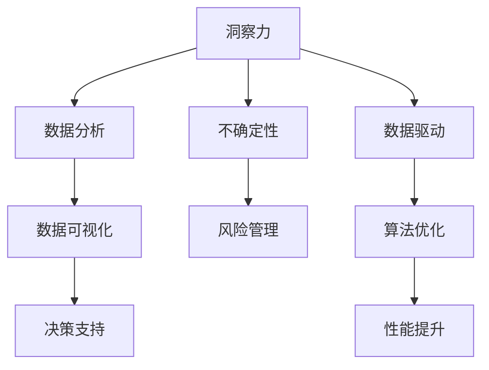

                 

# 理解洞察力的价值：在不确定性中的优势

> 关键词：洞察力,不确定性,优势,决策分析,认知科学,数据驱动,人工智能

## 1. 背景介绍

### 1.1 问题由来
在当今快速变化的商业环境中，企业面临诸多不确定性因素，如市场需求变化、技术进步、竞争格局等。为了在竞争中保持领先，企业必须不断优化其决策过程，提高洞察力和判断力。然而，传统的决策方法在面对复杂问题时，往往难以提供有效支持。

近年来，随着人工智能和大数据技术的兴起，通过数据驱动的洞察力分析成为企业应对不确定性的重要手段。大数据和机器学习技术提供了前所未有的数据量和计算能力，使得基于数据的决策分析成为可能。

但数据驱动的洞察力分析并非万能。企业仍需要具备快速识别和提取关键数据的能力，以及对数据背后隐含的趋势和规律进行深入理解。这就需要我们深入研究洞察力的价值，把握其中的关键要素和运用方法。

### 1.2 问题核心关键点
洞察力在企业决策中的价值主要体现在以下几个方面：

1. **快速反应**：通过数据分析，企业能够迅速识别市场机会和风险，及时调整策略。
2. **精确决策**：基于数据驱动的分析，企业可以做出更为精确的决策，减少人为偏差和主观判断。
3. **持续改进**：洞察力的提升是一个持续过程，通过不断的数据分析和反馈，企业可以持续优化其决策模型。
4. **风险管理**：通过洞察力分析，企业可以识别潜在的风险因素，提前制定应对措施。

但如何有效利用数据和算法提升洞察力，尤其是在面对不确定性的情况下，仍是一个具有挑战性的问题。本文将从核心概念、算法原理、操作步骤等多个方面，深入探讨如何通过数据驱动的方法，增强企业的洞察力，从而在不确定性环境中取得优势。

## 2. 核心概念与联系

### 2.1 核心概念概述

为了更好地理解洞察力的价值，我们需要先了解一些核心概念：

- **洞察力(Insight)**：指在复杂数据中发现隐藏的模式、趋势和关联的能力。洞察力分析旨在通过数据分析和挖掘，揭示数据背后的重要信息，支持决策制定。
- **不确定性(Uncertainty)**：指在决策过程中面临的无法准确预测的因素，如市场变化、政策调整等。
- **数据驱动(Data-Driven)**：指利用数据和算法，通过量化分析，指导决策的过程。

这三个概念相互联系，构成了一个有效的决策支持框架。洞察力通过数据分析挖掘，帮助企业在不确定性环境中，做出更为准确、快速的决策。

### 2.2 核心概念原理和架构的 Mermaid 流程图



这个流程图展示了洞察力在企业决策过程中的作用：
1. **数据分析**：通过各种数据处理和分析技术，如统计分析、机器学习等，从数据中提取有价值的信息。
2. **数据可视化**：将分析结果转化为图表、报告等形式，直观展示数据趋势和模式。
3. **决策支持**：基于可视化的分析结果，结合专家经验，做出决策。
4. **风险管理**：评估不确定性因素，识别潜在风险，制定应对策略。
5. **数据驱动**：利用数据和算法，自动化决策过程，减少人为偏差。
6. **算法优化**：不断优化算法模型，提高洞察力的精度和效率。

## 3. 核心算法原理 & 具体操作步骤

### 3.1 算法原理概述

基于数据的洞察力分析，其核心算法原理在于数据挖掘和机器学习。通过统计分析和机器学习算法，从大量数据中提取关键特征和模式，用于支持决策。

常用的算法包括：

- **统计分析**：如回归分析、主成分分析、聚类分析等，用于数据描述和特征提取。
- **机器学习**：如决策树、随机森林、神经网络等，用于模型训练和预测。

洞察力分析的目标是通过这些算法，揭示数据背后的规律和趋势，辅助决策。

### 3.2 算法步骤详解

以下是数据驱动的洞察力分析的一般步骤：

**Step 1: 数据收集与预处理**
- 收集与决策相关的数据，如市场数据、客户数据、运营数据等。
- 对数据进行清洗、归一化、去重等预处理，确保数据质量。

**Step 2: 数据探索与分析**
- 使用统计分析方法，如描述性统计、相关性分析等，探索数据的基本特征和关系。
- 应用机器学习算法，进行特征工程和模型训练，提取关键特征和模式。

**Step 3: 数据可视化**
- 使用数据可视化工具，如Tableau、Power BI等，将分析结果以图表、报表形式展示。
- 利用交互式可视化，帮助决策者直观理解数据趋势和模式。

**Step 4: 决策支持与优化**
- 结合专家经验，基于可视化结果，进行决策制定。
- 对决策结果进行跟踪和评估，根据反馈进行优化。

**Step 5: 风险管理**
- 识别潜在的不确定性因素，评估其对决策的影响。
- 制定应对策略，如调整预算、优化产品线等，减少风险。

### 3.3 算法优缺点

**优点**：
1. **客观性**：数据驱动的洞察力分析，依赖于数据和算法，减少了主观判断和偏见。
2. **效率高**：自动化处理大量数据，提高分析速度和决策效率。
3. **可重复性**：算法模型具有可重复性，可以持续优化和提升。

**缺点**：
1. **数据质量依赖**：数据质量和完整性直接影响分析结果。
2. **算法复杂性**：复杂算法需要专业知识，难以普及。
3. **解释性不足**：黑箱算法模型难以解释其决策过程，可能缺乏透明度。

### 3.4 算法应用领域

数据驱动的洞察力分析在多个领域得到了广泛应用，如：

- **市场营销**：通过分析客户数据，识别市场需求和行为模式，优化营销策略。
- **供应链管理**：利用运营数据，优化库存管理、物流规划等。
- **金融分析**：分析交易数据，识别市场趋势和风险，指导投资决策。
- **产品开发**：基于市场反馈数据，改进产品设计和功能。
- **风险评估**：识别潜在风险因素，制定风险管理策略。

## 4. 数学模型和公式 & 详细讲解 & 举例说明

### 4.1 数学模型构建

在本节中，我们将介绍一些常用的数学模型和公式，以辅助理解洞察力分析的原理。

**回归模型**：
$$
y = \beta_0 + \beta_1 x_1 + \beta_2 x_2 + ... + \beta_n x_n + \epsilon
$$

其中 $y$ 为因变量，$x_i$ 为自变量，$\beta_i$ 为回归系数，$\epsilon$ 为误差项。回归模型用于描述变量之间的关系，通过最小化误差项，拟合最佳拟合线。

**主成分分析(PCA)**：
$$
\mathbf{U} = \mathbf{X} \mathbf{V} \mathbf{D}^{-1/2}
$$

其中 $\mathbf{X}$ 为原始数据矩阵，$\mathbf{V}$ 为特征向量矩阵，$\mathbf{D}$ 为特征值对角矩阵。PCA用于降维，通过线性变换，提取数据的主要特征。

**随机森林**：
$$
\hat{y} = \sum_{k=1}^{K} \frac{N_k}{N} y_k
$$

其中 $y_k$ 为随机森林第 $k$ 棵树预测结果，$N_k$ 为第 $k$ 棵树覆盖的样本数，$N$ 为总样本数。随机森林通过集成多个决策树，提高预测精度和鲁棒性。

### 4.2 公式推导过程

**回归模型推导**：
设样本数据集 $\{(x_i, y_i)\}_{i=1}^n$，回归模型为 $y = \beta_0 + \beta_1 x_1 + ... + \beta_n x_n + \epsilon$。最小二乘法目标函数为：

$$
\min \sum_{i=1}^n (y_i - \hat{y}_i)^2
$$

其中 $\hat{y}_i = \beta_0 + \beta_1 x_{i1} + ... + \beta_n x_{in}$。通过求解目标函数的最小值，可以得到回归系数 $\beta_i$。

**PCA推导**：
设原始数据矩阵 $\mathbf{X}$，其协方差矩阵为 $\mathbf{S}$，特征值分解为 $\mathbf{S} = \mathbf{V} \mathbf{D} \mathbf{V}^T$。主成分分析通过选择前 $k$ 个最大特征值对应的特征向量，构成投影矩阵 $\mathbf{V}$，从而实现数据的降维。

**随机森林推导**：
随机森林通过随机选取样本和特征，构建多棵决策树。对于样本 $(x, y)$，第 $k$ 棵树预测结果为 $y_k = \hat{y}_k(x)$，最终预测结果为：

$$
\hat{y} = \sum_{k=1}^{K} \frac{N_k}{N} y_k
$$

其中 $N_k$ 为第 $k$ 棵树覆盖的样本数，$N$ 为总样本数。

### 4.3 案例分析与讲解

**案例1: 客户流失分析**
- **数据收集**：收集客户历史交易数据、客户属性数据等。
- **数据分析**：应用回归模型，分析客户流失与交易金额、购买频率、客户满意度等变量之间的关系。
- **可视化**：通过散点图、热力图等，直观展示关键变量对客户流失的影响。
- **决策支持**：根据分析结果，优化客户关系管理策略，减少客户流失率。

**案例2: 市场趋势预测**
- **数据收集**：收集历史销售数据、市场价格数据、消费者行为数据等。
- **数据分析**：应用时间序列分析方法，预测市场趋势和波动。
- **可视化**：通过折线图、预测曲线等，展示市场趋势预测结果。
- **决策支持**：根据预测结果，调整销售策略，优化库存管理。

## 5. 项目实践：代码实例和详细解释说明

### 5.1 开发环境搭建

在进行数据驱动的洞察力分析项目实践时，我们需要准备好开发环境。以下是使用Python进行项目开发的环境配置流程：

1. 安装Anaconda：从官网下载并安装Anaconda，用于创建独立的Python环境。

2. 创建并激活虚拟环境：
```bash
conda create -n insight-env python=3.8 
conda activate insight-env
```

3. 安装Python依赖库：
```bash
conda install numpy pandas scikit-learn matplotlib seaborn jupyter notebook
```

完成上述步骤后，即可在`insight-env`环境中开始项目实践。

### 5.2 源代码详细实现

以下是一个使用Python进行数据分析和洞察力分析的代码实例。我们将使用Python的Pandas、Matplotlib、Scikit-learn等库，进行数据处理、分析和可视化。

首先，导入必要的库：

```python
import pandas as pd
import numpy as np
import matplotlib.pyplot as plt
from sklearn.linear_model import LinearRegression
from sklearn.decomposition import PCA
from sklearn.ensemble import RandomForestRegressor
```

然后，定义数据处理函数：

```python
def load_data(filename):
    data = pd.read_csv(filename)
    return data
```

接着，使用回归模型分析客户流失数据：

```python
# 加载数据
data = load_data('customer_loss_data.csv')

# 特征工程
X = data[['transaction_amount', 'purchase_frequency', 'satisfaction_score']]
y = data['churn']

# 回归模型训练
model = LinearRegression()
model.fit(X, y)

# 预测和可视化
preds = model.predict(X)
plt.scatter(X['transaction_amount'], preds)
plt.xlabel('Transaction Amount')
plt.ylabel('Churn Prediction')
plt.show()
```

最后，使用PCA和随机森林分析市场趋势数据：

```python
# 加载数据
data = load_data('market_trend_data.csv')

# PCA降维
pca = PCA(n_components=2)
X_pca = pca.fit_transform(data[['price', 'volume']])

# 随机森林预测
model = RandomForestRegressor()
model.fit(X_pca, data['future_price'])

# 可视化
plt.scatter(X_pca[:, 0], X_pca[:, 1], c=model.predict(X_pca), cmap='viridis')
plt.xlabel('Price')
plt.ylabel('Volume')
plt.show()
```

以上就是使用Python进行数据分析和洞察力分析的代码实例。通过简单的数据处理、模型训练和可视化，可以帮助决策者直观理解数据背后的规律和趋势，支持决策制定。

### 5.3 代码解读与分析

让我们再详细解读一下关键代码的实现细节：

**load_data函数**：
- 使用Pandas的read_csv方法，从文件中加载数据。
- 返回加载的数据，便于后续处理。

**回归模型分析**：
- 使用线性回归模型，拟合客户流失与交易金额、购买频率、客户满意度等变量之间的关系。
- 通过散点图，展示预测结果，直观展示关键变量对客户流失的影响。

**PCA降维和随机森林预测**：
- 使用PCA对市场价格和交易量进行降维，提取主要特征。
- 使用随机森林模型，预测未来价格，并通过散点图展示预测结果。

这些代码展示了数据驱动的洞察力分析的基本流程，即数据加载、特征工程、模型训练和结果可视化。

## 6. 实际应用场景

### 6.1 市场营销

数据驱动的洞察力分析在市场营销中具有重要应用。通过分析客户数据，企业可以识别市场趋势、客户偏好和行为模式，优化营销策略。

具体而言，可以收集客户购买数据、社交媒体互动数据、网站访问数据等，应用回归、聚类等算法，提取关键特征和模式。通过可视化工具，展示客户分群、营销效果、市场趋势等，帮助企业制定精准的营销方案。

### 6.2 供应链管理

供应链管理面临诸多不确定性因素，如需求波动、供应商风险等。数据驱动的洞察力分析，可以帮助企业预测需求、优化库存、管理供应链风险。

通过分析历史销售数据、库存数据、供应商数据等，应用时间序列、回归等算法，预测未来需求和供应情况。通过可视化工具，展示预测结果，帮助企业制定科学的库存和采购计划，减少供应链风险。

### 6.3 金融分析

金融市场变化莫测，数据驱动的洞察力分析可以帮助企业识别市场趋势、评估风险、优化投资决策。

收集历史交易数据、市场数据、公司财务数据等，应用回归、时间序列、随机森林等算法，分析市场趋势、评估风险、预测未来价格。通过可视化工具，展示分析结果，帮助企业做出科学的投资决策。

### 6.4 未来应用展望

随着数据和计算技术的不断进步，数据驱动的洞察力分析将在更多领域得到应用，为企业带来更大价值。

- **医疗健康**：通过分析患者数据、医疗记录等，预测疾病趋势，优化治疗方案。
- **智能制造**：分析设备数据、生产数据等，优化生产流程，提高生产效率。
- **智慧城市**：分析交通数据、气象数据等，优化城市管理，提高城市运行效率。

未来，数据驱动的洞察力分析将与人工智能、物联网等技术深度融合，为企业提供更为全面、精准的决策支持。

## 7. 工具和资源推荐

### 7.1 学习资源推荐

为了帮助开发者系统掌握数据驱动的洞察力分析的理论基础和实践技巧，这里推荐一些优质的学习资源：

1. **《Python数据科学手册》**：全面介绍了Python在数据科学领域的应用，包括数据处理、分析、可视化等。
2. **Coursera《数据科学与机器学习》课程**：由斯坦福大学教授讲授，涵盖数据科学和机器学习的基本概念和常用算法。
3. **Kaggle竞赛平台**：参与实际数据竞赛，通过实践提升数据处理和分析能力。
4. **KDnuggets博客**：提供大量数据科学和机器学习相关的文章和教程，适合学习进阶。

通过这些资源的学习实践，相信你一定能够快速掌握数据驱动的洞察力分析的精髓，并用于解决实际的商业问题。

### 7.2 开发工具推荐

高效的数据驱动洞察力分析开发需要依赖一系列工具。以下是几款常用的开发工具：

1. **Jupyter Notebook**：免费的交互式开发环境，支持Python、R等多种编程语言。
2. **RStudio**：R语言的数据科学集成开发环境，提供丰富的可视化工具和统计分析功能。
3. **Tableau**：流行的商业智能工具，支持多种数据源，提供丰富的可视化图表。
4. **Power BI**：微软推出的商业智能工具，支持多种数据源，提供丰富的可视化报表。
5. **Python库**：Pandas、NumPy、Scikit-learn等，提供强大的数据处理和分析功能。

合理利用这些工具，可以显著提升数据驱动洞察力分析的开发效率，加快创新迭代的步伐。

### 7.3 相关论文推荐

数据驱动的洞察力分析的发展得益于众多学者的研究。以下是几篇奠基性的相关论文，推荐阅读：

1. **《数据挖掘：方法与应用》**：介绍数据挖掘的基本概念、方法和应用，适合入门学习。
2. **《Python数据科学手册》**：全面介绍Python在数据科学领域的应用，涵盖数据处理、分析、可视化等。
3. **《机器学习：实战案例》**：通过实际案例，介绍机器学习算法的应用，适合实践应用。

这些论文代表了数据驱动洞察力分析的发展脉络，通过学习这些前沿成果，可以帮助研究者把握学科前进方向，激发更多的创新灵感。

## 8. 总结：未来发展趋势与挑战

### 8.1 研究成果总结

数据驱动的洞察力分析已成为企业应对不确定性、提升决策能力的重要手段。通过数据挖掘和机器学习算法，企业能够从复杂数据中提取关键特征和模式，支持科学决策。

### 8.2 未来发展趋势

未来，数据驱动的洞察力分析将呈现以下几个发展趋势：

1. **算法创新**：随着深度学习、强化学习等技术的进步，新的算法模型将不断涌现，提升洞察力分析的精度和效率。
2. **多模态融合**：融合文本、图像、语音等多种数据源，实现更全面、精准的洞察力分析。
3. **自动化增强**：利用自动化工具和流程，减少人工干预，提升洞察力分析的效率和可重复性。
4. **隐私保护**：随着数据隐私和安全问题日益突出，如何在保障隐私的前提下进行洞察力分析，将是一个重要研究方向。
5. **跨领域应用**：将洞察力分析应用于更多领域，如医疗、教育、城市管理等，提升各行业的决策支持能力。

### 8.3 面临的挑战

尽管数据驱动的洞察力分析在诸多领域取得了显著成效，但仍面临一些挑战：

1. **数据质量**：数据质量和完整性直接影响分析结果，如何保证高质量的数据，是一个难题。
2. **算法复杂性**：复杂算法模型需要专业知识，难以普及，如何降低算法使用门槛，是未来的一个重要课题。
3. **解释性不足**：黑箱算法模型难以解释其决策过程，可能缺乏透明度，如何提高算法的可解释性，将是一个重要研究方向。
4. **隐私保护**：随着数据隐私和安全问题日益突出，如何在保障隐私的前提下进行洞察力分析，将是一个重要研究方向。
5. **多模态融合**：融合文本、图像、语音等多种数据源，实现更全面、精准的洞察力分析，仍需进行大量研究和探索。

### 8.4 研究展望

未来，数据驱动的洞察力分析需要在以下几个方面寻求新的突破：

1. **数据质量提升**：通过数据清洗、数据增强等方法，提高数据质量和完整性。
2. **算法简化**：简化算法模型，降低使用门槛，提升算法的普及性和可解释性。
3. **隐私保护技术**：引入隐私保护技术，保障数据隐私和安全。
4. **跨模态融合**：探索多模态数据的融合方法，实现更全面、精准的洞察力分析。
5. **自动化流程**：通过自动化工具和流程，提升洞察力分析的效率和可重复性。

这些研究方向的探索，将引领数据驱动的洞察力分析技术迈向更高的台阶，为企业的决策支持带来更大价值。

## 9. 附录：常见问题与解答

**Q1: 如何选择合适的算法模型？**

A: 选择合适的算法模型需要考虑多个因素，如数据类型、问题复杂度、分析目标等。对于结构化数据，如客户交易数据，回归和聚类算法较为适用。对于非结构化数据，如图像、文本，卷积神经网络和自然语言处理模型更为合适。

**Q2: 如何提高洞察力分析的准确性？**

A: 提高洞察力分析的准确性需要从多个方面入手，如数据质量提升、算法优化、特征工程等。具体来说，可以通过数据清洗、数据增强、模型选择和调参等方法，提高分析结果的精度和可靠性。

**Q3: 如何在数据隐私保护的前提下进行洞察力分析？**

A: 保护数据隐私是洞察力分析中的一个重要挑战。可以通过数据脱敏、差分隐私等方法，在不泄露隐私的前提下进行数据分析。此外，还可以通过本地化数据处理、联邦学习等技术，减少数据泄露的风险。

**Q4: 如何评估洞察力分析的效果？**

A: 评估洞察力分析的效果可以从多个指标入手，如准确率、召回率、F1分数等。对于分类问题，可以使用混淆矩阵、ROC曲线等方法进行评估。对于回归问题，可以使用均方误差、平均绝对误差等指标进行评估。

通过不断优化数据、算法和分析流程，可以显著提升洞察力分析的效果，为企业决策提供更科学、可靠的支撑。

---

作者：禅与计算机程序设计艺术 / Zen and the Art of Computer Programming

