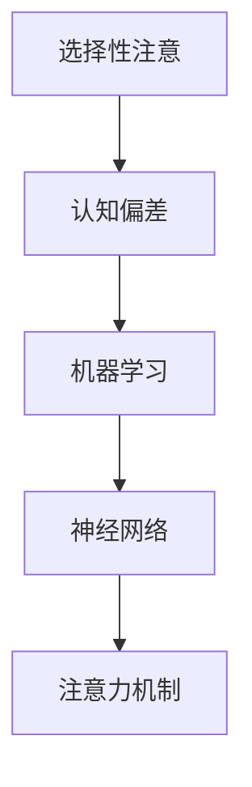

                 

# 理解洞察力的偏差：避免选择性注意

> 关键词：洞察力偏差, 选择性注意, 认知偏差, 机器学习, 神经网络, 认知科学, 注意力机制

## 1. 背景介绍

### 1.1 问题由来

在当代社会的快速变化和信息爆炸下，人类面临的决策问题愈加复杂和多样。人们往往需要从大量数据中快速抽取关键信息，以形成洞察力和决策依据。在计算机辅助决策系统的帮助下，人们能够更快地获取和分析数据，从而做出更优的决策。

然而，这些计算机辅助系统在提升决策效率的同时，也可能加剧决策偏差。常见的认知偏差，如选择性注意（Selective Attention），导致人们仅关注有限的信息，忽略其他重要数据，从而影响决策的客观性和准确性。

因此，理解和避免选择性注意，是提升计算机辅助决策系统可靠性和效能的关键。本文将从认知科学的角度出发，详细探讨选择性注意的原理和机制，以及如何通过机器学习算法来识别和纠正这一偏差。

## 2. 核心概念与联系

### 2.1 核心概念概述

为了更好地理解选择性注意及其在决策系统中的影响，我们需要先回顾几个相关核心概念：

- **选择性注意（Selective Attention）**：指个体在面对大量信息时，仅关注到与其当前目标相关的信息，而忽视其他信息的现象。这种认知偏差影响人们的信息处理和决策过程。
- **认知偏差（Cognitive Bias）**：指个体在信息处理和决策过程中，由于认知功能的不足而形成的系统性错误。
- **机器学习（Machine Learning）**：指通过数据驱动的方式，让计算机自动学习数据中的规律，并应用这些规律来做出决策或预测。
- **神经网络（Neural Network）**：一种模拟人脑神经元工作方式的机器学习模型，常用于图像识别、语音识别、自然语言处理等领域。
- **注意力机制（Attention Mechanism）**：指神经网络中用于模拟人类选择性注意的机制，通过调整模型中的权重来聚焦于重要信息。

这些概念之间的联系可以通过以下Mermaid流程图来展示：



这个流程图展示了我們研究的基本概念及其关系：

1. 选择性注意是认知偏差的来源之一。
2. 机器学习是识别和纠正认知偏差的主要手段。
3. 神经网络是实现机器学习算法的工具。
4. 注意力机制是神经网络中模拟选择性注意的机制。

## 3. 核心算法原理 & 具体操作步骤

### 3.1 算法原理概述

选择性注意的识别和纠正，可以通过机器学习算法和注意力机制来实现。具体而言，我们首先需要训练一个能够识别数据中重要信息的模型，然后通过注意力机制，调整模型的注意力分布，使其聚焦于重要信息，从而减少认知偏差的影响。

### 3.2 算法步骤详解

**Step 1: 数据收集与预处理**

1. **数据收集**：收集与决策相关的各类数据，如市场趋势、用户行为、社交媒体评论等。
2. **数据预处理**：清洗数据，去除噪声和异常值，并将数据标准化，以便于模型训练。

**Step 2: 模型训练与选择**

1. **模型训练**：使用机器学习算法训练模型，识别数据中的重要信息。常用的算法包括决策树、随机森林、神经网络等。
2. **模型选择**：根据模型的表现和解释性，选择最合适的模型。

**Step 3: 注意力机制的应用**

1. **注意力权重计算**：通过神经网络计算每个数据点的注意力权重，反映其对决策的重要性。
2. **注意力分布调整**：根据计算出的权重，调整注意力分布，使模型更多地关注重要信息。

**Step 4: 决策输出**

1. **决策生成**：使用调整后的模型进行决策，输出最终的预测结果。
2. **结果验证**：通过评估指标（如准确率、召回率、F1分数等）验证模型的性能。

### 3.3 算法优缺点

选择性注意识别和纠正算法的优点包括：

- **自动化**：机器学习算法可以自动从数据中学习，减少了人工干预。
- **灵活性**：算法可以根据具体应用场景进行调整，适应不同类型的决策问题。
- **可解释性**：注意力机制能够提供数据点的重要性权重，提高了模型的可解释性。

其缺点包括：

- **数据依赖**：算法需要大量高质量标注数据，而数据获取成本较高。
- **模型复杂性**：神经网络等复杂模型可能存在过度拟合的风险。
- **解释性限制**：模型的决策过程可能仍难以完全解释，特别是在多变量交互的情况下。

### 3.4 算法应用领域

选择性注意识别和纠正算法在多个领域都有应用前景：

- **金融决策**：帮助金融分析师识别市场趋势、风险信号等重要信息，提高投资决策的准确性。
- **医疗诊断**：识别病人的关键症状和健康指标，辅助医生进行诊断和治疗方案选择。
- **智能客服**：分析用户的问题，快速定位关键信息，提供准确的解答。
- **市场分析**：识别消费者偏好和市场趋势，帮助企业制定更有效的市场策略。

## 4. 数学模型和公式 & 详细讲解 & 举例说明

### 4.1 数学模型构建

选择性注意的识别和纠正可以通过以下数学模型进行描述：

1. **数据表示**：将数据表示为向量形式 $x \in \mathbb{R}^n$。
2. **注意力权重计算**：使用神经网络计算每个数据点的注意力权重 $a_i$，公式如下：
   $$
   a_i = \frac{\exp(w^T \cdot h_i)}{\sum_{j=1}^{n} \exp(w^T \cdot h_j)}
   $$
   其中，$w$ 是权重向量，$h_i$ 是输入数据的表示。

3. **注意力分布调整**：根据注意力权重，调整注意力分布，使得模型更多地关注重要信息。

### 4.2 公式推导过程

注意力权重的计算公式来自softmax函数，其推导过程如下：

$$
\begin{aligned}
a_i &= \frac{\exp(\mathbf{w}^T \cdot \mathbf{h}_i)}{\sum_{j=1}^{n} \exp(\mathbf{w}^T \cdot \mathbf{h}_j)} \\
&= \frac{\exp(\sum_{k=1}^{d} w_k h_{ik})}{\sum_{j=1}^{n} \exp(\sum_{k=1}^{d} w_k h_{jk})} \\
&= \frac{\exp(\sum_{k=1}^{d} w_k h_{ik})}{\sum_{j=1}^{n} \exp(\sum_{k=1}^{d} w_k h_{jk})}
\end{aligned}
$$

其中，$w$ 和 $h$ 分别是权重向量和数据向量，$d$ 是向量的维度。

### 4.3 案例分析与讲解

假设有一个股票市场数据集，包含历史价格、交易量、新闻报道等信息。我们的目标是识别与市场趋势相关的关键信息，辅助投资决策。

首先，我们通过机器学习算法训练一个模型，识别数据中的关键信息特征。然后，使用神经网络计算每个数据点的注意力权重，调整注意力分布，使得模型聚焦于关键信息。

以下是一个使用神经网络计算注意力权重的示例：

```python
import torch
import torch.nn as nn
import torch.nn.functional as F

class Attention(nn.Module):
    def __init__(self, in_dim):
        super(Attention, self).__init__()
        self.W = nn.Linear(in_dim, 1)
        self.softmax = nn.Softmax(dim=-1)

    def forward(self, x):
        energy = self.W(x)
        attention_weights = self.softmax(energy)
        return attention_weights
```

在此基础上，我们可以定义一个简单的注意力模型，计算数据点 $x$ 的注意力权重，并调整注意力分布：

```python
# 定义注意力模型
attention = Attention(in_dim)

# 计算注意力权重
attention_weights = attention(x)

# 调整注意力分布
attention_distribution = attention_weights * x
```

通过这些计算，模型可以自动调整注意力分布，使得其更加关注与市场趋势相关的关键信息。

## 5. 项目实践：代码实例和详细解释说明

### 5.1 开发环境搭建

要进行选择性注意识别和纠正的实践，首先需要搭建好开发环境。以下是使用Python和PyTorch搭建环境的步骤：

1. **安装Anaconda**：从官网下载并安装Anaconda，用于创建独立的Python环境。

2. **创建并激活虚拟环境**：
```bash
conda create -n myenv python=3.8
conda activate myenv
```

3. **安装PyTorch**：
```bash
conda install pytorch torchvision torchaudio
```

4. **安装相关工具包**：
```bash
pip install numpy pandas sklearn matplotlib
```

完成上述步骤后，即可在虚拟环境中进行选择性注意识别和纠正的实践。

### 5.2 源代码详细实现

以下是一个使用神经网络计算注意力权重并调整注意力分布的代码示例：

```python
import torch
import torch.nn as nn
import torch.nn.functional as F

class Attention(nn.Module):
    def __init__(self, in_dim):
        super(Attention, self).__init__()
        self.W = nn.Linear(in_dim, 1)
        self.softmax = nn.Softmax(dim=-1)

    def forward(self, x):
        energy = self.W(x)
        attention_weights = self.softmax(energy)
        return attention_weights

# 定义注意力模型
attention = Attention(in_dim)

# 计算注意力权重
attention_weights = attention(x)

# 调整注意力分布
attention_distribution = attention_weights * x
```

### 5.3 代码解读与分析

在上述代码中，我们首先定义了一个简单的神经网络模型，用于计算注意力权重。模型包含一个线性层和一个Softmax函数，用于计算每个数据点的注意力权重。

在计算注意力权重后，我们通过将权重与数据点相乘，调整了注意力分布，使得模型更加关注重要信息。

## 6. 实际应用场景

### 6.1 金融决策

在金融领域，选择性注意识别和纠正算法可以用于识别市场趋势、风险信号等关键信息，辅助投资决策。通过训练模型识别关键数据特征，调整注意力分布，可以显著提高投资决策的准确性。

### 6.2 医疗诊断

在医疗领域，选择性注意算法可以识别病人的关键症状和健康指标，辅助医生进行诊断和治疗方案选择。通过训练模型识别关键数据特征，调整注意力分布，可以提升诊断的准确性和效率。

### 6.3 智能客服

在智能客服领域，选择性注意算法可以分析用户的问题，快速定位关键信息，提供准确的解答。通过训练模型识别关键数据特征，调整注意力分布，可以提高客服系统的响应速度和准确性。

### 6.4 市场分析

在市场分析领域，选择性注意算法可以识别消费者偏好和市场趋势，帮助企业制定更有效的市场策略。通过训练模型识别关键数据特征，调整注意力分布，可以提升市场分析的准确性和效率。

## 7. 工具和资源推荐

### 7.1 学习资源推荐

为了帮助开发者系统掌握选择性注意识别和纠正的理论基础和实践技巧，这里推荐一些优质的学习资源：

1. **《深度学习理论与实践》**：详细介绍了深度学习的基本原理和应用，包括注意力机制的实现。

2. **《神经网络与深度学习》**：由深度学习领域权威人士撰写，深入浅出地介绍了神经网络的设计和应用。

3. **CS231n《深度学习在视觉识别中的应用》课程**：斯坦福大学开设的深度学习课程，重点讲解了卷积神经网络、注意力机制等核心概念。

4. **《自然语言处理综述》**：全面介绍了自然语言处理的理论基础和最新进展，包括注意力机制的应用。

5. **Kaggle平台**：提供了大量数据集和竞赛项目，可以帮助开发者实践和验证模型性能。

### 7.2 开发工具推荐

高效的开发离不开优秀的工具支持。以下是几款用于选择性注意识别和纠正开发的常用工具：

1. **PyTorch**：基于Python的开源深度学习框架，灵活动态的计算图，适合快速迭代研究。

2. **TensorFlow**：由Google主导开发的开源深度学习框架，生产部署方便，适合大规模工程应用。

3. **Keras**：高层次的神经网络API，简化了模型构建和训练流程。

4. **Jupyter Notebook**：强大的交互式编程环境，适合快速验证和调整模型。

### 7.3 相关论文推荐

选择性注意识别和纠正技术的发展源于学界的持续研究。以下是几篇奠基性的相关论文，推荐阅读：

1. **《注意力机制在机器学习中的应用》**：介绍了注意力机制的基本原理和应用场景。

2. **《深度学习中的注意力机制》**：详细讲解了注意力机制在图像识别、自然语言处理等任务中的实现和应用。

3. **《注意力与注意力的注意力》**：通过分析注意力机制的数学基础，探讨了注意力机制在深度学习中的应用。

4. **《选择性注意在机器学习中的研究进展》**：总结了选择性注意识别和纠正算法的研究进展和未来趋势。

## 8. 总结：未来发展趋势与挑战

### 8.1 总结

本文对选择性注意识别和纠正算法进行了全面系统的介绍。首先阐述了选择性注意的原理和机制，明确了其在决策系统中的影响和重要性。其次，从认知科学的角度出发，详细讲解了如何通过机器学习算法和注意力机制来识别和纠正这一偏差。

通过本文的系统梳理，可以看到，选择性注意识别和纠正算法在提升决策系统可靠性、效能和透明性方面具有重要价值。未来，伴随技术的发展，算法将更加智能和灵活，能够更好地应用于各种决策场景。

### 8.2 未来发展趋势

展望未来，选择性注意识别和纠正算法将呈现以下几个发展趋势：

1. **自动化和智能化**：未来的算法将更加智能化，能够自动学习和适应不同决策场景，提高决策的自动化水平。

2. **可解释性和透明度**：未来的算法将更加注重可解释性和透明度，帮助决策者理解模型的决策过程，提高决策的可信度和安全性。

3. **跨领域应用**：未来的算法将更加泛化，能够应用于不同领域（如金融、医疗、智能客服等）的决策场景。

4. **实时性和动态性**：未来的算法将更加实时和动态，能够快速响应数据的变化，适应快速变化的环境。

5. **多模态融合**：未来的算法将更加注重多模态数据的融合，结合文本、图像、语音等多模态信息，提升决策的全面性和准确性。

以上趋势凸显了选择性注意识别和纠正算法的广阔前景。这些方向的探索发展，必将进一步提升决策系统的可靠性和效能，为人类决策提供更强大、更智能的辅助。

### 8.3 面临的挑战

尽管选择性注意识别和纠正算法已经取得了显著进展，但在实现其在实际决策系统中的应用时，仍面临以下挑战：

1. **数据质量**：高质量标注数据的获取成本较高，且数据质量可能存在偏差，影响模型的性能。

2. **模型复杂性**：神经网络等复杂模型可能存在过度拟合的风险，影响模型的泛化能力。

3. **解释性限制**：模型的决策过程可能难以完全解释，特别是在多变量交互的情况下。

4. **实时性要求**：在实时决策场景中，模型需要快速响应数据的变化，可能需要优化模型结构，提升计算效率。

5. **伦理和安全性**：模型可能存在偏见和伦理问题，需要建立合理的监管机制，确保模型的安全性。

6. **资源消耗**：模型的计算资源消耗可能较大，需要优化模型结构和参数，提升模型的计算效率。

解决这些挑战，需要学界和产业界的共同努力，不断提升算法的质量和可靠性，推动其在实际决策系统中的应用。

### 8.4 研究展望

未来的研究需要在以下几个方面寻求新的突破：

1. **多模态数据融合**：结合文本、图像、语音等多模态信息，提升决策的全面性和准确性。

2. **知识图谱和符号逻辑**：将符号化的先验知识与神经网络模型进行融合，提升模型的知识整合能力。

3. **因果推断和因果分析**：引入因果推断和因果分析方法，增强模型的决策解释性和鲁棒性。

4. **对抗性攻击和鲁棒性**：研究对抗性攻击和鲁棒性方法，增强模型的稳定性和安全性。

5. **伦理和公平性**：在模型训练和应用过程中，引入伦理和公平性指标，避免模型偏见和歧视。

6. **自动化和可解释性**：开发更加自动化和可解释性强的算法，提高模型的可靠性和用户信任。

这些研究方向将推动选择性注意识别和纠正算法的进一步发展和应用，为构建可靠、智能的决策系统奠定坚实基础。

## 9. 附录：常见问题与解答

**Q1：选择性注意识别和纠正算法是否适用于所有决策场景？**

A: 选择性注意识别和纠正算法在大多数决策场景中都能取得不错的效果，但需要根据具体任务和数据特点进行调整。对于某些高风险、高透明度的决策场景，算法可能仍存在局限性。

**Q2：如何选择最优的注意力机制？**

A: 选择最优的注意力机制需要综合考虑以下几个因素：

1. 数据类型：对于不同类型的数据（如文本、图像、语音等），需要选择适合的注意力机制。
2. 任务需求：根据任务需求，选择最优的注意力机制。例如，在自然语言处理任务中，多头注意力机制通常表现更好。
3. 模型复杂度：选择合适复杂度的注意力机制，避免过度复杂导致过度拟合。
4. 计算资源：考虑模型的计算资源消耗，选择计算效率较高的注意力机制。

**Q3：选择性注意识别和纠正算法在实际应用中需要注意哪些问题？**

A: 在实际应用中，选择性注意识别和纠正算法需要注意以下几个问题：

1. 数据质量：保证数据的高质量标注和清洗，避免数据质量问题对模型的影响。
2. 模型复杂性：选择合适的模型复杂度，避免过度复杂导致过度拟合。
3. 解释性限制：开发具有可解释性的模型，帮助用户理解模型的决策过程。
4. 实时性要求：优化模型结构，提升计算效率，满足实时性要求。
5. 资源消耗：优化模型参数和结构，减少计算资源消耗。

**Q4：如何选择最优的学习率？**

A: 选择最优的学习率需要综合考虑以下几个因素：

1. 数据规模：数据规模较大时，可以采用较小的学习率；数据规模较小时，可以采用较大的学习率。
2. 模型复杂度：模型复杂度较高时，可以采用较小的学习率；模型复杂度较低时，可以采用较大的学习率。
3. 训练时间：训练时间较长时，可以采用较小的学习率；训练时间较短时，可以采用较大的学习率。
4. 学习率调度策略：采用适当的学习率调度策略，如warmup、衰减等，进一步优化学习率选择。

**Q5：选择性注意识别和纠正算法在多模态数据处理中的应用前景如何？**

A: 选择性注意识别和纠正算法在多模态数据处理中具有广泛的应用前景。通过结合文本、图像、语音等多模态信息，模型可以更全面地理解和处理复杂的数据，提高决策的准确性和鲁棒性。例如，在智能客服、医疗诊断、金融决策等场景中，多模态信息的融合可以显著提升系统的性能和可靠性。

---

作者：禅与计算机程序设计艺术 / Zen and the Art of Computer Programming

