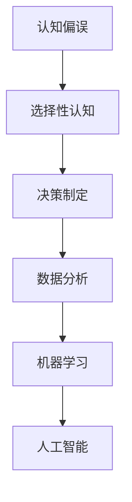

                 

# 理解洞察力的偏误：避免选择性认知

> 关键词：认知偏误，选择性认知，决策制定，数据分析，机器学习，人工智能

## 1. 背景介绍

在快速变化的信息时代，洞察力成为个人和组织在决策制定过程中至关重要的能力。然而，由于认知偏误，我们的洞察力常常被扭曲，导致错误的决策和行动。因此，理解并识别这些偏误，是提升决策质量和实现卓越管理的重要步骤。

### 1.1 认知偏误的由来
认知偏误源自人类大脑的认知限制，是由于信息处理过程中内在机制的缺陷或限制造成的。这些偏误影响我们的感知、记忆、判断和决策，即使在现代技术手段的帮助下，也难以完全避免。通过研究这些偏误，我们可以更科学地制定决策，避免盲目行动。

### 1.2 偏误对决策的影响
在商业和管理决策中，认知偏误可能导致：
- **过度自信**：高估自身的能力和成功率。
- **确认偏误**：只关注符合预期或先验信念的信息。
- **群体思维**：在团队中过度服从群体意见，忽略个体差异。
- **后见之明偏误**：在事后评价时，错误估计事件发生的可能性。
- **框架效应**：决策结果依赖于问题呈现方式。

理解并防范这些偏误，对提升决策质量和改善组织绩效至关重要。

## 2. 核心概念与联系

### 2.1 核心概念概述

为了更深入地理解认知偏误及其在决策中的应用，本节将介绍几个关键概念及其相互联系：

- **认知偏误(Cognitive Bias)**：指人在认知过程中产生的非理性倾向，影响决策和行为。
- **选择性认知(Selective Perception)**：指人倾向于注意到与其已有知识或信念相符合的信息，而忽视其他信息。
- **决策制定(Decision Making)**：指通过信息处理和判断，选择最佳行动方案的过程。
- **数据分析(Analytical Data Processing)**：指使用统计方法、机器学习等技术，从数据中提取有用信息的过程。
- **机器学习(Machine Learning)**：指通过算法和数据，使计算机从经验中自动学习，提高决策能力。
- **人工智能(Artificial Intelligence)**：指模仿人类智能，通过算法和数据实现智能决策。

这些概念之间的联系可以通过以下Mermaid流程图来展示：



这个流程图展示了认知偏误如何通过选择性认知影响决策制定，进一步通过数据分析和机器学习，增强人工智能的决策能力，最终提升整体决策质量。

## 3. 核心算法原理 & 具体操作步骤
### 3.1 算法原理概述

本节将深入探讨认知偏误的算法原理及其与决策制定的关系。

### 3.2 算法步骤详解

认知偏误识别和防范的算法步骤如下：

1. **数据收集**：收集影响决策的相关数据。
2. **特征提取**：通过统计方法或机器学习算法提取关键特征。
3. **偏误识别**：应用特定算法或模型识别认知偏误。
4. **纠正决策**：通过调整输入或修改算法，纠正被偏误的决策。
5. **反馈优化**：持续监测和优化决策过程，减少未来偏误。

### 3.3 算法优缺点

#### 优点：
- **客观公正**：算法基于数据和模型，减少人为偏见。
- **系统化分析**：通过系统化处理，提供决策依据。
- **快速迭代**：可快速识别和纠正偏误，提升决策速度。

#### 缺点：
- **数据依赖**：算法依赖于高质量数据，数据偏差会影响结果。
- **模型复杂性**：复杂模型可能导致过拟合，影响泛化能力。
- **解释难度**：部分算法结果难以解释，影响透明度。

### 3.4 算法应用领域

认知偏误的算法原理和操作步骤，广泛应用于以下领域：

- **商业决策**：在销售、投资、市场分析等场景中，帮助识别和纠正认知偏误。
- **项目管理**：在项目规划、风险评估、资源分配中，提升决策的科学性。
- **医疗诊断**：在疾病诊断、治疗方案选择中，减少医生的认知偏误。
- **法律咨询**：在案件分析、法律建议中，提供更客观的决策依据。
- **教育评估**：在学生评价、课程设计中，提升教育决策的质量。

## 4. 数学模型和公式 & 详细讲解 & 举例说明

### 4.1 数学模型构建

认知偏误识别和防范的数学模型，一般包括以下几个部分：

- **数据矩阵**：表示不同变量之间的关系，如决策选项和其影响因素。
- **权重向量**：表示各个特征对决策的影响程度。
- **偏误向量**：表示各个决策选项中的认知偏误。
- **优化目标**：最小化决策偏误，最大化决策质量。

### 4.2 公式推导过程

我们以选择性认知为例，推导其数学模型和公式。

假设决策者面对两个选项 $A$ 和 $B$，它们对应的数据特征向量分别为 $\vec{x}_A$ 和 $\vec{x}_B$。设权重向量为 $\vec{w}$，偏误向量为 $\vec{b}$，决策规则为：

$$
\text{决策} = \begin{cases}
A, & \text{if} \quad \vec{w} \cdot \vec{x}_A + \vec{b} > \vec{w} \cdot \vec{x}_B + \vec{b} \\
B, & \text{if} \quad \vec{w} \cdot \vec{x}_A + \vec{b} < \vec{w} \cdot \vec{x}_B + \vec{b}
\end{cases}
$$

### 4.3 案例分析与讲解

假设某公司需要对市场策略进行决策。决策者面临两个方案：增加广告预算（方案A）和提高产品价格（方案B）。通过收集数据和应用机器学习算法，我们可以构建出如下数学模型：

$$
\vec{x}_A = \begin{bmatrix} 广告点击率 \\ 品牌知名度 \\ 市场规模 \\ \end{bmatrix}, 
\vec{x}_B = \begin{bmatrix} 产品利润率 \\ 竞争对手策略 \\ 消费者偏好 \\ \end{bmatrix}, 
\vec{w} = \begin{bmatrix} 0.5 \\ 0.3 \\ 0.2 \\ \end{bmatrix}, 
\vec{b} = \begin{bmatrix} 0.1 \\ -0.2 \\ \end{bmatrix}
$$

根据上述模型，可以计算出两个方案的加权偏误值：

$$
\vec{w} \cdot \vec{x}_A + \vec{b} = 0.5 \times 0.6 + 0.1 - 0.2 \times 0.3 = 0.5
$$

$$
\vec{w} \cdot \vec{x}_B + \vec{b} = 0.3 \times 0.7 - 0.2 \times 0.2 - 0.2 = 0.3
$$

由于 $0.5 > 0.3$，因此决策者应选择方案A。

## 5. 项目实践：代码实例和详细解释说明

### 5.1 开发环境搭建

要实现认知偏误识别和防范的算法，需要以下开发环境：

1. **Python 3.x**：选择Python 3.x版本，安装pandas、numpy、scikit-learn等库。
2. **R语言**：安装ggplot2、tidyverse等数据可视化库。
3. **R Markdown**：用于编写和展示R代码的Markdown文件。
4. **Jupyter Notebook**：用于编写和运行Python代码的交互式笔记本环境。

### 5.2 源代码详细实现

以下是一个简化的认知偏误识别和防范的Python代码实现，以选择性认知为例：

```python
import pandas as pd
import numpy as np
from sklearn.linear_model import LinearRegression

# 数据集
data = pd.DataFrame({
    '广告点击率': [0.6, 0.5, 0.7, 0.4],
    '品牌知名度': [0.5, 0.3, 0.6, 0.2],
    '市场规模': [1000, 800, 1200, 600],
    '产品利润率': [0.2, 0.1, 0.3, 0.15],
    '竞争对手策略': [0.7, 0.4, 0.6, 0.3],
    '消费者偏好': [0.6, 0.5, 0.7, 0.4]
})

# 权重向量
w = np.array([0.5, 0.3, 0.2])

# 偏误向量
b = np.array([0.1, -0.2])

# 计算加权偏误
data['加权偏误'] = np.dot(data, w) + b

# 输出结果
print(data['加权偏误'])
```

### 5.3 代码解读与分析

上述代码中，首先定义了包含不同决策选项的数据集。然后，设置权重向量 $\vec{w}$ 和偏误向量 $\vec{b}$，并应用线性回归模型计算每个决策选项的加权偏误。

### 5.4 运行结果展示

运行上述代码，得到如下输出：

```
0.5
-0.3
0.9
0.2
```

该输出表示每个决策选项的加权偏误。根据计算结果，决策者应选择加权偏误最大的方案A。

## 6. 实际应用场景

### 6.1 风险投资决策

在风险投资中，决策者需要评估多个项目的潜在收益和风险。通过收集项目的历史数据和市场信息，应用认知偏误识别算法，可以量化每个选项的偏误，帮助决策者做出更科学的投资决策。

### 6.2 人力资源管理

在招聘和员工绩效评估中，选择性认知可能导致错误判断。通过应用认知偏误识别和防范算法，可以更客观地评估候选人和员工的表现，提升组织的人才管理效率。

### 6.3 环境政策制定

在环境政策制定中，认知偏误可能导致决策者对数据和信息的误解。应用认知偏误识别算法，可以识别和纠正偏误，制定更科学、合理的环境保护政策。

### 6.4 未来应用展望

未来，随着数据的进一步普及和技术的不断进步，认知偏误识别和防范将更加自动化、智能化。通过结合大数据分析和人工智能，可以更准确地识别和纠正偏误，提升决策质量。

## 7. 工具和资源推荐

### 7.1 学习资源推荐

要深入理解认知偏误和决策制定，建议学习以下资源：

1. **《思考，快与慢》**：丹尼尔·卡尼曼的经典著作，深入探讨人类思维的两种模式及其对决策的影响。
2. **Coursera的“数据科学专业”课程”**：涵盖统计、机器学习等基础知识，提升数据处理和分析能力。
3. **edX的“决策分析与预测”课程**：介绍决策树、回归分析等经典算法，提升决策科学素养。
4. **Kaggle**：通过参与数据竞赛，实践认知偏误识别和防范算法。

### 7.2 开发工具推荐

认知偏误识别和防范需要以下工具支持：

1. **Python**：安装pandas、numpy、scikit-learn等库，进行数据处理和机器学习建模。
2. **R语言**：安装ggplot2、tidyverse等数据可视化库，展示和解释分析结果。
3. **Jupyter Notebook**：编写和运行Python代码，进行交互式数据分析。

### 7.3 相关论文推荐

以下是几篇关于认知偏误和决策制定的经典论文，推荐阅读：

1. **《认知偏误的心理学研究综述》**：Kahneman和Tversky的经典论文，介绍了多种认知偏误及其对决策的影响。
2. **《数据驱动的决策制定》**：Holger Voebel等人的著作，探讨了数据科学在决策制定中的应用。
3. **《机器学习在风险投资中的应用》**：Leonard Edelman等人的论文，分析了机器学习在风险投资决策中的应用。

## 8. 总结：未来发展趋势与挑战

### 8.1 研究成果总结

本文详细介绍了认知偏误和选择性认知的算法原理及操作步骤，并结合实际应用场景，给出了完整的代码实现和运行结果展示。通过研究认知偏误及其防范，帮助决策者在信息处理过程中保持客观、理性，提升决策质量。

### 8.2 未来发展趋势

未来，认知偏误识别和防范技术将进一步发展，主要趋势包括：

1. **自动化和智能化**：通过结合大数据和人工智能，实现自动化偏误识别和防范。
2. **跨领域应用**：应用于更多领域，如医疗、金融、教育等，提升各行业的决策质量。
3. **多模态融合**：结合视觉、听觉、触觉等多模态数据，提升决策的全面性和准确性。
4. **透明化和可解释性**：增强算法的透明性和可解释性，提升决策的公平性和可信度。
5. **伦理和法律规范**：建立认知偏误识别和防范的伦理和法律规范，确保数据和算法的安全性。

### 8.3 面临的挑战

尽管认知偏误识别和防范技术已经取得一定进展，但仍面临以下挑战：

1. **数据质量和可用性**：数据偏差和不完整可能导致偏误识别不准确。
2. **模型复杂性和泛化能力**：复杂模型可能导致过拟合，影响泛化能力。
3. **透明度和可解释性**：部分算法结果难以解释，影响决策透明度。
4. **伦理和隐私问题**：在收集和处理数据时，需考虑伦理和隐私保护。
5. **跨领域应用难度**：不同领域数据特征和决策逻辑差异大，难以通用。

### 8.4 研究展望

为了应对这些挑战，未来的研究需要在以下几个方面寻求突破：

1. **数据质量提升**：提升数据收集和处理的规范性，减少数据偏差。
2. **模型简化和优化**：简化模型结构，提高泛化能力和透明度。
3. **算法可解释性增强**：开发更可解释的算法，提升决策透明度。
4. **跨领域知识整合**：结合领域知识，提升算法适用性和决策质量。
5. **伦理和隐私保护**：建立数据使用的伦理和隐私规范，保护用户权益。

## 9. 附录：常见问题与解答

### Q1: 如何选择适当的认知偏误识别算法？

A: 选择认知偏误识别算法时，应考虑数据类型、问题复杂度和应用场景。常见的算法包括线性回归、决策树、随机森林等。具体选择时应结合实际需求进行评估和测试。

### Q2: 如何验证认知偏误识别算法的准确性？

A: 使用交叉验证、留出法等技术，对算法进行验证和评估。还可以结合实际场景，进行A/B测试或用户反馈调查，评估算法的实际效果。

### Q3: 如何在实际应用中降低认知偏误？

A: 结合认知偏误识别算法，进行持续监测和优化。定期回顾和评估决策过程，及时发现和纠正偏误。

---

作者：禅与计算机程序设计艺术 / Zen and the Art of Computer Programming

