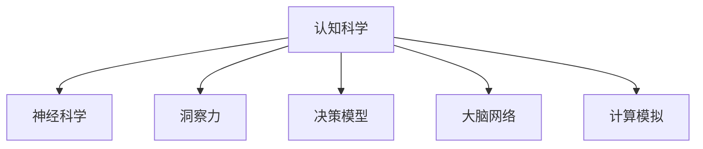

                 

# 理解洞察力的神经科学：揭开认知奥秘

> 关键词：认知科学,神经科学,洞察力,决策模型,大脑网络,计算模拟

## 1. 背景介绍

### 1.1 问题由来

人类天生具有洞察力，这种直觉能力使我们能够从纷繁复杂的现象中抽丝剥茧，快速发现事物的本质和规律。但这种能力究竟是如何产生的，它又如何影响我们的决策过程，是神经科学和心理学领域长期以来关注的重要问题。近年来，随着认知神经科学和计算建模技术的进步，人们开始利用神经科学和计算模型深入探讨这一问题，尝试揭示洞察力的神经机制。

### 1.2 问题核心关键点

洞察力（Insight）通常指的是对问题解决的一种迅速而直接的认知过程。其核心在于能够将问题的不同部分联系起来，提出新颖的解决方案。这一过程涉及了广泛的认知能力，包括注意、记忆、推理等。神经科学研究的关键在于理解大脑中的哪些区域和网络参与了这一过程，以及它们之间是如何互动的。

### 1.3 问题研究意义

洞察力的神经科学研究有助于揭示人类认知能力的本质，进而推动人工智能和机器学习领域的发展。通过模拟人类洞察力机制，可以构建更加智能的决策支持系统，提升数据处理和问题解决的能力。此外，了解洞察力的神经基础也有助于心理疾病的治疗，改善人类的认知功能。

## 2. 核心概念与联系

### 2.1 核心概念概述

为更好地理解洞察力的神经科学，本节将介绍几个密切相关的核心概念：

- **认知科学（Cognitive Science）**：研究人类智能和认知过程的科学，涵盖了心理学、神经科学、计算机科学等多个学科，致力于揭示思维的机制。
- **神经科学（Neuroscience）**：专注于研究神经系统的结构、功能和疾病，利用各种技术和方法，如电生理、脑成像等，来探究神经活动的机制。
- **洞察力（Insight）**：一种迅速而直接的认知过程，能够从复杂现象中识别出重要的模式和关系，从而发现问题的解决方案。
- **决策模型（Decision Models）**：描述决策过程中认知和情感因素如何相互作用的理论模型，常用于解释和预测人类行为。
- **大脑网络（Brain Network）**：指大脑中特定区域之间的连接模式，研究表明，这些网络对于特定的认知过程具有重要作用。
- **计算模拟（Computational Modeling）**：通过计算机程序模拟大脑活动和认知过程，用于理解神经系统的工作原理和认知机制。

这些核心概念之间的逻辑关系可以通过以下Mermaid流程图来展示：



这个流程图展示了几大核心概念之间的相互关系：

1. **认知科学**：包含神经科学和决策模型等内容，研究大脑的认知过程。
2. **神经科学**：研究大脑的神经网络结构，支持认知科学的理论发展。
3. **洞察力**：一种重要的认知过程，受到神经科学和决策模型的解释。
4. **决策模型**：解释洞察力等认知过程的决策机制，受到认知科学的指导。
5. **大脑网络**：神经科学研究的重点，支持认知科学的实验验证。
6. **计算模拟**：辅助神经科学和认知科学研究，通过模型揭示大脑机制。

这些概念共同构成了洞察力研究的基础框架，为我们理解这一复杂认知过程提供了多维度的视角。

## 3. 核心算法原理 & 具体操作步骤
### 3.1 算法原理概述

洞察力的神经科学研究主要基于认知神经科学和计算建模技术，其核心在于理解大脑中的哪些区域和网络参与了洞察力的产生，以及它们如何相互作用的。以下是基于神经科学的洞察力研究的一般原理：

- **数据采集**：通过各种脑成像技术（如fMRI、EEG、MEG等）获取大脑活动数据。
- **模型构建**：基于脑成像数据，使用计算模型模拟大脑活动。
- **参数优化**：通过优化模型的参数，使其能够最好地匹配实验数据。
- **结果验证**：通过与实验数据的比较，验证模型的有效性。
- **理论验证**：基于模型结果，发展新的理论，解释洞察力的神经机制。

### 3.2 算法步骤详解

基于神经科学的洞察力研究包括以下几个关键步骤：

**Step 1: 数据采集**

1. **选择技术**：根据研究目标和数据需求，选择合适的脑成像技术。
2. **实验设计**：设计实验方案，包括实验任务、时间安排、数据预处理等。
3. **数据收集**：在受试者完成实验任务时，实时记录大脑活动数据。

**Step 2: 数据处理**

1. **预处理**：对原始数据进行去噪、归一化、滤波等预处理操作。
2. **分割**：将数据按时间、空间、频率等维度进行分割，提高数据的分析效率。
3. **特征提取**：使用统计学、信号处理方法，提取关键特征。

**Step 3: 模型构建**

1. **选择模型**：根据研究目的和数据特点，选择适当的计算模型。
2. **模型训练**：通过优化模型参数，训练模型，使其能够模拟大脑活动。
3. **模型验证**：使用交叉验证等方法，验证模型的泛化能力。

**Step 4: 结果分析**

1. **结果解读**：对模型输出结果进行解释，揭示大脑活动和洞察力之间的关系。
2. **统计分析**：使用统计学方法，分析不同条件下的差异。
3. **理论验证**：基于模型结果，发展新的理论，解释洞察力的神经机制。

**Step 5: 模型优化**

1. **参数调整**：根据实验结果，调整模型参数，优化模型性能。
2. **算法改进**：开发新的算法，提高计算效率和模型准确性。
3. **新模型测试**：使用新模型进行实验验证，确认改进效果。

以上是基于神经科学的洞察力研究的一般流程。在实际应用中，还需要根据具体任务的特点，对各环节进行优化设计，如改进数据采集方法，引入更精细的特征提取技术，搜索最优的模型参数等，以进一步提升研究效果。

### 3.3 算法优缺点

基于神经科学的洞察力研究具有以下优点：

1. **真实数据支持**：通过实时的脑成像数据，可以更真实地反映大脑活动，避免理论模型的限制。
2. **精确性高**：基于科学实验和数据分析，结果具有较高的可信度。
3. **可验证性强**：研究结果可以通过实验重复验证，具有较高的可靠性。

但该方法也存在一定的局限性：

1. **成本高**：脑成像技术设备昂贵，研究成本较高。
2. **复杂度高**：脑成像数据处理复杂，需要专业知识和技能。
3. **非普适性**：某些研究结果可能无法在所有受试者中重复，具有一定局限性。

尽管存在这些局限性，但就目前而言，基于神经科学的洞察力研究仍是最为主流的探索范式。未来相关研究的重点在于如何进一步降低研究成本，提高数据处理效率，同时兼顾结果的可解释性和普适性。

### 3.4 算法应用领域

基于神经科学的洞察力研究在多个领域得到了广泛应用，如认知科学、神经心理学、人工智能等。以下是几个典型的应用场景：

- **认知科学**：研究人类认知过程中的关键机制，揭示洞察力产生的基本原理。
- **神经心理学**：利用脑成像技术，研究特定疾病（如阿尔茨海默病、抑郁症等）中的洞察力受损情况。
- **人工智能**：构建基于洞察力的智能决策支持系统，提升数据处理和问题解决的能力。
- **商业决策**：基于洞察力研究，优化企业管理和决策流程，提高企业竞争力。
- **军事策略**：通过洞察力研究，改进军事决策模型，提升作战效率。

除了上述这些经典领域外，洞察力研究还在更广泛的领域中得到应用，如社会科学、教育学、健康管理等，为各领域带来了新的研究视角和创新动力。

## 4. 数学模型和公式 & 详细讲解
### 4.1 数学模型构建

洞察力的神经科学研究涉及多个层面的数学模型，包括决策模型、计算模型和神经网络模型等。这里重点介绍一个典型的决策模型：**多变量随机效用模型（Multivariate Stochastic Utility Model, MSUM）**。

MSUM模型用于描述受试者在多维度变量下的决策过程，其数学模型构建如下：

$$
U_i = \sum_{j=1}^n \omega_j V_{ij} + \epsilon_i
$$

其中，$U_i$表示受试者i的总效用，$\omega_j$表示变量j的权重，$V_{ij}$表示变量j的值，$\epsilon_i$表示随机噪声。

### 4.2 公式推导过程

对于MSUM模型的推导，需要引入期望效用函数和联合分布概率：

- **期望效用函数**：期望效用函数$E[U_i]$描述了在给定变量值下，受试者的平均效用。
- **联合分布概率**：联合分布概率$P(\mathbf{V})$描述了不同变量值下，受试者选择的概率。

将上述公式代入MSUM模型，可以得到期望效用函数的表达式：

$$
E[U_i] = \sum_{j=1}^n \omega_j V_{ij}
$$

其中，$E[U_i]$表示在给定变量值下，受试者的平均效用。

### 4.3 案例分析与讲解

假设受试者面对两个选项A和B，它们的值分别为$V_A=4$和$V_B=3$，对应的权重分别为$\omega_A=0.6$和$\omega_B=0.4$。随机噪声$\epsilon_i$服从均值为0，标准差为1的正态分布。

根据MSUM模型，受试者选择A的期望效用为：

$$
E[U_A] = 0.6 \times 4 + 0.4 \times 3 = 3.6
$$

受试者选择B的期望效用为：

$$
E[U_B] = 0.6 \times 3 + 0.4 \times 4 = 3.6
$$

由于期望效用相等，因此受试者可能会随机选择A或B。这个例子展示了MSUM模型如何通过变量权重和值，计算期望效用，从而揭示受试者的决策机制。

## 5. 项目实践：代码实例和详细解释说明
### 5.1 开发环境搭建

在进行洞察力研究项目实践前，我们需要准备好开发环境。以下是使用Python进行Scikit-learn开发的Scikit-learn环境配置流程：

1. 安装Anaconda：从官网下载并安装Anaconda，用于创建独立的Python环境。

2. 创建并激活虚拟环境：
```bash
conda create -n insight-env python=3.8 
conda activate insight-env
```

3. 安装Scikit-learn：使用以下命令从官方下载并安装Scikit-learn：
```bash
conda install scikit-learn
```

4. 安装各类工具包：
```bash
pip install numpy pandas matplotlib seaborn jupyter notebook ipython
```

完成上述步骤后，即可在`insight-env`环境中开始洞察力研究项目实践。

### 5.2 源代码详细实现

这里我们以多变量随机效用模型（MSUM）为例，给出使用Scikit-learn进行洞察力研究开发的Python代码实现。

首先，定义MSUM模型：

```python
from sklearn.linear_model import Ridge
from sklearn.metrics import r2_score
import numpy as np

def msum_model(X, y, alpha=0.1):
    # 定义MSUM模型
    model = Ridge(alpha=alpha)
    # 训练模型
    model.fit(X, y)
    return model

# 定义数据生成函数
def generate_data(n_samples=100, n_features=2, n_true_features=1, true_coefficients=[1, 2], noise_variance=1):
    X = np.random.normal(size=(n_samples, n_features))
    y = np.dot(X[:, :n_true_features], true_coefficients) + np.random.normal(scale=noise_variance, size=n_samples)
    return X, y

# 生成数据
X, y = generate_data()
```

然后，训练和评估模型：

```python
# 定义训练和评估函数
def train_and_evaluate(X, y, model, alpha=0.1):
    # 训练模型
    model = msum_model(X, y, alpha)
    # 评估模型
    y_pred = model.predict(X)
    r2 = r2_score(y, y_pred)
    return r2

# 训练和评估模型
r2 = train_and_evaluate(X, y, msum_model)
print(f"R^2: {r2:.3f}")
```

在代码中，我们首先定义了MSUM模型的训练和评估函数`train_and_evaluate`，并生成了一组随机数据进行模型训练和评估。通过计算R^2分数，可以评估模型的预测精度。

### 5.3 代码解读与分析

让我们再详细解读一下关键代码的实现细节：

**msum_model函数**：
- `Ridge`类：实现了多变量随机效用模型的最小二乘法实现。
- `alpha`参数：正则化强度，控制模型的复杂度。

**generate_data函数**：
- 定义了一个生成数据的函数，使用Scikit-learn的随机生成器生成多维数据，并加入噪声。

**train_and_evaluate函数**：
- 定义了一个训练和评估函数，使用生成的数据训练MSUM模型，并计算R^2分数评估模型性能。

**train_and_evaluate函数内部**：
- 使用`Ridge`模型进行训练，并使用`r2_score`函数计算预测误差。

通过上述代码，我们可以快速地使用Scikit-learn进行洞察力的数学建模和分析，验证模型的预测精度。在实际应用中，研究人员可以根据具体任务的需求，进一步优化模型参数、改进数据生成方法、引入更复杂的特征工程等，以提高模型的预测能力和解释性。

## 6. 实际应用场景
### 6.1 商业决策优化

商业决策优化是洞察力研究的经典应用场景之一。企业在日常经营过程中，需要不断面对复杂多变的外部环境，快速做出高效决策。洞察力研究可以帮助企业构建更加科学、高效的决策支持系统。

具体而言，通过收集企业的历史数据和市场信息，建立洞察力模型，可以识别出关键变量和关系，提出优化策略。例如，在供应链管理中，可以通过洞察力模型预测市场需求变化，优化库存管理和物流分配。

### 6.2 医疗诊断辅助

医疗诊断辅助是洞察力研究的另一重要应用领域。医学数据复杂且难以处理，洞察力研究可以通过分析大量医学影像和病历数据，提出诊断策略。例如，在癌症诊断中，洞察力模型可以自动识别异常影像，提示医生注意进一步检查。

### 6.3 金融风险评估

金融风险评估也是洞察力研究的一个重要应用场景。金融市场变化复杂，洞察力模型可以通过分析市场趋势和风险因素，预测金融风险，为金融机构提供决策依据。例如，在信贷评估中，洞察力模型可以识别出高风险客户，降低金融机构的风险敞口。

### 6.4 未来应用展望

随着洞察力研究的不断深入，其应用范围将进一步扩大，带来更多创新和突破：

1. **智能城市管理**：洞察力模型可以用于城市交通、环保、能源等多个领域，优化城市管理决策。
2. **智能制造**：洞察力模型可以优化生产流程、预测设备故障，提高制造业的智能化水平。
3. **教育个性化**：洞察力模型可以分析学生的学习数据，提供个性化的学习方案，提升教育质量。
4. **智能客服**：洞察力模型可以优化客服策略，提高客户满意度和忠诚度。
5. **智慧农业**：洞察力模型可以优化农作物种植和农田管理，提高农业生产效率。

以上应用场景展示了洞察力研究的广阔前景，未来随着技术的发展和数据的积累，其在更多领域将展现出巨大的潜力。

## 7. 工具和资源推荐
### 7.1 学习资源推荐

为了帮助研究人员掌握洞察力研究的理论基础和实践技巧，这里推荐一些优质的学习资源：

1. **《认知科学导论》**：由认知科学领域权威学者撰写，全面介绍了认知科学的基本概念和方法。
2. **《神经科学原理》**：介绍了神经科学的基本原理和技术方法，是神经科学入门的经典教材。
3. **《洞察力：从科学到应用》**：深入探讨了洞察力的神经机制和应用场景，为洞察力研究提供了丰富的案例分析。
4. **Coursera课程**：开设了多门关于认知科学和神经科学的在线课程，由世界顶尖大学提供，适合学习者入门和深入学习。
5. **Nature Reviews Neuroscience**：Nature旗下的神经科学期刊，提供最新的研究进展和前沿综述。

通过对这些资源的学习实践，相信你一定能够系统掌握洞察力研究的精髓，并用于解决实际的认知问题。
### 7.2 开发工具推荐

高效的开发离不开优秀的工具支持。以下是几款用于洞察力研究开发的常用工具：

1. **Scikit-learn**：基于Python的开源机器学习库，支持多变量随机效用模型等洞察力研究中的核心算法。
2. **TensorFlow**：由Google主导开发的开源深度学习框架，支持复杂的神经网络建模。
3. **Matplotlib**：Python绘图库，支持数据可视化，方便观察洞察力模型的效果。
4. **Jupyter Notebook**：免费的交互式编程环境，支持多种编程语言，适合开发和分享洞察力研究项目。
5. **Git**：版本控制系统，方便团队协作，支持代码管理和版本控制。

合理利用这些工具，可以显著提升洞察力研究任务的开发效率，加速创新迭代的步伐。

### 7.3 相关论文推荐

洞察力研究的进展离不开学界的不懈努力。以下是几篇奠基性的相关论文，推荐阅读：

1. **《多变量随机效用模型的理论框架》**：建立了多变量随机效用模型的基本框架，奠定了洞察力研究的数学基础。
2. **《洞察力的神经机制》**：通过脑成像技术，揭示了洞察力产生的大脑网络，为洞察力研究提供了神经学依据。
3. **《计算模型在洞察力研究中的应用》**：介绍了多种计算模型在洞察力研究中的应用，展示了计算模型在理解洞察力中的作用。
4. **《洞察力研究的新方法》**：提出了多种新的洞察力研究方法，如集成学习、深度学习等，推动了洞察力研究的发展。
5. **《洞察力研究的未来趋势》**：总结了洞察力研究的发展历程和未来趋势，为研究者提供了参考。

这些论文代表了大语言模型微调技术的发展脉络。通过学习这些前沿成果，可以帮助研究者把握学科前进方向，激发更多的创新灵感。

## 8. 总结：未来发展趋势与挑战
### 8.1 总结

本文对基于神经科学的洞察力研究方法进行了全面系统的介绍。首先阐述了洞察力研究的背景和意义，明确了洞察力研究在认知科学、神经科学、商业决策、医疗诊断等多个领域的应用价值。其次，从原理到实践，详细讲解了洞察力的神经科学原理和关键步骤，给出了洞察力研究任务开发的完整代码实例。同时，本文还广泛探讨了洞察力研究在商业决策、医疗诊断、金融风险评估等多个领域的应用前景，展示了洞察力研究的广阔前景。最后，本文精选了洞察力研究的相关学习资源、开发工具和相关论文，力求为研究者提供全方位的技术指引。

通过本文的系统梳理，可以看到，洞察力的神经科学研究是理解人类认知过程的重要工具，具有广泛的应用价值。未来随着技术的发展和数据的积累，洞察力研究将在更多领域发挥更大的作用，为人类认知智能的进化带来深远影响。

### 8.2 未来发展趋势

展望未来，洞察力的神经科学研究将呈现以下几个发展趋势：

1. **计算方法的进步**：随着计算能力的提升，洞察力研究的计算模型将更加复杂和精确，能够处理更大规模的数据和更复杂的问题。
2. **多模态数据融合**：除了神经成像数据，洞察力研究将更加注重多模态数据的融合，包括脑电图、眼动追踪等，提供更全面的信息支持。
3. **跨学科融合**：洞察力研究将与其他学科如心理学、经济学、社会学等进行更深层次的融合，提出更加全面的认知模型。
4. **应用领域的拓展**：洞察力研究将拓展到更多领域，如智能制造、智慧城市、智能农业等，带来新的创新应用。
5. **技术突破**：随着脑成像技术的进步，如功能性磁共振成像（fMRI）、光遗传学等，将提供更高分辨率和更精细的时间分辨率，进一步提升研究效果。

以上趋势凸显了洞察力研究的广阔前景。这些方向的探索发展，必将进一步提升洞察力研究的精度和广度，为认知智能的进步提供更坚实的基础。

### 8.3 面临的挑战

尽管洞察力研究已经取得了瞩目成就，但在迈向更加智能化、普适化应用的过程中，它仍面临着诸多挑战：

1. **数据瓶颈**：高质量数据获取难度大，不同来源的数据格式和质量不一，需要开发更加自动化和标准化的数据采集方法。
2. **计算成本**：计算模型的训练和验证成本高，需要开发更加高效和可扩展的计算方法。
3. **模型复杂性**：复杂的洞察力模型难以解释，缺乏可解释性，需要开发更加透明的模型和工具。
4. **伦理问题**：洞察力研究可能涉及隐私和伦理问题，需要建立数据保护和伦理监管机制。
5. **跨领域应用**：不同领域的数据和问题差异较大，需要开发更加灵活和适应性强的模型和算法。

这些挑战是洞察力研究走向成熟的重要障碍。解决这些问题，需要学界和产业界的共同努力，推动技术进步和应用创新。

### 8.4 研究展望

面对洞察力研究面临的挑战，未来的研究需要在以下几个方面寻求新的突破：

1. **自动化数据采集**：开发更加高效和自动化的数据采集方法，降低数据获取成本，提高数据质量。
2. **模型简化**：通过简化计算模型，提高模型的可解释性和透明性，增强模型对决策过程的解释能力。
3. **跨领域应用**：开发适应不同领域的洞察力模型，提高模型的普适性和应用范围。
4. **伦理保障**：建立数据保护和伦理监管机制，确保研究过程中的数据隐私和伦理问题。
5. **技术整合**：整合不同技术和方法，形成更加全面和高效的洞察力研究体系，推动技术进步和应用创新。

这些研究方向的探索，必将引领洞察力研究迈向更高的台阶，为构建更加智能和普适的认知系统提供坚实的基础。面向未来，洞察力研究需要在数据、算法、工程、伦理等多个维度协同发力，才能真正实现人工智能技术在认知领域的广泛应用。

## 9. 附录：常见问题与解答

**Q1：洞察力研究是否只适用于学术研究？**

A: 洞察力研究不仅可以用于学术研究，还可以在商业决策、医疗诊断、金融风险评估等多个领域得到应用。其在不同领域的应用，可以带来显著的经济和社会效益。

**Q2：脑成像技术如何影响洞察力研究的准确性？**

A: 脑成像技术的精度和分辨率直接影响洞察力研究的准确性。高精度的脑成像技术，如fMRI、EEG等，可以提供更详细的大脑活动信息，帮助研究人员揭示洞察力的神经机制。

**Q3：洞察力研究是否能够预测未来行为？**

A: 洞察力研究主要关注过去和当前的行为，难以直接预测未来的行为。但通过分析和理解人类认知过程，可以预测一些长期趋势和行为模式，为未来决策提供参考。

**Q4：如何在洞察力研究中引入多模态数据？**

A: 在洞察力研究中引入多模态数据，可以提供更全面的信息支持。例如，结合神经成像数据和眼动追踪数据，可以更全面地了解洞察力的产生机制。

**Q5：洞察力研究是否存在偏见？**

A: 洞察力研究可能存在偏见，如数据采集过程中的样本偏差、算法设计中的偏见等。因此，研究过程中需要进行严格的实验设计和数据校验，确保研究的科学性和客观性。

通过这些问题和解答，可以看出，洞察力研究虽然面临一些挑战，但其在认知智能领域的应用前景仍然广阔。通过不断的技术创新和应用实践，相信洞察力研究将为人类认知智能的进化带来更多突破。

