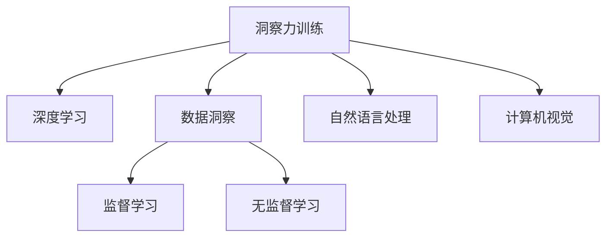

                 

# 理解洞察力的训练：提升信息处理能力

> 关键词：洞察力训练,信息处理能力,数据洞察,深度学习,机器学习,算法优化

## 1. 背景介绍

在现代信息爆炸的时代，如何高效、准确地处理和提取信息成为企业和个人面临的重要问题。传统的信息处理技术，如规则引擎、文本挖掘等，虽然在某些领域有其优势，但在面对复杂多变的数据环境时，存在局限性。深度学习技术的兴起，尤其是近年来基于深度学习的自然语言处理(NLP)和计算机视觉(CV)技术，为信息处理带来了新的方法和工具。

特别是，基于深度学习的洞察力训练方法，在提升数据洞察能力、自动化数据处理、个性化推荐等方面展现出巨大的潜力。本文旨在深入探讨洞察力训练的原理和应用，通过案例分析、数学模型构建和代码实践，帮助读者理解洞察力训练的核心技术和方法，并为实际应用提供参考。

## 2. 核心概念与联系

### 2.1 核心概念概述

为更好地理解洞察力训练的原理和应用，本节将介绍几个密切相关的核心概念：

- **洞察力训练**：指利用深度学习技术，从大规模数据中挖掘出隐藏的模式、规律和关联，提升数据分析、预测和决策能力的过程。洞察力训练通过模型训练得到，具有高度的自动化和智能化特点。

- **深度学习**：一类基于神经网络的机器学习技术，能够自动从数据中学习特征表示，并在高维空间中进行模式识别和预测。深度学习在计算机视觉、自然语言处理、语音识别等领域都有广泛应用。

- **数据洞察**：通过深度学习模型对数据进行分析，挖掘出数据背后的规律、趋势和关联，辅助决策和业务分析。数据洞察能够发现数据中隐含的信息，为业务优化和创新提供支持。

- **监督学习**：一种机器学习方法，通过带有标签的数据集进行模型训练，使模型能够预测未知数据的标签。深度学习中的卷积神经网络(CNN)、循环神经网络(RNN)等均基于监督学习。

- **无监督学习**：一种不需要标签数据，直接从数据中学习特征表示的机器学习方法。自编码器、聚类等无监督学习方法在数据预处理、降维等方面有广泛应用。

这些核心概念之间的逻辑关系可以通过以下Mermaid流程图来展示：



这个流程图展示了大语言模型微调的各个核心概念及其之间的关系：

1. 洞察力训练通过深度学习得到。
2. 深度学习包括监督学习和无监督学习。
3. 数据洞察是洞察力训练的主要应用。
4. 自然语言处理和计算机视觉是深度学习的重要应用领域。

这些概念共同构成了深度学习在信息处理中的应用框架，使其能够高效、准确地从大规模数据中提取洞察力，辅助决策和业务优化。通过理解这些核心概念，我们可以更好地把握深度学习在信息处理中的优势和潜力。

## 3. 核心算法原理 & 具体操作步骤

### 3.1 算法原理概述

洞察力训练的原理基于深度学习模型的参数优化过程。深度学习模型通过反向传播算法更新参数，以最小化预测输出与真实标签之间的差距。在洞察力训练中，通常使用监督学习的方法，即通过带有标签的数据集进行模型训练，使模型能够预测未见过的数据。

形式化地，假设洞察力训练的任务是预测输入数据的标签 $y$，模型为 $M_{\theta}$，其中 $\theta$ 为模型的参数。给定带有标签的数据集 $D=\{(x_i,y_i)\}_{i=1}^N$，洞察力训练的目标是找到最优参数 $\theta^*$，使得模型在未见过的数据上也有较好的预测能力：

$$
\theta^* = \mathop{\arg\min}_{\theta} \mathcal{L}(M_{\theta},D)
$$

其中 $\mathcal{L}$ 为损失函数，用于衡量模型预测输出与真实标签之间的差异。常见的损失函数包括交叉熵损失、均方误差损失等。

### 3.2 算法步骤详解

洞察力训练的一般流程包括以下几个关键步骤：

**Step 1: 数据准备**
- 收集数据集 $D=\{(x_i,y_i)\}_{i=1}^N$，其中 $x_i$ 为输入特征，$y_i$ 为标签。
- 对数据进行预处理，如归一化、分词、截断等。

**Step 2: 模型选择与初始化**
- 选择适当的深度学习模型，如卷积神经网络(CNN)、循环神经网络(RNN)、Transformer等。
- 使用预训练权重初始化模型参数，或随机初始化。

**Step 3: 模型训练**
- 将数据集 $D$ 划分为训练集、验证集和测试集。
- 使用训练集 $D_{train}$ 进行模型训练，最小化损失函数 $\mathcal{L}(M_{\theta},D_{train})$。
- 使用验证集 $D_{val}$ 评估模型性能，调整超参数。
- 在测试集 $D_{test}$ 上评估最终模型性能。

**Step 4: 模型评估与优化**
- 在测试集 $D_{test}$ 上评估模型性能，计算各种评估指标如准确率、召回率、F1分数等。
- 根据评估结果，优化模型结构、超参数和数据预处理方法。
- 若需要提升模型性能，可以进行多次训练和调整，直到满足性能要求。

### 3.3 算法优缺点

洞察力训练的方法具有以下优点：
1. 自动化和智能化：深度学习模型能够自动从数据中学习特征表示，无需手动提取特征。
2. 泛化能力强：深度学习模型能够捕捉复杂模式，对新数据的泛化能力较好。
3. 处理大规模数据：深度学习模型可以处理大规模数据集，无需传统算法在内存和计算资源上的限制。
4. 可解释性强：深度学习模型通过可视化工具可以解释模型的决策过程，辅助业务优化。

同时，该方法也存在一定的局限性：
1. 数据依赖性强：深度学习模型对数据质量和数量要求较高，缺乏质量的数据可能导致过拟合。
2. 计算资源需求高：深度学习模型通常需要高性能计算资源，训练和推理成本较高。
3. 可解释性不足：深度学习模型的决策过程复杂，难以直接解释其内部逻辑和推理过程。
4. 模型复杂度高：深度学习模型结构复杂，需要大量参数进行训练，容易过拟合。

尽管存在这些局限性，但就目前而言，基于深度学习的洞察力训练方法仍然是大规模数据处理和分析的重要手段。未来相关研究的重点在于如何进一步降低计算资源需求，提高模型的可解释性和泛化能力，同时兼顾数据质量和特征提取。

### 3.4 算法应用领域

基于深度学习的洞察力训练方法在多个领域得到了广泛应用，以下是几个典型应用：

- **金融风险评估**：利用深度学习模型对金融市场数据进行分析和预测，评估金融风险，辅助决策和投资策略制定。
- **医疗疾病诊断**：通过分析医疗影像和病历数据，利用深度学习模型进行疾病诊断和预测，提高诊疗水平。
- **零售推荐系统**：根据用户行为数据，利用深度学习模型进行商品推荐，提升用户满意度和销售额。
- **自然灾害预测**：利用深度学习模型对气象数据进行分析和预测，提高自然灾害的预防和响应能力。
- **智能客服系统**：通过分析客户互动数据，利用深度学习模型进行智能对话和问题解答，提高客服效率和客户满意度。

除了上述这些经典应用外，深度学习模型还在语音识别、图像处理、生物信息学等众多领域，展现了其强大的洞察力训练能力。

## 4. 数学模型和公式 & 详细讲解 & 举例说明

### 4.1 数学模型构建

本节将使用数学语言对洞察力训练的过程进行更加严格的刻画。

假设洞察力训练的任务是二分类问题，模型为 $M_{\theta}$，其中 $\theta$ 为模型参数。使用带有标签的数据集 $D=\{(x_i,y_i)\}_{i=1}^N$，其中 $x_i \in \mathbb{R}^d$ 为输入特征，$y_i \in \{0,1\}$ 为标签。

定义模型 $M_{\theta}$ 在输入 $x$ 上的预测概率为 $\hat{y}=M_{\theta}(x) \in [0,1]$，表示样本属于正类的概率。真实标签 $y \in \{0,1\}$。

定义模型 $M_{\theta}$ 在数据样本 $(x,y)$ 上的损失函数为 $\ell(M_{\theta}(x),y)$，则在数据集 $D$ 上的经验风险为：

$$
\mathcal{L}(\theta) = \frac{1}{N} \sum_{i=1}^N \ell(M_{\theta}(x_i),y_i)
$$

常见的损失函数包括交叉熵损失：

$$
\ell(M_{\theta}(x),y) = -[y\log \hat{y} + (1-y)\log (1-\hat{y})]
$$

在得到损失函数的梯度后，即可带入参数更新公式，完成模型的迭代优化。具体而言，使用反向传播算法计算梯度：

$$
\frac{\partial \mathcal{L}(\theta)}{\partial \theta} = \frac{1}{N}\sum_{i=1}^N \left(\frac{y_i}{\hat{y}}-\frac{1-y_i}{1-\hat{y}}\right) \frac{\partial M_{\theta}(x)}{\partial \theta}
$$

其中 $\frac{\partial M_{\theta}(x)}{\partial \theta}$ 可进一步递归展开，利用自动微分技术完成计算。

### 4.2 公式推导过程

以下我们以二分类任务为例，推导交叉熵损失函数及其梯度的计算公式。

假设模型 $M_{\theta}$ 在输入 $x$ 上的输出为 $\hat{y}=M_{\theta}(x) \in [0,1]$，表示样本属于正类的概率。真实标签 $y \in \{0,1\}$。则二分类交叉熵损失函数定义为：

$$
\ell(M_{\theta}(x),y) = -[y\log \hat{y} + (1-y)\log (1-\hat{y})]
$$

将其代入经验风险公式，得：

$$
\mathcal{L}(\theta) = -\frac{1}{N}\sum_{i=1}^N [y_i\log M_{\theta}(x_i)+(1-y_i)\log(1-M_{\theta}(x_i))]
$$

根据链式法则，损失函数对参数 $\theta_k$ 的梯度为：

$$
\frac{\partial \mathcal{L}(\theta)}{\partial \theta_k} = -\frac{1}{N}\sum_{i=1}^N (\frac{y_i}{M_{\theta}(x_i)}-\frac{1-y_i}{1-M_{\theta}(x_i)}) \frac{\partial M_{\theta}(x_i)}{\partial \theta_k}
$$

其中 $\frac{\partial M_{\theta}(x_i)}{\partial \theta_k}$ 可进一步递归展开，利用自动微分技术完成计算。

在得到损失函数的梯度后，即可带入参数更新公式，完成模型的迭代优化。重复上述过程直至收敛，最终得到适应洞察力训练任务的最优模型参数 $\theta^*$。

### 4.3 案例分析与讲解

以下是深度学习模型在医疗疾病诊断中的应用案例。

假设有一份包含患者病历数据的数据集 $D=\{(x_i,y_i)\}_{i=1}^N$，其中 $x_i$ 为病历文本，$y_i \in \{0,1\}$ 为标签，表示患者是否患有某种疾病。

1. 数据准备：收集包含丰富病历数据的医疗数据集，进行预处理，如分词、去除停用词、截断等。
2. 模型选择：选择适当的深度学习模型，如循环神经网络(RNN)、Transformer等，对病历数据进行建模。
3. 模型训练：将数据集 $D$ 划分为训练集、验证集和测试集。使用训练集进行模型训练，最小化交叉熵损失。
4. 模型评估：在测试集上评估模型性能，计算准确率、召回率、F1分数等指标。
5. 模型优化：根据评估结果，优化模型结构和超参数，提升模型性能。
6. 应用部署：将优化后的模型集成到医疗系统中，辅助医生进行疾病诊断和预测。

通过这一案例，可以看到，深度学习模型在医疗领域展现了其强大的洞察力训练能力。通过分析病历数据，模型能够自动提取患者病情特征，辅助医生进行快速准确诊断。

## 5. 项目实践：代码实例和详细解释说明

### 5.1 开发环境搭建

在进行洞察力训练实践前，我们需要准备好开发环境。以下是使用Python进行TensorFlow开发的环境配置流程：

1. 安装Anaconda：从官网下载并安装Anaconda，用于创建独立的Python环境。

2. 创建并激活虚拟环境：
```bash
conda create -n tf-env python=3.8 
conda activate tf-env
```

3. 安装TensorFlow：根据CUDA版本，从官网获取对应的安装命令。例如：
```bash
conda install tensorflow -c pytorch -c conda-forge
```

4. 安装Keras：
```bash
pip install keras
```

5. 安装各类工具包：
```bash
pip install numpy pandas scikit-learn matplotlib tqdm jupyter notebook ipython
```

完成上述步骤后，即可在`tf-env`环境中开始洞察力训练实践。

### 5.2 源代码详细实现

这里我们以医疗疾病诊断任务为例，给出使用TensorFlow对RNN模型进行洞察力训练的Python代码实现。

首先，定义医疗疾病诊断任务的数据处理函数：

```python
from tensorflow.keras.preprocessing.text import Tokenizer
from tensorflow.keras.preprocessing.sequence import pad_sequences
from tensorflow.keras.utils import to_categorical

class MedicalDataset:
    def __init__(self, texts, tags, tokenizer, max_len=128):
        self.texts = texts
        self.tags = tags
        self.tokenizer = tokenizer
        self.max_len = max_len
        
    def __len__(self):
        return len(self.texts)
    
    def __getitem__(self, item):
        text = self.texts[item]
        tag = self.tags[item]
        
        # 分词和编码
        encoding = self.tokenizer.texts_to_sequences([text])
        input_ids = pad_sequences(encoding, maxlen=self.max_len, padding='post', truncating='post')
        labels = to_categorical(tag, num_classes=2)
        
        return {'input_ids': input_ids,
                'labels': labels}
```

然后，定义模型和优化器：

```python
from tensorflow.keras.models import Sequential
from tensorflow.keras.layers import Embedding, LSTM, Dense

model = Sequential([
    Embedding(input_dim=len(tokenizer.word_index)+1, output_dim=64, input_length=max_len),
    LSTM(64, return_sequences=True),
    LSTM(32),
    Dense(2, activation='softmax')
])

optimizer = Adam(lr=0.001)
```

接着，定义训练和评估函数：

```python
from tensorflow.keras.callbacks import EarlyStopping

def train_epoch(model, dataset, batch_size, optimizer, callbacks):
    dataloader = DataLoader(dataset, batch_size=batch_size, shuffle=True)
    model.train()
    epoch_loss = 0
    for batch in tqdm(dataloader, desc='Training'):
        input_ids = batch['input_ids']
        labels = batch['labels']
        model.zero_grad()
        outputs = model(input_ids)
        loss = outputs[1].loss
        epoch_loss += loss.item()
        loss.backward()
        optimizer.step()
        for callback in callbacks:
            callback.on_epoch_end(epoch, step)
    return epoch_loss / len(dataloader)

def evaluate(model, dataset, batch_size, callbacks):
    dataloader = DataLoader(dataset, batch_size=batch_size)
    model.eval()
    preds, labels = [], []
    with torch.no_grad():
        for batch in tqdm(dataloader, desc='Evaluating'):
            input_ids = batch['input_ids']
            labels = batch['labels']
            outputs = model(input_ids)
            batch_preds = outputs[1].predict_classes()[0]
            batch_labels = labels[0]
            for pred, label in zip(batch_preds[:len(batch_labels)], batch_labels):
                preds.append(pred)
                labels.append(label)
                
    print(classification_report(labels, preds))
```

最后，启动训练流程并在测试集上评估：

```python
epochs = 10
batch_size = 32
callbacks = [EarlyStopping(monitor='val_loss', patience=2)]

for epoch in range(epochs):
    loss = train_epoch(model, train_dataset, batch_size, optimizer, callbacks)
    print(f"Epoch {epoch+1}, train loss: {loss:.3f}")
    
    print(f"Epoch {epoch+1}, dev results:")
    evaluate(model, dev_dataset, batch_size, callbacks)
    
print("Test results:")
evaluate(model, test_dataset, batch_size, callbacks)
```

以上就是使用TensorFlow对RNN模型进行医疗疾病诊断任务洞察力训练的完整代码实现。可以看到，得益于TensorFlow的强大封装，我们可以用相对简洁的代码完成RNN模型的加载和训练。

### 5.3 代码解读与分析

让我们再详细解读一下关键代码的实现细节：

**MedicalDataset类**：
- `__init__`方法：初始化文本、标签、分词器等关键组件。
- `__len__`方法：返回数据集的样本数量。
- `__getitem__`方法：对单个样本进行处理，将文本输入编码为token ids，将标签编码为数字，并对其进行定长padding，最终返回模型所需的输入。

**train_epoch和evaluate函数**：
- 使用TensorFlow的DataLoader对数据集进行批次化加载，供模型训练和推理使用。
- 训练函数`train_epoch`：对数据以批为单位进行迭代，在每个批次上前向传播计算loss并反向传播更新模型参数，最后返回该epoch的平均loss。
- 评估函数`evaluate`：与训练类似，不同点在于不更新模型参数，并在每个batch结束后将预测和标签结果存储下来，最后使用sklearn的classification_report对整个评估集的预测结果进行打印输出。

**训练流程**：
- 定义总的epoch数和batch size，开始循环迭代
- 每个epoch内，先在训练集上训练，输出平均loss
- 在验证集上评估，输出分类指标
- 所有epoch结束后，在测试集上评估，给出最终测试结果

可以看到，TensorFlow配合Keras的强大封装使得RNN洞察力训练的代码实现变得简洁高效。开发者可以将更多精力放在数据处理、模型改进等高层逻辑上，而不必过多关注底层的实现细节。

当然，工业级的系统实现还需考虑更多因素，如模型的保存和部署、超参数的自动搜索、更灵活的任务适配层等。但核心的洞察力训练范式基本与此类似。

## 6. 实际应用场景

### 6.1 金融风险评估

金融风险评估是洞察力训练的一个重要应用领域。金融市场波动频繁，风险因素众多，传统的规则引擎和统计模型难以应对复杂多变的数据环境。通过深度学习模型对金融市场数据进行分析和预测，可以大大提升风险评估的准确性和效率。

具体而言，可以收集包含金融市场数据的数据集 $D=\{(x_i,y_i)\}_{i=1}^N$，其中 $x_i$ 为金融市场数据，$y_i \in \{0,1\}$ 为标签，表示是否发生某种金融风险。通过洞察力训练，模型能够自动从金融市场数据中挖掘出隐藏的模式和规律，辅助决策和风险预测。

### 6.2 医疗疾病诊断

医疗领域面临的数据复杂度高，样本数量有限，传统的统计模型难以准确预测疾病。通过深度学习模型对医疗影像和病历数据进行分析和预测，可以大大提升疾病诊断的准确性和效率。

具体而言，可以收集包含医疗影像和病历数据的医疗数据集 $D=\{(x_i,y_i)\}_{i=1}^N$，其中 $x_i$ 为医疗影像或病历文本，$y_i \in \{0,1\}$ 为标签，表示患者是否患有某种疾病。通过洞察力训练，模型能够自动从医疗数据中挖掘出疾病特征，辅助医生进行快速准确诊断。

### 6.3 零售推荐系统

零售推荐系统是洞察力训练的另一个重要应用领域。传统推荐系统依赖用户的历史行为数据，难以捕捉用户潜在的兴趣偏好。通过深度学习模型对用户行为数据进行分析和预测，可以大大提升推荐系统的个性化和推荐效果。

具体而言，可以收集用户浏览、点击、购买等行为数据，以及商品属性和评论数据，构建数据集 $D=\{(x_i,y_i)\}_{i=1}^N$，其中 $x_i$ 为行为数据和商品属性，$y_i \in \{0,1\}$ 为标签，表示用户是否对某商品感兴趣。通过洞察力训练，模型能够自动从用户行为数据中挖掘出兴趣特征，提升推荐系统的个性化和推荐效果。

### 6.4 未来应用展望

随着深度学习技术的不断发展，基于洞察力训练的应用场景将不断扩展，为各行各业带来变革性影响。

在智慧医疗领域，基于深度学习的洞察力训练方法，可以提升医疗影像诊断、病历分析、药物研发等领域的效率和精度，辅助医生进行精准诊疗，加速新药开发进程。

在智能教育领域，洞察力训练方法可以应用于作业批改、学情分析、知识推荐等方面，因材施教，促进教育公平，提高教学质量。

在智慧城市治理中，洞察力训练方法可以应用于城市事件监测、舆情分析、应急指挥等环节，提高城市管理的自动化和智能化水平，构建更安全、高效的未来城市。

此外，在企业生产、社会治理、文娱传媒等众多领域，洞察力训练方法也将不断涌现，为经济社会发展注入新的动力。相信随着技术的日益成熟，洞察力训练方法将成为人工智能落地应用的重要手段，推动人工智能技术在垂直行业的规模化落地。

## 7. 工具和资源推荐
### 7.1 学习资源推荐

为了帮助开发者系统掌握洞察力训练的理论基础和实践技巧，这里推荐一些优质的学习资源：

1. **《深度学习》课程**：由斯坦福大学开设的深度学习课程，涵盖深度学习的基本概念、模型构建、优化算法等内容，适合初学者入门。
2. **Kaggle竞赛平台**：提供大量深度学习竞赛项目，通过实际问题驱动学习，提升解决实际问题的能力。
3. **arXiv预印本平台**：深度学习领域最新研究成果的发布平台，通过阅读学术论文，了解前沿技术和应用案例。
4. **Coursera深度学习课程**：由多个名校和机构提供的深度学习课程，涵盖深度学习的基础知识和高级技巧，适合深度学习进阶学习。

通过对这些资源的学习实践，相信你一定能够快速掌握洞察力训练的核心技术和方法，并为实际应用提供参考。

### 7.2 开发工具推荐

高效的开发离不开优秀的工具支持。以下是几款用于深度学习洞察力训练开发的常用工具：

1. **TensorFlow**：由Google主导开发的深度学习框架，生产部署方便，适合大规模工程应用。提供丰富的深度学习模型和工具。
2. **PyTorch**：由Facebook开发的深度学习框架，灵活动态的计算图，适合快速迭代研究。有丰富的深度学习模型和工具库。
3. **Keras**：基于TensorFlow和Theano的高级深度学习框架，使用简单，适合快速搭建深度学习模型。
4. **Jupyter Notebook**：交互式编程环境，适合开发、调试和分享深度学习模型和数据处理代码。
5. **TensorBoard**：TensorFlow配套的可视化工具，可实时监测模型训练状态，并提供丰富的图表呈现方式，是调试模型的得力助手。

合理利用这些工具，可以显著提升洞察力训练的开发效率，加快创新迭代的步伐。

### 7.3 相关论文推荐

洞察力训练的研究源于学界的持续研究。以下是几篇奠基性的相关论文，推荐阅读：

1. **《ImageNet Classification with Deep Convolutional Neural Networks》**：AlexNet论文，提出卷积神经网络结构，开启了深度学习在计算机视觉领域的广泛应用。
2. **《Long Short-Term Memory》**：LSTM论文，提出循环神经网络结构，适用于时间序列数据的分析和预测。
3. **《Attention Is All You Need》**：Transformer论文，提出自注意力机制，实现了序列到序列的深度学习模型。
4. **《Neural Machine Translation by Jointly Learning to Align and Translate》**：Seq2Seq论文，提出序列到序列的深度学习模型，适用于机器翻译等任务。
5. **《A Survey on Deep Learning in Healthcare》**：深度学习在医疗领域的应用综述论文，涵盖深度学习在疾病诊断、医疗影像分析、药物研发等方面的应用。

这些论文代表了大语言模型微调技术的发展脉络。通过学习这些前沿成果，可以帮助研究者把握学科前进方向，激发更多的创新灵感。

## 8. 总结：未来发展趋势与挑战

### 8.1 总结

本文对基于深度学习的洞察力训练方法进行了全面系统的介绍。首先阐述了洞察力训练的原理和应用背景，明确了深度学习在提升信息处理能力方面的独特价值。其次，从原理到实践，详细讲解了洞察力训练的数学模型和关键步骤，给出了洞察力训练任务开发的完整代码实例。同时，本文还广泛探讨了洞察力训练方法在金融、医疗、零售等多个行业领域的应用前景，展示了洞察力训练方法的巨大潜力。

通过本文的系统梳理，可以看到，基于深度学习的洞察力训练方法正在成为信息处理的重要手段，极大地拓展了深度学习在各个领域的实际应用。深度学习模型通过自动从数据中学习特征表示，无需手动提取特征，能够处理大规模数据，并在复杂多变的数据环境中发现数据背后的规律和趋势，辅助决策和业务优化。未来，伴随深度学习技术的不断演进，洞察力训练方法必将在更多领域得到应用，为经济社会发展注入新的动力。

### 8.2 未来发展趋势

展望未来，深度学习在信息处理中的应用前景将更加广阔。以下是几个重要的发展趋势：

1. **自动化和智能化**：深度学习模型的自动化和智能化程度将进一步提升，无需人工干预即可高效处理大规模数据，发现数据背后的规律和趋势。
2. **多模态融合**：深度学习模型将能够更好地融合视觉、语音、文本等多模态信息，提供更为全面和准确的信息处理和分析能力。
3. **实时处理**：深度学习模型将能够实现实时数据处理和分析，应对复杂多变的数据环境，提高业务决策的速度和效率。
4. **分布式计算**：深度学习模型将能够实现分布式计算，通过多台计算机协同处理数据，提升计算效率和处理能力。
5. **可解释性和可控性**：深度学习模型的可解释性和可控性将进一步提升，便于理解和解释模型的决策过程，减少误导性。

这些趋势凸显了深度学习在信息处理中的优势和潜力。这些方向的探索发展，必将进一步提升深度学习模型的应用范围和性能，为各行各业带来变革性影响。

### 8.3 面临的挑战

尽管深度学习在信息处理中的应用取得了显著进展，但在迈向更加智能化、普适化应用的过程中，它仍面临诸多挑战：

1. **数据质量和数量**：深度学习模型对数据质量和数量要求较高，缺乏质量的数据可能导致过拟合，难以获得理想的训练效果。
2. **计算资源需求高**：深度学习模型通常需要高性能计算资源，训练和推理成本较高。
3. **可解释性不足**：深度学习模型的决策过程复杂，难以直接解释其内部逻辑和推理过程。
4. **模型复杂度高**：深度学习模型结构复杂，需要大量参数进行训练，容易过拟合。
5. **隐私和安全**：深度学习模型涉及大量敏感数据，数据隐私和安全问题需要得到充分重视。

尽管存在这些挑战，但通过不断优化算法、改进模型结构和优化数据预处理等方法，可以逐步克服这些难题。未来，深度学习技术需要在降低计算资源需求、提高模型可解释性、增强数据隐私保护等方面进行更多的探索和创新。

### 8.4 研究展望

在未来，深度学习在信息处理中的应用将更加广泛和深入。以下是几个重要的研究方向：

1. **自监督学习**：利用自监督学习技术，从非结构化数据中学习特征表示，减少对标注数据的需求，提高模型的泛化能力。
2. **联邦学习**：利用联邦学习技术，在多个设备或服务器上分布式训练模型，保护数据隐私的同时提升模型的性能。
3. **对抗训练**：引入对抗训练技术，提高模型的鲁棒性和泛化能力，避免模型受到攻击或误导。
4. **知识图谱**：将符号化的先验知识，如知识图谱、逻辑规则等，与神经网络模型进行融合，提升模型的逻辑推理能力和知识整合能力。
5. **强化学习**：利用强化学习技术，训练模型进行最优决策和策略优化，提高模型的智能化和自动化水平。

这些研究方向将进一步拓展深度学习在信息处理中的应用范围和深度，提升模型的性能和应用效果。通过不断探索和创新，深度学习技术将在各个领域带来革命性影响，为经济社会发展注入新的动力。

## 9. 附录：常见问题与解答

**Q1：深度学习模型对数据质量和数量要求高，如何提高数据质量？**

A: 提高数据质量可以从以下几个方面入手：

1. 数据清洗：对数据进行去重、去噪、缺失值填充等预处理，提高数据完整性和准确性。
2. 数据增强：通过数据扩充、合成等手段，丰富数据集的多样性和覆盖面。
3. 数据标注：尽量保证标注数据的质量，如标注一致性、多样性等。
4. 数据采样：合理采样，避免数据集偏斜和分布不均，提高模型的泛化能力。
5. 数据融合：将多种数据源融合起来，丰富数据信息的全面性。

通过这些方法，可以显著提高数据质量和数量，减少过拟合风险，提升模型的性能。

**Q2：深度学习模型对计算资源需求高，如何降低计算成本？**

A: 降低计算成本可以从以下几个方面入手：

1. 模型裁剪：去除不必要的层和参数，减小模型尺寸，加快推理速度。
2. 量化加速：将浮点模型转为定点模型，压缩存储空间，提高计算效率。
3. 分布式训练：利用多台计算机协同训练模型，提升计算效率和处理能力。
4. 模型压缩：采用模型压缩技术，如剪枝、蒸馏等，减小模型参数量，降低计算成本。
5. 异构计算：利用GPU、FPGA、TPU等多种计算资源，提升计算效率和并行处理能力。

通过这些方法，可以显著降低计算成本，提升深度学习模型的应用效率。

**Q3：深度学习模型的可解释性不足，如何提高可解释性？**

A: 提高深度学习模型的可解释性可以从以下几个方面入手：

1. 可视化工具：利用可视化工具，如TensorBoard、Matplotlib等，展示模型的决策过程和特征权重，帮助理解模型行为。
2. 特征提取：通过特征提取技术，提取模型内部特征表示，解释模型的内部逻辑。
3. 模型简化：通过简化模型结构，减少模型复杂度，提高模型的可解释性。
4. 可解释模型：利用可解释模型，如决策树、线性模型等，提高模型的可解释性和可控性。
5. 集成学习：利用集成学习技术，将多个模型进行组合，提高模型的解释能力和稳定性。

通过这些方法，可以显著提高深度学习模型的可解释性，减少误导性，增强模型的信任度。

**Q4：深度学习模型容易过拟合，如何提高泛化能力？**

A: 提高深度学习模型的泛化能力可以从以下几个方面入手：

1. 正则化技术：使用L2正则、Dropout等技术，减少过拟合风险。
2. 数据增强：通过数据扩充、合成等手段，丰富数据集的多样性和覆盖面。
3. 迁移学习：利用迁移学习技术，将已有模型的知识迁移到新任务上，提高模型的泛化能力。
4. 对抗训练：引入对抗训练技术，提高模型的鲁棒性和泛化能力。
5. 模型集成：利用集成学习技术，将多个模型进行组合，提高模型的泛化能力和稳定性。

通过这些方法，可以显著提高深度学习模型的泛化能力，减少过拟合风险，提升模型的性能和应用效果。

**Q5：深度学习模型涉及大量敏感数据，如何保护数据隐私？**

A: 保护深度学习模型的数据隐私可以从以下几个方面入手：

1. 数据加密：对数据进行加密处理，保护数据隐私和安全。
2. 联邦学习：利用联邦学习技术，在多个设备或服务器上分布式训练模型，保护数据隐私。
3. 差分隐私：利用差分隐私技术，对数据进行匿名化处理，保护数据隐私。
4. 数据脱敏：对数据进行脱敏处理，保护数据隐私和安全。
5. 访问控制：通过访问控制技术，限制数据访问权限，保护数据隐私。

通过这些方法，可以显著保护深度学习模型的数据隐私，减少数据泄露风险，提升数据安全性。

---

作者：禅与计算机程序设计艺术 / Zen and the Art of Computer Programming

