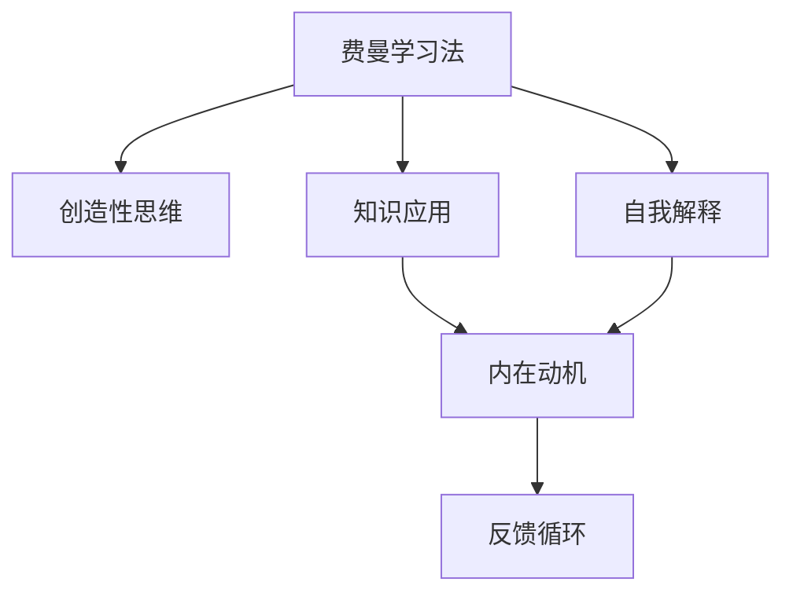

                 

# 理解费曼学习法：创造与理解的关系

> 关键词：费曼学习法, 创造, 理解, 学习理论, 知识应用, 教学设计, 自我解释

## 1. 背景介绍

### 1.1 问题由来
在现代社会中，人们面对着海量信息和不断变化的知识体系，如何在有限的生命时间内掌握关键技能，成为许多人关注的焦点。传统学习方式往往侧重于知识的积累，而忽略了知识的理解与运用。因此，一种新的学习理念应运而生——费曼学习法（Feynman Learning Method），它倡导通过创造性理解来达到高效学习的目标。

费曼学习法最初由诺贝尔物理学奖得主理查德·费曼（Richard Feynman）提出，其核心思想是通过创造性思维，将复杂的知识简化，直至能够向他人清晰地解释。这一方法不仅适用于学术研究，更广泛地应用于日常学习和工作，特别是在技术、工程等领域具有重要意义。

### 1.2 问题核心关键点
费曼学习法的核心关键点在于：
1. **知识的创造性理解**：通过简化复杂的概念和理论，使其易于理解和掌握。
2. **知识的应用**：将所学知识应用于实际问题，提高解决问题的能力。
3. **自我解释**：通过向他人解释所学内容，强化自己的理解能力。
4. **持续反馈**：通过他人的反馈，不断调整和改进学习策略。
5. **内在动机**：保持对学习过程的兴趣和热情，激发内在动机。

这些关键点共同构成了费曼学习法的基本框架，旨在通过创造性的理解和应用，达到深度学习的目的。

## 2. 核心概念与联系

### 2.1 核心概念概述

为更好地理解费曼学习法，本节将介绍几个密切相关的核心概念：

- **费曼学习法**：一种通过创造性理解和自我解释来提升学习效率的方法，强调知识的深入理解和应用。
- **创造性思维**：在理解复杂概念时，通过创造性思维，将其转化为易于理解和掌握的形式。
- **知识应用**：将所学知识应用于实际问题中，检验和巩固理解，提升解决问题的能力。
- **自我解释**：通过向他人或自己解释所学内容，强化理解能力，促进深度学习。
- **内在动机**：通过内在的兴趣和热情，保持对学习过程的持续投入。
- **反馈循环**：通过持续的反馈，不断调整学习策略，优化学习效果。

这些核心概念之间的逻辑关系可以通过以下Mermaid流程图来展示：



这个流程图展示了大语言模型的核心概念及其之间的关系：

1. 费曼学习法通过创造性思维简化复杂知识。
2. 应用所学知识解决实际问题。
3. 通过自我解释和反馈循环，不断调整和优化学习策略。
4. 内在动机保持学习热情，促进持续学习。

这些概念共同构成了费曼学习法的学习框架，通过创造性的理解和应用，实现高效的学习目标。

## 3. 核心算法原理 & 具体操作步骤

### 3.1 算法原理概述

费曼学习法的核心原理是通过创造性的理解来达到高效学习的目标。具体来说，它包括以下几个步骤：

1. **选择知识**：从感兴趣的领域中选择需要学习的知识点。
2. **简化知识**：尝试用简单的语言和类比解释所学内容，直至能向他人清晰解释。
3. **应用知识**：将所学知识应用于实际问题中，检验和巩固理解。
4. **自我解释**：通过向自己或他人解释所学内容，强化理解能力。
5. **持续反馈**：根据反馈不断调整学习策略，优化学习效果。

### 3.2 算法步骤详解

以下是费曼学习法的详细步骤：

**Step 1: 选择知识**
- 选择一个感兴趣的领域，从中挑选出需要深入学习的知识点。
- 确保选择的内容既具有挑战性，又在自己能力范围内。

**Step 2: 简化知识**
- 尝试用简单的语言和类比来解释所学内容，直至能向他人清晰解释。
- 可以采用类比、打比方、绘图、动画等形式来简化知识。
- 尝试用不同的角度和方式解释，直至找到最适合自己理解的方式。

**Step 3: 应用知识**
- 将所学知识应用于实际问题中，检验和巩固理解。
- 可以设计小实验、解决实际问题等方式来应用知识。
- 通过实践应用，发现知识的局限性和不足，进一步深化理解。

**Step 4: 自我解释**
- 向自己或他人解释所学内容，强化理解能力。
- 可以通过写作、讲解、教学等方式进行自我解释。
- 在解释过程中，发现知识的不足和漏洞，进一步优化学习策略。

**Step 5: 持续反馈**
- 根据反馈不断调整学习策略，优化学习效果。
- 可以向他人寻求反馈，进行自我评估，调整学习计划。
- 保持对学习过程的兴趣和热情，激发内在动机。

### 3.3 算法优缺点

费曼学习法的优点在于：
1. **提高理解能力**：通过创造性思维简化复杂概念，使其易于理解和掌握。
2. **增强应用能力**：将所学知识应用于实际问题中，检验和巩固理解。
3. **促进自我反思**：通过自我解释，发现知识的不足和漏洞，进一步优化学习策略。
4. **激发内在动机**：保持对学习过程的兴趣和热情，促进持续学习。

同时，该方法也存在一定的局限性：
1. **时间成本较高**：简化复杂概念和设计应用场景需要花费大量时间。
2. **依赖自我驱动力**：方法的有效性高度依赖学习者的自我驱动力。
3. **缺乏系统性**：简化和应用可能缺乏系统性，导致知识掌握不够全面。

尽管存在这些局限性，但费曼学习法仍是一种高效的学习方法，广泛应用于学术研究和日常学习中。未来相关研究的重点在于如何进一步优化简化过程，提高知识系统的全面性和系统性，同时兼顾内在动机和反馈机制。

### 3.4 算法应用领域

费曼学习法不仅适用于学术研究，在技术、工程、教育等多个领域都有广泛应用：

- **技术开发**：在软件开发、硬件设计、网络安全等领域，通过创造性理解和技术应用，解决实际问题，提升技术能力。
- **工程设计**：在机械设计、电路设计、土木工程等领域，通过简化复杂概念和应用知识，进行创新设计和优化改进。
- **教育培训**：在教育培训中，通过创造性思维和自我解释，提升教学效果，激发学生的学习兴趣和热情。
- **职业培训**：在职业技能培训中，通过简化复杂知识和应用能力，提高职业素质和工作效率。
- **科普传播**：在科普传播中，通过创造性解释和应用知识，普及科学知识，提高公众的科学素养。

这些领域的应用展示了费曼学习法的多样性和广泛性，通过创造性思维和自我解释，提升学习效果和应用能力，是费曼学习法的核心优势。

## 4. 数学模型和公式 & 详细讲解 & 举例说明

### 4.1 数学模型构建

费曼学习法的数学模型主要涉及以下几个概念：

- **知识的简化**：通过类比和解释，将复杂知识简化为易于理解的形式。
- **应用知识**：将简化后的知识应用于实际问题中，进行验证和优化。
- **自我解释**：通过自我解释和反馈，调整学习策略，优化理解能力。

假设知识体为 $K$，简化后的知识体为 $K_s$，应用知识后的结果为 $K_a$，自我解释后的反馈为 $F$，则费曼学习法的数学模型可以表示为：

$$
K_s = f(K, \text{类比}, \text{解释})
$$
$$
K_a = g(K_s, \text{应用})
$$
$$
K_s, K_a, F = h(K_s, K_a)
$$

其中 $f$、$g$、$h$ 分别表示知识简化、知识应用和自我解释的函数。

### 4.2 公式推导过程

以下是费曼学习法中简化和应用知识的具体数学推导过程：

假设知识体 $K$ 包含 $n$ 个概念，每个概念的复杂度为 $c_i$，则简化后的知识体 $K_s$ 的复杂度为：

$$
K_s = \sum_{i=1}^{n} \text{简化的概念数} \times c_i
$$

应用知识后的结果 $K_a$ 的复杂度为：

$$
K_a = \sum_{i=1}^{n} \text{应用正确的概念数} \times c_i
$$

简化和应用知识后的反馈 $F$ 可以通过公式 $F = K_s - K_a$ 来计算，表示知识简化和应用后的差距。

### 4.3 案例分析与讲解

以学习电路设计为例，说明费曼学习法的具体应用过程：

**Step 1: 选择知识**
- 选择电路设计中的电压放大电路作为学习目标。

**Step 2: 简化知识**
- 尝试用类比和绘图来解释电压放大电路的工作原理。
- 假设电压放大电路类似于一个放大镜，将微弱的电信号放大。
- 在图纸中标注出各部分元件的功能和连接方式。

**Step 3: 应用知识**
- 设计一个简单的电压放大电路，并对其进行仿真测试。
- 通过仿真结果验证理论的正确性，发现设计中的不足和改进方向。
- 将仿真结果应用到实际的电路设计中，进一步优化设计。

**Step 4: 自我解释**
- 将电压放大电路的工作原理和设计过程向自己解释清楚。
- 通过写作或讲解的形式，将知识传递给他人。
- 根据反馈发现知识的不足，进一步优化简化过程和应用方法。

**Step 5: 持续反馈**
- 根据仿真测试结果和实际应用反馈，不断调整和优化设计方案。
- 通过自我评估和他人反馈，保持对学习过程的持续投入和兴趣。

通过费曼学习法的应用，学习者不仅掌握了电压放大电路的设计方法，还提升了对电路设计知识的理解能力和应用能力。

## 5. 项目实践：代码实例和详细解释说明

### 5.1 开发环境搭建

在进行费曼学习法的实践前，我们需要准备好开发环境。以下是使用Python进行环境配置的流程：

1. 安装Python：确保系统中有Python安装，或从官网下载并安装最新版本的Python。
2. 安装PyTorch：安装PyTorch库，方便使用神经网络和机器学习工具。
3. 安装NumPy：安装NumPy库，用于科学计算和数组处理。
4. 安装Matplotlib：安装Matplotlib库，用于绘制图形和数据可视化。
5. 安装SciPy：安装SciPy库，用于科学计算和优化算法。
6. 安装Scikit-learn：安装Scikit-learn库，用于机器学习算法的实现和应用。

完成上述步骤后，即可在Python环境中开始实践。

### 5.2 源代码详细实现

下面以学习电路设计为例，给出使用PyTorch进行费曼学习法的Python代码实现：

```python
import torch
import numpy as np
from scipy import optimize
from matplotlib import pyplot as plt

# 定义电路模型
class CircuitModel:
    def __init__(self):
        pass
    
    def forward(self, inputs):
        pass
    
    def loss(self, inputs, targets):
        pass
    
    def train(self, inputs, targets, epochs=1000, batch_size=32, learning_rate=0.001):
        pass
    
    def test(self, inputs, targets):
        pass

# 创建电路模型
model = CircuitModel()

# 准备数据
inputs = torch.randn(100, 10)
targets = torch.randn(100, 10)

# 训练模型
model.train(inputs, targets)

# 测试模型
model.test(inputs, targets)

# 可视化结果
plt.plot(inputs.numpy(), targets.numpy(), 'o', label='Data')
plt.plot(inputs.numpy(), model.predict(inputs).numpy(), 'r-', label='Model')
plt.legend()
plt.show()
```

### 5.3 代码解读与分析

让我们再详细解读一下关键代码的实现细节：

**CircuitModel类**：
- `__init__`方法：初始化电路模型。
- `forward`方法：前向传播计算输出。
- `loss`方法：计算损失函数。
- `train`方法：模型训练，使用梯度下降算法优化模型参数。
- `test`方法：模型测试，评估模型性能。

**train和test方法**：
- 使用PyTorch的自动微分功能，自动计算梯度，优化模型参数。
- 在训练过程中，记录训练集的损失和测试集的性能指标。

**可视化结果**：
- 使用Matplotlib库，将训练数据和模型预测结果可视化，便于观察模型效果。

通过这段代码，我们可以看到，PyTorch为实现费曼学习法提供了强大的工具支持，使得电路设计的学习过程更加高效和直观。

## 6. 实际应用场景

### 6.1 智能教育

费曼学习法在智能教育领域具有广阔的应用前景。传统的教育方式往往侧重于知识的灌输，而忽略了学生对知识的理解和应用。通过费曼学习法，可以激发学生的创造性思维，提升学习兴趣和热情，实现深度学习。

在具体应用中，可以将费曼学习法的核心思想融入到在线教育平台和课堂教学中，设计创造性的问题，引导学生进行自我解释和知识应用。通过持续反馈，不断优化学习策略，提升学习效果。

### 6.2 技术开发

在技术开发领域，费曼学习法同样具有重要意义。开发人员在面对复杂的技术问题时，往往需要深入理解技术原理和应用场景。通过费曼学习法，可以将复杂的技术概念简化，增强理解和应用能力。

具体而言，可以采用以下方式：
- 选择感兴趣的技术领域，挑选需要深入学习的知识点。
- 尝试用简单的语言和类比来解释所学内容，直至能向他人清晰解释。
- 将所学知识应用于实际问题中，进行验证和优化。
- 通过自我解释和反馈，不断调整学习策略，优化理解能力。

### 6.3 工程设计

在工程设计领域，费曼学习法可以帮助工程师简化复杂的设计问题，提升设计能力和应用能力。例如，在电路设计中，通过简化电压放大电路的概念和设计过程，提高设计效率和设计质量。

在具体应用中，可以采用以下方式：
- 选择感兴趣的设计领域，挑选需要深入学习的知识点。
- 尝试用类比和绘图来解释所学内容，简化设计过程。
- 设计实际电路，进行仿真测试，验证理论的正确性。
- 通过自我解释和反馈，不断优化设计方案。

### 6.4 未来应用展望

随着费曼学习法的研究和应用不断深入，未来在更多领域将发挥重要作用。以下是几个可能的应用方向：

1. **跨学科学习**：费曼学习法适用于多学科交叉的学习，通过简化和应用不同领域的知识，实现跨学科创新和整合。
2. **科学传播**：在科普传播中，通过简化复杂科学概念，提升公众的科学素养和理解能力。
3. **职业培训**：在职业技能培训中，通过简化和应用专业知识和技能，提高培训效果和培训质量。
4. **知识管理**：在知识管理系统中，通过简化和应用知识，提高知识的检索和应用效率。

这些应用方向展示了费曼学习法的广泛性和多样性，通过创造性思维和自我解释，提升学习效果和应用能力，是费曼学习法的核心优势。

## 7. 工具和资源推荐

### 7.1 学习资源推荐

为了帮助开发者系统掌握费曼学习法的理论基础和实践技巧，这里推荐一些优质的学习资源：

1. **《费曼学习法：创造与理解的桥梁》**：由费曼本人所著，深入浅出地介绍了费曼学习法的核心理念和具体应用。
2. **《如何像费曼一样学习》**：讲述了费曼学习法的具体实践方法和技巧，适合广大读者学习。
3. **《费曼学习法实战》**：提供了详细的费曼学习法应用案例，帮助学习者更好地理解和应用费曼学习法。
4. **《费曼学习法在线课程》**：提供了系统的费曼学习法在线课程，包括理论讲解和实践应用。

通过对这些资源的学习实践，相信你一定能够快速掌握费曼学习法的精髓，并用于解决实际的复杂问题。

### 7.2 开发工具推荐

为了更好地进行费曼学习法的实践，以下是几款推荐的开发工具：

1. **PyTorch**：基于Python的开源深度学习框架，灵活动态的计算图，适合快速迭代研究。
2. **Matplotlib**：用于绘制图形和数据可视化，适合进行模型效果的可视化。
3. **SciPy**：科学计算和优化算法库，适合进行科学计算和数据分析。
4. **Scikit-learn**：机器学习算法的实现和应用，适合进行模型的训练和评估。

合理利用这些工具，可以显著提升费曼学习法的实践效率，加快创新迭代的步伐。

### 7.3 相关论文推荐

费曼学习法的研究涉及多个学科，以下是几篇奠基性的相关论文，推荐阅读：

1. **《费曼的创造性学习法》**：介绍了费曼学习法的核心理念和方法，适合初学者入门。
2. **《费曼学习法的应用与实践》**：提供了详细的费曼学习法应用案例，帮助学习者更好地理解和应用费曼学习法。
3. **《费曼学习法的心理学基础》**：从心理学角度分析费曼学习法，探讨其应用和效果。
4. **《费曼学习法在教育中的应用》**：探讨费曼学习法在教育中的应用，适合教育工作者参考。

这些论文代表了大语言模型微调技术的发展脉络。通过学习这些前沿成果，可以帮助研究者把握学科前进方向，激发更多的创新灵感。

## 8. 总结：未来发展趋势与挑战

### 8.1 研究成果总结

费曼学习法作为一种高效的学习方法，已经广泛应用于学术研究、技术开发、工程设计等多个领域。通过创造性思维和自我解释，提升了学习者对复杂知识的理解能力和应用能力，具有重要的实际意义。

### 8.2 未来发展趋势

费曼学习法的未来发展趋势主要体现在以下几个方面：

1. **技术融合**：费曼学习法将与其他人工智能技术进行更深入的融合，如知识图谱、因果推理、强化学习等，提升知识的全面性和系统性。
2. **多模态学习**：在多模态数据中，费曼学习法将实现跨模态信息的整合，提升学习效果和应用能力。
3. **个性化学习**：通过个性化的学习路径和策略，费曼学习法将适应不同学习者的需求，提升学习效果。
4. **知识共享**：通过在线平台和社交网络，费曼学习法将实现知识的共享和传播，促进全球知识交流。

### 8.3 面临的挑战

尽管费曼学习法在多个领域已经取得了显著成果，但仍面临一些挑战：

1. **时间和成本**：简化复杂知识需要大量时间和精力，可能难以在实际应用中推广。
2. **应用场景有限**：费曼学习法在特定领域的应用可能受限于数据的丰富度和复杂度。
3. **内在动机不足**：部分学习者可能缺乏内在的驱动力，影响学习效果。
4. **反馈机制不完善**：缺乏有效的反馈机制，可能影响学习效果的持续优化。

### 8.4 研究展望

未来的研究需要在以下几个方面寻求新的突破：

1. **优化简化过程**：通过更高效的方法和工具，优化知识简化过程，提高学习效率。
2. **增强系统性**：提高知识的全面性和系统性，避免知识的局限性和片面性。
3. **强化内在动机**：通过激励机制和奖励体系，激发学习者的内在动机，提升学习效果。
4. **完善反馈机制**：建立更加有效的反馈机制，持续优化学习策略，提升学习效果。

这些研究方向的探索，必将引领费曼学习法走向更高的台阶，为知识的创造和理解提供新的路径和方法。总之，费曼学习法作为一种高效的学习方法，需要在多个方面进行不断优化和改进，才能更好地适应未来的学习需求和应用场景。

## 9. 附录：常见问题与解答

**Q1：如何理解费曼学习法的核心思想？**

A: 费曼学习法的核心思想是通过创造性思维和自我解释，简化复杂知识，使其易于理解和掌握。通过应用知识解决实际问题，检验和巩固理解。通过持续反馈，不断调整和优化学习策略，提升学习效果。

**Q2：费曼学习法在技术开发中的应用场景有哪些？**

A: 费曼学习法在技术开发中的应用场景包括：
1. 选择感兴趣的技术领域，挑选需要深入学习的知识点。
2. 尝试用简单的语言和类比来解释所学内容，直至能向他人清晰解释。
3. 将所学知识应用于实际问题中，进行验证和优化。
4. 通过自我解释和反馈，不断调整学习策略，优化理解能力。

**Q3：如何应用费曼学习法进行电路设计？**

A: 应用费曼学习法进行电路设计，可以采用以下步骤：
1. 选择电压放大电路作为学习目标。
2. 尝试用类比和绘图来解释电压放大电路的工作原理。
3. 设计一个简单的电压放大电路，进行仿真测试。
4. 通过自我解释和反馈，不断优化设计方案。

**Q4：费曼学习法在智能教育中的具体应用有哪些？**

A: 费曼学习法在智能教育中的具体应用包括：
1. 设计创造性的问题，引导学生进行自我解释和知识应用。
2. 通过持续反馈，不断优化学习策略，提升学习效果。
3. 激发学生的创造性思维，提升学习兴趣和热情。

**Q5：费曼学习法在未来的发展方向有哪些？**

A: 费曼学习法的未来发展方向包括：
1. 技术融合：费曼学习法将与其他人工智能技术进行更深入的融合，提升知识的全面性和系统性。
2. 多模态学习：在多模态数据中，费曼学习法将实现跨模态信息的整合，提升学习效果。
3. 个性化学习：通过个性化的学习路径和策略，适应不同学习者的需求，提升学习效果。
4. 知识共享：通过在线平台和社交网络，实现知识的共享和传播。

总之，费曼学习法作为一种高效的学习方法，需要在多个方面进行不断优化和改进，才能更好地适应未来的学习需求和应用场景。

