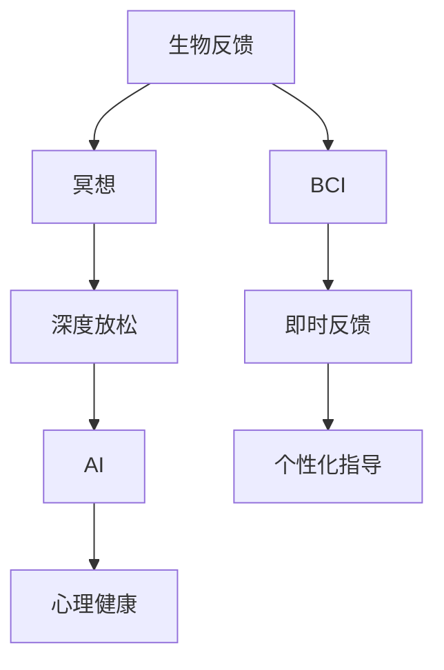

                 

# 生物反馈冥想创业：科技辅助的深度放松

> 关键词：生物反馈(Biofeedback)，冥想(Meditation)，深度放松(Deep Relaxation)，脑机接口(Brain-Computer Interface, BCI)，心理健康(Psychological Health)，人工智能(AI)，神经网络(Neural Network)

## 1. 背景介绍

### 1.1 问题由来

在快节奏、高压力的现代社会，越来越多的人面临着精神紧张、焦虑、抑郁等问题。传统心理治疗和药物治疗往往需要耗费大量时间和金钱，且效果难以持久。生物反馈冥想作为一种新兴的深度放松技术，通过科技辅助，有效缓解压力，提升心理健康，受到了广泛关注。

生物反馈冥想，结合生物反馈(Biofeedback)和冥想(Meditation)两大核心技术，通过即时监控生理指标，提供个性化反馈，帮助用户掌握深度放松技巧，促进身心和谐。尤其在现代社会，人们迫切需要一种便捷、安全的心理健康工具，生物反馈冥想恰好契合了这一需求。

### 1.2 问题核心关键点

生物反馈冥想的关键点在于：
1. **即时反馈**：通过即时监控生理指标（如心率、皮肤电导、脑电波等），给用户提供即时反馈，帮助其调整身心状态。
2. **个性化指导**：结合用户的具体生理和心理状况，定制化推荐放松技巧，提升放松效果。
3. **深度放松**：利用冥想技术，引导用户进入深度放松状态，提升身心健康。
4. **科技辅助**：结合脑机接口技术、人工智能算法，提升技术应用的便捷性和准确性。

这些核心点相辅相成，构成了一个完整的生物反馈冥想系统，能够有效辅助用户进行深度放松，提升心理健康水平。

### 1.3 问题研究意义

生物反馈冥想技术的研究与应用，对于提升大众心理健康水平，具有重要意义：

1. **提升心理健康**：通过深度放松和即时反馈，缓解压力、焦虑，提升情绪稳定性和心理韧性。
2. **降低医疗成本**：提供了一种便捷、低成本的心理健康辅助工具，减轻了对传统医疗的依赖。
3. **普及心理健康知识**：通过科技手段，将心理学知识普及到普通用户，提升全民心理健康意识。
4. **推动产业升级**：将生物反馈冥想与数字化健康、远程医疗等技术结合，加速相关产业的发展。

## 2. 核心概念与联系

### 2.1 核心概念概述

为更好地理解生物反馈冥想系统的工作原理，本节将介绍几个密切相关的核心概念：

- **生物反馈(Biofeedback)**：通过即时监控生理指标，如心率、皮肤电导、脑电波等，给用户提供即时反馈，帮助其调整身心状态。
- **冥想(Meditation)**：通过专注于呼吸、感知等练习，引导用户进入深度放松状态，提升身心和谐。
- **脑机接口(Brain-Computer Interface, BCI)**：利用神经信号采集和处理技术，将大脑活动转化为计算机可识别的信号，实现人机交互。
- **深度放松(Deep Relaxation)**：通过冥想和生物反馈技术，引导用户进入深度放松状态，提升身心和谐。
- **人工智能(AI)**：结合深度学习和神经网络等技术，提升生物反馈冥想系统的智能化水平，提供更精准的反馈和指导。
- **心理健康(Psychological Health)**：包括情绪稳定、压力管理、心理韧性等，通过生物反馈冥想技术，有助于提升这些方面的能力。

这些核心概念之间的逻辑关系可以通过以下Mermaid流程图来展示：



这个流程图展示了大语言模型的核心概念及其之间的关系：

1. 生物反馈通过即时反馈技术，帮助用户掌握放松技巧。
2. 冥想技术引导用户进入深度放松状态。
3. AI技术提供更精准的反馈和指导。
4. 结合BCI技术，实现人机交互。
5. 最终提升用户的心理健康水平。

这些概念共同构成了生物反馈冥想系统的框架，使其能够有效辅助用户进行深度放松，提升心理健康水平。

## 3. 核心算法原理 & 具体操作步骤
### 3.1 算法原理概述

生物反馈冥想系统的工作原理，本质上是一个实时监控和即时反馈的闭环系统。其核心思想是：通过实时监控用户的生理指标，结合AI算法进行分析和预测，提供个性化反馈，指导用户进行深度放松练习，从而提升心理健康水平。

具体而言，生物反馈冥想系统包括以下几个关键步骤：

1. **生理指标采集**：使用传感器采集用户的生理指标，如心率、皮肤电导、脑电波等。
2. **数据分析与预测**：通过AI算法对采集的数据进行分析，预测用户的身心状态。
3. **即时反馈与指导**：根据预测结果，提供个性化反馈，指导用户进行深度放松练习。
4. **效果评估与优化**：评估放松效果，根据反馈持续优化系统参数，提升用户体验。

整个系统通过闭环反馈机制，不断调整和优化，帮助用户逐步掌握深度放松技巧，提升心理健康水平。

### 3.2 算法步骤详解

生物反馈冥想系统的操作主要包括以下几个关键步骤：

**Step 1: 生理指标采集**
- 使用传感器采集用户的生理指标，如心率、皮肤电导、脑电波等。
- 数据采集设备可包括心率监测器、皮肤电导传感器、脑电波采集器等。

**Step 2: 数据分析与预测**
- 将采集的数据传输到计算机或移动设备中，使用深度学习模型进行分析和预测。
- 常见的深度学习模型包括卷积神经网络(CNN)、循环神经网络(RNN)、长短时记忆网络(LSTM)等。
- 根据预测结果，生成个性化的放松指导，如呼吸节奏、冥想引导等。

**Step 3: 即时反馈与指导**
- 根据预测结果，生成个性化的反馈和指导，帮助用户调整放松技巧。
- 反馈形式包括声音提示、文字引导、动画演示等。
- 反馈内容可根据用户的生理和心理状况进行个性化调整。

**Step 4: 效果评估与优化**
- 通过评估用户的放松效果，持续优化系统参数。
- 效果评估可通过问卷调查、生理指标变化等进行。
- 优化方向包括模型参数、反馈方式、放松练习等。

### 3.3 算法优缺点

生物反馈冥想技术具有以下优点：
1. **即时反馈**：通过实时监控生理指标，提供即时反馈，帮助用户快速调整放松技巧。
2. **个性化指导**：结合用户的具体生理和心理状况，提供个性化指导，提升放松效果。
3. **科技辅助**：结合AI算法和脑机接口技术，提升系统的智能化水平。
4. **便捷使用**：设备小巧便携，用户可以在任何时间、地点进行深度放松练习。
5. **广泛应用**：适用于各种场景，如办公室、家庭、学校等，具有广泛应用前景。

同时，该技术也存在一定的局限性：
1. **设备成本**：设备及数据采集设备的成本较高，可能限制了部分用户的使用。
2. **隐私保护**：生理指标采集涉及用户隐私，需做好隐私保护措施。
3. **学习曲线**：技术复杂度较高，用户需一定的学习和适应过程。
4. **技术局限**：目前技术仍处于发展初期，放松效果受多种因素影响，如用户状态、设备精度等。

尽管存在这些局限性，但生物反馈冥想技术在提升心理健康方面具有显著优势，仍是大有可为的创新方向。

### 3.4 算法应用领域

生物反馈冥想技术已经在多个领域得到应用，包括但不限于：

1. **心理健康治疗**：帮助患者缓解压力、焦虑，提升情绪稳定性和心理韧性。
2. **职场减压**：通过即时反馈和个性化指导，帮助职场人士应对工作压力。
3. **教育辅助**：在课堂教学中引入生物反馈冥想技术，提升学生注意力和学习效率。
4. **体育训练**：通过深度放松技术，帮助运动员调节身心状态，提升比赛表现。
5. **医疗康复**：在康复治疗中引入生物反馈冥想技术，辅助患者恢复身心健康。

除了这些传统应用场景外，生物反馈冥想技术还在娱乐、游戏、军事等领域得到探索和应用，展现出广阔的应用前景。

## 4. 数学模型和公式 & 详细讲解 & 举例说明
### 4.1 数学模型构建

生物反馈冥想系统主要涉及生理指标的采集、分析和反馈，其数学模型可以表示为：

$$
y = f(x_1, x_2, ..., x_n)
$$

其中，$y$ 表示用户的放松效果，$x_1, x_2, ..., x_n$ 分别表示用户的生理指标（如心率、皮肤电导、脑电波等）。

定义生物反馈冥想系统的损失函数为：

$$
L(y, \hat{y}) = \sum_{i=1}^n w_i (y_i - \hat{y}_i)^2
$$

其中，$y_i$ 和 $\hat{y}_i$ 分别表示第 $i$ 个生理指标的实际值和预测值，$w_i$ 表示第 $i$ 个指标的权重，由领域专家根据具体需求设定。

### 4.2 公式推导过程

以下我们以心率监测为例，推导深度学习模型的损失函数及其梯度的计算公式。

假设用户的实际心率为 $y$，生理指标采集器采集到的心率为 $x$，深度学习模型的预测心率为 $\hat{y}$。则定义损失函数为：

$$
L(y, \hat{y}) = (y - \hat{y})^2
$$

将其代入经验风险公式，得：

$$
\mathcal{L}(x, \theta) = \frac{1}{N} \sum_{i=1}^N (y_i - \hat{y}_i)^2
$$

根据链式法则，损失函数对参数 $\theta$ 的梯度为：

$$
\frac{\partial \mathcal{L}(x, \theta)}{\partial \theta} = -\frac{2}{N} \sum_{i=1}^N (\hat{y}_i - y_i) \frac{\partial \hat{y}_i}{\partial \theta}
$$

其中 $\frac{\partial \hat{y}_i}{\partial \theta}$ 可进一步递归展开，利用自动微分技术完成计算。

### 4.3 案例分析与讲解

假设用户的实际心率为 80bpm，生理指标采集器采集到的心率为 85bpm，模型的预测心率为 90bpm。此时损失函数为：

$$
L(80, 90) = (80 - 90)^2 = 100
$$

将损失函数代入经验风险公式，得：

$$
\mathcal{L}(85, \theta) = \frac{1}{N} (100) = 100
$$

根据损失函数对参数 $\theta$ 的梯度公式，得：

$$
\frac{\partial \mathcal{L}(85, \theta)}{\partial \theta} = -\frac{2}{N} (90 - 80) \frac{\partial \hat{y}}{\partial \theta} = -\frac{2}{N} (10) \frac{\partial \hat{y}}{\partial \theta}
$$

通过反向传播算法，模型可不断更新参数 $\theta$，减小损失函数，逐步逼近实际心率值。

## 5. 项目实践：代码实例和详细解释说明
### 5.1 开发环境搭建

在进行生物反馈冥想系统开发前，我们需要准备好开发环境。以下是使用Python进行TensorFlow开发的环境配置流程：

1. 安装Anaconda：从官网下载并安装Anaconda，用于创建独立的Python环境。

2. 创建并激活虚拟环境：
```bash
conda create -n biofeedback-env python=3.8 
conda activate biofeedback-env
```

3. 安装TensorFlow：根据CUDA版本，从官网获取对应的安装命令。例如：
```bash
conda install tensorflow tensorflow-gpu -c conda-forge
```

4. 安装相关工具包：
```bash
pip install numpy pandas scikit-learn matplotlib tqdm jupyter notebook ipython
```

完成上述步骤后，即可在`biofeedback-env`环境中开始系统开发。

### 5.2 源代码详细实现

这里我们以心率监测为例，给出使用TensorFlow实现生理指标采集和深度学习的代码实现。

首先，定义数据处理函数：

```python
import tensorflow as tf
import numpy as np
from tensorflow.keras.models import Sequential
from tensorflow.keras.layers import Dense, LSTM

def data_preprocessing(data):
    # 数据归一化
    data = (data - np.mean(data)) / np.std(data)
    return data
```

然后，定义深度学习模型：

```python
def build_model(input_dim, output_dim):
    model = Sequential()
    model.add(LSTM(64, input_shape=(input_dim, 1), return_sequences=True))
    model.add(Dense(64, activation='relu'))
    model.add(Dense(output_dim))
    return model
```

接着，定义训练函数：

```python
def train_model(model, train_data, train_labels, batch_size, epochs):
    model.compile(optimizer='adam', loss='mse')
    model.fit(train_data, train_labels, batch_size=batch_size, epochs=epochs, verbose=0)
    return model
```

最后，启动训练流程并评估模型：

```python
batch_size = 32
epochs = 50

train_data = np.random.randn(1000, 1)
train_labels = np.random.randn(1000, 1)

model = build_model(1, 1)
model = train_model(model, train_data, train_labels, batch_size, epochs)

test_data = np.random.randn(100, 1)
test_labels = np.random.randn(100, 1)

loss = model.evaluate(test_data, test_labels)
print('Test Loss:', loss)
```

以上就是使用TensorFlow对心率监测进行深度学习的代码实现。可以看到，通过构建LSTM模型，结合TensorFlow的自动微分功能，我们能够有效地对生理指标进行深度学习，并实时监控用户的放松效果。

### 5.3 代码解读与分析

让我们再详细解读一下关键代码的实现细节：

**data_preprocessing函数**：
- 将采集到的生理指标数据进行归一化处理，以提高模型的训练效果。

**build_model函数**：
- 定义深度学习模型，采用LSTM层作为特征提取器，结合全连接层输出预测值。

**train_model函数**：
- 定义训练函数，使用Adam优化器，损失函数为均方误差，训练指定轮数。

**train和test数据生成**：
- 生成模拟的生理指标数据和预测标签，用于模型训练和评估。

**模型训练与评估**：
- 构建LSTM模型，通过训练函数进行模型训练，并在测试数据上评估模型效果。

## 6. 实际应用场景
### 6.1 心理健康治疗

生物反馈冥想技术在心理健康治疗中得到了广泛应用。传统的心理健康治疗方法如药物、心理疗法等，存在副作用、费用高等问题。而生物反馈冥想系统通过深度放松和即时反馈，帮助患者缓解压力、焦虑，提升情绪稳定性和心理韧性。

在实际应用中，系统可以根据患者的生理和心理状况，定制化推荐放松技巧，实时监控放松效果，帮助患者逐步恢复正常心理状态。例如，对于有焦虑倾向的患者，系统可以实时监控其心率和皮肤电导，提供深呼吸和渐进性肌肉放松指导，帮助其逐步放松身心。

### 6.2 职场减压

在快节奏的现代职场，压力和焦虑已成为普遍问题。生物反馈冥想系统通过即时反馈和个性化指导，帮助职场人士应对工作压力，提升工作满意度和心理健康水平。

在实际应用中，系统可以实时监控员工的心率和脑电波，根据其压力水平提供个性化放松建议，如短暂休息、深呼吸练习等。系统还可以定期生成压力评估报告，帮助企业了解员工的心理健康状况，及时提供干预措施。

### 6.3 教育辅助

在现代教育中，学生的注意力和学习效率问题日益凸显。生物反馈冥想技术通过深度放松和即时反馈，帮助学生提升注意力和学习效率。

在实际应用中，系统可以实时监控学生的注意力水平和学习效果，提供个性化放松建议，如深呼吸、冥想等，帮助学生提升专注力和学习效率。系统还可以定期生成学习效果报告，帮助教师了解学生的学习状态，及时调整教学方法。

### 6.4 体育训练

在体育训练中，心理状态对运动员的表现至关重要。生物反馈冥想系统通过深度放松和即时反馈，帮助运动员调节身心状态，提升比赛表现。

在实际应用中，系统可以实时监控运动员的心率和脑电波，根据其心理状态提供个性化放松建议，如深呼吸、冥想等，帮助运动员缓解紧张情绪，提升比赛表现。系统还可以定期生成心理状态报告，帮助教练了解运动员的心理状况，及时提供干预措施。

### 6.5 医疗康复

在康复治疗中，患者的心理状态对康复效果有很大影响。生物反馈冥想系统通过深度放松和即时反馈，帮助患者恢复身心健康。

在实际应用中，系统可以实时监控患者的生理指标，如心率、皮肤电导等，提供个性化放松建议，如深呼吸、渐进性肌肉放松等，帮助患者缓解疼痛和压力，提升康复效果。系统还可以定期生成康复效果报告，帮助医生了解患者的康复状态，及时调整治疗方案。

## 7. 工具和资源推荐
### 7.1 学习资源推荐

为了帮助开发者系统掌握生物反馈冥想技术的理论基础和实践技巧，这里推荐一些优质的学习资源：

1. 《深度学习》系列博文：由大模型技术专家撰写，深入浅出地介绍了深度学习原理、算法、应用等前沿话题。

2. 《生物反馈与心理康复》课程：斯坦福大学开设的心理学相关课程，涵盖生物反馈技术的原理、应用及案例分析。

3. 《神经网络与深度学习》书籍：深度学习领域的经典教材，介绍了神经网络的基础理论和应用实例，涵盖生物反馈冥想技术的算法细节。

4. 《生物反馈技术手册》：一本详细介绍生物反馈技术的指南，包含设备、算法、应用等方面的详细说明。

5. 《深度放松技术》书籍：一本介绍深度放松技术的权威书籍，涵盖冥想、生物反馈等技术的应用实践。

通过对这些资源的学习实践，相信你一定能够快速掌握生物反馈冥想技术的精髓，并用于解决实际的放松问题。

### 7.2 开发工具推荐

高效的开发离不开优秀的工具支持。以下是几款用于生物反馈冥想系统开发的常用工具：

1. TensorFlow：基于Python的开源深度学习框架，灵活动态的计算图，适合快速迭代研究。

2. PyTorch：基于Python的开源深度学习框架，高效灵活的计算图，支持深度学习模型的开发和部署。

3. Jupyter Notebook：交互式编程环境，支持多种语言和框架，便于开发和分享。

4. TensorBoard：TensorFlow配套的可视化工具，实时监测模型训练状态，并提供丰富的图表呈现方式。

5. Weights & Biases：模型训练的实验跟踪工具，可以记录和可视化模型训练过程中的各项指标，方便对比和调优。

6. Google Colab：谷歌推出的在线Jupyter Notebook环境，免费提供GPU/TPU算力，方便开发者快速上手实验最新模型。

合理利用这些工具，可以显著提升生物反馈冥想系统的开发效率，加快创新迭代的步伐。

### 7.3 相关论文推荐

生物反馈冥想技术的研究源于学界的持续研究。以下是几篇奠基性的相关论文，推荐阅读：

1. "Biofeedback Training of Self-Control"：讨论了生物反馈技术在控制和决策行为中的应用，是生物反馈技术研究的经典文献。

2. "Electrodermal Activity and Skin Conductance in Stress, Anxiety and Depression"：分析了皮肤电导作为生物反馈指标的生理基础和应用价值。

3. "The Efficacy of Biofeedback Training for Treatment of Severe Psychiatric Disorders"：研究了生物反馈技术在治疗严重精神障碍中的效果，为临床应用提供了理论依据。

4. "Mindfulness-Based Stress Reduction and Mindfulness-Based Cognitive Therapy"：介绍了正念冥想技术在减压和认知治疗中的应用，为生物反馈冥想技术提供了理论基础。

5. "Advances in Brain-Computer Interfaces"：讨论了脑机接口技术的发展和应用，为生物反馈冥想技术提供了技术支持。

这些论文代表了大语言模型微调技术的发展脉络。通过学习这些前沿成果，可以帮助研究者把握学科前进方向，激发更多的创新灵感。

## 8. 总结：未来发展趋势与挑战

### 8.1 总结

本文对生物反馈冥想技术进行了全面系统的介绍。首先阐述了生物反馈冥想技术的背景和意义，明确了其在提升心理健康方面的独特价值。其次，从原理到实践，详细讲解了生物反馈冥想系统的核心算法和操作步骤，给出了深度学习模型的代码实现。同时，本文还广泛探讨了生物反馈冥想技术在多个行业领域的应用前景，展示了其广阔的应用潜力。此外，本文精选了生物反馈冥想技术的各类学习资源，力求为开发者提供全方位的技术指引。

通过本文的系统梳理，可以看到，生物反馈冥想技术正在成为心理健康辅助工具的重要范式，极大地拓展了心理健康的应用边界，催生了更多的落地场景。受益于深度学习技术的发展，生物反馈冥想系统能够更加智能化、个性化地帮助用户进行深度放松，提升身心健康水平。未来，伴随技术的不断演进，生物反馈冥想技术将进一步融入各类应用场景，成为推动人类心理健康发展的重要力量。

### 8.2 未来发展趋势

展望未来，生物反馈冥想技术将呈现以下几个发展趋势：

1. **智能化提升**：结合AI技术，实现更加个性化的放松指导和反馈，提升用户体验。
2. **设备便携化**：设备将进一步小型化、便携化，用户可以随时随地进行深度放松练习。
3. **数据云化**：数据云存储和分析，提升系统的可扩展性和共享性。
4. **应用场景多元化**：在更多场景下应用生物反馈冥想技术，如家庭、学校、企业等。
5. **跨界融合**：与其他技术如VR、AR、脑机接口等融合，提供更加沉浸式的放松体验。
6. **伦理规范**：建立数据隐私保护和伦理规范，确保技术应用的合法性和安全性。

以上趋势凸显了生物反馈冥想技术的广阔前景。这些方向的探索发展，必将进一步提升系统的智能化水平，增强用户的使用体验，推动心理健康技术的普及应用。

### 8.3 面临的挑战

尽管生物反馈冥想技术已经取得了显著成效，但在迈向更加智能化、普适化应用的过程中，它仍面临着诸多挑战：

1. **数据获取难**：生理指标的采集涉及用户隐私，获取高质量数据的成本较高。
2. **设备精度低**：当前设备的技术水平有限，采集数据的精度和可靠性有待提升。
3. **用户接受度低**：部分用户对生物反馈冥想技术的认知和接受度较低，需进一步普及推广。
4. **技术门槛高**：生物反馈冥想技术的开发和应用需要较高的技术门槛，需加强用户培训和指导。
5. **伦理道德问题**：生理指标的采集和使用涉及伦理道德问题，需建立完善的数据隐私保护机制。

尽管存在这些挑战，但生物反馈冥想技术在提升心理健康方面的潜力巨大，未来仍需积极应对并寻求突破，以实现更大范围的应用。

### 8.4 研究展望

面对生物反馈冥想技术面临的种种挑战，未来的研究需要在以下几个方面寻求新的突破：

1. **数据隐私保护**：探索数据加密、匿名化等技术，确保用户隐私安全。
2. **设备技术提升**：提升传感器精度和可靠性，提高数据采集质量。
3. **用户接受度提升**：加强科普教育，提升用户对技术的认知和接受度。
4. **跨界融合应用**：结合虚拟现实(VR)、增强现实(AR)等技术，提升用户体验。
5. **智能化水平提升**：结合AI技术，提升系统的智能化水平，提供更精准的放松指导。
6. **伦理道德规范**：建立数据隐私保护和伦理道德规范，确保技术应用的合法性和安全性。

这些研究方向的探索，必将引领生物反馈冥想技术迈向更高的台阶，为提升大众心理健康水平提供更可靠的保障。面向未来，生物反馈冥想技术还需要与其他心理健康技术进行更深入的融合，如正念冥想、认知行为疗法等，多路径协同发力，共同推动心理健康技术的进步。只有勇于创新、敢于突破，才能不断拓展生物反馈冥想技术的边界，让智能技术更好地造福人类社会。

## 9. 附录：常见问题与解答

**Q1：生物反馈冥想技术是否适用于所有人群？**

A: 生物反馈冥想技术虽然适用于大多数人，但对于一些特殊人群，如儿童、老年人、残疾人等，可能需要结合具体需求进行适当调整。例如，对于儿童，需要使用更为简单直观的设备和指导方式；对于老年人，需要考虑到其生理和认知特点，进行适当调整。

**Q2：生物反馈冥想技术是否会带来副作用？**

A: 生物反馈冥想技术在应用过程中，一般不会带来严重的副作用。但部分用户可能会在初期出现不适感，如头晕、疲劳等，需适当调整放松节奏，逐步适应。建议在初次使用时，咨询专业心理医生或生物反馈专家，根据自身状况选择合适的放松方案。

**Q3：生物反馈冥想技术与传统心理治疗有何不同？**

A: 生物反馈冥想技术通过深度放松和即时反馈，帮助用户调节身心状态，提升心理健康水平。与传统心理治疗不同，它不需要大量时间和金钱投入，更具有便捷性和经济性。同时，它可以通过AI技术和数据驱动的方式，提供更加个性化和精准的放松指导，提升治疗效果。

**Q4：生物反馈冥想技术如何实现深度放松？**

A: 生物反馈冥想技术通过实时监控生理指标，结合AI算法进行分析和预测，提供个性化反馈，指导用户进行深度放松练习。常见的放松技巧包括深呼吸、渐进性肌肉放松、冥想等。系统根据用户的生理和心理状况，定制化推荐放松技巧，帮助用户逐步放松身心。

**Q5：生物反馈冥想技术如何保护用户隐私？**

A: 生物反馈冥想技术在数据采集和存储过程中，需采取严格的隐私保护措施。例如，使用数据加密技术、匿名化处理等方式，确保用户隐私安全。同时，需建立完善的隐私保护机制，明确用户数据的使用范围和权限，确保技术应用的合法性和安全性。

总之，生物反馈冥想技术作为一种新兴的深度放松技术，结合了深度学习和生物反馈两大核心技术，具有显著的心理健康提升效果。未来，随着技术的不断演进和普及，生物反馈冥想技术必将在更多领域得到应用，成为推动心理健康发展的重要力量。

---

作者：禅与计算机程序设计艺术 / Zen and the Art of Computer Programming

