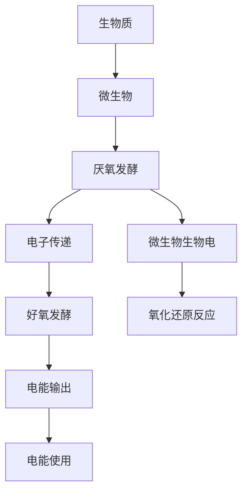

                 

# 生物燃料电池技术：利用微生物产生电能

> 关键词：生物燃料电池,微生物,电能,发酵,氧化还原,电化学,生物技术

## 1. 背景介绍

### 1.1 问题由来
随着全球能源需求不断增长，化石燃料的有限性和环境污染问题愈发凸显。为了寻求清洁、可再生的能源解决方案，研究人员在二十世纪末提出了生物燃料电池(BFC)的概念，利用微生物的代谢过程，将生物质能转化为电能。

生物燃料电池是一种基于微生物发酵和电化学原理的能量转换技术。其核心在于将微生物在厌氧或好氧环境下的代谢过程产生的电子通过外部电路传递到电极，从而产生电能。微生物通过氧化有机物质，释放电子和质子，形成电子流，驱动电极反应，最终生成电能。

生物燃料电池具有独特的优势，包括高效能、低成本、环境友好等。通过微生物的自生代谢，生物燃料电池不仅能够有效利用生物质资源，还能减少温室气体排放和环境污染。因此，生物燃料电池在能源自给自足、环境保护、生态可持续性等领域具有重要应用前景。

### 1.2 问题核心关键点
生物燃料电池技术的核心在于微生物的代谢反应和电化学过程的结合。具体而言，包括以下几个关键点：

1. **微生物的选择与培养**：不同的微生物对有机物的代谢能力不同，选择合适的微生物能够提高电池效率。
2. **发酵过程的优化**：发酵是生物燃料电池的基础，优化发酵条件能够提高有机物的转化效率。
3. **电极反应的促进**：通过设计和优化电极材料、催化剂，促进电子传递，提升电池的电化学性能。
4. **系统集成与优化**：生物燃料电池系统的集成和优化，包括微生物的培养、发酵液与电极的连接等，对系统性能和稳定性有重要影响。

### 1.3 问题研究意义
研究生物燃料电池技术，对于推动能源结构的绿色转型，实现经济社会的可持续发展具有重要意义：

1. **减少对化石燃料的依赖**：生物燃料电池能够利用生物质资源，如农业废弃物、有机废水等，减少对化石燃料的依赖。
2. **降低碳排放**：微生物的代谢过程不需要氧气，能够有效减少温室气体排放。
3. **环境友好**：微生物的代谢过程不会产生有害物质，电池本身对环境影响较小。
4. **可再生能源**：生物燃料电池利用可再生生物质资源，可实现能源的自我循环。
5. **成本效益高**：与传统电池技术相比，生物燃料电池的制备和运行成本相对较低。

## 2. 核心概念与联系

### 2.1 核心概念概述

为更好地理解生物燃料电池技术的原理和应用，本节将介绍几个关键概念：

- **生物燃料电池(BFC)**：一种基于微生物代谢产生的电能转换技术。
- **厌氧发酵(AF)与好氧发酵(AF)**：微生物在无氧或有氧条件下代谢有机物的过程。
- **氧化还原反应(ORR)**：微生物代谢过程中的电子传递过程。
- **电化学**：利用化学能转化为电能的过程。
- **微生物生物电(Biocatalytic Electricity)**：微生物通过代谢反应产生电能的技术。
- **微生物燃料电池(MFC)**：基于厌氧发酵的生物燃料电池技术。
- **微生物质子交换膜燃料电池(MPEMFC)**：基于好氧发酵的生物燃料电池技术。

这些概念之间存在紧密联系，共同构成了生物燃料电池技术的理论基础。通过这些概念，我们可以更好地把握生物燃料电池的核心原理和应用场景。

### 2.2 核心概念原理和架构的 Mermaid 流程图



这个流程图展示了生物燃料电池技术的基本流程和架构：

1. 生物质作为输入，进入微生物代谢。
2. 微生物通过厌氧或好氧发酵，代谢生物质，释放电子和质子。
3. 电子通过外部电路传递到电极，发生氧化还原反应。
4. 电池输出电能，供外部设备使用。

通过这一过程，生物燃料电池实现了生物质能到电能的高效转换。

## 3. 核心算法原理 & 具体操作步骤
### 3.1 算法原理概述

生物燃料电池的原理基于微生物的代谢过程和电化学原理。具体而言，生物燃料电池包括以下几个关键步骤：

1. **微生物代谢**：微生物通过厌氧或好氧发酵，将有机物质分解成电子和质子。
2. **电子传递**：通过外部电路，电子从微生物传递到电极，发生氧化还原反应。
3. **电能生成**：在电极处，电子与质子结合，产生电能。

整个过程可以表示为：

$$
\text{有机物} + 2H_2O \xrightarrow{\text{微生物代谢}} 2H^+ + 2e^- + \text{CO}_2 \xrightarrow{\text{电极反应}} 2H^+ + 2e^- + \text{O}_2
$$

其中，$H_2O$和$CO_2$是代谢的副产物，$O_2$是空气中的氧气。

### 3.2 算法步骤详解

生物燃料电池的构建和运行涉及多个步骤，具体如下：

1. **微生物选择与培养**：
   - 根据有机物类型选择合适的微生物，如厌氧菌（如Escherichia coli）或好氧菌（如Pseudomonas）。
   - 在实验室条件下培养微生物，使其适应特定发酵环境。

2. **发酵过程优化**：
   - 控制发酵条件（如pH、温度、溶氧量），优化微生物代谢效率。
   - 调整有机物浓度，维持适宜的发酵速率。

3. **电极反应促进**：
   - 设计合适的电极材料和催化剂，促进电子传递。
   - 通过优化电极结构，提高电池的电化学性能。

4. **系统集成与优化**：
   - 将发酵液与电极连接，确保电子和质子的顺利传递。
   - 设计电池外壳，保护电极和微生物，同时提高系统的密封性。

5. **电能输出与使用**：
   - 通过外电路收集电能，为外部设备供电。
   - 监测电池性能，根据需要调整运行参数。

### 3.3 算法优缺点

生物燃料电池技术具有以下优点：

1. **高效能**：生物燃料电池能够高效地将有机物质转化为电能，转换效率高。
2. **低成本**：利用微生物代谢产生的电能，减少了外部能源的消耗。
3. **环境友好**：微生物代谢过程不会产生有害物质，电池本身对环境影响较小。

但同时也存在一些缺点：

1. **复杂性**：生物燃料电池系统涉及微生物代谢和电化学过程，构建和运行较为复杂。
2. **稳定性问题**：电池性能受微生物代谢和电化学过程的影响，稳定性有待提高。
3. **放大困难**：小规模实验成功并不意味着大规模生产同样可行，需要进一步研究放大问题。

### 3.4 算法应用领域

生物燃料电池技术在多个领域具有广泛的应用前景：

1. **废水处理**：利用微生物处理有机废水，同时产生电能，实现废水资源化利用。
2. **农业废弃物利用**：利用农业废弃物如秸秆、稻壳等作为生物质原料，产生电能。
3. **可再生能源**：结合太阳能、风能等可再生能源，构建混合能源系统，提高能源自给自足率。
4. **医疗应用**：利用微生物代谢产生的电能，为医疗设备供电，或用于生物传感器的能量供应。
5. **家居能源**：在家庭环境中，利用厨余垃圾等有机废物产生电能，实现家居能源自给自足。

## 4. 数学模型和公式 & 详细讲解 & 举例说明

### 4.1 数学模型构建

生物燃料电池的数学模型可以基于电化学反应的Nernst方程和Faraday定律构建。假设电池电极上的反应为：

$$
\text{O}_2 + 4H^+ + 4e^- \rightarrow 2H_2O
$$

则电池的总反应为：

$$
\text{有机物} + 4H^+ + 4e^- \rightarrow 2H_2O + \text{能量}
$$

Nernst方程用于描述电极电位和浓度之间的关系：

$$
E = E^0 - \frac{RT}{nF} \ln \frac{[\text{O}_2]_0}{[\text{O}_2]}
$$

其中，$E$为电极电位，$E^0$为标准电极电位，$R$为气体常数，$T$为温度，$n$为电子转移数，$F$为法拉第常数，$[\text{O}_2]_0$为初始氧气浓度，$[\text{O}_2]$为电极上的氧气浓度。

Faraday定律描述了电流与电量之间的关系：

$$
I = \frac{q}{t}
$$

其中，$I$为电流，$q$为电量，$t$为时间。

### 4.2 公式推导过程

生物燃料电池的电压$V$可以表示为：

$$
V = \frac{E - E^0}{n}
$$

其中，$E$为电极电位，$E^0$为标准电极电位，$n$为电子转移数。

根据Nernst方程，$E$可以表示为：

$$
E = E^0 - \frac{RT}{nF} \ln \frac{[\text{O}_2]_0}{[\text{O}_2]}
$$

将上述公式代入$V$的表达式中，得到：

$$
V = \frac{E^0 - \frac{RT}{nF} \ln \frac{[\text{O}_2]_0}{[\text{O}_2]} - E^0}{n}
$$

化简后得到：

$$
V = -\frac{RT}{nF} \ln \frac{[\text{O}_2]_0}{[\text{O}_2]}
$$

进一步得到：

$$
V = -\frac{RT}{nF} \ln K
$$

其中，$K = \frac{[\text{O}_2]_0}{[\text{O}_2]}$为氧气平衡常数。

### 4.3 案例分析与讲解

假设我们有一个小规模的生物燃料电池系统，使用Escherichia coli进行厌氧发酵，电极材料为铂金。电极反应如下：

$$
\text{O}_2 + 4H^+ + 4e^- \rightarrow 2H_2O
$$

设标准电极电位$E^0 = 1.229V$，氧气平衡常数$K = 2.0$，温度$T = 298K$，电子转移数$n = 4$。

根据上述公式，计算得到电极电位$E$：

$$
E = E^0 - \frac{RT}{nF} \ln K = 1.229V - \frac{(8.314J/(mol·K) \times 298K)}{(4 \times 96485C/mol) \times F} \ln 2.0
$$

计算得到：

$$
E = 1.229V - 0.0332V = 1.195V
$$

最终计算得到电压$V$：

$$
V = -\frac{RT}{nF} \ln K = -\frac{(8.314J/(mol·K) \times 298K)}{(4 \times 96485C/mol) \times F} \ln 2.0
$$

计算得到：

$$
V = -0.0332V = -0.0332V
$$

## 5. 项目实践：代码实例和详细解释说明
### 5.1 开发环境搭建

在进行生物燃料电池模拟实验前，我们需要准备好实验环境。以下是使用Python进行SimPy模拟的环境配置流程：

1. 安装Anaconda：从官网下载并安装Anaconda，用于创建独立的Python环境。

2. 创建并激活虚拟环境：
```bash
conda create -n biobattery python=3.8 
conda activate biobattery
```

3. 安装SimPy：
```bash
pip install simpy
```

4. 安装其它相关库：
```bash
pip install numpy matplotlib seaborn pandas
```

完成上述步骤后，即可在`biobattery`环境中开始模拟实验。

### 5.2 源代码详细实现

我们以一个简单的生物燃料电池模型为例，使用SimPy进行仿真。首先，定义微生物的代谢反应：

```python
from simpy import Environment, Resource, Store
import numpy as np

class Microorganism:
    def __init__(self, env, resource, rate):
        self.env = env
        self.resource = resource
        self.rate = rate
        self.remaining_energy = 0

    def metabolism(self, t):
        if self.resource.amount > 0:
            self.resource.amount -= 1
            self.remaining_energy += self.rate
            if self.remaining_energy > 2:  # 2个电子
                self.remaining_energy -= 2
                self.resource.amount += 1

    def stop(self):
        self.resource.amount += 1
        self.remaining_energy = 0

env = Environment()
resource = Store(env, capacity=100)
microorganism = Microorganism(env, resource, 0.1)

env.run_until(t=100)
print(f"Remaining resource: {resource.amount}")
```

然后，定义电极反应：

```python
from simpy import Event, EventList

class Electrode:
    def __init__(self, env, microorganism, voltage):
        self.env = env
        self.microorganism = microorganism
        self.voltage = voltage
        self.remaining_energy = 0
        self.resource = Store(env, capacity=100)

    def electrochemical(self, t):
        if self.microorganism.remaining_energy > 0:
            self.microorganism.remaining_energy -= 2
            self.resource.amount += 1
            self.voltage += 0.01
            env.scheduler.add(self.electrochemical, t + 0.1)
        else:
            env.scheduler.add(self.stop, t + 0.1)

env = Environment()
microorganism = Microorganism(env, resource, 0.1)
electrode = Electrode(env, microorganism, 0)
env.run_until(t=100)
print(f"Remaining resource: {resource.amount}")
print(f"Final voltage: {electrode.voltage}")
```

最后，启动仿真流程：

```python
env = Environment()
resource = Store(env, capacity=100)
microorganism = Microorganism(env, resource, 0.1)
electrode = Electrode(env, microorganism, 0)
env.run_until(t=100)
print(f"Remaining resource: {resource.amount}")
print(f"Final voltage: {electrode.voltage}")
```

以上就是使用SimPy进行生物燃料电池模拟实验的完整代码实现。可以看到，通过SimPy，我们可以轻松构建复杂的化学反应模型，并通过仿真实验来验证其性能和效率。

### 5.3 代码解读与分析

让我们再详细解读一下关键代码的实现细节：

**Microorganism类**：
- `__init__`方法：初始化微生物的基本属性，包括环境、资源、代谢速率等。
- `metabolism`方法：微生物进行代谢反应，根据资源量更新剩余能量。
- `stop`方法：代谢结束后，释放资源。

**Electrode类**：
- `__init__`方法：初始化电极的基本属性，包括环境、微生物、电压等。
- `electrochemical`方法：电极进行电化学反应，根据微生物的能量状态更新电压和资源。
- `stop`方法：电极反应结束后，释放资源。

**环境配置**：
- 使用`simpy.Environment()`创建环境对象，指定初始资源容量。
- 创建微生物和电极对象，并添加到环境中。
- 运行仿真，直到指定时间点。
- 输出资源和电压的最终状态。

通过这段代码，我们可以清晰地看到微生物代谢和电极反应的相互影响，并了解如何通过SimPy进行模型仿真。

当然，实际的生物燃料电池系统更为复杂，需要考虑更多因素，如氧气供应、温度控制等。但通过SimPy的基本仿真框架，我们可以逐步扩展模型，实现更深入的研究。

## 6. 实际应用场景
### 6.1 废水处理

生物燃料电池技术在废水处理领域具有广泛应用。有机废水如制药废水、食品废水等，常常含有大量的有机物，可以通过微生物代谢转化为电能。同时，微生物对有机废水的处理过程，还可以降低废水中的有害物质，实现废水资源化利用。

在实际应用中，可以将生物燃料电池与废水处理系统结合，构建一体化处理系统。例如，利用厌氧微生物处理有机废水，同时产生的电能供应污水处理系统中的设备，如搅拌器、泵等。这不仅能够处理废水，还能实现能源的自给自足。

### 6.2 农业废弃物利用

农业废弃物如秸秆、稻壳等，含有丰富的有机物，可以通过生物燃料电池技术将其转化为电能。同时，农业废弃物的处理，可以减少环境污染，促进农业可持续发展。

在实际应用中，可以建立基于生物燃料电池的农业废弃物处理系统。例如，将农业废弃物堆放于厌氧发酵池中，由微生物进行代谢反应，同时产生电能。这些电能可以用于农业设施的供电，实现农业能源自给自足。

### 6.3 可再生能源

生物燃料电池可以与可再生能源结合，构建混合能源系统。例如，结合太阳能光伏发电和风力发电，通过生物燃料电池技术进一步提升能源自给自足率。

在实际应用中，可以构建智能能源管理系统，通过传感器监测环境变化，自动调节可再生能源的利用率。例如，在风力发电不足时，自动启动生物燃料电池系统，补充能源供应。

### 6.4 未来应用展望

随着生物燃料电池技术的不断进步，未来将在更多领域得到广泛应用，进一步推动绿色低碳发展。

在环境治理方面，生物燃料电池可以与污水处理、固体废物处理等技术结合，实现废弃物的资源化利用和能源自给自足。

在医疗领域，生物燃料电池可以用于医疗设备的供电，如便携式医疗设备、手术机器人等。同时，可以利用微生物代谢产生的电能，进行生物传感器的能量供应。

在交通领域，生物燃料电池可以用于电动汽车的能源供应，推动绿色交通发展。例如，结合太阳能和生物燃料电池，为电动汽车提供连续的电能供应。

## 7. 工具和资源推荐
### 7.1 学习资源推荐

为了帮助开发者系统掌握生物燃料电池技术的理论基础和实践技巧，这里推荐一些优质的学习资源：

1. 《生物燃料电池原理与应用》：系统介绍了生物燃料电池的基本原理、微生物代谢、电化学过程等核心概念，是学习生物燃料电池技术的重要参考书籍。
2. 《微生物代谢与电化学》：深入讲解微生物代谢过程和电化学反应，为理解生物燃料电池提供了坚实的理论基础。
3. 《生物燃料电池技术与应用》：介绍了生物燃料电池在废水处理、农业废弃物利用等领域的实际应用，展示了其广泛的应用前景。

通过学习这些资源，相信你一定能够全面掌握生物燃料电池技术的原理和应用。

### 7.2 开发工具推荐

高效的开发离不开优秀的工具支持。以下是几款用于生物燃料电池技术开发的常用工具：

1. SimPy：用于仿真模拟的Python库，支持复杂反应网络建模，是生物燃料电池系统仿真的理想选择。
2. COMSOL Multiphysics：用于电化学反应模拟的软件，支持多种物理场和化学反应的模拟，适用于详细分析电极反应和系统性能。
3. AutoCAD：用于绘制电池系统结构图，便于系统设计和调试。

合理利用这些工具，可以显著提升生物燃料电池技术的开发效率，加快创新迭代的步伐。

### 7.3 相关论文推荐

生物燃料电池技术的研究源于学界的持续研究。以下是几篇奠基性的相关论文，推荐阅读：

1. "Biobattery" by Pal et al. (2003)：介绍了生物燃料电池的基本原理和实验验证，奠定了生物燃料电池技术的研究基础。
2. "Electrocatalytic Oxidation of Glucose on Electrodes of Organic Film-Polypyrrole" by Varela et al. (2007)：探讨了微生物代谢与电化学过程的耦合机制，为生物燃料电池设计提供了理论指导。
3. "Hydrogen Production via Microbial Fuel Cells" by Lovley et al. (2002)：研究了微生物代谢产生氢气的过程，展示了生物燃料电池技术的多样应用。

这些论文代表了大生物燃料电池技术的研究脉络，通过学习这些前沿成果，可以帮助研究者把握学科前进方向，激发更多的创新灵感。

## 8. 总结：未来发展趋势与挑战

### 8.1 总结

本文对生物燃料电池技术的原理和应用进行了全面系统的介绍。首先阐述了生物燃料电池技术的背景和意义，明确了其作为清洁能源技术的独特价值。其次，从原理到实践，详细讲解了生物燃料电池的数学模型和仿真方法，给出了仿真实验的完整代码实现。同时，本文还广泛探讨了生物燃料电池在废水处理、农业废弃物利用、可再生能源等领域的应用前景，展示了其广阔的应用空间。此外，本文精选了生物燃料电池技术的各类学习资源，力求为读者提供全方位的技术指引。

通过本文的系统梳理，可以看到，生物燃料电池技术作为清洁能源的重要组成部分，具有高效能、低成本、环境友好等优势，将在能源结构绿色转型、环境保护等领域发挥重要作用。未来，伴随技术的不断演进和应用场景的不断拓展，生物燃料电池必将在更广泛的领域得到应用，为社会可持续发展注入新的动力。

### 8.2 未来发展趋势

展望未来，生物燃料电池技术将呈现以下几个发展趋势：

1. **集成化与模块化**：生物燃料电池系统将更加集成化和模块化，便于规模化生产和大规模部署。
2. **智能化控制**：引入智能控制技术，实时监测电池性能，优化系统运行参数，提高能源利用效率。
3. **多功能集成**：将生物燃料电池与其他技术（如太阳能、风能等）结合，构建多功能混合能源系统。
4. **环境适应性增强**：开发适应不同环境条件的生物燃料电池系统，提高系统的稳定性和可靠性。
5. **低成本化**：进一步降低电极材料、设备成本，提高生物燃料电池的经济可行性。

### 8.3 面临的挑战

尽管生物燃料电池技术已经取得了重要进展，但在推广应用的过程中，仍面临诸多挑战：

1. **微生物培养与选择**：不同微生物对有机物的代谢能力不同，选择合适的微生物并使其适应特定环境是关键难题。
2. **系统稳定性**：生物燃料电池系统受微生物代谢和电化学反应的影响，稳定性有待提高。
3. **放大效应**：小规模实验成功并不意味着大规模生产可行，需要进一步研究放大问题。
4. **成本与效率**：尽管生物燃料电池技术具有环境友好、低成本优势，但其电能转化效率有待进一步提升。
5. **多模态集成**：生物燃料电池系统需要与其他可再生能源系统结合，实现能源的互补与优化。

### 8.4 研究展望

面对生物燃料电池技术面临的挑战，未来的研究需要在以下几个方面寻求新的突破：

1. **新型微生物筛选与培养**：开发具有更高代谢速率和电化学活性的微生物，提高生物燃料电池的能量转化效率。
2. **电极材料与催化剂优化**：探索新型电极材料和催化剂，促进电子传递，提高电池的电化学性能。
3. **系统集成与优化**：结合太阳能、风能等可再生能源，构建多功能混合能源系统，提高能源自给自足率。
4. **智能控制与实时监测**：引入智能控制技术，实时监测电池性能，优化系统运行参数，提高能源利用效率。
5. **环境适应性研究**：开发适应不同环境条件的生物燃料电池系统，提高系统的稳定性和可靠性。

这些研究方向将引领生物燃料电池技术迈向更高的台阶，为构建安全、可靠、可解释、可控的智能系统铺平道路。面向未来，生物燃料电池技术还需要与其他人工智能技术进行更深入的融合，如知识表示、因果推理、强化学习等，多路径协同发力，共同推动自然语言理解和智能交互系统的进步。只有勇于创新、敢于突破，才能不断拓展生物燃料电池的边界，让智能技术更好地造福人类社会。

## 9. 附录：常见问题与解答

**Q1：生物燃料电池与传统电池技术相比，有哪些优势和劣势？**

A: 生物燃料电池与传统电池技术相比，具有以下优势：
- **环境友好**：微生物代谢过程不会产生有害物质，电池本身对环境影响较小。
- **可再生性**：生物燃料电池利用生物质资源，能够实现能源的自我循环。
- **低成本**：利用微生物代谢产生的电能，减少了外部能源的消耗，成本较低。

同时，生物燃料电池也存在一些劣势：
- **复杂性**：生物燃料电池系统涉及微生物代谢和电化学过程，构建和运行较为复杂。
- **稳定性问题**：电池性能受微生物代谢和电化学反应的影响，稳定性有待提高。
- **放大困难**：小规模实验成功并不意味着大规模生产同样可行，需要进一步研究放大问题。

**Q2：如何提高生物燃料电池的能量转化效率？**

A: 提高生物燃料电池的能量转化效率，可以从以下几个方面进行优化：
1. **选择高效微生物**：优化微生物的代谢能力，提高有机物的转化效率。
2. **优化电极材料**：选择合适的电极材料和催化剂，促进电子传递，提高电池的电化学性能。
3. **优化反应条件**：控制温度、pH值、溶氧量等反应条件，优化微生物代谢和电化学反应的效率。
4. **集成多功能系统**：结合太阳能、风能等可再生能源，构建多功能混合能源系统，提高能源自给自足率。
5. **智能控制与监测**：引入智能控制技术，实时监测电池性能，优化系统运行参数，提高能源利用效率。

**Q3：生物燃料电池技术在未来有哪些潜在应用领域？**

A: 生物燃料电池技术在未来具有广泛的应用前景，主要包括：
1. **可再生能源**：结合太阳能、风能等可再生能源，构建混合能源系统，提高能源自给自足率。
2. **环境治理**：与污水处理、固体废物处理等技术结合，实现废弃物的资源化利用和能源自给自足。
3. **医疗应用**：用于医疗设备的供电，如便携式医疗设备、手术机器人等。
4. **交通领域**：用于电动汽车的能源供应，推动绿色交通发展。
5. **智能家居**：结合智能家居技术，实现家居能源自给自足，提高能源利用效率。

通过这些应用场景，生物燃料电池技术将在绿色低碳发展、环境保护、医疗健康、智能家居等领域发挥重要作用。

**Q4：如何确保生物燃料电池系统的稳定性？**

A: 确保生物燃料电池系统的稳定性，可以从以下几个方面进行优化：
1. **选择高效微生物**：优化微生物的代谢能力，提高有机物的转化效率。
2. **优化电极材料**：选择合适的电极材料和催化剂，促进电子传递，提高电池的电化学性能。
3. **控制反应条件**：控制温度、pH值、溶氧量等反应条件，优化微生物代谢和电化学反应的效率。
4. **实时监测与控制**：引入智能控制技术，实时监测电池性能，优化系统运行参数，提高能源利用效率。

通过这些优化措施，可以显著提高生物燃料电池系统的稳定性，确保其在实际应用中的可靠性和高效性。

**Q5：生物燃料电池技术的未来发展方向是什么？**

A: 生物燃料电池技术的未来发展方向主要包括以下几个方面：
1. **集成化与模块化**：生物燃料电池系统将更加集成化和模块化，便于规模化生产和大规模部署。
2. **智能化控制**：引入智能控制技术，实时监测电池性能，优化系统运行参数，提高能源利用效率。
3. **多功能集成**：将生物燃料电池与其他技术（如太阳能、风能等）结合，构建多功能混合能源系统。
4. **环境适应性增强**：开发适应不同环境条件的生物燃料电池系统，提高系统的稳定性和可靠性。
5. **低成本化**：进一步降低电极材料、设备成本，提高生物燃料电池的经济可行性。

通过这些方向的研究和应用，生物燃料电池技术将实现更高的能源转化效率和更广泛的应用前景，推动绿色低碳发展。

---
作者：禅与计算机程序设计艺术 / Zen and the Art of Computer Programming

