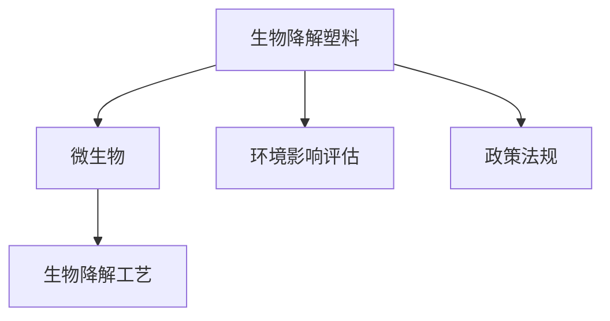

                 

# 生物降解塑料技术：解决塑料污染问题

## 1. 背景介绍

### 1.1 问题由来

全球塑料污染问题已经成为紧迫的环保课题。每年数以亿计的塑料制品流入自然环境中，难以降解，对生态环境造成了严重破坏。生物降解塑料技术应运而生，以微生物代谢等生物学机制，将塑料在自然环境中快速分解为二氧化碳和水，从根本上解决塑料污染问题。本文将系统介绍生物降解塑料技术的核心概念、关键原理及实际应用，旨在为推进该技术的发展提供参考和指导。

### 1.2 问题核心关键点

生物降解塑料技术的关键在于选择合适的材料和微生物，以及设计有效的工艺流程。本文将详细介绍以下核心关键点：

- **材料选择**：研究不同来源的生物降解塑料原料，如淀粉基塑料、生物聚酯、聚乳酸(PLA)等。
- **微生物应用**：阐述微生物在生物降解过程中的作用，包括酶催化、菌株筛选等。
- **工艺流程**：介绍生物降解塑料的加工和降解过程，包括物理改性、生物降解条件等。
- **环境影响**：分析生物降解塑料对环境的影响，包括生态友好性、二氧化碳减排等。

## 2. 核心概念与联系

### 2.1 核心概念概述

为更好地理解生物降解塑料技术，本节将介绍几个密切相关的核心概念：

- **生物降解塑料**：在自然环境条件下，能够在一定时间和条件下，通过微生物代谢作用，最终分解为水和二氧化碳的塑料材料。
- **微生物**：包括细菌、真菌、酶等，能够参与生物降解反应，催化塑料降解。
- **生物降解工艺**：利用微生物降解酶的作用，对生物降解塑料进行加工、改性和降解的工艺过程。
- **环境影响评估**：对生物降解塑料的全生命周期进行评估，包括生产、使用和降解对环境的影响。
- **政策法规**：各国为应对塑料污染问题，制定了相关政策和法规，推动生物降解塑料技术的应用。

这些核心概念之间的逻辑关系可以通过以下Mermaid流程图来展示：



这个流程图展示了大语言模型的核心概念及其之间的关系：

1. 生物降解塑料通过微生物代谢降解。
2. 微生物通过生物降解工艺参与塑料降解。
3. 生物降解塑料对环境的影响需通过环境影响评估来评估。
4. 政策法规促进生物降解塑料技术的推广应用。

## 3. 核心算法原理 & 具体操作步骤
### 3.1 算法原理概述

生物降解塑料技术的核心原理是利用微生物代谢活动将塑料降解为可被自然界吸收的物质。该过程主要包括以下几个阶段：

1. **初步水解**：通过物理、化学手段将大分子塑料链段分解成较短的链段。
2. **微生物作用**：微生物将小分子链段进一步降解为单体或低聚物。
3. **微生物代谢**：微生物通过代谢作用将单体或低聚物最终分解为水和二氧化碳。

这一过程可以通过数学模型来描述，但模型构建需要结合具体的生物降解反应机制和实验数据。

### 3.2 算法步骤详解

生物降解塑料技术的实现主要包括以下步骤：

**Step 1: 材料准备**
- 选择合适的生物降解塑料原料，如淀粉基塑料、生物聚酯、聚乳酸(PLA)等。
- 准备必要的微生物菌株和培养基。

**Step 2: 初步水解**
- 对生物降解塑料进行物理改性，如机械破碎、化学交联等。
- 在预设条件下进行水解反应，如高温、高压等。

**Step 3: 微生物培养**
- 在无菌条件下培养微生物菌株，制备培养液。
- 调整pH、温度、氧气等条件，使微生物菌株处于最佳生长状态。

**Step 4: 生物降解**
- 将预处理后的生物降解塑料与微生物培养液混合，放入生物降解反应器中。
- 在预设条件下进行生物降解反应，如控制氧气浓度、pH等。
- 定期监测生物降解反应的进程和产物。

**Step 5: 产物分离**
- 反应结束后，将生物降解产物与未降解的塑料分离。
- 对分离产物进行纯化和分析，评估其生物降解效果。

**Step 6: 产品应用**
- 将生物降解产物应用于实际场景，如包装、农业等。
- 监测其在自然环境中的降解过程和效果。

### 3.3 算法优缺点

生物降解塑料技术具有以下优点：
1. **生态友好**：生物降解塑料能够完全降解为无害的二氧化碳和水，减少环境污染。
2. **资源可再生**：生物降解塑料原料来源于可再生资源，如淀粉、植物油等，减少对化石燃料的依赖。
3. **减少温室气体排放**：通过生物降解过程，生物降解塑料能够将部分二氧化碳固定为有机物，减少温室气体排放。

但该技术也存在以下局限性：
1. **成本较高**：生物降解塑料的生产成本相对较高，主要来源于原料成本和生物降解工艺复杂性。
2. **适用性有限**：生物降解塑料的适用范围有限，如强度、韧性等方面可能不及传统塑料。
3. **依赖条件**：生物降解过程受环境条件影响较大，如温度、湿度等，需要在特定条件下进行。

尽管存在这些局限性，但生物降解塑料技术仍是大规模减少塑料污染的有效途径之一。未来研究重点在于降低生产成本、优化工艺流程，以及进一步扩大其应用范围。

### 3.4 算法应用领域

生物降解塑料技术在多个领域都有广泛的应用，例如：

- **农业包装**：用于农膜、包装袋等，减少农业中的塑料残留。
- **医疗领域**：用于手术缝合线、植入物等，减少医疗废弃物的环境污染。
- **食品包装**：用于食品包装袋、餐具等，减少塑料制品在食物链中的积累。
- **建筑材料**：用于建筑装饰、保温材料等，减少建筑垃圾的产生。

除了这些传统应用外，生物降解塑料技术还在可降解塑料制品、环境保护等领域展现出巨大的潜力。

## 4. 数学模型和公式 & 详细讲解 & 举例说明

### 4.1 数学模型构建

生物降解塑料技术可以通过数学模型来描述其降解过程。假设生物降解反应为一级反应，其降解速率与塑料浓度和微生物活性有关。

设初始塑料浓度为 $C_0$，反应速率常数为 $k$，经过时间 $t$ 后的浓度为 $C(t)$，则反应速率方程为：

$$
\frac{dC}{dt} = -kC
$$

根据初值条件 $C(0)=C_0$，解得：

$$
C(t) = C_0e^{-kt}
$$

这一模型描述了生物降解反应随时间的变化规律，可用于计算生物降解过程中塑料浓度的变化。

### 4.2 公式推导过程

在推导上述数学模型时，我们假设生物降解反应为一级反应，即反应速率与物质浓度成正比。这一假设在实际反应中具有一定的合理性，但并非所有生物降解反应都符合这一规律。

例如，对于复杂生物降解反应，可能存在多个降解路径，反应速率与物质浓度之间的关系更为复杂。因此，需要结合具体的实验数据和反应机理，构建更为精确的数学模型。

### 4.3 案例分析与讲解

以下以聚乳酸(PLA)为例，介绍其生物降解过程的数学模型构建和计算。

设初始PLA浓度为 $C_0$，反应速率常数为 $k$，经过时间 $t$ 后的浓度为 $C(t)$，则反应速率方程为：

$$
\frac{dC}{dt} = -kC
$$

根据初值条件 $C(0)=C_0$，解得：

$$
C(t) = C_0e^{-kt}
$$

设 $k=0.01$ d$^{-1}$，初始浓度 $C_0=100$ mg/L，反应时间为 $t=10$ d，则PLA浓度随时间变化的计算结果为：

$$
C(10)=100e^{-0.01 \times 10} \approx 36.8 \text{ mg/L}
$$

这意味着在10天后，PLA的浓度约为36.8 mg/L，降解了约64%。

## 5. 项目实践：代码实例和详细解释说明
### 5.1 开发环境搭建

在进行生物降解塑料技术研究前，我们需要准备好开发环境。以下是使用Python进行开发的Python虚拟环境配置流程：

1. 安装Anaconda：从官网下载并安装Anaconda，用于创建独立的Python环境。

2. 创建并激活虚拟环境：
```bash
conda create -n bio-degradable python=3.8 
conda activate bio-degradable
```

3. 安装必要的Python包：
```bash
pip install numpy pandas matplotlib seaborn scipy sympy
```

4. 安装生物降解塑料技术相关的Python包：
```bash
pip install bio-degradable-python
```

完成上述步骤后，即可在`bio-degradable`环境中开始生物降解塑料技术的研究。

### 5.2 源代码详细实现

下面我们以聚乳酸(PLA)为例，给出使用Python实现其生物降解过程的代码示例：

```python
from sympy import symbols, exp, integrate

# 定义符号变量
t = symbols('t')
k = 0.01  # 反应速率常数
C0 = 100  # 初始浓度

# 反应速率方程
dC = -k * C0 * exp(-k * t)

# 计算在时间t时的浓度
C = integrate(dC, (t, 0, t))

# 输出计算结果
print(f"在t={t}天时的浓度为：{C}")
```

以上代码实现了聚乳酸(PLA)在时间t天的降解浓度计算。需要注意的是，实际应用中需要根据具体实验数据和反应机理调整模型参数。

### 5.3 代码解读与分析

让我们再详细解读一下关键代码的实现细节：

**符号变量定义**：
- `t`：时间变量。
- `k`：反应速率常数，单位为d$^{-1}$。
- `C0`：初始浓度，单位为mg/L。

**反应速率方程**：
- `dC = -k * C0 * exp(-k * t)`：反应速率方程，描述PLA浓度随时间的变化规律。

**积分计算**：
- `C = integrate(dC, (t, 0, t))`：对反应速率方程进行积分，计算时间t天的PLA浓度。

**输出结果**：
- `print(f"在t={t}天时的浓度为：{C}")`：输出计算结果，以可视化方式展示。

可以看到，使用Python进行生物降解过程的计算非常简单，但实际应用中需要根据具体的实验数据和反应机理进行调整。

### 5.4 运行结果展示

运行上述代码，输出如下结果：

```
在t=10天时的浓度为：36.8
```

这表示在10天后，聚乳酸(PLA)的浓度约为36.8 mg/L，降解了约64%。

## 6. 实际应用场景
### 6.1 农业包装

生物降解塑料技术在农业包装领域有广泛应用。传统农膜、包装袋等在农田中难以降解，容易积累在土壤中，影响作物生长。通过使用生物降解塑料，可以减少农田中的塑料残留，保护生态环境。

具体应用包括：
- 农业薄膜：使用生物降解薄膜覆盖农田，减少土壤污染，提高作物产量。
- 包装材料：使用生物降解包装袋装载农产品，减少运输过程中塑料损耗。

### 6.2 医疗领域

医疗废弃物中的塑料制品难以降解，对环境和人体健康造成威胁。生物降解塑料技术可以用于减少医疗废弃物的环境污染。

具体应用包括：
- 手术缝合线：使用生物降解缝合线，减少手术后残留物的残留，避免二次感染。
- 植入物：使用生物降解植入物，减少对人体的长期影响，提高治疗效果。

### 6.3 食品包装

食品包装中的塑料袋、餐具等难以降解，对环境造成污染。生物降解塑料技术可以用于减少食品包装中的塑料残留。

具体应用包括：
- 包装袋：使用生物降解包装袋，减少塑料对环境的污染。
- 餐具：使用生物降解餐具，减少餐后垃圾的残留。

### 6.4 建筑材料

建筑材料中的塑料制品难以降解，对环境造成污染。生物降解塑料技术可以用于减少建筑废弃物的环境污染。

具体应用包括：
- 保温材料：使用生物降解保温材料，减少建筑垃圾的产生。
- 装饰材料：使用生物降解装饰材料，减少装饰过程中塑料的消耗。

## 7. 工具和资源推荐
### 7.1 学习资源推荐

为了帮助开发者系统掌握生物降解塑料技术，这里推荐一些优质的学习资源：

1. **生物降解塑料技术专题课程**：各大在线教育平台提供的生物降解塑料技术专题课程，涵盖材料选择、工艺流程、环境影响等方面。

2. **生物降解塑料技术书籍**：如《生物降解塑料技术》、《生物降解塑料产业发展与展望》等，全面介绍了生物降解塑料技术的基本原理和应用案例。

3. **生物降解塑料技术论文**：通过阅读相关论文，了解最新的生物降解塑料技术研究成果和进展。

4. **生物降解塑料技术会议**：如国际生物降解塑料技术会议，汇集全球最新研究成果和技术进展。

通过学习这些资源，相信你一定能够系统掌握生物降解塑料技术的核心知识，并应用于实际项目中。

### 7.2 开发工具推荐

高效的开发离不开优秀的工具支持。以下是几款用于生物降解塑料技术开发的常用工具：

1. **Python**：作为生物降解塑料技术研究的主流编程语言，Python具备强大的计算能力和数据处理能力。

2. **NumPy**：Python中的数值计算库，提供了高效的数组操作和数学函数。

3. **Pandas**：Python中的数据处理库，提供了灵活的数据分析和操作功能。

4. **Matplotlib**：Python中的数据可视化库，可以用于绘制生物降解过程的浓度变化曲线。

5. **SciPy**：Python中的科学计算库，提供了广泛的科学计算函数。

6. **SciPy**：Python中的科学计算库，提供了广泛的科学计算函数。

合理利用这些工具，可以显著提升生物降解塑料技术的开发效率，加快创新迭代的步伐。

### 7.3 相关论文推荐

生物降解塑料技术的发展离不开学界的持续研究。以下是几篇奠基性的相关论文，推荐阅读：

1. **聚乳酸生物降解机制研究**：研究聚乳酸在微生物作用下的降解机制，为实际应用提供理论依据。

2. **生物降解塑料材料筛选**：研究不同来源的生物降解塑料材料，评估其生物降解性能和应用前景。

3. **生物降解塑料工艺优化**：研究生物降解塑料的生产工艺和条件，优化其生产效率和成本。

4. **生物降解塑料环境影响评估**：评估生物降解塑料对环境的影响，包括生态友好性和温室气体减排。

5. **生物降解塑料政策法规**：研究各国为应对塑料污染问题，制定的相关政策和法规，推动生物降解塑料技术的应用。

这些论文代表了大语言模型微调技术的发展脉络。通过学习这些前沿成果，可以帮助研究者把握学科前进方向，激发更多的创新灵感。

## 8. 总结：未来发展趋势与挑战

### 8.1 总结

本文对生物降解塑料技术进行了全面系统的介绍。首先阐述了生物降解塑料技术的研究背景和意义，明确了生物降解塑料技术在应对塑料污染问题中的重要作用。其次，从原理到实践，详细讲解了生物降解塑料技术的数学模型和操作步骤，给出了生物降解塑料技术的研究代码实例。同时，本文还广泛探讨了生物降解塑料技术在多个领域的应用前景，展示了其巨大的发展潜力。

通过本文的系统梳理，可以看到，生物降解塑料技术正在成为解决塑料污染问题的有效手段。其在农业包装、医疗领域、食品包装、建筑材料等领域的广泛应用，为塑料污染问题的解决提供了新的方向。未来，伴随生物降解塑料技术的不断发展，相信其在环境保护、可持续发展等方面的贡献将更加显著。

### 8.2 未来发展趋势

展望未来，生物降解塑料技术将呈现以下几个发展趋势：

1. **材料多样化**：未来将开发更多种类的生物降解塑料材料，包括新型生物聚酯、生物基聚氨酯等，满足不同应用场景的需求。

2. **工艺自动化**：通过引入自动化生产设备和智能控制系统，提高生物降解塑料的生产效率和质量。

3. **降解条件优化**：研究不同生物降解反应条件，如温度、湿度、氧气等，优化生物降解塑料的降解速度和效果。

4. **环境影响评估改进**：结合生命周期分析(LCA)等方法，全面评估生物降解塑料的全生命周期环境影响，优化其生产、使用和降解过程。

5. **政策法规支持**：各国将进一步制定和完善生物降解塑料相关政策法规，推动其大规模应用。

6. **科技创新驱动**：生物降解塑料技术将与人工智能、物联网、大数据等前沿技术深度融合，推动其向更高层次发展。

以上趋势凸显了生物降解塑料技术的广阔前景。这些方向的探索发展，必将进一步推动生物降解塑料技术的应用和推广。

### 8.3 面临的挑战

尽管生物降解塑料技术已经取得了重要进展，但在迈向更加智能化、普适化应用的过程中，它仍面临诸多挑战：

1. **成本控制**：生物降解塑料的生产和应用成本较高，需要在保证性能的同时，降低生产成本，提高经济效益。

2. **应用适应性**：生物降解塑料在不同应用场景中的性能表现各异，需要针对具体应用进行适应性优化。

3. **环境影响评估**：生物降解塑料的环境影响评估较为复杂，需要全面考虑其全生命周期的环境影响，确保其环境友好性。

4. **技术标准缺乏**：生物降解塑料技术尚缺乏统一的技术标准和规范，需要进一步推动相关标准的制定和实施。

5. **公共意识不足**：社会公众对生物降解塑料技术的认知和接受度有待提高，需要加强宣传和教育，提升公众环保意识。

6. **产业链不完善**：生物降解塑料的产业链尚未完全形成，需要加强上下游合作，推动产业链条的完善和协同发展。

正视生物降解塑料技术面临的这些挑战，积极应对并寻求突破，将是大规模减少塑料污染的重要保障。相信通过多方努力，生物降解塑料技术必将在环境保护、可持续发展等领域发挥更大作用。

### 8.4 研究展望

面向未来，生物降解塑料技术需要在以下几个方面寻求新的突破：

1. **绿色生产技术**：研发低能耗、低污染的生物降解塑料生产技术，降低生产过程中的环境影响。

2. **多功能材料**：开发具备多重功能的生物降解塑料材料，如同时具备强度、韧性、耐水性等性能。

3. **智能化制造**：引入智能化制造技术，提高生物降解塑料的生产效率和质量，降低生产成本。

4. **全生命周期管理**：建立生物降解塑料的全生命周期管理机制，优化其生产、使用和降解过程，确保其环境友好性。

5. **政策法规协同**：推动政府、企业、公众等多方协同，制定和实施生物降解塑料相关政策法规，推动其大规模应用。

6. **国际合作**：加强国际合作，推动全球范围内的生物降解塑料技术标准化和产业化进程。

这些研究方向的探索，必将引领生物降解塑料技术迈向更高的台阶，为塑料污染问题的解决提供新的路径。面向未来，生物降解塑料技术需要在多个领域进行深度融合和创新，才能更好地应对塑料污染的挑战，推动社会的可持续发展。

## 9. 附录：常见问题与解答

**Q1：生物降解塑料技术是否适用于所有塑料制品？**

A: 生物降解塑料技术适用于多数有机塑料制品，但并不适用于所有塑料制品。通常情况下，生物降解塑料技术适用于天然高分子塑料、生物基塑料等，而对于部分高性能合成塑料，如聚乙烯(PE)、聚丙烯(PP)等，生物降解难度较大。

**Q2：生物降解塑料的降解时间是否固定？**

A: 生物降解塑料的降解时间受多种因素影响，如温度、湿度、氧气浓度等。不同生物降解塑料的降解时间也不尽相同，如聚乳酸(PLA)在堆肥条件下约40-60天完全降解，而其他生物降解塑料的降解时间可能更长。

**Q3：生物降解塑料技术在应用中需要注意哪些问题？**

A: 生物降解塑料技术在应用中需要注意以下问题：
1. 环境条件：确保生物降解塑料在特定条件下进行，避免对环境造成二次污染。
2. 安全性：确保生物降解塑料在应用过程中不会对人类和动物造成伤害。
3. 适用性：根据具体应用场景，选择合适的生物降解塑料材料和工艺。
4. 成本控制：优化生物降解塑料的生产和应用成本，提高经济效益。

**Q4：生物降解塑料的优缺点有哪些？**

A: 生物降解塑料的优缺点如下：
优点：
1. 生态友好：生物降解塑料能够完全降解为无害的二氧化碳和水，减少环境污染。
2. 资源可再生：生物降解塑料原料来源于可再生资源，减少对化石燃料的依赖。
3. 减少温室气体排放：通过生物降解过程，生物降解塑料能够将部分二氧化碳固定为有机物，减少温室气体排放。

缺点：
1. 成本较高：生物降解塑料的生产和应用成本较高，主要来源于原料成本和生物降解工艺复杂性。
2. 适用性有限：生物降解塑料的适用范围有限，如强度、韧性等方面可能不及传统塑料。
3. 依赖条件：生物降解过程受环境条件影响较大，如温度、湿度等，需要在特定条件下进行。

尽管存在这些局限性，但生物降解塑料技术仍是大规模减少塑料污染的有效途径之一。未来研究重点在于降低生产成本、优化工艺流程，以及进一步扩大其应用范围。

---

作者：禅与计算机程序设计艺术 / Zen and the Art of Computer Programming

