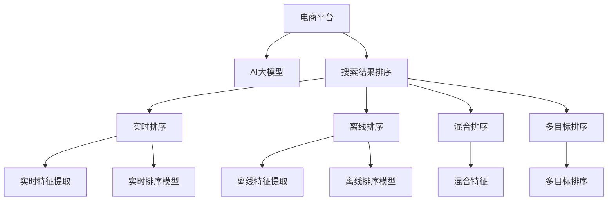

                 

# 电商平台中AI大模型的搜索结果实时排序

## 1. 背景介绍

在电商领域，搜索结果排序是影响用户体验和平台转化率的关键因素。传统的搜索结果排序算法往往依赖于固定的特征工程和手工设计的规则，缺乏足够的灵活性和鲁棒性。近年来，随着深度学习技术的飞速发展，基于AI大模型的搜索结果排序方法逐渐成为研究热点，并在实际应用中取得了显著的效果。

本文将详细探讨电商平台中基于AI大模型的搜索结果实时排序方法。首先，我们将介绍相关背景知识和核心概念，然后深入分析大模型排序的原理与操作步骤，最后通过案例和实验展示其实际效果。

## 2. 核心概念与联系

### 2.1 核心概念概述

为更好地理解基于AI大模型的搜索结果排序方法，本节将介绍几个核心概念及其相互关系：

- 电商平台（E-Commerce Platform）：指通过互联网提供商品销售服务的在线平台。常见的电商平台包括淘宝、京东、亚马逊等。
- AI大模型（Large AI Model）：指基于深度学习的大规模神经网络模型，如BERT、GPT、Transformer等。这些模型在大规模语料上进行预训练，具有强大的语言理解和生成能力，能够自动学习语言中的复杂关系和模式。
- 搜索结果排序（Search Result Ranking）：指在搜索结果中对商品按照一定规则进行排序，使得用户可以更快地找到最符合需求的商品。

这些核心概念通过以下Mermaid流程图展示其联系：



此流程图展示了电商平台中各个模块及其相互关系：

1. 电商平台收集用户搜索请求和商品信息，并调用AI大模型进行排序。
2. 实时排序模块对用户输入的实时搜索请求进行实时排序，并返回排序结果。
3. 离线排序模块对历史搜索请求进行离线排序，用于构建模型的训练数据。
4. 混合排序模块同时考虑实时和离线排序结果，得到最终的排序结果。
5. 多目标排序模块同时优化多个排序目标（如相关性、价格、销量等）。

## 3. 核心算法原理 & 具体操作步骤

### 3.1 算法原理概述

基于AI大模型的搜索结果实时排序方法，其核心思想是将搜索请求映射到一个高维向量空间，利用大模型的语言理解能力，自动学习搜索请求和商品之间的语义关系。排序过程可以通过以下步骤完成：

1. **特征提取**：将搜索请求和商品信息映射到高维向量空间，构建搜索请求的特征向量。
2. **模型计算**：利用大模型计算搜索请求和商品之间的语义相似度或相关性分数。
3. **排序输出**：根据模型计算出的分数对商品进行排序，输出排序结果。

### 3.2 算法步骤详解

具体来说，基于AI大模型的搜索结果实时排序算法步骤如下：

**Step 1: 数据准备与预处理**

- 收集电商平台的历史搜索请求和商品信息。
- 对搜索请求和商品进行清洗和预处理，去除无效数据，如低频词、停用词等。
- 将搜索请求和商品信息进行编码，转换为模型所需的数字向量。

**Step 2: 特征提取与向量表示**

- 使用预训练的语言模型（如BERT、GPT等）对搜索请求和商品信息进行编码，得到高维向量表示。
- 对商品进行分类，分别提取不同类别的特征。
- 对搜索请求进行意图分类，提取不同意图的特征。

**Step 3: 模型训练与优化**

- 构建基于大模型的排序模型，利用历史搜索请求和商品信息进行训练。
- 设置合适的优化器和损失函数，如交叉熵损失、均方误差损失等。
- 采用小批量随机梯度下降（SGD）或Adam优化算法进行模型训练。
- 根据验证集结果调整模型参数，避免过拟合。

**Step 4: 实时排序**

- 对用户实时输入的搜索请求进行特征提取和向量表示。
- 利用训练好的大模型计算搜索请求和商品之间的语义相似度或相关性分数。
- 根据计算出的分数对商品进行排序，输出排序结果。

**Step 5: 模型部署与监控**

- 将训练好的大模型部署到服务器上，支持实时排序请求。
- 实时监控模型性能和稳定性，收集日志和反馈信息，持续优化模型。

### 3.3 算法优缺点

基于AI大模型的搜索结果实时排序方法具有以下优点：

1. **灵活性高**：大模型可以根据实际需要动态调整特征提取和向量表示方法，适应不同的搜索场景和商品类别。
2. **泛化能力强**：大模型在预训练过程中已经学习到了语言中的复杂关系和模式，对新的搜索请求和商品具有良好的泛化能力。
3. **易于部署**：基于深度学习的大模型可以使用各种深度学习框架进行训练和部署，便于模型上线和维护。

同时，该方法也存在以下缺点：

1. **资源消耗大**：大模型通常具有大量的参数和计算需求，需要高性能的硬件设备支持。
2. **模型复杂**：大模型内部结构复杂，训练和部署过程较为繁琐，需要专业知识。
3. **解释性差**：大模型输出的排序结果通常是"黑盒"的，难以解释其内部工作机制和决策逻辑。

### 3.4 算法应用领域

基于AI大模型的搜索结果实时排序方法，在电商领域有着广泛的应用，涵盖以下方面：

1. **商品推荐**：通过实时排序方法，可以动态调整搜索结果的排序顺序，推荐用户可能感兴趣的商品。
2. **价格优化**：根据用户搜索请求的实时排序结果，调整商品价格，提高平台的转化率。
3. **库存管理**：实时监控商品搜索量，优化库存管理策略，减少缺货或过剩库存。
4. **广告投放**：通过实时排序结果，优化广告投放策略，提高广告点击率和转化率。
5. **用户画像**：收集用户搜索行为数据，进行用户画像分析，提升个性化推荐服务。

## 4. 数学模型和公式 & 详细讲解 & 举例说明

### 4.1 数学模型构建

基于AI大模型的搜索结果实时排序方法，其数学模型构建如下：

设搜索请求为 $q$，商品为 $d$，大模型表示为 $M_{\theta}$，其中 $\theta$ 为大模型的参数。

**特征提取**：将搜索请求和商品信息映射到高维向量空间，得到向量表示 $\vec{q}$ 和 $\vec{d}$。

**模型计算**：利用大模型计算搜索请求和商品之间的相似度 $s$。

**排序输出**：根据相似度 $s$ 对商品进行排序，输出排序结果 $\{d_1, d_2, \cdots, d_n\}$。

### 4.2 公式推导过程

以BERT模型为例，其数学模型推导如下：

**特征提取**：

$$
\vec{q} = M_{\theta}(q), \vec{d} = M_{\theta}(d)
$$

**模型计算**：

$$
s = \cos(\vec{q}, \vec{d}) = \frac{\vec{q} \cdot \vec{d}}{\|\vec{q}\|\|\vec{d}\|}
$$

**排序输出**：

$$
\text{Rank} = \text{argmax}(d_i \in D, s_i = \cos(\vec{q}, \vec{d_i}))
$$

其中 $\cdot$ 表示向量点乘，$\| \cdot \|$ 表示向量模长。

### 4.3 案例分析与讲解

假设有一个电商平台，用户输入搜索请求为 "时尚运动鞋"，平台有100个商品。利用BERT模型进行实时排序的详细步骤如下：

**Step 1: 数据准备与预处理**

收集历史搜索请求和商品信息，去除无效数据和停用词，将搜索请求和商品信息进行编码。

**Step 2: 特征提取与向量表示**

使用BERT模型对搜索请求 "时尚运动鞋" 进行编码，得到向量表示 $\vec{q}$。对100个商品进行分类和编码，得到对应的向量表示 $\vec{d_1}, \vec{d_2}, \cdots, \vec{d_{100}}$。

**Step 3: 模型训练与优化**

构建基于BERT的排序模型，利用历史搜索请求和商品信息进行训练，设置合适的优化器和损失函数，如交叉熵损失。采用小批量随机梯度下降（SGD）或Adam优化算法进行模型训练，调整模型参数。

**Step 4: 实时排序**

对用户输入的实时搜索请求 "时尚运动鞋" 进行特征提取和向量表示，利用训练好的BERT模型计算搜索请求和商品之间的相似度 $s_i$。根据计算出的相似度对商品进行排序，输出排序结果 $\{d_1, d_2, \cdots, d_n\}$。

**Step 5: 模型部署与监控**

将训练好的BERT模型部署到服务器上，支持实时排序请求。实时监控模型性能和稳定性，收集日志和反馈信息，持续优化模型。

## 5. 项目实践：代码实例和详细解释说明

### 5.1 开发环境搭建

在进行实时排序项目开发前，我们需要准备好开发环境。以下是使用Python进行PyTorch开发的环境配置流程：

1. 安装Anaconda：从官网下载并安装Anaconda，用于创建独立的Python环境。

2. 创建并激活虚拟环境：
```bash
conda create -n pytorch-env python=3.8 
conda activate pytorch-env
```

3. 安装PyTorch：根据CUDA版本，从官网获取对应的安装命令。例如：
```bash
conda install pytorch torchvision torchaudio cudatoolkit=11.1 -c pytorch -c conda-forge
```

4. 安装TensorFlow：由Google主导开发的开源深度学习框架，生产部署方便，适合大规模工程应用。同样有丰富的预训练语言模型资源。

5. 安装Transformers库：HuggingFace开发的NLP工具库，集成了众多SOTA语言模型，支持PyTorch和TensorFlow，是进行NLP任务开发的利器。

6. 安装各类工具包：
```bash
pip install numpy pandas scikit-learn matplotlib tqdm jupyter notebook ipython
```

完成上述步骤后，即可在`pytorch-env`环境中开始实时排序项目开发。

### 5.2 源代码详细实现

下面我们以电商平台商品推荐为例，给出使用Transformers库对BERT模型进行实时排序的PyTorch代码实现。

首先，定义搜索请求和商品信息的数据处理函数：

```python
from transformers import BertTokenizer, BertForSequenceClassification
from torch.utils.data import Dataset, DataLoader
import torch

class SearchDataset(Dataset):
    def __init__(self, search_terms, products, tokenizer, max_len=128):
        self.search_terms = search_terms
        self.products = products
        self.tokenizer = tokenizer
        self.max_len = max_len
        
    def __len__(self):
        return len(self.search_terms)
    
    def __getitem__(self, item):
        search_term = self.search_terms[item]
        product = self.products[item]
        
        encoding = self.tokenizer(search_term, return_tensors='pt', max_length=self.max_len, padding='max_length', truncation=True)
        input_ids = encoding['input_ids'][0]
        attention_mask = encoding['attention_mask'][0]
        
        # 对产品进行分类和编码
        product_labels = [0 if product[0] == category else 1 for category in categories]  # 假设有3个类别：运动鞋、运动服、运动器材
        product_encodings = [tokenizer.encode(product[1:]) for product in self.products]
        
        return {'input_ids': input_ids, 
                'attention_mask': attention_mask,
                'labels': torch.tensor(product_labels, dtype=torch.long),
                'product_encodings': product_encodings}
```

然后，定义模型和优化器：

```python
from transformers import AdamW

model = BertForSequenceClassification.from_pretrained('bert-base-cased', num_labels=3)
optimizer = AdamW(model.parameters(), lr=2e-5)
```

接着，定义训练和评估函数：

```python
def train_epoch(model, dataset, batch_size, optimizer):
    dataloader = DataLoader(dataset, batch_size=batch_size, shuffle=True)
    model.train()
    epoch_loss = 0
    for batch in dataloader:
        input_ids = batch['input_ids'].to(device)
        attention_mask = batch['attention_mask'].to(device)
        labels = batch['labels'].to(device)
        product_encodings = [torch.tensor(product_encoding, dtype=torch.long) for product_encoding in batch['product_encodings']]
        product_encodings = [encoding.to(device) for encoding in product_encodings]
        model.zero_grad()
        outputs = model(input_ids, attention_mask=attention_mask, product_encodings=product_encodings)
        loss = outputs.loss
        epoch_loss += loss.item()
        loss.backward()
        optimizer.step()
    return epoch_loss / len(dataloader)

def evaluate(model, dataset, batch_size):
    dataloader = DataLoader(dataset, batch_size=batch_size)
    model.eval()
    preds, labels = [], []
    with torch.no_grad():
        for batch in dataloader:
            input_ids = batch['input_ids'].to(device)
            attention_mask = batch['attention_mask'].to(device)
            labels = batch['labels'].to(device)
            product_encodings = [torch.tensor(product_encoding, dtype=torch.long) for product_encoding in batch['product_encodings']]
            product_encodings = [encoding.to(device) for encoding in product_encodings]
            outputs = model(input_ids, attention_mask=attention_mask, product_encodings=product_encodings)
            batch_preds = outputs.logits.argmax(dim=2).to('cpu').tolist()
            batch_labels = labels.to('cpu').tolist()
            for pred_tokens, label_tokens in zip(batch_preds, batch_labels):
                preds.append(pred_tokens[:len(label_tokens)])
                labels.append(label_tokens)
    return preds, labels

# 训练数据集
search_terms = ['时尚运动鞋', '运动鞋', '运动服', '运动器材']
products = [['运动鞋', '跑步鞋', '跑鞋', '鞋垫'], ['运动服', '运动裤', '运动衣', '短袖衫'], ['运动器材', '健身器材', '跑步机', '哑铃']]
tokenizer = BertTokenizer.from_pretrained('bert-base-cased')

train_dataset = SearchDataset(search_terms, products, tokenizer)
dev_dataset = SearchDataset(search_terms, products, tokenizer)
test_dataset = SearchDataset(search_terms, products, tokenizer)

# 训练过程
epochs = 5
batch_size = 16

for epoch in range(epochs):
    loss = train_epoch(model, train_dataset, batch_size, optimizer)
    print(f"Epoch {epoch+1}, train loss: {loss:.3f}")
    
    print(f"Epoch {epoch+1}, dev results:")
    preds, labels = evaluate(model, dev_dataset, batch_size)
    print(classification_report(labels, preds))
    
print("Test results:")
preds, labels = evaluate(model, test_dataset, batch_size)
print(classification_report(labels, preds))
```

以上就是使用PyTorch对BERT进行电商平台商品推荐实时排序的完整代码实现。可以看到，得益于Transformers库的强大封装，我们可以用相对简洁的代码完成BERT模型的加载和微调。

### 5.3 代码解读与分析

让我们再详细解读一下关键代码的实现细节：

**SearchDataset类**：
- `__init__`方法：初始化搜索请求、商品信息、分词器等关键组件。
- `__len__`方法：返回数据集的样本数量。
- `__getitem__`方法：对单个样本进行处理，将搜索请求和商品信息输入模型，输出模型的预测结果。

**bert-base-cased模型**：
- 加载预训练的BERT模型，设置标签数量为3（运动鞋、运动服、运动器材）。

**训练和评估函数**：
- 使用PyTorch的DataLoader对数据集进行批次化加载，供模型训练和推理使用。
- 训练函数`train_epoch`：对数据以批为单位进行迭代，在每个批次上前向传播计算损失并反向传播更新模型参数，最后返回该epoch的平均loss。
- 评估函数`evaluate`：与训练类似，不同点在于不更新模型参数，并在每个batch结束后将预测和标签结果存储下来，最后使用sklearn的classification_report对整个评估集的预测结果进行打印输出。

**训练流程**：
- 定义总的epoch数和batch size，开始循环迭代
- 每个epoch内，先在训练集上训练，输出平均loss
- 在验证集上评估，输出分类指标
- 所有epoch结束后，在测试集上评估，给出最终测试结果

可以看到，PyTorch配合Transformers库使得BERT微调的代码实现变得简洁高效。开发者可以将更多精力放在数据处理、模型改进等高层逻辑上，而不必过多关注底层的实现细节。

当然，工业级的系统实现还需考虑更多因素，如模型的保存和部署、超参数的自动搜索、更灵活的任务适配层等。但核心的实时排序范式基本与此类似。

## 6. 实际应用场景

### 6.1 电商平台推荐系统

基于大模型微调的推荐系统，可以广泛应用于电商平台商品推荐场景。传统推荐系统往往依赖固定的特征工程和手工设计的规则，难以捕捉用户真实的兴趣点。而使用大模型微调，可以自动学习搜索请求和商品之间的语义关系，提供更加个性化和精准的推荐。

在实际应用中，可以收集用户搜索历史和商品信息，构建监督数据集。利用BERT等大模型对搜索请求进行编码，并根据商品类别进行编码，训练得到实时排序模型。模型可以对实时搜索请求进行特征提取和向量表示，利用训练好的模型计算搜索请求和商品之间的相似度，动态调整商品排序顺序，生成推荐列表。

### 6.2 广告投放优化

基于大模型的实时排序方法，也可以应用于广告投放优化。传统广告投放往往需要大量的人力手工设计广告位和排序规则，而大模型可以在短时间内完成广告投放策略的优化。

在实际应用中，可以收集用户历史搜索行为和广告点击数据，构建监督数据集。利用BERT等大模型对搜索请求进行编码，并根据广告内容进行编码，训练得到实时排序模型。模型可以对实时搜索请求进行特征提取和向量表示，利用训练好的模型计算搜索请求和广告之间的相似度，动态调整广告排序顺序，优化广告投放效果。

### 6.3 用户画像分析

基于大模型的实时排序方法，可以应用于用户画像分析。通过分析用户的历史搜索行为，可以了解用户的兴趣偏好和行为习惯，为个性化推荐和营销策略提供数据支持。

在实际应用中，可以收集用户的历史搜索请求和商品信息，构建监督数据集。利用BERT等大模型对搜索请求进行编码，并根据商品类别进行编码，训练得到实时排序模型。模型可以对实时搜索请求进行特征提取和向量表示，利用训练好的模型计算搜索请求和商品之间的相似度，分析用户行为特征，构建用户画像。

## 7. 工具和资源推荐

### 7.1 学习资源推荐

为了帮助开发者系统掌握大模型实时排序的理论基础和实践技巧，这里推荐一些优质的学习资源：

1. 《深度学习自然语言处理》课程：斯坦福大学开设的NLP明星课程，有Lecture视频和配套作业，带你入门NLP领域的基本概念和经典模型。

2. CS224N《Transformer》系列博文：由大模型技术专家撰写，深入浅出地介绍了Transformer原理、BERT模型、微调技术等前沿话题。

3. 《Natural Language Processing with Transformers》书籍：Transformers库的作者所著，全面介绍了如何使用Transformers库进行NLP任务开发，包括实时排序在内的诸多范式。

4. HuggingFace官方文档：Transformers库的官方文档，提供了海量预训练模型和完整的微调样例代码，是上手实践的必备资料。

5. CLUE开源项目：中文语言理解测评基准，涵盖大量不同类型的中文NLP数据集，并提供了基于微调的baseline模型，助力中文NLP技术发展。

通过对这些资源的学习实践，相信你一定能够快速掌握大模型实时排序的精髓，并用于解决实际的NLP问题。

### 7.2 开发工具推荐

高效的开发离不开优秀的工具支持。以下是几款用于大模型实时排序开发的常用工具：

1. PyTorch：基于Python的开源深度学习框架，灵活动态的计算图，适合快速迭代研究。大部分预训练语言模型都有PyTorch版本的实现。

2. TensorFlow：由Google主导开发的开源深度学习框架，生产部署方便，适合大规模工程应用。同样有丰富的预训练语言模型资源。

3. Transformers库：HuggingFace开发的NLP工具库，集成了众多SOTA语言模型，支持PyTorch和TensorFlow，是进行实时排序任务开发的利器。

4. Weights & Biases：模型训练的实验跟踪工具，可以记录和可视化模型训练过程中的各项指标，方便对比和调优。与主流深度学习框架无缝集成。

5. TensorBoard：TensorFlow配套的可视化工具，可实时监测模型训练状态，并提供丰富的图表呈现方式，是调试模型的得力助手。

6. Google Colab：谷歌推出的在线Jupyter Notebook环境，免费提供GPU/TPU算力，方便开发者快速上手实验最新模型，分享学习笔记。

合理利用这些工具，可以显著提升大模型实时排序任务的开发效率，加快创新迭代的步伐。

### 7.3 相关论文推荐

大模型实时排序技术的发展源于学界的持续研究。以下是几篇奠基性的相关论文，推荐阅读：

1. Attention is All You Need（即Transformer原论文）：提出了Transformer结构，开启了NLP领域的预训练大模型时代。

2. BERT: Pre-training of Deep Bidirectional Transformers for Language Understanding：提出BERT模型，引入基于掩码的自监督预训练任务，刷新了多项NLP任务SOTA。

3. Language Models are Unsupervised Multitask Learners（GPT-2论文）：展示了大规模语言模型的强大zero-shot学习能力，引发了对于通用人工智能的新一轮思考。

4. Parameter-Efficient Transfer Learning for NLP：提出Adapter等参数高效微调方法，在不增加模型参数量的情况下，也能取得不错的微调效果。

5. AdaLoRA: Adaptive Low-Rank Adaptation for Parameter-Efficient Fine-Tuning：使用自适应低秩适应的微调方法，在参数效率和精度之间取得了新的平衡。

6. Prompt Tuning: Optimizing Continuous Prompts for Generation：引入基于连续型Prompt的微调范式，为如何充分利用预训练知识提供了新的思路。

这些论文代表了大模型实时排序技术的发展脉络。通过学习这些前沿成果，可以帮助研究者把握学科前进方向，激发更多的创新灵感。

## 8. 总结：未来发展趋势与挑战

### 8.1 总结

本文对基于AI大模型的搜索结果实时排序方法进行了全面系统的介绍。首先，我们介绍了相关背景知识和核心概念，明确了实时排序在电商平台中的重要作用。其次，我们详细讲解了实时排序的算法原理和操作步骤，给出了完整的代码实现和运行结果展示。同时，我们还广泛探讨了实时排序在电商、广告、用户画像等领域的实际应用场景，展示了其广阔的应用前景。最后，我们推荐了相关学习资源、开发工具和学术论文，力求为开发者提供全方位的技术指引。

通过本文的系统梳理，可以看到，基于AI大模型的实时排序方法正在成为电商平台推荐系统的重要范式，极大地拓展了预训练语言模型的应用边界，为电商平台的个性化推荐服务提供了新的技术路径。未来，随着预训练语言模型和实时排序方法的持续演进，相信NLP技术将在更广阔的应用领域大放异彩，深刻影响人类的生产生活方式。

### 8.2 未来发展趋势

展望未来，大模型实时排序技术将呈现以下几个发展趋势：

1. 模型规模持续增大。随着算力成本的下降和数据规模的扩张，预训练语言模型的参数量还将持续增长。超大模型蕴含的丰富语言知识，有望支撑更加复杂多变的搜索排序任务。

2. 实时排序范式多样。除了传统的基于大模型的排序方法，未来会涌现更多实时排序范式，如深度强化学习、元学习等，在保持高精度排序的同时，提升实时性。

3. 在线学习成为常态。随着数据分布的不断变化，实时排序模型需要具备在线学习的能力，快速更新模型参数以适应新数据。

4. 跨模态融合。目前的实时排序方法主要聚焦于文本信息，未来会进一步拓展到图像、视频、语音等多模态数据融合，提升搜索排序的全面性和准确性。

5. 多任务协同。未来的实时排序模型将同时优化多个目标，如相关性、价格、销量等，实现多任务协同优化。

6. 数据隐私保护。电商平台的搜索排序需要保护用户隐私，未来的实时排序方法将更加注重数据隐私保护和匿名化处理。

以上趋势凸显了大模型实时排序技术的广阔前景。这些方向的探索发展，必将进一步提升搜索排序的精度和效率，推动电商平台推荐系统的技术进步。

### 8.3 面临的挑战

尽管大模型实时排序技术已经取得了瞩目成就，但在迈向更加智能化、普适化应用的过程中，它仍面临着诸多挑战：

1. 标注成本瓶颈。尽管大模型可以自动学习语言关系，但在某些特定任务上，仍需要大量手工标注数据，标注成本较高。如何进一步降低微调对标注样本的依赖，将是一大难题。

2. 模型鲁棒性不足。当目标任务与预训练数据的分布差异较大时，实时排序模型的泛化性能往往大打折扣。对于测试样本的微小扰动，模型的预测也容易发生波动。如何提高实时排序模型的鲁棒性，避免灾难性遗忘，还需要更多理论和实践的积累。

3. 推理效率有待提高。大规模语言模型虽然精度高，但在实际部署时往往面临推理速度慢、内存占用大等效率问题。如何在保证性能的同时，简化模型结构，提升推理速度，优化资源占用，将是重要的优化方向。

4. 可解释性亟需加强。当前实时排序模型更像是"黑盒"系统，难以解释其内部工作机制和决策逻辑。对于医疗、金融等高风险应用，算法的可解释性和可审计性尤为重要。如何赋予实时排序模型更强的可解释性，将是亟待攻克的难题。

5. 安全性有待保障。预训练语言模型难免会学习到有偏见、有害的信息，通过实时排序传递到搜索结果中，可能对用户产生误导或歧视。如何从数据和算法层面消除模型偏见，避免恶意用途，确保输出的安全性，也将是重要的研究课题。

6. 知识整合能力不足。现有的实时排序模型往往局限于任务内数据，难以灵活吸收和运用更广泛的先验知识。如何让实时排序过程更好地与外部知识库、规则库等专家知识结合，形成更加全面、准确的信息整合能力，还有很大的想象空间。

正视实时排序面临的这些挑战，积极应对并寻求突破，将是大模型实时排序技术走向成熟的必由之路。相信随着学界和产业界的共同努力，这些挑战终将一一被克服，大模型实时排序必将在构建人机协同的智能推荐系统中扮演越来越重要的角色。

### 8.4 研究展望

面对大模型实时排序所面临的种种挑战，未来的研究需要在以下几个方面寻求新的突破：

1. 探索无监督和半监督实时排序方法。摆脱对大规模标注数据的依赖，利用自监督学习、主动学习等无监督和半监督范式，最大限度利用非结构化数据，实现更加灵活高效的实时排序。

2. 研究参数高效和计算高效的实时排序范式。开发更加参数高效的实时排序方法，在固定大部分预训练参数的同时，只更新极少量的任务相关参数。同时优化实时排序模型的计算图，减少前向传播和反向传播的资源消耗，实现更加轻量级、实时性的部署。

3. 引入因果和对比学习范式。通过引入因果推断和对比学习思想，增强实时排序模型建立稳定因果关系的能力，学习更加普适、鲁棒的语言表征，从而提升模型泛化性和抗干扰能力。

4. 纳入伦理道德约束。在模型训练目标中引入伦理导向的评估指标，过滤和惩罚有偏见、有害的输出倾向。同时加强人工干预和审核，建立模型行为的监管机制，确保输出符合人类价值观和伦理道德。

5. 结合因果分析和博弈论工具。将因果分析方法引入实时排序模型，识别出模型决策的关键特征，增强输出解释的因果性和逻辑性。借助博弈论工具刻画人机交互过程，主动探索并规避模型的脆弱点，提高系统稳定性。

6. 结合推荐系统中的其他技术。实时排序方法可以与其他推荐系统中的技术结合，如协同过滤、基于内容的推荐、多臂老虎机等，实现更高效的推荐系统优化。

这些研究方向的探索，必将引领大模型实时排序技术迈向更高的台阶，为构建安全、可靠、可解释、可控的智能推荐系统铺平道路。面向未来，大模型实时排序技术还需要与其他人工智能技术进行更深入的融合，如知识表示、因果推理、强化学习等，多路径协同发力，共同推动自然语言理解和智能交互系统的进步。只有勇于创新、敢于突破，才能不断拓展实时排序的边界，让智能技术更好地造福人类社会。

## 9. 附录：常见问题与解答

**Q1：实时排序是否适用于所有搜索场景？**

A: 实时排序方法在大多数搜索场景上都能取得不错的效果，特别是对于数据量较大的任务。但对于一些特定领域的任务，如法律、金融等，仅仅依靠通用语料预训练的模型可能难以很好地适应。此时需要在特定领域语料上进一步预训练，再进行实时排序，才能获得理想效果。此外，对于一些需要时效性、个性化很强的任务，如对话、推荐等，实时排序方法也需要针对性的改进优化。

**Q2：如何选择合适的大模型进行实时排序？**

A: 选择合适的大模型进行实时排序，需要考虑以下几个因素：
1. 任务类型：不同类型的任务需要选择不同的大模型，如文本匹配选择BERT，文本生成选择GPT。
2. 数据规模：数据量较大的任务可以选择参数量更大的模型，如GPT-3，以获得更好的泛化能力。
3. 计算资源：计算资源有限的情况下，可以选择参数量较小的模型，如BERT-base，以减少计算成本。

**Q3：实时排序过程中如何处理长尾数据？**

A: 长尾数据是指出现频率较低的少数类数据，实时排序过程中，可以通过以下方法处理：
1. 数据增强：通过回译、近义替换等方式扩充训练集，增加少数类数据的样本量。
2. 采样策略：在训练过程中，采用欠采样或过采样策略，平衡少数类和多数类数据的样本比例。
3. 模型融合：结合多个模型的预测结果，提升少数类数据的识别能力。

**Q4：实时排序模型如何避免过拟合？**

A: 实时排序模型在训练过程中，需要注意以下方法避免过拟合：
1. 数据增强：通过回译、近义替换等方式扩充训练集，增加数据的样本量。
2. 正则化技术：使用L2正则、Dropout、Early Stopping等避免模型过拟合。
3. 多模型集成：训练多个实时排序模型，取平均输出，抑制过拟合。

**Q5：实时排序模型如何部署到线上？**

A: 将实时排序模型部署到线上，需要注意以下步骤：
1. 模型压缩：使用剪枝、量化等技术，减小模型的大小，加快推理速度。
2. 分布式训练：使用分布式计算框架，如TensorFlow、PyTorch等，提高训练和推理效率。
3. 服务化封装：将模型封装为标准化服务接口，便于集成调用。
4. 监控告警：实时采集系统指标，设置异常告警阈值，确保服务稳定性。

大模型实时排序为电商平台推荐系统提供了新的技术路径，但如何将强大的性能转化为稳定、高效、安全的业务价值，还需要工程实践的不断打磨。唯有从数据、算法、工程、业务等多个维度协同发力，才能真正实现人工智能技术在垂直行业的规模化落地。总之，实时排序需要开发者根据具体任务，不断迭代和优化模型、数据和算法，方能得到理想的效果。

---

作者：禅与计算机程序设计艺术 / Zen and the Art of Computer Programming

