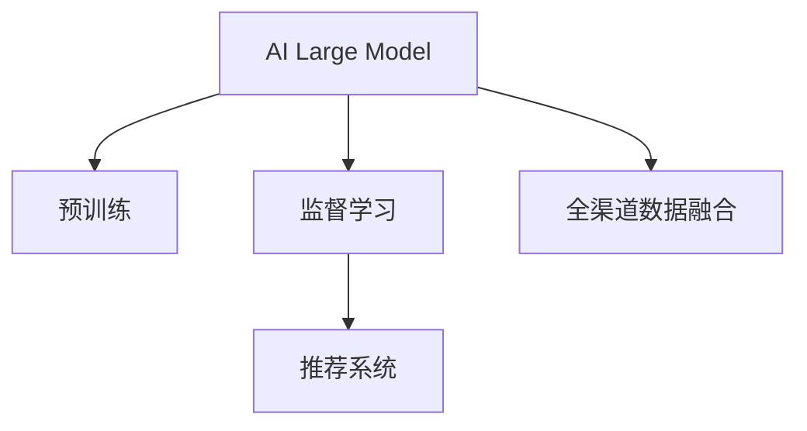

                 

# 电商平台中的AI大模型：从单一渠道到全渠道数据融合

## 1. 背景介绍

### 1.1 问题由来
随着电商平台的发展，单一渠道的运营模式已经无法满足日益增长的用户需求。为了提供更好的用户体验和更高的交易转化率，电商平台开始探索全渠道数据融合的方法。全渠道数据融合是指将来自不同渠道（如线下门店、线上平台、社交媒体等）的用户数据进行整合，形成统一的用户画像，实现跨渠道的精准营销和个性化推荐。

在这一背景下，人工智能大模型成为了一种新的数据融合工具。AI大模型通过自监督学习或监督学习的方式，从大量非结构化数据中学习到丰富的语义和关联知识，具备强大的语言理解和生成能力，能够高效地处理和分析来自不同渠道的数据，为用户提供个性化和精准的推荐。

### 1.2 问题核心关键点
目前，电商平台中常用的AI大模型主要有BERT、GPT-3等。这些模型通常被用于用户意图理解、推荐系统、客户服务等方面。其核心关键点包括：
- 模型参数：大型语言模型通常具有数十亿参数，可以处理复杂的多模态数据。
- 学习方式：自监督学习或监督学习，能够从大规模无标签或少量有标签的数据中学习到通用知识。
- 数据融合：将不同渠道的数据进行整合，形成统一的语义表示。
- 推荐系统：基于模型生成的语义表示，进行精准的用户推荐。

## 2. 核心概念与联系

### 2.1 核心概念概述

为更好地理解AI大模型在电商平台中的应用，本节将介绍几个密切相关的核心概念：

- 人工智能大模型(AI Large Model)：指具有数十亿或更多参数的神经网络模型，如BERT、GPT-3等，通过自监督或监督学习的方式，从大规模数据中学习到丰富的语义和关联知识。
- 预训练(Pre-training)：指在大规模无标签数据上，通过自监督学习任务训练通用语言模型的过程。常见的预训练任务包括掩码语言模型、下句预测等。
- 监督学习(Supervised Learning)：指在有标签数据上，通过梯度下降等优化算法训练模型，使其对特定任务进行优化的过程。
- 全渠道数据融合(OMO, Omnichannel Data Fusion)：指将来自不同渠道的用户数据进行整合，形成统一的用户画像，实现跨渠道的精准营销和个性化推荐。
- 推荐系统(Recommendation System)：通过模型对用户行为和兴趣进行分析和预测，生成推荐内容，提高用户满意度和交易转化率。

这些核心概念之间的逻辑关系可以通过以下Mermaid流程图来展示：



这个流程图展示了大模型在电商平台中的核心概念及其之间的关系：

1. 大模型通过预训练获得基础能力。
2. 监督学习在大模型的基础上进行微调，优化其特定任务性能。
3. 全渠道数据融合使大模型能够整合来自不同渠道的数据，形成统一的用户画像。
4. 推荐系统基于全渠道数据融合的结果，生成个性化的推荐内容。

## 3. 核心算法原理 & 具体操作步骤

### 3.1 算法原理概述

AI大模型在电商平台中的应用，本质上是一个从单一渠道到全渠道数据融合的过程。其核心思想是：利用大模型的语言理解能力和知识迁移能力，将不同渠道的数据进行统一处理，形成统一的语义表示。然后基于统一的语义表示，进行精准的推荐。

形式化地，假设存在N个渠道的数据集 $D_1, D_2, ..., D_N$，每个数据集包含用户行为数据和文本数据。设 $F$ 为统一的全渠道数据融合函数，$G$ 为基于融合数据的推荐函数。则推荐系统的目标是最小化用户未转化数据：

$$
\min_{F,G} \sum_{i=1}^N \ell_i(G(F(D_i)))
$$

其中 $\ell_i$ 为渠道 $i$ 的损失函数，通常为交叉熵损失、均方误差损失等。

### 3.2 算法步骤详解

基于AI大模型的电商平台数据融合推荐系统的一般流程包括：

**Step 1: 准备预训练模型和数据集**
- 选择合适的预训练语言模型，如BERT、GPT-3等，作为初始化参数。
- 收集不同渠道的数据集，如线上平台的用户浏览记录、搜索历史、评论等，线下门店的会员信息、交易记录等，并进行清洗和整合。

**Step 2: 添加任务适配层**
- 根据推荐任务类型，在预训练模型的基础上设计合适的输出层和损失函数。
- 对于点击率预测、个性化推荐等任务，通常在顶层添加线性分类器和交叉熵损失函数。
- 对于生成式推荐任务，通常使用语言模型的解码器输出概率分布，并以负对数似然为损失函数。

**Step 3: 设置推荐模型超参数**
- 选择合适的优化算法及其参数，如 AdamW、SGD 等，设置学习率、批大小、迭代轮数等。
- 设置正则化技术及强度，包括权重衰减、Dropout、Early Stopping 等。
- 确定融合函数 $F$ 和推荐函数 $G$ 的结构和参数。

**Step 4: 执行梯度训练**
- 将不同渠道的数据集分批次输入模型，前向传播计算损失函数。
- 反向传播计算参数梯度，根据设定的优化算法和学习率更新模型参数。
- 周期性在验证集上评估模型性能，根据性能指标决定是否触发 Early Stopping。
- 重复上述步骤直到满足预设的迭代轮数或 Early Stopping 条件。

**Step 5: 测试和部署**
- 在测试集上评估融合后模型 $G(F)$ 的性能，对比原始模型和融合后的模型效果。
- 使用融合后的模型对新样本进行推理预测，集成到实际的应用系统中。
- 持续收集新的数据，定期重新融合和微调模型，以适应数据分布的变化。

以上是基于AI大模型的电商平台数据融合推荐系统的通用流程。在实际应用中，还需要针对具体任务和数据特点，对融合和推荐过程的各个环节进行优化设计，如改进融合函数、优化推荐算法、搜索最优的超参数组合等，以进一步提升模型性能。

### 3.3 算法优缺点

基于AI大模型的电商平台数据融合推荐方法具有以下优点：
1. 数据利用率高。大模型能够高效处理非结构化数据，减少数据清洗和整合的复杂度。
2. 跨渠道融合能力强。通过全渠道数据融合，形成统一的用户画像，能够实现跨渠道的精准营销和推荐。
3. 推荐效果显著。在大模型的基础上进行微调，显著提升推荐系统的性能。
4. 参数高效微调。利用参数高效微调技术，在固定大部分预训练参数的情况下，仍可取得不错的推荐效果。

同时，该方法也存在一定的局限性：
1. 数据隐私问题。不同渠道的数据融合可能涉及用户隐私保护，需要严格的数据保护措施。
2. 系统复杂度高。全渠道数据融合和推荐系统的设计和实现，需要跨部门协作，系统复杂度较高。
3. 对标注数据的依赖。推荐系统中的目标任务（如点击率预测）通常需要标注数据进行训练和优化。
4. 模型鲁棒性不足。不同渠道的数据质量参差不齐，对模型的鲁棒性提出了更高要求。

尽管存在这些局限性，但就目前而言，基于AI大模型的推荐系统仍然是大数据和人工智能技术在电商平台中应用的主流范式。未来相关研究的重点在于如何进一步降低数据融合对标注数据的依赖，提高模型的少样本学习和跨领域迁移能力，同时兼顾可解释性和伦理安全性等因素。

### 3.4 算法应用领域

AI大模型在电商平台中的应用领域非常广泛，具体包括：

- 商品推荐：基于用户历史行为数据和全渠道数据，生成个性化商品推荐，提高用户购买率。
- 价格优化：通过预测不同渠道的商品销量和用户反应，动态调整商品价格，提高销售转化率。
- 促销活动：分析用户历史购买数据和社交媒体行为，推荐符合用户兴趣的促销活动，提升用户参与度和转化率。
- 库存管理：通过预测不同渠道的库存需求，优化商品采购和库存管理，减少库存成本。
- 客户服务：利用聊天机器人和语音助手，提供跨渠道的客户支持，提高用户满意度。

除了上述这些经典应用外，AI大模型还被创新性地应用到更多场景中，如情感分析、舆情监测、内容推荐等，为电商平台带来了全新的突破。随着预训练模型和微调方法的不断进步，相信AI大模型将在电商领域的应用中取得更多创新和发展。

## 4. 数学模型和公式 & 详细讲解

### 4.1 数学模型构建

本节将使用数学语言对基于AI大模型的电商平台数据融合推荐过程进行更加严格的刻画。

假设存在N个渠道的数据集 $D_1, D_2, ..., D_N$，每个数据集包含用户行为数据和文本数据。设 $F$ 为统一的全渠道数据融合函数，$G$ 为基于融合数据的推荐函数。推荐系统的目标是最小化用户未转化数据：

$$
\min_{F,G} \sum_{i=1}^N \ell_i(G(F(D_i)))
$$

其中 $\ell_i$ 为渠道 $i$ 的损失函数，通常为交叉熵损失、均方误差损失等。

### 4.2 公式推导过程

以下我们以点击率预测任务为例，推导推荐模型的损失函数及其梯度的计算公式。

假设推荐系统有一个二分类任务，预测用户是否点击某商品，其中正样本为点击的样本，负样本为未点击的样本。设模型 $G$ 在输入 $x$ 上的输出为 $\hat{y} \in [0,1]$，表示用户点击概率。真实标签 $y \in \{0,1\}$。则二分类交叉熵损失函数定义为：

$$
\ell(y,\hat{y}) = -[y\log \hat{y} + (1-y)\log (1-\hat{y})]
$$

将其代入推荐系统的目标函数，得：

$$
\min_{F,G} \sum_{i=1}^N \ell_i(G(F(D_i))) = \min_{F,G} \sum_{i=1}^N \sum_{j=1}^M \ell_i(G(F(D_i^{(j)})))
$$

其中 $D_i^{(j)}$ 为第 $i$ 个渠道的第 $j$ 条数据，$M$ 为总数据量。

根据链式法则，推荐模型 $G$ 的损失函数对参数 $\theta$ 的梯度为：

$$
\nabla_{\theta}\mathcal{L}(\theta) = \frac{\partial \mathcal{L}(\theta)}{\partial \theta} = \sum_{i=1}^N \sum_{j=1}^M \nabla_{\theta} \ell_i(G(F(D_i^{(j)})))
$$

其中 $\nabla_{\theta} \ell_i(G(F(D_i^{(j)}))$ 为交叉熵损失函数对模型 $G$ 的梯度，可以通过反向传播算法高效计算。

在得到损失函数的梯度后，即可带入参数更新公式，完成模型的迭代优化。重复上述过程直至收敛，最终得到适应不同渠道数据融合推荐的最优模型参数 $\theta^*$。

## 5. 项目实践：代码实例和详细解释说明

### 5.1 开发环境搭建

在进行推荐系统开发前，我们需要准备好开发环境。以下是使用Python进行PyTorch开发的环境配置流程：

1. 安装Anaconda：从官网下载并安装Anaconda，用于创建独立的Python环境。

2. 创建并激活虚拟环境：
```bash
conda create -n pytorch-env python=3.8 
conda activate pytorch-env
```

3. 安装PyTorch：根据CUDA版本，从官网获取对应的安装命令。例如：
```bash
conda install pytorch torchvision torchaudio cudatoolkit=11.1 -c pytorch -c conda-forge
```

4. 安装Transformers库：
```bash
pip install transformers
```

5. 安装各类工具包：
```bash
pip install numpy pandas scikit-learn matplotlib tqdm jupyter notebook ipython
```

完成上述步骤后，即可在`pytorch-env`环境中开始推荐系统开发。

### 5.2 源代码详细实现

下面我们以电商平台商品推荐系统为例，给出使用Transformers库对BERT模型进行推荐微调的PyTorch代码实现。

首先，定义推荐系统的训练函数：

```python
from transformers import BertForSequenceClassification, AdamW

model = BertForSequenceClassification.from_pretrained('bert-base-cased', num_labels=2)

optimizer = AdamW(model.parameters(), lr=2e-5)

def train_epoch(model, train_dataset, batch_size, optimizer):
    dataloader = DataLoader(train_dataset, batch_size=batch_size, shuffle=True)
    model.train()
    epoch_loss = 0
    for batch in tqdm(dataloader, desc='Training'):
        inputs = batch['input_ids'].to(device)
        attention_mask = batch['attention_mask'].to(device)
        labels = batch['labels'].to(device)
        model.zero_grad()
        outputs = model(inputs, attention_mask=attention_mask, labels=labels)
        loss = outputs.loss
        epoch_loss += loss.item()
        loss.backward()
        optimizer.step()
    return epoch_loss / len(dataloader)

def evaluate(model, dev_dataset, batch_size):
    dataloader = DataLoader(dev_dataset, batch_size=batch_size)
    model.eval()
    preds, labels = [], []
    with torch.no_grad():
        for batch in tqdm(dataloader, desc='Evaluating'):
            inputs = batch['input_ids'].to(device)
            attention_mask = batch['attention_mask'].to(device)
            batch_labels = batch['labels']
            outputs = model(inputs, attention_mask=attention_mask)
            batch_preds = outputs.logits.argmax(dim=2).to('cpu').tolist()
            batch_labels = batch_labels.to('cpu').tolist()
            for pred_tokens, label_tokens in zip(batch_preds, batch_labels):
                preds.append(pred_tokens[:len(label_tokens)])
                labels.append(label_tokens)
                
    print(classification_report(labels, preds))
```

然后，定义全渠道数据融合函数：

```python
from transformers import BertTokenizer

tokenizer = BertTokenizer.from_pretrained('bert-base-cased')

def fuse_data(data1, data2):
    tokenized_data1 = tokenizer(data1, return_tensors='pt', padding='max_length', truncation=True)
    tokenized_data2 = tokenizer(data2, return_tensors='pt', padding='max_length', truncation=True)
    return (tokenized_data1['input_ids'], tokenized_data1['attention_mask'], tokenized_data2['input_ids'], tokenized_data2['attention_mask'])
```

接着，定义推荐模型：

```python
def get_recommender(data):
    return model(data[0], attention_mask=data[1], labels=data[2])
```

最后，启动训练流程并在验证集上评估：

```python
epochs = 5
batch_size = 16

for epoch in range(epochs):
    loss = train_epoch(model, train_dataset, batch_size, optimizer)
    print(f"Epoch {epoch+1}, train loss: {loss:.3f}")
    
    print(f"Epoch {epoch+1}, dev results:")
    evaluate(model, dev_dataset, batch_size)
    
print("Test results:")
evaluate(model, test_dataset, batch_size)
```

以上就是使用PyTorch对BERT进行电商平台商品推荐系统微调的完整代码实现。可以看到，得益于Transformers库的强大封装，我们可以用相对简洁的代码完成BERT模型的加载和微调。

### 5.3 代码解读与分析

让我们再详细解读一下关键代码的实现细节：

**训练函数**：
- 使用PyTorch的DataLoader对数据集进行批次化加载，供模型训练和推理使用。
- 在每个epoch内，先对训练集进行迭代，输出平均loss。
- 在验证集上评估模型性能，输出分类指标。

**融合函数**：
- 对不同渠道的数据进行分词，并将分词结果拼接成序列，形成模型输入。
- 使用BertTokenizer对输入进行编码，得到token ids、attention mask等特征，供模型进行融合。

**推荐函数**：
- 使用微调后的模型对融合后的数据进行预测，输出用户点击概率。

**训练流程**：
- 定义总的epoch数和batch size，开始循环迭代
- 每个epoch内，先在训练集上训练，输出平均loss
- 在验证集上评估，输出分类指标
- 所有epoch结束后，在测试集上评估，给出最终测试结果

可以看到，PyTorch配合Transformers库使得BERT微调的代码实现变得简洁高效。开发者可以将更多精力放在数据处理、模型改进等高层逻辑上，而不必过多关注底层的实现细节。

当然，工业级的系统实现还需考虑更多因素，如模型的保存和部署、超参数的自动搜索、更灵活的任务适配层等。但核心的推荐范式基本与此类似。

## 6. 实际应用场景

### 6.1 智能客服系统

基于AI大模型的电商平台智能客服系统，可以为用户提供7x24小时不间断的在线支持，快速响应客户咨询，提高客户满意度。

在技术实现上，可以收集电商平台的用户咨询记录、订单信息、浏览历史等数据，进行预处理和整合，然后使用BERT等模型进行微调，学习到用户意图和偏好。在客户咨询时，智能客服系统根据用户输入的文本信息，利用微调后的模型进行意图识别和回答生成，提高回答的准确性和个性化程度。

### 6.2 个性化推荐系统

个性化的商品推荐系统能够根据用户的浏览记录、搜索历史、购买行为等数据，生成个性化的商品推荐，提升用户的购买率和满意度。

在技术实现上，可以收集电商平台的各类用户数据，通过BERT等模型进行预训练和微调，学习到用户行为和兴趣的语义表示。在用户浏览商品时，推荐系统根据用户的语义表示，生成个性化的推荐商品列表，提升用户的购买体验和平台转化率。

### 6.3 营销活动推荐系统

电商平台的营销活动通常具有高投入和低回报的特点。基于AI大模型的营销活动推荐系统，能够根据用户行为和兴趣，推荐符合用户偏好的营销活动，提高活动参与度和效果。

在技术实现上，可以收集电商平台的各类营销活动数据，通过BERT等模型进行预训练和微调，学习到活动和用户兴趣的语义表示。在活动推广时，推荐系统根据用户的语义表示，生成推荐的营销活动列表，提升活动的参与度和转化率。

### 6.4 未来应用展望

随着AI大模型的不断进步，电商平台数据融合推荐系统将在更多领域得到应用，为传统行业带来变革性影响。

在智慧医疗领域，基于AI大模型的推荐系统可以为患者推荐个性化的医疗方案，提高诊疗效果和患者满意度。

在智能教育领域，推荐系统可以为用户提供个性化的学习资源和课程，提升学习效果和用户体验。

在智慧城市治理中，推荐系统可以帮助市民推荐合适的公共服务，提高城市管理效率和服务质量。

此外，在企业生产、社会治理、文娱传媒等众多领域，基于AI大模型的推荐系统也将不断涌现，为各行各业带来新的发展机会。相信随着技术的日益成熟，数据融合推荐系统必将在更多领域大放异彩。

## 7. 工具和资源推荐

### 7.1 学习资源推荐

为了帮助开发者系统掌握AI大模型在电商平台中的应用，这里推荐一些优质的学习资源：

1. 《深度学习基础》系列课程：由国内知名大学和教授讲授的深度学习入门课程，涵盖深度学习的基本概念和经典模型，适合初学者系统学习。

2. CS231n《卷积神经网络》课程：斯坦福大学开设的计算机视觉课程，讲解了卷积神经网络的基本原理和应用，是深度学习的重要组成部分。

3. 《Python深度学习》书籍：作者Francois Chollet详细介绍了TensorFlow和Keras的使用方法，是学习深度学习框架的好书。

4. 《TensorFlow实战》书籍：TensorFlow官方推出的实战指南，详细介绍了TensorFlow的用法和最佳实践，适合TensorFlow的进阶学习。

5. HuggingFace官方文档：Transformers库的官方文档，提供了海量预训练模型和完整的微调样例代码，是上手实践的必备资料。

通过对这些资源的学习实践，相信你一定能够快速掌握AI大模型在电商平台中的应用，并用于解决实际的推荐问题。

### 7.2 开发工具推荐

高效的开发离不开优秀的工具支持。以下是几款用于AI大模型推荐系统开发的常用工具：

1. PyTorch：基于Python的开源深度学习框架，灵活动态的计算图，适合快速迭代研究。大部分的预训练语言模型都有PyTorch版本的实现。

2. TensorFlow：由Google主导开发的开源深度学习框架，生产部署方便，适合大规模工程应用。同样有丰富的预训练语言模型资源。

3. Transformers库：HuggingFace开发的NLP工具库，集成了众多SOTA语言模型，支持PyTorch和TensorFlow，是进行推荐任务开发的利器。

4. Weights & Biases：模型训练的实验跟踪工具，可以记录和可视化模型训练过程中的各项指标，方便对比和调优。与主流深度学习框架无缝集成。

5. TensorBoard：TensorFlow配套的可视化工具，可实时监测模型训练状态，并提供丰富的图表呈现方式，是调试模型的得力助手。

6. Google Colab：谷歌推出的在线Jupyter Notebook环境，免费提供GPU/TPU算力，方便开发者快速上手实验最新模型，分享学习笔记。

合理利用这些工具，可以显著提升AI大模型推荐系统的开发效率，加快创新迭代的步伐。

### 7.3 相关论文推荐

AI大模型和推荐系统的不断发展源于学界的持续研究。以下是几篇奠基性的相关论文，推荐阅读：

1. Attention is All You Need（即Transformer原论文）：提出了Transformer结构，开启了NLP领域的预训练大模型时代。

2. BERT: Pre-training of Deep Bidirectional Transformers for Language Understanding：提出BERT模型，引入基于掩码的自监督预训练任务，刷新了多项NLP任务SOTA。

3. Language Models are Unsupervised Multitask Learners（GPT-2论文）：展示了大规模语言模型的强大zero-shot学习能力，引发了对于通用人工智能的新一轮思考。

4. Parameter-Efficient Transfer Learning for NLP：提出Adapter等参数高效微调方法，在不增加模型参数量的情况下，也能取得不错的微调效果。

5. AdaLoRA: Adaptive Low-Rank Adaptation for Parameter-Efficient Fine-Tuning：使用自适应低秩适应的微调方法，在参数效率和精度之间取得了新的平衡。

这些论文代表了大语言模型和推荐系统的研究发展脉络。通过学习这些前沿成果，可以帮助研究者把握学科前进方向，激发更多的创新灵感。

## 8. 总结：未来发展趋势与挑战

### 8.1 总结

本文对基于AI大模型的电商平台推荐系统进行了全面系统的介绍。首先阐述了AI大模型和推荐系统在电商平台中的应用背景和意义，明确了推荐系统在大数据和人工智能技术中的重要地位。其次，从原理到实践，详细讲解了AI大模型在电商平台中的融合推荐流程，给出了推荐系统开发的完整代码实例。同时，本文还广泛探讨了AI大模型在电商平台中的实际应用场景，展示了其强大的推荐能力。此外，本文精选了推荐系统的各类学习资源，力求为读者提供全方位的技术指引。

通过本文的系统梳理，可以看到，基于AI大模型的推荐系统已经成为电商平台中不可或缺的重要工具，极大地提升了电商平台的个性化和精准化推荐能力。AI大模型通过预训练和微调，从大规模非结构化数据中学习到丰富的语义知识，能够高效地处理和分析来自不同渠道的数据，为用户生成个性化的推荐内容。未来，随着AI大模型的不断发展，推荐系统将在更多领域得到应用，为各行各业带来变革性影响。

### 8.2 未来发展趋势

展望未来，AI大模型推荐系统将呈现以下几个发展趋势：

1. 数据融合更加多样化。随着数据获取手段的丰富，电商平台将收集和整合更多类型的数据，如用户社交网络、行为轨迹、位置信息等，形成更加全面的用户画像。

2. 推荐算法更加智能。未来的推荐系统将融合因果推断、强化学习、多目标优化等前沿算法，提升推荐模型的智能性和自适应能力。

3. 推荐内容更加个性化。基于AI大模型的推荐系统将更加注重个性化和定制化推荐，提升用户体验和满意度。

4. 推荐模型更加灵活。未来的推荐系统将采用更加灵活的模型架构，如联邦学习、混合模型等，实现跨渠道和跨平台的协同推荐。

5. 推荐系统更加透明。未来的推荐系统将更加注重用户隐私保护和数据安全，透明化推荐逻辑和过程，提升用户信任度。

6. 推荐系统更加普适。未来的推荐系统将更加普适和可扩展，能够适应不同规模和类型的电商平台，提供通用的推荐服务。

以上趋势凸显了AI大模型推荐系统的前景广阔，这些方向的探索发展，必将进一步提升推荐系统的性能和用户体验，构建更加智能化、个性化的电商平台。

### 8.3 面临的挑战

尽管AI大模型推荐系统已经取得了显著成果，但在迈向更加智能化、普适化应用的过程中，它仍面临着诸多挑战：

1. 数据隐私问题。不同渠道的数据融合可能涉及用户隐私保护，需要严格的数据保护措施。

2. 系统复杂度高。全渠道数据融合和推荐系统的设计和实现，需要跨部门协作，系统复杂度较高。

3. 对标注数据的依赖。推荐系统中的目标任务（如点击率预测）通常需要标注数据进行训练和优化。

4. 模型鲁棒性不足。不同渠道的数据质量参差不齐，对模型的鲁棒性提出了更高要求。

5. 计算资源消耗大。超大规模语言模型需要大量的计算资源进行训练和推理，计算成本较高。

尽管存在这些挑战，但就目前而言，基于AI大模型的推荐系统仍然是大数据和人工智能技术在电商平台中应用的主流范式。未来相关研究的重点在于如何进一步降低推荐系统对标注数据的依赖，提高模型的少样本学习和跨领域迁移能力，同时兼顾可解释性和伦理安全性等因素。

### 8.4 研究展望

面对AI大模型推荐系统所面临的种种挑战，未来的研究需要在以下几个方面寻求新的突破：

1. 探索无监督和半监督推荐方法。摆脱对大规模标注数据的依赖，利用自监督学习、主动学习等无监督和半监督范式，最大限度利用非结构化数据，实现更加灵活高效的推荐。

2. 研究参数高效和计算高效的推荐方法。开发更加参数高效的推荐方法，在固定大部分预训练参数的情况下，仍可取得不错的推荐效果。同时优化推荐模型的计算图，减少前向传播和反向传播的资源消耗，实现更加轻量级、实时性的部署。

3. 融合因果和对比学习范式。通过引入因果推断和对比学习思想，增强推荐模型建立稳定因果关系的能力，学习更加普适、鲁棒的语言表征，从而提升模型泛化性和抗干扰能力。

4. 引入更多先验知识。将符号化的先验知识，如知识图谱、逻辑规则等，与神经网络模型进行巧妙融合，引导推荐过程学习更准确、合理的语言模型。同时加强不同模态数据的整合，实现视觉、语音等多模态信息与文本信息的协同建模。

5. 结合因果分析和博弈论工具。将因果分析方法引入推荐模型，识别出推荐决策的关键特征，增强推荐输出解释的因果性和逻辑性。借助博弈论工具刻画人机交互过程，主动探索并规避推荐模型的脆弱点，提高系统稳定性。

6. 纳入伦理道德约束。在推荐目标中引入伦理导向的评估指标，过滤和惩罚有害的推荐结果，确保推荐的公正性和道德性。

这些研究方向的探索，必将引领AI大模型推荐系统迈向更高的台阶，为构建安全、可靠、可解释、可控的推荐系统铺平道路。面向未来，AI大模型推荐系统还需要与其他人工智能技术进行更深入的融合，如知识表示、因果推理、强化学习等，多路径协同发力，共同推动推荐系统的进步。只有勇于创新、敢于突破，才能不断拓展推荐系统的边界，让智能技术更好地服务于电商平台，提升用户满意度和平台效益。

## 9. 附录：常见问题与解答

**Q1：AI大模型在电商平台中的应用主要有哪些？**

A: AI大模型在电商平台中的应用主要包括以下几个方面：

1. 用户意图理解：利用大模型对用户输入的文本进行意图识别，生成意图标签。
2. 商品推荐：基于用户历史行为数据和全渠道数据，生成个性化商品推荐，提高用户购买率。
3. 价格优化：通过预测不同渠道的商品销量和用户反应，动态调整商品价格，提高销售转化率。
4. 促销活动推荐：分析用户历史购买数据和社交媒体行为，推荐符合用户兴趣的促销活动，提升活动参与度和转化率。
5. 营销活动推荐：根据用户行为和兴趣，推荐符合用户偏好的营销活动，提高活动参与度和效果。

**Q2：如何选择适合的AI大模型进行推荐系统开发？**

A: 选择适合的AI大模型进行推荐系统开发，主要考虑以下几个因素：

1. 任务类型：不同类型的推荐任务可能需要不同的模型结构。如点击率预测通常使用分类模型，而生成式推荐通常使用语言模型。

2. 数据规模：不同规模的数据集可能需要不同的模型容量。如大规模数据集通常需要使用超大模型，而小规模数据集则可以使用中小型模型。

3. 计算资源：不同模型的计算需求不同。如BERT等大模型需要大量GPU资源进行训练和推理，而BERT-SM等小型模型则计算资源需求较低。

4. 任务性能：不同模型的任务性能也不同。如BERT等大模型在推荐精度上表现较好，但在计算效率上可能较低。而GPT-3等模型则具备更强的生成能力和少样本学习能力，适合复杂推荐任务。

**Q3：AI大模型推荐系统在部署时需要注意哪些问题？**

A: 将AI大模型推荐系统转化为实际应用，还需要考虑以下因素：

1. 模型裁剪：去除不必要的层和参数，减小模型尺寸，加快推理速度。

2. 量化加速：将浮点模型转为定点模型，压缩存储空间，提高计算效率。

3. 服务化封装：将模型封装为标准化服务接口，便于集成调用。

4. 弹性伸缩：根据请求流量动态调整资源配置，平衡服务质量和成本。

5. 监控告警：实时采集系统指标，设置异常告警阈值，确保服务稳定性。

6. 安全防护：采用访问鉴权、数据脱敏等措施，保障数据和模型安全。

大语言模型推荐系统为电商平台带来了全新的突破，但如何将强大的性能转化为稳定、高效、安全的业务价值，还需要工程实践的不断打磨。唯有从数据、算法、工程、业务等多个维度协同发力，才能真正实现人工智能技术在垂直行业的规模化落地。总之，推荐系统需要开发者根据具体任务，不断迭代和优化模型、数据和算法，方能得到理想的效果。

---

作者：禅与计算机程序设计艺术 / Zen and the Art of Computer Programming

